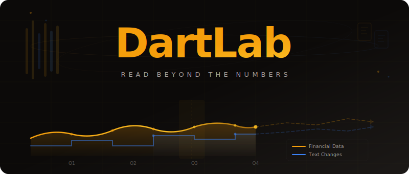

<div align="center">

<br>


<h1>DartLab</h1>
<p><em>Read Beyond the Numbers</em></p>

<picture>
  <source media="(prefers-color-scheme: dark)" srcset=".github/assets/hero.svg">
  <source media="(prefers-color-scheme: light)" srcset=".github/assets/hero.svg">
  
</picture>

<br>

<p>
<a href="https://pypi.org/project/dartlab/"></a>
<a href="https://pypi.org/project/dartlab/"></a>
<a href="LICENSE"></a>
</p>

<p>
<a href="https://eddmpython.github.io/dartlab/">문서</a> ·
<a href="https://github.com/eddmpython/dartlab/releases/tag/data-v1">데이터</a> ·
<a href="https://buymeacoffee.com/eddmpython">Buy Me a Coffee</a>
</p>

</div>

---

DART 공시 문서의 재무제표, 주석, 텍스트를 파싱하고 시계열로 정렬하는 Python 라이브러리.

종목코드 하나로 요약재무정보, 연결재무제표, 배당, 직원, 주주, 부문별 매출, 관계기업, 채무증권, MD&A까지 14개 분석 모듈을 제공한다. 데이터가 로컬에 없으면 GitHub Releases에서 자동으로 다운로드한다.

## 왜 만들었나

DART 공시에는 재무제표 숫자뿐 아니라 사업의 내용, 위험 요인, 감사의견, 소송 현황, 지배구조 변동 같은 텍스트 정보가 함께 들어있다. 대부분의 도구는 숫자만 뽑아간다. 나머지는 버려진다.

DartLab은 숫자와 텍스트를 모두 추출한다. 분기/반기/사업보고서를 하나의 시간축 위에 정렬하고, 계정명이 바뀌어도 같은 계정을 자동으로 추적한다.

## 공시 수평 정렬

DART 공시는 보고서 유형별로 기간이 다르다:

```
         Q1        Q2        Q3        Q4
1분기    ████░░░░░░░░░░░░░░░░░░░░░░░░░░
반기     ████████████░░░░░░░░░░░░░░░░░░
3분기    ██████████████████████░░░░░░░░░
사업     ████████████████████████████████
```

1분기 보고서는 Q1만, 반기는 Q1+Q2 누적, 사업보고서는 1년 전체를 담고 있다. DartLab은 이 누적 구조에서 개별 분기 실적을 역산하고, 보고서 간 계정명이 바뀌어도 같은 계정을 추적한다 (Bridge Matching).

## 설치

```bash
pip install dartlab
```

```bash
uv add dartlab
```

의존성은 Polars 하나.

## 빠른 시작

### Company 클래스

모든 분석의 진입점. 종목코드를 넣으면 데이터를 자동으로 로드한다 (로컬에 없으면 다운로드).

```python
from dartlab import Company

samsung = Company("005930")
samsung.corpName  # "삼성전자"
```

### 요약 재무정보

```python
result = samsung.analyze()

result.FS    # 전체 재무제표 시계열 (Polars DataFrame)
result.BS    # 재무상태표
result.IS    # 손익계산서
```

### 연결 재무제표

```python
result = samsung.statements()

result.BS    # 재무상태표 상세
result.IS    # 손익계산서 상세
result.CF    # 현금흐름표
```

### 배당

```python
result = samsung.dividend()
result.timeSeries  # year, dps, payoutRatio, dividendYield, ...
```

### 직원 현황

```python
result = samsung.employee()
result.timeSeries  # year, totalEmployees, avgSalary, avgTenure, ...
```

### 최대주주

```python
result = samsung.majorHolder()
result.majorHolder   # "이재용"
result.majorRatio    # 20.76
result.timeSeries    # 지분율 시계열
```

### 함수 직접 호출

Company를 거치지 않고 모듈 함수를 직접 호출할 수도 있다.

```python
from dartlab.finance.summary import analyze
from dartlab.finance.statements import statements
from dartlab.finance.dividend import dividend

result = analyze("005930")
result = statements("005930")
result = dividend("005930")
```

## 전체 API

### 재무제표

| 모듈 | 함수 | Company 메서드 | 설명 |
|------|------|------|------|
| `finance.summary` | `analyze(stockCode)` | `.analyze()` | 요약재무정보 시계열, Bridge Matching |
| `finance.statements` | `statements(stockCode)` | `.statements()` | 연결재무제표 BS, IS, CF |
| `finance.segment` | `segments(stockCode)` | `.segments()` | 부문별 매출 |
| `finance.costByNature` | `costByNature(stockCode)` | `.costByNature()` | 비용의 성격별 분류 |

### 주주/자본

| 모듈 | 함수 | Company 메서드 | 설명 |
|------|------|------|------|
| `finance.majorHolder` | `majorHolder(stockCode)` | `.majorHolder()` | 최대주주 지분율, 특수관계인 |
| `finance.majorHolder` | `holderOverview(stockCode)` | `.holderOverview()` | 5% 이상 주주, 소액주주, 의결권 |
| `finance.shareCapital` | `shareCapital(stockCode)` | `.shareCapital()` | 발행주식, 자기주식, 유통주식 |

### 사업 현황

| 모듈 | 함수 | Company 메서드 | 설명 |
|------|------|------|------|
| `finance.dividend` | `dividend(stockCode)` | `.dividend()` | DPS, 배당성향, 배당수익률 |
| `finance.employee` | `employee(stockCode)` | `.employee()` | 직원수, 평균연봉, 근속연수 |
| `finance.subsidiary` | `subsidiary(stockCode)` | `.subsidiary()` | 타법인 출자 현황 |
| `finance.affiliate` | `affiliates(stockCode)` | `.affiliates()` | 관계기업/공동기업 투자 |
| `finance.bond` | `bond(stockCode)` | `.bond()` | 채무증권 발행실적 |
| `finance.rawMaterial` | `rawMaterial(stockCode)` | `.rawMaterial()` | 원재료, 유형자산, 설비투자 |

### 텍스트

| 모듈 | 함수 | Company 메서드 | 설명 |
|------|------|------|------|
| `finance.mdna` | `mdna(stockCode)` | `.mdna()` | 이사의 경영진단 및 분석의견 |

### 유틸리티

| 함수 | 설명 |
|------|------|
| `Company.status()` | 로컬에 보유한 전체 종목 인덱스 |
| `company.docs()` | 해당 종목의 공시 목록 + DART 뷰어 링크 |
| `core.loadData(stockCode)` | Parquet 로드 (없으면 자동 다운로드) |
| `core.downloadAll()` | 전체 데이터 일괄 다운로드 |

모든 분석 함수는 종목코드(6자리)를 받아서 Result 객체를 반환한다. 데이터가 부족하면 `None`을 반환한다.

## Bridge Matching

핵심 알고리즘. 인접한 두 기간의 재무제표에서 같은 계정을 자동으로 연결한다.

K-IFRS 개정, 기업 구조 변경 등으로 계정명이 바뀌어도 금액과 명칭 유사도를 조합해서 추적한다.

```
2022                    2023                    2024
매출액 ──────────────── 매출액 ──────────────── 수익(매출액)
영업이익 ────────────── 영업이익 ────────────── 영업이익
당기순이익 ──────────── 당기순이익 ──────────── 당기순이익(손실)
```

4단계 매칭:

1. **정확 매칭**: 금액이 동일한 계정 연결
2. **재작성 매칭**: 소수점 오차(0.5 이내) 허용
3. **명칭 변경 매칭**: 금액 오차 5% 이내 + 명칭 유사도 60% 이상
4. **특수 항목 매칭**: 주당이익(EPS) 등 소수점 단위 항목

매칭률이 85% 이하로 떨어지면 전환점(breakpoint)으로 판정하고 구간을 분리한다.

## 데이터

각 Parquet 파일에는 하나의 기업에 대한 모든 공시 문서가 들어있다:

- 메타데이터: 종목코드, 회사명, 보고서 유형, 제출일, 사업연도
- 정량 데이터: 요약재무정보, 재무제표 본문, 주석
- 텍스트 데이터: 사업의 내용, 감사의견, 위험관리, 임원/주주 현황

[GitHub Releases](https://github.com/eddmpython/dartlab/releases/tag/data-v1)에 260개 이상의 상장 기업 데이터가 있다. `loadData()`는 로컬에 파일이 없으면 자동으로 다운로드한다.

```python
from dartlab.core import downloadAll

downloadAll()  # 전체 데이터 일괄 다운로드
```

## 로드맵

- [x] 요약재무정보 시계열 (Bridge Matching)
- [x] 연결재무제표 BS, IS, CF
- [x] 부문별 매출, 관계기업, 배당, 직원, 주주, 자회사
- [x] 채무증권, MD&A, 비용 성격별 분류, 원재료/설비투자
- [x] Company 통합 인터페이스
- [ ] 텍스트 섹션 시계열 정렬 및 diff
- [ ] 정량 + 정성 교차 검증
- [ ] 시각화

## 지원

<a href="https://buymeacoffee.com/eddmpython">
  
</a>

## 라이선스

MIT License
