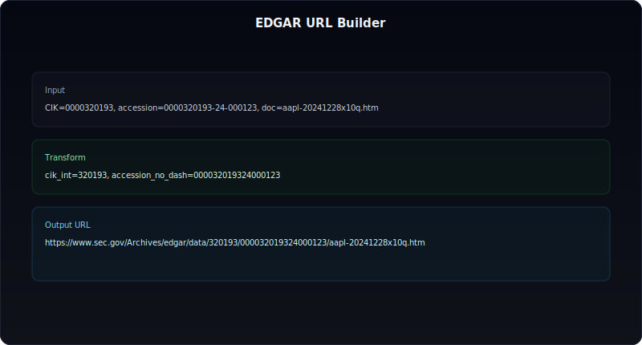

# EDGAR 개별공시 원문, API로 어디까지 가져올 수 있나

EDGAR를 쓸 때 가장 흔한 오해가 있다.

"EDGAR API는 숫자 데이터만 주고, 공시 원문은 못 가져오는 거 아닌가?"

반은 맞고, 반은 틀리다.

숫자(XBRL) API는 따로 있고, 개별 공시 원문은 **submissions 메타데이터 + Archives 경로**를 조합해서 가져온다.

핵심은 "엔드포인트 하나"가 아니라 "접근 경로를 조립하는 방식"이다.


---

## 먼저 정리: EDGAR 데이터는 2층 구조다

### 1층: 구조화 데이터(숫자 중심)

- `companyfacts`
- `companyconcept`
- `frames`

이 레이어는 재무 숫자 분석에 강하다.

### 2층: filing 원문(문서 중심)

- 10-K, 10-Q, 8-K, 20-F, 6-K 각각의 HTML/TXT 원문
- 부속 문서(exhibits) 포함

이 레이어가 있어야 "숫자의 원인"을 읽을 수 있다.

즉, XBRL만 보면 결과가 보이고, 원문까지 보면 맥락이 보인다.

---

## 개별 공시 원문을 가져오는 정석 흐름

### Step 1) CIK 기준 submissions 조회

회사별 제출 이력은 아래 JSON에서 시작한다.

```text
https://data.sec.gov/submissions/CIK##########.json
```

예시(애플):

```text
https://data.sec.gov/submissions/CIK0000320193.json
```

여기서 form, accessionNumber, primaryDocument를 확보한다.

### Step 2) 원하는 form 필터링

예: `8-K`만 필터링해서 최근 공시 목록 추출.

### Step 3) Archives 원문 URL 조립

URL 규칙:

```text
https://www.sec.gov/Archives/edgar/data/{CIK_NO_LEADING_ZERO}/{ACCESSION_NO_DASH}/{PRIMARY_DOCUMENT}
```

예시:

- CIK: `0000320193` -> `320193`
- accession: `0000320193-24-000123` -> `000032019324000123`
- primaryDocument: `aapl-20241228x10q.htm`

조립 결과:

```text
https://www.sec.gov/Archives/edgar/data/320193/000032019324000123/aapl-20241228x10q.htm
```



---

## 파이썬으로 최소 구현하기

아래 코드는 "최근 8-K 3개 원문 URL 만들기"에 집중한 최소 예제다.

```python
import requests


def fetch_submissions(cik: str) -> dict:
    cik = cik.zfill(10)
    url = f"https://data.sec.gov/submissions/CIK{cik}.json"
    headers = {
        "User-Agent": "DartLab-Research/1.0 (contact: your-email@example.com)",
        "Accept-Encoding": "gzip, deflate",
    }
    resp = requests.get(url, headers=headers, timeout=30)
    resp.raise_for_status()
    return resp.json()


def build_filing_url(cik: str, accession: str, primary_document: str) -> str:
    cik_int = str(int(cik))
    accession_no_dash = accession.replace("-", "")
    return (
        f"https://www.sec.gov/Archives/edgar/data/{cik_int}/"
        f"{accession_no_dash}/{primary_document}"
    )


def latest_form_urls(cik: str, form: str, limit: int = 3) -> list[str]:
    data = fetch_submissions(cik)
    recent = data.get("filings", {}).get("recent", {})

    forms = recent.get("form", [])
    accessions = recent.get("accessionNumber", [])
    documents = recent.get("primaryDocument", [])

    result = []
    for f, acc, doc in zip(forms, accessions, documents):
        if f == form:
            result.append(build_filing_url(cik, acc, doc))
        if len(result) >= limit:
            break
    return result


if __name__ == "__main__":
    cik = "0000320193"  # Apple
    urls = latest_form_urls(cik, "8-K", limit=3)
    for i, url in enumerate(urls, start=1):
        print(f"{i}. {url}")
```

복사해서 바로 실행 가능하고, 핵심은 세 줄이다.

- submissions 조회
- form 필터링
- URL 조립

---

## 실제 운영에서 자주 깨지는 지점

### 1) User-Agent를 빈 값으로 보내는 경우

SEC 접근 정책상 식별 가능한 User-Agent를 쓰는 게 안전하다.

### 2) accession에서 대시를 안 지우는 경우

Archives 경로 조립 시 대시 제거가 필수다.

### 3) CIK 앞자리 0 처리 혼동

- submissions 요청: 10자리 zero-padding
- Archives 경로: 정수화된 CIK 사용

### 4) 원문 파싱 전에 인코딩/문서형식 미확인

primaryDocument가 `.htm`일 수도 있고 `.txt`일 수도 있다. 파서 분기 설계가 필요하다.

---

## 10-K/10-Q/8-K/20-F/6-K 수집 전략

form별로 수집 목적을 나눠야 파이프라인이 안정적이다.

| form | 수집 목적 | 권장 처리 |
|------|-----------|-----------|
| 10-K / 20-F | 연간 기준선 | 버전 관리 + 섹션 인덱싱 |
| 10-Q | 분기 변화 추적 | 기준선 대비 diff 중심 |
| 8-K / 6-K | 이벤트 감지 | 시계열 이벤트 로그화 |

핵심은 파일을 쌓는 게 아니라, **문서 역할별 저장 전략**을 다르게 가져가는 것이다.

---

## rate limit/운영 안정성 체크리스트


- [ ] 요청 간 간격(throttling) 적용
- [ ] 재시도(backoff) 정책 적용
- [ ] submissions delta 수집(증분 업데이트) 우선
- [ ] 원문 저장 시 원본 URL + accession + fetchedAt 함께 보존
- [ ] HTML 파싱 실패 시 raw 파일 백업 경로 유지

수집 파이프라인에서 제일 비싼 건 다운로드가 아니라 재현 불가능성이다.

---

## FAQ

### Q1. EDGAR API만으로 원문 전체를 JSON으로 받을 수 있나?

일반적으로 아니다. 메타데이터(JSON)로 경로를 얻고, 원문은 Archives에서 파일 단위로 가져오는 방식이 기본이다.

### Q2. 8-K 원문도 동일 방식으로 받나?

받는다. form 필터만 `8-K`로 바꿔 같은 흐름으로 처리하면 된다.

### Q3. 6-K도 같은 코드로 되나?

된다. 다만 외국기업 공시는 본국 발표 맥락과 함께 읽어야 해석 오류가 줄어든다.

### Q4. 정량 데이터와 원문은 어느 쪽이 먼저인가?

목적에 따라 다르지만, 이벤트 해석이 필요하면 원문을 먼저 보고 숫자로 검증하는 흐름이 효율적이다.

---

## 정리

EDGAR에서 개별 공시 원문은 "못 가져오는 데이터"가 아니라 "경로를 조립해야 하는 데이터"다.

submissions JSON에서 accession과 primaryDocument를 꺼내 Archives URL을 만들면, 10-K/10-Q/8-K/20-F/6-K 원문까지 안정적으로 가져올 수 있다.

결국 분석 품질을 바꾸는 건 API 개수보다, 원문과 숫자를 연결하는 파이프라인 설계다.
