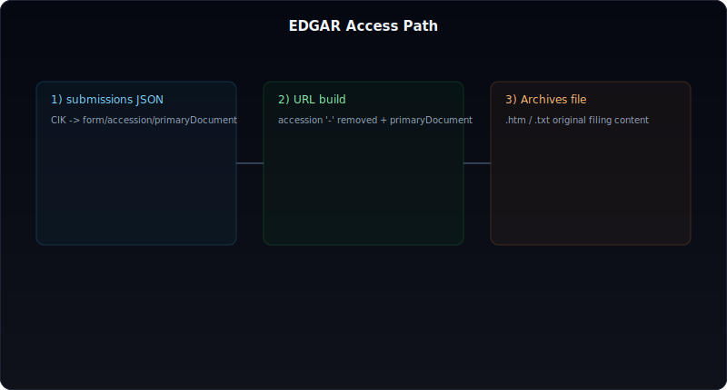
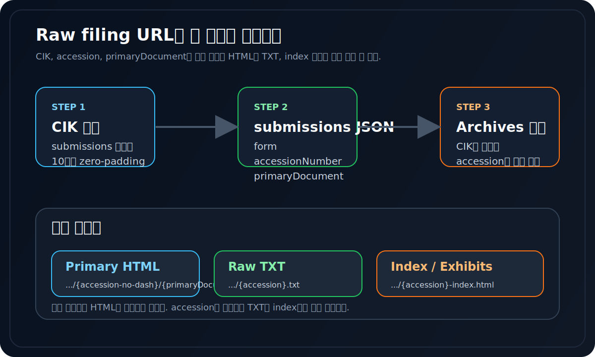
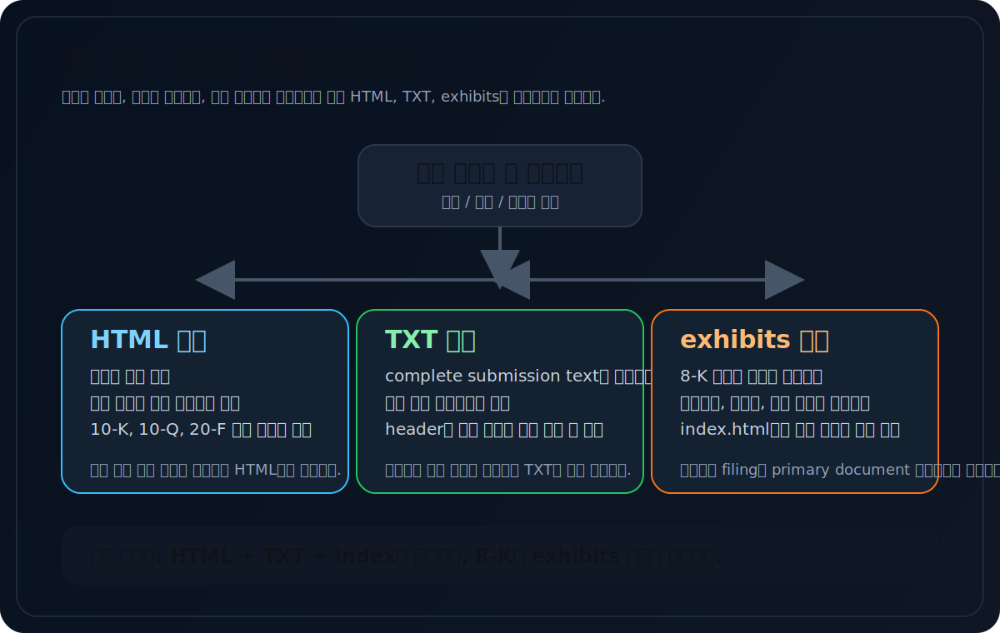
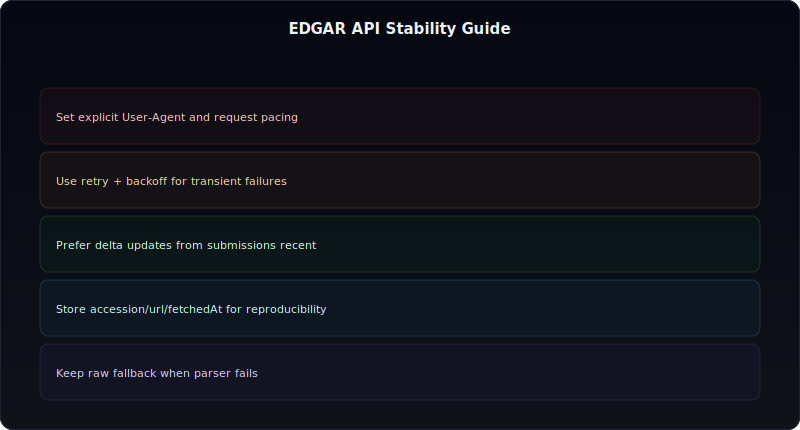

# EDGAR 개별공시 원문, API로 어디까지 가져올 수 있나

EDGAR를 처음 만지는 사람에게 가장 흔한 오해가 있다.

"EDGAR API는 숫자 JSON만 주고, 개별 공시 원문은 못 가져오는 것 아닌가?"

정확히는 그렇지 않다. **원문은 "한 엔드포인트에서 바로 받는 데이터"가 아니라, submissions 메타데이터로 경로를 조립해서 가져오는 데이터**다. 그래서 개별 공시 원문 접근은 "불가능"의 문제가 아니라 "경로를 어떻게 끝까지 추적하느냐"의 문제에 가깝다.

이 글은 `companyfacts` 같은 숫자 API 설명을 반복하지 않는다. 대신 **CIK -> submissions JSON -> accession -> primaryDocument -> Archives 경로**까지 이어지는 실전 흐름을 정리한다. raw filing 수집기를 실제로 만들려는 사람 기준으로 쓴 글이라고 보면 된다.



---

## 먼저 답: EDGAR 원문은 "메타데이터 + 경로 조립"으로 가져온다

핵심만 먼저 적으면 이렇다.

1. 회사별 submissions JSON을 조회한다.
2. 거기서 form, accessionNumber, primaryDocument를 뽑는다.
3. `Archives/edgar/data/{cik}/{accession-no-dash}/{primaryDocument}` 형태로 URL을 만든다.
4. 필요하면 같은 디렉터리의 raw TXT, index.html, exhibits까지 따라간다.

즉 EDGAR 개별공시 원문은 `API 응답 그 자체`가 아니라 **API가 알려주는 좌표를 따라가서 여는 문서**다. 그래서 이 구조를 이해하면 10-K, 10-Q, 8-K, 20-F, 6-K를 모두 같은 프레임으로 다룰 수 있다.

## 공식 문서 기준으로 봐도 EDGAR는 두 층으로 나뉜다

SEC 공식 문서는 EDGAR 접근을 크게 두 층으로 설명한다.

- `data.sec.gov`의 JSON API
- `sec.gov/Archives/...`의 filing 원문과 아카이브 디렉터리

JSON API는 submissions history와 XBRL 데이터를 제공하고, 아카이브 디렉터리는 실제 filing 문서와 제출 파일 묶음을 제공한다. 실무 수집기에서는 둘 중 하나만으로 끝나지 않는다.

| 레이어 | 얻는 것 | 강점 | 한계 |
| --- | --- | --- | --- |
| submissions JSON | form, accession, primaryDocument, filing date | 빠른 목록화, 증분 수집 | 원문 자체는 아니다 |
| companyfacts / companyconcept | 구조화 숫자 | 비교와 스크리닝 | 공시 맥락이 없다 |
| Archives HTML | 사람이 읽기 좋은 원문 | 문맥 파악 | 파싱 분기가 필요하다 |
| Archives TXT | complete submission text | 원형 보존, 백업, 재현성 | 사람이 읽기엔 불편하다 |
| exhibits | 계약서, 보도자료, 첨부 문서 | 이벤트 해석 심화 | 어떤 파일을 저장할지 설계가 필요하다 |

그래서 raw filing 수집을 한다면 숫자 API 설명만 반복하는 건 충분하지 않다. **메타데이터 레이어와 파일 레이어를 같이 설계해야 한다.**

## CIK, accession, primaryDocument 세 개를 끝까지 들고 가야 한다

원문 접근에서 가장 중요한 것은 세 필드를 잃어버리지 않는 것이다.

- `CIK`
- `accessionNumber`
- `primaryDocument`

이 셋이 있어야 개별 공시 원문 경로를 안정적으로 만들 수 있다.

SEC 공식 API 문서 기준으로 submissions endpoint는 `CIK##########.json` 형식을 사용한다. 여기서 CIK는 **10자리 zero-padding** 형태로 넣는다. 반면 Archives 경로에서는 보통 정수형 CIK와 **대시를 제거한 accession**을 쓴다.



이 차이를 헷갈리면 URL이 바로 깨진다.

| 항목 | submissions 요청 | Archives 경로 |
| --- | --- | --- |
| CIK | 10자리 zero-padding | leading zero 제거한 정수형 |
| accession | 원본 형태 유지 | 대시 제거 |
| primaryDocument | JSON에 있는 파일명 사용 | 그대로 사용 |

예를 들어 애플을 보면:

- CIK: `0000320193`
- Archives 경로용 CIK: `320193`
- accession: `0000320193-24-000123`
- accession without dashes: `000032019324000123`
- primaryDocument: `aapl-20241228x10q.htm`

이렇게 조합하면 최종 문서 URL이 만들어진다.

## submissions JSON에서 recent만 보면 충분한가

아니다. "가장 최근 몇 건만 본다"면 `filings.recent`만으로도 충분할 때가 많다. 하지만 히스토리를 더 길게 모으려면 recent만 보는 구조는 금방 한계가 온다.

SEC API 문서 기준으로 submissions JSON은:

- 최소 1년치 또는 최근 1,000건 이상의 filing
- 그보다 오래된 filing이 있으면 `files` 배열에 추가 JSON 파일 경로

를 담을 수 있다.

즉 실전 수집기라면 이렇게 나눠야 한다.

- 모니터링/증분 업데이트: `filings.recent`
- 장기 히스토리 수집: `filings.files`까지 추적

이걸 놓치면 "최근 filing은 잘 받는데 옛날 filing이 빠진 데이터셋"이 생긴다. 이벤트 감지 정도라면 괜찮지만, 장기 원문 데이터셋을 만들 생각이라면 부족하다.

## 최소 구현은 생각보다 단순하다

핵심 구현은 생각보다 짧다. 중요한 건 코드 길이가 아니라, 어떤 메타데이터를 버리지 않는지다.

```python
import requests


HEADERS = {
    "User-Agent": "DartLab-Research your-email@example.com",
    "Accept-Encoding": "gzip, deflate",
}


def fetch_submissions(cik: str) -> dict:
    cik10 = cik.zfill(10)
    url = f"https://data.sec.gov/submissions/CIK{cik10}.json"
    resp = requests.get(url, headers=HEADERS, timeout=30)
    resp.raise_for_status()
    return resp.json()


def build_archive_paths(cik: str, accession: str, primary_document: str) -> dict[str, str]:
    cik_int = str(int(cik))
    accession_no_dash = accession.replace("-", "")
    base_dir = f"https://www.sec.gov/Archives/edgar/data/{cik_int}/{accession_no_dash}"
    return {
        "base_dir": base_dir,
        "primary_html": f"{base_dir}/{primary_document}",
        "raw_txt": f"https://www.sec.gov/Archives/edgar/data/{cik_int}/{accession}.txt",
        "index_html": f"https://www.sec.gov/Archives/edgar/data/{cik_int}/{accession}-index.html",
    }


def latest_filing_records(cik: str, form: str, limit: int = 3) -> list[dict]:
    data = fetch_submissions(cik)
    recent = data.get("filings", {}).get("recent", {})

    result = []
    for filing_form, accession, primary_document, filing_date in zip(
        recent.get("form", []),
        recent.get("accessionNumber", []),
        recent.get("primaryDocument", []),
        recent.get("filingDate", []),
    ):
        if filing_form != form:
            continue
        paths = build_archive_paths(cik, accession, primary_document)
        result.append(
            {
                "form": filing_form,
                "filing_date": filing_date,
                "accession": accession,
                "primary_document": primary_document,
                **paths,
            }
        )
        if len(result) >= limit:
            break
    return result


if __name__ == "__main__":
    for row in latest_filing_records("0000320193", "8-K", limit=3):
        print(row["filing_date"], row["primary_html"])
```

이 코드에서 진짜 중요한 것은 `primary_html`보다도, `accession`, `raw_txt`, `index_html`을 같이 저장한다는 점이다. 그래야 나중에 재수집, 파싱 실패 복구, 첨부 문서 추적이 쉬워진다.


## HTML, TXT, exhibits는 각각 언제 쓰나

원문 수집을 할 때 가장 흔한 비효율은 모든 filing을 같은 방식으로 저장하려는 것이다. 하지만 실제로는 목적이 다르면 저장 전략도 달라져야 한다.



### HTML이 먼저 필요한 경우

- 사람이 읽을 문맥을 빨리 확인하고 싶다
- 섹션 제목, 표, 본문 흐름을 유지하고 싶다
- 10-K, 10-Q, 20-F처럼 본문 읽기가 중요하다

### TXT가 먼저 필요한 경우

- complete submission text를 원형 그대로 보존하고 싶다
- 파서 실패 시 재현 가능한 백업이 필요하다
- filing header와 제출 전체를 한 파일로 보관하고 싶다

### exhibits까지 따라가야 하는 경우

- 8-K 이벤트를 해석해야 한다
- 계약서, 보도자료, 투자설명 자료가 중요하다
- primaryDocument 하나만으로 정보가 부족하다

즉 raw filing 수집에서 정답은 하나가 아니다. **읽기 목적이면 HTML, 보존과 재현성이 중요하면 TXT, 이벤트 해석이면 exhibits**가 더 중요해진다.

## 운영용 수집기라면 메타데이터를 이렇게 남기는 편이 낫다

실제 운영에서 제일 비싼 비용은 다운로드가 아니라 "나중에 왜 이 파일을 받았는지 설명을 못 하는 것"이다.

그래서 row를 저장할 때 아래 필드를 기본으로 남기는 편이 좋다.

- cik
- company_name
- form
- filing_date
- accepted_date 또는 filed date
- accession
- primary_document
- primary_html_url
- raw_txt_url
- index_html_url
- fetched_at
- source_endpoint

이렇게 해 두면:

- 나중에 다른 파서로 다시 돌릴 수 있고
- 같은 filing을 재수집할 때 중복을 피할 수 있고
- 특정 form만 따로 다시 모을 수 있고
- 원문 URL이 바뀌었는지, 파싱이 깨졌는지 추적하기 쉬워진다

좋은 수집기는 많이 받는 수집기가 아니라, **나중에 다시 설명 가능한 수집기**다.

## 증분 업데이트는 recent + accession 기준으로 잡는 편이 안전하다

개별공시 원문 수집을 운영 환경에 올리면 결국 중요한 건 증분 업데이트다. 여기서 자주 망하는 패턴은 "최근 3개만 다시 받아 보기" 같은 느슨한 방식이다.

더 안전한 기본형은 이렇다.

1. submissions JSON을 다시 조회한다.
2. recent 배열에서 form, filing date, accession을 읽는다.
3. 기존에 저장한 accession과 비교한다.
4. 새 accession만 다운로드한다.
5. 기존 accession인데 primaryDocument나 파일 목록이 달라졌는지 필요 시 재검증한다.

SEC 공식 안내 기준으로 submissions API는 real-time에 가깝게 갱신되고, EDGAR 접근은 fair access를 위해 **user-agent 선언**과 **과한 요청 속도 회피**가 중요하다. 운영에서는 무작정 병렬 요청을 늘리기보다 accession 단위 증분 수집이 훨씬 안전하다.

## 실제 운영에서 자주 깨지는 지점

### 1. User-Agent를 비워 둔다

SEC는 자동 접근 시 식별 가능한 user-agent 선언을 요구한다. 이걸 비워 두면 차단이나 불안정 동작으로 이어질 수 있다.

### 2. CIK zero-padding과 Archives 경로용 CIK를 혼동한다

submissions 요청에서는 `0000320193`이지만, Archives 디렉터리에서는 `320193`을 쓴다.

### 3. accession 대시 제거를 빼먹는다

이건 가장 흔한 URL 조립 오류다.

### 4. raw TXT를 저장하지 않는다

HTML 파싱이 실패했을 때 되돌아갈 원본이 없어진다.

### 5. primaryDocument만 저장하고 index.html을 버린다

나중에 exhibits를 따라가야 할 때 다시 처음부터 수집하게 된다.

### 6. recent만 보고 오래된 filing은 없는 줄 안다

장기 히스토리를 만들 땐 `files` 배열까지 봐야 한다.

## 운영 체크리스트



- submissions 요청에 식별 가능한 `User-Agent`를 넣었는가
- CIK 10자리 요청과 Archives 경로 CIK를 구분했는가
- accession without dashes를 정확히 만들었는가
- `primary_html`, `raw_txt`, `index_html`을 같이 저장하는가
- recent와 accession 비교로 증분 수집하는가
- exhibits가 중요한 form은 별도 분기로 처리하는가

## FAQ

### EDGAR에서 원문 전체를 JSON으로 바로 받을 수 있나

보통은 아니다. JSON은 메타데이터와 숫자 레이어에 가깝고, 원문은 Archives 경로를 따라가서 파일 단위로 받는다.

### 8-K 원문도 같은 방식으로 받나

받는다. form만 `8-K`로 바뀔 뿐, 기본 구조는 같다.

### raw TXT는 꼭 저장해야 하나

강하게 권한다. complete submission text는 파서 실패 복구와 원형 보존에 유리하다.

### 오래된 filing까지 전부 모으려면 recent만 보면 안 되나

안 된다. 장기 히스토리를 모으려면 submissions JSON의 추가 파일 경로도 같이 봐야 한다.

### 요청 속도는 어느 정도가 안전한가

SEC 안내 기준으로 현재 최대 요청 속도는 초당 10회다. 다만 실무에서는 그보다 여유 있게 운영하는 편이 안전하다.

## 같이 읽으면 좋은 글

- [EDGAR의 모든 것](/dartlab/blog/everything-about-edgar)
- [10-K, 10-Q, 8-K, 20-F, 6-K, 13F를 한 번에 읽는 법](/blog/edgar-integrated-playbook)
- [8-K item map 읽는 법](/blog/8k-item-map)
- [XBRL 재무제표 원문과 주석 다운로드 파이프라인](/blog/opendart-xbrl-notes-pipeline)

## 참고한 공식 자료

- SEC EDGAR Application Programming Interfaces (APIs): https://www.sec.gov/search-filings/edgar-application-programming-interfaces
- SEC Accessing EDGAR Data: https://www.sec.gov/search-filings/edgar-search-assistance/accessing-edgar-data
- SEC Developer Resources: https://www.sec.gov/about/developer-resources

## 정리

EDGAR 개별공시 원문은 "없어서 못 받는 데이터"가 아니라, **메타데이터를 끝까지 추적해야 받을 수 있는 데이터**다.

핵심은 세 가지다. `CIK`, `accession`, `primaryDocument`를 끝까지 들고 가는 것, `HTML/TXT/index`를 역할에 따라 같이 저장하는 것, 그리고 accession 기준으로 증분 수집하는 것이다.

이 구조만 잡으면 EDGAR raw filing 수집은 갑자기 복잡한 일이 아니라, 재현 가능한 파이프라인 설계 문제로 바뀐다.
