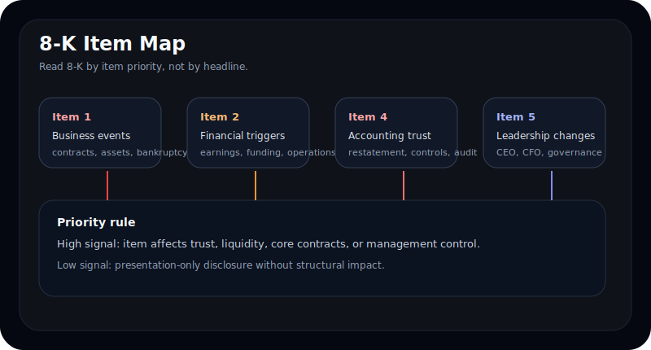
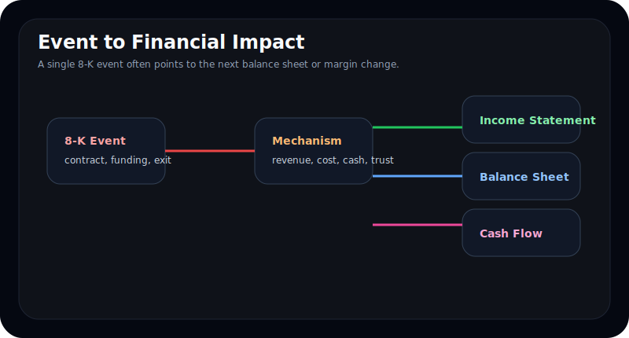
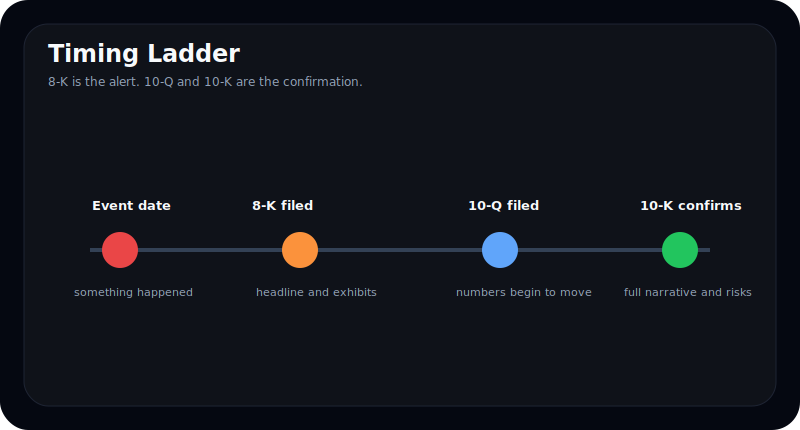
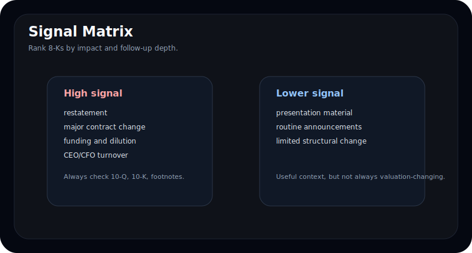
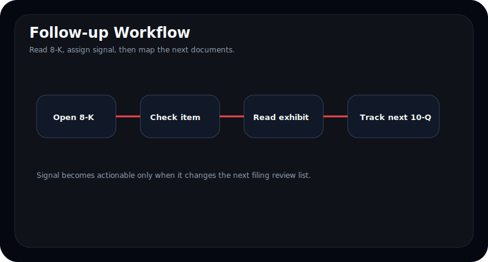

# 8-K item map 읽는 법

미국 공시를 읽을 때 많은 투자자는 10-K와 10-Q만 본다. 하지만 실제로 시장이 먼저 반응하는 문서는 종종 **8-K**다.

8-K는 "무슨 일이 있었다"는 사실을 가장 먼저 알리는 SEC 수시공시다. 문제는 대부분의 독자가 8-K를 하나의 문서 종류로만 보고, 안에 들어 있는 **item 번호**를 구조적으로 읽지 않는다는 점이다. item 번호를 읽기 시작하면 8-K는 단순 속보가 아니라 `다음 숫자를 예고하는 지도`가 된다.

이 글은 8-K를 단순 이벤트 공시가 아니라 `item 번호 기반 이벤트 지도`로 읽는 방법을 정리한다. 어떤 8-K item이 재무적으로 더 중요한지, 어떤 항목은 노이즈에 가깝고 어떤 항목은 10-Q와 10-K까지 추적해야 하는지 실전 기준으로 설명한다. EDGAR 전체 구조가 먼저 필요하면 [`EDGAR의 모든 것`](/blog/everything-about-edgar), 여러 서식을 한 번에 묶는 감각이 필요하면 [`10-K, 10-Q, 8-K, 20-F, 6-K, 13F를 한 번에 읽는 법`](/blog/edgar-integrated-playbook)을 같이 보면 좋다.

---

## 8-K는 정확히 무엇인가

Form 8-K는 미국 상장사가 중요한 사건을 SEC에 보고할 때 사용하는 현재보고서다. 연간 기준선인 10-K, 분기 업데이트인 10-Q와 달리, 8-K는 **사건 발생 시점**을 중심으로 공개된다.

핵심은 이 문서가 "하나의 서식"이 아니라는 점이다. 8-K 안에는 서로 성격이 다른 이벤트가 들어가고, 그 차이는 item 번호로 구분된다.

| 구분 | 기준 문서 | 질문 |
| --- | --- | --- |
| 10-K | 연간 보고 | 회사의 기본 구조와 리스크는 무엇인가 |
| 10-Q | 분기 보고 | 최근 분기 추세는 어떻게 변했는가 |
| 8-K | 사건 보고 | 지금 무슨 일이 발생했는가 |
| 13F | 보유 공시 | 기관 포지션은 어떻게 변했는가 |

8-K를 잘 읽는다는 것은 문서를 많이 읽는 것이 아니라, **item별 우선순위를 매기는 것**에 가깝다.

---

## 왜 item 번호가 중요한가

8-K는 같은 제목 아래에서도 정보 밀도가 크게 다르다. 어떤 item은 실적과 밸류에이션에 직결되고, 어떤 item은 확인은 필요하지만 시장 영향이 작다.

예를 들어 경영진 교체, 재무제표 신뢰성 문제, 대규모 계약 해지, 자금조달 구조 변화는 후속 분기 손익과 현금흐름에 직접 연결될 수 있다. 반면 단순 전시자료 제공이나 반복적 공지 성격의 공시는 신호 강도가 낮을 수 있다.

다음 표처럼 보면 빠르다.

| item 성격 | 대표 사례 | 해석 우선순위 |
| --- | --- | --- |
| 재무 신뢰성 | 재무제표 재작성, 회계 오류 | 매우 높음 |
| 경영/지배구조 | CEO, CFO 교체 | 높음 |
| 사업 이벤트 | 대규모 계약 체결/해지, 자산 양수도 | 높음 |
| 자금조달 | 차입, 증권 발행, 유동성 변화 | 높음 |
| 공시 보조 | IR 자료 제출, 설명 보강 | 낮음~중간 |

좋은 질문은 "8-K가 나왔는가"가 아니라 "이 item이 어떤 숫자를 바꿀 수 있는가"다.

---

## 8-K를 처음 열면 무엇부터 봐야 하나

실전에서는 아래 순서가 가장 효율적이다.

1. 제출일보다 **사건 발생일**을 먼저 본다
2. item 번호를 확인한다
3. 본문보다 먼저 첨부 자료(exhibit) 존재를 확인한다
4. 이 사건이 다음 10-Q 또는 10-K 어디에 반영될지 가정한다

특히 8-K는 "뉴스를 확인하는 문서"가 아니라 **후속 추적 대상을 정하는 문서**로 보는 것이 맞다. 이 습관이 생기면 headline에 덜 휘둘리고, 다음 행동이 더 빨라진다.

---

## 실전에서 자주 보는 고신호 item은 무엇인가

SEC Forms Index와 8-K 가이던스를 기준으로 보면, 아래 계열은 우선순위를 높게 둬야 한다.

### Item 1 계열: 사업과 자산 구조 변화

이 범주는 대규모 계약, 계약 해지, 파산, 자산 취득/처분 같은 사업 구조 변화를 담는다. 재무제표에 반영되기 전에 사업의 방향이 먼저 바뀌는 경우가 많다.

| 포인트 | 왜 중요한가 | 후속 확인 문서 |
| --- | --- | --- |
| 대규모 계약 체결 | 매출 가시성, 고객 의존도 변화 | 10-Q 매출, backlog, MD&A |
| 대규모 계약 해지 | 수요 둔화, 고객 이탈 | 10-Q 매출/마진, Risk Factors |
| 자산 취득/처분 | 포트폴리오 재편, CAPEX 구조 변화 | 10-Q 현금흐름, 10-K 사업 구조 |

### Item 2 계열: 재무와 운영에 직접 닿는 변화

실적 발표, 조달 구조, 비용 구조 변화가 여기에 많이 걸린다. headline만 보면 긍정적으로 보이지만, 부채 조건이나 희석 구조를 같이 읽어야 한다.

### Item 4 계열: 회계와 감사 신뢰성

이 범주는 절대 가볍게 보면 안 된다. 재무제표에 대한 신뢰성, 내부통제, 감사 커뮤니케이션 문제가 드러나는 구간이기 때문이다.

### Item 5 계열: 경영진과 지배구조 변화

사임, 선임, 보수 구조, 규정 변화가 들어온다. 단기 실적보다 **의사결정 체계**의 변화를 보여준다.

즉 8-K의 고신호 item은 대부분 `다음 분기 숫자`나 `다음 연차 서술`을 바꾸는 항목이다.

---

## 고신호와 저신호를 어떻게 구분하나

모든 8-K가 같은 무게를 가지는 것은 아니다. 아래처럼 보면 된다.

| 구분 | 고신호 8-K | 저신호 8-K |
| --- | --- | --- |
| 사건 성격 | 재무 신뢰성, 유동성, 핵심 계약, 경영진 | 전시자료, 반복 공지 |
| 후속 영향 | 다음 분기 숫자에 반영 가능 | IR 해석 보조 수준 |
| 문구 특징 | 조건 변경, 해지, restatement, material | general update, presentation |
| 확인 포인트 | 10-Q, 10-K, footnote, MD&A | 발표자료 요약 정도 |

좋은 질문은 "이 8-K가 중요한가"가 아니라 "이 8-K가 **어느 숫자를 바꿀 가능성이 있는가**"다. 이 질문으로 바꾸면 저신호 공시에 시간을 덜 쓰게 된다.

---

## 8-K 이후에는 무엇을 추적해야 하나

8-K 자체만 읽고 끝내면 절반만 읽은 것이다. 8-K의 진짜 가치는 후속 문서에서 확인된다.

| 8-K 내용 | 다음에 볼 문서 | 추적 포인트 |
| --- | --- | --- |
| 경영진 교체 | 다음 10-Q, 10-K | 전략 변화, 비용 구조, 리스크 서술 변화 |
| 계약 체결/해지 | 10-Q, MD&A | 매출 가시화, 고객 집중도 |
| 자금조달 | 10-Q footnote | 금리, 만기, covenant, 희석 |
| 재작성/통제 문제 | 10-K, 감사의견 | 재무 신뢰성, 통제 개선 여부 |

핵심은 8-K를 독립 문서로 보는 것이 아니라 **다음 문서의 예고편**으로 보는 것이다. 이 점은 [`Risk Factors와 MD&A를 같이 읽는 법`](/blog/risk-factors-and-mdna)과도 닿아 있다. 사건은 먼저 나오고, 영향 설명은 뒤따라 나오기 때문이다.

---

## 숫자가 없어도 중요한 8-K가 있다

많은 투자자는 숫자가 없는 공시는 중요하지 않다고 생각한다. 하지만 8-K는 오히려 숫자가 나오기 전에 구조가 바뀌는 순간을 담는다.

예를 들어:

- CFO가 갑자기 교체됐다
- 대형 고객 계약이 종료됐다
- 차입 조건이 재조정됐다
- 재무제표를 더 이상 신뢰할 수 없다고 밝혔다

이런 신호는 다음 분기 숫자보다 먼저 나오는 경우가 많다. 따라서 8-K는 `실적 해석`보다 앞 단계인 `상황 인지`에 더 강한 문서다. 숫자가 없어도 중요할 수 있다는 감각이 없으면, 진짜 변화는 놓치고 숫자 발표만 뒤늦게 따라가게 된다.

---

## 8-K를 읽을 때 메모로 남겨야 할 것은 무엇인가

초보자에게 가장 유용한 습관은 8-K마다 아래 네 줄을 적는 것이다.

- 사건 발생일은 언제인가
- item 번호는 무엇인가
- 이 사건은 다음에 어떤 숫자를 바꿀 가능성이 있는가
- 다음 10-Q, 10-K, 또는 다른 공시에서 무엇을 확인할 것인가

이 네 줄만 남겨도 8-K는 한 번 읽고 끝나는 속보가 아니라 추적 리스트가 된다. 결국 좋은 8-K 읽기는 정보량보다 `후속 질문 생성 능력`에 가깝다.

---

## 자주 틀리는 해석 4가지

### 1. 8-K는 전부 긴급 악재라고 본다

아니다. 8-K는 사건 보고일 뿐이다. 문제는 사건의 성격이지, 8-K 자체가 아니다.

### 2. item 번호를 안 보고 제목만 본다

가장 흔한 실수다. 제목보다 item과 본문 구조가 중요하다.

### 3. exhibit를 안 본다

정작 중요한 계약 조건, 설명 자료, 발표문은 exhibit에 붙는 경우가 많다.

### 4. 후속 10-Q와 10-K를 안 본다

8-K는 시작점이지 결론이 아니다.

---

## 10분 실전 체크리스트

- 이 8-K의 사건 발생일은 언제인가
- item 번호는 무엇인가
- 이 item은 재무 신뢰성, 사업 구조, 유동성, 경영진 중 어디에 속하는가
- 첨부된 exhibit가 있는가
- 다음 10-Q 또는 10-K에서 어떤 숫자나 문구가 바뀔 가능성이 있는가
- headline과 실제 조항 사이에 온도차가 있는가

---

## FAQ

### 8-K는 악재일 때만 나오나

아니다. 중요한 계약 체결, 경영진 선임, 자금조달, 실적 발표도 8-K로 나온다.

### 8-K와 10-Q 중 무엇이 더 중요한가

역할이 다르다. 8-K는 사건 감지, 10-Q는 숫자 반영 확인에 가깝다.

### 8-K에서 가장 먼저 볼 것은 무엇인가

item 번호와 사건 발생일이다. 그다음 exhibit를 본다.

### 8-K는 실적 발표용으로만 보면 되나

아니다. 경영진 교체, 통제 문제, 계약 해지, 자금조달 구조 변화처럼 더 중요한 신호가 많다.

### 8-K를 읽은 뒤 가장 중요한 후속 문서는 무엇인가

대부분의 경우 다음 10-Q다. 다만 회계 신뢰성 문제는 10-K와 감사 관련 문구까지 봐야 한다.

---

## 참고한 공식 자료

- SEC Forms Index: https://www.sec.gov/submit-filings/forms-index
- SEC Exchange Act Form 8-K Compliance and Disclosure Interpretations: https://www.sec.gov/rules-regulations/staff-guidance/compliance-disclosure-interpretations/exchange-act-form-8-k
- SEC Filings overview: https://www.sec.gov/filings
- Investor.gov How to Read a 10-K: https://www.sec.gov/answers/reada10k.htm

---

## 정리

8-K는 "속보 공시"가 아니라 `item 번호 기반 이벤트 지도`다. 문서를 잘 읽는 사람은 8-K에서 결론을 내리지 않고, 어떤 사건이 어떤 숫자를 바꿀지 먼저 가설을 세운다.

10-K가 회사의 구조를 보여주고, 10-Q가 추세를 보여준다면, 8-K는 그 사이에서 **무슨 일이 막 일어났는지**를 보여준다. 그 차이를 이해하면 EDGAR는 훨씬 입체적으로 읽힌다.
