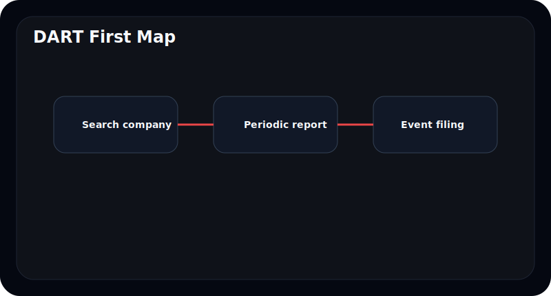
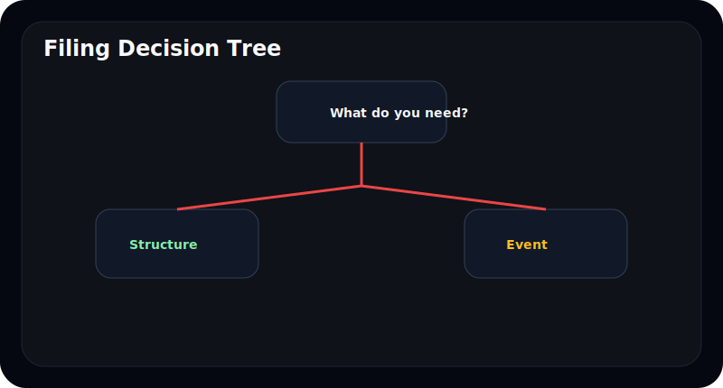
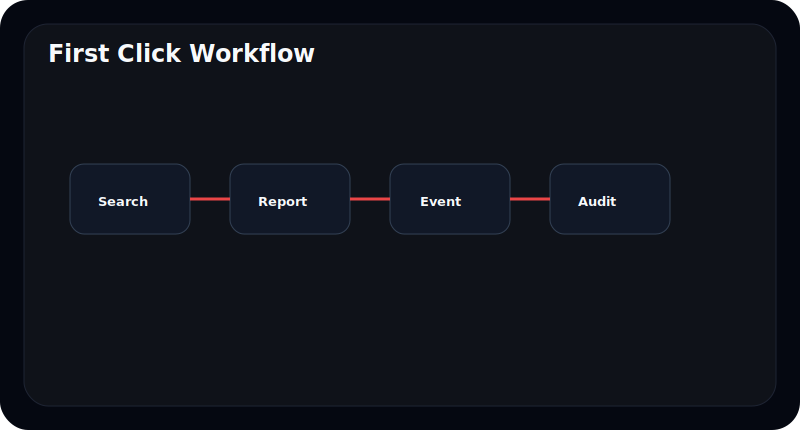
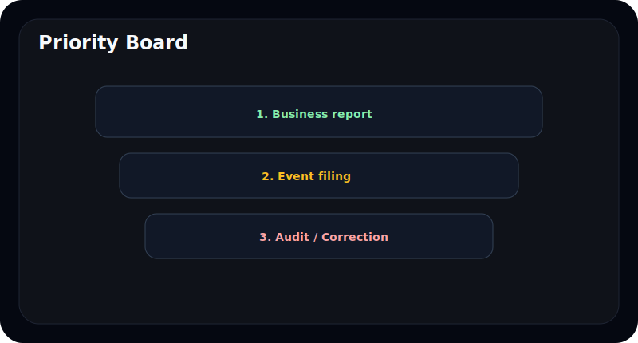
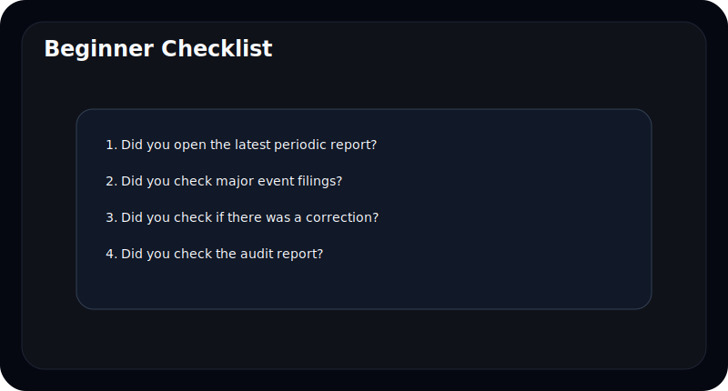

# 공시를 처음 볼 때 DART에서 어디부터 눌러야 하나

DART를 처음 열면 많은 사람이 비슷한 실수를 한다. 검색해서 회사를 찾은 뒤, 가장 위에 있는 최신 제목 하나만 누르고 끝내는 식이다.

하지만 DART는 "최신 제목 하나를 읽는 사이트"가 아니다. **지금 내가 풀고 싶은 질문이 무엇인지에 따라 먼저 눌러야 할 공시가 달라지는 사이트**다. 회사를 처음 공부하는지, 최근 사건을 확인하는지, 숫자의 신뢰성을 보고 싶은지에 따라 출발점이 달라진다.

먼저 답부터 말하면 이렇다.

- 회사를 처음 공부한다면 `최신 사업보고서`
- 최근 사건이 궁금하면 `주요사항보고서`
- 기존 내용이 바뀌었는지 보려면 `정정공시`
- 숫자를 어디까지 믿을지 보려면 `감사보고서`

즉 초보자에게 필요한 것은 "많이 누르는 법"이 아니라 **올바른 첫 클릭**이다.

---

## 먼저 익힐 것: DART는 공시를 종류로 나눠 읽는다

초보자가 DART를 어려워하는 이유는 메뉴가 많아서가 아니다. 서로 다른 성격의 공시가 같은 화면에 섞여 있기 때문이다.

실전에서는 아래 네 종류만 먼저 구분하면 된다.

| 공시 종류 | 무엇을 알려주나 | 언제 먼저 누르나 |
| --- | --- | --- |
| 정기보고서 | 회사의 전체 구조와 연간/분기 기준선 | 회사를 처음 공부할 때 |
| 주요사항보고서 | 큰 사건과 변화 | 최근 무슨 일이 있었는지 볼 때 |
| 정정공시 | 기존 내용의 수정과 보완 | 일정, 조건, 숫자 변경을 확인할 때 |
| 감사보고서 | 재무제표 신뢰성과 핵심감사사항 | 숫자 해석 전 신뢰성을 볼 때 |

여기서 중요한 포인트는 하나다. **"지금 이 회사는 어떤 회사인가"와 "최근 무슨 일이 있었는가"는 다른 공시가 답한다.** 그래서 하나의 제목만 읽고 전체를 안다고 생각하면 거의 항상 놓친다.

## 초보자용 첫 5분 클릭 순서는 이렇게 잡으면 된다

DART를 처음 보는 사람에게 가장 안전한 순서는 아래다.

1. 회사를 검색한다.
2. 최신 `사업보고서` 또는 `분기/반기보고서`를 연다.
3. 최근 `주요사항보고서`가 붙어 있는지 본다.
4. 같은 기간에 `정정공시`가 있는지 확인한다.
5. 필요하면 `감사보고서`를 연다.

이 순서가 좋은 이유는 명확하다.

- 정기보고서로 회사의 기본 구조를 잡는다.
- 주요사항보고서로 최근 사건을 붙인다.
- 정정공시로 기존 정보가 바뀌었는지 본다.
- 감사보고서로 숫자의 신뢰성을 보정한다.

즉 DART 읽기는 제목 순이 아니라 **구조 -> 사건 -> 수정 -> 신뢰성** 순서에 가깝다.

## 검색 결과 목록에서는 제목보다 먼저 무엇을 봐야 하나

DART를 검색했을 때 초보자가 가장 많이 보는 것은 제목이다. 하지만 실제로는 제목보다 먼저 확인해야 할 정보가 있다.

- 보고서 종류가 정기보고서인지 주요사항보고서인지
- 제출일이 언제인지
- 정정 여부가 붙었는지
- 같은 날 비슷한 공시가 여러 건인지

예를 들어 `사업보고서`, `감사보고서`, `주주총회소집공고`가 같은 시기에 몰려 있으면 그 회사는 정기보고서 시즌일 가능성이 높다. 반대로 `주요사항보고서(유상증자결정)`와 `정정`이 붙어 있으면 사건성 공시 흐름으로 봐야 한다.

즉 검색 결과는 "무슨 제목을 읽을까"보다, **"지금 이 회사가 정기 시즌에 있는지, 이벤트 시즌에 있는지"를 먼저 보여주는 판넬**처럼 보는 편이 좋다.

## 사업보고서는 왜 거의 항상 첫 출발점이 되나

회사를 처음 볼 때는 보통 사업보고서가 가장 좋다. 이유는 이 문서 하나에 회사의 기본 상태가 가장 넓게 들어 있기 때문이다.

사업보고서에서는 보통 아래를 한 번에 잡을 수 있다.

- 무슨 사업을 하는가
- 매출과 비용 구조가 어떤가
- 주요 리스크는 무엇인가
- 재무제표와 주석은 어떤가
- 대주주와 특수관계자는 어떤가

분기보고서와 반기보고서는 업데이트에는 좋지만, 초보자가 회사의 뼈대를 잡기에는 정보가 압축되어 있다. 그래서 **아예 처음 보는 회사라면 사업보고서부터 여는 편이 보통 더 낫다.**

이 단계 다음에는 실제 사업보고서 안에서 무엇부터 읽어야 하는지가 중요해진다. 그 부분은 [`사업보고서 텍스트, 이렇게 읽는다`](/blog/reading-business-reports)에서 이어진다.

## 주요사항보고서는 언제 바로 열어야 하나

모든 경우에 사업보고서가 첫 클릭은 아니다. 최근 사건이 더 중요할 때는 주요사항보고서가 먼저다.

대표적인 상황은 아래다.

- 유상증자, 전환사채, 자기주식, 합병 같은 이벤트가 있었다
- 대규모 공급계약, 소송, 자산 양수도 같은 큰 공시가 나왔다
- 주가가 갑자기 크게 움직였다
- 뉴스에서 특정 회사 사건을 봤다

이때는 사업보고서보다 먼저 최근 주요사항보고서를 열어도 된다. 왜냐하면 지금 필요한 질문이 "이 회사가 어떤 회사인가"가 아니라 **"방금 무슨 일이 있었나"** 이기 때문이다.

핵심은 사건 공시를 먼저 읽더라도, **나중에는 정기보고서로 돌아와 맥락을 붙여야 한다**는 점이다. 사건만 보면 과장되기 쉽고, 구조만 보면 최근 변화를 놓치기 쉽다.

## 정정공시는 왜 초보자에게 더 중요할 수 있나

초보자는 정정공시를 대개 "오탈자 고친 것" 정도로 생각하고 지나간다. 하지만 실제로는 정정공시가 원문보다 더 중요할 때가 적지 않다.

특히 아래를 꼭 비교해야 한다.

- 일정이 바뀌었는가
- 금액이나 비율이 바뀌었는가
- 조건이나 상대방이 바뀌었는가
- 기존 설명이 훨씬 구체적으로 바뀌었는가

예를 들어 유상증자, 합병, 대규모 공급계약 같은 공시는 초안보다 정정본에서 더 중요한 정보가 나오는 경우가 많다. 그래서 사건성 공시를 읽을 때는 **원문 하나 읽고 끝내지 말고 정정 여부를 붙여서 봐야 한다.**

## 감사보고서는 언제 같이 열어야 하나

감사보고서를 모든 회사에서 매번 가장 먼저 열 필요는 없다. 하지만 아래 상황이면 거의 같이 봐야 한다.

- 실적이 갑자기 좋아졌거나 나빠졌다
- 자산가치, 충당부채, 재고, 영업권 같은 추정 항목이 많다
- 회사 설명은 낙관적인데 숫자는 불안하다
- 해당 회사를 진지하게 더 들여다볼 생각이다

감사보고서에서는 아래 세 가지만 먼저 봐도 충분하다.

- 감사의견
- KAM
- 감사인 변경 여부

이건 "초보자도 감사보고서를 정복해야 한다"는 뜻이 아니다. 최소한 숫자 해석을 시작하기 전에, **회계적으로 어디가 민감한지**는 알고 들어가자는 뜻이다. 더 자세한 읽기 순서는 [`사업보고서에서 감사보고서와 KAM 읽는 법`](/blog/audit-report-and-kam)에서 이어진다.

## 상황별로 첫 클릭은 이렇게 달라진다

실제로는 사람마다 질문이 다르다. 그래서 DART의 첫 클릭도 아래처럼 달라진다.

| 내가 지금 궁금한 것 | 첫 클릭 | 바로 이어서 볼 것 |
| --- | --- | --- |
| 이 회사가 대체 뭘 하는 회사인가 | 사업보고서 | 사업의 내용, 감사의견 |
| 최근 무슨 큰 일이 있었나 | 주요사항보고서 | 정정공시, 정기보고서 |
| 이 숫자를 믿어도 되나 | 감사보고서 | 사업보고서, KAM 관련 주석 |
| 일정이나 조건이 바뀌었나 | 정정공시 | 원문 공시와 비교 |
| 지금 바로 투자 판단에 중요한 이벤트가 있나 | 주요사항보고서 | 사업보고서, 감사보고서 |

이 표를 기억하면 DART가 훨씬 덜 복잡해진다. 같은 화면이라도 **질문이 다르면 출발점도 다르다.**

## 처음 3일 동안은 이 루틴만 반복해도 충분하다

처음 DART를 배울 때는 한 번에 다 이해하려고 할수록 더 복잡해진다. 차라리 며칠에 나눠 익히는 편이 좋다.

### 첫날

- 회사 검색
- 사업보고서 열기
- 주요사항보고서와 정정공시가 있는지 보기

### 둘째 날

- 감사보고서 같이 열기
- 사업보고서 안에서 `사업의 내용`, `감사의견`, `대주주` 정도만 보기

### 셋째 날

- 최근 이벤트 공시 하나를 골라 원문과 정정본 비교
- 같은 회사의 정기보고서와 수시공시를 같이 보기

이 정도만 반복해도 DART는 "메뉴가 많은 사이트"에서 **질문에 따라 다른 문서를 여는 툴**로 바뀌기 시작한다.
중요한 것은 빨리 많이 누르는 게 아니라, 같은 회사를 두세 번 다른 목적로 열어 보면서 `정기보고서와 수시공시가 어떻게 서로 보완되는지` 익히는 것이다.

## 초보자가 제일 많이 하는 클릭 실수 5가지

### 1. 최신 제목 하나만 보고 끝낸다

최신 공시가 가장 중요한 공시라는 보장은 없다. 특히 정정공시가 있으면 최신 제목만 보고 오히려 놓칠 수 있다.

### 2. 수시공시만 읽고 정기보고서를 안 본다

사건은 보이지만 맥락을 놓친다. 결국 "중요해 보이는 뉴스"만 보게 된다.

### 3. 사업보고서만 읽고 최근 이벤트를 안 본다

회사 구조는 보이지만 최근 변화를 놓친다. 특히 자금조달이나 계약 이벤트는 정기보고서만으로는 늦다.

### 4. 정정공시를 무시한다

실제 투자 판단이 바뀌는 건 정정본일 때가 많다.

### 5. 감사보고서를 너무 어려운 문서라고 건너뛴다

전부 이해할 필요는 없지만, 감사의견과 KAM 정도는 초보자에게도 충분히 실용적이다.

## 첫날 바로 써먹는 DART 체크리스트

- 지금 보려는 질문이 `회사 구조`, `최근 사건`, `변경 사항`, `신뢰성` 중 무엇인지 정했는가
- 최신 사업보고서 또는 분기/반기보고서를 열었는가
- 최근 주요사항보고서가 있는지 확인했는가
- 정정공시가 붙었는지 확인했는가
- 숫자가 민감해 보이면 감사보고서를 같이 열었는가

이 다섯 줄만 지켜도, DART는 훨씬 덜 복잡해진다.

## FAQ

### DART에서 무조건 사업보고서부터 열면 되나

회사를 처음 공부할 때는 보통 그렇다. 하지만 최근 이벤트를 확인하는 목적이라면 주요사항보고서가 먼저일 수 있다.

### 주요사항보고서와 사업보고서 중 무엇이 더 중요한가

역할이 다르다. 사업보고서는 구조를, 주요사항보고서는 사건을 보여준다.

### 정정공시는 꼭 봐야 하나

특히 일정, 금액, 조건이 중요한 공시라면 꼭 보는 편이 좋다. 실제 판단이 바뀌는 내용이 정정본에 나오는 경우가 많다.

### 초보자도 감사보고서를 봐야 하나

감사의견과 KAM 정도는 보는 편이 좋다. 전부 이해할 필요는 없지만, 어디가 민감한지는 알 수 있다.

### DART가 너무 복잡하면 무엇부터 기억하면 되나

`정기보고서로 구조`, `주요사항보고서로 사건`, `정정공시로 변경`, `감사보고서로 신뢰성` 이 네 줄만 먼저 기억하면 된다.

## 같이 읽으면 좋은 글

- [DART의 모든 것](/blog/everything-about-dart)
- [OpenDART, 솔직한 리뷰](/blog/opendart-review)
- [사업보고서 텍스트, 이렇게 읽는다](/blog/reading-business-reports)
- [사업보고서에서 감사보고서와 KAM 읽는 법](/blog/audit-report-and-kam)
- [OpenDART로 주요사항보고서 읽는 법](/blog/opendart-material-events)

## 참고한 공식 자료

- DART 보고서정보: https://dart.fss.or.kr/introduction/content2.do
- 금융감독원 전자공시시스템: https://dart.fss.or.kr/
- OpenDART 개발가이드: https://opendart.fss.or.kr/guide/main.do

## 정리

DART에서 첫 클릭은 하나로 고정되지 않는다. **무슨 질문을 풀고 싶은지에 따라 다른 공시를 먼저 열어야 한다.**

다만 초보자 기준으로 가장 실용적인 기본형은 분명하다. 정기보고서로 구조를 잡고, 주요사항보고서로 최근 사건을 붙이고, 정정공시로 변경을 확인하고, 감사보고서로 숫자 신뢰성을 보정하면 된다.

이 흐름만 익혀도 DART는 "메뉴가 많은 사이트"가 아니라, 필요한 정보로 들어가는 입구가 분명한 지도처럼 보이기 시작한다.
