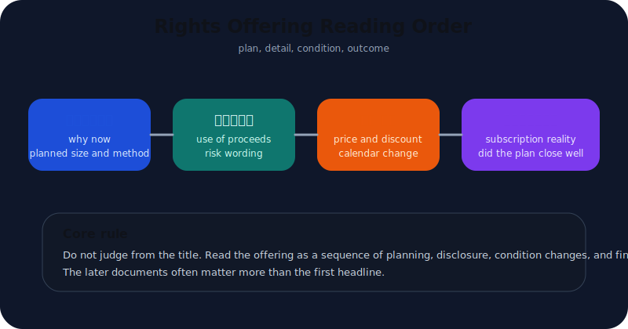
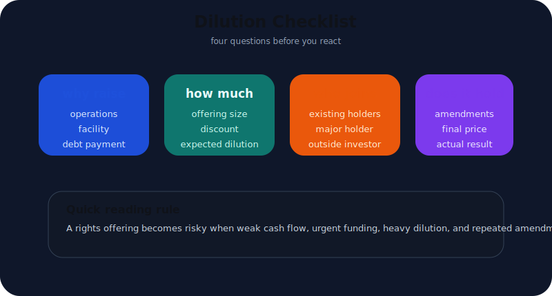
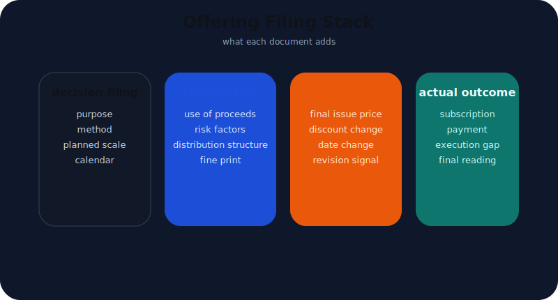
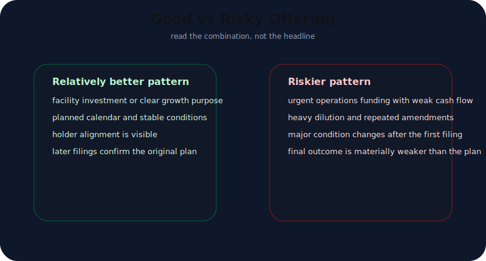
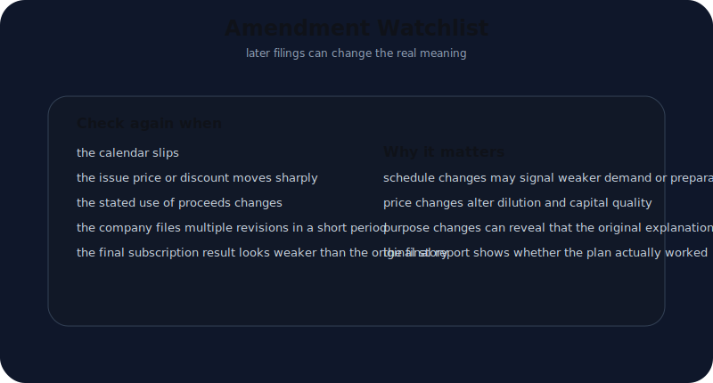

# 유상증자 공시 읽는 법

유상증자 공시를 보면 많은 사람이 가장 먼저 "이건 악재다" 혹은 "성장 투자니까 괜찮다"처럼 결론부터 내린다. 하지만 유상증자는 제목 한 줄로 평가할 수 있는 공시가 아니다.

같은 유상증자라도 완전히 다르게 읽어야 하는 경우가 있다.

- 운영자금이 급해서 버티기용으로 돈을 구하는 경우
- 설비투자나 사업 확장을 위해 미리 자본을 확보하는 경우
- 최대주주나 전략적 투자자가 얼마나 같이 들어오는지에 따라 이해관계가 달라지는 경우
- 처음 계획보다 할인율, 일정, 모집 구조가 정정공시에서 크게 바뀌는 경우

그래서 유상증자를 읽을 때 필요한 것은 감정이 아니라 **문서 순서**다. 먼저 답부터 말하면 이렇게 읽는 편이 가장 안전하다.

1. `유상증자결정`에서 왜, 얼마를, 어떤 방식으로 조달하는지 본다.
2. `증권신고서`에서 자금 사용처와 위험요소를 본다.
3. `발행조건확정` 또는 정정공시에서 실제 할인율과 일정 변화를 본다.
4. `증권발행실적보고서`에서 실제로 얼마나 들어왔는지 확인한다.

즉 유상증자는 한 건의 공시가 아니라 **희석과 자금조달의 흐름**으로 읽어야 한다.

---

## 유상증자를 보면 먼저 무엇부터 확인해야 하나

유상증자를 처음 볼 때는 복잡한 용어보다 아래 네 질문이 더 중요하다.

| 먼저 던질 질문 | 왜 중요한가 |
| --- | --- |
| 왜 돈이 필요한가 | 자금난인지 성장투자인지 방향이 갈린다 |
| 얼마나 희석되는가 | 기존 주주 가치가 얼마나 나뉘는지 본다 |
| 누가 참여하는가 | 최대주주, 기존 주주, 외부 투자자의 이해관계가 보인다 |
| 실제로 조건이 유지되는가 | 정정공시와 조건 확정에서 질이 드러난다 |

이 네 질문이 먼저 잡혀야 문서를 읽는 기준이 생긴다. 반대로 기준 없이 제목만 읽으면 "증자"라는 단어 하나에 과민 반응하기 쉽다.

실전에서는 첫 문서인 `유상증자결정`에서 아래를 가장 먼저 본다.

- 조달 목적: 운영자금, 채무상환자금, 시설자금, 타법인증권 취득 등
- 발행 방식: 주주배정, 일반공모, 제3자배정
- 예정 발행 규모
- 예정 일정

이 네 가지가 유상증자의 방향을 거의 정한다. 예를 들어 시설자금 중심이고 일정이 계획적이며 기존 주주 참여가 자연스럽다면 성장형 증자일 가능성이 높다. 반대로 운영자금 비중이 크고 자금난 신호가 이미 다른 공시에서 보였다면 버티기형 증자일 가능성을 더 봐야 한다.

가능하면 이 단계에서 직전 사업보고서나 가장 최근 분기보고서를 같이 펼쳐두는 편이 좋다. 현금흐름, 차입 부담, 투자 계획이 이미 흔들리고 있었다면 같은 유상증자도 훨씬 다르게 읽히기 때문이다. 특히 운영자금 목적이라면 최근 영업현금흐름과 차입 구조를 반드시 같이 봐야 한다. 이 한 줄이 해석을 바꾼다.

---

## 첫 문서 하나만 읽으면 안 되는 이유

유상증자에서 가장 흔한 실수는 `유상증자결정` 한 건만 읽고 결론을 내리는 것이다. 하지만 실제로 중요한 정보는 뒤 문서에서 더 또렷해지는 경우가 많다.

문서별 역할은 대략 아래처럼 나눠 읽으면 좋다.

| 문서 | 주로 보는 것 | 놓치기 쉬운 점 |
| --- | --- | --- |
| 유상증자결정 | 조달 목적, 방식, 예정 규모, 일정 | 이 단계는 아직 계획일 수 있다 |
| 증권신고서 | 자금 사용처, 투자위험, 세부 구조 | 위험요소와 자금 사용 문구가 더 구체적이다 |
| 정정공시 / 발행조건확정 | 할인율, 확정 발행가, 일정 변경 | 처음 계획보다 조건이 나빠질 수 있다 |
| 증권발행실적보고서 | 실제 청약과 납입 결과 | 계획이 실제로 얼마나 구현됐는지 보여준다 |

이 흐름이 중요한 이유는 간단하다. `계획`, `위험 설명`, `실제 조건`, `실제 결과`가 서로 다른 문서에 나뉘어 있기 때문이다.

그래서 유상증자를 읽는 법은 사실 [OpenDART로 주요사항보고서 읽는 법](/blog/opendart-material-events)의 연장선에 있다. 사건을 발견하는 것은 첫 단계고, 실제 해석은 그 뒤 문서들까지 붙여야 끝난다. 수집기 관점에서는 [corp_code부터 filing 원문까지 DART 수집 파이프라인 설계](/blog/corp-code-to-filing-pipeline)처럼 문서 원장을 남겨두는 구조가 특히 중요하다.

---

## 발행 방식에 따라 해석이 왜 달라지나

유상증자를 읽을 때 자주 놓치는 부분이 `누구를 대상으로 발행하는가`다. 같은 조달 금액이어도 발행 방식에 따라 희석의 의미와 주주 입장이 달라진다.

실전에서는 아래처럼 단순화해서 보면 좋다.

| 방식 | 먼저 드는 질문 | 해석 포인트 |
| --- | --- | --- |
| 주주배정 | 기존 주주가 얼마나 따라갈 수 있나 | 기존 주주 참여 구조와 할인 조건이 중요하다 |
| 일반공모 | 왜 기존 주주보다 시장 전체를 상대로 하나 | 수요 확보와 발행 성공 가능성을 더 민감하게 봐야 한다 |
| 제3자배정 | 왜 특정 상대방에게 배정하나 | 전략적 투자 유치인지, 특정 이해관계자에게 유리한 구조인지 구분해야 한다 |

예를 들어 주주배정은 기존 주주에게 선택권이 있는 대신, 실제로 얼마나 참여할 수 있는지가 중요하다. 일반공모는 모집 성공 여부와 조건 변화가 더 민감하다. 제3자배정은 상대방의 성격과 거래 목적을 더 강하게 봐야 한다.

이 차이를 무시하면 같은 `유상증자`라는 제목 아래 전혀 다른 구조를 같은 방식으로 읽게 된다. 결국 발행 방식은 단순 분류가 아니라, **누가 희석을 감수하고 누가 자금을 제공하는지**를 보여주는 핵심 문장이다.

그래서 좋은 읽기 순서는 이렇다.

1. 발행 방식을 먼저 확인한다.
2. 그 방식에서 가장 중요한 이해관계자가 누구인지 본다.
3. 그다음 자금 목적과 일정, 할인율, 정정 여부를 붙인다.

이 순서를 지키면 "증자를 했다"는 사실보다, **그 증자가 누구에게 어떤 부담과 기회를 주는가**가 더 또렷해진다.

---

## 좋은 유상증자와 위험한 유상증자는 어떻게 가르나

유상증자를 좋다 나쁘다로 단순화하면 거의 항상 틀린다. 더 실전적인 방법은 **좋은 조합과 위험한 조합**을 보는 것이다.

아래처럼 보면 빠르다.

| 관찰 포인트 | 상대적으로 좋은 경우 | 상대적으로 위험한 경우 |
| --- | --- | --- |
| 자금 용도 | 시설투자, 성장 투자, 구조 전환 | 운영자금 메우기, 급한 상환 대응 |
| 일정과 구조 | 미리 준비된 계획형 일정 | 정정이 잦고 조건 변경이 잦음 |
| 참여 구조 | 기존 주주나 핵심 이해관계자의 정렬이 보임 | 특정 참여자만 유리하거나 주주 희석이 과도함 |
| 후속 숫자 연결 | CAPEX, 매출 성장, 재무 안정화로 이어질 가능성 | 실적 둔화와 자금 압박 신호가 이미 큼 |

핵심은 유상증자를 **원인 없는 이벤트**로 보지 않는 것이다. 이 회사가 왜 지금 돈이 필요한지, 직전 사업보고서나 분기보고서에서 이미 조짐이 있었는지 같이 봐야 한다.

예를 들어 아래 조합은 경계할 만하다.

- 최근 영업현금흐름이 약하다
- 차입 부담이 늘고 있다
- 운영자금 목적 유상증자가 나온다
- 할인율과 일정이 정정공시에서 계속 바뀐다

반대로 아래 조합은 상대적으로 덜 나쁘게 볼 수 있다.

- 큰 투자 계획이 이미 사업보고서에 설명돼 있다
- 시설자금 목적이 구체적이다
- 자금 사용 일정이 명확하다
- 이후 발행실적보고서에서 계획이 무리 없이 이행된다

즉 유상증자의 평가는 "증자를 했는가"보다 **왜 그 증자가 나왔고 실제로 어떻게 끝났는가**에 더 가깝다.

---

## 문구에서 꼭 봐야 할 부분은 어디인가

유상증자 공시는 숫자만 보면 오히려 방향을 잘못 잡기 쉽다. 실제로는 문구가 더 중요한 장면이 많다.

대표적으로 아래 문장을 체크하는 편이 좋다.

- 자금 사용 목적이 구체적인지
- 예정 일정이 왜 바뀌는지
- 미청약 처리 방식이 어떻게 되는지
- 최대주주 또는 관계자의 참여가 어떻게 설명되는지
- 조건 확정 후 할인율이나 모집 구조가 처음과 얼마나 달라졌는지

이때 `시설자금`이라는 단어 하나만 보고 안심하면 안 된다. 시설자금이더라도 어떤 설비인지, 이미 [생산능력과 CAPEX, 이렇게 연결해서 본다](/blog/capacity-utilization-capex)나 [CAPEX 이후 감가상각, 이렇게 읽는다](/blog/depreciation-after-capex)에서 확인한 투자 흐름과 맞는지 봐야 한다.

운영자금도 마찬가지다. 모두 나쁜 것은 아니지만, 기존 현금흐름과 차입 구조를 같이 보면 의미가 달라진다. 결국 유상증자 공시를 잘 읽는 사람은 자금 용도 표를 `숫자`가 아니라 `회사의 현재 상태에 대한 설명`으로 읽는다.

---

## 정정공시가 더 중요해지는 순간

유상증자는 처음 계획보다 뒤 문서가 더 중요해지는 대표 영역이다. 할인율, 납입 일정, 발행가, 모집 구조가 움직일 수 있기 때문이다.

정정공시가 특히 중요해지는 순간은 아래와 같다.

| 상황 | 왜 다시 봐야 하나 |
| --- | --- |
| 일정이 미뤄진다 | 수요나 내부 준비가 흔들렸을 수 있다 |
| 발행 조건이 크게 바뀐다 | 기존 계획보다 자금조달 환경이 나빠졌을 수 있다 |
| 자금 사용처 설명이 달라진다 | 원래 목적과 실제 필요가 달라졌을 수 있다 |
| 실적이나 재무 상황이 중간에 바뀐다 | 같은 증자라도 해석이 달라진다 |

그래서 [공시를 처음 볼 때 DART에서 어디부터 눌러야 하나](/blog/where-to-click-first-in-dart)에서 말한 것처럼, 사건성 공시는 원문 하나 읽고 끝내면 안 된다. 정정 여부를 반드시 붙여서 봐야 한다.

유상증자에서 진짜 중요한 질문은 이거다. **처음 발표한 계획이 실제로 유지됐는가, 아니면 중간에 조달 질이 나빠졌는가?** 이 질문은 정정공시와 발행실적보고서를 같이 봐야만 답할 수 있다.

---

## 체크리스트

- 유상증자 목적이 운영자금인지 시설자금인지 먼저 분리했는가
- 발행 방식이 주주배정, 일반공모, 제3자배정 중 무엇인지 확인했는가
- 증권신고서에서 자금 사용처와 위험요소를 읽었는가
- 발행조건확정 또는 정정공시에서 할인율과 일정 변화를 다시 확인했는가
- 증권발행실적보고서에서 실제 결과가 계획과 얼마나 달랐는지 확인했는가
- 직전 사업보고서나 분기보고서와 연결해 자금난 신호인지 성장 투자 신호인지 판단했는가

---

## FAQ

### 유상증자는 무조건 악재인가

그렇게 단정하면 거의 항상 놓친다. 핵심은 왜 자금이 필요한지, 희석 구조가 어떤지, 계획이 실제로 어떻게 끝나는지다.

### 첫 번째 유상증자결정 공시만 보면 충분한가

부족한 경우가 많다. 증권신고서, 발행조건확정, 정정공시, 증권발행실적보고서까지 봐야 실제 조건과 결과가 보인다.

### 운영자금 목적이면 무조건 위험한가

그 자체만으로 단정할 수는 없다. 다만 기존 현금흐름과 차입 부담이 약한 상태라면 더 신중하게 봐야 한다.

### 정정공시는 왜 더 중요할 수 있나

처음 계획보다 할인율, 일정, 구조가 바뀌면 조달 질이 달라지기 때문이다. 처음 공시보다 정정본이 더 중요한 경우가 적지 않다.

### 유상증자 공시를 읽은 뒤 다음으로 무엇을 보면 좋은가

이벤트 감시 관점이면 [OpenDART로 주요사항보고서 읽는 법](/blog/opendart-material-events), 문서 추적 구조 관점이면 [corp_code부터 filing 원문까지 DART 수집 파이프라인 설계](/blog/corp-code-to-filing-pipeline), OpenDART 전체 범위를 먼저 잡고 싶다면 [OpenDART, 솔직한 리뷰](/blog/opendart-review)를 같이 보면 좋다.

---

## 참고한 공식 자료

- [OpenDART 개발가이드 - 주요사항보고서 주요정보 목록](https://opendart.fss.or.kr/guide/main.do?apiGrpCd=DS005)
- [OpenDART 개발가이드 - 유상증자 결정](https://opendart.fss.or.kr/guide/main.do?apiGrpCd=DS005)
- [OpenDART 개발가이드 - 증권신고서 주요정보(지분증권)](https://opendart.fss.or.kr/guide/detail.do?apiGrpCd=DS006&apiId=2020054)
- [DART 소개 - 보고서정보](https://dart.fss.or.kr/introduction/content2.do)
- [기업공시 길라잡이 - 발행공시](https://dart.fss.or.kr/info/main.do?menu=230)
