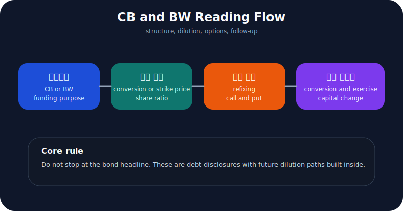
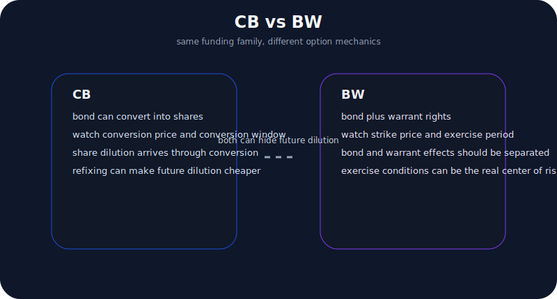
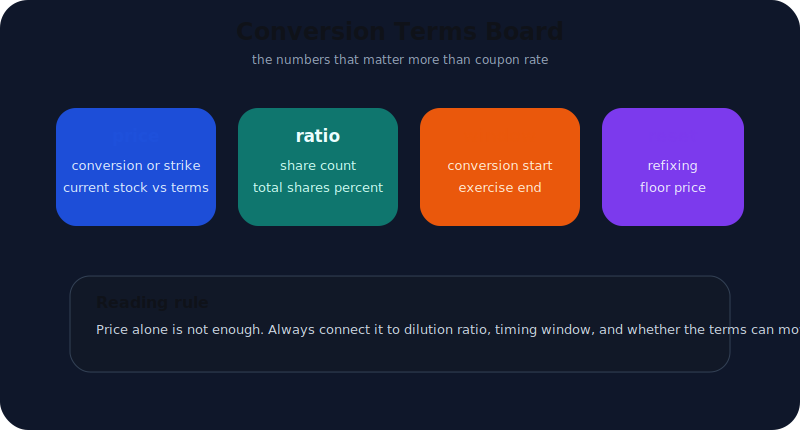
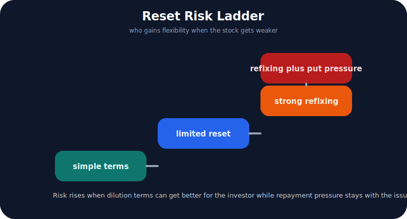
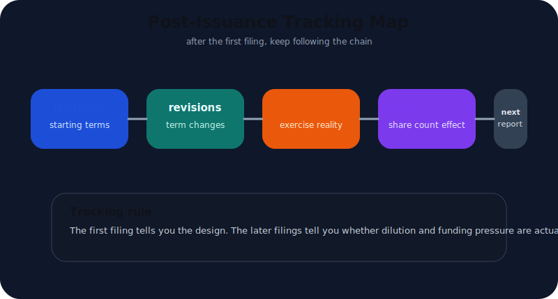

# 전환사채와 BW 공시 읽는 법

전환사채(CB)와 신주인수권부사채(BW)는 초보자가 가장 자주 잘못 읽는 공시 중 하나다. 제목만 보면 "회사채를 발행했구나" 정도로 보이기 쉽기 때문이다.

하지만 CB와 BW는 단순 차입 공시가 아니다. 이 문서들에는 대개 아래 세 가지가 한꺼번에 들어 있다.

- 지금 당장의 자금조달
- 나중에 주식으로 바뀔 수 있는 희석 가능성
- 주가가 움직일 때 조달 조건이 다시 달라질 수 있는 구조

즉 CB와 BW는 `부채 공시`이면서 동시에 `희석 공시`다. 그래서 이 문서는 이자율 하나만 보고 읽으면 거의 항상 놓친다.

먼저 답부터 말하면 이렇게 보는 편이 가장 안전하다.

1. `전환사채권 발행결정` 또는 `신주인수권부사채권 발행결정`에서 구조를 본다.
2. 전환가액이나 행사가액, 전환 가능 주식 수 비율을 본다.
3. 리픽싱, 콜옵션, 풋옵션, 만기 구조를 확인한다.
4. 나중에 실제 전환·행사 공시나 자본금 변동으로 이어지는지 본다.

즉 CB와 BW는 발행 순간보다 **발행 이후 어떤 조건으로 주식이 될 수 있는가**를 읽는 공시다.

---

## CB와 BW는 무엇이 다른가

둘 다 희석 가능성을 가진 자금조달 수단이지만 구조는 다르다.

아주 단순하게 정리하면 이렇다.

| 구조 | 핵심 질문 | 실전 해석 포인트 |
| --- | --- | --- |
| CB | 이 사채가 언제 주식으로 바뀔 수 있나 | 전환가액, 전환기간, 전환 비율, 리픽싱이 핵심이다 |
| BW | 이 사채와 신주인수권이 어떻게 붙어 있나 | 채권과 신주인수권을 따로 봐야 하고, 행사조건이 더 중요해진다 |

CB는 사채 자체가 주식으로 전환될 수 있다. BW는 사채에 신주인수권이 붙어 있어서, 채권과 별도로 주식을 살 수 있는 권리가 함께 붙는다. 그래서 BW는 구조가 한 단계 더 복잡하게 보이는 경우가 많다.

실전에서는 용어 정의보다 아래 질문이 더 중요하다.

- 주가가 오르면 누가 유리한가
- 주가가 떨어지면 조건이 다시 조정되는가
- 이 구조가 회사에 안정적 자금인지, 투자자에게 유리한 옵션인지

OpenDART 개발가이드도 CB와 BW를 주요사항보고서 36종 안의 별도 API로 제공하고, CB는 전환가액·전환비율·전환 가능 주식 비율, BW는 행사기간·행사가액 조정 하한 관련 필드를 따로 제공한다. 이것만 봐도 두 공시는 `부채`보다 `조건부 희석` 관점으로 읽어야 한다는 점이 드러난다.

---

## 제목보다 먼저 무엇을 봐야 하나

CB와 BW를 읽을 때 첫 단계는 "금리가 몇 퍼센트냐"가 아니다. 오히려 아래 네 항목이 먼저다.

| 먼저 볼 항목 | 왜 중요한가 |
| --- | --- |
| 자금 조달 목적 | 운영자금 버티기인지, 투자 목적 조달인지 갈린다 |
| 전환가액 또는 행사가액 | 희석이 어느 가격대에서 시작되는지 보여준다 |
| 발행 주식 수 대비 비율 | 실제 희석 규모를 감으로가 아니라 비율로 보게 만든다 |
| 조정 조항 존재 여부 | 주가 하락 시 조건이 더 투자자 친화적으로 바뀔 수 있다 |

CB와 BW는 표면상 `차입`처럼 보여도 실제로는 **미래 주식 발행 예약**에 가깝게 작동할 수 있다. 그래서 금리보다 먼저 희석 구조를 봐야 한다.

예를 들어 아래 조합은 특히 주의해서 봐야 한다.

- 운영자금 목적
- 전환 가능 주식 수 비율이 크다
- 전환가액 또는 행사가액 조정 조항이 있다
- 만기나 상환보다 옵션 가치가 더 중요해 보인다

반대로 아래 조합은 상대적으로 덜 공격적일 수 있다.

- 투자 목적이 구체적이다
- 희석 비율이 과도하지 않다
- 리픽싱 하한이 분명하다
- 후속 사업계획과 연결된다

즉 이 공시는 "채권을 얼마에 발행했는가"보다 **어느 가격에서 얼마나 쉽게 희석이 생길 수 있는가**를 먼저 보아야 한다.

---

## 전환가액과 행사가액은 어떻게 읽어야 하나

CB와 BW에서 가장 중요한 숫자는 금리보다 `전환가액` 또는 `행사가액`이다.

이 숫자를 볼 때는 단독으로 보지 말고 아래와 같이 묶어 봐야 한다.

| 같이 봐야 할 조합 | 의미 |
| --- | --- |
| 전환가액 + 현재 주가 | 지금 전환 유인이 큰지 본다 |
| 전환가액 + 리픽싱 조항 | 주가 하락 시 희석 조건이 더 유리해질 수 있는지 본다 |
| 전환 가능 주식 수 + 총주식 수 대비 비율 | 실제 희석 규모를 본다 |
| 행사기간 + 만기 | 투자자가 언제부터 얼마나 오래 옵션을 쓸 수 있는지 본다 |

OpenDART CB 개발가이드에는 전환비율, 전환가액, 전환에 따라 발행할 주식 수와 총주식 수 대비 비율이 응답 필드로 들어 있고, BW 개발가이드에는 신주인수권 행사기간, 행사 주식 수 비율, 조정 하한 관련 필드가 잡혀 있다. 이건 실전적으로 중요한 힌트다. 공시를 볼 때도 바로 이 항목들을 중심으로 읽으라는 뜻에 가깝다.

많은 사람이 여기서 실수한다. 전환가액이 높아 보이면 안심하고, 낮아 보이면 바로 겁먹는다. 하지만 더 중요한 것은 **조정 가능성**과 **기간**이다. 지금은 멀어 보여도 조정 조항 때문에 나중에 더 낮은 가격으로 움직일 수 있다면 해석이 완전히 달라진다.

그래서 이 숫자는 항상 "고정된 약속인가, 움직일 수 있는 약속인가"라는 질문과 함께 봐야 한다.

---

## 리픽싱과 옵션 조항이 왜 위험 신호가 되나

CB와 BW를 어렵게 만드는 핵심은 바로 여기다. 발행 당시 조건이 끝까지 유지되지 않을 수 있다는 점이다.

실전에서는 아래 항목을 특히 다시 확인한다.

- 전환가액 또는 행사가액 조정 조항
- 최저 조정가액 하한
- 콜옵션 존재 여부
- 풋옵션 또는 조기상환 요구 가능성
- 만기 구조와 표면/만기 이자율

이 조항이 중요한 이유는 간단하다.

리픽싱이 강하게 열려 있으면 주가가 약할수록 투자자에게 더 유리한 구조가 만들어질 수 있다. 풋옵션이 강하면 회사는 현금 상환 압박을 받을 수 있다. 콜옵션은 반대로 회사나 특정 이해관계자 쪽의 선택권을 키울 수 있다. 결국 CB와 BW는 이자율보다 **누가 어떤 상황에서 선택권을 갖는가**가 더 중요할 때가 많다.

그래서 이 공시는 단순 채권 공시처럼 읽으면 안 된다. 실제로는 `조건부 희석 + 선택권 배분 + 상환 압박`을 함께 읽는 문서다.

[유상증자 공시 읽는 법](/blog/rights-offering-disclosure)과 다른 점도 여기 있다. 유상증자는 계획된 희석이 더 직접적으로 보이지만, CB와 BW는 **희석이 나중에 현실화될 수 있는 구조**라는 점에서 더 느슨하고 더 복잡하다.

---

## 발행 이후에는 어떤 후속 공시를 봐야 하나

CB와 BW는 발행결정 공시 한 건으로 끝나는 문서가 아니다. 뒤에서 진짜 의미가 드러나는 경우가 많다.

발행 후에는 아래 흐름을 같이 보는 편이 좋다.

1. 정정공시나 조건 변경이 있었는지 본다.
2. 실제 전환·행사 공시가 나오는지 본다.
3. 사업보고서의 자본금 변동, 사채 발행 현황, 희석 관련 표를 본다.
4. 분기보고서에서 자본 구조와 현금흐름이 어떻게 달라졌는지 본다.

왜 이렇게까지 봐야 하냐면, CB와 BW는 발행 순간보다 **후속 현실화**에서 훨씬 큰 의미를 갖기 때문이다. 처음엔 단순 조달처럼 보여도, 나중에 실제 전환이 빠르게 진행되면 기존 주주 입장에서는 희석 체감이 갑자기 커질 수 있다.

그래서 좋은 읽기 습관은 이렇다.

- 발행 당시엔 조건표를 본다
- 이후엔 전환·행사 속도를 본다
- 최종적으로는 자본금 변동과 총주식 수 변화를 본다

이 흐름은 [공시를 처음 볼 때 DART에서 어디부터 눌러야 하나](/blog/where-to-click-first-in-dart)에서 말한 사건 공시 읽기 순서와도 연결된다. 사건성 공시는 항상 후속 문서까지 붙여야 해석이 끝난다.

---

## 좋은 CB/BW와 위험한 CB/BW는 어떻게 가르나

CB와 BW도 유상증자처럼 `좋다 / 나쁘다`가 아니라 **조합**으로 읽는 편이 정확하다.

| 관찰 포인트 | 상대적으로 덜 위험한 경우 | 상대적으로 더 위험한 경우 |
| --- | --- | --- |
| 자금 목적 | 투자 목적이 구체적이고 사업과 연결됨 | 운영자금 메우기 성격이 강함 |
| 희석 비율 | 총주식 수 대비 비율이 과도하지 않음 | 희석 가능 주식 비율이 크다 |
| 조정 조항 | 하한이 분명하고 구조가 단순함 | 리픽싱이 강하고 복잡한 옵션이 붙음 |
| 후속 흐름 | 사업과 자본 구조가 설명 가능하게 움직임 | 정정이 잦고 후속 전환이 빠르게 누적됨 |

예를 들어 시설 투자나 사업 전환 목적이 구체적이고, 조정 구조가 과도하지 않으며, 이후 실적과 자본 구조가 그 설명을 어느 정도 따라간다면 상대적으로 덜 공격적인 조달일 수 있다.

반대로 아래 조합은 주의해서 봐야 한다.

- 현금흐름이 약하다
- 운영자금 목적이다
- 리픽싱이 강하다
- 희석 비율이 크다
- 후속 전환이나 행사 흐름이 빠르다

이 조합은 조달 자체보다 **희석과 압박의 반복 구조**에 더 가까울 수 있다.

---

## 체크리스트

- CB인지 BW인지 먼저 분리했는가
- 자금 조달 목적이 운영자금인지 투자 목적 자금인지 확인했는가
- 전환가액 또는 행사가액과 총주식 수 대비 비율을 함께 봤는가
- 리픽싱 하한, 콜옵션, 풋옵션 같은 조항을 확인했는가
- 발행 이후 정정공시와 실제 전환·행사 흐름을 추적할 계획이 있는가
- 사업보고서의 자본금 변동과 사채 관련 표까지 이어서 볼 준비가 되어 있는가

---

## FAQ

### CB와 BW는 그냥 회사채 발행으로 보면 안 되나

안 된다. 둘 다 부채이면서 동시에 미래 희석 가능성을 품고 있기 때문이다. 금리보다 전환·행사 조건이 더 중요할 때가 많다.

### CB와 BW 중 무엇이 더 위험한가

항상 한쪽이 더 위험하다고 단정할 수는 없다. 다만 BW는 구조가 더 복합적으로 보이는 경우가 많고, 둘 다 리픽싱과 옵션 조항에 따라 해석이 크게 달라진다.

### 리픽싱이 있으면 무조건 나쁜가

그렇게 단정할 수는 없지만, 투자자에게 더 유리하게 조건이 조정될 수 있는 구조라면 기존 주주 입장에서는 경계할 이유가 충분하다.

### 발행결정 공시만 읽으면 충분한가

부족한 경우가 많다. 정정공시, 후속 전환·행사 공시, 사업보고서의 자본금 변동까지 붙여야 실제 희석 흐름이 보인다.

### CB/BW 공시를 읽은 뒤 다음으로 무엇을 보면 좋은가

이벤트 탐지 관점이면 [OpenDART로 주요사항보고서 읽는 법](/blog/opendart-material-events), 문서 추적 구조 관점이면 [corp_code부터 filing 원문까지 DART 수집 파이프라인 설계](/blog/corp-code-to-filing-pipeline), 같은 시리즈의 비교 글로는 [유상증자 공시 읽는 법](/blog/rights-offering-disclosure)을 이어서 보면 좋다.

---

## 참고한 공식 자료

- [OpenDART 개발가이드 - 주요사항보고서 주요정보 목록](https://opendart.fss.or.kr/guide/main.do?apiGrpCd=DS005)
- [OpenDART 개발가이드 - 전환사채권 발행결정](https://opendart.fss.or.kr/guide/detail.do?apiGrpCd=DS005&apiId=2020033)
- [OpenDART 개발가이드 - 신주인수권부사채권 발행결정](https://opendart.fss.or.kr/guide/detail.do?apiGrpCd=DS005&apiId=2020034)
- [OpenDART 주요사항보고서 주요정보조회](https://opendart.fss.or.kr/disclosureinfo/mainMatter/main.do)
- [DART 소개 - 보고서정보](https://dart.fss.or.kr/introduction/content2.do)
