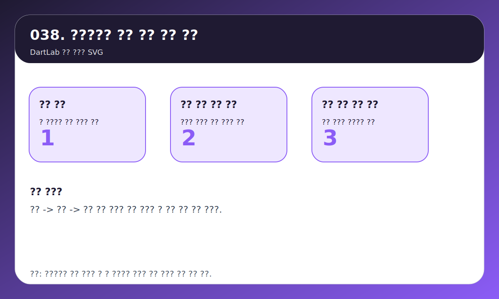
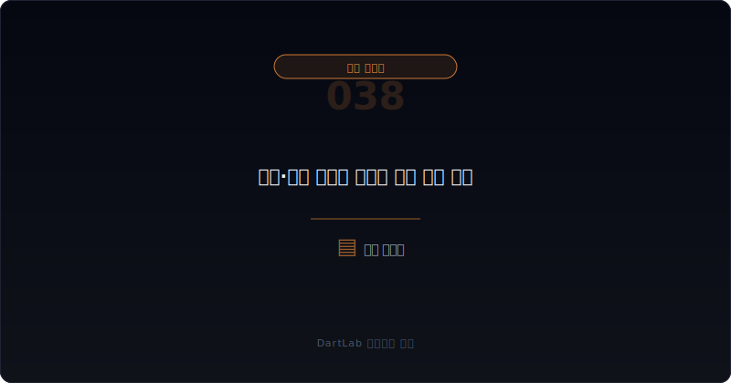
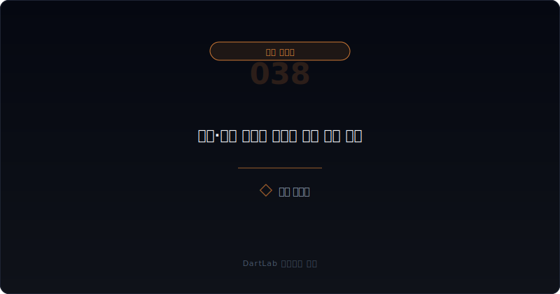
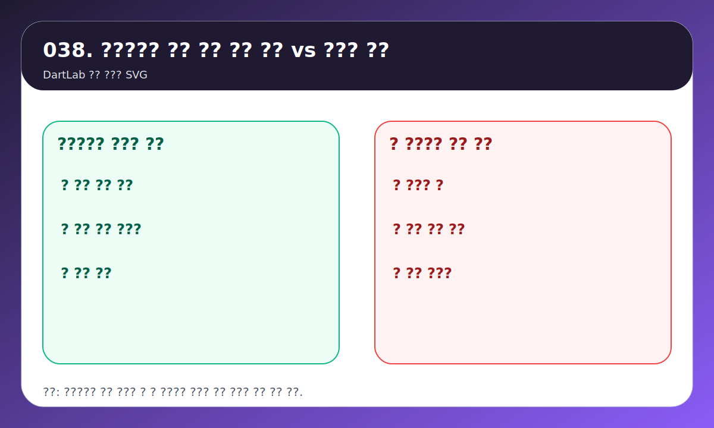
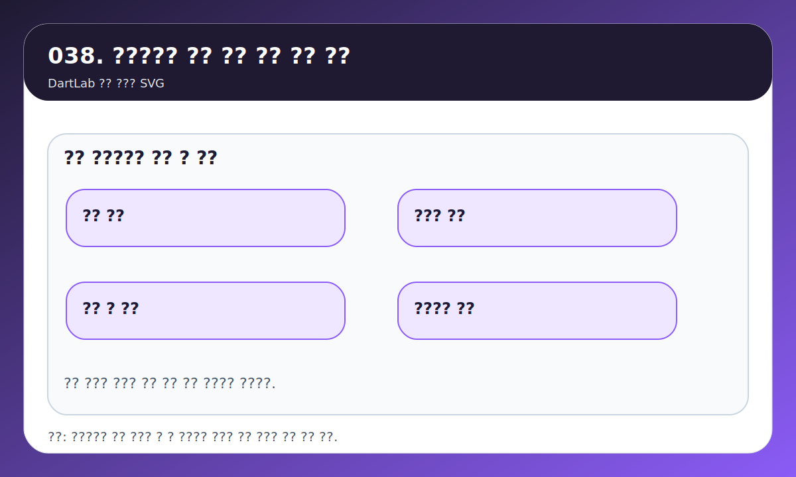

---
title: 합병·분할 공시는 어디를 먼저 봐야 하나
date: 2026-03-18
description: 합병과 분할 공시는 구조 재편의 겉모습보다 비율, 외부평가, 주주 보호 장치, 상장 일정, 사업 이전 내용을 같이 봐야 의미가 보인다. 실전 읽기 순서를 정리한다.
category: disclosure-systems
series: corporate-actions-and-financing
seriesOrder: 4
thumbnail: /avatar-study.png
---

# 합병·분할 공시는 어디를 먼저 봐야 하나

합병과 분할은 headline이 크다. 그래서 초보자는 보통 이름부터 본다. 어느 회사가 합병하는지, 어느 사업부를 떼는지, 신설법인이 상장하는지 같은 이야기부터 따라간다.

하지만 실제로 더 중요한 것은 구조다. 누구의 자산과 사업이 어디로 이동하는지, 어떤 비율로 바뀌는지, 기존 주주에게 어떤 권리와 부담이 생기는지, 이후 상장 구조와 이사회가 어떻게 달라지는지 봐야 한다.

이 글은 합병·분할 공시를 `비율 -> 사업 이전 내용 -> 외부평가 -> 주주 보호 장치 -> 후속 상장·지배구조 변화` 순서로 읽는 방법을 정리한다. 주총 관점은 [주주총회소집공고에서 꼭 봐야 할 것은 무엇인가](/blog/how-to-read-agm-notice), 지배구조 위험은 [지배구조가 위험한 회사는 어떤 패턴을 보이나](/blog/governance-red-flags)와 같이 보면 더 잘 이어진다.

---

## 제목보다 먼저 무엇을 봐야 하나

합병은 성장 서사처럼 포장되기 쉽고, 분할은 가치 재평가 이야기처럼 포장되기 쉽다. 하지만 이런 해석은 구조를 보기 전에는 거의 의미가 없다.

실전에서는 아래 항목이 먼저다.

| 먼저 볼 항목 | 왜 중요한가 |
| --- | --- |
| 비율 | 누가 얼마나 유리해지는지 본다 |
| 사업 이전 내용 | 어떤 사업과 자산이 이동하는지 본다 |
| 외부평가 | 비율과 구조 설명의 근거를 본다 |
| 주주 보호 장치 | 매수청구권, 일정, 거래정지를 본다 |
| 후속 상장 구조 | 재상장, 신주 상장, 존속회사 구조를 본다 |

같은 합병이라도 비율 설명과 외부평가가 분명하면 해석이 쉬워진다. 반대로 명분은 좋은데 사업 이전 내용과 비율 설명이 흐리면 훨씬 조심해서 봐야 한다. 분할도 마찬가지다. 분할 그 자체는 좋지도 나쁘지도 않다. 어떤 사업이 이동하고, 이후 어느 법인에 무엇이 남는지가 더 중요하다.

---

## 어디서부터 해석을 가르면 되나

가장 실용적인 질문은 이것이다. `이 공시는 사업 재편인가, 지배력 재편인가, 주주 부담 확대인가`.

사업 재편이라면 어떤 자산과 사업이 이동하는지, 분할 후 존속회사와 신설회사의 역할이 무엇인지가 먼저다. 지배력 재편이라면 누가 더 유리해지는지, 우회상장이나 특정 이해관계자에게 유리한 구조가 숨어 있는지 봐야 한다. 주주 부담 확대라면 매수청구권, 일정, 거래정지, 상장 변화를 더 무겁게 봐야 한다.

이 세 질문을 먼저 잡으면 복잡해 보이는 공시도 훨씬 빨리 정리된다. 반대로 질문 없이 읽으면 명분과 기사 제목만 따라가게 된다.

---

## 좋은 공시와 위험한 공시는 무엇이 다른가

| 관찰 포인트 | 상대적으로 건강한 경우 | 더 조심해야 하는 경우 |
| --- | --- | --- |
| 비율 설명 | 산출 근거와 외부평가가 비교적 분명하다 | 비율은 큰데 설명이 빈약하다 |
| 사업 이전 내용 | 어떤 자산과 사업이 이동하는지 구체적이다 | 명분만 있고 이전 대상이 흐리다 |
| 주주 보호 | 매수청구권과 일정이 명확하다 | 주주 부담은 큰데 설명이 약하다 |
| 상장 구조 | 재상장, 신주 상장 일정이 분명하다 | 거래정지와 후속 상장 구조가 복잡하다 |
| 후속 공시 | 주총과 사업보고서에서 변화가 이어진다 | 이벤트 후 설명이 끊긴다 |

좋은 공시는 복잡해도 설명이 따라온다. 누가 무엇을 가져가고, 기존 주주에게 어떤 선택권과 부담이 생기고, 이후 구조가 어떻게 달라지는지가 비교적 분명하다. 반대로 위험한 공시는 명분은 그럴듯하지만 구조 설명이 비어 있다.

이때는 숫자보다 문서 연결이 더 중요해진다. 주총 안건, 외부평가서, 후속 사업보고서, 상장 일정까지 붙여 봐야 한다.

---

## 비율이 복잡할수록 무엇을 더 단순하게 봐야 하나

합병과 분할 공시는 숫자가 복잡해 보이지만, 실제로는 세 줄로 단순화하는 편이 낫다. `무엇이 어디로 가는가`, `누가 더 유리해지는가`, `기존 주주가 어떤 선택을 해야 하는가`다. 이 세 줄만 잡으면 긴 평가서와 설명 문서도 훨씬 빨리 읽힌다.

예를 들어 분할 공시를 볼 때는 신설법인이 좋아 보이는 사업을 가져가고, 존속회사는 부담이 큰 사업을 남기는지 먼저 보자. 합병 공시는 비율과 교부 구조가 특정 주체에게 유리한지 먼저 보자. 이 순서를 놓치면 외부평가와 법률 문구를 오래 읽어도 핵심을 놓친다.

또 하나 중요한 것은 비율 자체보다 근거의 질이다. 비율이 정교해 보여도 왜 그 숫자가 나왔는지 설명이 약하면 오히려 더 불편해야 한다. 반대로 구조는 복잡해도 사업 이전 내용과 주주 권리, 일정이 투명하면 읽기 훨씬 쉬워진다.

---

## 후속 문서가 진짜 구조를 드러내는 순간은 언제인가

합병과 분할은 결정 공시 한 건으로 끝나지 않는다. 주총 공고, 외부평가서, 거래소 일정, 사업보고서의 사업 구조 변화, 이후 실적까지 붙여 봐야 실제 구조가 드러난다. 그래서 이 주제는 처음 공시보다 후속 문서를 잘 붙이는 사람이 훨씬 유리하다.

특히 분할 뒤 첫 사업보고서는 매우 중요하다. 어떤 사업이 어느 법인에 남았는지, 매출과 비용 구조가 어떻게 갈라졌는지, 계획했던 가치 재평가가 실제 숫자로 이어지는지 확인할 수 있기 때문이다. 합병도 첫 후속 보고서에서 시너지보다 통합 비용과 조직 조정 부담이 먼저 보이는 경우가 많다.

즉 합병·분할 해석은 이벤트 매매보다 구조 추적에 가깝다. 발표 당일보다 후속 문서에서 더 많은 정보가 나오기 때문에, 제목보다 연결 문서의 순서를 먼저 잡는 편이 훨씬 실전적이다.

---

## 자주 놓치는 해석 4가지

### 1. 합병은 무조건 성장 이벤트라고 본다

비율과 자산 이동 구조를 보지 않으면 거의 항상 부족하다.

### 2. 분할은 무조건 가치 재평가라고 본다

분할 이후 어떤 사업이 어느 법인에 남는지가 더 중요하다.

### 3. 외부평가가 있으면 안심한다

외부평가 자체보다 근거와 설명 수준을 같이 봐야 한다.

### 4. 후속 상장 구조를 안 본다

재상장, 신주 상장, 거래정지 일정은 기존 주주 입장에서 매우 중요하다.

---

## 후속 공시와 다음 보고서에서 무엇을 봐야 하나

- 비율과 지분 변화를 정리했는가
- 사업 이전 내용을 확인했는가
- 외부평가와 매수청구권을 봤는가
- 거래정지와 상장 일정을 확인했는가
- 주총과 후속 공시를 볼 계획이 있는가
- 분할 후 실적과 지배구조 변화를 추적하는가

합병과 분할은 발표 순간보다 후속 문서에서 구조가 더 분명해지는 경우가 많다. 그래서 이사회 결정 공시 한 건만 읽고 끝내면 거의 항상 부족하다.

## 10분 체크리스트

- 비율과 산출 근거가 설명되는가
- 어떤 사업과 자산이 이동하는가
- 외부평가와 매수청구권을 확인했는가
- 거래정지와 상장 일정이 정리되는가
- 누가 더 유리해지는지 계산했는가
- 후속 주총과 사업보고서를 추적할 계획이 있는가

## 기존 주주 입장에서 무엇이 가장 중요하나

합병과 분할은 회사 이야기처럼 보이지만 실제로는 기존 주주의 선택 문제이기도 하다. 매수청구권을 행사할지, 재상장 구조를 감수할지, 존속회사와 신설회사 중 어디에 더 큰 기대를 둘지 판단해야 하기 때문이다. 그래서 주주의 입장에서 가장 중요한 것은 명분보다 권리와 일정이다.

실전에서는 거래정지 기간, 신주 교부 구조, 재상장 일정, 존속회사에 남는 사업의 질을 같이 보는 편이 좋다. 기업 설명은 언제나 긍정적으로 쓰일 수 있지만, 주주의 권리와 일정은 상대적으로 더 냉정한 정보를 준다. 특히 복잡한 분할일수록 `어느 회사에 무엇이 남는가`를 기존 주주 관점에서 다시 써보면 해석이 빨라진다.

결국 합병·분할은 큰 스토리보다 권리 구조를 보는 글이다. 이 기준이 붙으면 복잡한 구조도 훨씬 덜 어렵다.

## 복잡한 비율을 처음 읽을 때 메모하는 세 줄

합병비율이나 분할 구조가 너무 복잡하면 문서 한쪽에 세 줄만 적어도 도움이 된다. `좋은 사업은 어디로 가는가`, `부담은 어디에 남는가`, `기존 주주는 무엇을 선택해야 하는가`다. 이 세 줄이 채워지지 않으면 아직 구조를 이해한 것이 아니다.

숫자가 많을수록 오히려 이 단순화가 중요하다. 비율 공식보다 사업과 권리의 이동을 먼저 잡아야 실제 판단이 가능해진다.

결정 공시 한 건만 읽고 끝내면 이 세 줄이 대개 비어 있다. 그래서 합병·분할은 처음 문서를 읽는 기술보다, 후속 문서까지 묶는 기술이 더 중요하다.

같은 구조라도 후속 사업보고서에서 사업부별 실적과 자산 이동이 설명되기 시작하면 해석이 훨씬 단단해진다. 반대로 후속 문서에서도 핵심 이동이 흐리면 처음 공시의 명분도 더 보수적으로 읽는 편이 맞다.

그래서 합병·분할 글은 발표 당일보다 후속 두세 문서를 묶어 읽을 때 훨씬 강해진다. 구조 재편은 거의 항상 시간이 지나야 본모습이 보이기 때문이다.

결국 복잡한 용어보다 사업과 권리의 이동을 끝까지 추적하는 사람이 더 유리하다.

처음 공시가 어려워 보여도, 후속 주총과 사업보고서까지 이어 붙이면 구조는 생각보다 빨리 단순해진다.

이 추적 습관 하나가 복잡한 구조 재편 공시를 실전 문서로 바꾼다.

## FAQ

### 합병 공시는 비율만 보면 되나

아니다. 사업 이전 내용, 외부평가, 매수청구권, 상장 일정을 함께 봐야 한다.

### 분할은 무조건 좋은 재평가 이벤트인가

항상 그렇지 않다. 지배력 재편과 비용 부담, 후속 상장 구조를 같이 봐야 한다.

### 외부평가가 있으면 안심해도 되나

그 자체로 결론은 아니다. 평가 근거와 의견, 비율 설명을 같이 읽어야 한다.

### 무엇을 같이 보면 좋은가

주총 공고, 지배구조 위험, 사업의 내용 변화 글을 같이 붙여 보면 구조가 훨씬 빨라진다.

## 같이 읽으면 좋은 글

- [주주총회소집공고에서 꼭 봐야 할 것은 무엇인가](/blog/how-to-read-agm-notice)
- [지배구조가 위험한 회사는 어떤 패턴을 보이나](/blog/governance-red-flags)
- [사업보고서 II. 사업의 내용, 이 섹션이 투자 판단을 바꾼다](/blog/business-section-changes-judgment)
- [최대주주와 특수관계인은 어떻게 읽어야 하나](/blog/major-shareholder-and-related-parties)

## 참고한 공식 자료

- [OpenDART 개발가이드 - 회사합병 결정](https://opendart.fss.or.kr/guide/detail.do?apiGrpCd=DS005&apiId=2020050)
- [OpenDART 개발가이드 - 회사분할 결정](https://opendart.fss.or.kr/guide/detail.do?apiGrpCd=DS005&apiId=2020051)
- [OpenDART 개발가이드 - 주요사항보고서 주요정보 목록](https://opendart.fss.or.kr/guide/main.do?apiGrpCd=DS005)
- [DART 소개 - 보고서정보](https://dart.fss.or.kr/introduction/content2.do)

## 정리

합병과 분할은 이름보다 구조를 봐야 한다. 비율, 사업 이전 내용, 외부평가, 주주 보호 장치, 후속 상장 구조를 먼저 잡으면 복잡해 보이는 공시도 훨씬 빨리 정리된다.

핵심은 간단하다. 이벤트를 보는 것이 아니라 구조 변화를 보는 것이다. 이 한 줄만 기억해도 headline보다 훨씬 나은 해석이 가능해진다.
