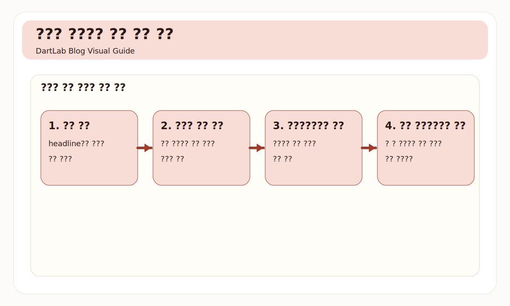
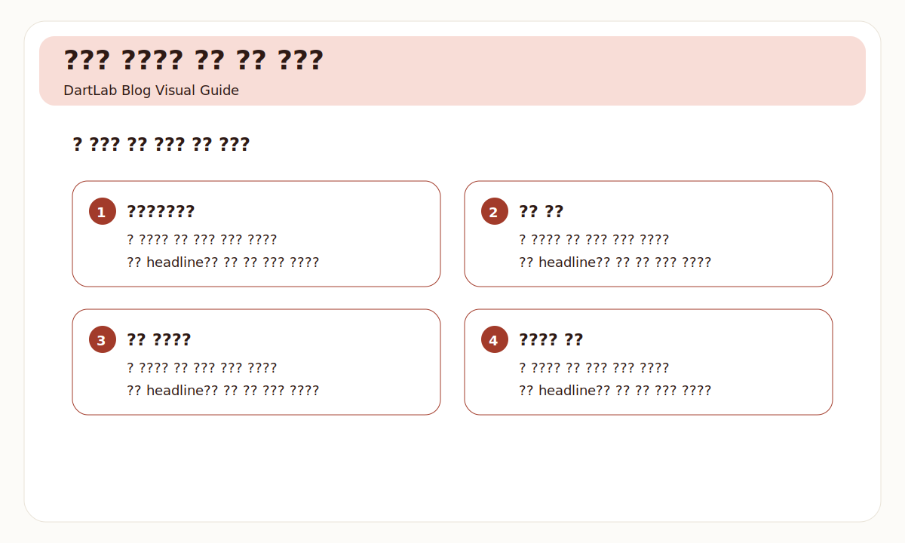
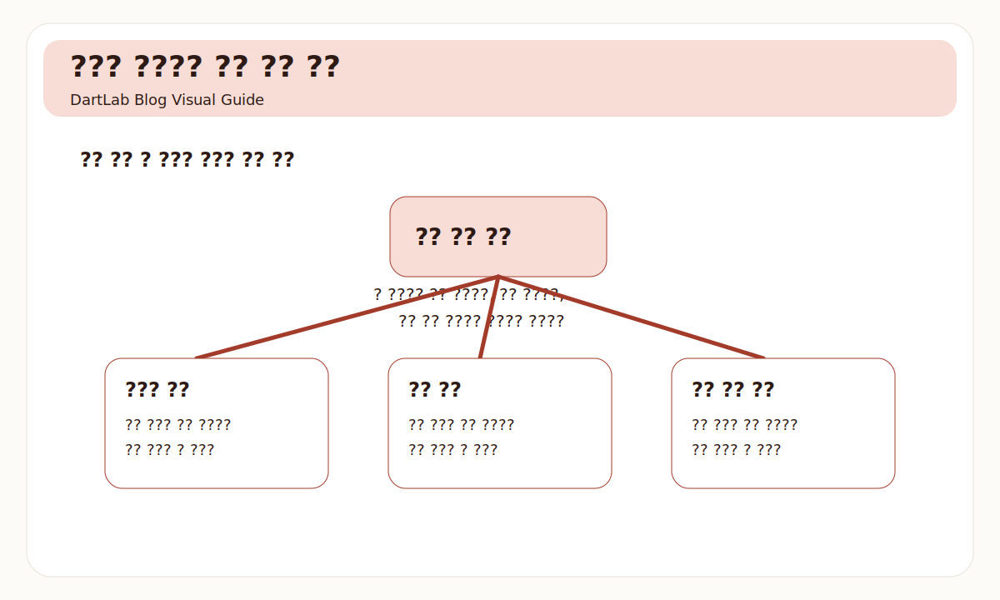
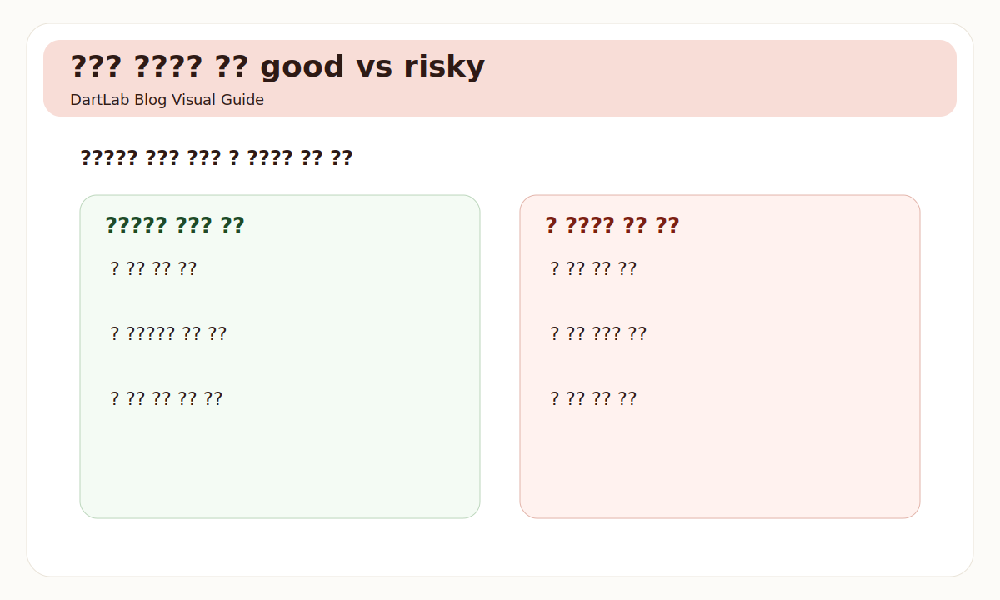
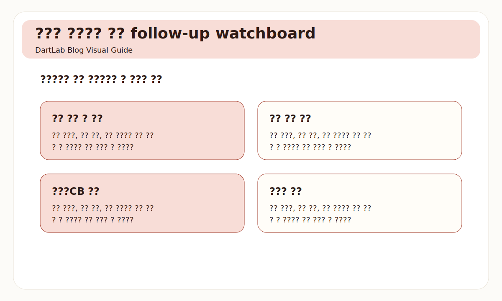

# 감자와 주식병합 공시는 무엇을 먼저 봐야 하나

감자와 주식병합은 headline이 강하다. 주식 수가 줄고, 액면과 자본금이 바뀌고, 주가가 숫자상 커 보일 수 있기 때문이다. 그래서 초보자는 보통 주가와 비율만 본다. 몇 대 몇 병합인지, 몇 퍼센트 감자인지, 거래가 언제 정지되는지부터 따라간다.

하지만 실제로 더 중요한 것은 목적과 구조다. 왜 감자를 하는지, 결손 보전인지 구조 재편인지, 기존 주주에게 어떤 권리와 부담이 생기는지, 후속 자금조달이나 지배력 변화와 연결되는지를 봐야 한다. 주식병합도 마찬가지다. 숫자상 주가가 높아지는 것보다 그 회사가 왜 그 조치를 택했는지가 훨씬 중요하다.

이 글은 감자와 주식병합 공시를 `비율 -> 목적 -> 결손 보전 여부 -> 거래정지·신주 교부 일정 -> 후속 자본구조` 순서로 읽는 방법을 정리한다. 구조 재편 자체는 [합병·분할 공시는 어디를 먼저 봐야 하나](/blog/merger-and-spin-off-disclosure), 지배력 변화는 [자기주식·제3자배정·최대주주 변경은 누구에게 유리한가](/blog/treasury-stock-third-party-allotment-and-major-shareholder-change), 일반 희석 조달은 [유상증자 공시 읽는 법](/blog/rights-offering-disclosure)과 같이 보면 더 잘 이어진다.

---

## 왜 비율만 보면 거의 항상 부족한가

감자와 주식병합은 비율이 눈에 가장 먼저 들어온다. 10대 1 병합, 80% 감자 같은 표현은 강력하다. 하지만 이 숫자는 현상일 뿐 해석은 아니다. 같은 80% 감자라도 어떤 경우는 결손 보전과 재무구조 정리의 일부일 수 있고, 어떤 경우는 이후 대규모 자금조달이나 구조조정을 앞둔 사전 정리일 수 있다.

즉 감자와 주식병합은 `몇 대 몇인가`보다 `왜 지금 이 조치를 하는가`가 중요하다. 이 목적을 놓치면 주가 착시와 자본금 변화에만 시선이 머문다. 반대로 목적과 후속 문서를 같이 붙이면 숫자 자체는 훨씬 덜 중요해진다.

또 하나 자주 놓치는 점은 감자와 병합이 단독 이벤트가 아니라는 것이다. 현실에서는 주총, 결손 보전, 이후 증자나 전환사채, 최대주주 변화와 연달아 붙는 경우가 많다. 그래서 이 공시는 한 줄 뉴스보다 `전후 문서의 연결고리`로 읽는 편이 훨씬 실전적이다.

---

## 구조가 작동하는 순서

| 먼저 볼 항목 | 왜 중요한가 |
| --- | --- |
| 감자·병합 비율 | 겉으로 보이는 구조 변화를 파악한다 |
| 목적 | 결손 보전인지 구조 재편인지 구분한다 |
| 결손 보전 여부 | 회계상 정리인지 실질 자금 문제인지 본다 |
| 거래정지·신주 교부 일정 | 기존 주주의 실제 불편과 선택을 본다 |
| 후속 자금조달 | 감자 뒤에 무엇이 붙는지 본다 |
| 지배력 변화 | 누가 유리해지는지 본다 |

실전에서 가장 중요한 것은 목적과 후속 자금조달이다. 결손 보전 감자라고 적혀 있어도, 그 직후 대규모 증자나 특정 상대방 대상 조달이 붙으면 해석이 달라진다. 반대로 감자 자체는 불편해 보여도 구조 정리 뒤 실질 개선이 따라오면 다른 읽기가 가능하다.

또한 거래정지 일정과 신주 교부, 상장 일정은 기존 주주 입장에서 매우 중요하다. 공시를 회사 중심으로만 읽으면 놓치기 쉽지만, 실제로는 기존 주주의 유동성과 권리 구조가 크게 바뀌는 구간이다.

여기서 한 번 더 적어둘 질문은 `감자가 문제를 해결하는가, 아니면 감춘 채 다음 단계로 넘기는가`다. 예를 들어 감자 직후 재무구조가 안정되고 본업 숫자도 따라오면 구조 정리의 의미가 생긴다. 반대로 감자 뒤 곧바로 희석성 자금조달이 반복되고 설명은 계속 추상적이면, 감자는 해결이 아니라 중간 정리였을 수 있다.

또한 소수주주 입장에서는 비율보다 `후속 절차의 복잡성`이 체감 리스크가 되기도 한다. 단주 처리, 신주 교부, 거래정지, 기준일과 효력 발생일이 복잡하게 얽히면 실무적으로 불리하게 느껴질 수 있다. 그래서 감자와 병합은 재무 이벤트이면서 동시에 권리 이벤트로 읽는 편이 낫다.

---

## 어디에서 왜곡이 생기나

가장 실용적인 질문은 이것이다. `이 조치가 회계상 정리인가, 구조 재편인가, 후속 조달을 위한 준비인가`.

회계상 정리라면 결손 보전과 자본잠식 해소가 중심일 수 있다. 이 경우 이후 실적과 현금흐름이 개선되는지 확인해야 한다. 구조 재편이라면 최대주주와 지배력, 주총 안건, 합병·분할과의 연결이 중요해진다. 후속 조달 준비라면 그다음에 붙는 유상증자, CB/BW, 제3자배정까지 같이 봐야 한다.

이 세 갈래를 먼저 잡으면 감자와 병합이 더 이상 단독 이벤트로 보이지 않는다. 같은 비율의 감자라도 해석이 달라지는 이유가 여기 있다. 결국 중요한 것은 숫자가 아니라 그 숫자가 어떤 다음 문서를 열어 주는가다.

이 분기에서 특히 유용한 것은 시점 비교다. 감자 전에는 어떤 말이 나왔고, 감자 직후에는 어떤 계획이 붙으며, 다음 분기에는 실제 숫자가 어떻게 바뀌는지를 이어서 봐야 한다. 같은 감자라도 `사전 설명 -> 실행 -> 후속 숫자`가 부드럽게 이어지면 해석이 비교적 안정적이고, 단계마다 설명이 바뀌면 훨씬 더 보수적으로 읽는 편이 낫다.

---

## 왜곡을 걸러내는 숫자 조합

| 관찰 포인트 | 상대적으로 건강한 경우 | 더 조심해야 하는 경우 |
| --- | --- | --- |
| 목적 설명 | 결손 보전과 후속 계획이 비교적 분명하다 | 목적은 크지만 설명이 약하다 |
| 후속 공시 | 주총, 자본구조 변화가 자연스럽게 이어진다 | 감자 직후 다른 희석 이벤트가 과도하게 붙는다 |
| 거래 일정 | 거래정지와 신주 교부 일정이 명확하다 | 일정은 복잡한데 권리 설명이 약하다 |
| 지배력 | 누가 더 유리해지는지 비교적 읽힌다 | 기존 주주 불리함이 크지만 설명이 흐리다 |
| 숫자와 실적 | 이후 실적과 현금 구조가 따라온다 | 숫자 정리만 있고 본업 개선이 없다 |

핵심은 감자와 병합 자체를 좋다 나쁘다로 단정하지 않는 것이다. 구조를 정리하는 데 필요한 조치일 수도 있지만, 문제를 가리는 중간 정리일 수도 있다. 그래서 이 공시는 목적과 후속 문서, 기존 주주 입장을 같이 붙여 볼 때만 의미가 생긴다.

특히 감자 뒤 유상증자나 제3자배정이 빠르게 이어지면 [자기주식·제3자배정·최대주주 변경은 누구에게 유리한가](/blog/treasury-stock-third-party-allotment-and-major-shareholder-change)와 함께 읽는 편이 좋다. 구조 정리와 이해관계 이동이 같은 묶음일 수 있기 때문이다.

반대로 더 건강한 경우는 감자 자체를 미화하지 않으면서도 왜 필요한지, 무엇이 달라질지, 다음에 무엇을 확인해야 할지를 비교적 명확히 적는다. 결국 좋은 공시는 좋은 숫자보다 `읽는 사람이 다음 질문을 만들 수 있게 해 주는 설명`을 남긴다. 감자와 병합도 예외가 아니다.

---

## 왜곡이 안 보일 때 의심할 것

### 1. 병합 후 주가가 높아 보이면 좋아졌다고 생각한다

대부분 착시다. 숫자보다 구조를 봐야 한다.

### 2. 감자를 무조건 악재라고 본다

결손 보전과 구조 정리라는 기능도 있다. 다만 후속 문서를 같이 봐야 한다.

### 3. 거래정지와 신주 교부 일정을 가볍게 본다

기존 주주 입장에서는 매우 중요한 권리 문제다.

### 4. 감자와 병합을 단독 이벤트로 읽는다

현실에서는 주총, 증자, 지배력 변화와 자주 묶여 움직인다.

---

## 놓치기 쉬운 예외

| 이번에 본 것 | 다음에 다시 볼 것 |
| --- | --- |
| 감자 목적 | 실제로 결손 정리와 구조 개선이 이뤄지는가 |
| 병합 비율 | 이후 유동성과 주가가 어떻게 반응하는가 |
| 거래정지 일정 | 신주 교부와 상장 일정이 계획대로 진행되는가 |
| 후속 조달 | 증자·사채 발행이 붙는가 |
| 지배력 | 최대주주와 특수관계인 구조가 달라지는가 |
| 본업 숫자 | 매출, 현금흐름, 손익이 개선되는가 |

이 공시는 발표일보다 후속 분기와 후속 이벤트 공시에서 더 많은 의미가 드러난다. 감자와 병합은 종종 시작이지 결론이 아니기 때문이다. 따라서 다음 보고서까지 보는 습관이 없으면 거의 항상 해석이 얕아진다.

특히 후속 보고서에서는 발행주식 수, 자본금, 자본잉여금, 결손금, 신규 자금조달, 최대주주 지분 변화를 한 번에 다시 보는 편이 좋다. 감자와 병합은 공시 한 줄보다 이후 자본구조 표에서 더 많은 이야기를 드러낼 때가 많다. 이 연결을 놓치지 않으면 주가 착시에 덜 흔들린다.

또한 거래정지와 효력 발생일 사이에 시장이 어떤 기대를 만들어 내는지도 관찰할 필요가 있다. 병합 뒤 주가가 숫자상 높아 보인다고 해서 펀더멘털이 달라진 것은 아니다. 그래서 가격보다 구조 변화와 후속 공시를 먼저 적어 두는 습관이 유용하다.

---

## 빠른 점검 체크리스트

- 비율보다 목적을 먼저 읽었는가
- 결손 보전 여부를 확인했는가
- 거래정지와 신주 교부 일정을 정리했는가
- 후속 자금조달 가능성을 봤는가
- 기존 주주에게 무엇이 달라지는지 적어봤는가
- 다음 보고서에서 본업 개선을 확인할 계획이 있는가

## 자주 묻는 질문

### 감자는 무조건 나쁜가

항상 그렇지는 않다. 다만 결손 보전 이후 무엇이 붙는지까지 봐야 한다.

### 주식병합은 왜 조심해서 봐야 하나

주가 착시가 강하기 때문이다. 병합 목적과 후속 구조가 더 중요하다.

### 무엇을 같이 보면 좋은가

합병·분할, 제3자배정, 최대주주 변화, 주총 공고 글을 같이 보면 좋다.

### 가장 먼저 적어볼 한 줄은 무엇인가

이 조치 뒤에 회사가 무엇을 하려는가다. 그 한 줄이 해석의 절반이다.

감자와 병합을 해석할 때는 발표일 headline보다 `다음에 열리는 문서 묶음`을 먼저 적어 두는 편이 좋다. 주총, 후속 자금조달, 최대주주 변화, 다음 분기 자본구조 표까지 한 번에 묶어 두면 같은 이벤트를 훨씬 덜 단편적으로 읽게 된다.

이 한 줄 정리만 해도 감자와 병합을 뉴스가 아니라 구조 변화의 시작으로 보게 된다.

그리고 그 순간부터 비율보다 후속 문서의 순서가 더 중요해진다.

이 순서를 적어 두면 감자와 병합 공시 해석이 훨씬 덜 흔들린다.

실전에서 특히 그렇다.

## 구조를 더 깊이 이해하는 글

- [합병·분할 공시는 어디를 먼저 봐야 하나](/blog/merger-and-spin-off-disclosure)
- [자기주식·제3자배정·최대주주 변경은 누구에게 유리한가](/blog/treasury-stock-third-party-allotment-and-major-shareholder-change)
- [유상증자 공시 읽는 법](/blog/rights-offering-disclosure)
- [주주총회소집공고에서 꼭 봐야 할 것은 무엇인가](/blog/how-to-read-agm-notice)

## 참고 자료

- [OpenDART 개발가이드 - 감자 결정](https://opendart.fss.or.kr/guide/detail.do?apiGrpCd=DS005&apiId=2020026)
- [OpenDART 주요사항보고서 주요정보조회](https://opendart.fss.or.kr/disclosureinfo/mainMatter/main.do)
- [OpenDART 주요사항보고서 주요정보 목록](https://opendart.fss.or.kr/guide/main.do?apiGrpCd=DS005)
- [DART 소개 - 보고서정보](https://dart.fss.or.kr/introduction/content2.do)

## 핵심 구조 요약

감자와 주식병합은 숫자보다 목적과 후속 구조를 봐야 하는 공시다. 비율, 결손 보전 여부, 거래 일정, 후속 자금조달과 지배력 변화를 같이 보면 주가 착시에 덜 흔들린다.

결국 이 공시의 핵심은 `왜 지금 이 조치를 하는가` 한 줄에 있다. 그 질문을 먼저 잡으면 복잡한 자본 조정 공시도 훨씬 덜 어렵다.
