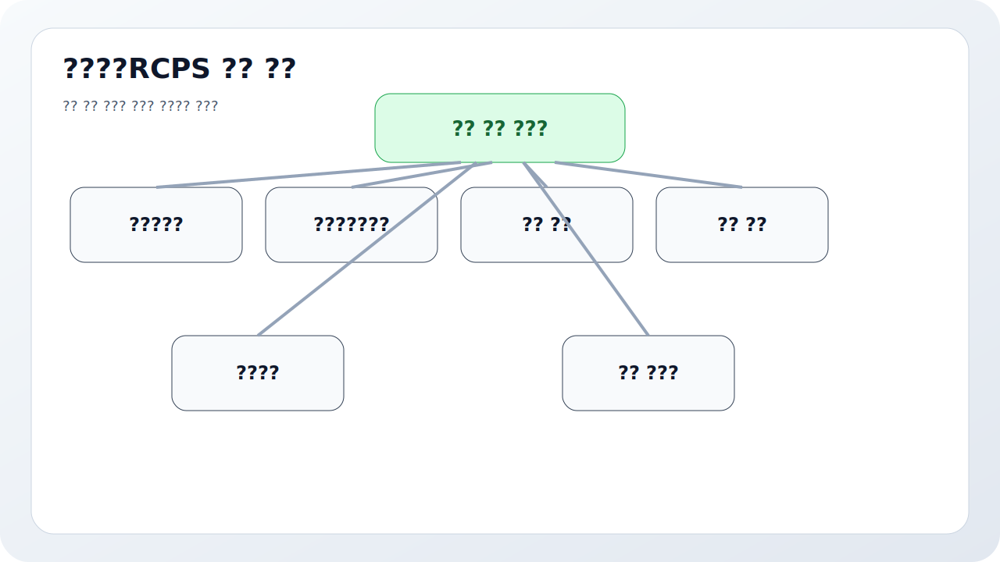
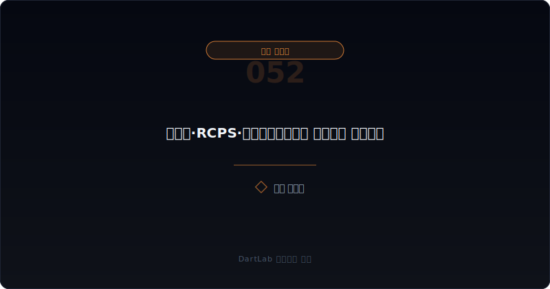
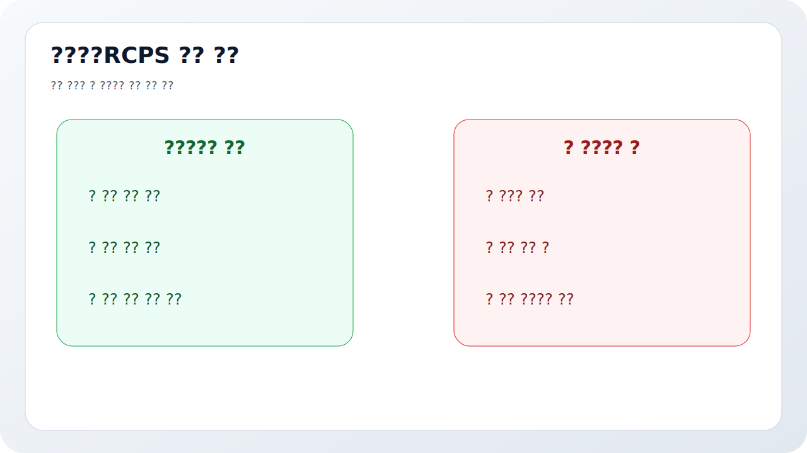
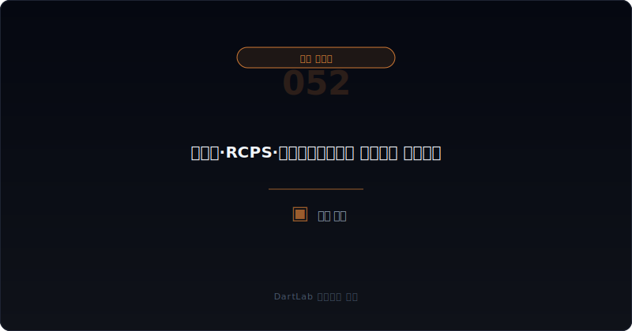

# 우선주·RCPS·상환전환우선주는 누구에게 유리한가

기업이 돈을 조달한다고 해서 다 같은 공시는 아니다. 보통주 발행인지, 단순 우선주인지, 전환권이 붙었는지, 상환권까지 붙었는지에 따라 기존 주주와 신규 투자자에게 돌아가는 권리가 완전히 달라진다. 그런데 많은 초보자는 "얼마를 조달하나"만 보고 끝낸다. 실전에서는 그보다 먼저 봐야 할 것이 있다. `누가 어떤 조건으로 먼저 보호받는가`다.

우선주와 RCPS, 상환전환우선주는 액면상 비슷해 보여도 해석 포인트가 다르다. 전환권이 있으면 잠재 희석을 봐야 하고, 상환권이 있으면 회사의 현금 부담을 봐야 하며, 우선배당과 청산 우선권이 있으면 이해관계의 우선순위를 봐야 한다. 그래서 이 공시는 자금조달 공시이면서 동시에 권리 구조 공시다.

이 글은 우선주와 RCPS를 `증권 종류 확인 -> 전환권·상환권 확인 -> 배당·우선권 확인 -> 리픽싱과 보호조항 확인 -> 후속 희석과 현금 부담 확인` 순서로 읽는 방법을 정리한다. 기본 조달 구조는 [유상증자 공시 읽는 법](/blog/rights-offering-disclosure), 희석형 조달은 [전환사채와 BW 공시 읽는 법](/blog/convertible-bond-and-bw-disclosure), 이해관계 변화는 [자기주식·제3자배정·최대주주 변경은 누구에게 유리한가](/blog/treasury-stock-third-party-allotment-and-major-shareholder-change), 후속 구조 재편은 [감자와 주식병합 공시는 무엇을 먼저 봐야 하나](/blog/capital-reduction-and-reverse-split-disclosure)와 같이 보면 좋다.

---

## 왜 보통주 증자처럼 보면 거의 항상 틀리나

보통주 증자는 비교적 단순하다. 얼마를 누구에게 어떤 가격으로 발행하는지가 핵심이다. 하지만 우선주와 RCPS는 거기에 `추가 권리`가 붙는다. 전환권, 상환권, 우선배당, 청산 우선권, 보호조항, 리픽싱 조건이 붙는 순간 같은 자금조달이라도 경제적 의미가 달라진다.

예를 들어 표면상 투자자는 우선주를 받아도, 실제로는 나중에 보통주로 바꿔 더 큰 upside를 가져갈 수 있다. 반대로 회사가 일정 시점 이후 상환해야 하는 구조라면, 현재는 자본처럼 보이는 조달이 나중에는 현금 부담으로 돌아올 수 있다. 따라서 액수보다 `권리의 방향`을 먼저 봐야 한다.

이 점은 [주식기준보상과 스톡옵션은 실제로 무엇을 희석시키나](/blog/share-based-compensation-and-stock-options)에서 본 희석 구조와도 닿아 있다. 당장 주식 수가 늘지 않아도 나중에 희석이 현실화될 수 있기 때문이다.

---

## 어떤 조건이 협상력을 결정하나

| 먼저 볼 항목 | 왜 중요한가 |
| --- | --- |
| 증권 종류 | 단순 우선주인지 RCPS인지 확인한다 |
| 전환 조건 | 언제 어떤 가격으로 보통주로 바뀌는지 본다 |
| 상환 조건 | 회사가 언제 현금 부담을 질 수 있는지 본다 |
| 우선배당·청산 우선권 | 누가 먼저 보호받는지 본다 |
| 리픽싱·보호조항 | 투자자에게 일방적으로 유리한지 본다 |
| 후속 희석·지배력 변화 | 기존 주주에게 어떤 결과가 남는지 본다 |

실전에서 가장 먼저 해야 할 일은 `이 증권이 결국 무엇으로 귀결되는가`를 적는 것이다. 보통주로 바뀔 가능성이 크면 희석형 증권으로 읽어야 하고, 상환 압박이 크면 사실상 미래 현금 부담으로 읽어야 한다. 그다음에야 조달 목적과 투자자 구성을 보는 편이 맞다.

또 하나 중요한 것은 배당과 청산 우선권이다. 투자자가 아래를 막고 위를 열어 두는 구조인지, 회사가 상당히 불리한 조건으로 자금을 끌어왔는지 여기서 감이 잡힌다. 따라서 RCPS는 단순히 "전환 가능 우선주"라고 읽기보다 `누가 먼저 돈을 회수하고 누가 나중에 희석을 감수하는가`라는 권리 순서로 읽는 편이 실전적이다.

---

## 발행자 시각 vs 투자자 시각

가장 실용적인 질문은 이것이다. `이 증권이 성장 자금을 위한 파트너 자본인가, 투자자 보호가 과도하게 강한 구조인가, 지배력과 이해관계를 바꾸는 계약인가`.

성장 자금을 위한 파트너 자본이라면 조달 목적과 실행 계획, 전환 조건, 기존 주주와의 이해관계 정렬이 비교적 자연스럽게 보인다. 투자자 보호가 과도하게 강한 구조라면 상환권, 리픽싱, 우선권이 한쪽으로 많이 기울어 있을 수 있다. 지배력 재편 구조라면 제3자배정 상대방, 최대주주 관계, 후속 주총과 지분 변화까지 같이 봐야 한다.

여기서 특히 중요한 것은 조달 목적과 후속 문서다. 운영자금, 시설자금, 타법인 투자라고 적어도 실제로 그 돈이 언제 쓰이고, 이후 어떤 공시가 붙는지에 따라 해석이 달라진다. 따라서 [공시에서 신규사업 계획은 어디까지 믿어야 하나](/blog/how-far-to-trust-new-business-plans)처럼 `말 -> 자금 -> 실행 -> 후속 숫자` 흐름으로 연결해 보는 편이 좋다.

---

## 조건이 바뀔 때 무엇이 움직이나

| 관찰 포인트 | 상대적으로 건강한 경우 | 더 조심해야 하는 경우 |
| --- | --- | --- |
| 조달 목적 | 자금 사용 계획이 비교적 분명하다 | 목적은 큰데 실행 경로가 흐리다 |
| 전환 조건 | 가격과 시점이 읽히고 과도한 조정 조항이 적다 | 리픽싱과 보호조항이 투자자 편향적이다 |
| 상환 조건 | 회사가 감당 가능한 구조로 보인다 | 상환 압박이 미래 현금위험으로 남는다 |
| 우선권 | 권리 구조가 비교적 단순하다 | 청산·배당 우선권이 복잡하게 얽힌다 |
| 이해관계 | 기존 주주와 신규 투자자 이해가 어느 정도 맞는다 | 특정 투자자에게만 과도하게 유리하다 |

건강한 경우는 투자자 보호가 있어도 회사가 왜 그 조건을 받아들였는지 읽히고, 기존 주주가 감수하는 희석과 회사가 얻는 성장 기회 사이 균형이 보인다. 반대로 더 조심해야 하는 경우는 조달 목적은 낙관적이지만 상환권과 리픽싱, 우선권이 한쪽으로 과하게 기울어 있다.

특히 `제3자배정 + RCPS + 후속 지배력 변화` 조합은 더 천천히 봐야 한다. 이때는 [최대주주 주식담보와 반대매매 위험은 어떻게 읽어야 하나](/blog/share-pledge-and-margin-call-risk)나 [지배구조가 위험한 회사는 어떤 패턴을 보이나](/blog/governance-red-flags)까지 같이 보면 지배력 압박과 자금 압박이 한 묶음인지 파악하는 데 도움이 된다.

---

## RCPS에서 특히 놓치기 쉬운 세 줄은 무엇인가

첫째는 `전환가격 조정`이다. 주가가 내려갈 때 전환가격이 어떻게 바뀌는지에 따라 기존 주주의 잠재 희석 규모가 달라진다. 둘째는 `상환 트리거`다. 상환청구 시점과 조건이 모호하면 미래 현금 부담을 과소평가하기 쉽다. 셋째는 `청산 우선권`이다. 사업이 잘 안 풀릴 때 누가 먼저 회수하는지를 여기서 보게 된다.

이 세 줄은 평소에는 조용하지만 상황이 나빠질수록 중요해진다. 회사가 성장 계획을 제대로 실행하지 못하거나 후속 조달이 막히면, RCPS는 순식간에 `주주에게는 희석`, `회사에는 상환 부담`, `투자자에게는 방어장치`로 읽히기 시작한다. 그래서 RCPS는 발행 시점보다 상황이 나빠질 때 더 많은 의미를 드러낸다.

---

## 투자자 이름보다 조건표가 더 중요할 때가 왜 많나

공시를 보다 보면 유명 투자기관 이름이나 전략적 투자자라는 표현에 시선이 먼저 간다. 물론 상대방의 성격도 중요하다. 하지만 실제 유불리를 가르는 것은 이름보다 조건표인 경우가 많다. 같은 투자자라도 전환가 조정 폭이 다르고, 상환권 행사 시점이 다르고, 우선배당과 청산 우선권이 다르면 기존 주주에게 남는 결과가 완전히 달라진다.

특히 회사가 "좋은 파트너 유치"를 강조할수록 조건표를 더 차분하게 봐야 한다. 진짜 좋은 파트너라면 조달 목적, 실행 계획, 권리 구조가 어느 정도 균형을 이룬다. 반대로 설명은 화려한데 조건표가 투자자 보호 일변도라면, headline보다 계약 구조를 더 무겁게 읽는 편이 맞다. 결국 RCPS 해석의 핵심은 사람 이름이 아니라 권리의 방향이다.

---

## 조건 해석에서 자주 놓치는 부분

### 1. 우선주면 그냥 배당만 조금 다른 주식이라고 본다

전환권, 상환권, 청산 우선권이 붙으면 전혀 다른 계약이 된다.

### 2. 당장 주식 수가 안 늘었으니 희석이 없다고 본다

전환 가능 구조라면 잠재 희석이 남아 있다.

### 3. 상환권은 먼 이야기라서 무시한다

자금 사정이 나빠질수록 그 조항이 핵심이 된다.

### 4. 투자자 이름만 보고 좋은 파트너라고 단정한다

조건표를 먼저 읽어야 실제 유불리가 보인다.

---

## 후속 이벤트에서 다시 확인할 것

| 이번에 본 것 | 다음에 다시 볼 것 |
| --- | --- |
| 전환 조건 | 실제 조정이 발생하는가 |
| 상환 조건 | 회사의 상환 부담이 커지는가 |
| 조달 목적 | 자금이 실제로 계획대로 쓰이는가 |
| 투자자 구성 | 지분과 이해관계가 바뀌는가 |
| 후속 희석 | 전환, 추가 조달, 주식 수 변화가 생기는가 |
| 본업 숫자 | 조달이 실제 실행과 매출·현금으로 이어지는가 |

우선주와 RCPS는 발행 공시 한 장으로 끝나는 문서가 아니다. 후속 전환, 상환, 조건 조정, 주식 수 변화, 최대주주 구조 변화가 이어지는지 봐야 의미가 완성된다. 그래서 발행 시점에 `희석`, `상환`, `우선권` 세 줄을 적어 두고 다음 보고서마다 다시 비교하는 편이 좋다.

이 습관이 있으면 같은 "자금조달 성공" headline도 훨씬 다르게 보인다. 숫자보다 권리 구조가 먼저 보이기 때문이다.

특히 후속 보고서에서는 자본금, 발행주식 수, 종류주식 내역, 주석의 조건 변경 문구를 같이 보는 편이 좋다. RCPS는 발행 순간보다 시간이 지난 뒤 더 많은 뜻을 드러내는 경우가 많다. 처음에는 성장 자금처럼 보여도 나중에는 상환 압박이나 잠재 희석으로 읽힐 수 있기 때문이다. 그래서 이 공시는 `계약이 실제로 어떤 방향으로 움직이는가`를 추적하는 습관이 중요하다.

---

## 실전 체크리스트

- 단순 우선주인지 RCPS인지 먼저 확인했는가
- 전환 조건과 조정 조항을 읽었는가
- 상환권과 상환 시점을 적어봤는가
- 우선배당과 청산 우선권이 누구를 보호하는지 봤는가
- 기존 주주에게 남는 잠재 희석을 계산해 봤는가
- 후속 공시에서 조건 조정과 지분 변화를 추적할 계획이 있는가

## FAQ

### RCPS는 무조건 나쁜가

항상 그렇지는 않다. 다만 권리 구조를 보지 않고 액수만 보면 거의 항상 해석이 틀어진다.

### 무엇이 가장 먼저 중요한가

전환권과 상환권이다. 결국 누구에게 어떤 방향의 권리가 열려 있는지 봐야 한다.

### 무엇을 같이 보면 좋은가

유상증자, CB/BW, 제3자배정, 최대주주 변화 글을 같이 보면 좋다.

### 가장 먼저 적어볼 한 줄은 무엇인가

이 자금조달은 회사보다 투자자를 더 강하게 보호하는 구조인가다.

이 한 줄만 정확히 적어도 RCPS 공시 해석의 방향이 훨씬 또렷해진다.

## 조건 분석에 참고할 글

- [유상증자 공시 읽는 법](/blog/rights-offering-disclosure)
- [전환사채와 BW 공시 읽는 법](/blog/convertible-bond-and-bw-disclosure)
- [자기주식·제3자배정·최대주주 변경은 누구에게 유리한가](/blog/treasury-stock-third-party-allotment-and-major-shareholder-change)
- [감자와 주식병합 공시는 무엇을 먼저 봐야 하나](/blog/capital-reduction-and-reverse-split-disclosure)
- [주식기준보상과 스톡옵션은 실제로 무엇을 희석시키나](/blog/share-based-compensation-and-stock-options)
- [최대주주 주식담보와 반대매매 위험은 어떻게 읽어야 하나](/blog/share-pledge-and-margin-call-risk)

## 관련 공시 출처

- [IAS 32 Financial Instruments: Presentation](https://www.ifrs.org/issued-standards/list-of-standards/ias-32-financial-instruments-presentation/)
- [IFRS 7 Financial Instruments: Disclosures](https://www.ifrs.org/issued-standards/list-of-standards/ifrs-7-financial-instruments-disclosures.html/)
- [DART 소개 - 보고서정보](https://dart.fss.or.kr/introduction/content2.do)
- [OpenDART 주요사항보고서 주요정보 목록](https://opendart.fss.or.kr/guide/main.do?apiGrpCd=DS005)
- [OpenDART 증권신고서 주요정보 목록](https://opendart.fss.or.kr/guide/main.do?apiGrpCd=DS006)
- [기업공시 길라잡이 - 정기보고서](https://dart.fss.or.kr/info/main.do?menu=210)

## 조건별 핵심 요약

우선주와 RCPS는 자금조달 공시이지만 동시에 권리 구조 공시다. 전환권, 상환권, 우선배당, 청산 우선권, 리픽싱을 따로 적어 보면 누가 먼저 보호받고 누가 나중에 희석을 감수하는지 드러난다.

핵심은 `얼마를 조달하나`보다 `누구에게 어떤 권리가 먼저 열리나`를 먼저 묻는 것이다. 이 질문을 붙이면 RCPS headline에 훨씬 덜 속게 된다.
