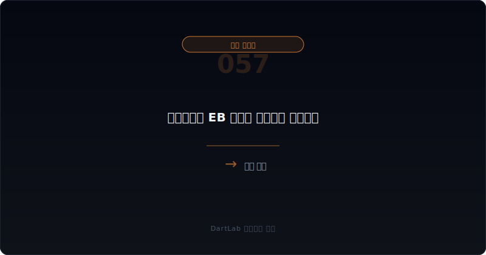
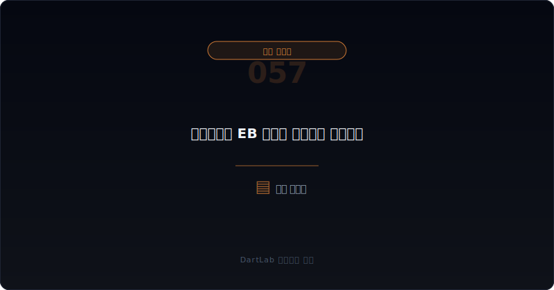
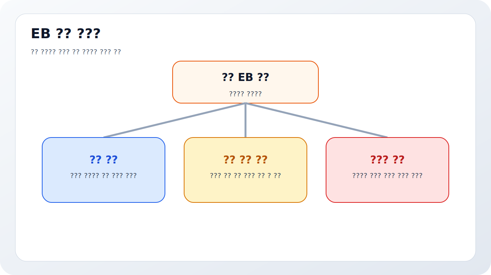
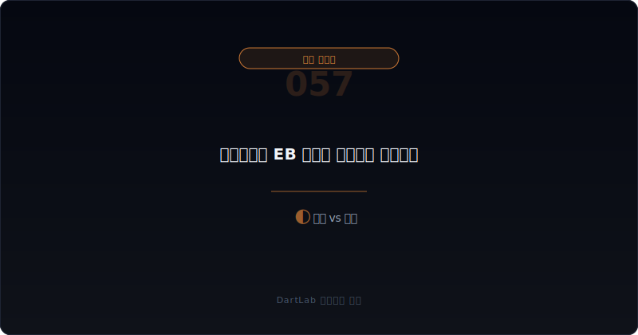
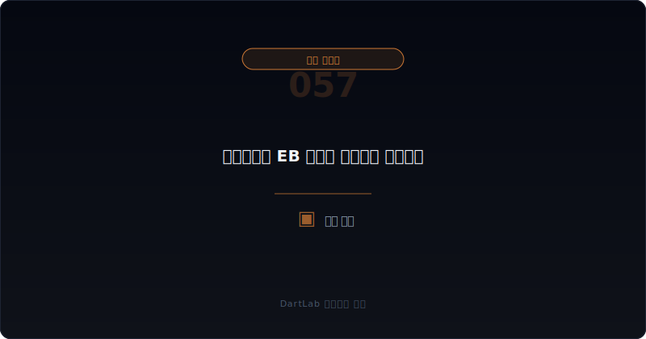

# 교환사채와 EB 공시는 누구에게 유리한가

교환사채는 이름만 들으면 전환사채와 비슷해 보인다. 그래서 많은 초보자가 둘을 같은 방식으로 읽는다. 하지만 실전에서는 다르다. 전환사채가 보통 `새 주식이 생길 수 있는 구조`에 더 가깝다면, 교환사채는 `기존에 존재하는 주식이 누구 손에서 누구 손으로 이동할 수 있는 구조`로 읽어야 할 때가 많다. 그래서 이 공시는 자금조달 공시이면서 동시에 지분 이동 공시다.

특히 교환 대상이 무엇인지, 누구 주식인지, 교환가액과 기간이 어떻게 열려 있는지, 이후 시장에 어떤 오버행을 남기는지가 중요하다. 이걸 놓치면 표면 금리와 만기만 보고 지나가게 된다. 하지만 투자 판단에서는 `회사가 돈을 어떻게 조달하나`보다 `어떤 주식이 어떤 조건으로 시장에 풀릴 수 있나`가 더 중요할 때가 많다.

이 글은 교환사채를 `기초자산 확인 -> 교환 조건 확인 -> 교환 대상 주식의 출처 확인 -> 오버행과 지배력 변화 가능성 확인 -> 후속 교환 현실화 추적` 순서로 읽는 방법을 정리한다. 비교 기준은 [전환사채와 BW 공시 읽는 법](/blog/convertible-bond-and-bw-disclosure), 권리 구조 비교는 [우선주·RCPS·상환전환우선주는 누구에게 유리한가](/blog/preferred-stock-and-rcps-disclosure), 이해관계 변화는 [자기주식·제3자배정·최대주주 변경은 누구에게 유리한가](/blog/treasury-stock-third-party-allotment-and-major-shareholder-change)와 같이 보면 좋다.

---

## 왜 CB처럼 보면 자주 틀리나

교환사채도 희석처럼 느껴질 수 있지만, 구조를 뜯어 보면 질문이 다르다. 전환사채는 보통 `나중에 보통주가 새로 생길 가능성`에 집중하게 된다. 반면 교환사채는 `기존에 존재하는 주식이 교환 대상`이어서, 시장에 어떤 물량이 풀릴 수 있는지, 누가 그 물량을 내주는지, 지배력과 유통 물량에 어떤 영향을 주는지가 핵심이 된다.

따라서 교환사채는 단순히 메자닌 조달의 한 종류로 볼 게 아니라 `기초자산 이동 계약`으로 읽는 편이 맞다. 교환 대상이 자기주식인지, 제3자 보유주식인지, 계열사 지분인지에 따라 해석이 크게 달라진다. 이 구분이 안 되면 금리와 액수만 보고 지나가게 된다.

또 하나 중요한 것은 오버행이다. 당장 주식 수가 안 늘어도, 교환 가능 구간이 열리면 시장은 잠재 물량을 의식한다. 그래서 교환사채는 발행 시점보다 교환 가능 시점에 더 많은 의미를 드러낼 수 있다.

---

## 어떤 조건이 협상력을 결정하나

| 먼저 볼 항목 | 왜 중요한가 |
| --- | --- |
| 교환 대상 주식 | 무엇이 기초자산인지 본다 |
| 교환가액과 비율 | 어느 가격대에서 물량 이동이 가능한지 본다 |
| 교환청구기간 | 오버행이 언제 열리는지 본다 |
| 주식 출처 | 자기주식인지, 특수관계인 지분인지 본다 |
| 자금조달 목적 | 왜 이 구조를 택했는지 본다 |
| 후속 지분 변화 | 실제 교환이 지배력과 유통 물량을 바꾸는지 본다 |

실전에서는 먼저 기초자산을 확인하는 것이 핵심이다. 같은 EB라도 교환 대상 주식이 자기주식이면 회사 보유 물량의 처리 문제로 읽게 되고, 특수관계인 보유주식이면 지배력과 이해관계 이동 문제로 읽게 된다. 그래서 `사채 조건`보다 `주식 조건`을 먼저 읽는 편이 낫다.

그다음에는 교환가액과 기간이다. 언제부터 교환이 가능하고, 어떤 가격 수준에서 투자자가 교환을 선택할 유인이 생기는지 봐야 한다. 이때 [주식기준보상과 스톡옵션은 실제로 무엇을 희석시키나](/blog/share-based-compensation-and-stock-options)처럼 잠재 물량이 시장에 어떻게 해석되는지에 대한 감각이 있으면 훨씬 유리하다.

여기에 하나를 더 붙이면 해석이 더 선명해진다. `그 주식을 왜 지금 이 구조에 넣었는가`다. 자기주식을 활용한 EB라면 회사가 보유 물량을 조달 도구로 쓰는 그림일 수 있고, 대주주나 특수관계인 지분이 기초자산이면 자금조달과 지배력 관리가 동시에 얽혀 있을 수 있다. 그래서 EB는 금리 상품이 아니라 `주식 출처가 드러나는 자금조달 구조`로 보는 편이 실전적이다.

---

## 발행자 시각 vs 투자자 시각

가장 실용적인 질문은 이것이다. `이 EB는 단순한 자금조달인가, 잠재 물량 이전 구조인가, 지배력과 이해관계 재편의 일부인가`.

단순 자금조달이라면 조달 목적과 조건, 교환 대상 주식의 출처가 비교적 단순하게 읽힌다. 잠재 물량 이전 구조라면 시장에 풀릴 수 있는 물량과 시점이 핵심이 된다. 지배력 재편의 일부라면 [감자와 주식병합 공시는 무엇을 먼저 봐야 하나](/blog/capital-reduction-and-reverse-split-disclosure), [최대주주 주식담보와 반대매매 위험은 어떻게 읽어야 하나](/blog/share-pledge-and-margin-call-risk) 같은 글과 함께 지분 이동 압박까지 같이 봐야 한다.

이 분기에서 특히 중요한 것은 기초자산의 희소성이다. 교환 대상 주식이 평소 유통 물량에 비해 크면, 교환 가능 시점에 시장이 받는 압박도 커질 수 있다. 반대로 규모가 작고 구조가 단순하면 오버행 부담은 상대적으로 약할 수 있다. 그래서 EB는 금리보다 `기초자산의 성격과 규모`가 먼저다.

또한 EB는 단독으로 등장하지 않는 경우가 많다. 앞뒤로 [유상증자 공시 읽는 법](/blog/rights-offering-disclosure), [우선주·RCPS·상환전환우선주는 누구에게 유리한가](/blog/preferred-stock-and-rcps-disclosure), [감자와 주식병합 공시는 무엇을 먼저 봐야 하나](/blog/capital-reduction-and-reverse-split-disclosure) 같은 이벤트가 이어지면, 이 공시는 단순 조달이 아니라 전체 자본정책의 한 조각일 수 있다. 그래서 가능하면 EB 한 건만 떼어 보지 말고 전후 6개월 이벤트를 같이 적어 두는 편이 낫다.

---

## 조건이 바뀔 때 무엇이 움직이나

| 관찰 포인트 | 상대적으로 건강한 경우 | 더 조심해야 하는 경우 |
| --- | --- | --- |
| 기초자산 설명 | 어떤 주식인지 비교적 분명하다 | 기초자산 출처와 의미가 흐리다 |
| 교환 조건 | 가격과 기간이 읽히고 과도한 조정이 적다 | 조건이 복잡하고 잠재 물량 부담이 크다 |
| 조달 목적 | 자금 사용 계획이 비교적 구체적이다 | 목적은 큰데 실행 경로가 흐리다 |
| 오버행 | 규모와 시점이 감당 가능해 보인다 | 시장에 큰 물량 압박을 남긴다 |
| 이해관계 | 기존 주주와의 충돌이 제한적이다 | 특정 이해관계자에게 유리하게 보인다 |

상대적으로 건강한 경우는 EB 구조가 왜 필요한지, 어떤 주식이 어떻게 움직일 수 있는지, 기존 주주에게 어떤 영향이 남는지 비교적 읽힌다. 반대로 더 조심해야 하는 경우는 조달 목적은 낙관적이지만 기초자산과 잠재 물량 부담, 이해관계 이동이 흐리다.

특히 교환 대상이 자기주식이거나 주요주주 관련 주식이면 [지분공시 종합정보조회](https://opendart.fss.or.kr/disclosureinfo/qota/main.do)와 함께 실제 보유 구조를 다시 보는 편이 좋다. EB는 표면상 사채 공시지만, 실제로는 주식 이동 공시의 성격도 강하기 때문이다.

---

## 교환이 실제로 일어나기 전에도 왜 시장은 부담을 느끼나

교환이 아직 현실화되지 않았는데도 시장이 부담을 느끼는 이유는 잠재 물량이 열려 있기 때문이다. 투자자는 교환가액과 기간, 기초자산 규모를 보고 미리 오버행을 가격에 반영할 수 있다. 그래서 EB는 실제 교환 공시가 나오기 전부터 수급 해석에 영향을 줄 수 있다.

이 점에서 EB는 [전환사채와 BW 공시 읽는 법](/blog/convertible-bond-and-bw-disclosure)과 닮았지만, underlying share가 기존 주식이라는 점에서 다르다. 새 주식이 생기느냐보다 기존 주식이 어떤 가격대에서 이동하느냐가 핵심이기 때문이다. 이 차이를 이해하면 EB 공시를 훨씬 덜 뭉뚱그려 읽게 된다.

특히 거래량이 얇은 종목은 이 부담을 더 크게 받는다. 교환 대상 물량이 일평균 거래량과 비교해 크면, 실제 교환이 시작되지 않았어도 시장은 미리 할인해서 볼 수 있다. 그래서 EB를 읽을 때는 발행 총액뿐 아니라 `기초자산 주식 수`, `예상 교환 가능 물량`, `평소 거래량`을 같이 보는 습관이 유용하다.

교환가액 조정 가능성도 반드시 체크해야 한다. 표면상 고정 가격처럼 보여도 특정 조건에서 조정이 가능하면 잠재 물량 부담은 더 커질 수 있다. 따라서 EB는 `이자율과 만기`가 아니라 `주식 이동 가격표`를 읽는다는 감각으로 접근하는 편이 훨씬 정확하다.

결국 EB를 읽을 때 핵심 질문은 간단하다. 이 공시가 자금조달 설명으로 끝나는지, 아니면 주식 이동과 이해관계 변화 설명까지 요구하는지다. 후자라면 사채 공시만 보고 끝내면 거의 항상 늦다.

그래서 EB는 늘 주식 쪽 장부와 같이 읽는 편이 맞다.

---

## 조건 해석에서 자주 놓치는 부분

### 1. EB도 그냥 CB처럼 읽는다

기초자산과 지분 이동 구조가 더 중요할 수 있다.

### 2. 표면 금리와 만기만 본다

교환가액, 기간, 기초자산 규모가 핵심이다.

### 3. 당장 주식 수가 안 늘어나니 부담이 없다고 본다

잠재 물량과 오버행은 이미 시장 해석에 영향을 준다.

### 4. 기초자산의 출처를 안 본다

자기주식인지, 특수관계인 지분인지에 따라 의미가 크게 달라진다.

---

## 후속 이벤트에서 다시 확인할 것

| 이번에 본 것 | 다음에 다시 볼 것 |
| --- | --- |
| 교환가액 | 조정이 발생하는가 |
| 교환청구기간 | 실제 교환이 시작되는가 |
| 기초자산 규모 | 시장 부담이 커지는가 |
| 자금조달 목적 | 실제로 계획대로 쓰이는가 |
| 지분 구조 | 주요주주·자기주식 구성이 달라지는가 |
| 후속 조달 | CB, RCPS, 증자와 겹치는가 |

EB는 발행 공시보다 후속 공시에서 더 많은 의미가 드러날 수 있다. 실제 교환이 이뤄지는지, 조건이 조정되는지, 기초자산이 어떤 속도로 이동하는지, 지분 구조가 달라지는지를 같이 봐야 한다. 그래서 발행 시점에 `기초자산`, `교환가액`, `기간`, `규모`, `이해관계` 다섯 줄을 적어 두는 편이 좋다.

이 다섯 줄만 있어도 EB를 단순 사채가 아니라 주식 이동 구조로 읽는 감각이 생긴다.

---

## 실전 체크리스트

- 교환 대상 주식이 무엇인지 확인했는가
- 교환가액과 교환비율을 읽었는가
- 교환청구기간이 언제 열리는지 적어봤는가
- 기초자산의 출처가 자기주식인지, 특수관계인 지분인지 봤는가
- 잠재 오버행 규모를 생각해 봤는가
- 후속 교환과 지분 변화를 추적할 계획이 있는가

## FAQ

### EB는 CB와 같은가

비슷해 보여도 다르다. EB는 기존 주식이 어떻게 이동하는지가 핵심일 수 있다.

### 무엇이 가장 먼저 중요한가

기초자산과 교환 조건이다.

### 무엇을 같이 보면 좋은가

CB/BW, RCPS, 자기주식, 최대주주 변화 글을 같이 보면 좋다.

### 가장 먼저 적어볼 한 줄은 무엇인가

이 EB는 돈을 빌리는 공시인가, 주식을 움직이는 공시인가다.

## 조건 분석에 참고할 글

- [전환사채와 BW 공시 읽는 법](/blog/convertible-bond-and-bw-disclosure)
- [우선주·RCPS·상환전환우선주는 누구에게 유리한가](/blog/preferred-stock-and-rcps-disclosure)
- [자기주식·제3자배정·최대주주 변경은 누구에게 유리한가](/blog/treasury-stock-third-party-allotment-and-major-shareholder-change)
- [감자와 주식병합 공시는 무엇을 먼저 봐야 하나](/blog/capital-reduction-and-reverse-split-disclosure)
- [최대주주 주식담보와 반대매매 위험은 어떻게 읽어야 하나](/blog/share-pledge-and-margin-call-risk)
- [주식기준보상과 스톡옵션은 실제로 무엇을 희석시키나](/blog/share-based-compensation-and-stock-options)

## 관련 공시 출처

- [OpenDART 주요사항보고서 주요정보 목록](https://opendart.fss.or.kr/guide/main.do?apiGrpCd=DS005)
- [OpenDART 교환사채권 발행결정 개발가이드](https://opendart.fss.or.kr/guide/detail.do?apiGrpCd=DS005&apiId=2020035)
- [OpenDART 증권신고서 주요정보 목록](https://opendart.fss.or.kr/guide/main.do?apiGrpCd=DS006)
- [OpenDART 지분공시 종합정보조회](https://opendart.fss.or.kr/disclosureinfo/qota/main.do)
- [DART 소개 - 보고서정보](https://dart.fss.or.kr/introduction/content2.do)

## 조건별 핵심 요약

교환사채와 EB는 단순한 사채 공시가 아니라, 기존 주식이 어떤 조건으로 이동할 수 있는지를 보여주는 구조 공시다. 그래서 기초자산, 교환가액, 기간, 오버행, 지분 변화 가능성을 같이 봐야 의미가 드러난다.

핵심은 `얼마를 조달하나`보다 `어떤 주식이 어떤 가격대에서 누구 손으로 움직일 수 있나`를 먼저 묻는 것이다. 이 질문을 붙이면 EB 공시가 훨씬 덜 모호해진다.
