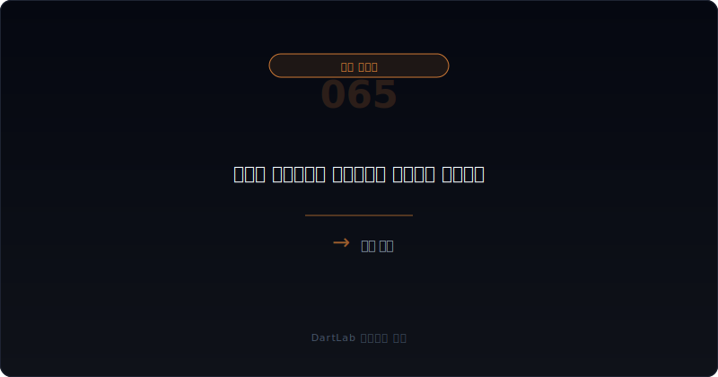
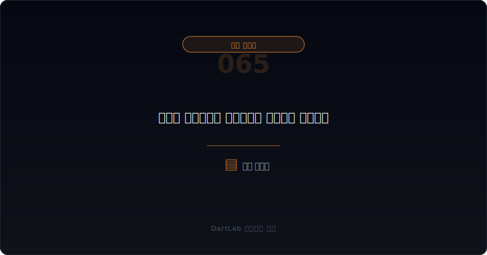
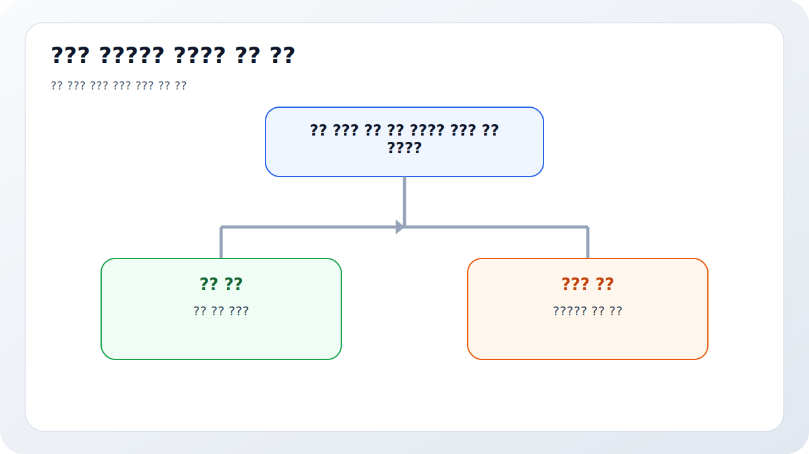
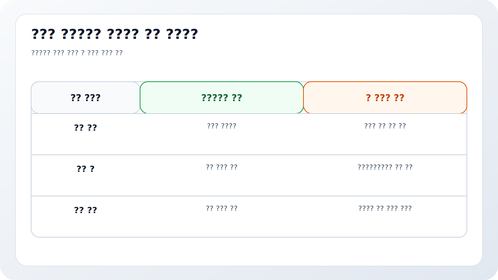

# 메자닌 만기연장과 조건변경은 누구에게 유리한가

메자닌 공시는 발행 시점보다 발행 후가 더 중요해지는 경우가 많다. 처음 발행결정 공시에서는 화려한 자금 목적과 성장 계획이 보이지만, 진짜 이해관계는 그 뒤 조건변경에서 드러난다. 만기연장, 전환가액 재조정, 이자율 변경, 풋옵션 조정, 담보 추가, 조기상환 유예 같은 문장은 대체로 `처음 계획대로 흘러가지 않았다`는 신호일 가능성이 높다.

특히 만기연장과 조건변경은 단순 기술 수정이 아니라 위험 재배치다. 회사는 시간을 벌고 싶어 하고, 투자자는 더 강한 보호를 원한다. 그래서 어떤 조항이 바뀌었는지 따라가면 누가 급한지, 누가 협상력을 쥐고 있는지, 주주에게 어떤 희석과 현금 압박이 남는지가 보인다.

이 글은 메자닌 조건변경을 `원래 계약 확인 -> 무엇이 바뀌었는지 확인 -> 왜 지금 바뀌는지 확인 -> 회사에 유리한지 투자자에 유리한지 판단 -> 후속 전환·상환·희석을 추적` 순서로 읽는 방법을 정리한다. 기본 조건 해석은 [전환사채와 BW 공시 읽는 법](/blog/convertible-bond-and-bw-disclosure), 보호조항 이해는 [메자닌 보호조항과 리픽싱은 누구에게 유리한가](/blog/mezzanine-protections-and-refixing), 다른 희석형 이벤트는 [우선주·RCPS·상환전환우선주는 누구에게 유리한가](/blog/preferred-stock-and-rcps-disclosure)와 같이 보면 좋다.

---

## 왜 발행결정보다 조건변경이 더 솔직할 때가 많나

발행결정 공시는 기대를 담는다. 조달 목적, 성장 계획, 자금 사용처가 앞에 나온다. 하지만 조건변경 공시는 현실을 담는다. 돈이 제때 안 돌았는지, 주가가 기대보다 약했는지, 투자자가 원래 조건으로는 못 버티겠다고 판단했는지, 회사가 상환 압박을 피하려는지 같은 정보가 조건 조정에 반영된다.

특히 만기연장은 `시간이 더 필요하다`는 뜻이다. 이 자체가 나쁜 것은 아니지만, 왜 시간이 필요한지부터 봐야 한다. 사업 진척이 늦은 것인지, 자금조달 계획이 꼬인 것인지, 기존 투자자에게 현금 상환할 능력이 부족한 것인지, 다른 딜이 먼저 정리돼야 하는 것인지 의미가 다르다.

조건변경은 협상력의 방향도 보여 준다. 투자자에게 유리한 조항이 늘어나면 회사가 약한 쪽일 가능성이 크다. 반대로 투자자가 일부 권리를 양보하고 시간을 더 주는 구조면, 회사가 최소한 협상 가능한 카드나 회복 기대를 갖고 있을 수 있다. 그래서 메자닌은 발행 시점보다 `후속 수정 공시`가 더 직접적인 진단서가 되곤 한다.

---

## 무엇을 먼저 붙여서 봐야 하나

| 먼저 볼 항목 | 왜 중요한가 |
| --- | --- |
| 원래 만기와 상환 구조 | 무엇을 바꾼 것인지 기준점이 된다 |
| 연장 기간 | 단기 유예인지 사실상 재구조화인지 본다 |
| 이자율·프리미엄 변화 | 회사의 현금 부담이 달라진다 |
| 전환가액·행사가액 조정 | 희석 하단과 주가 압박을 읽을 수 있다 |
| 풋옵션·콜옵션 변화 | 누가 주도권을 쥐는지 보인다 |
| 담보·보호조항 추가 | 투자자 방어가 강해지는지 본다 |
| 후속 공시 | 실제 전환, 상환, 재차 연장이 이어지는지 본다 |

실전에서는 먼저 원래 계약을 간단히 적는 것이 핵심이다. 만기일, 이자율, 전환가액, 리픽싱 하한, 조기상환권, 담보 유무가 기준점이 된다. 기준점이 없으면 `조건이 바뀌었다`는 말만 남고 무엇이 누구에게 유리해졌는지 판단하기 어렵다.

그다음은 무엇이 바뀌었는지 본다. 단순히 만기만 늦췄는지, 이자율과 상환 프리미엄까지 올랐는지, 전환가액 하한이 더 낮아졌는지, 담보가 추가됐는지, 투자자의 풋옵션이 강화됐는지에 따라 의미가 달라진다. 보통 회사가 급할수록 투자자 보호는 더 강해지고, 기존 주주 입장에서는 희석과 현금 부담이 동시에 커진다.

후속 전환과 상환도 꼭 붙여 봐야 한다. 조건변경 자체는 문장으로 끝나지만, 진짜 영향은 그 뒤 현실화에서 나온다. 전환 청구가 늘어나는지, 상환이 실제로 발생하는지, 또다시 연장이 나오는지 보면 이번 변경이 임시 봉합인지 구조적 문제인지 드러난다. 이 점에서 [교환사채와 EB 공시는 누구에게 유리한가](/blog/exchangeable-bond-disclosure), [유상증자 공시 읽는 법](/blog/rights-offering-disclosure), [자기주식·제3자배정·최대주주 변경은 누구에게 유리한가](/blog/treasury-stock-third-party-allotment-and-major-shareholder-change)와의 연결이 중요하다.

---

## 어디서부터 해석을 가르면 되나

가장 실용적인 질문은 이것이다. `이 조건변경은 회사에 숨 쉴 시간을 주는가, 아니면 투자자 보호를 더 강하게 만들 뿐인가`.

회사 숨통 확보에 가까운 경우는 만기만 일부 연장되고, 금리·프리미엄·희석 하한이 과도하게 악화되지 않으며, 동시에 후속 영업현금흐름이나 조달 계획이 어느 정도 읽힌다. 균형 조정에 가까운 경우는 회사와 투자자가 서로 조금씩 양보하는 구조다.

투자자 우위 강화에 가까운 경우는 연장과 함께 이자율이 오르고, 상환 프리미엄이 붙고, 전환가액 하한이 낮아지고, 담보와 풋옵션이 강화된다. 이 경우 회사는 시간을 사지만, 그 대가를 미래 현금흐름과 기존 주주의 희석으로 치를 가능성이 크다. 그래서 [차입 약정 위반과 기한이익상실 위험은 어디서 먼저 드러나나](/blog/debt-covenant-breach-and-acceleration-risk), [최대주주 주식담보와 반대매매 위험은 어떻게 읽어야 하나](/blog/share-pledge-and-margin-call-risk)와 함께 보면 실제 압박이 더 분명해진다.

---

## 상대적으로 건강한 경우와 더 조심해야 하는 경우는 무엇이 다른가

| 관찰 포인트 | 상대적으로 건강한 경우 | 더 조심해야 하는 경우 |
| --- | --- | --- |
| 연장 배경 | 일정 지연 등 설명이 구체적이다 | 자금 사정 악화 같은 추상 설명만 있다 |
| 조건 변화 폭 | 일부 조정에 그친다 | 금리, 상환, 희석 하한이 동시에 악화된다 |
| 투자자 보호 | 과도하지 않고 균형적이다 | 담보, 풋옵션, 프리미엄이 한꺼번에 강해진다 |
| 회사 현금 부담 | 버틸 수 있는 수준으로 읽힌다 | 미래 상환 부담이 더 커진다 |
| 희석 구조 | 하한과 전환 조건이 어느 정도 방어된다 | 하향 리픽싱과 반복 전환 위험이 커진다 |
| 후속 사건 | 추가 변경 없이 정리된다 | 다시 연장하거나 다른 조달이 연달아 붙는다 |

상대적으로 건강한 경우는 연장이 왜 필요한지 설명이 구체적이고, 변경 폭이 제한적이며, 후속 실행이 비교적 빨리 정리된다. 회사가 시간을 벌지만 기존 주주에게 과도한 희생을 요구하지 않는 구조다.

더 조심해야 하는 경우는 투자자 보호가 계속 강화되는데 회사의 영업과 현금은 여전히 약하다. 이때는 조건변경이 문제 해결이 아니라 문제의 연장일 수 있다. 같은 해에 유상증자, 감자, 자산매각, 최대주주 변경 가능성까지 붙는다면 투자자는 단일 공시가 아니라 구조 전체를 봐야 한다.

---

## 왜 연장보다 희석 하한과 현금 부담을 같이 봐야 하나

만기연장 소식만 보면 회사가 한숨 돌린 것처럼 보인다. 하지만 실제로는 연장 그 자체보다 연장을 위해 무엇을 내줬는지가 중요하다. 전환가액 하한이 낮아지면 기존 주주 희석이 커지고, 이자율과 상환 프리미엄이 올라가면 미래 현금 부담이 커진다. 즉 지금의 시간은 벌지만 나중의 대가는 더 무거워질 수 있다.

그래서 메자닌 조건변경은 `시간 확보`와 `비용 증가`를 동시에 적어야 한다. 한 줄만 보면 항상 오해가 생긴다. 특히 회사가 영업현금흐름이 약하고, 차입 약정 압박이 있고, 다른 조달 수단도 막혀 있다면 조건변경은 자율적 선택보다 협상력 열세의 결과일 가능성이 크다.

결국 중요한 것은 누구의 downside가 줄었는가다. 투자자의 downside가 줄고 회사와 기존 주주의 downside가 커졌다면, 그 조건변경은 사실상 투자자 우위 재협상으로 읽는 편이 맞다.

실전에서는 변경 전후 표를 직접 그려 보는 것이 가장 빠르다. `만기`, `이자`, `상환`, `전환가액`, `하한`, `담보`, `풋옵션` 일곱 줄만 나란히 놓아도 방향이 드러난다. 회사가 얻은 것은 시간이 전부인데 투자자가 얻은 것은 금리, 권리, 담보, 희석 방어라면, 협상력의 방향은 이미 충분히 보인다.

또한 조건변경은 다른 이벤트와 따로 오지 않는 경우가 많다. 같은 시기에 최대주주 담보, 유상증자 검토, 자산 매각, 감사 문구 악화가 붙는다면 메자닌 조건변경은 고립된 사건이 아니라 압박 구조의 일부다. 그래서 메자닌 글은 항상 자본거래와 유동성 글 사이에 두고 읽는 편이 실전에 더 가깝다.

---

## 자주 놓치는 해석 4가지

### 1. 만기연장이면 좋은 뉴스라고 본다

시간을 벌었을 뿐 비용과 희석이 커졌을 수 있다.

### 2. 원래 조건과 비교하지 않는다

기준점이 없으면 무엇이 누구에게 유리해졌는지 보이지 않는다.

### 3. 전환가액 하한을 가볍게 본다

희석 압력은 결국 주주 몫이다.

### 4. 후속 공시를 안 본다

전환, 상환, 재차 연장이 진짜 영향을 보여 준다.

---

## 다음 보고서와 후속 숫자에서 무엇을 다시 봐야 하나

| 이번에 본 것 | 다음에 다시 볼 것 |
| --- | --- |
| 연장 기간 | 실제 상환 시점이 또 늦춰지는가 |
| 전환가액·하한 | 추가 조정이 발생하는가 |
| 이자율·프리미엄 | 현금 부담이 커지는가 |
| 담보·풋옵션 | 투자자 권리가 더 강화되는가 |
| 후속 전환·상환 | 희석과 현금 유출이 현실화되는가 |
| 다른 조달 이벤트 | 유상증자, 감자, 최대주주 변화가 붙는가 |

메자닌 조건변경은 공시 한 번으로 끝나지 않는다. 그 뒤 전환청구, 상환, 재매각, 재연장, 정정공시가 붙을 수 있다. 그래서 다음 보고서와 다음 이벤트 공시를 같이 봐야 한다. 조건변경 이후에도 현금흐름과 사업 진행이 나아지지 않으면, 이번 조정은 그냥 시간을 산 것에 불과할 수 있다.

가장 실용적인 메모는 다섯 줄이다. `연장`, `이자`, `희석 하한`, `투자자 권리`, `후속 현실화`. 이 다섯 줄만 적어도 누구에게 유리한 계약인지 윤곽이 잡힌다.

---

## 10분 체크리스트

- 원래 만기와 전환 조건을 적었는가
- 무엇이 얼마나 바뀌었는지 비교했는가
- 이자와 상환 프리미엄이 커졌는지 봤는가
- 전환가액 하한과 희석 영향을 봤는가
- 담보나 풋옵션 같은 투자자 권리 변화가 있는가
- 후속 전환·상환 공시를 추적할 계획이 있는가

## FAQ

### 만기연장이면 회사에 좋은 것 아닌가

시간은 벌 수 있지만 그 대가로 희석과 현금 부담이 커질 수 있다.

### 가장 먼저 봐야 할 것은 무엇인가

원래 조건과 바뀐 조건의 차이다.

### 누구에게 유리한지 어떻게 판단하나

투자자 보호는 얼마나 강화됐고 회사와 기존 주주 부담은 얼마나 커졌는지 보면 된다.

### 무엇을 같이 보면 좋은가

전환사채, RCPS, EB, 유상증자, 차입 약정, 최대주주 담보와 같이 보면 좋다.

## 같이 읽으면 좋은 글

- [전환사채와 BW 공시 읽는 법](/blog/convertible-bond-and-bw-disclosure)
- [메자닌 보호조항과 리픽싱은 누구에게 유리한가](/blog/mezzanine-protections-and-refixing)
- [우선주·RCPS·상환전환우선주는 누구에게 유리한가](/blog/preferred-stock-and-rcps-disclosure)
- [교환사채와 EB 공시는 누구에게 유리한가](/blog/exchangeable-bond-disclosure)
- [차입 약정 위반과 기한이익상실 위험은 어디서 먼저 드러나나](/blog/debt-covenant-breach-and-acceleration-risk)
- [최대주주 주식담보와 반대매매 위험은 어떻게 읽어야 하나](/blog/share-pledge-and-margin-call-risk)

## 참고한 공식 자료

- [OpenDART 전환사채권 발행결정](https://opendart.fss.or.kr/guide/detail.do?apiGrpCd=DS005&apiId=2020033)
- [OpenDART 신주인수권부사채권 발행결정](https://opendart.fss.or.kr/guide/detail.do?apiGrpCd=DS005&apiId=2020034)
- [OpenDART 증권신고서 주요정보](https://opendart.fss.or.kr/guide/main.do?apiGrpCd=DS006)
- [DART 소개 - 보고서정보](https://dart.fss.or.kr/introduction/content2.do)
- [DART 정정신고서 이용시 유의사항](https://dart.fss.or.kr/introduction/content4.do)
- [2025년 주요위반사례 3 PDF](https://dart.fss.or.kr/info/downloadKeyCase.do?filename=2025%EB%85%84+%EC%A3%BC%EC%9A%94%EC%9C%84%EB%B0%98%EC%82%AC%EB%A1%80_3.pdf&seqno=41)

## 정리

메자닌 만기연장과 조건변경은 단순 수정 공시가 아니라 위험 재배치 공시다. 회사는 시간을 벌고 싶어 하고, 투자자는 더 강한 방어를 원한다. 그래서 원래 조건과 바뀐 조건을 나란히 놓고 누가 무엇을 얻었는지 봐야 한다.

핵심은 `연장됐는가`가 아니라 `연장을 위해 무엇을 내줬는가`를 묻는 것이다. 이 질문을 붙이면 조건변경 공시가 훨씬 덜 모호하게 읽힌다.
