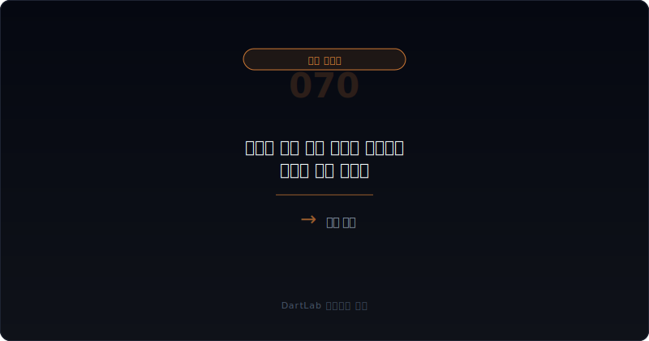
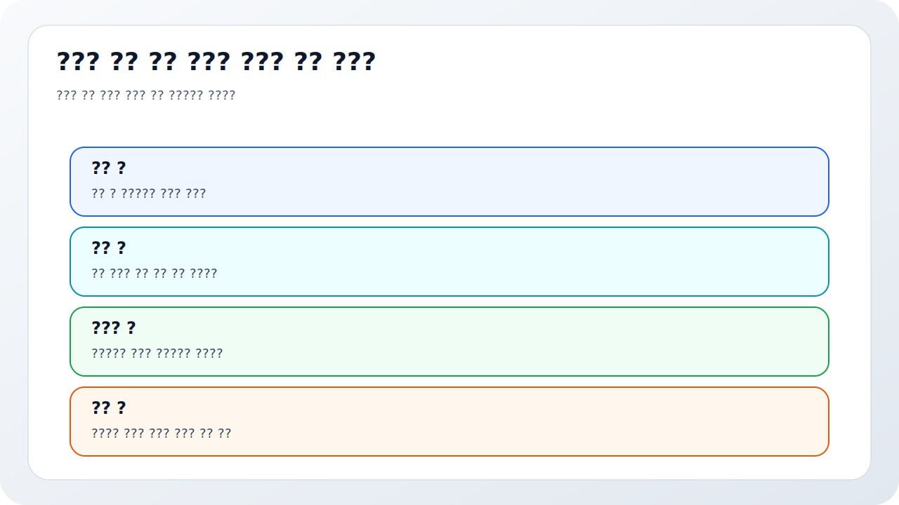
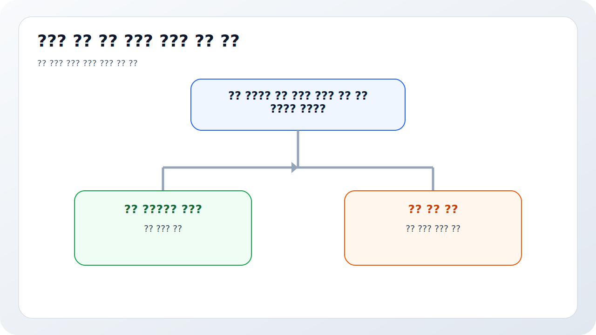
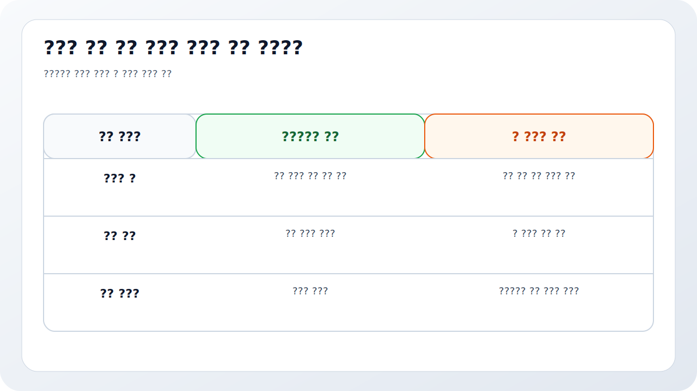
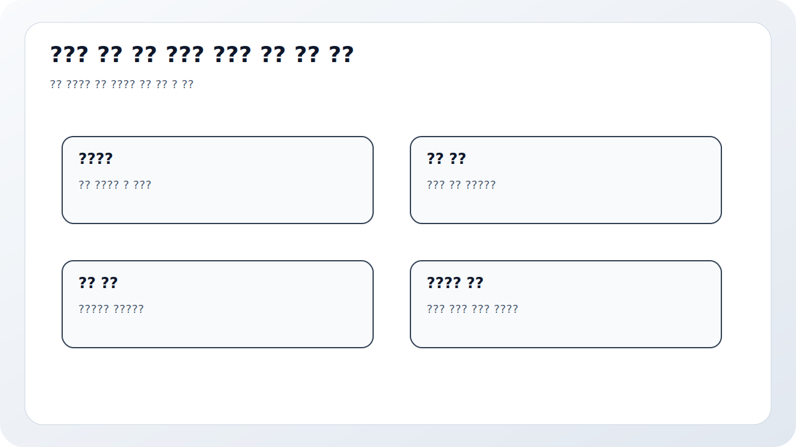

# 리픽싱 이후 실제 전환과 오버행은 어디서 먼저 보이나

리픽싱 공시를 읽고 끝내면 절반만 본 것이다. 많은 투자자는 전환가액 조정 공시에서 충격을 받고 멈추지만, 실제 주가 압력은 그 뒤에 더 선명해진다. 전환청구권 행사, 추가상장, 보호예수 여부, 잔여 물량, 최대주주 지분 변화, 다른 메자닌 조건변경이 이어지면 리픽싱은 비로소 `장부 위 조항`에서 `시장 위 물량`으로 바뀐다.

특히 리픽싱 이후에는 질문이 달라져야 한다. `전환가액이 얼마로 내려갔는가`보다 `이제 얼마나 전환이 가능해졌는가`, `누가 언제 주식으로 바꿔 나올 수 있는가`, `얼마나 오랫동안 매도 압력이 이어질 수 있는가`를 먼저 물어야 한다. 이 단계에서 오버행은 심리 문제가 아니라 실제 공급 구조가 된다.

이 글은 리픽싱 이후 오버행을 `조정된 전환가액 확인 -> 전환 가능 물량 계산 -> 실제 전환청구권 행사 추적 -> 추가상장과 잔여 물량 확인 -> 지분·주가 압력으로 연결` 순서로 읽는 방법을 정리한다. 기본 토대는 [전환사채와 BW 공시 읽는 법](/blog/convertible-bond-and-bw-disclosure), 계약 재협상은 [메자닌 만기연장과 조건변경은 누구에게 유리한가](/blog/mezzanine-extension-and-condition-change), 보호조항은 [메자닌 보호조항과 리픽싱은 누구에게 유리한가](/blog/mezzanine-protections-and-refixing)와 같이 보면 좋다.

---

## 왜 리픽싱 공시만 보면 부족한가

리픽싱 공시는 조건 변화를 알려 준다. 하지만 투자자가 실제로 맞닥뜨리는 것은 물량 변화다. 전환가액이 내려가면 같은 금액의 사채가 더 많은 주식으로 바뀔 수 있고, 전환청구가 현실화되면 추가상장이 이어지며, 그 주식이 시장에서 매도로 나올 가능성이 커진다. 그래서 리픽싱은 항상 `후속 전환`과 같이 읽어야 한다.

또한 리픽싱 이후 바로 전환이 나오지 않을 수도 있다. 투자자가 상황을 보며 나눠서 행사할 수 있고, 일부는 상환을 택하거나 다시 조건변경을 요구할 수도 있다. 그래서 오버행은 `한 번에 끝나는 이벤트`보다 `몇 달에 걸쳐 풀리는 공급 압박`으로 읽는 편이 맞다.

시장에서는 종종 리픽싱 공시 당일보다 이후 추가상장 시점이 더 중요해진다. 실제 물량이 상장되고, 보호예수 여부가 확인되고, 잔여 사채 물량이 남아 있으면 투자자는 남은 공급 압력을 다시 계산해야 한다. 이 단계에서 회사가 또 다른 조달을 붙이거나 최대주주 지분이 흔들리면 구조는 더 나빠질 수 있다.

---

## 무엇을 먼저 붙여서 봐야 하나

| 먼저 볼 항목 | 왜 중요한가 |
| --- | --- |
| 조정 후 전환가액 | 전환 가능 주식 수의 기준이 된다 |
| 리픽싱 하한 | 희석 압력이 어디까지 열려 있는지 본다 |
| 잔여 사채 물량 | 아직 남은 공급 폭탄이 얼마나 큰지 본다 |
| 전환청구권 행사 공시 | 실제 물량이 현실화됐는지 확인한다 |
| 추가상장 일정 | 공급이 시장에 언제 풀리는지 본다 |
| 보호예수·보유주체 | 즉시 매도 가능 물량인지 판단한다 |
| 최대주주·주주환원 변화 | 지분 구조와 이해관계가 흔들리는지 본다 |

실전에서는 먼저 조정 후 전환가액과 잔여 사채 물량을 같이 적어야 한다. 전환가액만 보면 충격을 과장하거나 축소하기 쉽고, 사채 잔액만 보면 실제 희석 규모가 감이 안 온다. 두 숫자를 붙이면 잠재 주식 수와 오버행 크기를 대략적으로 가늠할 수 있다.

그다음은 실제 전환청구권 행사 공시를 추적해야 한다. 조정만 됐다고 다 전환되는 것은 아니지만, 행사 공시가 나오면 이제는 가능성이 아니라 현실이다. 발행한 주식 수, 상장일, 잔여 사채 금액, 남은 전환 가능 기간을 같이 보면 공급 압력이 얼마나 오래 이어질지 감이 잡힌다. 이때 [교환사채와 EB 공시는 누구에게 유리한가](/blog/exchangeable-bond-disclosure), [우선주·RCPS·상환전환우선주는 누구에게 유리한가](/blog/preferred-stock-and-rcps-disclosure)와 같이 보면 다른 희석형 이벤트와도 연결된다.

마지막으로 지분 구조를 봐야 한다. 메자닌 투자자가 전환 후 바로 매도하는지, 전략적 투자자로 남는지, 최대주주 지분율이 얼마만큼 희석되는지, 다른 메자닌이 또 남아 있는지를 같이 봐야 오버행을 더 현실적으로 읽을 수 있다.

---

## 어디서부터 해석을 가르면 되나

가장 실용적인 질문은 이것이다. `이 리픽싱은 조건 조정에 그칠까, 실제 주식 공급 압력으로 이어질까`.

조건 조정에 그치는 경우는 리픽싱이 있었어도 전환청구가 제한적이고, 잔여 물량이 작거나 상환 가능성이 높다. 부분 현실화는 일부 전환이 발생하지만 회사와 시장이 흡수 가능한 수준이다. 공급 압력 심화는 전환청구가 반복되고 추가상장이 이어지며, 잔여 사채 물량과 다른 메자닌까지 남아 있는 경우다.

이 구분이 중요한 이유는 주가 압력의 시간축이 달라지기 때문이다. 단발 악재인지, 몇 달 동안 이어질 공급 구조인지가 다르면 대응도 달라진다. 그래서 리픽싱은 조정 공시 하나보다 후속 전환과 추가상장 패턴을 시계열로 보는 편이 맞다.

---

## 상대적으로 건강한 경우와 더 조심해야 하는 경우는 무엇이 다른가

| 관찰 포인트 | 상대적으로 건강한 경우 | 더 조심해야 하는 경우 |
| --- | --- | --- |
| 리픽싱 폭 | 하한 방어가 어느 정도 있다 | 하향 조정 폭이 크고 하한이 낮다 |
| 잔여 사채 물량 | 남은 물량이 제한적이다 | 큰 물량이 아직 남아 있다 |
| 전환청구 패턴 | 일시적이거나 제한적이다 | 반복 전환과 추가상장이 이어진다 |
| 보유 주체 | 전략적 성격이 일부 남아 있다 | 단기 회수 성향이 강하다 |
| 지분 구조 | 최대주주 지분 훼손이 제한적이다 | 지분 희석과 경영권 압박이 커진다 |
| 후속 조달 | 추가 메자닌이 없다 | 다른 메자닌·증자까지 붙는다 |

상대적으로 건강한 경우는 리픽싱이 있었어도 잔여 물량이 작고, 실제 전환도 제한적이며, 회사가 다른 조달 압박 없이 버틸 수 있는 경우다. 반대로 더 조심해야 하는 경우는 전환청구와 추가상장이 연속으로 나오고, 아직 남은 사채 물량이 크며, 다른 메자닌이나 유상증자까지 붙는 경우다. 이때 오버행은 단기 악재가 아니라 구조적 공급 문제가 된다.

특히 최대주주 지분이 약한 회사는 리픽싱 이후 오버행을 더 강하게 봐야 한다. 물량 압력 자체도 문제지만, 경영권과 이해관계가 같이 흔들릴 수 있기 때문이다. 그래서 [최대주주 주식담보와 반대매매 위험은 어떻게 읽어야 하나](/blog/share-pledge-and-margin-call-risk), [자기주식·제3자배정·최대주주 변경은 누구에게 유리한가](/blog/treasury-stock-third-party-allotment-and-major-shareholder-change)와 함께 보는 편이 좋다.

---

## 왜 추가상장 일정과 잔여 물량을 같이 봐야 하나

오버행은 심리적 불안이 아니라 공급 일정표에 가깝다. 그래서 추가상장 일정과 잔여 물량을 함께 봐야 한다. 이미 전환된 물량이 상장되는 날짜, 아직 전환되지 않은 사채 금액, 남아 있는 전환 가능 기간을 같이 보면 `앞으로 더 나올 수 있는 주식`의 윤곽이 잡힌다.

이때 투자자가 자주 놓치는 것은 `부분 전환 후 남은 물량`이다. 일부 전환이 나왔다고 끝났다고 생각하기 쉽지만, 실제로는 남은 사채가 더 큰 경우도 많다. 그래서 한 번의 전환청구 공시보다 연속된 행사 패턴이 더 중요하다. 남은 물량이 큰데 주가가 약하면 추가 리픽싱과 추가 전환이 반복될 수 있기 때문이다.

결국 리픽싱 이후 오버행은 `조정`보다 `반복성`의 문제다. 한 번의 충격보다, 같은 구조가 여러 번 반복되는지 보는 편이 더 실전적이다.

실전 메모로는 `남은 사채`, `최근 전환청구`, `다음 추가상장` 세 줄이 가장 빠르다. 주가가 흔들릴 때마다 감으로만 오버행을 이야기하면 과장도 쉬워지고 축소도 쉬워지지만, 이 세 줄이 있으면 실제 공급 압력을 훨씬 차분하게 계산할 수 있다.

오버행은 결국 숫자로 적어 둘수록 덜 무섭고 더 정확하다.

---

## 자주 놓치는 해석 4가지

### 1. 리픽싱 공시에서 해석을 끝낸다

진짜 영향은 후속 전환과 추가상장에서 나온다.

### 2. 전환가액만 보고 잔여 물량을 안 본다

공급 압력의 크기를 놓치기 쉽다.

### 3. 일부 전환이 나오면 끝났다고 본다

남은 사채가 더 클 수 있다.

### 4. 지분 구조와 분리해서 본다

오버행은 경영권과 이해관계까지 흔들 수 있다.

---

## 다음 공시와 후속 숫자에서 무엇을 다시 봐야 하나

| 이번에 본 것 | 다음에 다시 볼 것 |
| --- | --- |
| 조정 후 전환가액 | 추가 리픽싱이 더 발생하는가 |
| 잔여 사채 금액 | 얼마나 빨리 줄어드는가 |
| 전환청구권 행사 | 반복적으로 이어지는가 |
| 추가상장 | 보호예수 없이 바로 풀리는가 |
| 최대주주 지분 | 희석과 영향력 약화가 커지는가 |
| 후속 조달 | 또 다른 메자닌이나 증자가 붙는가 |

리픽싱 이후에는 뉴스 흐름보다 공시 시계열이 중요하다. 전환청구권 행사, 추가상장, 잔여 물량 감소, 지분율 변화, 다른 메자닌 조건변경이 어떤 순서로 붙는지 계속 봐야 한다. 이 패턴이 길어질수록 오버행은 이벤트가 아니라 구조가 된다.

부분 전환이 여러 번 잘게 반복되면 시장은 한 번의 대량 행사보다 더 오래 물량 부담을 느낀다. 전환청구가 나왔는데도 잔여 사채가 크게 줄지 않으면 오버행은 해소가 아니라 장기화로 읽는 편이 맞다.

가장 실용적인 메모는 다섯 줄이다. `전환가액`, `잔여 사채`, `행사 공시`, `추가상장`, `최대주주 지분`. 이 다섯 줄만 적어도 리픽싱 공시를 훨씬 덜 추상적으로 보게 된다.

---

## 10분 체크리스트

- 조정 후 전환가액과 하한을 적었는가
- 잔여 사채 금액을 확인했는가
- 실제 전환청구권 행사 공시를 추적했는가
- 추가상장 일정과 물량을 봤는가
- 보호예수와 보유 주체를 확인했는가
- 최대주주 지분과 다른 메자닌까지 같이 볼 계획이 있는가

## FAQ

### 리픽싱이 있었으면 바로 오버행이 큰가

반드시 그렇진 않다. 실제 전환청구와 잔여 물량을 같이 봐야 한다.

### 가장 먼저 봐야 할 것은 무엇인가

조정 후 전환가액과 남아 있는 사채 물량이다.

### 일부 전환이 나오면 끝난 것 아닌가

아니다. 남은 사채와 추가 리픽싱 가능성을 같이 봐야 한다.

### 무엇을 같이 보면 좋은가

조건변경 메자닌, 전환사채, EB, 최대주주 지분 변화, 추가상장을 같이 보면 좋다.

## 같이 읽으면 좋은 글

- [전환사채와 BW 공시 읽는 법](/blog/convertible-bond-and-bw-disclosure)
- [메자닌 보호조항과 리픽싱은 누구에게 유리한가](/blog/mezzanine-protections-and-refixing)
- [메자닌 만기연장과 조건변경은 누구에게 유리한가](/blog/mezzanine-extension-and-condition-change)
- [교환사채와 EB 공시는 누구에게 유리한가](/blog/exchangeable-bond-disclosure)
- [우선주·RCPS·상환전환우선주는 누구에게 유리한가](/blog/preferred-stock-and-rcps-disclosure)
- [최대주주 주식담보와 반대매매 위험은 어떻게 읽어야 하나](/blog/share-pledge-and-margin-call-risk)

## 참고한 공식 자료

- [OpenDART 전환사채권 발행결정](https://opendart.fss.or.kr/guide/detail.do?apiGrpCd=DS005&apiId=2020033)
- [OpenDART 신주인수권부사채권 발행결정](https://opendart.fss.or.kr/guide/detail.do?apiGrpCd=DS005&apiId=2020034)
- [DART 소개 - 보고서정보](https://dart.fss.or.kr/introduction/content2.do)
- [DART 정정신고서 이용시 유의사항](https://dart.fss.or.kr/introduction/content4.do)
- [유가증권시장 공시·상장 업무해설서 PDF](https://kind.krx.co.kr/external/dst/reference/10827/%EC%9C%A0%EA%B0%80%EC%A6%9D%EA%B6%8C%EC%8B%9C%EC%9E%A5%20%EA%B3%B5%EC%8B%9C_%EC%83%81%EC%9E%A5%20%EC%97%85%EB%AC%B4%ED%95%B4%EC%84%A4%EC%84%9C.pdf)
- [KIND 전환청구권 행사 공시 예시](https://kind.krx.co.kr/external/2024/10/25/000353/20241025000312/70109.htm)

## 정리

리픽싱의 진짜 영향은 조정 공시가 아니라 그 뒤 실제 전환과 추가상장에서 드러난다. 그래서 전환가액, 잔여 사채 물량, 전환청구권 행사, 추가상장 일정, 최대주주 지분 변화를 같이 봐야 오버행을 제대로 읽을 수 있다.

핵심은 `전환가액이 얼마로 내려갔는가`보다 `이제 얼마나 많은 주식이 언제 시장에 풀릴 수 있는가`를 묻는 것이다. 이 질문을 붙이면 리픽싱 공시가 훨씬 덜 추상적으로 읽힌다.
