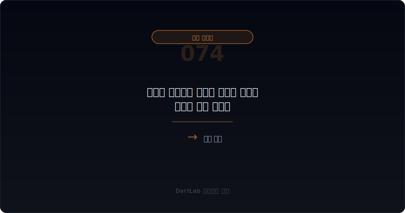
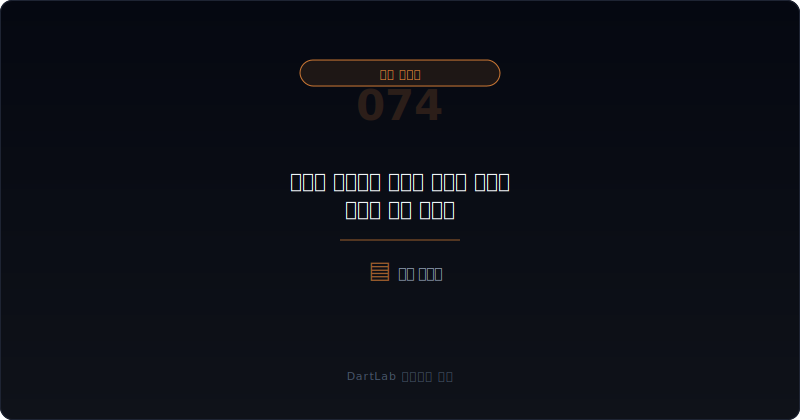
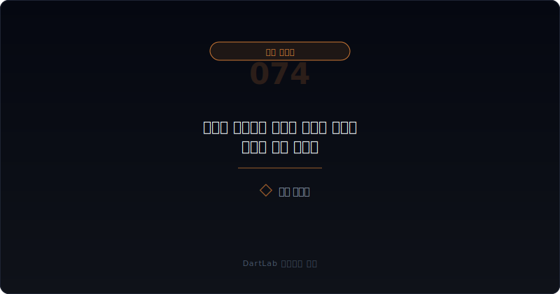
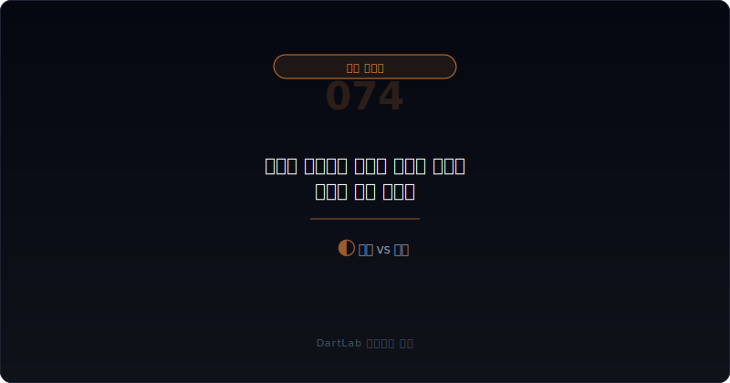
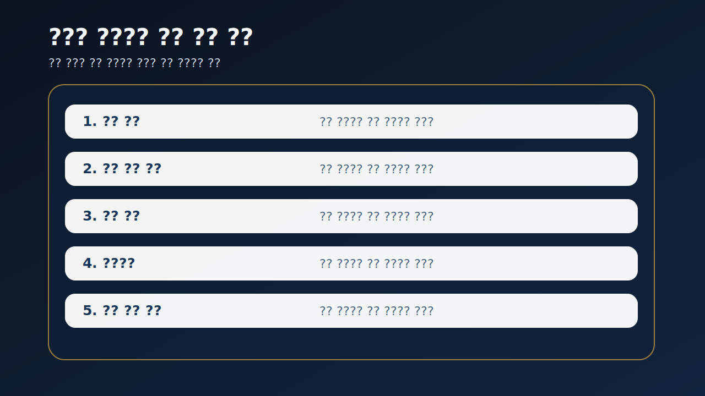

# 메자닌 조기상환 요구와 유동성 압박은 어디서 먼저 보이나

메자닌 공시를 처음 볼 때 많은 사람은 전환가액과 희석 가능성부터 본다. 물론 중요한 포인트다. 하지만 실제로 회사를 더 빠르게 흔드는 것은 조기상환 요구일 때가 많다. 투자자가 put option을 행사해 현금 회수를 요구하는 순간, 메자닌은 희석 이야기에서 바로 유동성 이야기로 바뀔 수 있기 때문이다.

특히 주가가 약하고 리픽싱이 반복되며, 잔여 물량은 큰데 회사 현금이 얇은 경우라면 조기상환 요구는 단순 계약 조항이 아니라 실제 자금 압박의 시작점이 된다. 그래서 메자닌은 발행 당시 조건보다 `언제 현금 요구로 바뀌는가`를 먼저 읽는 편이 맞다.

이 글은 메자닌 조기상환 요구를 `증권 종류와 put option 확인 -> 행사 가능 시점과 잔여 물량 확인 -> 회사 현금과 차입 구조 연결 -> 조건변경·리픽싱·추가상장과 함께 읽기 -> 다음 공시에서 실제 상환 압박이 커지는지 추적` 순서로 읽는 방법을 정리한다. 기본 토대는 [메자닌 보호조항과 리픽싱은 누구에게 유리한가](/blog/mezzanine-protections-and-refixing), 실제 전환 추적은 [리픽싱 이후 실제 전환과 오버행은 어디서 먼저 보이나](/blog/refixing-conversion-and-overhang), 재협상 구조는 [메자닌 만기연장과 조건변경은 누구에게 유리한가](/blog/mezzanine-extension-and-condition-change), 유동성 경고는 [차입 약정 위반과 기한이익상실 위험은 어디서 먼저 드러나나](/blog/debt-covenant-breach-and-acceleration-risk)와 같이 보면 좋다.

---

## 왜 희석보다 현금 상환 압박이 더 빨리 터질 수 있나

전환사채나 BW는 보통 희석 공시로 읽힌다. 하지만 투자자가 주식 전환보다 현금 회수를 택하면 상황은 완전히 달라진다. 회사 입장에서는 희석을 피하는 대신 현금을 내야 하고, 그 현금이 부족하면 조건변경, 차환, 추가 메자닌, 유상증자 같은 후속 조달이 따라붙을 수 있다.

그래서 조기상환 요구는 단순히 "투자자가 권리를 행사했다"는 사실보다, `회사가 그 요구를 자체 현금으로 감당할 수 있는가`를 먼저 물어야 한다. 현금이 충분하고 규모가 작다면 큰 문제 없이 지나갈 수 있다. 하지만 잔여 물량이 크고 차입 만기도 촘촘하면 그 요구는 유동성 경고가 된다.

결국 메자닌은 희석과 현금 압박 중 어느 쪽으로 현실화되는지에 따라 해석이 갈린다. 이 분기점이 바로 조기상환 요구다.

---

## 어떤 조건이 협상력을 결정하나

| 먼저 볼 항목 | 왜 중요한가 |
| --- | --- |
| 증권 종류와 put option | 누가 언제 현금 회수를 요구할 수 있는지 본다 |
| 행사 가능 시점 | 상환 압박이 가까운지 본다 |
| 잔여 사채 금액 | 실제로 남아 있는 부담 규모를 본다 |
| 보유 현금·영업현금흐름 | 회사가 자체 자금으로 버틸 수 있는지 본다 |
| 조건변경·만기연장 | 상환 압박을 미루려는 움직임이 있는지 본다 |
| 후속 조달 이벤트 | 증자, 차입, 추가 메자닌이 붙는지 본다 |

실전에서는 먼저 put option 행사 가능 시점과 잔여 금액을 같은 줄에 적는 편이 좋다. 행사가 가까워졌는데 잔여 금액이 크면 그 자체로 압박이다. 그다음에는 보유 현금과 영업현금흐름을 붙인다. 회사가 자력으로 상환할 수 있는지, 아니면 다시 외부 조달이 필요한지 빠르게 판단할 수 있기 때문이다.

또 하나 중요한 것은 조기상환 요구를 전환·추가상장과 분리해서 보지 않는 것이다. 일부 투자자는 전환을 택하고, 다른 투자자는 상환을 택할 수 있다. 그래서 같은 메자닌에서도 희석 압박과 현금 압박이 동시에 커질 수 있다. 이 점은 [전환사채와 BW 공시 읽는 법](/blog/convertible-bond-and-bw-disclosure), [교환사채와 EB 공시는 누구에게 유리한가](/blog/exchangeable-bond-disclosure)와 함께 보면 더 잘 보인다.

---

## 발행자 시각 vs 투자자 시각

가장 실용적인 질문은 이것이다. `이번 put option은 제한적 이벤트인가, 재협상 압박인가, 유동성 위기의 시작인가`.

제한적 이벤트라면 잔여 물량이 작고 회사 현금으로 감당 가능하며 후속 조건변경이 크지 않을 가능성이 높다. 재협상 압박이라면 일부 상환은 가능하지만 만기연장, 금리 조정, 리픽싱 재조정 같은 협상이 붙기 쉽다. 유동성 위기의 시작이라면 put option 행사와 동시에 추가 조달, 약정 압박, 자산 매각, 지배력 이벤트까지 연쇄적으로 이어질 수 있다.

이 구분이 중요한 이유는 조기상환 요구가 보통 단일 공시 한 건으로 끝나지 않기 때문이다. 그 뒤에 나오는 조건변경, 상환 완료, 일부 미상환, 추가 자금조달 공시까지 붙여 봐야 구조가 드러난다. 그래서 put option은 단어가 아니라 `후속 사건의 출발점`으로 읽는 편이 맞다.

---

## 조건이 바뀔 때 무엇이 움직이나

| 관찰 포인트 | 상대적으로 관리 가능한 경우 | 더 조심해야 하는 경우 |
| --- | --- | --- |
| put option 규모 | 잔여 금액이 작고 분산돼 있다 | 잔여 금액이 크고 시점이 몰린다 |
| 현금 대응력 | 보유 현금과 영업현금이 버텨 준다 | 상환을 위해 새 조달이 필요하다 |
| 후속 협상 | 제한적 조건 조정으로 끝난다 | 만기연장, 금리 인상, 추가 보호조항이 붙는다 |
| 희석과 병행 여부 | 희석과 상환 중 한쪽 부담이 작다 | 전환·추가상장과 상환 압박이 같이 온다 |
| 경영진 설명 | 대응 계획이 비교적 읽힌다 | 설명은 낙관적인데 공시는 점점 무거워진다 |

상대적으로 관리 가능한 경우는 회사가 어떤 자금으로 상환할지와 후속 구조를 비교적 분명하게 설명한다. 반대로 더 조심해야 하는 경우는 put option 행사가 나왔는데도 잔여 금액과 대응 재원이 흐리고, 곧바로 조건변경이나 다른 조달이 붙는다. 이때는 조기상환 요구가 단순 이벤트보다 더 넓은 유동성 경고일 수 있다.

특히 [리스부채와 차입 만기 구조는 어디서 먼저 터지나](/blog/lease-liabilities-and-debt-maturity), [자본잠식과 관리종목 신호는 어디서 먼저 보이나](/blog/capital-impairment-and-watchlist-signals)와 겹치면 해석은 더 무거워진다. 회사가 메자닌 상환만 어려운 것이 아니라 전체 자금 구조가 동시에 약해지고 있을 수 있기 때문이다.

---

## 왜 조건변경과 후속 조달을 같이 봐야 하나

조기상환 요구가 나오면 많은 회사는 두 가지 길을 찾는다. 일부는 현금으로 바로 막고, 일부는 조건변경이나 만기연장으로 시간을 번다. 문제는 여기서 시간을 벌었다고 해서 위험이 사라진 것은 아니라는 점이다. 오히려 더 높은 금리, 더 강한 보호조항, 더 깊은 리픽싱 하단 같은 조건이 붙을 수 있다.

그래서 put option 공시를 보면 반드시 후속 조건변경과 추가 조달을 같이 봐야 한다. 상환 요구를 막기 위해 새 메자닌을 찍거나 증자를 하면, 현금 압박은 일단 넘기더라도 기존 주주에게는 다른 부담이 생길 수 있다.

실전 메모로는 `언제 상환 요구가 가능한가`, `남은 금액은 얼마인가`, `무슨 돈으로 막을 것인가` 세 줄이 가장 유용하다. 이 세 줄만 있어도 조기상환 요구를 훨씬 덜 추상적으로 읽게 된다.

부분 상환만 반복되는지도 중요하다. 조금씩 상환하며 시간을 버는 패턴이 길어지면, 투자자는 문제 해결보다 구조 연장의 신호로 읽는 편이 맞다.

---

## 실전에서 가장 빨리 구분되는 조합은 무엇인가

이 주제에서 가장 빨리 위험해지는 조합은 `put option 행사 가능 시점 임박 + 잔여 금액 큼 + 보유 현금 약함`이다. 이 셋이 같이 보이면 상환 요구가 현실화되는 순간 바로 외부 조달이나 조건변경 압박으로 이어질 가능성이 크다. 주가가 약하고 차입 만기까지 겹치면 해석은 더 무거워진다.

또 자주 보이는 조합은 `일부 전환 반복 + 일부 상환 요구 + 만기연장 협상`이다. 이 경우 회사는 희석과 현금 압박을 동시에 맞고 있을 수 있다. 한쪽만 보면 구조가 단순해 보이지만, 실제로는 전환·추가상장과 put option이 함께 회사를 조이는 구간일 수 있다.

반대로 `잔여 금액 축소 + 자체 현금 대응 + 후속 조건 악화 없음` 조합이 보이면 조기상환 요구가 제한적 이벤트로 끝날 여지도 있다. 그래서 put option은 단어보다 `잔액 변화`와 `대응 방식`을 같이 적어 두는 편이 훨씬 실전적이다.

상환 요구를 막기 위해 더 비싼 돈을 다시 쓰기 시작하면 문제는 해결보다 이동에 가깝다. 그 순간부터는 메자닌 한 건이 아니라 전체 자금조달 체인을 같이 봐야 한다.

---

## 후속 이벤트에서 다시 확인할 것

| 이번에 본 것 | 다음에 다시 볼 것 |
| --- | --- |
| put option 행사 가능 시점 | 실제 행사 공시가 나오는가 |
| 잔여 금액 | 얼마나 빨리 줄어드는가 |
| 상환 재원 | 보유 현금인지 새 조달인지 분명한가 |
| 조건변경 | 금리, 만기, 보호조항이 더 무거워지는가 |
| 전환·추가상장 | 희석 압박이 같이 커지는가 |
| 차입·유동성 | 다른 약정과 만기 압박도 동시에 커지는가 |

메자닌 조기상환 요구는 한 건 공시로 끝나지 않는다. 실제 행사, 일부 상환, 조건변경, 추가 조달, 전환·추가상장, 차입 변화까지 이어서 봐야 한다. 그래서 가능하면 `행사 시점`, `잔여 금액`, `상환 재원`, `후속 협상`, `추가 조달` 다섯 줄을 적어 두는 편이 좋다.

같은 구조가 두세 번 반복되면 해석이 달라진다. 그때부터는 개별 메자닌 문제가 아니라 회사의 자금 구조 자체를 다시 봐야 한다.

---

## 실전 체크리스트

- put option과 조기상환 조항을 먼저 확인했는가
- 행사 가능 시점과 잔여 금액을 적었는가
- 보유 현금과 영업현금흐름으로 감당 가능한지 봤는가
- 후속 조건변경이나 만기연장이 붙는지 확인했는가
- 전환·추가상장과 상환 압박이 같이 오는지 봤는가
- 후속 증자·차입·자산매각이 붙는지 추적할 계획이 있는가

## FAQ

### 조기상환 요구가 나오면 무조건 위기인가

아니다. 다만 규모와 대응 재원을 같이 봐야 한다.

### 무엇이 가장 먼저 중요한가

언제 상환 요구가 가능하고, 지금 남은 금액이 얼마인지다.

### 무엇을 같이 보면 좋은가

리픽싱, 조건변경, 전환·추가상장, 차입 만기 구조를 같이 보면 좋다.

### 가장 먼저 적어볼 한 줄은 무엇인가

이 회사는 put option을 자기 현금으로 막을 수 있는가다.

## 조건 분석에 참고할 글

- [전환사채와 BW 공시 읽는 법](/blog/convertible-bond-and-bw-disclosure)
- [메자닌 보호조항과 리픽싱은 누구에게 유리한가](/blog/mezzanine-protections-and-refixing)
- [메자닌 만기연장과 조건변경은 누구에게 유리한가](/blog/mezzanine-extension-and-condition-change)
- [리픽싱 이후 실제 전환과 오버행은 어디서 먼저 보이나](/blog/refixing-conversion-and-overhang)
- [차입 약정 위반과 기한이익상실 위험은 어디서 먼저 드러나나](/blog/debt-covenant-breach-and-acceleration-risk)
- [리스부채와 차입 만기 구조는 어디서 먼저 터지나](/blog/lease-liabilities-and-debt-maturity)

## 관련 공시 출처

- [OpenDART 전환사채권 발행결정 개발가이드](https://opendart.fss.or.kr/guide/detail.do?apiGrpCd=DS005&apiId=2020033)
- [OpenDART 신주인수권부사채권 발행결정 개발가이드](https://opendart.fss.or.kr/guide/detail.do?apiGrpCd=DS005&apiId=2020034)
- [OpenDART 주요사항보고서 주요정보조회](https://opendart.fss.or.kr/disclosureinfo/mainMatter/main.do)
- [DART 소개 - 보고서정보](https://dart.fss.or.kr/introduction/content2.do)
- [DART 소개 - 정정신고서 이용시 유의사항](https://dart.fss.or.kr/introduction/content4.do)

## 조건별 핵심 요약

메자닌 조기상환 요구는 희석 공시를 현금 압박 공시로 바꾸는 분기점일 수 있다. 그래서 put option, 행사 시점, 잔여 금액, 상환 재원, 후속 조건변경을 같이 봐야 실제 무게가 드러난다.

핵심은 `희석이 얼마나 되나`보다 `이 회사가 지금 현금으로 버틸 수 있나`를 먼저 묻는 것이다. 이 질문을 붙이면 메자닌 공시를 훨씬 덜 늦게 읽게 된다.
