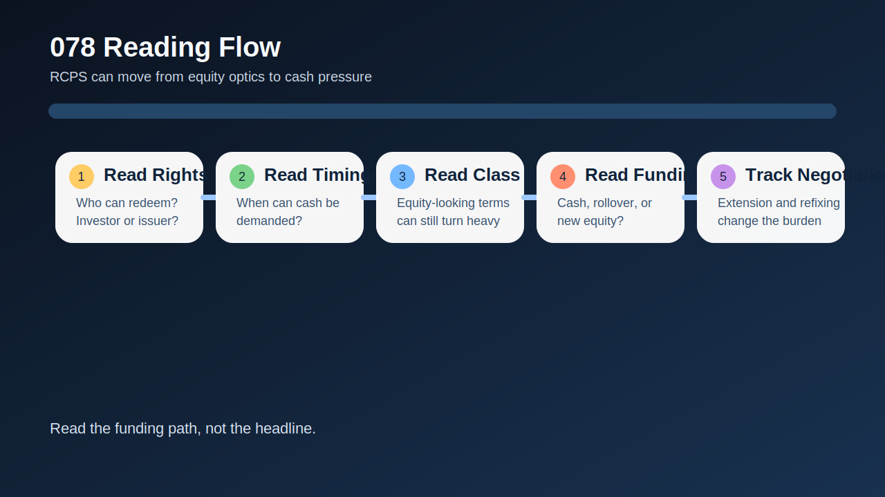
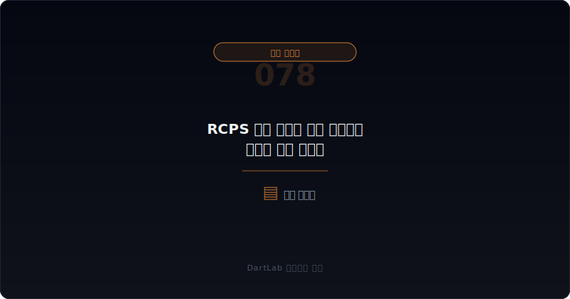
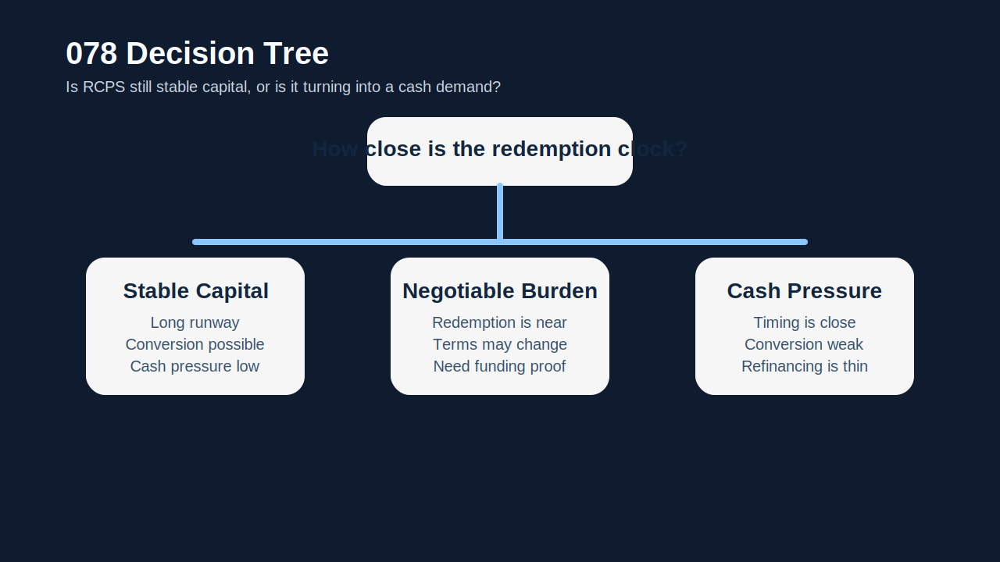
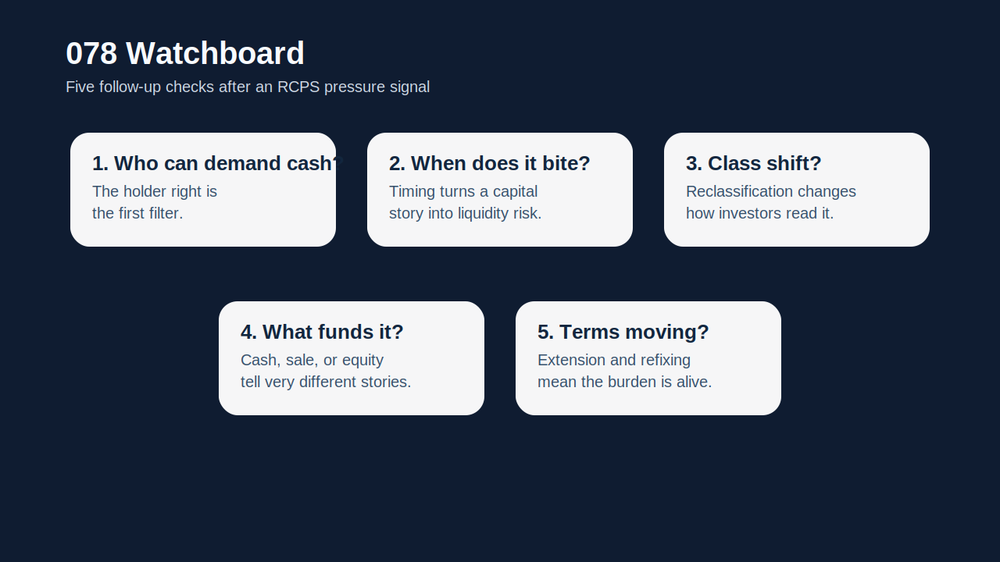

# RCPS 상환 압박과 자본 재분류는 어디서 먼저 보이나

RCPS를 처음 보면 많은 사람이 `우선주니까 자본 쪽 아닌가`, `전환도 되니 당장 현금 부담은 없는 것 아닌가`라고 생각한다. 실전에서는 이 해석이 자주 너무 느슨하다. RCPS는 자본처럼 보일 수도 있지만, **상환권과 조건이 붙는 순간 현금 압박과 재분류 위험을 함께 봐야 하는 증권**이 된다.

특히 상환 시점이 다가오는데 전환 유인이 약하고, 회사 현금과 차환 여력이 부족하면 RCPS는 `희석 이슈`에서 끝나지 않는다. 그때부터는 `상환 재원`, `재분류`, `단기 유동성 압박`, `조건변경 가능성`을 같이 봐야 한다. 겉으로는 자본처럼 보였던 증권이 실제로는 부채처럼 행동하기 시작하는 순간이기 때문이다.

그래서 이 주제는 단순히 `RCPS가 누구에게 유리한가`보다 한 단계 더 깊다. 이미 발행된 RCPS가 시간이 지나며 어떻게 상환 압박으로 바뀌고, 언제 장부상 분류와 해석이 무거워지는지를 읽어야 한다.

이 글은 RCPS 상환 압박과 자본 재분류를 `권리 구조 확인 -> 상환 트리거와 시점 확인 -> 장부 분류와 주석 확인 -> 상환 재원 점검 -> 조건변경·후속 조달 추적` 순서로 읽는 방법을 정리한다. 기본 토대는 [우선주·RCPS·상환전환우선주는 누구에게 유리한가](/blog/preferred-stock-and-rcps-disclosure), 상환 압박 프레임은 [메자닌 조기상환 요구와 유동성 압박은 어디서 먼저 보이나](/blog/mezzanine-put-option-and-liquidity-pressure), 숫자 왜곡은 [이연법인세와 법인세 비용은 순이익을 어떻게 왜곡하나](/blog/deferred-tax-and-tax-expense-distortion), 만기 구조는 [리스부채와 차입 만기 구조는 어디서 먼저 터지나](/blog/lease-liabilities-and-debt-maturity)와 같이 보면 좋다.

---

## 왜 RCPS를 자본처럼만 보면 늦기 쉬운가

RCPS는 이름 때문에 자본처럼 읽히기 쉽다. 실제로도 어떤 구조는 장기간 자본처럼 행동한다. 하지만 상환 조건, 누적 배당, 전환가 조정, 보호조항, 조기상환 권리, 만기 조건이 붙으면 얘기가 달라진다. 상환이 가까워질수록 회사는 `전환을 유도할 것인가`, `현금으로 갚을 것인가`, `조건을 다시 바꿀 것인가`를 고민해야 한다.

이 과정에서 투자자가 가장 자주 놓치는 지점은 장부 분류와 현금 압박의 연결이다. 지금은 비유동 항목이나 자본에 가깝게 보이더라도, 조건과 시점이 바뀌면 유동성 부담으로 재해석해야 할 수 있다. 그래서 RCPS는 발행 시점보다 `만기와 협상 시점`에 더 많이 배워야 하는 증권이다.

결국 이 주제의 핵심은 `권리 구조가 시간이 지나며 어떻게 현금 요구로 바뀌는가`다. 이 질문을 먼저 붙이면 RCPS를 훨씬 덜 느슨하게 읽게 된다.

---

## 어떤 조건이 협상력을 결정하나

| 먼저 볼 항목 | 왜 중요한가 |
| --- | --- |
| 상환권 주체 | 누가 언제 상환을 요구할 수 있는지 본다 |
| 상환 시점 | 유동성 압박이 현실화되는 시계를 확인한다 |
| 전환 유인 | 상환 대신 전환될 가능성이 있는지 본다 |
| 장부 분류 | 자본, 비유동부채, 유동부채 중 어디로 읽히는지 본다 |
| 상환 재원 | 현금, 차환, 자산 매각, 증자 중 무엇으로 막을지 본다 |
| 조건변경 가능성 | 만기연장, 금리조정, 전환가 조정이 붙을지 본다 |

실전에서는 먼저 누가 상환을 요구할 수 있는지 적는 편이 좋다. 발행회사 선택권인지, 투자자 선택권인지, 특정 사유 발생 시 자동인지에 따라 압박의 강도가 완전히 달라진다. 그다음에는 상환 시점을 본다. 만기가 가까운데 주가가 전환 유인보다 낮고, 현금이 부족하면 해석은 훨씬 무거워진다.

또 하나 중요한 것은 장부 분류다. 회사가 해당 증권을 자본처럼 설명해도, 실제 주석과 분류는 더 보수적일 수 있다. 그래서 RCPS는 항상 권리 구조 설명과 재무제표 주석을 같이 봐야 한다. 이 부분은 [우선주·RCPS·상환전환우선주는 누구에게 유리한가](/blog/preferred-stock-and-rcps-disclosure)와 연결해 읽는 편이 가장 좋다.

상환 재원도 빠질 수 없다. 내부 현금으로 갚을 수 있는지, 차환이 필요한지, 자산 매각이나 유상증자를 불러올지에 따라 RCPS는 단순한 자본 상품이 아니라 다음 이벤트의 출발점이 된다.

---

## 발행자 시각 vs 투자자 시각

가장 실용적인 질문은 이것이다. `이번 RCPS는 안정적 자본인가, 협상 가능한 부담인가, 아니면 곧 현금 압박으로 바뀌는 구조인가`.

안정적 자본이라면 상환권 행사가 멀고 전환 유인이 있으며 회사의 현금 여력도 비교적 충분하다. 협상 가능한 부담이라면 상환 압박은 있으나 만기연장이나 조건변경 여지가 보인다. 현금 압박 구조라면 상환 시점이 가깝고 전환 유인은 약하며, 현금과 차환 수단이 모두 제한적이다.

이 구분이 중요한 이유는 RCPS가 보통 한 번에 터지지 않기 때문이다. 처음엔 우선권 구조처럼 보이고, 다음엔 조건변경, 그다음엔 상환 유예나 차환, 최종적으로는 자본 재분류나 희석 확대로 이어질 수 있다. 그래서 하나의 시점이 아니라 연속된 흐름으로 읽어야 한다.

특히 `RCPS + 메자닌 조기상환 요구 + 차입 만기 압박`이 같이 보이면 해석은 매우 무거워진다. 여러 종류의 계약성 자금이 동시에 현금 요구로 바뀌고 있을 수 있기 때문이다.

---

## 조건이 바뀔 때 무엇이 움직이나

| 관찰 포인트 | 상대적으로 관리 가능한 경우 | 더 조심해야 하는 경우 |
| --- | --- | --- |
| 상환 시계 | 만기와 트리거가 충분히 멀다 | 상환 가능 시점이 가깝다 |
| 전환 유인 | 전환 가능성이 현실적이다 | 전환 유인이 약해 상환 가능성이 높다 |
| 장부 분류 | 분류와 설명이 비교적 안정적이다 | 재분류 논점이 커지고 설명이 복잡하다 |
| 상환 재원 | 내부 현금과 차환 수단이 보인다 | 자산 매각·증자 없이는 막기 어렵다 |
| 후속 이벤트 | 조건변경 필요성이 낮다 | 만기연장, 리픽싱, 추가 희석이 붙는다 |

상대적으로 관리 가능한 경우는 RCPS가 시간이 지나도 자본성 성격을 어느 정도 유지한다. 반대로 더 조심해야 하는 경우는 RCPS가 만기와 상환 조건을 타고 `현금 요구 증권`으로 바뀌기 시작한다. 이때는 겉보기 자본보다 실제 유동성 부담이 더 중요해진다.

특히 [메자닌 보호조항과 리픽싱은 누구에게 유리한가](/blog/mezzanine-protections-and-refixing), [메자닌 만기연장과 조건변경은 누구에게 유리한가](/blog/mezzanine-extension-and-condition-change), [리픽싱 이후 실제 전환과 오버행은 어디서 먼저 보이나](/blog/refixing-conversion-and-overhang)와 겹치면 RCPS도 비슷한 협상 압박 구조로 읽어야 한다. 법적 형식은 달라도 투자자가 느끼는 압박의 방향은 꽤 비슷하기 때문이다.

---

## 왜 자본 재분류는 단순 회계 이슈가 아니라고 봐야 하나

자본 재분류는 장부상의 위치만 바뀌는 문제가 아니다. 투자자에게는 `이 증권을 이제 어떤 성격으로 읽어야 하는가`를 다시 묻는 신호다. 이전에는 장기 자본 조달로 읽던 것을, 이제는 상환 압박과 단기 유동성 위험까지 같이 읽어야 할 수 있다는 뜻이기 때문이다.

이 재분류가 무거운 이유는 시장의 질문이 달라지기 때문이다. `얼마나 희석될까`에서 끝나지 않고, `얼마를 언제 갚아야 하나`, `무엇으로 막을까`, `추가 증자와 자산 매각이 따라오나`가 같이 붙는다. 즉, valuation 질문이 liquidity 질문으로 바뀐다.

또 세후 숫자와 손익 설명도 흔들릴 수 있다. 분류가 바뀌면 이자 성격 비용이나 평가 손익, 주석 설명이 달라지면서 headline 숫자 해석이 변할 수 있다. 그래서 이 부분은 [이연법인세와 법인세 비용은 순이익을 어떻게 왜곡하나](/blog/deferred-tax-and-tax-expense-distortion)까지 같이 보면 더 현실적이다.

실전 메모로는 `상환권`, `시점`, `분류`, `재원`, `후속 협상` 다섯 줄이 가장 유용하다. 이 다섯 줄이 있으면 RCPS를 훨씬 덜 추상적으로 읽게 된다.

---

## 실전에서 가장 빨리 구분되는 조합은 무엇인가

이 주제에서 가장 빨리 위험해지는 조합은 `상환 시점 근접 + 전환 유인 약함 + 현금·차환 여력 부족`이다. 이 셋이 같이 보이면 RCPS는 자본보다 유동성 부담으로 읽는 편이 맞다. 여기에 `조건변경 협상`과 `추가 희석`이 붙으면 회사는 시간을 사는 구조로 들어갈 가능성이 크다.

반대로 `상환 시점 여유 + 전환 가능성 존재 + 상환 재원 안정` 조합이면 RCPS가 당장 위기 신호로 읽히지는 않을 수 있다. 즉, 핵심은 RCPS의 이름이 아니라 `누가 어떤 권리를 언제 행사할 수 있는가`다.

또 자주 나오는 조합이 `RCPS 상환 압박 + 메자닌 put option + 차입 약정 위험`이다. 이 경우 서로 다른 상품이 동시에 현금 요구로 바뀌는 흐름일 수 있어 해석이 더 무거워진다.

---

## 후속 이벤트에서 다시 확인할 것

| 이번에 본 것 | 다음에 다시 볼 것 |
| --- | --- |
| 상환 시점 | 실제 행사 가능 시점이 가까워지는가 |
| 장부 분류 | 비유동에서 유동, 자본에서 부채 해석이 강해지는가 |
| 현금 재원 | 내부 현금과 차환 계획이 구체화되는가 |
| 협상 구조 | 만기연장, 조건변경, 전환가 조정이 붙는가 |
| 추가 이벤트 | 유상증자, 자산 매각, 사채 발행이 따라오는가 |
| 반복성 | 같은 종류 압박이 계속 누적되는가 |

RCPS 상환 압박은 한 번의 공시로 끝나지 않는다. 시간이 지나며 상환 시계가 짧아지고, 분류 해석이 바뀌고, 협상이 붙고, 후속 조달이 나타날 수 있다. 그래서 가능하면 `상환권`, `시점`, `분류`, `재원`, `협상` 다섯 줄을 적어 두는 편이 좋다.

같은 회사에서 이 흐름이 반복되면 해석은 훨씬 무거워진다. 그때부터는 우선주 구조보다 현금 압박과 재조달 능력이 더 중요한 질문이 된다.

---

## 실전 체크리스트

- 누가 상환을 요구할 수 있는지 확인했는가
- 상환 가능 시점과 만기를 적었는가
- 전환 유인이 실제로 있는지 봤는가
- 재무제표 주석에서 장부 분류를 확인했는가
- 상환 재원이 내부 현금인지 차환인지 구분했는가
- 조건변경·추가 조달 가능성을 추적할 계획이 있는가

## FAQ

### RCPS는 무조건 자본으로 봐도 되나

아니다. 상환권과 조건에 따라 현금 압박과 재분류 위험을 같이 봐야 한다.

### 무엇이 가장 먼저 중요한가

누가 언제 상환을 요구할 수 있는지다.

### 전환권이 있으면 안심해도 되나

항상 그렇지 않다. 주가와 조건상 전환 유인이 약하면 상환 부담이 더 커질 수 있다.

### 무엇을 같이 보면 좋은가

만기표, 차입 구조, 조건변경 공시, 후속 증자를 같이 보면 좋다.

## 조건 분석에 참고할 글

- [우선주·RCPS·상환전환우선주는 누구에게 유리한가](/blog/preferred-stock-and-rcps-disclosure)
- [메자닌 조기상환 요구와 유동성 압박은 어디서 먼저 보이나](/blog/mezzanine-put-option-and-liquidity-pressure)
- [메자닌 보호조항과 리픽싱은 누구에게 유리한가](/blog/mezzanine-protections-and-refixing)
- [메자닌 만기연장과 조건변경은 누구에게 유리한가](/blog/mezzanine-extension-and-condition-change)
- [리픽싱 이후 실제 전환과 오버행은 어디서 먼저 보이나](/blog/refixing-conversion-and-overhang)
- [리스부채와 차입 만기 구조는 어디서 먼저 터지나](/blog/lease-liabilities-and-debt-maturity)
- [이연법인세와 법인세 비용은 순이익을 어떻게 왜곡하나](/blog/deferred-tax-and-tax-expense-distortion)

## 관련 공시 출처

- [IAS 32 Financial Instruments: Presentation](https://www.ifrs.org/issued-standards/list-of-standards/ias-32-financial-instruments-presentation/)
- [IFRS 9 Financial Instruments](https://www.ifrs.org/issued-standards/list-of-standards/ifrs-9-financial-instruments/)
- [IAS 1 Presentation of Financial Statements](https://www.ifrs.org/issued-standards/list-of-standards/ias-1-presentation-of-financial-statements.html/)
- [DART 소개 - 보고서정보](https://dart.fss.or.kr/introduction/content2.do)
- [OpenDART XBRL 주석](https://opendart.fss.or.kr/disclosureinfo/fnltt/xbrlnote/main.do)
- [OpenDART 주요사항보고서 주요정보조회](https://opendart.fss.or.kr/disclosureinfo/mainMatter/main.do)

## 조건별 핵심 요약

RCPS는 이름만 보면 자본처럼 읽히기 쉽지만, 상환권과 시점, 전환 유인, 장부 분류, 상환 재원을 붙여 보면 현금 압박 구조로 바뀌는 순간이 보인다. 그래서 이 증권은 발행 시점보다 만기와 협상 시점에 더 조심해서 읽어야 한다.

핵심은 `우선주인가`보다 `누가 언제 돈을 요구할 수 있는가`를 먼저 묻는 것이다. 이 질문을 붙이면 RCPS를 훨씬 덜 추상적으로 읽게 된다.
