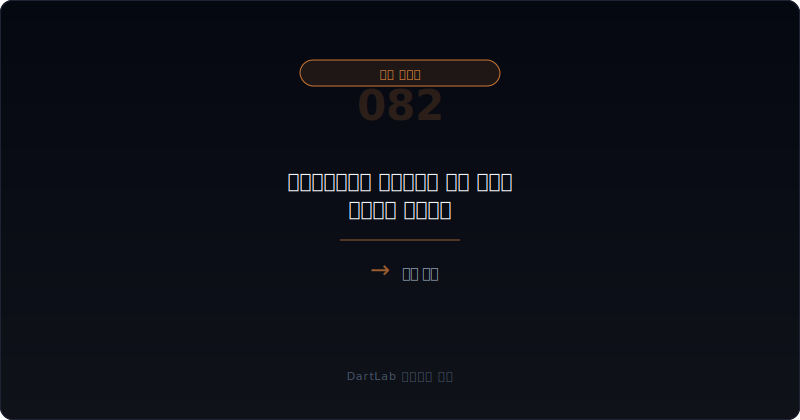
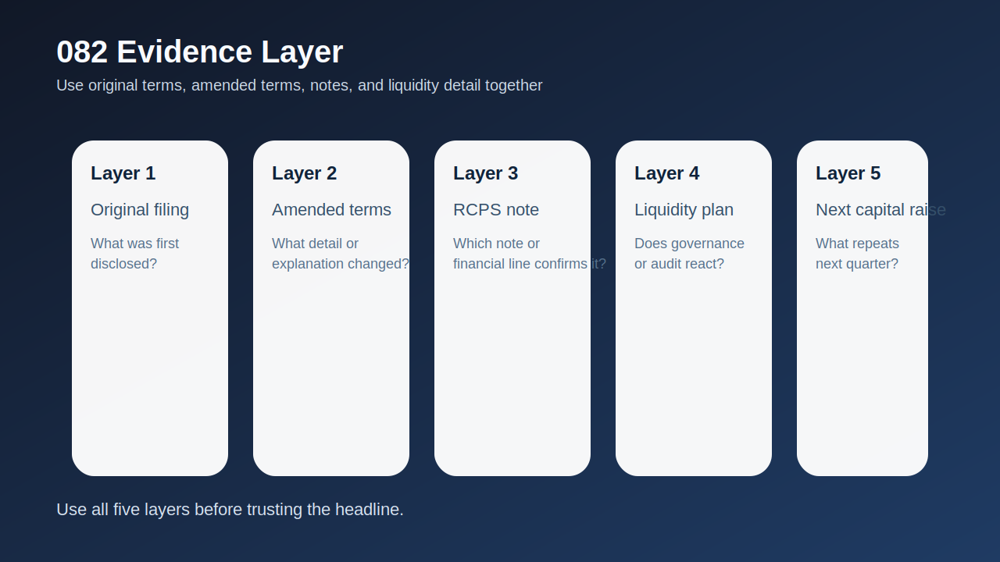
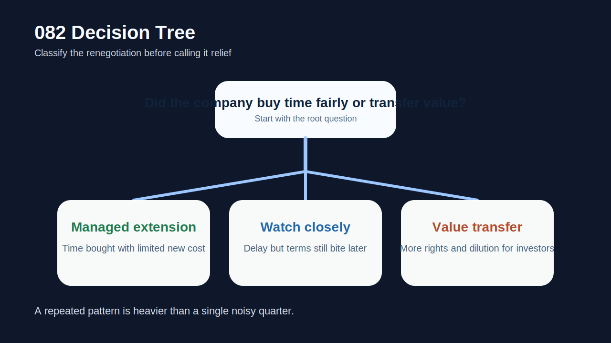
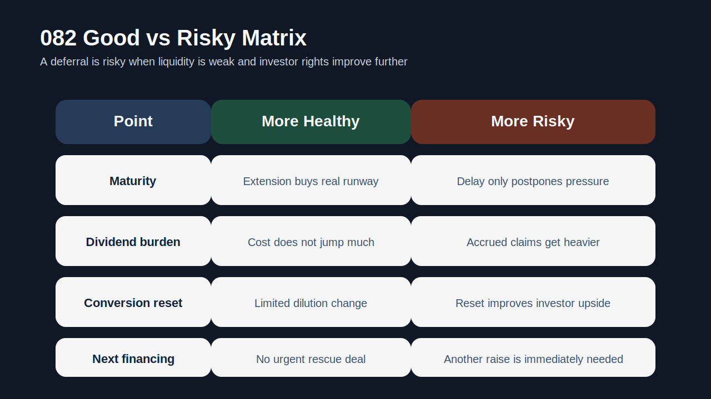
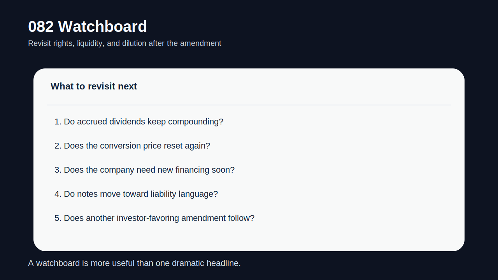

# 상환전환우선주 조건변경과 상환 유예는 누구에게 유리한가

상환전환우선주, 즉 RCPS의 조건변경이나 상환 유예 공시는 제목만 보면 회사가 시간을 벌었다는 소식처럼 들린다. 실제로도 단기 유동성 압박을 늦추는 효과가 있을 수 있다. 하지만 **조건변경은 단순히 만기를 미루는 것이 아니라 `누가 시간을 샀고`, `그 대가로 누가 더 많은 권리와 가치를 가져갔는가`를 읽어야 하는 사건**이다.

특히 만기 연장과 함께 누적배당 부담이 커지고, 전환가 조정 여지가 넓어지고, 투자자 보호조항이 더 강해지고, 회사는 추가 자금조달이 필요해지는 구조라면 겉보기 안도감과 실제 부담은 다를 수 있다. 상환 유예는 위기를 없애는 것이 아니라 `미래로 이동`시키는 경우가 많기 때문이다.

그래서 이 글은 [RCPS 상환 압박과 자본 재분류는 어디서 먼저 보이나](/blog/rcps-redemption-pressure-and-reclassification)의 다음 단계다. 이전 글이 상환 압박이 왜 커지는지를 설명했다면, 이 글은 `실제 협상에서 무엇이 바뀌고`, `그 변화가 누구에게 유리한지`, `다음 공시에서 무엇을 다시 봐야 하는지`를 정리한다. 함께 읽으면 좋은 글은 [우선주·RCPS·상환전환우선주는 누구에게 유리한가](/blog/preferred-stock-and-rcps-disclosure), [메자닌 만기연장과 조건변경은 누구에게 유리한가](/blog/mezzanine-extension-and-condition-change), [메자닌 보호조항과 리픽싱은 누구에게 유리한가](/blog/mezzanine-protections-and-refixing), [메자닌 조기상환 요구와 유동성 압박은 어디서 먼저 보이나](/blog/mezzanine-put-option-and-liquidity-pressure), [리픽싱 이후 실제 전환과 오버행은 어디서 먼저 보이나](/blog/refixing-conversion-and-overhang)다.

이 글은 RCPS 조건변경을 `기존 조건 확인 -> 바뀐 권리 확인 -> 상환 유예 이유 해석 -> 가치 이동 점검 -> 후속 자금조달과 희석 추적` 순서로 읽는 방법을 정리한다.

---

## 왜 상환 유예를 좋은 뉴스로만 보면 늦기 쉬운가

상환 유예는 표면적으로는 긍정적일 수 있다. 당장 갚아야 할 돈을 미루면 유동성 위기가 늦춰지기 때문이다. 하지만 투자자는 여기서 한 단계 더 가야 한다. `무엇을 양보하고 시간을 샀는가`를 봐야 한다. 만기만 뒤로 밀리고 비용이 거의 늘지 않았다면 상대적으로 관리 가능한 구조일 수 있다. 반대로 시간이 늘어난 대신 배당 누적, 전환가 조정, 보호조항 강화, 추가 담보나 우선순위 조정이 붙으면 그 유예는 매우 비싼 시간일 수 있다.

이 차이는 나중에 희석과 현금 압박으로 돌아온다. 상환 유예로 당장은 숨을 돌렸지만, 몇 분기 뒤 더 낮은 전환가와 더 큰 오버행, 더 무거운 누적배당, 다음 자금조달 의존으로 이어질 수 있기 때문이다. 그래서 조건변경 공시는 항상 `지금 안도감`보다 `미래 부담이 어떻게 바뀌었는가`를 먼저 읽어야 한다.

또 RCPS는 이름만 보면 자본 같지만 조건이 복잡해질수록 부채성 해석이 강해질 수 있다. 그래서 주석과 재분류 논점도 함께 봐야 한다. 상환 유예는 종종 회계와 자금조달을 동시에 흔든다.

---

## 어떤 조건이 협상력을 결정하나

| 먼저 볼 항목 | 왜 중요한가 |
| --- | --- |
| 기존 조건 | 무엇을 양보했는지 비교할 기준이다 |
| 만기·상환 조항 | 시간을 얼마나 샀는지 확인한다 |
| 누적배당·상환 프리미엄 | 유예의 대가가 얼마나 커졌는지 본다 |
| 전환가·리픽싱 | 미래 희석이 커졌는지 확인한다 |
| 유동성 이유 | 왜 지금 상환을 미뤘는지 본다 |
| 다음 자금조달 | 유예 뒤에도 추가 돈이 필요한지 본다 |

실전에서는 기존 조건표와 변경 조건표를 반드시 나란히 적는 편이 좋다. 만기, 상환권, 배당률, 누적 여부, 전환가 조정 범위, 보호조항, 우선순위, 담보 여부를 비교하면 어떤 가치가 이동했는지 드러난다.

그다음엔 회사가 왜 유예를 원했는지 본다. 단순히 자금 운용 유연성 확보라고 쓰여 있어도, 실제로는 현금 부족, 차환 실패, 다른 메자닌 상환 압박, 차입 약정 긴장 때문일 수 있다. 이 부분은 [메자닌 조기상환 요구와 유동성 압박은 어디서 먼저 보이나](/blog/mezzanine-put-option-and-liquidity-pressure), [차입 약정 위반과 기한이익상실은 어디서 먼저 보이나](/blog/debt-covenant-breach-and-acceleration-risk)와 연결해서 읽는 편이 좋다.

마지막으로 중요한 것은 `다음 자금조달`이다. 상환 유예가 끝이 아니라면, 회사는 추가 증자나 사채 발행, 또 다른 조건변경으로 이어질 수 있다. 그래서 유예 공시는 늘 후속 이벤트의 출발점으로 읽어야 한다.

---

## 발행자 시각 vs 투자자 시각

가장 실용적인 질문은 `회사가 합리적인 비용으로 시간을 샀는가, 아니면 투자자에게 더 큰 가치와 권리를 넘기며 연명했는가`다.

관리 가능한 연장이라면 만기 유예가 회사에 실질적인 시간 여유를 주고, 그 대가가 과도하지 않다. 전환가 조정이 제한적이고 누적배당 부담이 과도하게 커지지 않으며, 회사가 그 시간 안에 현금흐름이나 차환 계획을 세울 여지가 있다.

경계 구간은 시간을 벌긴 했지만 비용이 적지 않고, 이후에도 추가 협상이 필요해 보이는 경우다. 이런 경우에는 다음 몇 분기 안에 다시 비슷한 공시가 나올 가능성이 높다.

가치 이전 구조로 읽어야 할 경우는 유예의 대가가 명확하게 투자자 쪽에 기울 때다. 더 낮은 전환가, 더 강한 보호조항, 더 큰 누적배당, 더 빠른 후속 자금조달 압박이 붙으면 회사는 시간을 샀지만 미래 주주가치를 많이 넘겼을 수 있다.

---

## 조건이 바뀔 때 무엇이 움직이나

| 관찰 포인트 | 상대적으로 관리 가능한 경우 | 더 조심해야 하는 경우 |
| --- | --- | --- |
| 만기 연장 | 실제로 숨 돌릴 시간이 생긴다 | 단지 다음 위기를 미룰 뿐이다 |
| 누적배당·프리미엄 | 부담 증가가 제한적이다 | 시간이 갈수록 비용이 커진다 |
| 전환가 조정 | 희석 확대가 제한적이다 | 투자자 upside가 크게 강화된다 |
| 유동성 계획 | 추가 조달 없이도 버틸 그림이 있다 | 곧 다른 자금조달이 필요하다 |
| 후속 이벤트 | 조건변경이 한 번으로 끝난다 | 추가 조건변경·증자가 이어진다 |

상대적으로 관리 가능한 경우는 유예가 `회복 시간`을 준다. 반대로 더 조심해야 하는 경우는 유예가 `더 비싼 미래`를 산다. 특히 주가가 약하고 현금이 부족한데 전환가 reset이나 누적배당 부담이 같이 커지면 기존 주주에게 불리한 방향으로 가치가 이동할 가능성이 크다.

이때는 `상환 유예 = 호재`로 읽기보다 `상환 유예 = 협상 결과 공개`로 읽는 편이 정확하다. 누가 무엇을 양보했고, 누가 무엇을 더 받았는지가 핵심이다.

---

## 왜 조건표 비교가 가장 중요한가

많은 사람이 조건변경 공시에서 제목과 만기만 본다. 하지만 실제 판단은 조건표 비교에서 나온다. 만기가 몇 달 늘었는지보다, 그 사이 배당이 어떻게 누적되는지, 상환 프리미엄이 붙는지, 전환가 조정 하한이 내려갔는지, 투자자 보호조항이 강화됐는지가 더 중요하다.

조건표 비교는 곧 가치 이동 지도다. 회사는 시간을 샀을 수 있지만, 그 대가로 미래 희석을 키우거나 상환 부담을 더 무겁게 만들었을 수 있다. 그래서 `연장`이라는 단어만 보면 안 되고, 연장을 위해 포기한 것이 무엇인지 적어야 한다.

또 이 과정은 메자닌 전반과 닮아 있다. [메자닌 만기연장과 조건변경은 누구에게 유리한가](/blog/mezzanine-extension-and-condition-change), [메자닌 보호조항과 리픽싱은 누구에게 유리한가](/blog/mezzanine-protections-and-refixing)에서 설명한 것처럼 계약의 작은 문구 하나가 이후 희석과 오버행에 크게 영향을 줄 수 있다.

---

## 왜 유예 다음 분기가 진짜 시험대인가

상환 유예 공시가 나온 직후에는 시장이 일단 안도할 수 있다. 하지만 진짜 판단은 그 다음 분기부터다. 회사가 유예된 시간 동안 현금을 회복했는지, 추가 자금조달 없이 버틸 수 있는지, 누적배당 부담이 얼마나 빨리 커지는지, 전환가 조정이 다시 열리는지를 봐야 하기 때문이다.

즉, 유예 공시는 끝이 아니라 시작이다. 그 뒤에 다시 증자, 또 다른 메자닌 발행, 추가 조건변경이 이어지면 처음 유예는 단순한 시간 벌기였을 가능성이 커진다. 그래서 투자자는 상환 유예 직후보다 `그 다음 보고서와 후속 공시`를 더 집요하게 봐야 한다.

---

## 실전에서 가장 빨리 구분되는 조합은 무엇인가

가장 빨리 위험해지는 조합은 `상환 유예 + 누적배당 확대 + 전환가 reset + 추가 자금조달 필요`다. 이 넷이 같이 보이면, 회사는 시간을 벌었지만 그 대가로 미래 주주가치와 유동성 여력을 크게 내줬을 수 있다. 여기에 `현금 부족`과 `다른 메자닌 압박`이 더해지면 해석은 매우 무거워진다.

반대로 상대적으로 덜 무거운 조합은 `상환 유예 + 제한적 조건 변경 + 명확한 현금 회복 계획`이다. 그래도 경계는 필요하지만, 적어도 유예가 바로 또 다른 희석과 협상으로 이어질 가능성은 낮다.

실전 메모는 다섯 줄이면 충분하다. `만기`, `배당`, `전환가`, `유동성 이유`, `다음 자금조달`. 이 다섯 줄을 적으면 조건변경이 누구에게 유리한지 훨씬 빨리 보인다.

---

## 후속 이벤트에서 다시 확인할 것

| 이번에 본 것 | 다음에 다시 볼 것 |
| --- | --- |
| 만기 유예 | 정말 충분한 시간이 생겼는가 |
| 누적배당 | 비용이 계속 쌓이고 있는가 |
| 전환가 조정 | 희석 구조가 더 나빠지는가 |
| 회계 주석 | 부채성 해석과 재분류가 강해지는가 |
| 유동성 계획 | 추가 증자·사채 발행이 필요한가 |
| 후속 협상 | 또 다른 조건변경이 이어지는가 |

이 주제의 핵심은 상환 유예를 `문제 해결`로 읽지 않는 것이다. 상환 유예는 종종 문제를 뒤로 미룬다. 그 사이 가치가 누구에게 이동했는지 읽는 것이 더 중요하다.

---

## 실전 체크리스트

- 기존 조건과 변경 조건을 나란히 적었는가
- 만기 연장의 대가가 무엇인지 확인했는가
- 누적배당·상환 프리미엄 부담을 체크했는가
- 전환가 reset과 희석 확대 가능성을 봤는가
- 회사가 왜 유예를 원했는지 유동성 관점에서 해석했는가
- 다음 자금조달과 추가 협상 가능성을 추적할 계획을 세웠는가

## FAQ

### 상환 유예는 무조건 좋은 뉴스인가

아니다. 시간을 벌어도 그 대가로 투자자 권리가 크게 강화되면 기존 주주에게 불리할 수 있다.

### 무엇이 가장 중요한 검증 포인트인가

조건표 비교다. 만기, 배당, 전환가, 보호조항이 어떻게 바뀌었는지 봐야 한다.

### 왜 다음 자금조달까지 봐야 하나

유예가 끝이 아니라 임시방편일 수 있기 때문이다. 추가 증자나 또 다른 메자닌 협상이 이어질 수 있다.

### 어디와 같이 읽으면 도움이 되나

RCPS 상환 압박, 메자닌 만기연장·리픽싱, 조기상환 압박, 오버행 글과 같이 보면 조건변경의 비용을 더 잘 읽을 수 있다.

## 조건 분석에 참고할 글

- [RCPS 상환 압박과 자본 재분류는 어디서 먼저 보이나](/blog/rcps-redemption-pressure-and-reclassification)
- [우선주·RCPS·상환전환우선주는 누구에게 유리한가](/blog/preferred-stock-and-rcps-disclosure)
- [메자닌 만기연장과 조건변경은 누구에게 유리한가](/blog/mezzanine-extension-and-condition-change)
- [메자닌 보호조항과 리픽싱은 누구에게 유리한가](/blog/mezzanine-protections-and-refixing)
- [메자닌 조기상환 요구와 유동성 압박은 어디서 먼저 보이나](/blog/mezzanine-put-option-and-liquidity-pressure)
- [리픽싱 이후 실제 전환과 오버행은 어디서 먼저 보이나](/blog/refixing-conversion-and-overhang)

## 관련 공시 출처

- [IAS 32 Financial Instruments: Presentation](https://www.ifrs.org/issued-standards/list-of-standards/ias-32-financial-instruments-presentation/)
- [IFRS 9 Financial Instruments](https://www.ifrs.org/issued-standards/list-of-standards/ifrs-9-financial-instruments/)
- [DART 소개 - 보고서정보](https://dart.fss.or.kr/introduction/content2.do)
- [OpenDART 주요사항보고서 주요정보조회](https://opendart.fss.or.kr/disclosureinfo/mainMatter/main.do)
- [OpenDART XBRL 주석](https://opendart.fss.or.kr/disclosureinfo/fnltt/xbrlnote/main.do)

## 조건별 핵심 요약

RCPS 조건변경과 상환 유예는 단순히 시간을 버는 뉴스가 아니라 가치와 권리가 다시 배분되는 사건이다. 만기만 보지 말고, 그 대가로 누적배당, 전환가, 보호조항, 다음 자금조달 부담이 어떻게 바뀌었는지를 봐야 한다.

결국 이 주제의 핵심은 `얼마나 미뤘나`보다 `무엇을 내주고 미뤘나`를 묻는 것이다. 그 질문을 붙이면 상환 유예 공시를 훨씬 덜 낙관적으로, 더 정확하게 읽게 된다.
