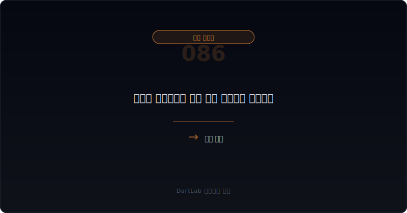
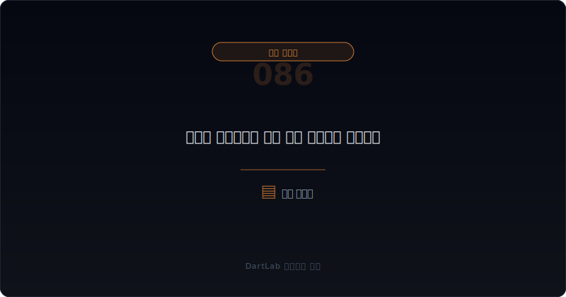
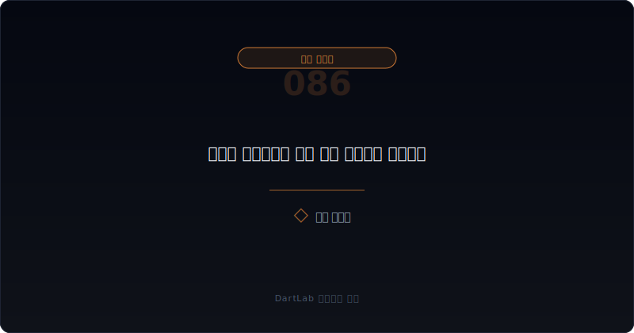
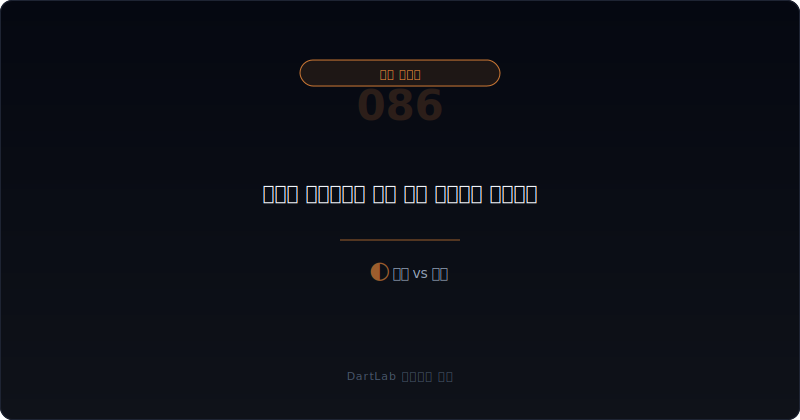
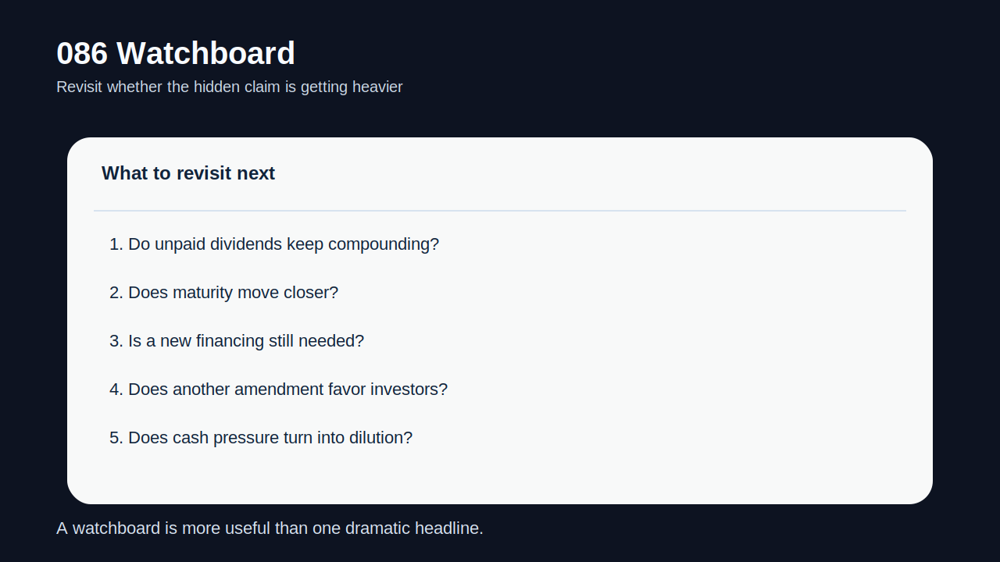

# 우선주 누적배당은 언제 현금 압박으로 돌아오나

우선주나 RCPS를 볼 때 많은 사람이 전환가와 상환권만 본다. 하지만 실제로 회사를 더 오래 압박하는 것은 누적배당일 때가 많다. **누적배당은 당장 현금이 나가지 않아도 시간이 지나며 `미지급된 권리`가 계속 쌓이고, 결국 상환·재협상·추가 자금조달 시점에 더 큰 현금 요구나 가치 이전으로 돌아올 수 있다.**

특히 회사가 배당을 계속 지급하지 못하고 있는데도 우선주 조건이 유지되면, 겉보기에는 조용하지만 안쪽에서는 누적부담이 커진다. 이 부담은 나중에 상환금, 우선권, 전환 협상, 조건변경, 추가 투자자 협상에서 한꺼번에 문제로 튀어 나온다. 그래서 누적배당은 `오늘 안 나간 현금`이 아니라 `미래에 더 무겁게 돌아올 수 있는 청구권`으로 읽는 편이 맞다.

이 글은 [상환전환우선주 조건변경과 상환 유예는 누구에게 유리한가](/blog/rcps-term-change-and-redemption-deferral), [RCPS 상환 압박과 자본 재분류는 어디서 먼저 보이나](/blog/rcps-redemption-pressure-and-reclassification), [우선주·RCPS·상환전환우선주는 누구에게 유리한가](/blog/preferred-stock-and-rcps-disclosure), [메자닌 만기연장과 조건변경은 누구에게 유리한가](/blog/mezzanine-extension-and-condition-change)의 다음 단계다. 여기서는 누적배당이 언제 실제 현금 압박으로 바뀌는지 정리한다.

이 글은 우선주 누적배당을 `배당 조건 확인 -> 미지급 누적 규모 확인 -> 상환·전환과의 연결 확인 -> 현금 계획 점검 -> 후속 재협상과 추가 자금조달 추적` 순서로 읽는 방법을 설명한다.

---

## 왜 누적배당은 조용히 쌓이다가 나중에 더 아프게 돌아오나

누적배당의 특징은 바로 여기 있다. 지금 안 내도 당장 사건처럼 보이지 않는다. 하지만 권리가 사라지는 것이 아니라 남아 있기 때문에, 시간이 지날수록 투자자 측 청구권은 커진다. 회사는 당장 현금을 아꼈다고 느낄 수 있지만, 나중에는 더 큰 금액과 더 약한 협상력으로 마주할 수 있다.

이 부담은 특히 유동성이 약한 회사에서 더 위험하다. 현금이 부족해서 배당을 못 주는 회사는 시간이 지나도 상황이 쉽게 나아지지 않는 경우가 많다. 그 사이 누적배당은 쌓이고, 상환 압박이나 조건변경 협상이 오면 투자자 쪽이 더 강한 권리를 요구할 수 있다.

그래서 누적배당은 `지급 여부`보다 `미지급 상태가 얼마나 오래 지속되는가`를 보는 편이 좋다. 한두 기간 미지급은 관리 가능한 문제일 수 있지만, 장기간 누적되면 사실상 잠복한 현금 압박으로 읽는 것이 맞다.

---

## 어떤 조건이 협상력을 결정하나

| 먼저 볼 항목 | 왜 중요한가 |
| --- | --- |
| 배당률·누적 여부 | 부담이 어떤 속도로 쌓이는지 본다 |
| 미지급 기간 | 시간이 얼마나 지났는지 확인한다 |
| 상환 조건 | 누적배당이 상환금과 같이 커지는지 본다 |
| 전환 조건 | 현금 대신 희석으로 넘어갈 여지가 있는지 본다 |
| 회사 현금 여력 | 실제 지급 가능성이 있는지 본다 |
| 후속 협상 | 조건변경이나 상환 유예로 이어지는지 본다 |

실전에서는 우선주 조건표를 보면 `배당률`, `누적 여부`, `언제 지급해야 하는지`, `미지급 시 권리가 어떻게 바뀌는지`를 먼저 적는 편이 좋다. 그다음엔 미지급 누적 기간을 본다. 같은 8%라도 한 분기와 몇 년은 전혀 다르다.

또 누적배당은 상환 조건과 분리해서 보면 안 된다. 상환 시 미지급 배당이 함께 붙는 구조라면 실제 현금 요구는 원금보다 훨씬 커질 수 있다. 반대로 전환으로 넘길 수 있다 해도 그건 현금 부담이 희석 부담으로 바뀌는 것일 수 있다. 따라서 누적배당은 항상 `현금 vs 희석` 두 방향으로 같이 읽어야 한다.

---

## 발행자 시각 vs 투자자 시각

핵심 질문은 이것이다. `이 누적배당은 관리 가능한 계약 비용인가, 아니면 곧 현금 압박이나 큰 가치 이전으로 돌아올 잠복 부담인가?`

관리 가능한 경우는 미지급 기간이 길지 않고, 회사 현금 여력이 있으며, 상환·전환 협상력이 아직 크게 무너지지 않은 경우다. 이런 상황에서는 누적배당이 있어도 당장 위기로 읽을 필요는 없다.

경계 구간은 누적 금액이 커지고 있지만 회사가 조건변경이나 상환 유예로 시간을 벌고 있는 경우다. 이때는 다음 협상에서 누가 더 유리한지 계속 봐야 한다.

현금 압박 구조는 누적배당이 오래 쌓였고, 상환 시점이 가까우며, 회사 현금이 부족하고, 추가 자금조달 없이는 해결이 어려운 경우다. 이 구간에서는 누적배당이 실제 현금 요구나 더 큰 희석으로 이어질 가능성이 높다.

---

## 조건이 바뀔 때 무엇이 움직이나

| 관찰 포인트 | 상대적으로 관리 가능한 경우 | 더 조심해야 하는 경우 |
| --- | --- | --- |
| 미지급 기간 | 짧고 일시적이다 | 길고 반복적이다 |
| 누적 규모 | 회사 현금 여력 안에 있다 | 상환 부담을 크게 키운다 |
| 상환 연계 | 원금과 분리 관리 가능하다 | 상환 시 한꺼번에 붙는다 |
| 전환 영향 | 희석 확대가 제한적이다 | 현금 대신 큰 희석으로 넘어간다 |
| 후속 협상 | 추가 양보 없이 정리된다 | 투자자 권리 강화로 이어진다 |

상대적으로 관리 가능한 경우는 회사가 누적배당을 감당할 여력이 있고, 그 부담이 협상을 완전히 지배하지 않는다. 반대로 더 조심해야 하는 경우는 누적배당이 시간이 지날수록 상환 협상과 자금조달을 모두 어렵게 만든다.

특히 [상환전환우선주 조건변경과 상환 유예는 누구에게 유리한가](/blog/rcps-term-change-and-redemption-deferral), [RCPS 상환 압박과 자본 재분류는 어디서 먼저 보이나](/blog/rcps-redemption-pressure-and-reclassification), [차입 약정 위반과 기한이익상실은 어디서 먼저 보이나](/blog/debt-covenant-breach-and-acceleration-risk)을 같이 보면, 누적배당이 다른 현금 요구와 겹칠 때 얼마나 빨리 무거워지는지 더 잘 보인다.

---

## 왜 누적배당은 상환 유예 뒤에 더 중요해지나

상환 유예가 나오면 많은 사람이 안도한다. 하지만 그 유예 기간 동안 누적배당이 계속 쌓이면 안도감은 착시일 수 있다. 회사는 시간을 벌지만, 그 시간은 공짜가 아닐 수 있다. 나중에 상환할 금액이 더 커지고, 투자자 권리는 더 단단해지며, 회사의 협상력은 약해질 수 있다.

그래서 상환 유예 공시를 보면 반드시 `그 사이 누적배당은 어떻게 되나`를 확인해야 한다. 만기가 미뤄졌는데 배당 청구권이 계속 쌓이면, 문제는 사라진 것이 아니라 더 비싸게 미뤄졌다고 보는 편이 맞다.

---

## 실전에서 가장 빨리 구분되는 조합은 무엇인가

가장 빨리 위험해지는 조합은 `장기간 미지급 + 상환 시점 근접 + 누적배당 가산 + 현금 부족`이다. 여기에 `조건변경`과 `전환가 reset`, `추가 자금조달 필요`가 붙으면 누적배당은 사실상 현금 압박의 일부가 된다.

반대로 상대적으로 덜 무거운 조합은 `짧은 미지급 기간 + 충분한 현금 여력 + 제한적 누적 규모`다. 이 경우에는 계약상 비용으로 관리될 수 있다.

실전 메모는 다섯 줄이면 충분하다. `배당률`, `누적 기간`, `상환 연계`, `현금 여력`, `후속 협상`. 이 다섯 줄을 적으면 누적배당이 언제 진짜 현금 압박으로 돌아오는지 빠르게 가를 수 있다.

---

## 왜 누적배당은 배당 자체보다 협상력 변화로 읽어야 하나

누적배당의 진짜 무게는 단순히 얼마를 더 내야 하느냐에만 있지 않다. 시간이 지날수록 회사와 투자자 사이의 협상력이 어떻게 바뀌느냐가 더 중요하다. 회사가 현금이 부족해 배당을 미루는 기간이 길어질수록 투자자 입장에서는 이미 약속된 권리가 계속 쌓인다. 그러면 다음 조건변경이나 상환 유예 협상에서 투자자는 더 강한 보호조항, 더 높은 우선권, 더 유리한 가격 조정을 요구할 수 있다.

이 지점에서 누적배당은 회계 문구가 아니라 협상 카드가 된다. 회사는 당장의 현금을 아끼기 위해 배당을 미뤘다고 생각할 수 있지만, 실제로는 미래 협상에서 더 비싼 대가를 치를 준비를 하고 있을 수 있다. 만기 연장, 상환 재조정, 추가 투자 유치가 필요해질수록 과거에 쌓인 누적배당은 새 투자자와 기존 투자자 사이의 이해관계를 더 복잡하게 만든다.

따라서 누적배당을 볼 때는 단순히 미지급 금액만 적지 말고, 그 금액이 다음 협상에서 누구 편의 무기가 되는지도 함께 적는 편이 좋다. 현금으로 주든 희석으로 넘기든, 협상력이 이미 기울었다면 회사가 감수해야 할 비용은 숫자보다 더 커질 수 있다.

특히 회사가 새 자금을 받아야 하는 시점에 기존 우선주 누적배당이 크게 쌓여 있으면, 신규 투자자도 그 부담을 감안해 더 까다로운 조건을 요구할 수 있다. 그래서 누적배당은 과거 비용이 아니라 미래 조달 조건을 바꾸는 변수로 읽어야 한다.

---

## 후속 이벤트에서 다시 확인할 것

| 이번에 본 것 | 다음에 다시 볼 것 |
| --- | --- |
| 미지급 배당 | 더 쌓이는가, 일부라도 해소되는가 |
| 상환 시계 | 실제 지급 시점이 가까워지는가 |
| 조건변경 | 투자자 권리가 더 강해지는가 |
| 현금 계획 | 지급 재원이 생기는가 |
| 희석 구조 | 현금 대신 희석으로 넘어가는가 |

누적배당은 뉴스 헤드라인에 잘 드러나지 않지만, 시간이 지나면 가장 무거운 현금 요구 중 하나가 될 수 있다. 그래서 조용히 쌓이는 시기일수록 더 자주 확인해야 한다.

---

## 실전 체크리스트

- 우선주가 누적배당 구조인지 확인했는가
- 미지급 기간과 누적 규모를 적었는가
- 상환 시 누적배당이 함께 붙는지 확인했는가
- 회사 현금 여력과 만기 구조를 같이 봤는가
- 상환 유예나 조건변경이 나왔을 때 누적배당 처리를 확인할 계획을 세웠는가
- 현금 부담이 희석으로 바뀔 가능성까지 생각했는가

## FAQ

### 누적배당은 지금 안 내면 그냥 끝나는가

아니다. 권리가 사라지는 것이 아니라 쌓이는 구조라면 나중에 더 큰 부담으로 돌아올 수 있다.

### 무엇이 가장 중요한 검증 포인트인가

미지급 기간과 상환 연계다. 얼마나 오래 쌓였고, 나중에 어떻게 청구되는지가 핵심이다.

### 전환이 가능하면 현금 압박이 없다고 봐도 되나

그렇지 않다. 현금 부담이 희석 부담으로 바뀌는 것일 수 있다.

### 어디와 같이 읽으면 도움이 되나

RCPS 상환 압박, 조건변경·상환 유예, 차입 만기, 약정 위반 글과 같이 보면 좋다.

## 조건 분석에 참고할 글

- [상환전환우선주 조건변경과 상환 유예는 누구에게 유리한가](/blog/rcps-term-change-and-redemption-deferral)
- [RCPS 상환 압박과 자본 재분류는 어디서 먼저 보이나](/blog/rcps-redemption-pressure-and-reclassification)
- [우선주·RCPS·상환전환우선주는 누구에게 유리한가](/blog/preferred-stock-and-rcps-disclosure)
- [메자닌 만기연장과 조건변경은 누구에게 유리한가](/blog/mezzanine-extension-and-condition-change)
- [메자닌 조기상환 요구와 유동성 압박은 어디서 먼저 보이나](/blog/mezzanine-put-option-and-liquidity-pressure)
- [차입 약정 위반과 기한이익상실은 어디서 먼저 보이나](/blog/debt-covenant-breach-and-acceleration-risk)

## 관련 공시 출처

- [IAS 32 Financial Instruments: Presentation](https://www.ifrs.org/issued-standards/list-of-standards/ias-32-financial-instruments-presentation/)
- [IFRS 9 Financial Instruments](https://www.ifrs.org/issued-standards/list-of-standards/ifrs-9-financial-instruments/)
- [DART 소개 - 보고서정보](https://dart.fss.or.kr/introduction/content2.do)
- [OpenDART 주요사항보고서 주요정보조회](https://opendart.fss.or.kr/disclosureinfo/mainMatter/main.do)
- [OpenDART XBRL 주석](https://opendart.fss.or.kr/disclosureinfo/fnltt/xbrlnote/main.do)

## 조건별 핵심 요약

우선주 누적배당은 지금 당장 안 나가는 현금이 아니라, 시간이 지나면 더 큰 현금 요구나 가치 이전으로 돌아올 수 있는 잠복 부담이다. 그래서 누적배당은 조용할수록 더 자주 봐야 한다.

핵심은 `배당을 줬나 안 줬나`보다 `미지급된 권리가 얼마나 오래, 어떤 방식으로 쌓이고 있나`를 묻는 것이다. 그 질문을 붙이면 우선주 부담을 훨씬 더 정확하게 읽게 된다.
