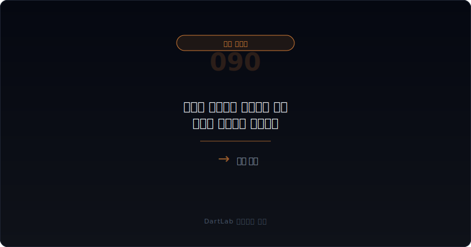
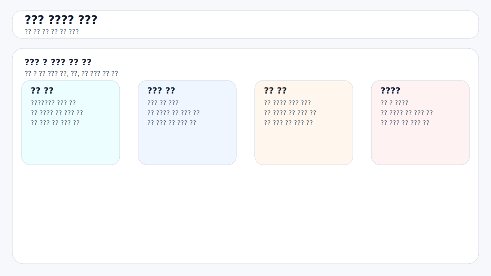
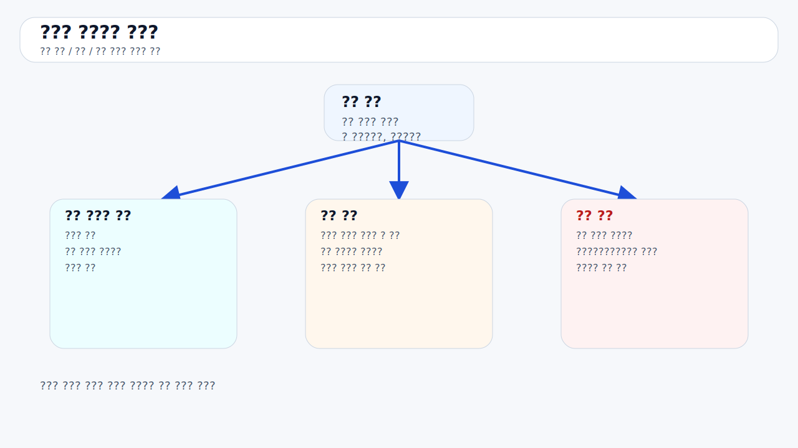
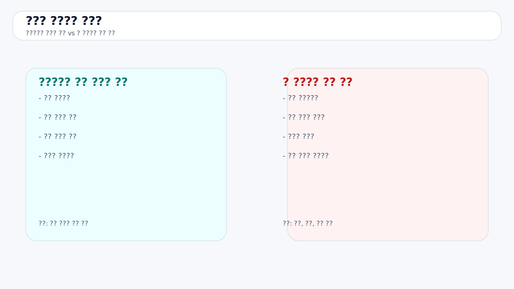
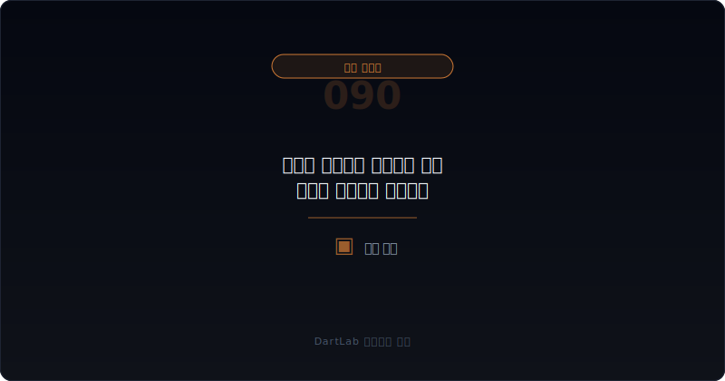

# 우선주 의무배당 미지급은 언제 협상력 역전으로 이어지나

우선주를 볼 때 많은 사람은 상환권, 전환권, 전환가 리픽싱부터 본다. 하지만 계약이 실제로 꺾이는 순간은 의무배당을 제때 못 주기 시작할 때일 수 있다. **의무배당 미지급은 단순히 현금이 부족하다는 뜻을 넘어, 회사가 기존 약속을 더 이상 편한 조건으로 유지하기 어려워졌다는 신호가 될 수 있기 때문이다.**

이 지점이 중요한 이유는 누적배당보다 한 단계 더 직접적이기 때문이다. 누적배당은 시간이 지나며 조용히 쌓일 수 있다. 반면 의무배당 미지급은 계약상 지급해야 할 약속을 이행하지 못했다는 사실 자체가 시장에 드러나는 순간이다. 이때부터 투자자는 `언제 줄 것인가`만 묻지 않고 `다음 협상에서 누가 더 유리한가`를 묻게 된다.

이 글은 [우선주 누적배당은 언제 현금 압박으로 돌아오나](/blog/cumulative-preferred-dividends-cash-pressure), [상환전환우선주 조건변경과 상환 유예는 누구에게 유리한가](/blog/rcps-term-change-and-redemption-deferral), [RCPS 상환 압박과 자본 재분류는 어디서 먼저 보이나](/blog/rcps-redemption-pressure-and-reclassification), [우선주·RCPS·상환전환우선주는 누구에게 유리한가](/blog/preferred-stock-and-rcps-disclosure)의 다음 단계다. 여기서는 의무배당 미지급이 어떻게 협상력 역전으로 이어지는지 정리한다.

이 글은 의무배당 미지급을 `계약 조건 확인 -> 미지급의 법적·경제적 효과 확인 -> 회사 현금 여력 점검 -> 후속 조건변경과 자금조달 연결 -> 누가 더 유리해지는지 판단` 순서로 읽는 방법을 설명한다.

---

## 왜 의무배당 미지급은 누적배당보다 더 직접적인 협상 신호인가

누적배당은 시간이 지나며 부담이 쌓이는 구조다. 하지만 의무배당 미지급은 그 부담이 실제 사건으로 표면화되는 지점이다. 회사가 약속된 지급을 제때 하지 못했다는 사실이 드러나는 순간, 투자자 입장에서는 기다릴 이유보다 조건을 다시 요구할 이유가 커질 수 있다.

이때부터 협상력은 서서히 아니라 꽤 빠르게 움직일 수 있다. 왜냐하면 회사는 현금이 부족하다는 사실을 노출했고, 다음 자금조달이나 만기 연장, 상환 유예를 위해 기존 투자자의 협조가 더 필요해지기 때문이다. 계약에 따라 step-up, 우선권 강화, 추가 보호조항, 의결권 변화, 조기상환 요구처럼 효과는 다르지만, 공통점은 하나다. 회사가 이전보다 불리한 위치에서 다시 협상하게 될 수 있다는 점이다.

그래서 의무배당 미지급은 단순 미지급 금액보다 `지금부터 누가 더 급한가`를 읽는 신호에 가깝다.

---

## 어떤 조건이 협상력을 결정하나

| 먼저 볼 항목 | 왜 중요한가 |
| --- | --- |
| 의무배당 조건 | 반드시 지급해야 하는 구조인지 본다 |
| 미지급 발생 시 효과 | 누적, step-up, 권리 변화가 있는지 본다 |
| 회사 현금 여력 | 실제로 지급을 감당할 수 있는지 본다 |
| 상환·전환과의 연결 | 배당 미지급이 다른 권리와 붙는지 본다 |
| 후속 협상 | 조건변경, 유예, 추가 보호조항이 붙는지 본다 |
| 신규 자금조달 | 새 투자자가 어떤 위치에 들어오는지 본다 |

실전에서는 먼저 계약서 문구를 좁혀야 한다. 모든 우선주가 같은 방식으로 작동하지 않기 때문이다. 누적 여부, 미지급 시 효과, 상환과의 연결, 우선권 강화 조항이 무엇인지부터 적는 편이 좋다.

그다음에는 회사 현금 여력과 시기를 붙여 봐야 한다. 만기와 배당 시점이 겹치고, 영업현금흐름이 약하고, 외부 조달까지 필요하면 의무배당 미지급은 단순 운영 실수보다 협상력 약화에 가까워진다. 이 부분은 [메자닌 조기상환 요구와 유동성 압박은 어디서 먼저 보이나](/blog/mezzanine-put-option-and-liquidity-pressure), [차입 약정 위반과 기한이익상실은 어디서 먼저 보이나](/blog/debt-covenant-breach-and-acceleration-risk)와 같이 보면 더 잘 보인다.

---

## 발행자 시각 vs 투자자 시각

핵심 질문은 이것이다. `이 미지급은 일시적 현금 조정인가, 아니면 투자자 쪽 협상력이 실제로 넘어가는 시작점인가?`

일시적 지연에 가까운 경우는 미지급 기간이 짧고 회사 현금이 빠르게 회복되며, 추가 조건변경 없이 지급이 정리되는 경우다. 이때는 사건이 있어도 구조적 역전으로까지 보지 않을 수 있다.

경계 구간은 의무배당 미지급이 발생했지만 회사가 아직 일부 선택권을 갖고 있는 상황이다. 예를 들어 신규 자금조달 가능성이 남아 있고, 기존 투자자도 당장 강하게 밀어붙일 이유가 약한 경우다. 이때는 다음 협상 조건을 봐야 한다.

협상력 역전 구조는 미지급이 길어지고, 상환이나 만기 문제가 가까우며, 회사 현금이 부족하고, 새 자금조달도 기존 투자자 동의 없이 어렵고, 조건변경 논의가 시작되는 경우다. 이때부터는 회사보다 투자자 쪽 카드가 더 세질 수 있다.

---

## 조건이 바뀔 때 무엇이 움직이나

| 관찰 포인트 | 상대적으로 관리 가능한 경우 | 더 조심해야 하는 경우 |
| --- | --- | --- |
| 미지급 기간 | 짧고 바로 해소된다 | 길어지고 반복된다 |
| 현금 여력 | 지급 재원이 보인다 | 신규 조달 없이는 어렵다 |
| 후속 조건 | 큰 변화 없이 정리된다 | 권리 강화·유예·재협상이 붙는다 |
| 상환 연계 | 배당과 상환이 분리된다 | 배당 미지급이 상환 압박을 키운다 |
| 신규 투자 | 협상력 유지가 가능하다 | 기존 투자자 동의가 더 중요해진다 |

상대적으로 관리 가능한 경우는 미지급 사건이 있어도 회사가 곧 현금을 만들 수 있고, 투자자도 굳이 강한 조건을 요구할 필요가 없다. 반대로 더 조심해야 하는 경우는 회사가 시간을 벌수록 더 불리해지고, 투자자는 기다릴수록 더 많은 권리를 요구할 수 있는 구조다.

특히 [우선주 누적배당은 언제 현금 압박으로 돌아오나](/blog/cumulative-preferred-dividends-cash-pressure), [상환전환우선주 조건변경과 상환 유예는 누구에게 유리한가](/blog/rcps-term-change-and-redemption-deferral), [메자닌 만기연장과 조건변경은 누구에게 유리한가](/blog/mezzanine-extension-and-condition-change)까지 같이 보면, 현금 문제와 협상력 이동이 어떤 순서로 붙는지 더 잘 보인다.

이때 실전에서 많이 놓치는 부분은 `회사가 시간을 벌수록 정말 유리해지는가`다. 일부 회사는 협상을 늦추면 해결될 것처럼 보이지만, 실제로는 누적 미지급과 신규 자금조달 지연이 겹치면서 선택지가 더 줄어든다. 그래서 의무배당 미지급은 단순히 버틸 수 있는 기간을 재는 문제가 아니라, 버티는 동안 누가 더 많은 권리를 가져가게 되는지까지 함께 봐야 한다.

---

## 왜 의무배당 미지급은 회계 이슈보다 협상 이벤트로 읽어야 하나

의무배당 미지급은 회계상 분류나 주석 공시로도 보일 수 있다. 하지만 투자자 입장에서 더 중요한 것은 그 이후 협상 구조다. 회사가 미지급을 해소하기 위해 무엇을 내줄 준비를 해야 하는지, 그리고 그 대가가 현금인지 희석인지 권리 강화인지를 봐야 한다.

예를 들어 회사가 배당을 현금으로 못 주면 만기 연장, 추가 담보, 배당률 조정, 전환 조건 조정, 상환 구조 변경 같은 옵션이 논의될 수 있다. 이때 기존 투자자는 과거보다 더 강한 위치에서 협상할 수 있다. 그래서 미지급 사건은 숫자보다 협상 구조를 먼저 바꾸는 신호다.

즉 `배당을 안 줬다`는 사실보다 `그 대가로 무엇을 내주게 되나`를 묻는 편이 훨씬 실전적이다.

---

## 실전에서 가장 빨리 구분되는 조합은 무엇인가

가장 빨리 위험해지는 조합은 `의무배당 미지급 + 현금 부족 + 상환 시점 근접 + 조건변경 협상 시작`이다. 여기에 [RCPS 상환 압박과 자본 재분류는 어디서 먼저 보이나](/blog/rcps-redemption-pressure-and-reclassification)에서 본 상환 부담과 [메자닌 조기상환 요구와 유동성 압박은 어디서 먼저 보이나](/blog/mezzanine-put-option-and-liquidity-pressure) 같은 이벤트가 겹치면, 협상력은 더 빠르게 투자자 쪽으로 넘어갈 수 있다.

반대로 상대적으로 덜 무거운 조합은 `단기 미지급 + 빠른 현금 보강 + 조건 변화 없음`이다. 이런 경우는 사건이 있어도 협상력 역전으로 보지 않을 수 있다.

실전 메모는 다섯 줄이면 충분하다. `의무 여부`, `미지급 기간`, `현금 여력`, `후속 조건`, `신규 조달`. 이 다섯 줄을 적으면 협상력이 언제 넘어가는지 빠르게 가를 수 있다.

---

## 왜 새 투자 유치가 시작되면 협상력 이동이 더 빨라지나

회사가 새 자금을 받아야 하는 시점은 협상력이 가장 민감하게 드러나는 구간이다. 기존 우선주 의무배당이 미지급 상태라면, 새 투자자는 자신보다 먼저 권리를 갖는 투자자가 이미 있다는 사실을 본다. 그러면 신규 투자자는 더 높은 수익률이나 더 강한 조건을 요구할 수 있고, 기존 투자자는 자신들의 권리를 지키기 위해 더 단단하게 협상할 수 있다.

이 상황에서는 회사가 가장 약하다. 기존 투자자도 설득해야 하고 신규 투자자도 설득해야 하기 때문이다. 그래서 의무배당 미지급은 단순히 과거 약속을 못 지킨 문제가 아니라, 미래 자금조달의 가격을 올리는 문제로 바뀔 수 있다.

결국 새 자금조달 국면에서 의무배당 미지급은 과거의 미납이 아니라 협상판 전체를 바꾸는 변수로 읽어야 한다.

---

## 후속 이벤트에서 다시 확인할 것

| 이번에 본 것 | 다음에 다시 볼 것 |
| --- | --- |
| 미지급 사실 | 장기화되는가, 해소되는가 |
| 후속 조건 | 권리 강화나 유예가 붙는가 |
| 현금 계획 | 실제 지급 재원이 생기는가 |
| 신규 조달 | 더 비싼 조건으로 들어오는가 |
| 협상 구조 | 누가 더 급한 위치에 있는가 |

의무배당 미지급은 한 번의 사건으로 끝나지 않는 경우가 많다. 그래서 다음 보고서에서 가장 먼저 봐야 할 것은 회계 분류보다 `실제 힘의 방향이 바뀌었는가`다.

후속 공시에서 이사회 결의, 조건 변경, 신규 투자자 유치 문구가 어떻게 바뀌는지도 중요하다. 같은 자금조달 공시라도 기존 우선주 투자자 동의가 전제되는지, 배당 미지급 해소 조건이 붙는지에 따라 협상력의 위치가 달라진다. 결국 숫자보다 먼저 움직이는 것은 계약 구조와 동의권 배치다.

---

## 실전 체크리스트

- 우선주가 의무배당 구조인지 확인했는가
- 미지급 시 어떤 권리 변화가 가능한지 적었는가
- 회사 현금 여력과 상환 시기를 같이 봤는가
- 후속 조건변경이나 유예 협상이 붙는지 확인했는가
- 신규 자금조달이 필요한 상황인지 판단했는가
- 협상력이 어느 시점부터 투자자 쪽으로 기우는지 기준을 세웠는가

## FAQ

### 의무배당을 한 번 못 주면 바로 큰 문제인가

항상 그렇지는 않다. 다만 그 미지급이 길어지고 다른 현금 압박과 겹치면 해석은 훨씬 무거워진다.

### 무엇이 가장 중요한 검증 포인트인가

미지급이 후속 조건변경과 자금조달 구조를 어떻게 바꾸는지다.

### 누적배당과 무엇이 다른가

누적배당은 부담이 쌓이는 구조고, 의무배당 미지급은 그 부담이 사건으로 표면화되는 지점에 가깝다.

### 어디와 같이 읽으면 도움이 되나

우선주 누적배당, RCPS 상환 압박, 조건변경·상환 유예, 메자닌 조기상환 글과 같이 보면 좋다.

## 조건 분석에 참고할 글

- [우선주 누적배당은 언제 현금 압박으로 돌아오나](/blog/cumulative-preferred-dividends-cash-pressure)
- [상환전환우선주 조건변경과 상환 유예는 누구에게 유리한가](/blog/rcps-term-change-and-redemption-deferral)
- [RCPS 상환 압박과 자본 재분류는 어디서 먼저 보이나](/blog/rcps-redemption-pressure-and-reclassification)
- [우선주·RCPS·상환전환우선주는 누구에게 유리한가](/blog/preferred-stock-and-rcps-disclosure)
- [메자닌 만기연장과 조건변경은 누구에게 유리한가](/blog/mezzanine-extension-and-condition-change)
- [메자닌 조기상환 요구와 유동성 압박은 어디서 먼저 보이나](/blog/mezzanine-put-option-and-liquidity-pressure)
- [차입 약정 위반과 기한이익상실은 어디서 먼저 보이나](/blog/debt-covenant-breach-and-acceleration-risk)

## 관련 공시 출처

- [IAS 32 Financial Instruments: Presentation](https://www.ifrs.org/issued-standards/list-of-standards/ias-32-financial-instruments-presentation/)
- [IFRS 9 Financial Instruments](https://www.ifrs.org/issued-standards/list-of-standards/ifrs-9-financial-instruments/)
- [DART 소개 - 보고서정보](https://dart.fss.or.kr/introduction/content2.do)
- [OpenDART 주요사항보고서 주요정보조회](https://opendart.fss.or.kr/disclosureinfo/mainMatter/main.do)
- [OpenDART XBRL 주석](https://opendart.fss.or.kr/disclosureinfo/fnltt/xbrlnote/main.do)

## 조건별 핵심 요약

우선주 의무배당 미지급은 단순 현금 부족이 아니라 협상 구조가 바뀌기 시작했다는 신호일 수 있다. 그래서 이 사건은 미지급 금액보다 후속 조건변경과 자금조달 구조를 먼저 봐야 한다.

핵심은 `얼마를 못 줬나`보다 `그 일로 누가 더 강해졌나`를 묻는 것이다. 그 질문을 붙이면 우선주 계약의 힘의 이동을 훨씬 더 정확하게 읽게 된다.
