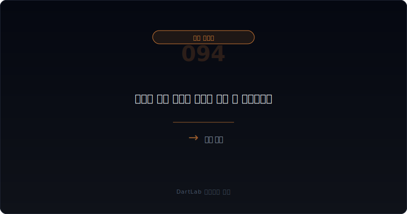
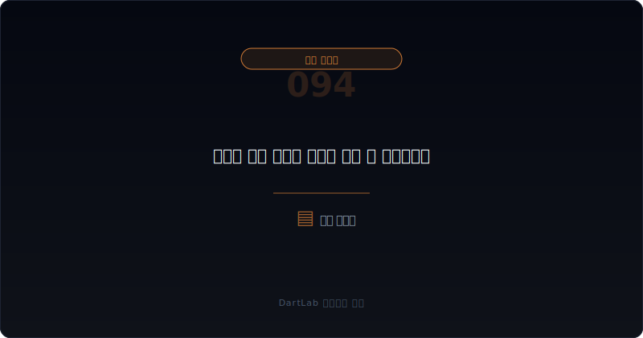
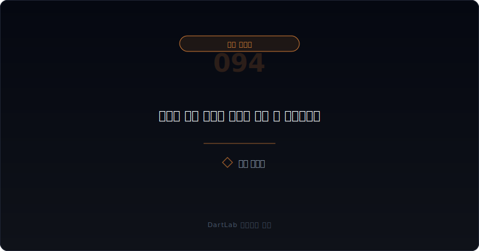
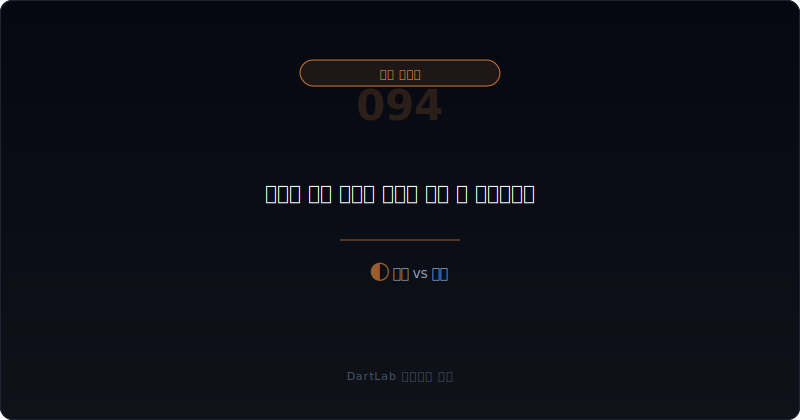
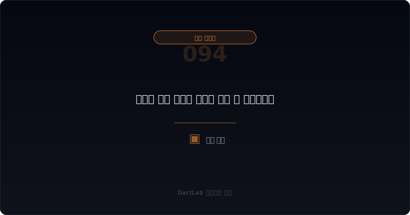

# 우선주 배당 스텝업 조항은 언제 더 위험해지나

우선주 계약을 볼 때 많은 사람은 현재 배당률만 본다. 하지만 **실전에서는 현재 숫자보다 `언제 배당률이 더 올라갈 수 있는가`가 더 중요할 때가 많다. 스텝업 조항은 평소에는 조용해 보여도 미지급, 상환 압박, 신규 자금조달 지연이 겹치면 우선주 비용과 협상 구조를 한꺼번에 바꿀 수 있기 때문이다.**

이 조항이 중요한 이유는 비용의 크기만이 아니라 시간의 방향을 바꾸기 때문이다. 스텝업이 발동되면 회사는 시간이 지날수록 더 불리해질 수 있다. 배당률이 올라가고, 누적 부담이 커지고, 기존 투자자 동의의 무게도 더 커질 수 있다. 그래서 스텝업은 단순한 금리 문구가 아니라 `늦을수록 비싸지는 계약`으로 읽는 편이 맞다.

이 글은 [우선주 의무배당 미지급은 언제 협상력 역전으로 이어지나](/blog/missed-mandatory-preferred-dividends), [우선주 누적배당은 언제 현금 압박으로 돌아오나](/blog/cumulative-preferred-dividends-cash-pressure), [상환전환우선주 조건변경과 상환 유예는 누구에게 유리한가](/blog/rcps-term-change-and-redemption-deferral), [RCPS 상환 압박과 자본 재분류는 어디서 먼저 보이나](/blog/rcps-redemption-pressure-and-reclassification)의 다음 단계다. 여기서는 `배당 스텝업이 언제 더 무거워지는가`를 정리한다.

이 글은 우선주 스텝업을 `발동 조건 확인 -> 현재 현금 여력 대조 -> 상환 일정과 함께 읽기 -> 신규 자금조달 영향 판단 -> 후속 조건변경 가능성 추적` 순서로 읽는 방법을 설명한다.

---

## 왜 스텝업 조항은 배당률 숫자보다 시간 압박으로 읽어야 하나

배당 스텝업은 표면적으로는 배당률이 올라가는 조항이다. 그래서 많은 사람은 비용이 조금 늘어나는 문제로만 본다. 하지만 스텝업의 더 중요한 의미는 `시간이 회사 편이 아니게 되는 구조`다. 일정 시점이 지나거나 특정 조건을 못 맞추면 비용이 더 올라가므로, 회사는 늦출수록 더 비싼 선택을 하게 된다.

특히 우선주 배당은 현금 여력과 자금조달 조건에 직접 연결된다. 지금 당장 배당을 못 주더라도 스텝업이 붙으면 다음 협상은 훨씬 불리해질 수 있다. 기존 투자자는 기다릴수록 더 높은 수익을 요구할 수 있고, 신규 투자자는 이미 비싸진 선순위 부담을 보고 더 강한 조건을 요구할 수 있다.

따라서 스텝업은 현재 배당률이 아니라 `언제, 어떤 조건에서, 얼마나 빨리 부담이 더 커지는가`를 중심으로 읽어야 한다. 비용 조항이 아니라 협상력 조항으로 읽는 것이 더 실전적이다.

---

## 어떤 조건이 협상력을 결정하나

| 먼저 볼 항목 | 왜 중요한가 |
| --- | --- |
| 스텝업 발동 조건 | 언제 비용이 올라가는지 본다 |
| 현재 배당 지급 상태 | 이미 미지급 구간에 들어갔는지 본다 |
| 현금 여력 | 실제로 버틸 수 있는지 본다 |
| 상환 일정 | 배당 부담과 상환 압박이 겹치는지 본다 |
| 신규 자금조달 필요 | 더 비싼 비용으로 이어질지 본다 |
| 조건변경 가능성 | 협상으로 완화될지 더 강해질지 본다 |

실전에서는 먼저 `발동 조건`을 적어야 한다. 특정 연도 도달인지, 미지급 발생인지, 상장 실패인지, 상환 지연인지에 따라 해석이 달라진다. 같은 1%포인트 스텝업이라도 발동 조건이 약하면 무게가 덜하고, 발동 조건이 이미 눈앞이면 훨씬 무겁다.

그다음에는 현금 여력과 상환 일정을 붙여 본다. 배당 스텝업은 단독으로 보기보다 [차입 약정 위반과 기한이익상실 위험은 어디서 먼저 드러나나](/blog/debt-covenant-breach-and-acceleration-risk), [메자닌 조기상환 요구와 유동성 압박은 어디서 먼저 보이나](/blog/mezzanine-put-option-and-liquidity-pressure), [메자닌 만기연장과 조건변경은 누구에게 유리한가](/blog/mezzanine-extension-and-condition-change)와 같이 읽을 때 진짜 무게가 보인다.

---

## 발행자 시각 vs 투자자 시각

핵심 질문은 이것이다. `이 스텝업은 계약서의 장식인가, 아니면 시간이 갈수록 현실 비용과 협상력을 바꾸는 조항인가?`

관리 가능한 경우는 스텝업 조건이 아직 멀고, 현금 여력도 있으며, 회사가 필요하면 조기 상환이나 원활한 리파이낸싱이 가능한 경우다. 이때는 조항이 있어도 실제 부담은 제한적일 수 있다.

경계 구간은 스텝업 조건이 가까워지고 있지만 회사가 아직 선택지를 가진 경우다. 현금 보강 가능성, 신규 투자, 조건변경 협상 여지가 남아 있다면 다음 이벤트를 지켜볼 필요가 있다.

협상력 악화 구조로 읽어야 하는 경우는 스텝업 발동이 임박했거나 이미 시작됐고, 배당 미지급이나 상환 압박이 겹치며, 회사 현금이 약하고, 신규 자금조달도 기존 투자자 동의 없이는 어렵고, 조건변경 논의가 붙는 경우다. 이때는 시간이 회사 편이 아니다.

---

## 조건이 바뀔 때 무엇이 움직이나

| 관찰 포인트 | 상대적으로 관리 가능한 경우 | 더 조심해야 하는 경우 |
| --- | --- | --- |
| 발동 시점 | 아직 멀다 | 임박했거나 이미 시작됐다 |
| 현금 여력 | 배당·상환 재원이 있다 | 신규 조달 없이는 어렵다 |
| 후속 조건 | 큰 변화 없이 유지된다 | 권리 강화·재협상이 붙는다 |
| 신규 투자 | 조건을 통제할 여지가 있다 | 기존 투자자 동의가 더 세다 |
| 시간 경과 | 늦춰도 큰 변화가 없다 | 늦출수록 더 비싸진다 |

상대적으로 관리 가능한 경우는 스텝업 조항이 있어도 회사가 먼저 움직일 수 있다. 반대로 더 조심해야 하는 경우는 회사가 늦을수록 선택지가 줄고, 기존 투자자는 기다릴수록 더 유리해진다.

실전에서는 `배당률 몇 퍼센트인가`보다 `시간이 누구에게 유리한가`를 적어 두는 것이 좋다. 스텝업 조항의 진짜 의미는 숫자보다 방향에 있다.

---

## 왜 기본 배당률보다 발동 트리거가 더 중요하나

배당률이 높아 보여도 스텝업이 거의 발동되지 않는 구조면 부담은 제한적일 수 있다. 반대로 기본 배당률이 그리 높지 않아도 발동 조건이 현실에 가깝고, 발동 후 누적 구조가 강하면 위험은 훨씬 커질 수 있다.

예를 들어 상장 실패, 일정 기간 경과, 의무배당 미지급, 상환 미이행 같은 조건은 생각보다 자주 현실화된다. 이런 조항은 회사가 시간이 지나면 자동으로 더 비싼 구조 안으로 들어가게 만든다. 그래서 스텝업을 볼 때는 배당률 숫자 자체보다 `트리거의 현실성`을 먼저 봐야 한다.

즉 같은 2%포인트 스텝업도, 먼 미래의 낮은 확률 조항과 당장 다음 협상에 영향을 주는 현실 조항은 무게가 다르다.

---

## 실전에서 가장 빨리 구분되는 조합은 무엇인가

가장 빨리 위험해지는 조합은 `스텝업 발동 임박 + 의무배당 미지급 또는 누적배당 확대 + 상환 압박 + 신규 조달 필요`다. 여기에 [우선주 의무배당 미지급은 언제 협상력 역전으로 이어지나](/blog/missed-mandatory-preferred-dividends)에서 본 협상력 이동과 [상환전환우선주 조건변경과 상환 유예는 누구에게 유리한가](/blog/rcps-term-change-and-redemption-deferral)에서 본 조건변경 협상이 겹치면 더 무거워진다.

반대로 상대적으로 덜 무거운 조합은 `스텝업 조건 존재 + 발동 시점 여유 + 현금 보강 가능 + 조건 변경 불필요`다. 이 경우에는 조항이 있어도 즉시 위험으로 보지 않을 수 있다.

실전 메모는 다섯 줄이면 충분하다. `트리거`, `발동 시점`, `현금 여력`, `상환 일정`, `신규 조달`. 이 다섯 줄을 적으면 스텝업 조항이 장식인지 현실 비용인지 빠르게 보인다.

---

## 왜 신규 자금조달 국면에서 스텝업 조항이 더 무거워지나

신규 자금조달이 필요한 시점에는 기존 우선주 계약의 부담이 그대로 새 투자자 앞에 놓인다. 스텝업 조항이 임박했거나 이미 발동된 상태라면, 새 투자자는 자기보다 앞선 투자자가 더 비싼 권리를 갖는 구조를 보게 된다. 그러면 신규 투자자는 더 높은 수익률이나 더 강한 보호조항을 요구할 수 있다.

이때 회사는 가장 약하다. 기존 투자자도 설득해야 하고 신규 투자자도 설득해야 하기 때문이다. 결국 스텝업 조항은 현재 비용을 조금 높이는 수준이 아니라, 미래 자금조달 가격 전체를 끌어올리는 변수로 작동할 수 있다.

그래서 우선주 계약을 읽을 때는 현재 배당률만 보는 대신 `새 돈이 들어올 때 이 조항이 협상판을 어떻게 바꾸는가`를 반드시 생각해야 한다.

---

## 후속 이벤트에서 다시 확인할 것

| 이번에 본 것 | 다음에 다시 볼 것 |
| --- | --- |
| 스텝업 조건 | 실제 발동되는가, 유예되는가 |
| 배당 상태 | 미지급이 장기화되는가 |
| 현금 계획 | 지급 재원이 생기는가 |
| 신규 조달 | 더 비싼 조건이 붙는가 |
| 조건변경 | 회사가 유리해지는가, 투자자가 유리해지는가 |

스텝업 조항은 한 번 읽고 끝내는 숫자가 아니다. 발동 전, 발동 직후, 조건변경 협상 국면에서 의미가 계속 바뀐다. 그래서 다음 보고서와 공시에서는 `실제 발동 여부`와 `후속 자금조달 가격`을 같이 봐야 한다.

또 090과 094를 같이 보면 좋다. 090이 `미지급이 협상력 역전으로 가는 과정`을 읽는 글이라면, 094는 `그 과정에서 스텝업 조항이 왜 시간을 더 비싸게 만드는지`를 읽는 글이다.

실전에서 스텝업의 무게는 배당률 상승 그 자체보다 선택지 축소에서 더 크게 느껴진다. 회사가 지금 당장 감당하지 못해도 시간을 벌 수 있으면 버틸 수 있지만, 스텝업이 발동되면 시간을 벌수록 비용과 협상 조건이 더 악화될 수 있다. 그래서 이 조항은 숫자보다 방향을 바꾸는 조항에 가깝다.

또한 스텝업은 유예 협상이 시작되는 순간 더 중요해진다. 회사는 부담을 늦추고 싶어 하고, 투자자는 더 높은 권리나 더 강한 보호를 요구할 수 있기 때문이다. 결국 스텝업 조항은 배당 조건이 아니라 `재협상의 출발점`으로 읽는 편이 훨씬 실전적이다.

---

## 실전 체크리스트

- 스텝업 발동 조건과 시점을 적었는가
- 현재 현금 여력과 상환 일정을 같이 봤는가
- 미지급이나 누적배당 부담과 연결했는가
- 신규 자금조달이 필요한 상황인지 판단했는가
- 조건변경 협상이 붙을 가능성을 체크했는가
- 시간이 갈수록 누가 유리해지는지 기준을 세웠는가

## FAQ

### 배당 스텝업 조항이 있으면 무조건 위험한가

무조건은 아니다. 다만 발동 조건이 현실에 가까워지고 현금 여력이 약하면 훨씬 무거워진다.

### 무엇이 가장 중요한 검증 포인트인가

언제 발동되는지와 발동 이후 회사가 실제로 감당할 수 있는지다.

### 기본 배당률이 낮으면 안심해도 되나

아니다. 기본 배당률보다 스텝업 트리거와 발동 후 협상 구조가 더 중요할 수 있다.

### 어디와 같이 읽으면 도움이 되나

090, 086, 082, 078, 052, 074와 같이 보면 우선주 계약의 힘의 이동을 더 잘 읽을 수 있다.

## 조건 분석에 참고할 글

- [우선주 의무배당 미지급은 언제 협상력 역전으로 이어지나](/blog/missed-mandatory-preferred-dividends)
- [우선주 누적배당은 언제 현금 압박으로 돌아오나](/blog/cumulative-preferred-dividends-cash-pressure)
- [상환전환우선주 조건변경과 상환 유예는 누구에게 유리한가](/blog/rcps-term-change-and-redemption-deferral)
- [RCPS 상환 압박과 자본 재분류는 어디서 먼저 보이나](/blog/rcps-redemption-pressure-and-reclassification)
- [우선주·RCPS·상환전환우선주는 누구에게 유리한가](/blog/preferred-stock-and-rcps-disclosure)
- [메자닌 조기상환 요구와 유동성 압박은 어디서 먼저 보이나](/blog/mezzanine-put-option-and-liquidity-pressure)
- [메자닌 만기연장과 조건변경은 누구에게 유리한가](/blog/mezzanine-extension-and-condition-change)

## 관련 공시 출처

- [IAS 32 Financial Instruments: Presentation](https://www.ifrs.org/issued-standards/list-of-standards/ias-32-financial-instruments-presentation/)
- [IFRS 9 Financial Instruments](https://www.ifrs.org/issued-standards/list-of-standards/ifrs-9-financial-instruments/)
- [DART 소개 - 보고서정보](https://dart.fss.or.kr/introduction/content2.do)
- [OpenDART 주요사항보고서 주요정보조회](https://opendart.fss.or.kr/disclosureinfo/mainMatter/main.do)

## 조건별 핵심 요약

우선주 배당 스텝업 조항은 평소에는 조용하지만, 미지급과 상환 압박, 신규 자금조달 필요가 겹치면 회사에 훨씬 더 비싼 시간을 강요할 수 있다. 그래서 이 조항은 배당률 숫자보다 발동 조건과 시간 압박으로 읽어야 한다.

핵심은 `지금 몇 퍼센트인가`보다 `늦을수록 얼마나 더 비싸지고 누가 더 강해지는가`를 묻는 것이다. 그 질문을 붙이면 우선주 계약의 잠복된 비용과 협상 구조를 훨씬 더 정확하게 읽게 된다.
