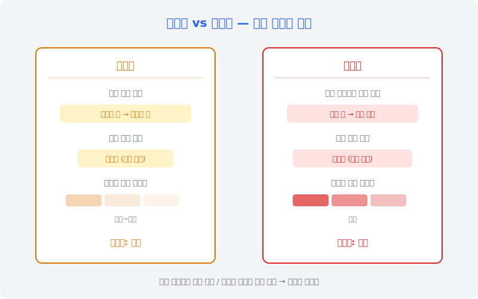
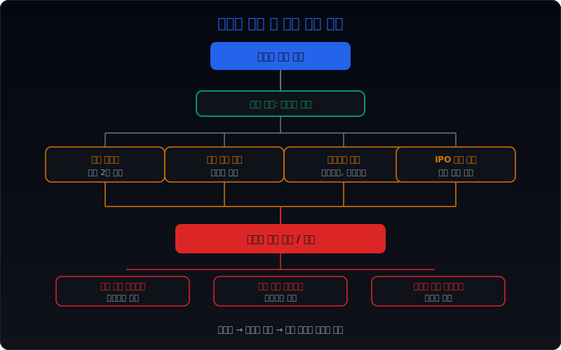
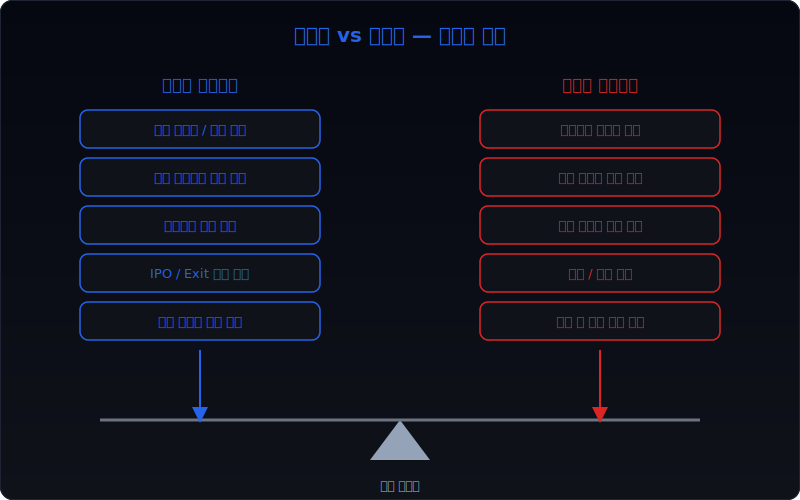
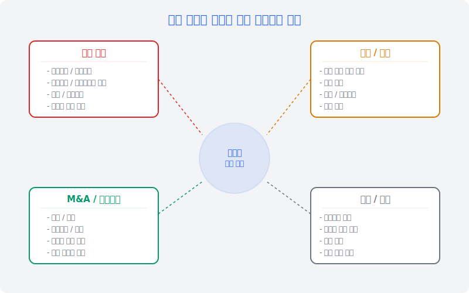
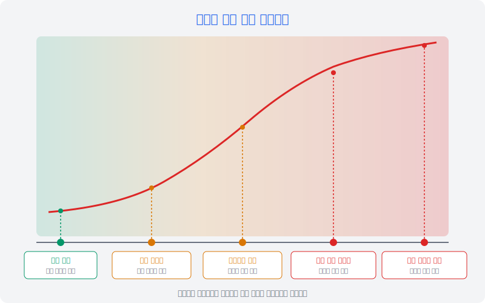

# 우선주 동의권 조항은 언제 더 무거워지나

우선주 계약을 분석할 때 대부분의 시선은 배당률, 상환 일정, 전환 가격에 머문다. 그러나 **실전에서 발행회사의 경영 자유도를 실질적으로 제약하는 것은 배당이나 상환이 아니라 동의권 조항인 경우가 많다.** 배당을 못 주면 비용이 쌓이는 것이고 상환을 못 하면 부채가 남는 것이지만, 동의권이 발동되면 회사는 특정 의사결정 자체를 할 수 없게 된다. 자금을 빌리지 못하고, 자산을 팔지 못하고, 합병을 진행하지 못하는 상황이 동의권의 무게다.

이 글은 [우선주·RCPS 공시에서 무엇을 먼저 봐야 하나](/blog/preferred-stock-and-rcps-disclosure), [우선주 배당 스텝업 조항은 언제 더 위험해지나](/blog/preferred-dividend-step-up-risk), [우선주 의무배당 미지급은 언제 협상력 역전으로 이어지나](/blog/missed-mandatory-preferred-dividends), [상환전환우선주 조건변경과 상환 유예는 누구에게 유리한가](/blog/rcps-term-change-and-redemption-deferral), [메자닌 투자자 보호 조항과 리픽싱은 어디서 확인하나](/blog/mezzanine-protections-and-refixing)의 다음 단계다. 앞의 글들이 배당, 상환, 전환의 조건을 다뤘다면, 여기서는 `동의권이 언제 더 무거워지는가`를 정리한다.

이 글은 우선주 동의권을 `배당과의 차이 이해 → 협상력 결정 조건 확인 → 발행자·투자자 시각 대조 → 조건 변화 시 영향 판단 → 동의 필요 범위 파악 → 실제 사례 확인 → 후속 추적` 순서로 읽는 방법을 설명한다.

---

## 왜 배당보다 동의권이 진짜 무게인가

배당 미지급은 회사에 비용을 쌓는다. 누적 배당이 늘어나고 스텝업이 발동되면 부담이 커진다. 그러나 배당 미지급 자체가 회사의 다음 행동을 차단하지는 않는다. 회사는 배당을 못 주더라도 신규 차입을 하거나 자산을 매각하거나 다른 투자를 진행할 수 있다. 비용이 쌓일 뿐이다.

동의권은 성격이 다르다. 투자자의 사전 동의 없이는 해당 의사결정을 진행할 수 없다. 차입을 하려면 투자자 동의가 필요하고, 자산을 처분하려면 동의가 필요하고, 합병을 진행하려면 동의가 필요하다. 동의를 받지 못하면 그 행동 자체가 멈춘다. 이것이 배당과 동의권의 근본적 차이다.

실전에서 더 중요한 점은 동의권이 시간이 지날수록 무거워질 수 있다는 것이다. 처음에는 대규모 자본 변동에만 적용되던 동의권이, 배당 미지급이나 재무약정 위반 같은 트리거가 발생하면 범위가 넓어지는 구조가 일반적이다. 회사가 어려워질수록 투자자의 동의권은 더 강해지고, 회사의 선택지는 더 좁아진다.

따라서 우선주 계약을 볼 때는 `현재 배당률이 몇 퍼센트인가`보다 `어떤 의사결정에 사전 동의가 필요한가`를 먼저 확인하는 편이 실전적이다. 배당은 비용의 문제이지만, 동의권은 실행의 문제이기 때문이다.

---

## 어떤 조건이 협상력을 결정하나

| 먼저 볼 항목 | 왜 중요한가 |
| --- | --- |
| 동의권 적용 범위 | 어떤 의사결정에 거부권이 있는지 본다 |
| 발동 조건 (트리거) | 범위가 확대되는 조건이 무엇인지 본다 |
| 현재 트리거 충족 여부 | 이미 확대 상태인지 본다 |
| 투자자 지분율 / 보유 구조 | 단독 거부 가능 여부를 본다 |
| 상환 청구권 유무 | 동의권과 상환 청구가 동시에 걸리는지 본다 |
| 누적 미지급 배당 규모 | 협상에서 투자자가 들 수 있는 카드의 크기를 본다 |

실전에서 협상력의 핵심은 `대체 경로의 유무`다. 회사가 투자자 동의 없이도 필요한 자금을 조달할 수 있고, 필요한 거래를 진행할 수 있다면 동의권의 실질 무게는 줄어든다. 반대로, 투자자 동의 없이는 어떤 자금조달도 불가능한 구조라면 동의권은 사실상 거부권이 된다.

트리거 조건도 매우 중요하다. 정상 상태에서는 대규모 자본 변동에만 동의가 필요했지만, 배당 미지급이 2기 연속 발생하면 일상적 차입에도 동의가 필요해지는 구조가 많다. 이 트리거가 얼마나 가까이 와 있는지를 항상 확인해야 한다.

---

## 발행자 시각 vs 투자자 시각

같은 동의권 조항이라도 발행자와 투자자는 전혀 다른 관점에서 읽는다. 이 차이를 알아야 공시를 정확하게 해석할 수 있다.

### 발행자 시각

발행자에게 동의권은 **경영 자유도의 제한**이다. 동의권 범위가 넓을수록 모든 주요 의사결정에서 투자자와 협의해야 하고, 때로는 투자자의 요구를 수용해야 한다. 특히 긴급하게 자금이 필요한 상황에서 동의 절차가 지연되면 기회를 잃을 수 있다.

발행자가 동의권을 가볍게 넘기는 흔한 실수가 있다. 발행 시점에는 `어차피 그런 일은 안 일어날 것`이라고 생각하고 넓은 범위의 동의권에 합의한다. 그러나 2~3년 후 사업 환경이 바뀌면 당시에는 불필요해 보였던 동의권이 실질적 제약이 된다. 자산을 팔아야 하는데 투자자 동의가 필요하고, 투자자는 동의 조건으로 상환 가속이나 추가 수익률을 요구할 수 있다.

### 투자자 시각

투자자에게 동의권은 **투자금 보호의 핵심 장치**다. 배당이나 상환보다 더 직접적인 보호 수단이다. 회사가 투자금을 훼손할 수 있는 결정 — 대규모 차입, 자산 처분, M&A, 지분 희석 — 을 사전에 차단할 수 있기 때문이다.

투자자 입장에서 동의권은 협상 카드이기도 하다. 회사가 동의를 요청하면 투자자는 그 대가로 조건 개선을 요구할 수 있다. 전환 가격 조정, 추가 배당, 상환 일정 변경, 이사회 참여 등이 동의의 대가가 될 수 있다.

---

## 조건이 바뀔 때 무엇이 움직이나

동의권의 무게는 고정되어 있지 않다. 회사의 상황이 바뀌면 동의권의 실질 영향력도 함께 변한다.

### 신규 자금조달이 필요할 때

회사가 추가 자금을 조달해야 할 때, 기존 우선주 투자자의 동의권이 가장 무거워진다. 유상증자를 하려면 지분 희석에 대한 동의가 필요하고, 차입을 하려면 부채 증가에 대한 동의가 필요하다. 투자자는 이 시점에서 기존 조건의 개선을 요구할 수 있다.

특히 [배당 스텝업](/blog/preferred-dividend-step-up-risk)이 이미 발동된 상태에서 신규 자금조달이 필요하면, 기존 투자자는 이중의 레버리지를 갖게 된다. 높아진 배당 부담과 동의권을 동시에 활용할 수 있기 때문이다.

### M&A가 진행될 때

합병이나 분할을 진행할 때 우선주 투자자의 동의권은 거래 자체의 성사 여부를 결정할 수 있다. 인수 대상 회사의 우선주에 M&A 관련 동의권이 있으면, 인수자는 우선주 투자자와도 별도로 협상해야 한다. 이 과정에서 우선주 조기 상환이나 조건 개선이 요구되는 것이 일반적이다.

### 배당 정책을 바꿀 때

보통주 배당을 늘리거나 자사주를 매입하려 할 때도 우선주 동의권이 걸릴 수 있다. 우선주 배당이 미지급된 상태에서 보통주에 배당하는 것은 대부분의 우선주 계약에서 금지되어 있지만, 동의권이 있으면 우선주 배당을 완납한 후에도 보통주 배당 규모에 대해 동의를 요구할 수 있다.

---

## 사전 동의가 필요한 경영 의사결정의 범위

동의권 조항의 핵심은 `어디까지 동의가 필요한가`다. 범위가 넓을수록 투자자의 통제력은 강하고 회사의 자유도는 낮다.

### 자본 변경

가장 기본적인 동의권 범위다. 유상증자, 전환사채 발행, 신주인수권부사채 발행, 감자, 주식분할 등 자본 구조를 바꾸는 모든 행위에 대해 사전 동의를 요구한다. 이는 투자자의 지분율과 전환 가치를 보호하기 위한 조항이다.

특히 우선주보다 선순위이거나 동순위인 증권을 추가로 발행하는 것에 대한 동의권은 거의 모든 우선주 계약에 포함된다. 후순위 증권 발행에 대해서도 동의를 요구하는 경우가 있는데, 이는 전체 자본 구조의 변화를 통제하려는 의도다.

### 차입 및 부채

일정 금액 이상의 신규 차입, 담보 제공, 보증, 사채 발행에 대해 동의를 요구한다. 금액 기준은 계약마다 다르지만, 자기자본의 일정 비율이나 절대 금액으로 설정되는 것이 일반적이다.

이 조항이 무거운 이유는 회사의 일상적 운영에도 영향을 줄 수 있기 때문이다. 트리거가 발동되어 동의 기준 금액이 낮아지면, 비교적 소규모 차입에도 투자자 동의가 필요해진다. 이는 사실상 회사의 재무 운영에 투자자가 관여하는 구조가 된다.

### M&A 및 구조변경

합병, 분할, 영업양도, 대규모 자산 처분, 주요 자회사 매각이나 설립에 대해 동의를 요구한다. 이 범위가 넓으면 회사는 사업 구조 재편 시마다 투자자와 협의해야 한다.

실전에서는 `대규모`의 기준이 중요하다. 자산총액의 10%를 기준으로 하는 경우도 있고, 5%나 심지어 특정 자산을 명시하는 경우도 있다. 기준이 낮을수록 동의권의 실질 무게는 무거워진다.

### 경영 및 인사

대표이사 변경, 이사회 구성 변경, 정관 변경, 배당 정책 변경에 대해 동의를 요구하는 조항이다. 이 범위까지 동의권이 확장되면 투자자는 사실상 경영에 직접 관여하는 것과 같다.

특히 이사회 구성에 대한 동의권은 다른 모든 동의권의 실효성을 뒷받침한다. 투자자가 이사회에 자기 측 이사를 참여시킬 수 있으면, 동의권 행사 여부를 판단할 때 더 많은 정보를 갖게 된다.

| 동의 범위 | 일반적 기준 | 트리거 후 확대 기준 |
| --- | --- | --- |
| 유상증자 | 발행 주식의 10% 초과 | 모든 신주 발행 |
| 신규 차입 | 자기자본 30% 초과 | 자기자본 10% 초과 |
| 자산 처분 | 자산총액 20% 초과 | 자산총액 5% 초과 |
| 합병·분할 | 모든 합병·분할 | 변동 없음 (이미 전면) |
| 대표이사 변경 | 해당 없음 (평시) | 사전 동의 필요 |
| 배당 정책 | 해당 없음 (평시) | 사전 동의 필요 |

---

## 동의권 행사 사례와 후속 영향

동의권이 실제로 행사되면 어떤 일이 일어나는지를 아는 것이 중요하다. 공시에서 직접 `동의권 행사`라는 표현을 쓰는 경우는 드물지만, 다음과 같은 패턴에서 동의권의 작동을 읽을 수 있다.

### 패턴 1: 신규 발행 조건의 갑작스러운 변경

회사가 유상증자나 전환사채 발행을 공시한 후, 짧은 시간 안에 발행 조건이 수정되는 경우가 있다. 발행 규모가 줄거나 발행 가격이 변경되거나 특별한 부대 조건이 추가된다면, 기존 우선주 투자자와의 동의 과정에서 조건이 조율되었을 가능성이 높다.

### 패턴 2: M&A 지연과 추가 조건 부여

합병이나 영업양도 일정이 지연되면서 추가 비용이 발생하는 경우도 동의권의 작동을 시사한다. 특히 합병 과정에서 우선주에 대한 추가 보상이나 조기 상환이 결정되면, 이는 동의권 협상의 결과일 가능성이 크다.

### 패턴 3: 조건변경 공시에 숨은 동의 대가

[RCPS 조건변경](/blog/rcps-term-change-and-redemption-deferral) 공시에서 상환 유예나 만기 연장이 이루어질 때, 함께 공시되는 부대 조건을 주의 깊게 봐야 한다. 전환 가격 하향, 이자율 인상, 동의권 범위 확대, 이사회 참여권 부여 등이 동시에 나타나면 이는 조건변경에 대한 투자자 동의의 대가다.

### 패턴 4: 배당 미지급 후 경영 참여 확대

[의무배당 미지급](/blog/missed-mandatory-preferred-dividends) 상태가 지속되면 투자자는 동의권을 통해 경영 참여를 확대할 수 있다. 이사회 참관이나 옵저버 참여에서 시작하여, 이사 선임 요구, 경영 정보 정기 보고 요구로 확대되는 것이 일반적 패턴이다.

---

## 후속 이벤트에서 다시 확인할 것

동의권의 무게는 한 번 확인하고 끝나는 것이 아니다. 회사의 상황이 변할 때마다 다시 점검해야 한다.

**분기별로 확인할 항목:**
- 배당 지급 여부: 미지급이 누적되면 동의권 범위가 확대될 수 있다
- 재무비율 변동: 부채비율, 이자보상배율 등이 약정 기준을 위반했는지 본다
- 차입 변동: 신규 차입이 있었다면 동의를 받았는지, 조건이 어떻게 바뀌었는지 본다

**이벤트 발생 시 확인할 항목:**
- 유상증자 / CB / BW 발행 공시: 기존 우선주 동의 절차를 거쳤는지 본다
- 자산 처분 / 영업양도 공시: 우선주 투자자와 별도 합의가 있는지 본다
- 조건변경 공시: 동의권 범위 확대가 포함되어 있는지 본다
- 대표이사 변경: 우선주 투자자 관련 인사인지 본다

---

## 실전 체크리스트

| 순서 | 점검 항목 | 확인 내용 |
| --- | --- | --- |
| 1 | 동의권 범위 확인 | 어떤 의사결정에 사전 동의가 필요한지 목록화 |
| 2 | 트리거 조건 확인 | 범위가 확대되는 조건이 무엇이고 현재 충족 여부 |
| 3 | 투자자 보유 구조 | 단독 투자자인지 다수 분산인지, 의결권 기준 |
| 4 | 현재 트리거 상태 | 배당 미지급, 재무약정 위반, 상환 지연 여부 |
| 5 | 회사의 향후 계획 | 자금조달, M&A, 자산 처분 등 동의가 필요한 계획 유무 |
| 6 | 대체 경로 유무 | 투자자 동의 없이 진행 가능한 대안이 있는지 |
| 7 | 기존 협상 이력 | 과거 조건변경에서 동의 대가로 무엇을 줬는지 |
| 8 | 후속 공시 추적 | 분기별 배당 상태, 재무약정, 신규 거래 공시 확인 |

---

## FAQ

**Q1. 동의권은 모든 우선주에 있는 조항인가?**

모든 우선주에 동의권이 있는 것은 아니다. 상법상 우선주 주주총회의 의결 사항으로 정해진 기본 보호 규정은 있지만, 실전에서 말하는 동의권은 주로 투자 계약서(SHA, 주주간 계약)나 인수 계약서에 별도로 정하는 조항이다. 상장 우선주보다는 비상장 RCPS, 메자닌 투자에서 훨씬 광범위하고 구체적인 동의권이 설정된다.

**Q2. 동의권과 거부권은 같은 것인가?**

법적으로는 다를 수 있지만, 실질적 효과는 같다. 사전 동의 없이 진행할 수 없으므로 동의를 거부하면 해당 의사결정이 차단된다. 다만 동의권은 적극적 승인을 요구하는 것이고, 거부권은 이의를 제기할 수 있는 권리라는 점에서 계약 해석의 뉘앙스가 다를 수 있다. 실무에서는 동의권이 더 강한 표현으로 사용된다.

**Q3. 동의권은 양도가 가능한가?**

대부분의 투자 계약에서 동의권은 우선주 지분과 함께 양도된다. 다만 양도인과 양수인 사이에서 동의권의 행사 조건이 달라질 수 있고, 투자 계약에서 양도 시 동의권의 승계 여부를 별도로 정하는 경우도 있다. 지분이 여러 투자자에게 분산 양도되면 동의권 행사의 의사결정 구조가 복잡해질 수 있다.

**Q4. 동의권 조항은 공시에서 어떻게 확인하나?**

정기보고서의 `기타 투자판단에 참고할 사항`이나 `우발부채` 항목에서 우선주 발행 조건의 주요 내용이 기재된다. 다만 동의권의 세부 범위까지 상세하게 기재하지 않는 경우가 많다. 전환사채나 RCPS 발행 공시의 `사채의 조건` 또는 `기타 투자판단에 참고할 사항`에서 더 구체적인 내용을 확인할 수 있다. 주주간 계약서 원문은 공시 대상이 아니므로 간접적으로 추론해야 하는 부분이 있다.

**Q5. 투자자가 동의를 부당하게 거부하면 어떻게 되나?**

대부분의 투자 계약에는 `합리적 사유 없이 동의를 거부할 수 없다`는 취지의 조항이 포함된다. 그러나 `합리적 사유`의 해석은 분쟁의 소지가 크다. 실전에서는 법적 다툼보다 협상으로 해결되는 경우가 대부분이다. 투자자가 동의를 거부하면 회사는 투자자의 요구를 일부 수용하거나, 동의가 필요 없는 대안을 찾거나, 최종적으로 우선주를 상환하여 동의권 자체를 소멸시키는 방법을 검토한다.

---

## 조건 분석에 참고할 글

- [우선주·RCPS 공시에서 무엇을 먼저 봐야 하나](/blog/preferred-stock-and-rcps-disclosure) — 우선주 계약의 전체 구조
- [메자닌 투자자 보호 조항과 리픽싱은 어디서 확인하나](/blog/mezzanine-protections-and-refixing) — 보호 조항의 종류와 작동 방식
- [우선주 배당 스텝업 조항은 언제 더 위험해지나](/blog/preferred-dividend-step-up-risk) — 배당 비용 증가와 협상력 변화
- [우선주 의무배당 미지급은 언제 협상력 역전으로 이어지나](/blog/missed-mandatory-preferred-dividends) — 미지급 누적이 협상 구조를 바꾸는 메커니즘
- [상환전환우선주 조건변경과 상환 유예는 누구에게 유리한가](/blog/rcps-term-change-and-redemption-deferral) — 조건변경 과정에서의 동의 대가

---

## 관련 공시 출처

- **정기보고서**: 사업보고서, 분기보고서의 `기타 투자판단에 참고할 사항`, `우발부채와 약정사항`
- **주요사항보고서**: 전환사채·RCPS 발행 조건, `사채의 조건`
- **기타 공시**: 조건변경, 상환, 전환 관련 공시의 부대 조건 기재 항목
- **금융감독원 전자공시시스템 (DART)**: dart.fss.or.kr

---

## 조건별 핵심 요약

| 조건 상태 | 동의권 무게 | 발행자 영향 | 투자자 포지션 |
| --- | --- | --- | --- |
| 정상 (트리거 미충족) | 낮음 | 대규모 거래만 동의 필요 | 보호적 감시 |
| 배당 미지급 1기 | 중간 | 일부 추가 동의 항목 발생 가능 | 조건 개선 요구 가능 |
| 배당 미지급 2기 이상 | 높음 | 동의 범위 확대, 차입도 제한 | 적극적 협상력 확보 |
| 재무약정 위반 | 높음 | 일상 운영까지 동의 필요 가능 | 경영 관여 근거 확보 |
| 상환 기일 미이행 | 매우 높음 | 거의 모든 주요 결정에 동의 필요 | 전면적 통제 가능 |
| 복합 트리거 중첩 | 최고 | 사실상 경영 자유도 상실 | 경영 참여 또는 Exit 주도 |

동의권은 평소에는 보이지 않는 조항이다. 그러나 트리거가 하나씩 쌓이면 회사의 모든 주요 의사결정을 사전에 차단할 수 있는 가장 강력한 투자자 보호 장치가 된다. 배당과 상환의 숫자만 보는 분석은 절반만 보는 것이다. 동의권의 범위, 트리거 조건, 현재 충족 상태를 함께 읽어야 우선주 계약의 진짜 무게가 보인다.
