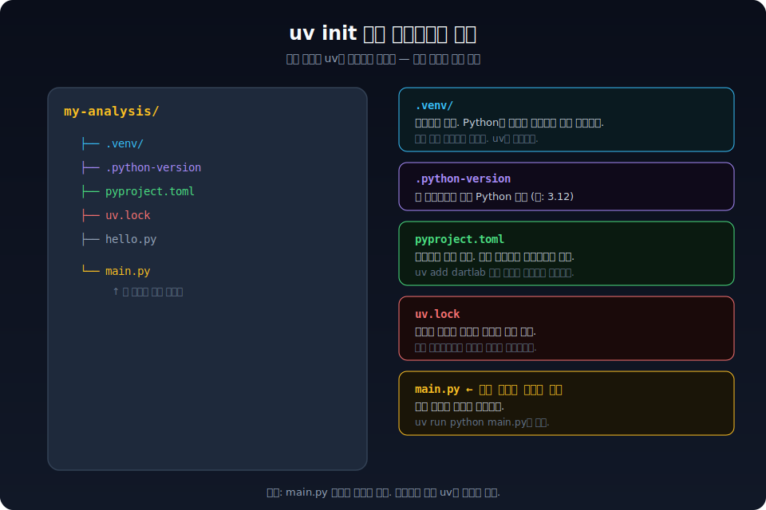
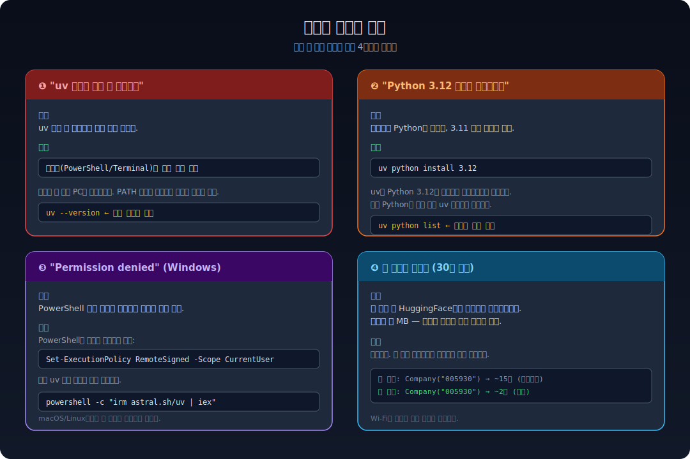

**이 글을 끝까지 따라하면**, 삼성전자의 재무제표가 내 컴퓨터 화면에 출력된다. 프로그래밍 경험이 전혀 없어도 된다. 총 3단계, 5분이면 끝난다.


---

## 시작하기 전에: "터미널"이 뭔가요

이 글에서는 명령어를 "터미널"에 붙여넣는다. 터미널이 뭔지 몰라도 괜찮다. **컴퓨터에 글자로 명령을 내리는 창**이라고 생각하면 된다. 마우스로 클릭하는 대신, 키보드로 명령을 타이핑해서 실행하는 프로그램이다.

여는 방법은 딱 하나만 기억하면 된다.

- **Windows**: 키보드 왼쪽 아래 `⊞ Windows 키`를 누른다 → `PowerShell`이라고 타이핑한다 → 목록에 뜨는 "Windows PowerShell"을 클릭한다. **파란 바탕에 흰 글씨 창**이 뜨면 성공이다.
- **Mac**: `Cmd + Space`를 동시에 누른다 → `Terminal`이라고 타이핑한다 → Enter를 누른다. **흰 바탕에 검은 글씨 창**이 뜨면 성공이다.
- **Linux**: `Ctrl + Alt + T`를 동시에 누른다.

> 앞으로 이 글에 나오는 회색 박스 안의 글자를 **그대로 복사해서 터미널에 붙여넣고 Enter**를 누르면 된다. 외울 필요 없다. 그냥 복사-붙여넣기다.


---

## 1단계: uv 설치 (1분)

> **uv가 뭔가요?** — 원래 Python(파이썬)이라는 프로그래밍 언어를 쓰려면 python.org에서 다운로드하고, pip라는 걸로 패키지를 설치하고, 가상환경을 만들고... 복잡한 과정이 필요하다. **uv는 이 모든 걸 한 방에 해주는 도구**다. uv 하나만 설치하면 Python도 dartlab도 자동으로 깔린다.

터미널을 열고, 본인 컴퓨터에 맞는 명령어 **하나만** 복사해서 붙여넣는다.

**Windows 사용자** (파란 PowerShell 창에 붙여넣기)

```powershell
powershell -ExecutionPolicy ByPass -c "irm astral.sh/uv | iex"
```

**Mac / Linux 사용자**

```bash
curl -LsSf https://astral.sh/uv/install.sh | sh
```

화면에 글자가 주르륵 나오다가 멈추면 설치 끝이다.

**중요: 터미널 창을 닫았다가 다시 연다.** 닫지 않으면 방금 설치한 uv를 컴퓨터가 인식하지 못한다.

다시 연 터미널에 아래를 붙여넣는다.

```bash
uv --version
```

`uv 0.7.x` 같은 숫자가 나오면 1단계 성공이다. 에러가 뜨면 아래 '자주 만나는 문제' 섹션을 본다.

### Python도 자동으로 깔린다

> **Python이 뭔가요?** — 프로그래밍 언어의 한 종류다. dartlab이 Python으로 만들어져 있어서 Python이 컴퓨터에 있어야 dartlab을 실행할 수 있다. 하지만 직접 설치할 필요 없다. 아래 한 줄이면 uv가 알아서 깔아준다.

```bash
uv python install 3.12
```

이미 Python이 있는 사람은 건너뛰어도 된다. 모르겠으면 그냥 실행하면 된다 — 문제가 생기지 않는다.

---

## 2단계: dartlab 설치 (1분)

터미널에 아래 명령을 **한 줄씩** 붙여넣고 매번 Enter를 누른다.

```bash
mkdir my-analysis
```

→ `my-analysis`라는 이름의 폴더를 만든다. (이름은 아무거나 상관없다)

```bash
cd my-analysis
```

→ 방금 만든 폴더 안으로 들어간다.

```bash
uv init
```

→ 이 폴더를 Python 프로젝트로 준비한다. `Initialized project` 같은 메시지가 나오면 성공이다.

마지막으로 dartlab을 설치한다.

```bash
uv add dartlab
```

> **이게 뭘 하는 건가요?** — dartlab이라는 프로그램을 인터넷에서 자동으로 다운로드해서 설치하는 명령이다. 다른 곳에서 직접 다운로드 받을 필요 없다.

패키지 이름이 주르륵 나오다가 멈추면 2단계 완료다.



---

## 3단계: 삼성전자 재무제표 꺼내기 (3분)

### 파일 만들기

텍스트 파일 하나를 만들어야 한다. 이 파일에 "어떤 분석을 할지" 적는 것이다.

**가장 쉬운 방법 (Windows 메모장)**

1. 키보드에서 `⊞ Windows 키`를 누르고 `메모장`을 타이핑해서 연다
2. 아래 코드를 **그대로** 복사해서 붙여넣는다
3. `파일` → `다른 이름으로 저장`을 누른다
4. 저장 위치를 아까 만든 `my-analysis` 폴더로 찾아간다
5. **파일 형식**을 "모든 파일 (\*.\*)"로 바꾼다 (이게 중요하다!)
6. 파일 이름을 `main.py`로 입력하고 저장한다

> VS Code 같은 편집기가 있으면 그걸 써도 된다. 핵심은 `main.py`라는 이름으로 `my-analysis` 폴더 안에 저장하는 것이다.

`main.py` 안에 넣을 내용:

```python
import dartlab

c = dartlab.Company("005930")  # 삼성전자

print(c.sections)  # 사업보고서 전체 지도
print(c.IS)        # 손익계산서 (매출, 영업이익 등)
print(c.BS)        # 재무상태표 (자산, 부채, 자본)
```

> **"005930"이 뭔가요?** — 삼성전자의 종목코드다. 한국 상장기업마다 고유한 6자리 숫자가 있다. 다른 기업을 보고 싶으면 이 숫자만 바꾸면 된다. 네이버에서 "삼성SDI 종목코드" 같이 검색하면 바로 나온다.

### 실행하기

다시 터미널로 돌아간다. (`my-analysis` 폴더 안에 있어야 한다.) 아래를 붙여넣고 Enter를 누른다.

```bash
uv run python main.py
```

> **왜 `uv run`을 앞에 붙이나요?** — `uv run`을 붙여야 방금 설치한 dartlab을 Python이 찾을 수 있다. `uv run` 없이 `python main.py`만 치면 "dartlab이 없다"는 에러가 날 수 있다. **항상 `uv run`을 앞에 붙인다고 기억하면 된다.**

### 처음 실행할 때는 기다린다

처음 한 번은 시간이 좀 걸린다. dartlab이 인터넷에서 삼성전자의 공시 데이터를 자동으로 받아오기 때문이다. 인터넷 속도에 따라 10~30초 정도 기다린다. **두 번째부터는 이미 받아놓은 데이터를 쓰기 때문에 2~3초면 끝난다.**

### 이런 게 화면에 나온다

```
                    topic        2024Q4           2024Q2           2023Q4  ...
0        companyOverview   회사의 개요...     회사의 개요...     회사의 개요...
1       businessOverview   사업의 내용...     사업의 내용...     사업의 내용...
2                   mdna   경영진단 및...     경영진단 및...     경영진단 및...
...
```

이게 `c.sections`의 결과다. 삼성전자가 매 분기 제출하는 사업보고서를 **항목별 × 기간별** 표로 정리한 것이다. 한눈에 여러 기간의 공시가 어떻게 바뀌었는지 볼 수 있다.

그 아래에 손익계산서(매출, 영업이익 등)와 재무상태표(자산, 부채 등)가 숫자 표로 출력된다.

**여기까지 됐으면 성공이다.** 이제 종목코드만 바꾸면 어떤 상장기업이든 같은 방식으로 볼 수 있다.

---

## 더 해보고 싶다면


위 3단계에서 만든 `main.py`의 코드를 바꿔가며 다양한 분석을 해볼 수 있다. 코드를 바꿔 넣고 `uv run python main.py`를 다시 실행하면 된다.

### 재무비율 50개 자동 계산

`main.py`의 내용을 아래로 바꾸고 실행한다.

```python
import dartlab

c = dartlab.Company("005930")
print(c.ratios)  # 수익성, 안정성, 성장성 등 50개 비율
```

ROE(자기자본이익률), 부채비율, 영업이익률 같은 투자 지표가 자동으로 계산된다. [자세히 보기 →](/blog/dartlab-easy-start)

### 공시 변화 감지

```python
import dartlab

c = dartlab.Company("005930")
print(c.diff())  # "지난 분기 대비 뭐가 바뀌었지?"
```

사업보고서에서 전 분기 대비 바뀐 부분만 뽑아준다.

### 미국 기업도 같은 방식

```python
import dartlab

c = dartlab.Company("AAPL")  # Apple
print(c.sections)
print(c.IS)
```

한국 종목코드(6자리 숫자) 대신 미국 티커(AAPL, MSFT 같은 영문 약자)를 넣으면 된다. 사용법은 완전히 동일하다.

### 더 해볼 수 있는 것들 (실험적)

아래 기능들은 아직 개발 중이라 동작이 바뀔 수 있다.

```python
# 7영역 자동 등급 (A~F)
print(c.insights)
```

```bash
# AI에게 자연어로 물어보기 (OpenAI API 키 필요)
uv add "dartlab[ai,llm]"
uv run dartlab setup openai
uv run dartlab ask "삼성전자 재무건전성 분석해줘"
```

[dartlab 인사이트](/blog/dartlab-easy-start), [dartlab ask](/blog/dartlab-easy-start) 글에서 자세히 다룬다.

---

## 자주 만나는 문제



### "uv: 명령을 찾을 수 없습니다" (또는 "is not recognized")

터미널을 닫고 다시 열면 거의 해결된다. uv를 설치한 직후에는 터미널을 다시 열어야 컴퓨터가 uv를 인식한다. 그래도 안 되면 **컴퓨터를 재시작**한다.

### "Python 3.12 이상이 필요합니다"

```bash
uv python install 3.12
```

uv가 Python을 자동으로 설치해준다. 기존에 깔려있는 다른 프로그램에는 영향이 없다.

### Windows에서 "Permission denied" 또는 "실행 정책" 에러

PowerShell이 보안 설정 때문에 명령 실행을 막는 경우다. 아래를 터미널에 붙여넣고 Enter를 누른다.

```powershell
Set-ExecutionPolicy RemoteSigned -Scope CurrentUser
```

"변경하시겠습니까?" 라고 물으면 `Y`를 누르고 Enter. 그 다음 uv 설치 명령을 다시 실행한다.

### `python main.py`로 실행했더니 "No module named dartlab"

`python` 대신 `uv run python`으로 실행해야 한다.

```bash
uv run python main.py
```

### 첫 실행이 30초 넘게 걸린다

정상이다. 처음 한 번은 인터넷에서 데이터를 받아오기 때문이다. 두 번째부터는 2~3초면 끝난다.

---

## 더 깊이 배우기

### 공식 문서

설치가 끝났다면, 공식 문서에서 dartlab의 전체 기능을 체계적으로 배울 수 있다.

- [Quick Start](https://eddmpython.github.io/dartlab/docs/getting-started/quickstart) — sections, show, trace, diff 전체 흐름
- [11개 튜토리얼](https://eddmpython.github.io/dartlab/docs/tutorials/) — 기초부터 심화까지, Colab에서 바로 실행 가능

### 설치 없이 브라우저에서 바로

컴퓨터에 아무것도 설치하지 않고 dartlab을 체험할 수도 있다.

- [HF Spaces 데모](https://huggingface.co/spaces/eddmpython/dartlab) — 종목코드 입력하면 바로 결과
- [Colab 노트북](https://colab.research.google.com/github/eddmpython/dartlab/blob/master/notebooks/showcase/01_quickstart.ipynb) — Google 계정만 있으면 실행

---

## 다음 단계

dartlab이 설치됐다면 아래 글에서 각 기능을 더 깊이 파볼 수 있다.

- [dartlab 재무제표](/blog/dartlab-easy-start) — 한 줄로 재무제표 꺼내고 50개 비율까지 자동 계산
- [이 회사는 무엇으로 돈을 버는가 — 수익 구조 읽기](/blog/revenue-structure-how-to-read) — 재무제표 숫자를 어떻게 해석하는지

실험적 기능도 있다 (아직 개발 중이라 동작이 바뀔 수 있다):

- [dartlab 인사이트](/blog/dartlab-easy-start) — 7영역 등급으로 기업 건강 체크
- [dartlab ask](/blog/dartlab-easy-start) — GPT 하나로 전자공시 AI 분석
- [dartlab MCP](/blog/dartlab-easy-start) — Claude Desktop에서 전자공시 바로 조회
- [dartlab 스크리닝](/blog/dartlab-easy-start) — 2,700개 종목 스크리닝
- [dartlab network](/blog/dartlab-easy-start) — 상장사 전체 관계망 시각화
