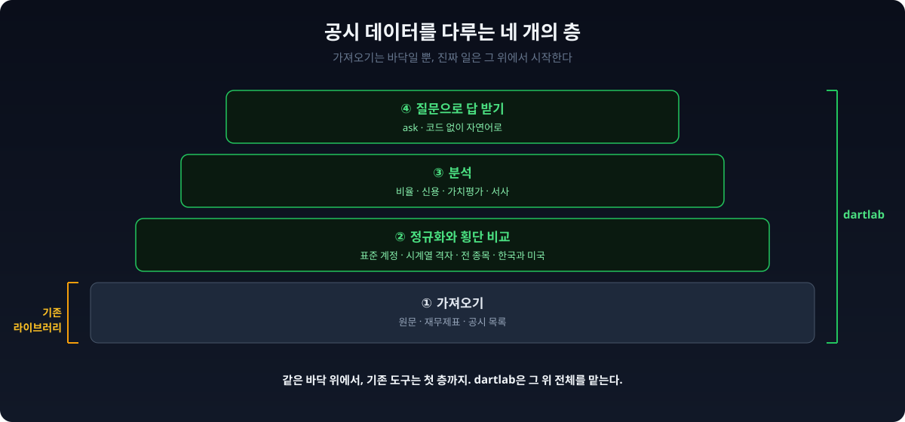
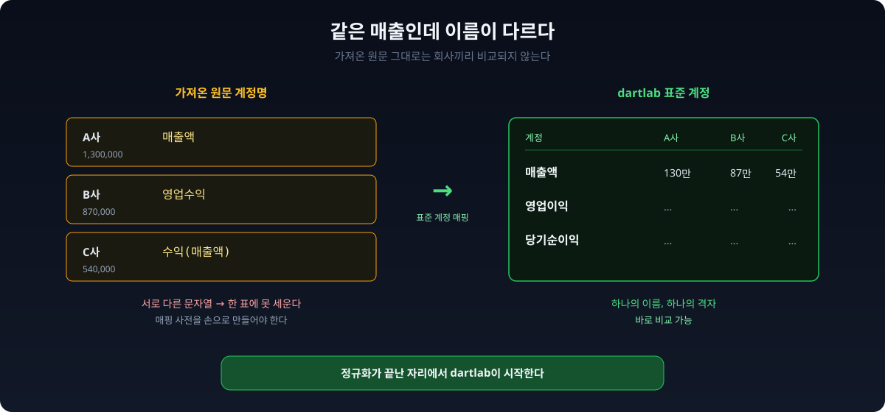
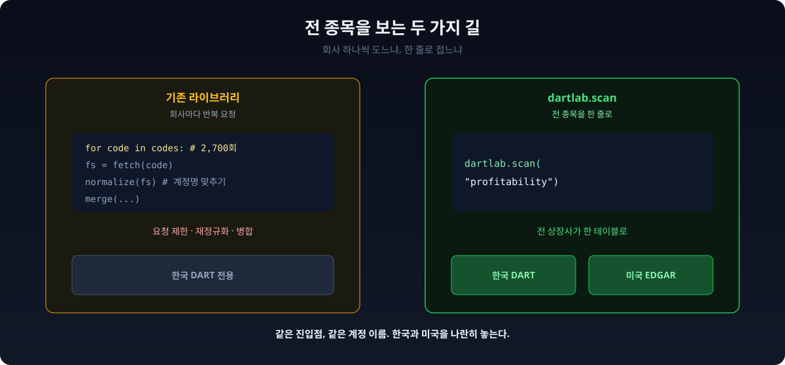
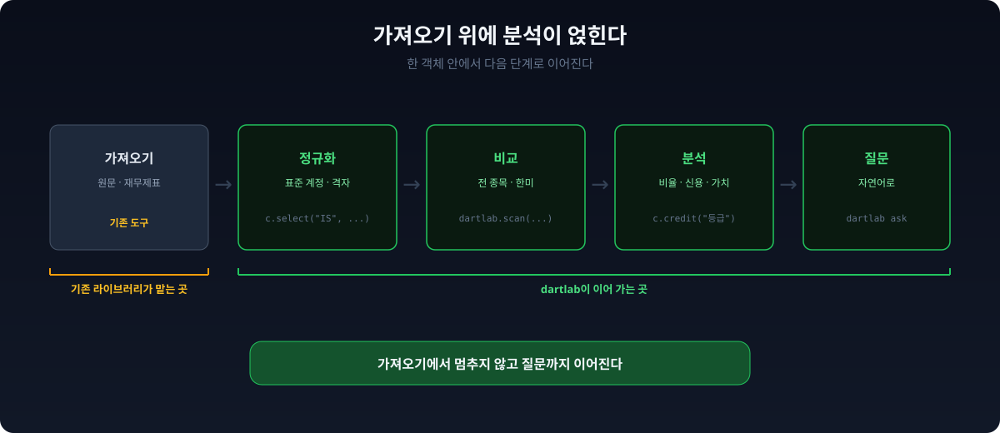
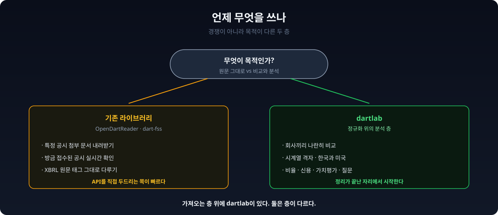

**삼성전자 매출액을 파이썬으로 꺼내는 방법은 이미 여러 개다.** [OpenDartReader](https://github.com/FinanceData/OpenDartReader)나 [dart-fss](https://github.com/josw123/dart-fss)로 한 줄이면 재무제표가 손에 들어온다. 잘 만든 라이브러리들이다. 그런데 그 매출액을 LG전자, SK하이닉스와 나란히 놓으려는 순간 막힌다. 회사마다 계정 이름이 다르기 때문이다. 데이터를 가져오는 일은 끝났는데, 진짜 일은 바로 거기서 시작한다.



## 기존 라이브러리는 이미 훌륭하다

한국 전자공시(DART) 데이터를 파이썬으로 다루는 대표 도구가 둘 있다.

```python
# OpenDartReader
import OpenDartReader

dart = OpenDartReader(api_key)        # API 키로 시작
dart.finstate("삼성전자", 2024)         # 재무제표를 바로 가져온다
dart.list("005930", start="2024-01-01")  # 공시 목록
```

```python
# dart-fss
import dart_fss as dart

dart.set_api_key(api_key=api_key)
corp = dart.get_corp_list().find_by_corp_name("삼성전자")[0]
fs = corp.extract_fs(bgn_de="20200101")  # BS, IS, CF 추출
```

둘 다 정부의 [Open DART API](https://opendart.fss.or.kr)를 깔끔하게 감싼다. 공시 목록, 재무제표, 원문 문서를 파이썬 객체로 받아 온다. 데이터를 "가져오는" 일에서는 손에 익으면 아주 빠르다.

세 가지 전제가 공통으로 따라온다. 하나, **API 키를 먼저 발급**받아야 한다. 둘, **한국 DART 전용**이라 미국 기업은 다른 도구가 필요하다. 셋, 이 도구들의 임무는 **가져오는 데까지**다. 가져온 다음 무엇을 할지는 사용자 몫으로 남는다.

## 문제는 가져온 다음이다

재무제표를 받아 오면 계정 이름이 회사마다 제각각이다. 어떤 회사는 `매출액`, 어떤 회사는 `영업수익`, 또 어떤 회사는 `수익(매출액)`으로 적어 낸다. XBRL 원문 태그를 그대로 받으면 이 셋은 서로 다른 문자열이다. 회사 세 곳의 매출을 한 표에 나란히 놓으려면, 먼저 "이 이름과 저 이름이 같은 뜻"이라는 매핑 사전을 손으로 만들어야 한다.

시계열도 마찬가지다. 어떤 회사는 분기 누적으로, 어떤 회사는 단일 분기로 숫자를 낸다. 5년치를 비교 가능한 격자로 펴려면 이 규칙 차이를 일일이 정리해야 한다. 데이터를 손에 넣은 뒤에도 진짜 일이 한참 남는 이유다.



## dartlab은 여기서 시작한다

dartlab은 이 정규화를 이미 끝낸 상태에서 출발한다.

```python
import dartlab

c = dartlab.Company("005930")          # 종목코드만, API 키 없음
c.select("IS", ["매출액"])              # 어느 회사든 같은 이름으로
```

회사가 삼성전자든 LG전자든, `매출액`은 언제나 `매출액`이다. 원문 태그가 무엇이었든 표준 계정으로 맞춰 둔 격자를 돌려주기 때문이다. 한글로 `매출액`을 넣든 영문으로 `sales`를 넣든 같은 행을 찾는다. 종목코드 하나로 회사 전체를 여는 방법은 [종목코드 하나면 끝난다](/blog/company-one-stock-code)에서 따로 다뤘다.

전제 세 가지도 여기서 뒤집힌다. dartlab의 분석 데이터는 미리 빌드된 데이터셋에서 직접 읽어 오므로 **DART API 키를 발급받을 필요가 없다**. 그리고 아래에서 보듯 한 줄로 전 종목을 훑고, 미국 기업까지 같은 문법으로 다룬다.

## 한 줄로 전 종목, 그리고 미국까지

기존 라이브러리로 "전 상장사의 매출액"을 뽑으려면 회사 하나씩 반복문을 돌며 요청을 보내야 한다. 요청 제한에 걸리고, 받아 온 결과의 계정명을 다시 맞추는 일이 또 기다린다. dartlab은 이 횡단을 한 줄로 접는다.

```python
dartlab.scan("profitability")   # 전 상장사 수익성을 표 하나로
dartlab.scan("growth")          # 성장성, 안정성, 거버넌스도 같은 방식
```

미리 빌드된 데이터를 읽으므로 전 종목(2,700여 개)이 순식간에 한 테이블로 펼쳐진다. 이 횡단이 왜 가능한지는 [2,700개 종목을 한 줄로](/blog/scan-market-finance)에 자세히 있다.

미국 기업도 문법이 같다. 종목코드 대신 티커를 넣으면 된다.

```python
c = dartlab.Company("AAPL")   # Apple, EDGAR 데이터
c.select("IS", ["매출액"])     # 한국 기업과 똑같은 호출
```

기존 DART 라이브러리는 이름 그대로 DART 전용이다. 미국 전자공시(EDGAR)를 보려면 또 다른 라이브러리를 배워야 한다. dartlab은 한국과 미국을 같은 진입점, 같은 계정 이름으로 다룬다.



## 가져오기 위에 분석이 얹힌다

가장 큰 차이는 층이 하나 더 있다는 점이다. 기존 라이브러리는 원문과 재무제표를 돌려주고 임무를 마친다. dartlab은 그 위에 분석 엔진을 얹는다.

```python
c.panel("ratios")                   # 비율 50여 개를 시계열로 자동 계산
c.analysis("financial", "수익성")     # 마진 분해, ROIC 트리
c.credit("등급")                     # 신용 스코어카드
```

비율을 직접 계산할 필요도, 신용도를 손으로 채점할 필요도 없다. 수익성 분해, 가치평가, 팩터, 서사 생성까지 같은 `Company` 객체에서 이어진다. 코드가 익숙하지 않으면 질문으로도 된다.

```bash
uv run dartlab ask "삼성전자 재무건전성 분석해줘"
```

질문을 받으면 dartlab이 뒤에서 `Company`를 열고, 재무제표와 비율과 주석을 꺼내 종합해 답한다. 가져오기, 정규화, 비교, 분석, 질문이 한 도구 안에서 이어진다.



## 그래서 언제 무엇을 쓰나

둘은 경쟁이 아니라 층이 다른 도구다.

**원문 그 자체가 목적이면** OpenDartReader나 dart-fss가 곧장 맞다. 특정 공시의 첨부 문서를 내려받거나, 방금 접수된 공시를 실시간으로 확인하거나, XBRL 원문 태그를 그대로 다뤄야 할 때는 API를 직접 두드리는 쪽이 가장 빠르고 정확하다.

**가져온 데이터로 무언가 하려면** dartlab이 그 다음을 맡는다. 회사끼리 비교하고, 시계열 격자로 펴고, 한국과 미국을 나란히 놓고, 비율과 신용과 가치평가까지 이어 갈 때다. 계정명을 맞추고 데이터를 정리하는 반복 작업이 이미 끝난 자리에서 시작한다.

가져오는 층 위에 정규화, 비교, 분석 층이 있다. 기존 라이브러리가 첫 층을 튼튼하게 받치고, dartlab은 그 위층을 맡는다. 설치는 [정말 쉬운 dartlab 사용법](/blog/dartlab-easy-start)에서 5분이면 끝난다.


