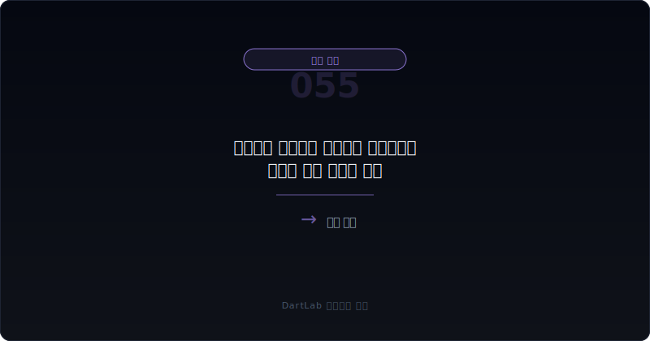
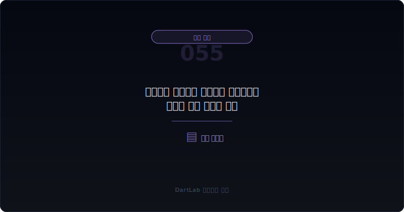
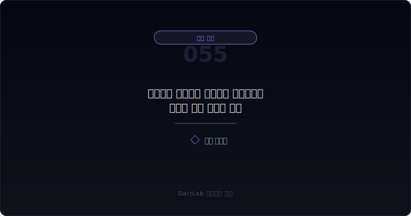
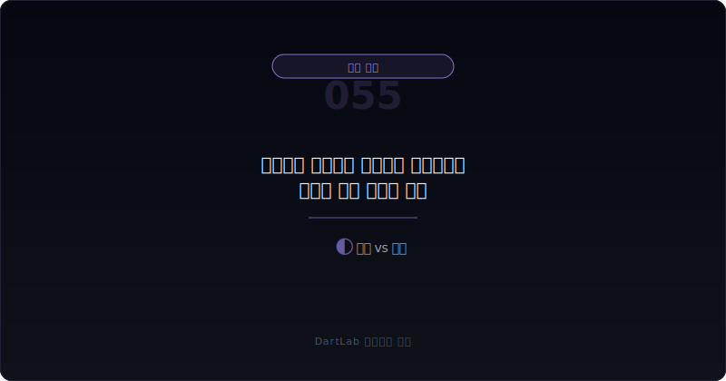
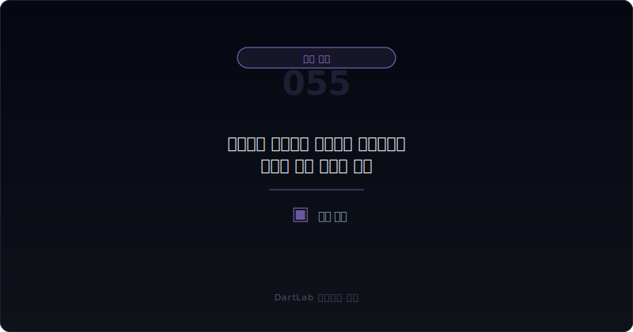

# 매출채권 팩토링과 유동화는 현금흐름을 어떻게 좋게 보이게 하나

영업현금흐름이 갑자기 좋아지면 많은 사람이 안심한다. 본업에서 현금이 잘 돌기 시작했나 보다 하고 받아들이기 쉽다. 그런데 실전에서는 한 가지를 더 확인해야 한다. `그 현금이 고객이 돈을 잘 갚아서 들어온 것인지, 아니면 매출채권을 넘겨서 앞당겨 받은 것인지`다. 이 차이를 놓치면 현금흐름을 실제보다 더 건강하게 읽기 쉽다.

매출채권 팩토링과 유동화는 무조건 나쁜 구조가 아니다. 회수 기간이 긴 업종에서는 운전자본 부담을 줄이는 정상적인 재무 운영일 수도 있다. 문제는 이 구조가 반복될수록 `회수 개선`과 `자금조달`의 경계가 흐려질 수 있다는 점이다. 특히 소구권이 남아 있거나, 수수료 부담이 크거나, 분기 말에 현금만 예쁘게 보이게 만드는 용도로 쓰이면 영업현금흐름 headline은 좋아도 본업 체력 해석은 달라진다.

이 글은 매출채권 팩토링과 유동화를 `현금흐름 변화 확인 -> 양도 구조 확인 -> 소구권·수수료 확인 -> 회수 개선인지 자금조달인지 구분 -> 다음 분기 반복성 확인` 순서로 읽는 방법을 정리한다. 기본 토대는 [매출채권과 대손충당금 읽는 법](/blog/receivables-and-allowance), 현금 해석은 [영업현금흐름이 순이익을 부정할 때](/blog/operating-cash-flow-vs-net-income), 성장 착시는 [매출은 느는데 왜 위험할 수 있나](/blog/why-rising-sales-can-still-be-risky), 비용 압박은 [판관비가 매출보다 빨리 불어날 때 무엇을 먼저 봐야 하나](/blog/sga-growth-vs-sales)와 같이 보면 더 선명하다.

---

## 왜 영업현금흐름 개선으로 오해하기 쉬운가

영업현금흐름은 숫자 자체가 강하다. 순이익보다 더 믿을 만한 숫자로 받아들여지는 경우가 많다. 그래서 영업현금흐름이 좋아진 분기에는 "회수 구조가 좋아졌나 보다"라는 해석이 자동으로 따라붙는다. 하지만 매출채권 팩토링과 유동화가 들어가면 이야기가 달라질 수 있다. 고객에게서 직접 회수한 현금과, 채권을 금융기관이나 특수목적기구에 넘겨 앞당겨 받은 현금은 같은 현금처럼 보여도 성격이 다르기 때문이다.

이 차이는 특히 운전자본 해석에서 중요하다. 본업이 강해져서 회수 기간이 짧아진 경우라면 다음 분기에도 구조가 남을 가능성이 높다. 반대로 채권 양도로 영업현금흐름이 좋아 보이는 경우라면, 다음 분기에도 같은 거래를 반복해야 비슷한 숫자가 나올 수 있다. 즉 `현금이 들어왔다`는 사실보다 `왜 그렇게 들어왔는가`가 중요하다.

또 하나 놓치기 쉬운 점은 비용이다. 팩토링과 유동화는 대개 수수료와 할인 비용을 동반한다. 따라서 현금 유입은 늘어도 경제적 수익성이 좋아졌다고 단정할 수 없다. 이때는 [영업외손익이 본업을 가릴 때 무엇을 분리해서 봐야 하나](/blog/non-operating-income-vs-core-earnings)처럼 `좋아 보이는 최종 숫자`를 한 번 더 분리해서 보는 습관이 필요하다.

실무적으로는 표현도 주의해서 봐야 한다. 회사는 이를 `매출채권 양도`, `유동화`, `회수 구조 개선`, `운전자본 효율화`처럼 다르게 적을 수 있다. 말은 달라도 투자자가 확인해야 할 질문은 같다. 정말 회수가 좋아진 것인지, 미래 현금을 앞당겨 온 것인지, 그리고 그 대가로 어떤 수수료와 잔존 위험을 남겼는지다. 그래서 문구가 부드럽다고 안심하기보다, 숫자와 조건을 같은 줄에 놓고 읽는 편이 훨씬 안전하다.

---

## 구조가 작동하는 순서

| 먼저 볼 항목 | 왜 중요한가 |
| --- | --- |
| 영업현금흐름 변화 | 숫자가 언제 얼마나 좋아졌는지 본다 |
| 매출채권 잔액과 회전 | 실제 회수 개선인지 본다 |
| 양도·유동화 구조 | 자산 매각인지 사실상 차입인지 본다 |
| 소구권과 위험 이전 | 위험이 정말 넘어갔는지 본다 |
| 수수료·할인 비용 | 현금 개선의 대가가 무엇인지 본다 |
| 다음 분기 반복 여부 | 구조적 개선인지 일시적 보정인지 본다 |

실전에서는 먼저 영업현금흐름과 매출채권 잔액을 같은 줄에 놓는 편이 좋다. 영업현금흐름이 좋아졌는데 매출채권 잔액과 회전 패턴이 자연스럽지 않으면, 양도나 유동화 여부를 의심해 볼 필요가 있다. 그다음에는 주석과 자금 관련 설명에서 채권 양도 구조를 찾는다. 이때 핵심은 `위험이 정말 넘어갔는가`다. 위험이 남아 있으면 회계상 표현과 별개로 경제적으로는 빚에 가까운 구조로 읽는 편이 맞을 수 있다.

또한 팩토링은 단기적인 숨통을 틔워 줄 수 있지만, 반복되면 본업이 현금을 스스로 만들지 못한다는 신호일 수도 있다. 그래서 [선수금·계약부채는 좋은 신호인가 위험 신호인가](/blog/operating-cash-flow-vs-net-income)와 비교해 `미리 받은 현금`과 `넘겨서 당겨온 현금`을 구분해 보는 편이 유용하다. 전자는 고객 관계와 계약 구조 문제에 가깝고, 후자는 회수와 자금조달 구조 문제에 더 가깝다.

---

## 어디에서 왜곡이 생기나

가장 실용적인 질문은 이것이다. `이 현금 증가는 고객 회수 개선인가, 금융기법을 통한 현금 선반영인가, 분기 말 숫자 보정인가`.

고객 회수 개선이라면 매출채권 회전일수와 대손 부담, 영업현금흐름이 함께 좋아지는 흐름이 보일 가능성이 크다. 구조적 자금조달이라면 채권 양도, 유동화, 매각, 담보 제공이 반복적으로 등장할 수 있다. 분기 말 숫자 보정이라면 특정 분기마다 현금만 예뻐지고 다음 분기에 다시 원위치되는 패턴이 나타나기 쉽다.

이 분기에서 특히 중요한 것은 소구권과 잔존 위험이다. 겉으로는 채권을 넘겼지만, 부실이 나면 회사가 다시 부담해야 하거나 추가 담보를 제공해야 한다면 해석이 달라진다. 이 경우 현금 유입은 있지만 경제적 위험은 여전히 회사 안에 남아 있을 수 있다. 그래서 팩토링은 `매출채권 감소`만 보고 끝내지 않고 `위험 이전이 얼마나 실제적인가`를 같이 봐야 한다.

---

## 왜곡을 걸러내는 숫자 조합

| 관찰 포인트 | 상대적으로 건강한 경우 | 더 조심해야 하는 경우 |
| --- | --- | --- |
| 회수 구조 | 채권 회전 개선과 함께 읽힌다 | 현금만 좋아지고 회수 체력은 안 보인다 |
| 양도 조건 | 위험 이전과 비용 구조가 비교적 분명하다 | 소구권과 추가 부담이 복잡하다 |
| 반복성 | 특정 필요에 제한적으로 쓴다 | 매 분기 비슷한 방식으로 반복한다 |
| 비용 | 수수료와 할인 부담이 감당 가능해 보인다 | 현금은 좋아도 비용 부담이 무겁다 |
| 후속 숫자 | 다음 분기에도 본업 현금이 버틴다 | 다음 분기마다 다시 비슷한 보정이 필요하다 |

상대적으로 건강한 경우는 팩토링과 유동화를 숨기지 않는다. 왜 쓰는지, 얼마나 쓰는지, 비용이 얼마인지, 위험이 얼마나 남는지 설명이 비교적 읽힌다. 반대로 더 조심해야 하는 경우는 영업현금흐름 개선만 강조하고 구조와 대가, 반복성을 흐리게 적는다.

특히 [환율 손익과 파생상품은 본업을 어떻게 왜곡하나](/blog/foreign-exchange-gains-and-derivatives)나 [이연법인세와 법인세 비용은 순이익을 어떻게 왜곡하나](/blog/deferred-tax-and-tax-expense-distortion) 같은 다른 보정 레이어까지 함께 움직이면, 숫자는 더 예뻐 보이는데 본업 체력은 생각보다 약할 수 있다. 이럴수록 현금의 출처를 더 단순하게 적어 두는 편이 좋다.

---

## 양도인데 왜 사실상 차입처럼 읽어야 할 수 있나

팩토링과 유동화가 항상 자산 매각처럼 읽히는 것은 아니다. 위험이 충분히 이전되지 않았거나, 부실이 나면 회사가 다시 책임져야 하거나, 담보와 보증 구조가 강하게 붙어 있으면 경제적으로는 차입과 비슷하게 읽어야 할 수 있다. 이때는 회계상 분류 하나보다 회사가 실제로 어떤 의무를 계속 지는지가 더 중요하다.

그래서 팩토링을 볼 때는 `채권을 넘겼는가`보다 `채권과 함께 위험도 넘겼는가`를 먼저 물어야 한다. 이 질문이 붙으면 영업현금흐름의 개선을 훨씬 덜 단순하게 읽게 된다. 결국 현금이 들어온 것과 현금 창출력이 좋아진 것은 다른 이야기일 수 있다.

특히 회사가 채권을 넘긴 뒤에도 회수 부실에 일부 책임을 지거나 추가 담보를 약속했다면, 투자자는 그 구조를 `완전한 매각`으로 보기 어렵다. 이럴 때는 영업현금흐름 개선을 그대로 칭찬하기보다, 미래 분기에 다시 어떤 부담이 돌아올지까지 같이 적어 두는 편이 맞다.

---

## 왜곡이 안 보일 때 의심할 것

### 1. 영업현금흐름이 좋아지면 회수 구조가 개선됐다고 본다

채권 양도와 유동화가 끼어 있으면 다를 수 있다.

### 2. 채권을 넘겼으니 위험도 다 사라졌다고 본다

소구권과 보증 구조가 남아 있을 수 있다.

### 3. 현금이 들어왔으니 비용은 무시해도 된다고 본다

수수료와 할인 비용이 경제성을 바꾼다.

### 4. 분기 한 번만 보면 충분하다고 본다

반복 패턴을 봐야 본업 체력과 숫자 보정이 구분된다.

---

## 놓치기 쉬운 예외

| 이번에 본 것 | 다음에 다시 볼 것 |
| --- | --- |
| 영업현금흐름 개선 | 다음 분기에도 유지되는가 |
| 채권 양도 구조 | 규모와 조건이 더 커지는가 |
| 매출채권 회전 | 실제 회수 체력이 좋아지는가 |
| 소구권·보증 | 위험 부담이 남아 있는가 |
| 수수료 부담 | 비용이 수익성을 갉아먹는가 |
| 다른 보정 레이어 | 세금, 영업외손익, 차입이 같이 움직이는가 |

팩토링과 유동화는 한 번 보고 끝내면 거의 항상 얕게 읽힌다. 다음 분기에 같은 방식이 반복되는지, 회수 구조가 실제로 좋아지는지, 수수료와 위험 부담이 커지는지를 같이 추적해야 의미가 잡힌다. 그래서 가능하면 `영업현금흐름`, `매출채권`, `채권 양도 규모`, `수수료`, `소구권` 다섯 줄을 적어 두는 편이 좋다.

이 다섯 줄만 있어도 현금이 본업에서 만들어졌는지, 금융기법으로 당겨졌는지 구분이 훨씬 쉬워진다. 그리고 그 차이가 투자 해석에서는 꽤 크다.

---

## 빠른 점검 체크리스트

- 영업현금흐름 개선과 매출채권 변화를 같이 봤는가
- 팩토링·유동화 구조가 있는지 확인했는가
- 소구권과 위험 이전 여부를 읽었는가
- 수수료와 할인 비용을 적어봤는가
- 이번 현금 개선이 반복 가능한지 생각해 봤는가
- 다음 분기에도 같은 거래가 필요한지 추적할 계획이 있는가

## 자주 묻는 질문

### 팩토링과 유동화는 무조건 나쁜가

아니다. 다만 회수 개선과 자금조달을 구분해서 읽어야 한다.

### 무엇이 가장 먼저 중요한가

현금이 실제 고객 회수에서 왔는지, 채권 양도로 앞당겨졌는지 구분하는 것이다.

### 무엇을 같이 보면 좋은가

매출채권 회전, 영업현금흐름, 소구권, 수수료, 다음 분기 반복성을 같이 보면 좋다.

### 가장 먼저 적어볼 한 줄은 무엇인가

이번 현금 개선은 본업 회수력의 결과인가, 금융기법의 결과인가다.

## 구조를 더 깊이 이해하는 글

- [매출채권과 대손충당금 읽는 법](/blog/receivables-and-allowance)
- [영업현금흐름이 순이익을 부정할 때](/blog/operating-cash-flow-vs-net-income)
- [선수금·계약부채는 좋은 신호인가 위험 신호인가](/blog/operating-cash-flow-vs-net-income)
- [매출은 느는데 왜 위험할 수 있나](/blog/why-rising-sales-can-still-be-risky)
- [판관비가 매출보다 빨리 불어날 때 무엇을 먼저 봐야 하나](/blog/sga-growth-vs-sales)
- [영업외손익이 본업을 가릴 때 무엇을 분리해서 봐야 하나](/blog/non-operating-income-vs-core-earnings)

## 참고 자료

- [IAS 7 Statement of Cash Flows](https://www.ifrs.org/issued-standards/list-of-standards/ias-7-statement-of-cash-flows/)
- [IFRS 7 Financial Instruments: Disclosures](https://www.ifrs.org/issued-standards/list-of-standards/ifrs-7-financial-instruments-disclosures/)
- [IFRS 9 Financial Instruments](https://www.ifrs.org/issued-standards/list-of-standards/ifrs-9-financial-instruments/)
- [DART 소개 - 보고서정보](https://dart.fss.or.kr/introduction/content2.do)
- [OpenDART 주석 일괄다운로드](https://opendart.fss.or.kr/disclosureinfo/fnltt/xbrlnote/main.do)
- [OpenDART 단일회사 주요계정 조회](https://opendart.fss.or.kr/disclosureinfo/fnltt/singlacnt/main.do)

## 핵심 구조 요약

매출채권 팩토링과 유동화는 영업현금흐름을 좋아 보이게 만들 수 있지만, 그 현금이 본업 회수력에서 온 것인지 금융기법에서 온 것인지는 다를 수 있다. 그래서 채권 양도 구조, 소구권, 수수료, 반복성을 같이 봐야 해석이 정확해진다.

핵심은 `현금이 들어왔는가`보다 `왜 그렇게 들어왔는가`를 먼저 묻는 것이다. 이 질문을 붙이면 영업현금흐름 headline에 훨씬 덜 속게 된다.
