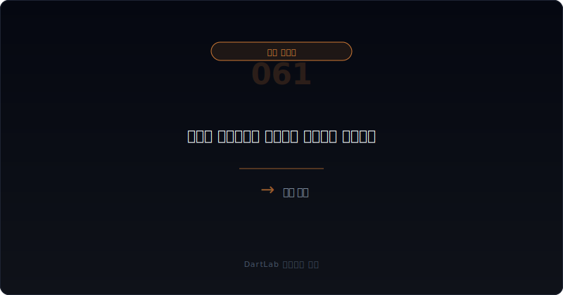
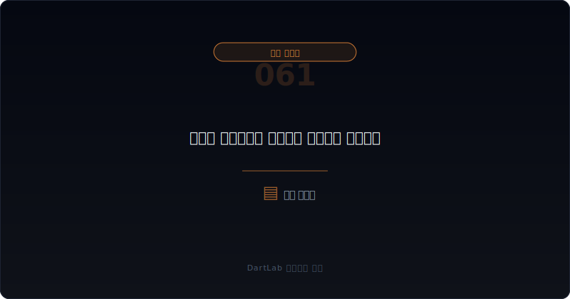
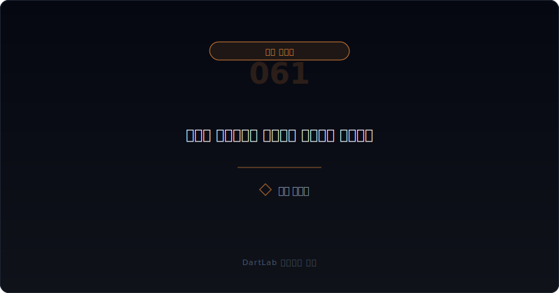
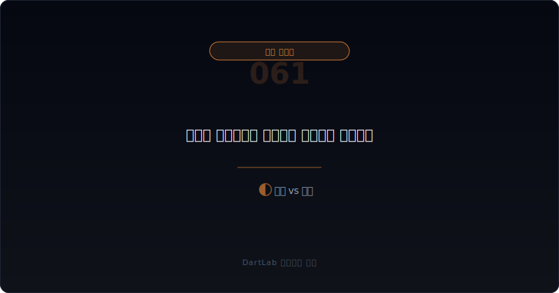
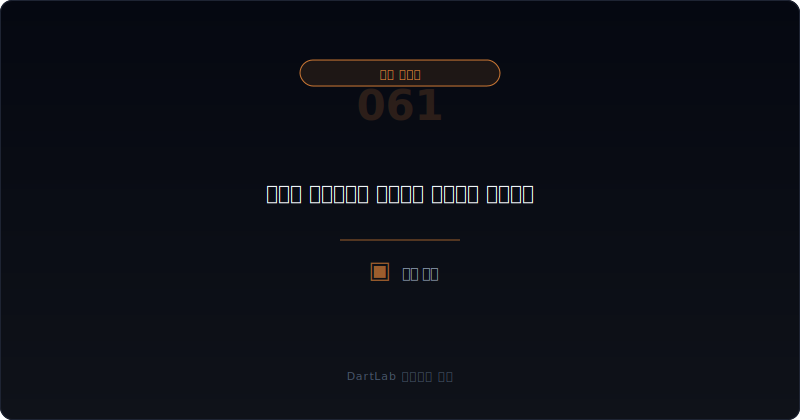

# 메자닌 보호조항과 리픽싱은 누구에게 유리한가

메자닌 공시는 발행 금액과 표면 금리만 보면 거의 항상 절반만 읽은 것이다. 실제로는 그 안에 붙어 있는 보호조항과 가격 조정 규칙이 훨씬 더 중요할 때가 많다. 특히 리픽싱, 최저조정가액, 상환청구권, 조기상환, 동의권 같은 조항은 같은 자금조달이라도 `누가 더 많은 보호를 받고 누가 더 큰 희석과 부담을 떠안는지`를 바꿔 놓는다.

그래서 메자닌은 채권이면서도 사실상 권리 구조 공시에 가깝다. 표면상 회사가 자금을 조달하는 이야기처럼 보여도, 실제로는 투자자 보호장치와 기존 주주 불리함이 어디까지 열려 있는지를 읽는 문서일 수 있다. 이걸 놓치면 "어차피 나중에 보통주로 전환되면 그때 가서 보자"는 식으로 늦게 반응하게 된다.

이 글은 메자닌 보호조항과 리픽싱을 `증권 종류 확인 -> 가격 조정 규칙 확인 -> 상환·매도청구·동의권 확인 -> 희석 경로와 하단(floor) 확인 -> 후속 조정과 현실화 추적` 순서로 읽는 방법을 정리한다. 기본 토대는 [전환사채와 BW 공시 읽는 법](/blog/rights-offering-disclosure), 권리 구조는 [우선주·RCPS·상환전환우선주는 누구에게 유리한가](/blog/preferred-stock-and-rcps-disclosure), 주식 이동 문제는 [교환사채와 EB 공시는 누구에게 유리한가](/blog/exchangeable-bond-disclosure)와 같이 보면 좋다.

---

## 왜 발행가보다 조정 규칙이 더 중요한가

메자닌 발행 공시를 처음 볼 때 많은 사람은 발행 금액, 만기, 표면 금리부터 본다. 물론 그것도 중요하다. 하지만 실제 희석과 이해관계는 종종 `조건이 나빠질 때 어떤 보호장치가 누구에게 열리는가`에서 결정된다. 특히 주가가 내려갔을 때 전환가액이 얼마나 내려갈 수 있는지, 그 하단이 어디인지, 상환청구권이 언제 강해지는지가 핵심이다.

리픽싱은 대표적인 예다. 회사 입장에서는 초기 조건이 그럴듯해 보여도, 주가가 약해지면 투자자에게 더 유리한 가격으로 조정될 수 있다. 이때 기존 주주는 더 큰 희석을 감수할 수 있고, 회사는 추가 조달 압박을 받을 수 있다. 그래서 메자닌은 발행 당시 조건보다 `악화 시 어떻게 다시 쓰이는가`를 봐야 한다.

또 하나 중요한 것은 보호조항의 묶음이다. 리픽싱만 있는지, 상환청구권까지 붙는지, 회사가 조기상환을 할 수 있는지, 특정 사안에서 투자자 동의가 필요한지가 같이 작동하면 구조는 훨씬 복잡해진다. 이럴수록 액수보다 계약의 방향을 먼저 읽는 편이 맞다.

---

## 어떤 조건이 협상력을 결정하나

| 먼저 볼 항목 | 왜 중요한가 |
| --- | --- |
| 증권 종류 | CB, BW, RCPS, 혼합형인지 본다 |
| 리픽싱 조건 | 가격 조정이 언제 얼마나 가능한지 본다 |
| 최저조정가액 | 희석 하단이 어디까지 열려 있는지 본다 |
| 상환·매도청구권 | 투자자가 언제 회수 압박을 걸 수 있는지 본다 |
| 동의권·보호조항 | 누가 중요한 결정을 통제하는지 본다 |
| 후속 조정 공시 | 실제 조정과 희석 현실화가 일어나는지 본다 |

실전에서는 먼저 증권 종류를 확인하고, 바로 가격 조정 규칙으로 내려가는 편이 좋다. 같은 메자닌이라도 CB와 BW, RCPS는 보호조항 구조가 다르고, 희석 경로도 다르기 때문이다. 그다음에는 최저조정가액과 상환청구권을 본다. 투자자가 하방 보호를 강하게 받는데 회사는 조기상환 압박까지 받는 구조라면, 자금조달 headline보다 계약 불균형을 먼저 의심해야 한다.

여기서 중요한 것은 보호조항을 한 줄씩 따로 읽지 않는 것이다. 리픽싱, put option, call option, 동의권은 묶여서 작동한다. 그래서 [유상증자 공시 읽는 법](/blog/rights-offering-disclosure), [감자와 주식병합 공시는 무엇을 먼저 봐야 하나](/blog/treasury-stock-third-party-allotment-and-major-shareholder-change), [자기주식·제3자배정·최대주주 변경은 누구에게 유리한가](/blog/treasury-stock-third-party-allotment-and-major-shareholder-change)와 같이 전후 이벤트까지 붙여 보면 구조가 훨씬 선명해진다.

---

## 발행자 시각 vs 투자자 시각

가장 실용적인 질문은 이것이다. `이번 메자닌은 제한적 보호 구조인가, 투자자 우위 구조인가, 기존 주주 불리함이 큰 구조인가`.

제한적 보호 구조라면 가격 조정 폭이 제한적이고, 최저조정가액이 깊지 않으며, 상환청구권과 동의권이 과도하지 않을 가능성이 크다. 투자자 우위 구조라면 하방 보호와 회수 권리가 강하게 열려 있다. 기존 주주 불리 확대 구조라면 리픽싱과 희석, 후속 조달, 지배력 변화가 연쇄적으로 이어질 수 있다.

이 구분이 중요한 이유는 메자닌이 발행 시점보다 악화 시점에 더 많은 정보를 드러내기 때문이다. 주가가 약해지고 조달 환경이 나빠질수록, 보호조항은 계약서의 작은 문장이 아니라 현실의 힘 관계로 바뀐다. 그래서 메자닌은 `좋을 때 조건`보다 `나쁠 때 누구를 먼저 보호하는가`를 읽는 공시다.

---

## 조건이 바뀔 때 무엇이 움직이나

| 관찰 포인트 | 상대적으로 건강한 경우 | 더 조심해야 하는 경우 |
| --- | --- | --- |
| 리픽싱 | 조정 범위와 조건이 비교적 제한적이다 | 조정 폭이 크고 하단이 깊다 |
| 상환권 | 회수 조건이 읽히고 과도하지 않다 | 투자자 회수 압박이 빠르게 강해진다 |
| 동의권 | 필요한 범위에 제한된다 | 경영 의사결정까지 넓게 통제한다 |
| 후속 희석 | 희석 경로가 예측 가능하다 | 조정이 반복될수록 희석이 커진다 |
| 설명 | 투자자·회사·기존 주주 영향이 비교적 읽힌다 | 누구에게 유리한지 일부러 흐리게 적힌다 |

상대적으로 건강한 경우는 회사가 조달 필요와 조건의 대가를 비교적 분명하게 설명한다. 반대로 더 조심해야 하는 경우는 겉으로는 낮은 금리와 단순 조달처럼 보이는데, 실제로는 가격 조정과 상환권, 동의권이 강하게 열려 있다. 이런 구조는 시간이 지날수록 기존 주주에게 더 불리해질 수 있다.

특히 [최대주주 주식담보와 반대매매 위험은 어떻게 읽어야 하나](/blog/major-shareholder-and-related-parties)와 겹치면 해석은 더 무거워진다. 자금조달 계약의 보호조항과 지배력 압박이 동시에 커지면, 주가 하락이 곧 계약 조건 악화와 희석 확대로 이어질 수 있기 때문이다.

---

## 왜 리픽싱은 희석의 시계를 더 빠르게 만들 수 있나

리픽싱은 단순히 가격을 다시 정하는 장치가 아니다. 주가가 약할수록 더 많은 물량이 필요해지는 구조를 열어 줄 수 있다. 그래서 기존 주주 입장에서는 주가 하락이 곧 잠재 희석 증가로 번지는 구조가 될 수 있다. 이때 시장은 미래 희석을 미리 가격에 반영할 수 있고, 그 결과 주가가 더 약해지는 악순환이 생길 수 있다.

게다가 리픽싱은 후속 조달과도 잘 붙는다. 주가가 약해진 상태에서 또 다른 메자닌, 유상증자, 구조 재편 이벤트가 이어지면, 원래 한 건이었던 조달 공시는 전체 자본정책의 경고 신호가 될 수 있다. 그래서 리픽싱은 수학 문제가 아니라 `희석의 시간표`로 읽는 편이 더 실전적이다.

결국 투자자가 봐야 할 것은 단순히 조정 후 전환가액이 아니다. 그 조정이 몇 번 반복될 수 있는지, 하단이 어디인지, 그 사이 회사가 시간을 벌 수 있는지까지 봐야 한다. 이 질문이 붙으면 메자닌 공시를 훨씬 덜 단순하게 읽게 된다.

여기에 동의권과 상환권이 강하게 붙어 있으면 해석은 더 무거워진다. 가격은 낮아지고 희석은 커지는데, 동시에 투자자가 중요한 의사결정과 회수 시점까지 쥐고 있다면 회사와 기존 주주의 선택지는 더 빠르게 줄어들 수 있기 때문이다. 그래서 메자닌은 한 줄 조건보다 `권리의 묶음이 어느 방향으로 기울어 있는가`를 먼저 읽어야 한다.

실전에서는 주가가 약해진 뒤 공시가 훨씬 더 중요해진다. 발행 당시엔 무난해 보였던 조항도 실제 조정이 시작되면 전혀 다르게 보일 수 있다. 그래서 투자자는 발행 공시를 읽는 순간부터 `나중에 어떤 공시가 다시 나올지`를 예상하고 체크포인트를 미리 적어 두는 편이 유리하다.

이 습관이 있으면 메자닌 공시를 뉴스가 아니라 계약의 진행표처럼 읽게 된다.

그리고 그 진행표의 끝에는 종종 희석과 권리 이동이 같이 적혀 있다.

그래서 조건표를 끝까지 읽는 습관이 중요하다.

숫자보다 조건이 더 비싼 경우가 많다.

메자닌은 계약서가 본문이다.

---

## 조건 해석에서 자주 놓치는 부분

### 1. 발행 금액과 금리만 본다

실제 불균형은 보호조항과 가격 조정 규칙에 있을 수 있다.

### 2. 리픽싱만 보고 상환권을 안 본다

희석과 회수 압박은 같이 작동할 수 있다.

### 3. 동의권을 형식 조항으로 본다

의사결정 통제권이 넓으면 구조 해석이 달라진다.

### 4. 발행 시점만 보고 끝낸다

후속 조정 공시와 현실화가 더 중요할 때가 많다.

---

## 후속 이벤트에서 다시 확인할 것

| 이번에 본 것 | 다음에 다시 볼 것 |
| --- | --- |
| 리픽싱 규칙 | 실제 조정이 발생하는가 |
| 최저조정가액 | 하단에 더 가까워지는가 |
| 상환청구권 | 회수 압박 시점이 다가오는가 |
| 동의권 | 회사 결정이 더 제약받는가 |
| 후속 조달 | 유사 메자닌이나 증자가 겹치는가 |
| 희석 현실화 | 전환, 행사, 상환이 실제로 진행되는가 |

메자닌 보호조항은 발행 공시 한 번으로 끝나지 않는다. 후속 조정 공시, 전환·행사 공시, 상환 조건 변경, 추가 조달 이벤트까지 이어서 봐야 구조가 드러난다. 그래서 가능하면 `리픽싱`, `최저조정가액`, `상환권`, `동의권`, `후속 조달` 다섯 줄을 적어 두는 편이 좋다.

이 다섯 줄만 있어도 메자닌이 단순 자금조달인지, 계약 조건이 점점 기존 주주에게 불리해지는 구조인지 구분이 쉬워진다.

---

## 실전 체크리스트

- 증권 종류를 먼저 구분했는가
- 리픽싱 조건과 최저조정가액을 확인했는가
- 상환청구권과 조기상환 조건을 읽었는가
- 동의권이나 기타 보호조항이 넓은지 봤는가
- 후속 조정 공시를 추적할 계획이 있는가
- 이 구조가 기존 주주에게 어떤 희석을 남기는지 적어봤는가

## FAQ

### 메자닌은 무조건 나쁜가

아니다. 다만 누가 더 강한 보호를 받는지 분리해서 읽어야 한다.

### 무엇이 가장 먼저 중요한가

리픽싱과 상환권, 최저조정가액 같은 보호조항이다.

### 무엇을 같이 보면 좋은가

CB/BW, RCPS, EB, 유상증자, 감자 같은 전후 이벤트를 같이 보면 좋다.

### 가장 먼저 적어볼 한 줄은 무엇인가

이 계약은 회사를 보호하는가, 투자자를 보호하는가, 기존 주주를 희생시키는가다.

## 조건 분석에 참고할 글

- [전환사채와 BW 공시 읽는 법](/blog/rights-offering-disclosure)
- [우선주·RCPS·상환전환우선주는 누구에게 유리한가](/blog/preferred-stock-and-rcps-disclosure)
- [교환사채와 EB 공시는 누구에게 유리한가](/blog/exchangeable-bond-disclosure)
- [유상증자 공시 읽는 법](/blog/rights-offering-disclosure)
- [감자와 주식병합 공시는 무엇을 먼저 봐야 하나](/blog/treasury-stock-third-party-allotment-and-major-shareholder-change)
- [최대주주 주식담보와 반대매매 위험은 어떻게 읽어야 하나](/blog/major-shareholder-and-related-parties)

## 관련 공시 출처

- [OpenDART 전환사채권 발행결정 개발가이드](https://opendart.fss.or.kr/guide/detail.do?apiGrpCd=DS005&apiId=2020033)
- [OpenDART 신주인수권부사채권 발행결정 개발가이드](https://opendart.fss.or.kr/guide/detail.do?apiGrpCd=DS005&apiId=2020034)
- [OpenDART 증권신고서 개발가이드](https://opendart.fss.or.kr/guide/main.do?apiGrpCd=DS006)
- [DART 소개 - 보고서정보](https://dart.fss.or.kr/introduction/content2.do)
- [2025년 주요 위반 사례 3](https://dart.fss.or.kr/info/downloadKeyCase.do?filename=2025%EB%85%84+%EC%A3%BC%EC%9A%94%EC%9C%84%EB%B0%98%EC%82%AC%EB%A1%80_3.pdf&seqno=41)

## 조건별 핵심 요약

메자닌 보호조항과 리픽싱은 발행가와 금리보다 더 강하게 이해관계를 바꿀 수 있다. 그래서 리픽싱, 최저조정가액, 상환권, 동의권, 후속 조정 공시를 같이 봐야 누가 보호받고 누가 희석을 감수하는지 드러난다.

핵심은 `얼마를 조달했는가`보다 `악화될 때 누가 먼저 보호받는가`를 먼저 묻는 것이다. 이 질문을 붙이면 메자닌 공시가 훨씬 덜 추상적으로 읽힌다.
