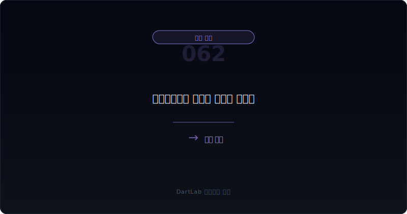
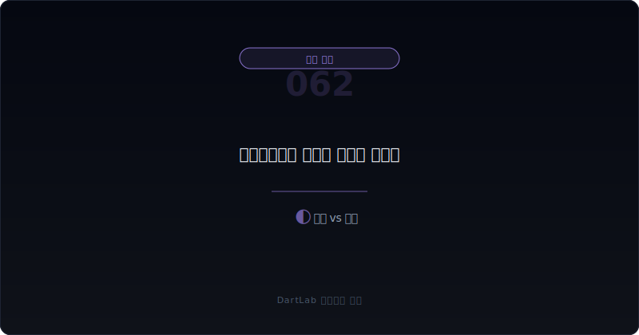

# 기타포괄손익 누적은 무엇을 가리나

순이익이 괜찮아 보이는데도 자본이 불안해 보이거나, 반대로 순이익은 흔들리는데 자본 누적 항목이 이상하게 커지는 경우가 있다. 이럴 때 자주 놓치는 층이 기타포괄손익, 그리고 그 누적 잔액이다. 많은 투자자가 기타포괄손익을 `순이익 밖 숫자` 정도로 넘기지만, 실제로는 미래 손익, 자본 변동, 환율, 평가손익, 연금 재측정 같은 중요한 신호가 숨어 있을 수 있다.

특히 기타포괄손익은 손익계산서 headline에는 약하게 보이지만, 자본과 미래 손익의 해석을 바꿀 수 있다. 어떤 항목은 나중에 손익으로 재순환될 수 있고, 어떤 항목은 자본 안에 오래 남는다. 그래서 순이익만 보면 `지금 좋아 보이는 숫자`를 볼 수는 있어도, `이미 쌓여 있는 변동성`을 놓치기 쉽다.

이 글은 기타포괄손익 누적을 `어떤 OCI 항목인지 확인 -> 재순환되는지 확인 -> 현금과 연결되는지 확인 -> 자본에서 얼마나 커졌는지 확인 -> 되돌림과 후속 손익 가능성 확인` 순서로 읽는 방법을 정리한다. 기본 토대는 [영업외손익이 본업을 가릴 때 무엇을 분리해서 봐야 하나](/blog/non-operating-income-vs-core-earnings), 통화·평가 레이어는 [환율 손익과 파생상품은 본업을 어떻게 왜곡하나](/blog/foreign-exchange-gains-and-derivatives), 세금 층은 [이연법인세와 법인세 비용은 순이익을 어떻게 왜곡하나](/blog/deferred-tax-and-tax-expense-distortion)와 같이 보면 좋다.

---

## 왜 순이익만 보면 자주 놓치나

순이익은 headline이고 기타포괄손익은 주변부처럼 보인다. 그래서 많은 투자자는 순이익과 영업이익만 보고 결론을 내린다. 하지만 기타포괄손익은 그 회사가 이미 안고 있는 평가 변동, 환산 차이, 헤지 효과, 연금 재측정 같은 요소를 자본에 쌓아 둘 수 있다. 이 누적이 커지면, 손익은 멀쩡해 보여도 자본의 질과 미래 손익의 경로는 달라질 수 있다.

또한 모든 OCI가 같은 것도 아니다. 어떤 항목은 나중에 손익으로 재순환되고, 어떤 항목은 재순환되지 않는다. 이 차이를 모르면 투자자는 미래 손익으로 넘어올 가능성이 있는 변동성과, 자본 안에만 남는 변동성을 구분하지 못한다. 결국 `OCI가 있다`보다 `그 OCI가 나중에 어디로 가는가`가 더 중요하다.

즉 기타포괄손익은 작은 보조 숫자가 아니라 `순이익 밖에서 이미 움직이고 있는 신호`다. 그래서 순이익이 좋아 보여도 OCI 누적이 크면, 투자자는 한 번 더 멈추고 자본과 미래 손익의 연결고리를 봐야 한다.

---

## 구조가 작동하는 순서

| 먼저 볼 항목 | 왜 중요한가 |
| --- | --- |
| OCI 항목 구성 | 환산차이, 평가손익, 연금 재측정 등 무엇인지 본다 |
| 누적 규모 | 자본에서 비중이 얼마나 큰지 본다 |
| 재순환 여부 | 나중에 손익으로 다시 들어올 수 있는지 본다 |
| 현금 관련성 | 실현 현금과 얼마나 연결되는지 본다 |
| 세금 효과 | OCI 관련 세금이 자본과 손익을 어떻게 보정하는지 본다 |
| 후속 되돌림 요인 | 환율, 금리, 처분, 헤지 종료가 있는지 본다 |

실전에서는 먼저 기타포괄손익 항목을 분해하는 것이 핵심이다. 외화환산차이인지, FVOCI 평가손익인지, 현금흐름헤지 관련인지, 확정급여제도 재측정인지에 따라 의미가 다르기 때문이다. 그다음에는 누적 규모를 본다. 금액이 자본에서 차지하는 비중이 크면 headline과 별개로 자본의 흔들림이 커질 수 있다.

이때 재순환 여부를 꼭 확인해야 한다. 손익으로 다시 들어올 수 있는 OCI라면 미래 실현 시점에 순이익을 흔들 수 있다. 반대로 재순환되지 않는 항목이라면 자본의 질 문제로 더 읽어야 할 수 있다. 그래서 [관계기업·공동기업투자는 본업 숫자를 어떻게 흐리나](/blog/associates-joint-ventures-and-equity-method), [개발비·무형자산은 어디서 과열 신호가 보이나](/blog/development-costs-and-intangibles)처럼 손익 밖 누적 항목을 같이 보는 습관이 도움이 된다.

---

## 어디에서 왜곡이 생기나

가장 실용적인 질문은 이것이다. `이 OCI 누적은 일시적 평가 변동인가, 미래 손익으로 넘어올 다리인가, 자본 구조의 경고 신호인가`.

일시적 평가 변동이라면 시장 가격이나 환율 변동으로 생긴 숫자가 이후 자연스럽게 줄어들 수 있다. 미래 손익 연결이라면 재순환 구조가 있어 처분, 헤지 종료, 환율 변화 시 손익으로 넘어올 수 있다. 자본 구조 경고 신호라면 순이익은 괜찮아 보여도 자본 안에 큰 변동성이 이미 누적돼 있을 수 있다.

이 구분이 중요한 이유는 순이익이 현재만 보여 주는 반면, OCI 누적은 미래 방향을 암시할 수 있기 때문이다. 그래서 기타포괄손익은 `지금 덜 중요한 숫자`가 아니라 `나중에 중요해질 수 있는 숫자`로 읽는 편이 맞다.

---

## 왜곡을 걸러내는 숫자 조합

| 관찰 포인트 | 상대적으로 건강한 경우 | 더 조심해야 하는 경우 |
| --- | --- | --- |
| OCI 구성 | 항목과 원인이 비교적 분명하다 | 큰 누적이 있는데 항목 의미가 흐리다 |
| 규모 | 자본 대비 관리 가능한 수준이다 | 자본을 왜곡할 만큼 커진다 |
| 재순환 | 미래 손익 영향 경로가 읽힌다 | 언제 어떻게 손익에 닿을지 모호하다 |
| 현금성 | 실현 여부와 현금 연결이 어느 정도 보인다 | 장부상 숫자만 크고 현금 연결이 약하다 |
| 반복성 | 변동 원인이 비교적 안정적이다 | 환율·평가손익 등 변동성이 계속 커진다 |

상대적으로 건강한 경우는 회사가 OCI 항목을 왜 보유하고 있는지, 어떤 상황에서 줄거나 손익으로 옮겨 갈 수 있는지 설명이 비교적 읽힌다. 반대로 더 조심해야 하는 경우는 큰 OCI 누적이 있는데도 경영진 설명이 짧고, 재순환 여부와 현금 관련성이 흐리다.

특히 [환율 손익과 파생상품은 본업을 어떻게 왜곡하나](/blog/foreign-exchange-gains-and-derivatives), [영업외손익이 본업을 가릴 때 무엇을 분리해서 봐야 하나](/blog/non-operating-income-vs-core-earnings)와 같이 보면 도움이 된다. 손익계산서 밖과 안의 변동성이 따로 놀지 않고, 어느 시점엔 서로 연결될 수 있기 때문이다.

---

## 왜 P/L 밖 숫자인데 투자 판단에는 중요할 수 있나

OCI는 손익계산서 headline 바깥에 있기 때문에 덜 중요해 보인다. 하지만 투자자는 자본을 통해 회사의 완충력을 본다. 자본 안에 큰 OCI 누적이 있으면, 현재 순이익이 괜찮아도 미래 손익과 자본 변동은 생각보다 불안정할 수 있다. 특히 금리, 환율, 평가손익, 연금 재측정이 큰 회사는 OCI를 무시하면 핵심 변동성 절반을 놓칠 수 있다.

또한 OCI는 처분, 만기 도래, 헤지 종료, 환율 반전 같은 사건을 통해 손익으로 연결될 수 있다. 그래서 지금은 자본에만 있는 숫자라도 나중에는 headline으로 올라올 수 있다. 이 점에서 OCI는 `보이지 않는 이월 변수`에 가깝다.

결국 투자자가 물어야 할 것은 간단하다. `이 OCI는 그냥 스쳐 지나갈 숫자인가, 아니면 미래 손익을 흔들 예고편인가`다. 이 질문이 붙으면 순이익 해석이 훨씬 덜 평면적이 된다.

특히 자본 변동표를 같이 보면 느낌이 달라진다. 손익계산서에서는 조용했던 항목이 자본 안에서 계속 쌓이고 있다면, 회사의 완충력과 평가 변동성은 headline보다 더 크게 흔들리고 있을 수 있다. 그래서 OCI는 `순이익에 안 보이면 덜 중요하다`가 아니라 `순이익에 안 보여서 더 따로 봐야 한다`에 가깝다.

이때 세금도 같이 붙여 봐야 한다. OCI 누적 자체뿐 아니라 그와 연결된 세금 효과가 자본을 얼마나 보정하고 있는지 보면, 실제 부담이 headline보다 큰지 작은지 감이 빨리 온다. 그래서 OCI 해석은 순이익 밖 숫자를 자본과 세금까지 포함해 다시 읽는 작업이라고 보는 편이 맞다.

이 한 줄만 기억해도 좋다. OCI는 조용하지만, 누적되면 자본과 미래 손익을 같이 흔들 수 있다.

그래서 지금 안 보인다고 지나치면, 나중에 headline으로 올라왔을 때 이미 늦을 수 있다.

OCI는 느리지만 무시하면 안 되는 숫자다.

자본을 통해 결국 다시 존재감을 드러낸다.

그래서 먼저 적어 두는 편이 좋다.

---

## 왜곡이 안 보일 때 의심할 것

### 1. OCI는 순이익 밖 숫자라 중요하지 않다고 본다

자본과 미래 손익을 동시에 흔들 수 있다.

### 2. 모든 OCI를 같은 것으로 본다

재순환 여부와 현금 관련성이 다르다.

### 3. 누적 규모를 안 본다

작은 변동과 자본을 흔드는 누적은 의미가 다르다.

### 4. 세금 효과를 분리하지 않는다

OCI도 세금과 함께 봐야 실제 영향이 읽힌다.

---

## 놓치기 쉬운 예외

| 이번에 본 것 | 다음에 다시 볼 것 |
| --- | --- |
| OCI 항목 구성 | 항목이 더 커지거나 새로 생기는가 |
| 누적 잔액 | 자본 대비 비중이 커지는가 |
| 재순환 가능 항목 | 손익으로 실제 이동하는가 |
| 세금 효과 | OCI 관련 세금이 변하는가 |
| 환율·평가 환경 | 변동성 원인이 이어지는가 |
| 경영진 설명 | 자본과 손익 연결을 명확히 설명하는가 |

OCI 누적은 한 분기만 보고 결론 내리기보다 누적 방향을 보는 편이 훨씬 정확하다. 이번에 큰 평가손익이나 환산차이가 쌓였다면, 다음 분기에도 계속 커지는지, 줄어드는지, 손익으로 연결되는지 확인해야 한다. 그래서 가능하면 `OCI 항목`, `누적 잔액`, `재순환 여부`, `세금`, `현금 관련성` 다섯 줄을 적어 두는 편이 좋다.

이 다섯 줄만 있어도 순이익 밖에 숨어 있는 변동성이 자본과 미래 손익을 어떻게 흔들지 감이 빨리 온다.

---

## 빠른 점검 체크리스트

- OCI 항목이 무엇인지 먼저 분해했는가
- 누적 금액이 자본에서 얼마나 큰지 봤는가
- 재순환 여부를 확인했는가
- 현금과 연결되는지 생각해 봤는가
- 세금 효과를 분리했는가
- 다음 분기에도 같은 변동성이 이어질지 추적할 계획이 있는가

## 자주 묻는 질문

### 기타포괄손익은 무조건 덜 중요한가

아니다. 자본과 미래 손익을 함께 흔들 수 있다.

### 무엇이 가장 먼저 중요한가

어떤 OCI 항목인지와 재순환 여부다.

### 무엇을 같이 보면 좋은가

영업외손익, 환율·파생, 이연법인세, 자본 변동표를 같이 보면 좋다.

### 가장 먼저 적어볼 한 줄은 무엇인가

이 OCI는 자본에만 남는가, 나중에 손익으로 다시 들어오는가다.

## 구조를 더 깊이 이해하는 글

- [영업외손익이 본업을 가릴 때 무엇을 분리해서 봐야 하나](/blog/non-operating-income-vs-core-earnings)
- [환율 손익과 파생상품은 본업을 어떻게 왜곡하나](/blog/foreign-exchange-gains-and-derivatives)
- [이연법인세와 법인세 비용은 순이익을 어떻게 왜곡하나](/blog/deferred-tax-and-tax-expense-distortion)
- [관계기업·공동기업투자는 본업 숫자를 어떻게 흐리나](/blog/associates-joint-ventures-and-equity-method)
- [개발비·무형자산은 어디서 과열 신호가 보이나](/blog/development-costs-and-intangibles)
- [영업현금흐름이 순이익을 부정할 때](/blog/operating-cash-flow-vs-net-income)

## 참고 자료

- [IAS 1 Presentation of Financial Statements](https://www.ifrs.org/issued-standards/list-of-standards/ias-1-presentation-of-financial-statements.html/)
- [IFRS 9 Financial Instruments](https://www.ifrs.org/issued-standards/list-of-standards/ifrs-9-financial-instruments/)
- [IAS 19 Employee Benefits](https://www.ifrs.org/issued-standards/list-of-standards/ias-19-employee-benefits/)
- [IAS 21 The Effects of Changes in Foreign Exchange Rates](https://www.ifrs.org/issued-standards/list-of-standards/ias-21-the-effects-of-changes-in-foreign-exchange-rates/)
- [DART 소개 - 보고서정보](https://dart.fss.or.kr/introduction/content2.do)
- [OpenDART 주석 일괄다운로드](https://opendart.fss.or.kr/disclosureinfo/fnltt/xbrlnote/main.do)

## 핵심 구조 요약

기타포괄손익 누적은 순이익 밖에 있지만 자본과 미래 손익의 해석을 바꿀 수 있다. 그래서 항목 구성, 누적 규모, 재순환 여부, 현금 관련성, 세금 효과를 같이 봐야 의미가 드러난다.

핵심은 `순이익이 멀쩡한가`보다 `순이익 밖에 이미 쌓인 변동성이 무엇인가`를 먼저 묻는 것이다. 이 질문을 붙이면 OCI를 훨씬 덜 가볍게 보게 된다.
