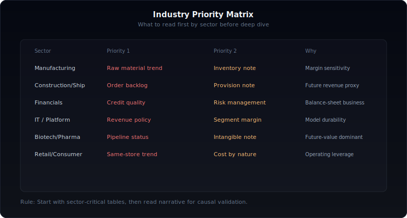

# 사업보고서 텍스트, 이렇게 읽는다

사업보고서를 "읽는다"는 건 대부분 착각이다.

대다수의 투자자는 사업보고서를 열어도 재무제표 숫자만 확인하고 닫는다. 매출, 영업이익, PER — 이 숫자를 확인하면 "사업보고서를 봤다"고 생각한다.

하지만 사업보고서 200~300페이지 중 재무제표는 20~30페이지에 불과하다. **나머지 170~270페이지에 숫자가 말해주지 않는 이야기가 있다.**


이 글은 그 나머지 페이지를 어떻게 읽는지에 대한 실전 가이드다.

---

## 전체를 읽지 마라

가장 먼저 할 일은, 전체를 읽지 않기로 결정하는 것이다.

사업보고서는 법정 서식에 따라 12개 대목차로 구성된다. 이 중에서 투자 판단에 결정적인 섹션은 절반도 안 된다. 나머지는 형식적이거나, 다른 섹션에서 더 잘 보이는 정보의 반복이다.

### 읽기 우선순위

| 우선순위 | 섹션 | 소요 시간 | 얻는 것 |
|----------|------|-----------|---------|
| **1순위** | V. 감사의견 | 3분 | 숫자를 신뢰할 수 있는가 |
| **1순위** | XI. 그 밖에 투자자 보호 | 5분 | 숨겨진 폭탄이 있는가 |
| **2순위** | II. 사업의 내용 | 15분 | 무슨 사업을 하는가, 시장은 어떤가 |
| **2순위** | IV. 경영진단의견 (MD&A) | 10분 | 경영진은 실적을 어떻게 설명하는가 |
| **3순위** | VII. 주주에 관한 사항 | 3분 | 누가 지배하는가 |
| **3순위** | X. 대주주 등과의 거래 | 5분 | 터널링 징후가 있는가 |
| **4순위** | VIII. 임원 및 직원 | 3분 | 인력과 보상 구조 |
| 참고 | III. 재무에 관한 사항 (주석) | 필요시 | 숫자의 디테일 |

핵심은 **리스크부터 확인**하는 것이다. 감사의견이 적정이 아니면 나머지를 읽을 필요가 없다. 우발부채에 거액의 소송이 걸려 있으면, 아무리 실적이 좋아도 재검토가 필요하다.

좋은 이야기보다 나쁜 이야기를 먼저 찾아라.

---

## 1단계: 감사의견 — 3분이면 된다

사업보고서를 열면 가장 먼저 "V. 회계감사인의 감사의견 등"으로 간다.

### 확인할 것

**감사의견 자체**: 적정 / 한정 / 부적정 / 의견거절. 적정이면 다음으로 넘어간다. 적정이 아니면 멈춘다.

**핵심감사사항(KAM)**: 감사인이 특별히 중요하다고 판단한 항목이다. 2018년부터 의무 기재된다.

KAM에 자주 등장하는 패턴:

| KAM 항목 | 의미 | 다음 행동 |
|----------|------|-----------|
| 매출 인식의 적정성 | 매출 시점 판단이 복잡하거나, 부정 위험 | 매출채권 연령분석(주석 8번), 수익인식 정책(주석 32번) 확인 |
| 영업권 손상검사 | 인수합병 후 영업권이 큰 경우 | 무형자산 주석(17번)에서 손상검사 가정(할인율, 성장률) 확인 |
| 재고자산 평가 | 재고 진부화 위험이 있는 제조업 | 재고자산 주석(14번)에서 평가손실 추이 확인 |
| 충당부채 추정 | 소송/보증 관련 불확실성 | 충당부채 주석(26번), 우발부채(27번) 확인 |
| 계속기업 불확실성 | 기업 존속 자체에 의문 | 즉시 위험 신호 — 투자 재검토 |

KAM은 감사인이 "여기를 주의 깊게 봐라"고 알려주는 이정표다. KAM에 올라온 항목은 반드시 해당 주석까지 따라가서 확인한다.

**감사인 변경 여부**: 전기와 당기 감사인이 다르면, 왜 바뀌었는지를 확인한다. 감사인 변경 직후에 회계정책이 바뀌거나 전기 재무제표가 소급 수정되면, 이전 감사인과 의견 차이가 있었을 가능성이 있다.

---

## 2단계: 우발부채와 소송 — 5분이면 된다

"XI. 그 밖에 투자자 보호를 위하여 필요한 사항"으로 간다.

이 섹션은 이름이 모호해서 많은 사람이 건너뛴다. 하지만 **재무상태표에 나타나지 않는 리스크**가 여기 있다.

### 확인할 것

**소송 현황**: 계류 중인 소송의 소송가액을 자본총계와 비교한다.

```
소송가액 / 자본총계 = ?

1% 미만  → 무시해도 됨
1~5%     → 주의
5~10%    → 심각한 리스크
10% 초과 → 기업 존속에 영향 가능
```

소송이 하나가 아니라 여러 건이면 합산한다. 개별 소송은 작아 보여도 합계가 자본의 상당 부분일 수 있다.

**채무보증**: 타인의 채무를 보증한 내역이다. 보증 대상 기업이 부실해지면 대신 갚아야 한다. 재무상태표에는 안 나오는 **숨겨진 부채**다.

**약정사항**: 미사용 여신 한도, 출자 약정 등. 향후 현금 유출이 예정된 항목이다.

**작성기준일 이후 발생사항**: 결산일과 공시 제출일 사이(보통 2~3개월)에 발생한 중요 사건이다. 이 기간에 대규모 인수, 소송, 사고가 발생했을 수 있다.

---

## 3단계: 사업의 내용 — 숫자의 맥락을 읽는다

"II. 사업의 내용"은 사업보고서에서 가장 분량이 큰 텍스트 섹션이다. 여기서 재무제표 숫자의 **"왜"**를 읽는다.

### 핵심 포인트 5가지

**1. 매출 구성**: 제품/서비스별 매출 비중이 어떻게 변하고 있는가.

매출이 10% 성장했더라도, 고마진 제품이 줄고 저마진 제품이 늘었다면 이익 구조는 악화되고 있다. 매출액만 보면 성장, 매출 구성을 보면 악화 — 이런 괴리가 빈번하다.

**2. 원재료 가격 추이**: 향후 마진에 직결되는 정보다.

원재료가 전년 대비 20% 올랐는데 제품 가격은 5%만 올렸다면, 다음 분기 마진 압박이 예상된다. 이 정보는 손익계산서에 안 나온다. "사업의 내용" 텍스트에만 있다.

**3. 가동률**: 설비 투자 타이밍의 핵심 지표다.

| 가동률 | 의미 |
|--------|------|
| 90% 이상 | 풀가동 — 추가 수요를 못 받는다, 설비 투자 불가피 |
| 70~90% | 정상 범위 |
| 50~70% | 수요 둔화 — 고정비 부담 증가 |
| 50% 미만 | 심각한 수요 감소 — 구조조정 가능성 |

가동률이 90%를 넘기면 설비 투자가 임박하고, 이는 대규모 자본 지출(CAPEX) → 감가상각비 증가 → 단기 이익 감소로 이어진다.

**4. 수주 잔고**: 미래 매출의 선행 지표다.

건설, 조선, 방산 등 수주 기반 업종에서 특히 중요하다. 수주 잔고가 줄고 있으면 향후 매출 감소가 예상된다. 반대로 수주가 급증하면 향후 실적 개선의 선행 지표다.

**5. 위험 요인**: 환율/금리 민감도 분석이 여기 있다.

"원/달러 환율이 10% 상승하면 영업이익이 X억 원 변동한다" — 이런 정량적 민감도 정보는 어떤 스크리닝 도구에서도 제공하지 않는다. 사업보고서 텍스트에만 있다.

---

## 4단계: MD&A — 경영진의 속마음을 읽는다

"IV. 이사의 경영진단 및 분석의견"은 경영진이 직접 쓴 실적 설명이다.

### 읽는 법

MD&A는 경영진이 쓰므로 자연스럽게 **긍정 편향**이 있다. 그래서 읽는 기술이 필요하다.

**법칙 1: 숫자와 텍스트를 대조한다.**

매출이 빠졌는데 MD&A에 "시장 확대가 기대된다"고만 쓰여 있으면, 경영진이 현실을 직시하지 않거나 투자자에게 솔직하지 않은 것이다. 반대로, 실적이 좋은데도 "불확실성이 높다"고 쓰면 경영진이 내부적으로 리스크를 감지하고 있을 수 있다.

**법칙 2: 연도별 톤 변화를 추적한다.**

| 전년 MD&A | 금년 MD&A | 해석 |
|-----------|-----------|------|
| "시장 확대가 기대된다" | "불확실성이 높다" | 경영진 내부 판단이 바뀌었다 |
| "적극적 투자를 지속한다" | "선별적 투자를 검토한다" | 투자 기조가 수비적으로 전환 |
| "수출 확대를 추진한다" | "내수 기반 안정화에 집중한다" | 해외 시장 진출이 난항 |
| "신제품 출시를 준비 중이다" | (언급 없음) | 프로젝트가 지연되거나 중단됨 |

가장 의미 있는 신호는 **이전에 있던 언급이 사라진 경우**다. 전년에 "신사업 추진"을 강조하다가 올해 아무 말이 없으면, 그 사업이 기대만큼 안 되고 있을 가능성이 높다.

**법칙 3: 원인 설명의 구체성을 본다.**

```
나쁜 예: "대외적 불확실성으로 인해 매출이 감소하였습니다."
좋은 예: "주력 제품 A의 글로벌 수요 둔화와 원/달러 환율 5% 하락으로
         수출 매출이 전년 대비 12% 감소하였습니다."
```

구체적 원인을 제시하는 기업은 자기 사업을 이해하고 있고, 투자자에게 솔직하다. "대외적 불확실성" 같은 모호한 표현으로 일관하는 기업은 주의가 필요하다.

---

## 5단계: 지배구조와 특수관계자 거래

### 주주 현황 (VII)

최대주주 지분율과 특수관계인 합산 지분율을 확인한다.

| 최대주주 + 특관인 합산 | 의미 |
|----------------------|------|
| 50% 초과 | 절대적 경영권 — 소수주주 견제 약함 |
| 30~50% | 안정적 경영권 — 적대적 M&A 방어 가능 |
| 20~30% | 경영권 불안정 — 외부 세력 도전 가능 |
| 20% 미만 | 경영권 분쟁 리스크 높음 |

**연도별 지분율 변동**이 더 중요하다. 최대주주 지분이 매년 줄고 있으면 경영권 이전의 전조일 수 있다. 반대로 지분을 늘리고 있으면 경영권 강화 의지의 표현이다.

### 대주주 등과의 거래 (X)

특수관계자 거래에서 확인할 것:

- **매출 중 특수관계자 비중**: 매출의 30% 이상이 특수관계자에게서 발생하면, 그 거래가 시장가 기준인지 의심할 필요가 있다
- **자금 대여/차입**: 대주주 관련 회사에 저리로 자금을 대여하고 있으면 터널링 의심
- **자산 거래**: 시가보다 낮은 가격으로 자산을 매각했으면 사적 이익 추구

---

## 연도별 비교: 한 해만 보지 마라

사업보고서 한 해치만 읽으면 스냅샷일 뿐이다. 진짜 가치는 **연도별 비교**에서 나온다.

### 비교해야 할 텍스트 항목

| 항목 | 비교 방법 | 포착할 수 있는 변화 |
|------|-----------|-------------------|
| MD&A 톤 | 전년과 금년의 표현, 언급 항목 비교 | 경영진 인식 변화 |
| 위험 요인 | 새로 추가되거나 삭제된 위험 | 새로운 리스크 출현/해소 |
| 수주 잔고 | 전년 대비 증감 | 미래 매출 방향 |
| 가동률 | 전년 대비 변화 | 수요 트렌드 |
| 감사인 | 변경 여부 | 감사 관련 이슈 |
| KAM | 전년과 동일한지, 새로 추가되었는지 | 새로운 회계 리스크 |
| 소송 | 건수와 금액 변화 | 법적 리스크 추이 |
| 임원 보수 | 전년 대비 변동, 성과급 비율 | 경영진 인센티브 변화 |

한 기업의 3년치 사업보고서를 나란히 놓고 위 항목을 비교하면, 숫자만으로는 보이지 않는 기업의 궤적이 드러난다.

---

## 업종별로 다르게 읽는다

모든 사업보고서를 같은 방식으로 읽으면 안 된다. 업종마다 핵심이 되는 섹션이 다르다.




| 업종 | 핵심 확인 항목 | 이유 |
|------|--------------|------|
| **제조업** | 원재료 가격, 가동률, 재고자산 주석 | 마진과 설비 투자에 직결 |
| **건설/조선** | 수주 잔고, 진행률, 충당부채 | 수주가 미래 매출, 공사손실충당부채 주의 |
| **금융업** | 충당금, 건전성 비율, 위험관리 | 대출 부실이 핵심 리스크 |
| **IT/플랫폼** | 매출 인식 정책, 영업부문별 실적 | 수익 모델의 지속성 |
| **바이오/제약** | R&D 파이프라인, 임상 현황, 무형자산 | 미래 가치가 핵심 — 현재 숫자보다 중요 |
| **유통/소비재** | 매출 구성, 점포 수, 평당 매출 | 성장이 기존점 매출인지 신규점 확장인지 |

예를 들어, 건설업체의 사업보고서를 읽을 때 가장 먼저 볼 것은 재무제표가 아니라 **수주 잔고 테이블**이다. 수주가 줄면 1~2년 후 매출이 줄기 때문이다. 그리고 **공사손실충당부채**가 급증했는지를 충당부채 주석에서 확인한다. 원가가 예상을 초과하는 프로젝트가 있다는 의미다.

바이오 기업은 반대로 현재 재무제표가 거의 의미가 없다. 매출이 없거나 미미한 경우가 대부분이다. 대신 "사업의 내용"에서 **임상 단계별 파이프라인**과 기술이전 계약 내역이 핵심이다. 그리고 무형자산(개발비) 주석에서 자본화된 R&D 비용이 얼마인지, 손상 위험은 없는지를 확인한다.

---

## 실전 체크리스트

사업보고서를 읽을 때 아래 질문에 답할 수 있으면 충분하다.

### 신뢰성
- [ ] 감사의견은 적정인가?
- [ ] KAM에 올라온 항목은 무엇인가?
- [ ] 감사인이 바뀌었는가?

### 리스크
- [ ] 계류 중인 소송의 총 소송가액은 자본 대비 몇 %인가?
- [ ] 채무보증 규모는?
- [ ] 우발부채에 새로 추가된 항목이 있는가?

### 사업
- [ ] 매출 구성에서 고마진/저마진 비중은 어떻게 변하고 있는가?
- [ ] 원재료 가격은 오르고 있는가, 내리고 있는가?
- [ ] 가동률은 몇 %인가?
- [ ] 수주 잔고는 늘고 있는가, 줄고 있는가?

### 경영진
- [ ] MD&A에서 실적 변동의 원인을 구체적으로 설명하는가?
- [ ] 전년 MD&A와 비교해 톤이 바뀌었는가?
- [ ] 전년에 언급했던 계획 중 사라진 것이 있는가?

### 지배구조
- [ ] 최대주주 지분율은 안정적인가?
- [ ] 특수관계자 거래 중 비정상적인 것이 있는가?
- [ ] 임원 보수 구조는 실적 연동인가?

---

## DartLab으로 자동화하기

위의 체크리스트를 한 기업, 한 해치만 수작업으로 확인하는 건 가능하다. 하지만 수십 개 기업, 수년치를 비교하려면 자동화가 필요하다.

```python
from dartlab import Company

c = Company("005930")

# 1단계: 감사의견
c.audit                  # 연도별 감사의견, KAM, 감사인, 감사시간

# 2단계: 우발부채
c.contingentLiability    # 소송, 채무보증, 약정사항

# 3단계: 사업의 내용
c.business               # 사업 내용 전문 텍스트
c.IS                     # 매출 구성은 손익계산서와 대조

# 4단계: MD&A
c.mdna                   # 경영진단의견 전문 텍스트

# 5단계: 지배구조
c.majorHolder            # 최대주주 지분율 시계열
c.relatedPartyTx         # 특수관계자 거래
c.executivePay           # 임원 보수 구조

# 주석 디테일
c.notes.inventory        # 재고자산 (제조업)
c.notes.borrowings       # 차입금 상세
c.notes.provisions       # 충당부채
c.notes.segments         # 영업부문별 실적
```

숫자를 뽑는 도구는 많다. 하지만 감사의견, 소송 현황, MD&A 텍스트, 특수관계자 거래까지 하나의 인터페이스로 접근할 수 있는 도구는 드물다. DartLab은 이 간격을 메운다.

---

## 정리

사업보고서를 읽는 건 전체를 읽는 게 아니다. **어디를 읽어야 하는지 아는 것**이다.

| 순서 | 섹션 | 핵심 질문 |
|------|------|-----------|
| 1 | 감사의견 | 이 숫자를 믿어도 되는가? |
| 2 | 우발부채/소송 | 숨겨진 폭탄이 있는가? |
| 3 | 사업의 내용 | 숫자 뒤에 무슨 이야기가 있는가? |
| 4 | MD&A | 경영진은 어디를 보고 있는가? |
| 5 | 지배구조/특수관계자 | 누가, 누구를 위해 경영하는가? |

리스크부터 확인하고, 맥락을 읽고, 연도별로 비교한다. 이 세 가지만 지키면 같은 사업보고서에서 남들과 다른 인사이트를 뽑아낼 수 있다.

자세한 사용법은 [문서](https://eddmpython.github.io/dartlab/docs/)를 참조하자.
