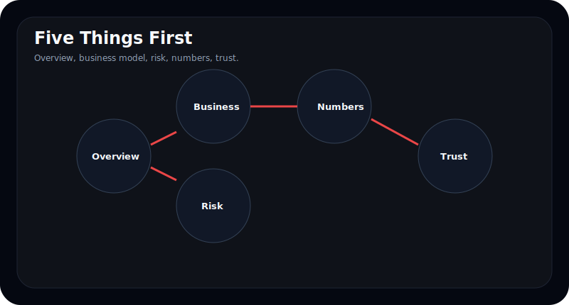
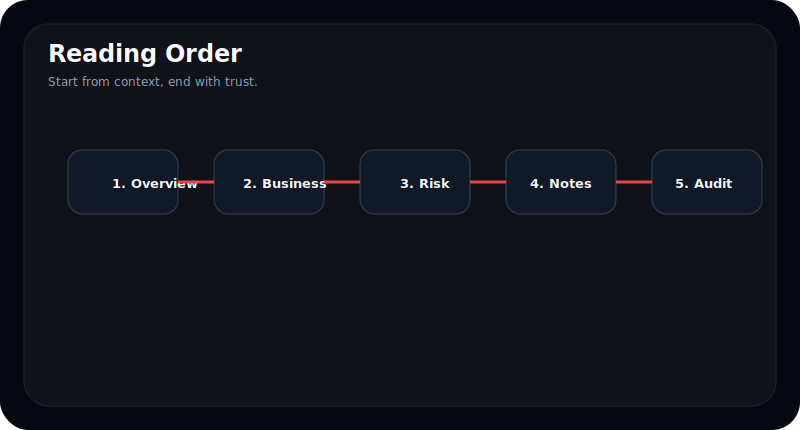
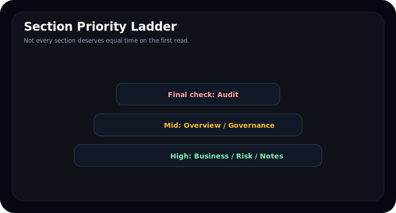
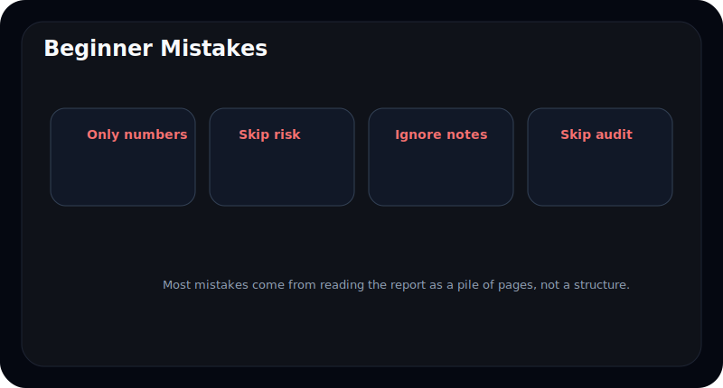
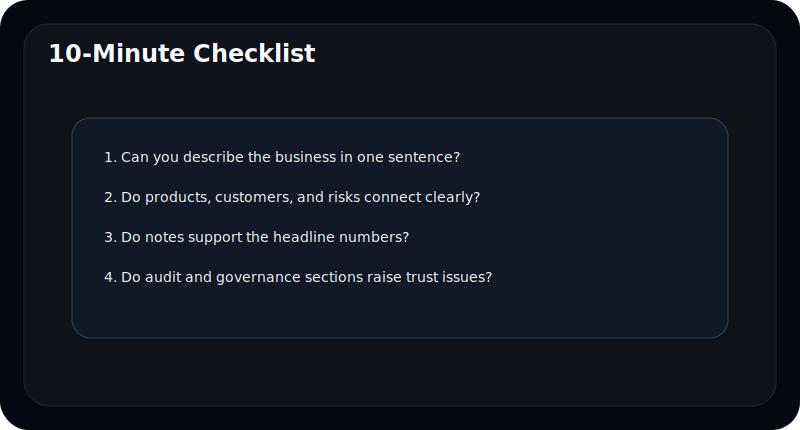

# 사업보고서에서 꼭 봐야 할 5가지는 무엇인가

사업보고서를 처음 열면 대부분 길이에 압도된다. 목차는 길고 숫자도 많고 말도 많다. 그래서 많은 사람은 앞부분 몇 줄만 읽거나, 반대로 숫자 표만 보고 끝낸다.

하지만 사업보고서는 아무 데서나 읽기 시작하면 오히려 더 헷갈린다. 중요한 것은 다 읽는 것이 아니라 **어디부터 읽어야 하는지** 아는 것이다.

이 글은 사업보고서를 처음 읽는 사람이 꼭 봐야 할 다섯 축을 정리한다. 회사 개요, 사업의 내용, 리스크, 재무제표와 주석, 감사와 지배구조를 어떤 순서로 보면 되는지 실제 읽기 흐름 기준으로 설명한다.

---

## 왜 다섯 축으로 끊어 봐야 하나

사업보고서는 한 번에 이해하려고 하면 오히려 길을 잃는다. 반대로 아래 다섯 축으로 나누면 읽는 목적이 분명해진다.

| 축 | 질문 |
| --- | --- |
| 회사 개요 | 이 회사는 무엇을 하는가 |
| 사업의 내용 | 돈을 어떤 구조로 버는가 |
| 리스크 | 무엇이 흔들릴 수 있는가 |
| 재무제표와 주석 | 숫자는 실제로 어떤 상태인가 |
| 감사와 지배구조 | 이 숫자와 설명을 어디까지 믿을 수 있는가 |

핵심은 이 다섯 축이 서로 따로 노는 것이 아니라는 점이다. 사업의 내용에서 말한 성장 방향은 재무제표와 연결돼야 하고, 리스크는 주석과 감사보고서에서 다시 확인돼야 한다.

---

## 1. 회사 개요에서 먼저 잡아야 할 것은 무엇인가

회사 개요는 가장 단순해 보이지만, 실제로는 나머지 모든 섹션을 읽는 기준점이 된다.

여기서 먼저 확인할 것은 세 가지다.

- 회사가 파는 핵심 제품과 서비스
- 어느 시장에서 돈을 버는지
- 연결/별도 기준으로 어떤 사업이 중요한지

많은 입문자가 회사 개요를 "설립일과 본점 주소" 같은 형식 정보로만 본다. 실제로는 이 섹션이 "이 회사를 한 문장으로 어떻게 설명할 것인가"를 정리하는 곳이다.

| 먼저 볼 것 | 왜 중요한가 |
| --- | --- |
| 주력 사업 | 나중에 숫자를 볼 때 중심축이 됨 |
| 주요 종속회사 | 연결 실적의 핵심이 어딘지 알 수 있음 |
| 국내/해외 비중 | 환율, 경기, 지역 리스크 해석이 쉬워짐 |

---

## 2. 사업의 내용에서는 무엇을 읽어야 하나

사업의 내용은 사업보고서의 중심이다. 여기서는 제품 설명을 읽는 것이 아니라 **돈 버는 구조**를 읽어야 한다.

먼저 봐야 할 것은 이렇다.

- 어떤 제품/서비스가 핵심인지
- 매출이 어떤 고객과 산업에 묶여 있는지
- 원재료, 생산, 연구개발, 판매 구조가 어떻게 연결되는지

좋은 사업의 내용은 구조가 분명하다. 무엇을 만들고, 누구에게 팔고, 무엇이 리스크인지가 자연스럽게 이어진다. 반대로 위험한 서술은 말은 길지만 핵심이 흐린 경우가 많다.

| 질문 | 좋은 서술 | 경계할 서술 |
| --- | --- | --- |
| 무엇을 파는가 | 제품과 매출축이 명확함 | 표현이 넓고 모호함 |
| 누구에게 파는가 | 고객/시장 구조가 보임 | 고객 구조가 거의 안 보임 |
| 무엇이 변수인가 | 원재료, 규제, CAPEX가 드러남 | 성장 서사만 있고 변수 설명이 약함 |

---

## 3. 리스크 섹션은 왜 반드시 봐야 하나

입문자는 리스크 섹션을 건너뛰는 경우가 많다. "원래 다 조심하라고 쓰는 문구 아닌가"라고 생각하기 쉽기 때문이다. 하지만 리스크 섹션은 회사가 스스로 어떤 불확실성을 인정하는지 보여준다.

여기서 중요한 것은 리스크의 개수보다 **구체성**이다.

- 추상적 경고만 반복하는가
- 특정 고객, 특정 원재료, 특정 지역, 특정 규제처럼 구체적으로 쓰는가
- 올해 새로 등장한 리스크가 있는가

좋은 리스크 섹션은 "무슨 일이 생길 수 있다"에서 끝나지 않고, 왜 그 일이 회사에 중요한지까지 연결한다.

---

## 4. 재무제표와 주석은 어디까지 같이 봐야 하나

숫자만 보면 빠를 것 같지만 오히려 오해하기 쉽다. 재무제표는 상태를 보여주고, 주석은 그 상태가 왜 그렇게 보이는지 설명한다.

초보자라면 아래 네 가지부터 보면 충분하다.

- 매출, 영업이익, 순이익 추세
- 영업현금흐름과 순이익의 관계
- 매출채권, 재고, 차입금 같은 핵심 계정
- 주석에서 반복해서 설명되는 민감 항목

| 재무 숫자 | 같이 볼 주석 |
| --- | --- |
| 매출 | 매출 인식, 고객 구조 |
| 채권 | 회수 위험, aging |
| 재고 | 평가손실, 진부화 |
| 차입금 | 만기, 금리, 담보 |

사업보고서를 잘 읽는다는 것은 숫자 표를 많이 보는 것이 아니라, 숫자와 설명이 서로 같은 방향을 말하는지 확인하는 것이다.

---

## 5. 감사와 지배구조는 왜 마지막이 아니라 중요한가

감사보고서와 지배구조는 부록처럼 보이지만, 실제로는 "이 회사 설명을 어디까지 신뢰할 것인가"를 결정하는 층이다.

최소한 아래는 확인하는 편이 좋다.

- 감사의견과 핵심감사사항
- 최대주주와 특수관계자 구조
- 이사회, 감사기구, 내부통제 관련 문구

좋은 회사는 반드시 좋은 숫자만 보여주는 회사가 아니라, **숫자와 설명을 믿을 수 있게 만드는 구조**가 있는 회사다.

---

## 처음 읽는 사람에게 추천하는 순서는 무엇인가

입문자라면 아래 순서가 가장 효율적이다.

1. 회사 개요
2. 사업의 내용
3. 리스크
4. 재무제표와 핵심 주석
5. 감사와 지배구조

이 순서의 장점은 숫자를 보기 전에 맥락을 먼저 잡고, 마지막에 신뢰도를 점검하게 된다는 점이다.

---

## 자주 틀리는 해석 4가지

### 1. 매출과 이익만 먼저 본다

맥락 없이 숫자만 보면 왜 그런 숫자가 나왔는지 놓친다.

### 2. 사업의 내용을 제품 소개 정도로만 본다

실제로는 경쟁 구조와 수익 구조를 읽는 섹션이다.

### 3. 리스크는 다 똑같다고 생각한다

구체적으로 새로 추가된 리스크는 의미가 크다.

### 4. 감사와 지배구조는 마지막에 건너뛴다

신뢰성 판단이 빠지면 숫자를 잘못 믿게 된다.

---

## 10분 체크리스트

- 이 회사를 한 문장으로 설명할 수 있는가
- 무엇을 팔고 누구에게 파는지 보이는가
- 리스크가 구체적인가
- 숫자와 주석이 같은 이야기를 하는가
- 감사보고서와 지배구조에서 신뢰성 경고가 없는가

---

## FAQ

### 사업보고서는 다 읽어야 하나

처음부터 전부 읽을 필요는 없다. 다섯 축으로 나눠 중요한 부분부터 읽는 편이 낫다.

### 제일 먼저 숫자를 보면 안 되나

볼 수는 있지만, 회사가 어떤 구조로 돈을 버는지 모르면 숫자를 해석하기 어렵다.

### 리스크 섹션은 왜 중요한가

회사가 스스로 무엇을 가장 조심해야 한다고 보는지 보여주기 때문이다.

### 감사보고서는 적정의견만 보면 되나

그것만 보면 부족하다. 핵심감사사항과 강조 문구도 같이 봐야 한다.

---

## 참고한 공식 자료

- DART 보고서정보: https://dart.fss.or.kr/introduction/content2.do
- 금융감독원 전자공시시스템: https://dart.fss.or.kr/
- OpenDART 개발가이드: https://opendart.fss.or.kr/guide/main.do

---

## 정리

사업보고서를 읽는 가장 쉬운 방법은 모든 페이지를 똑같이 보지 않는 것이다. 회사 개요, 사업의 내용, 리스크, 재무제표와 주석, 감사와 지배구조라는 다섯 축으로 나누면 무엇을 먼저 봐야 하는지가 분명해진다.

입문자는 많이 읽는 것보다 **올바른 순서로 읽는 것**이 더 중요하다. 그 순서만 잡혀도 사업보고서는 훨씬 덜 막막해진다.
