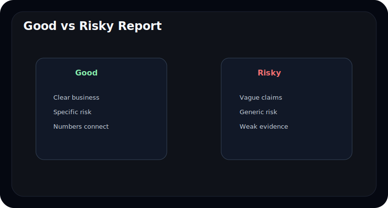
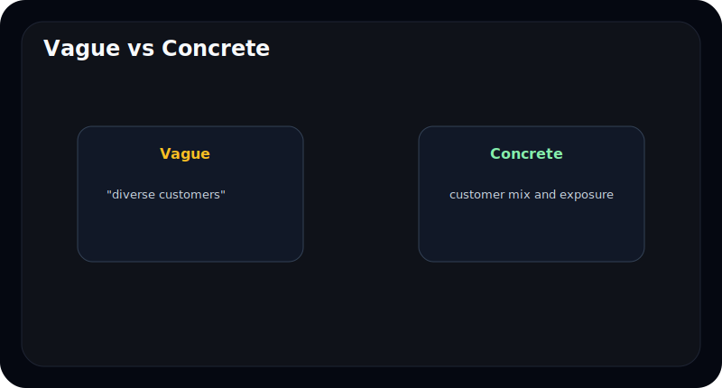
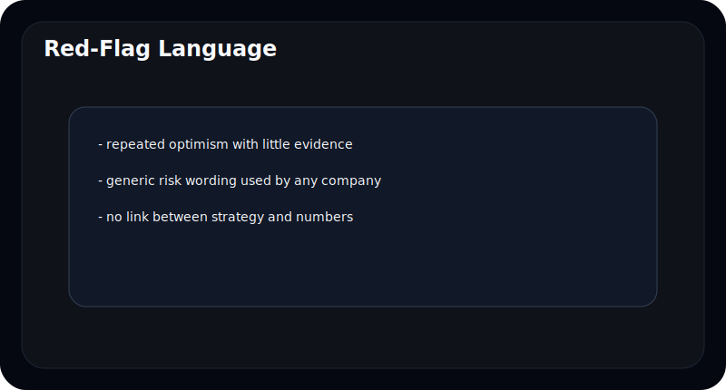
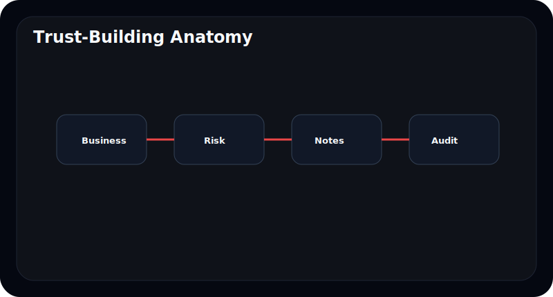
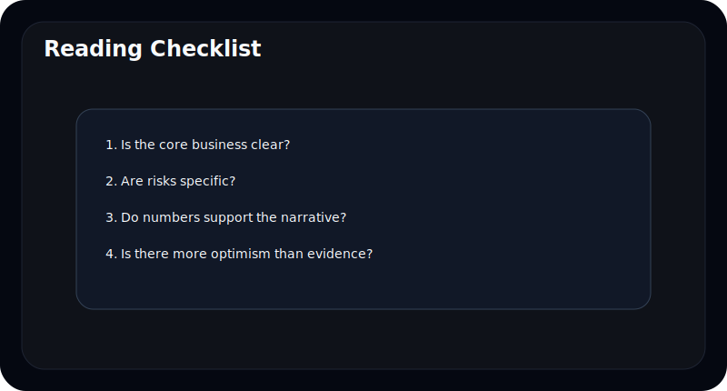

# 좋은 사업보고서와 위험한 사업보고서의 차이

같은 사업보고서라도 읽고 나서 남는 느낌은 다르다. 어떤 문서는 길어도 이해가 잘 되고, 어떤 문서는 설명이 많은데도 핵심이 안 보인다.

그 차이는 문장이 예쁘냐 아니냐가 아니다. **구체성, 구조, 숫자 연결, 리스크 설명 방식**에서 차이가 난다.

이 글은 좋은 사업보고서와 위험한 사업보고서가 어떻게 다른지, 초보자도 바로 구분할 수 있도록 쉬운 기준으로 정리한다.

---

## 좋은 사업보고서는 무엇이 다른가

좋은 사업보고서는 회사를 더 좋아 보이게 만드는 문서가 아니다. 오히려 **이해하기 쉽게 만드는 문서**다.

여기에는 공통점이 있다.

- 무엇을 하는 회사인지 한 문장으로 정리된다
- 어디서 돈을 버는지 연결된다
- 리스크를 피하지 않는다
- 숫자와 설명이 같은 방향을 말한다

| 좋은 사업보고서의 특징 | 의미 |
| --- | --- |
| 주력 사업이 명확함 | 핵심 수익원이 보임 |
| 고객/시장 구조가 보임 | 성장 근거를 판단할 수 있음 |
| 리스크 설명이 구체적임 | 회사가 무엇을 경계하는지 알 수 있음 |
| 숫자와 문구가 연결됨 | 신뢰가 높아짐 |

---

## 위험한 사업보고서는 어떤 느낌을 주나

위험한 사업보고서는 꼭 거짓말을 하는 문서는 아니다. 다만 독자가 중요한 판단을 하기에 필요한 연결이 부족하다.

가장 흔한 패턴은 아래와 같다.

- 표현은 크고 화려한데 핵심이 없다
- 리스크를 추상적으로만 쓴다
- 성장 이야기는 많지만 숫자 설명은 약하다
- 같은 말을 반복하지만 실제 구조가 안 보인다

---

## 문구가 구체적인지 어떻게 판단하나

좋은 사업보고서는 추상어보다 구체어가 많다.

예를 들어:

- "다양한 고객 기반"보다 "주요 고객군과 매출 비중"
- "지속적인 성장"보다 "어느 사업군에서 무엇이 성장"
- "리스크 관리 강화"보다 "어떤 리스크를 어떻게 관리"

| 표현 방식 | 신뢰가 낮은 쪽 | 신뢰가 높은 쪽 |
| --- | --- | --- |
| 고객 설명 | 다양한 고객 | 주요 고객군과 구조 설명 |
| 성장 설명 | 지속 성장 기대 | 어떤 제품/시장 성장인지 명시 |
| 리스크 설명 | 외부환경 변화 가능성 | 원재료, 규제, 고객 집중처럼 구체적 |

좋은 질문은 이거다. "이 문장이 예쁜가"가 아니라 "이 문장을 읽고 실제 사업 구조가 그려지는가"다.

---

## 좋은 리스크 설명과 나쁜 리스크 설명의 차이

리스크 섹션은 특히 차이가 잘 드러난다.

좋은 리스크 설명은:

- 어떤 리스크인지 분명하고
- 왜 중요한지 설명하고
- 회사의 구조와 연결된다

위험한 리스크 설명은:

- 누구에게나 적용될 수 있는 말만 반복하고
- 올해 회사에서 특히 중요한 문제가 무엇인지 드러나지 않는다

---

## 숫자와 설명이 연결되는지가 왜 중요한가

사업보고서의 가장 큰 차이는 숫자와 문구가 따로 노느냐, 같이 움직이느냐에 있다.

예를 들어 좋은 사업보고서는:

- CAPEX 확대를 말하면 생산능력/가동률 설명이 뒤따르고
- 리스크를 말하면 주석과 감사보고서에서도 그 흔적이 보이고
- 성장 스토리를 말하면 매출채권, 재고, 현금흐름 설명도 따라온다

반대로 위험한 사업보고서는:

- 말은 공격적인데 숫자는 약하고
- 숫자는 좋은데 리스크 설명은 지나치게 얕고
- 사업의 내용과 주석이 서로 다른 온도를 보인다

---

## 읽을 때 어떤 질문으로 바꿔야 하나

좋은 독자는 문장을 그대로 받아들이지 않고 질문으로 바꾼다.

| 문구 | 질문으로 바꾸면 |
| --- | --- |
| 성장세 지속 | 무엇이 성장했고 얼마나 지속 가능한가 |
| 경쟁력 강화 | 어떤 경쟁력이며 숫자로 어디서 보이나 |
| 리스크 대응 | 어떤 리스크에 어떻게 대응 중인가 |
| 고객 다변화 | 실제 매출 구조가 얼마나 달라졌나 |

---

## 자주 틀리는 해석 4가지

### 1. 길고 자세하면 좋은 사업보고서라고 생각한다

길이보다 구조와 연결이 중요하다.

### 2. 리스크가 많으면 무조건 나쁘다고 본다

오히려 구체적으로 쓰는 편이 더 신뢰할 만할 수 있다.

### 3. 좋은 문장과 좋은 사업을 헷갈린다

문장이 좋아도 숫자와 연결이 약하면 경계해야 한다.

### 4. 숫자와 본문을 따로 읽는다

사업보고서는 원래 같이 읽을 때 의미가 생긴다.

---

## 10분 체크리스트

- 핵심 사업이 한 문장으로 정리되는가
- 고객과 시장 구조가 보이는가
- 리스크가 구체적인가
- 숫자와 설명이 같은 방향을 가리키는가
- 너무 좋은 말만 많고 근거는 약하지 않은가

---

## FAQ

### 좋은 사업보고서는 길수록 좋은가

아니다. 길이보다 구조와 구체성이 중요하다.

### 리스크를 많이 쓰면 나쁜 회사인가

반드시 그렇지 않다. 구체적으로 쓰는 편이 오히려 신뢰를 줄 수 있다.

### 가장 먼저 의심해야 하는 문구는 무엇인가

크고 추상적인 말이 반복되는데 근거 숫자가 약한 경우다.

### 초보자도 바로 구분할 수 있나

핵심 사업, 리스크 구체성, 숫자 연결 이 세 가지만 봐도 많이 달라진다.

---

## 참고한 공식 자료

- DART 보고서정보: https://dart.fss.or.kr/introduction/content2.do
- 금융감독원 전자공시시스템: https://dart.fss.or.kr/
- OpenDART 개발가이드: https://opendart.fss.or.kr/guide/main.do

---

## 정리

좋은 사업보고서는 회사를 포장하는 문서가 아니라 이해하게 만드는 문서다. 핵심 사업이 보이고, 리스크가 구체적이며, 숫자와 설명이 연결된다.

위험한 사업보고서는 말은 많지만 연결이 약하다. 그래서 좋은 독자는 멋진 문장보다 **구조와 근거**를 먼저 본다.
