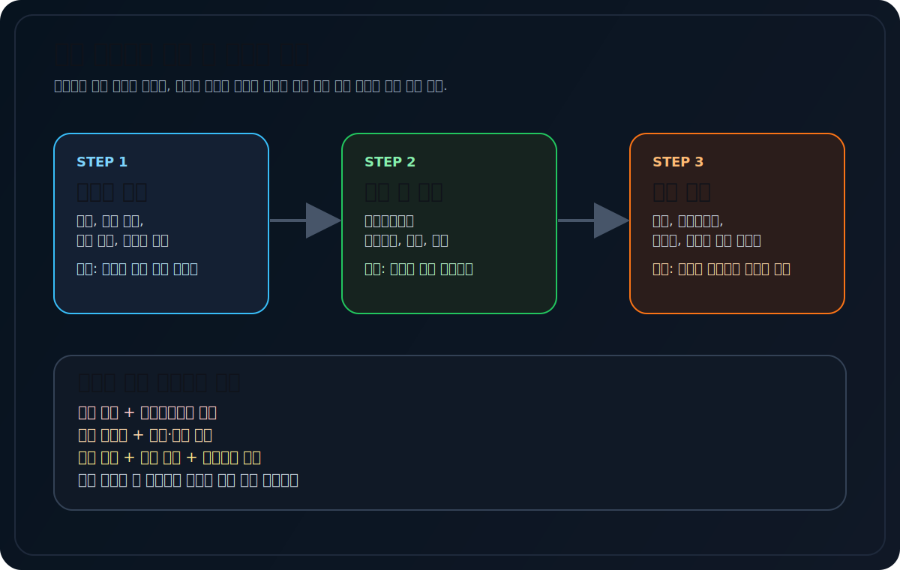
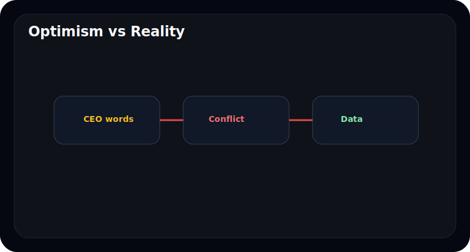
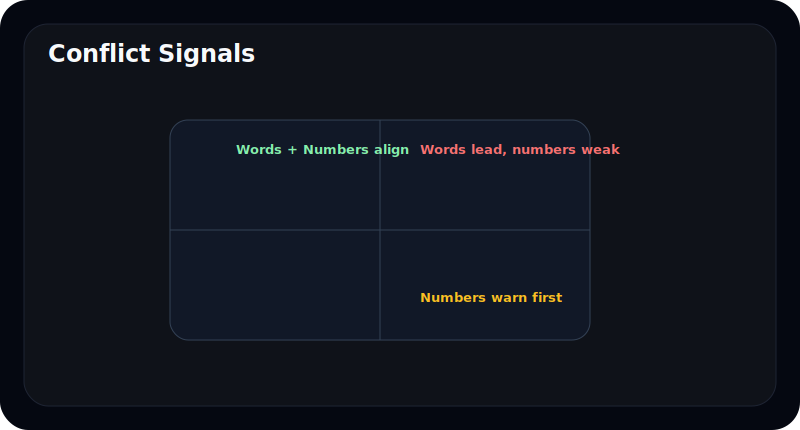
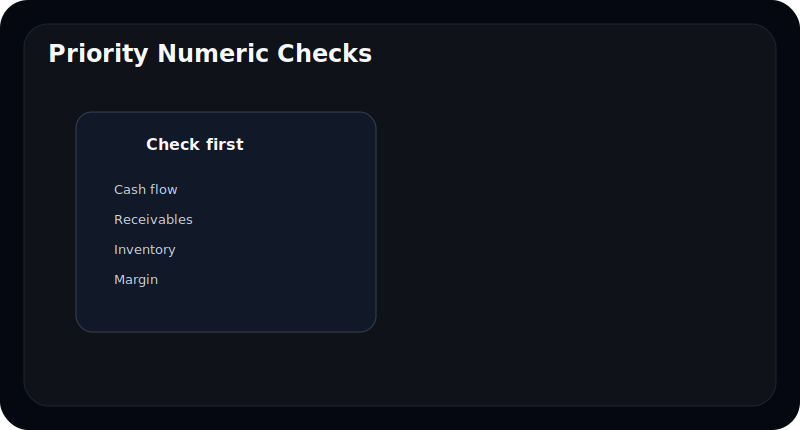
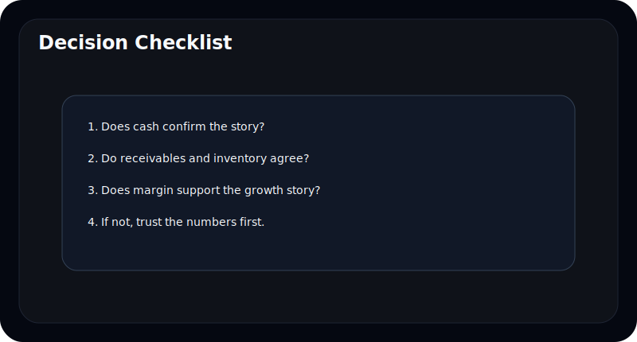

# 사업보고서에서 CEO 말보다 숫자가 중요한 순간

사업보고서를 읽다 보면 경영진의 말은 늘 자신감 있어 보인다. 성장, 경쟁력, 확대, 기회 같은 단어가 자주 나온다.

그 말이 무조건 틀렸다는 뜻은 아니다. 문제는 **언제는 말을 듣고, 언제는 숫자를 먼저 봐야 하는가**를 구분하지 못할 때다.

이 글은 사업보고서를 읽을 때 경영진 서술보다 숫자를 먼저 믿어야 하는 순간을 정리한다. 말과 숫자가 어긋날 때 초보자도 빠르게 판단할 수 있는 기준을 제시한다.

---

## 경영진의 말은 왜 필요한가

경영진의 말은 방향과 맥락을 준다. 회사가 무엇을 하려는지, 어떤 시장을 보고 있는지, 올해 무엇을 중요하게 생각하는지 알려준다.

그래서 말 자체가 쓸모없는 것은 아니다. 다만 말은 계획이고, 숫자는 현재까지의 결과다.

| 역할 | 경영진의 말 | 숫자 |
| --- | --- | --- |
| 무엇을 보여주나 | 방향, 전략, 계획 | 결과, 상태, 제약 |
| 장점 | 맥락을 설명함 | 검증 가능함 |
| 한계 | 낙관적일 수 있음 | 맥락이 부족할 수 있음 |

---

## 말보다 숫자를 먼저 봐야 하는 첫 번째 순간은 언제인가

가장 대표적인 순간은 **낙관적인 설명과 현금흐름이 어긋날 때**다.

회사는 성장과 확장을 말하지만, 영업현금흐름이 약하고 매출채권이 늘고 재고가 쌓이면 먼저 숫자를 믿어야 한다. 왜냐하면 현금은 설명보다 늦게 포장되기 어렵기 때문이다.

---

## 특히 숫자를 우선해야 하는 4가지 구간

### 1. 매출은 좋은데 현금흐름이 약할 때

말보다 현금이 중요하다.

### 2. 성장 이야기와 재고 누적이 같이 나타날 때

수요가 진짜인지 숫자로 다시 봐야 한다.

### 3. 공격적 투자 이야기와 마진 하락이 같이 나타날 때

확장이 아니라 부담일 수 있다.

### 4. 낙관적 전망과 손상/충당금 이슈가 같이 나타날 때

회사가 보는 미래와 회계상 현실이 다를 수 있다.

| 구간 | 먼저 볼 숫자 |
| --- | --- |
| 성장 낙관 | 매출채권, CFO |
| 수요 자신감 | 재고, 회전율 |
| 증설 자신감 | CAPEX, 감가상각, 마진 |
| 안정성 강조 | 차입금, 충당부채, 손상 |

---

## 좋은 경영진 서술은 무엇이 다른가

좋은 경영진 서술은 숫자를 덮지 않는다. 오히려 숫자를 설명한다.

예를 들어 좋은 서술은:

- 왜 마진이 낮아졌는지 설명하고
- 왜 채권이 늘었는지 설명하고
- 투자 이후 어떤 지표를 봐야 하는지 알려준다

반대로 방어적인 서술은:

- 추상적 낙관만 반복하고
- 숫자 약점은 지나치게 짧게 넘기고
- 다음에 무엇을 확인해야 하는지 힌트를 주지 않는다

---

## 말과 숫자가 어긋날 때는 어떻게 읽어야 하나

우선순위는 간단하다.

1. 숫자에서 실제 상태를 본다
2. 경영진 말이 그 숫자를 설명하는지 본다
3. 설명이 부족하면 보수적으로 해석한다

이때 중요한 것은 경영진 말을 무시하는 것이 아니라, **검증이 끝날 때까지 숫자를 더 무겁게 둔다**는 것이다.

---

## 자주 틀리는 해석 4가지

### 1. CEO가 자신감 있게 말하면 숫자도 곧 좋아질 거라고 본다

그럴 수도 있지만 먼저 숫자가 뒷받침해야 한다.

### 2. 숫자가 일시적으로 나빠도 말이 좋으면 괜찮다고 본다

반복되면 경고다.

### 3. 좋은 설명과 좋은 실적을 혼동한다

말은 좋을 수 있지만 구조는 약할 수 있다.

### 4. 숫자를 볼 때도 한 개만 본다

채권, 재고, 현금흐름, 마진을 같이 봐야 한다.

---

## 10분 체크리스트

- 낙관적 말과 현금흐름이 같은 방향인가
- 성장 설명과 채권/재고가 어긋나지 않는가
- 투자 설명과 마진이 어긋나지 않는가
- 리스크 설명과 주석이 같은 방향인가
- 말보다 숫자가 먼저 경고하고 있지 않은가

---

## FAQ

### CEO 말은 믿으면 안 되나

믿지 말라는 뜻이 아니라, 검증 없이 믿지 말아야 한다는 뜻이다.

### 숫자가 항상 더 중요하나

항상 그런 것은 아니지만, 말과 숫자가 충돌하면 숫자를 먼저 본다.

### 초보자는 어떤 숫자부터 보면 되나

현금흐름, 매출채권, 재고, 마진 순서가 좋다.

### 왜 현금흐름이 중요하나

설명보다 포장하기 어렵고 실제 사업 상태를 더 잘 드러내기 때문이다.

---

## 참고한 공식 자료

- DART 보고서정보: https://dart.fss.or.kr/introduction/content2.do
- 금융감독원 전자공시시스템: https://dart.fss.or.kr/
- OpenDART 개발가이드: https://opendart.fss.or.kr/guide/main.do

---

## 정리

사업보고서에서 경영진의 말은 중요하지만, 숫자보다 앞설 수는 없다. 특히 현금흐름, 채권, 재고, 마진이 경고할 때는 말보다 숫자를 먼저 봐야 한다.

좋은 독자는 낙관적인 문장을 듣고 끝내지 않는다. 그 말이 숫자로 확인되는지까지 본다.
