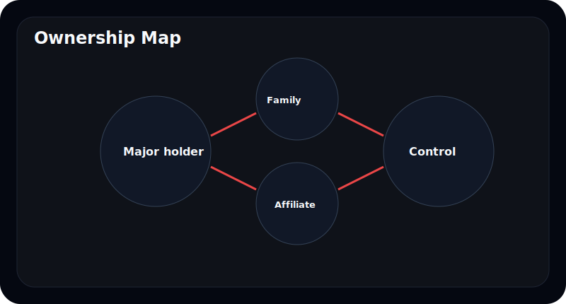
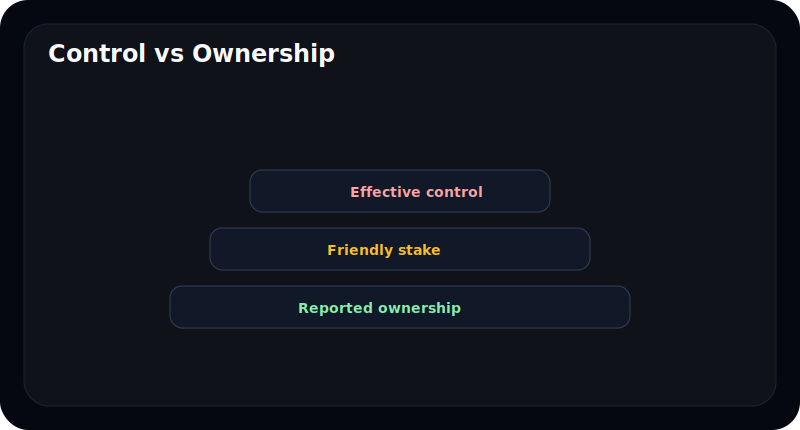
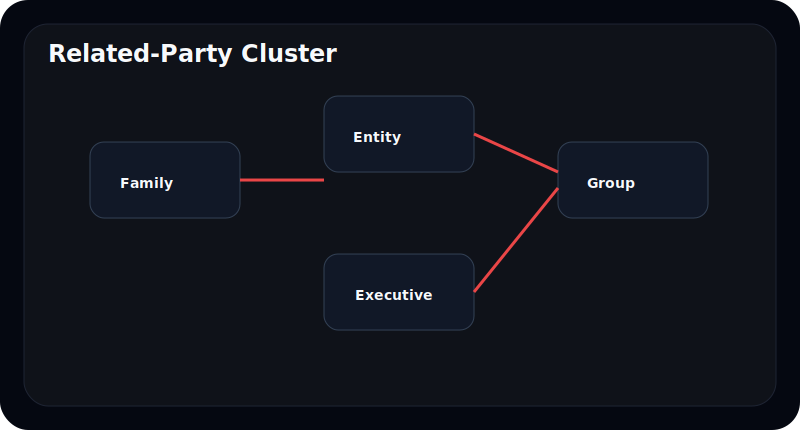
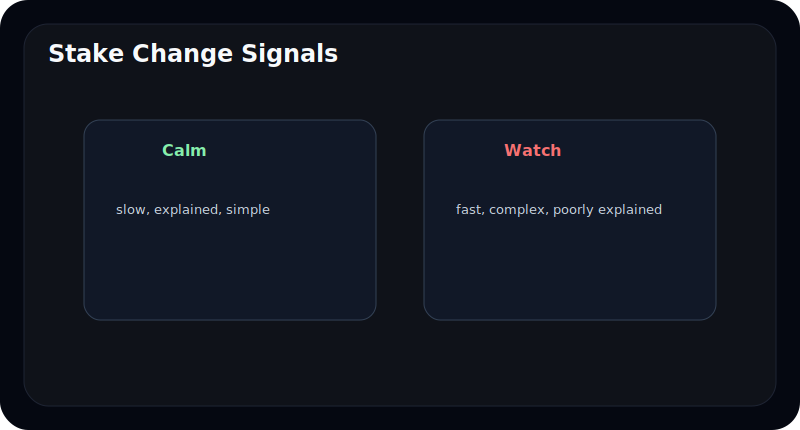
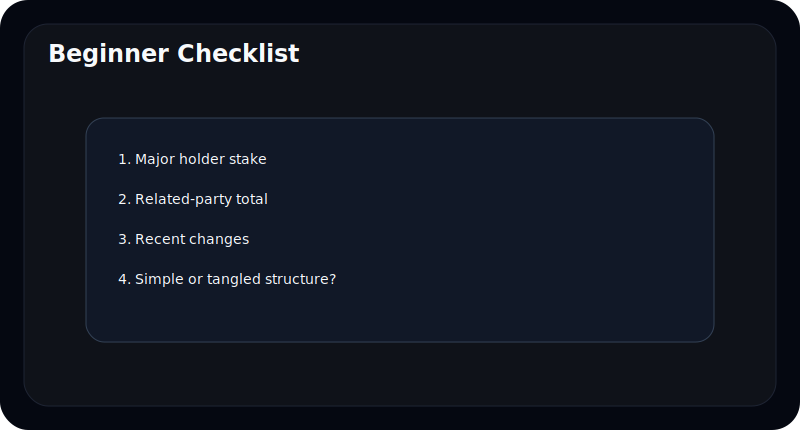

# 최대주주와 특수관계인은 어떻게 읽어야 하나

사업보고서에서 많은 초보자는 매출과 이익만 보고 넘어간다. 최대주주 관련 표는 숫자도 작고 이름도 많아서 어렵게 느껴지기 때문이다.

하지만 회사의 방향을 실제로 움직이는 사람은 손익계산서 안에만 있지 않다. **누가 회사를 지배하고 있는가**, **그 지배력이 얼마나 안정적인가**, **어떤 사람들과 묶여 있는가**를 보면 회사 이해도가 크게 올라간다.

이 글은 최대주주와 특수관계인 표를 처음 읽는 사람도 바로 이해할 수 있도록, 지분율, 우호지분, 실질 지배력, 변동 포인트를 쉬운 기준으로 정리한다.

---

## 최대주주 표에서 제일 먼저 볼 것은 무엇인가

처음에는 복잡하게 보이지만, 사실 질문은 세 가지면 충분하다.

- 가장 많은 지분을 가진 사람은 누구인가
- 그 사람과 같은 편으로 볼 수 있는 특수관계인은 누구인가
- 그 묶음이 회사를 얼마나 안정적으로 통제하고 있는가

| 먼저 볼 것 | 왜 중요한가 |
| --- | --- |
| 최대주주 본인 지분 | 형식상 중심 인물 확인 |
| 특수관계인 지분 합계 | 실제 통제력 판단 |
| 최근 변동 | 지배력 강화/약화 여부 확인 |

최대주주 지분이 낮아 보여도, 특수관계인을 합치면 통제력이 매우 강할 수 있다. 반대로 최대주주 이름은 강해 보여도 실제 지분 기반은 약할 수 있다.

---

## 특수관계인은 왜 같이 봐야 하나

특수관계인은 단순한 가족 명단이 아니다. 회사를 같은 방향으로 움직일 가능성이 높은 사람들의 묶음이다.

여기에는 보통 아래가 포함된다.

- 배우자와 직계가족
- 계열회사
- 임원이나 관련 법인
- 사실상 같은 이해관계를 가진 인물

초보자가 가장 자주 하는 실수는 최대주주 개인 지분만 보는 것이다. 실제로는 특수관계인을 합쳐 봐야 의결권 기준의 안정감이 보인다.

| 상황 | 해석 |
| --- | --- |
| 개인 지분은 낮지만 우호지분 합계가 높음 | 통제력은 강할 수 있음 |
| 개인 지분은 높지만 묶음 구조가 약함 | 분쟁이나 변동에 취약할 수 있음 |
| 계열사 지분 비중이 큼 | 그룹 구조를 같이 봐야 함 |

---

## 지분율이 높으면 무조건 좋은가

그렇지는 않다. 지배력이 안정적이라는 뜻일 수는 있지만, 그 자체가 좋은 회사라는 뜻은 아니다.

중요한 것은 아래 균형이다.

- 지배력이 너무 약하지 않은가
- 너무 강한데 견제 장치가 약하지 않은가
- 소수주주와 이해관계가 크게 어긋나지 않는가

초보자 입장에서는 이렇게 보면 쉽다.

| 패턴 | 상대적으로 편한 경우 | 경계할 경우 |
| --- | --- | --- |
| 지배력 | 안정적이되 구조가 단순함 | 얽힌 법인과 관계인이 많음 |
| 변동 | 장기적으로 큰 변화 없음 | 잦은 증감과 복잡한 이동 |
| 설명 | 구조가 명확함 | 누구와 왜 묶이는지 불명확 |

---

## 지분 변동은 왜 중요한가

최대주주와 특수관계인 표는 정적인 표 같지만, 실제로는 **변화**가 중요하다.

예를 들어:

- 최대주주 지분이 꾸준히 늘어나는가
- 특수관계인 쪽으로 지분이 이동하는가
- 계열사나 법인 명의 비중이 커지는가
- 최대주주 지분은 줄지만 우호지분은 유지되는가

변동이 항상 나쁜 것은 아니다. 다만 초보자는 "왜 바뀌었는가"를 꼭 물어야 한다. 단순 정리인지, 지배력 보강인지, 내부 구조 변화인지 의미가 다르기 때문이다.

---

## 초보자가 특히 조심해서 봐야 할 패턴은 무엇인가

아래는 이해하기 쉬운 경고 신호다.

- 최대주주 구조가 너무 복잡해서 한 번에 설명이 안 된다
- 개인보다 계열사와 법인 지분이 지나치게 복잡하게 얽혀 있다
- 최근 몇 년간 변동이 잦은데 설명이 약하다
- 지배력은 강한데 소수주주 보호 장치나 설명이 약하다

이때는 사업보고서 본문만이 아니라 주주총회소집공고, 계열사 구조, 내부거래 관련 공시도 같이 보는 편이 좋다.

---

## 자주 틀리는 해석 4가지

### 1. 최대주주 개인 지분만 본다

특수관계인 합계를 같이 봐야 실제 통제력이 보인다.

### 2. 지분율이 높으면 무조건 좋은 구조라고 생각한다

견제 구조가 약하면 오히려 위험할 수도 있다.

### 3. 변동이 있으면 무조건 부정적으로 본다

중요한 것은 변동 이유와 방향이다.

### 4. 숫자가 작아 보여서 중요하지 않다고 넘긴다

지배구조는 숫자 크기보다 방향성을 보여주는 정보다.

---

## 10분 체크리스트

- 최대주주 개인 지분은 몇 퍼센트인가
- 특수관계인 합계는 어느 정도인가
- 우호지분 구조가 단순한가 복잡한가
- 최근 변동이 있었는가
- 변동 이유가 자연스럽게 설명되는가

---

## FAQ

### 특수관계인은 가족만 뜻하나

아니다. 계열사, 관련 법인, 같은 이해관계를 가진 주체도 포함될 수 있다.

### 최대주주 지분율이 낮으면 나쁜가

반드시 그렇지는 않다. 우호지분과 통제 구조를 같이 봐야 한다.

### 지분 변동은 어디서 확인하나

사업보고서 최대주주 관련 표와 관련 공시를 같이 본다.

### 초보자는 몇 퍼센트면 안정적이라고 봐야 하나

고정 숫자 하나보다, 특수관계인 합계와 구조 단순성을 같이 보는 편이 낫다.

---

## 참고한 공식 자료

- DART 보고서정보: https://dart.fss.or.kr/introduction/content2.do
- 금융감독원 전자공시시스템: https://dart.fss.or.kr/
- OpenDART 개발가이드: https://opendart.fss.or.kr/guide/main.do

---

## 정리

최대주주 표는 단순한 지분율 표가 아니다. 누가 회사를 움직이는지, 그 힘이 얼마나 안정적인지, 어떤 방향으로 변하고 있는지를 보여주는 표다.

초보자도 최대주주 개인 지분, 특수관계인 합계, 최근 변동 세 가지만 잡으면 훨씬 더 깊게 회사를 읽을 수 있다.
