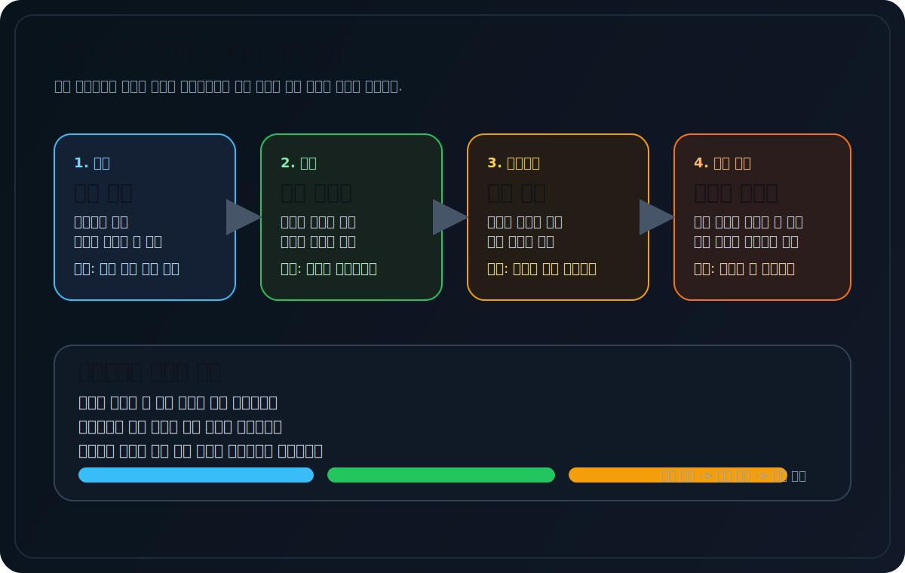
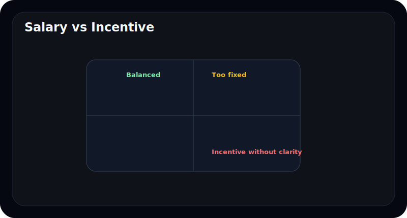
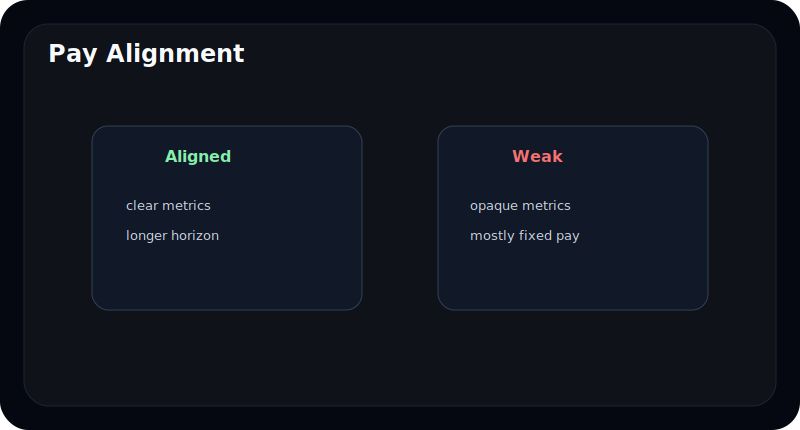
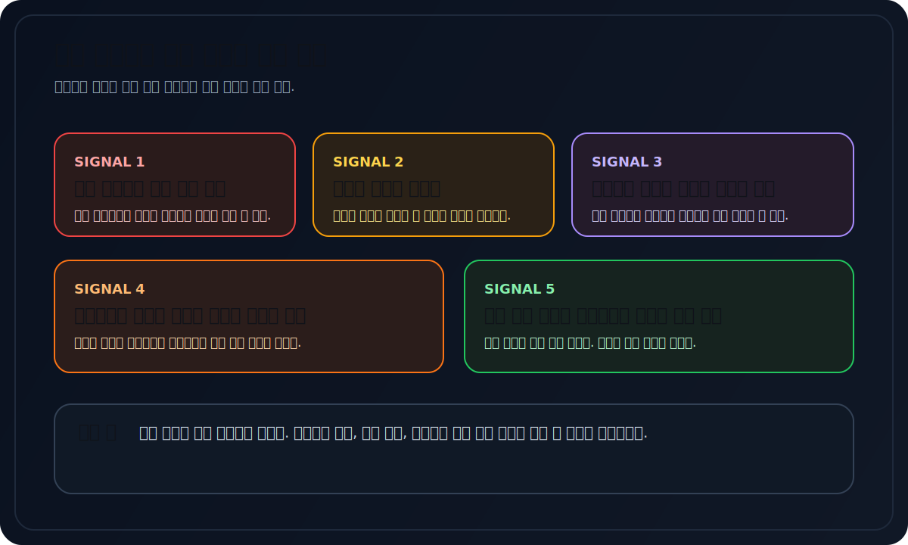

# 임원 보수 공시는 무엇을 말해주나

임원 보수 공시를 보면 초보자는 보통 총액만 본다. "많이 받네", "적게 받네" 정도로 끝나는 경우가 많다.

하지만 진짜 중요한 것은 금액 자체보다 **어떻게 받는가**다. 급여인지, 상여인지, 주식인지, 성과와 연결되어 있는지에 따라 의미가 완전히 달라진다.

이 글은 임원 보수 공시를 처음 읽는 사람도 쉽게 이해할 수 있도록, 보수 구조와 경계 신호를 입문자 기준으로 정리한다.

---

## 임원 보수에서 제일 먼저 볼 것은 무엇인가

보수 공시는 금액보다 구조를 먼저 봐야 한다.

| 항목 | 질문 |
| --- | --- |
| 급여 | 기본 보상이 큰가 |
| 상여 | 성과와 얼마나 연결되는가 |
| 주식기준보상 | 장기 정렬 구조가 있는가 |
| 퇴직/기타 | 일회성 요소가 큰가 |

같은 10억이라도 기본급 중심인지, 성과급 중심인지, 주식 보상 중심인지에 따라 해석이 달라진다.

---

## 많이 받는 것보다 왜 구조가 중요한가

보수는 단순 비용이 아니라 경영진에게 주는 신호다. 회사가 "무엇을 잘하면 보상할 것인가"를 보여준다.

예를 들어:

- 단기 실적만 강하게 보상하면 단기 숫자에 집착할 수 있고
- 장기 주식 보상이 많으면 주주와 이해관계가 맞을 수도 있고
- 설명은 성과중심이라는데 실제로는 고정 보수 비중이 높을 수도 있다

---

## 좋은 보수 구조와 경계할 구조는 어떻게 다른가

초보자는 아래처럼 단순하게 보면 충분하다.

| 구분 | 상대적으로 좋은 구조 | 경계할 구조 |
| --- | --- | --- |
| 고정급 비중 | 지나치게 높지 않음 | 거의 전부 고정 |
| 성과급 기준 | 비교적 설명이 명확함 | 기준이 모호함 |
| 주식 보상 | 장기 성과와 연결 | 단기 현금성 중심 |
| 공시 설명 | 왜 그렇게 주는지 설명 | 숫자만 있고 맥락이 약함 |

좋은 보수 구조는 "많이 주는 구조"가 아니라, **무엇에 대해 주는지가 비교적 명확한 구조**다.

---

## 초보자가 특히 조심해야 할 패턴은 무엇인가

- 실적이 나쁜데도 보수 구조가 거의 안 바뀐다
- 성과급 설명이 추상적이다
- 주주환원은 약한데 보수는 계속 커진다
- 장기성과보다 단기성과 위주다

이런 패턴은 단번에 결론내릴 문제는 아니지만, 경영진과 주주의 이해관계가 얼마나 맞는지 점검하게 만든다.

---

## 보수 공시는 무엇과 같이 봐야 하나

보수 공시는 혼자 읽으면 애매할 수 있다. 그래서 아래와 같이 연결해서 보는 편이 좋다.

- 실적 추세
- 주주환원 정책
- 주주총회소집공고의 보수한도
- 스톡옵션이나 주식기준보상 관련 설명

보수 공시가 유용한 이유는 "경영진이 무엇에 보상받는가"를 통해 회사가 실제로 무엇을 중시하는지 보여주기 때문이다.

---

## 자주 틀리는 해석 4가지

### 1. 보수 총액만 본다

구조를 보지 않으면 의미가 거의 없다.

### 2. 많으면 무조건 나쁘다고 본다

업종과 회사 규모에 따라 다르다. 구조와 설명을 같이 봐야 한다.

### 3. 성과급이면 무조건 좋다고 본다

무엇을 성과로 보는지가 더 중요하다.

### 4. 보수 공시는 기사거리일 뿐이라고 생각한다

실제로는 경영진과 주주의 정렬 수준을 보여주는 힌트다.

---

## 10분 체크리스트

- 고정급과 성과급 비중이 어떤가
- 성과 기준이 설명되는가
- 주식 보상이 있는가
- 실적과 주주환원 흐름과 맞는가
- 보수한도나 구조가 갑자기 커졌는가

---

## FAQ

### 임원 보수가 많으면 무조건 나쁜가

아니다. 구조와 성과 연동을 같이 봐야 한다.

### 고정급이 많으면 왜 문제인가

성과와 연결이 약해질 수 있기 때문이다.

### 주식 보상은 무조건 좋은가

항상 그렇지는 않다. 조건과 기간을 같이 봐야 한다.

### 초보자는 무엇만 봐도 도움이 되나

급여, 상여, 주식 보상, 설명 문구 네 가지만 봐도 충분하다.

---

## 참고한 공식 자료

- DART 보고서정보: https://dart.fss.or.kr/introduction/content2.do
- 금융감독원 전자공시시스템: https://dart.fss.or.kr/
- OpenDART 개발가이드: https://opendart.fss.or.kr/guide/main.do

---

## 정리

임원 보수 공시는 돈 자랑표가 아니다. 경영진이 무엇에 대해 보상받는지, 그 구조가 주주와 얼마나 맞는지를 보여주는 표다.

초보자도 총액보다 구조를 먼저 보면 훨씬 더 많은 것을 읽을 수 있다.
