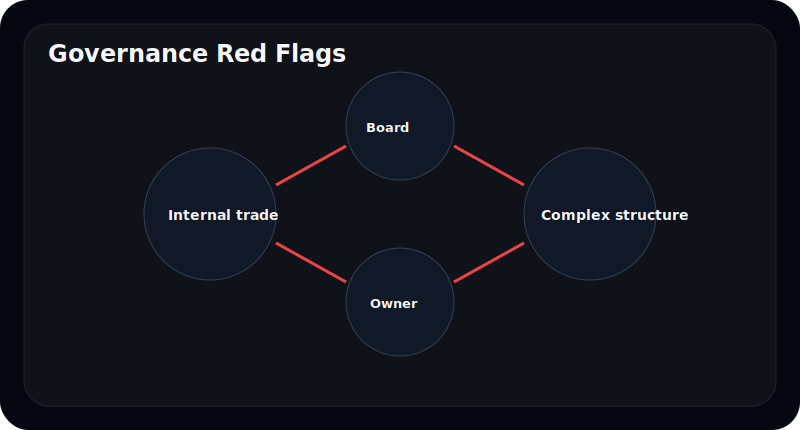
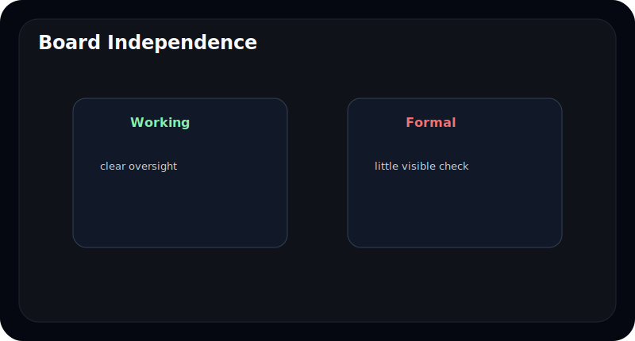
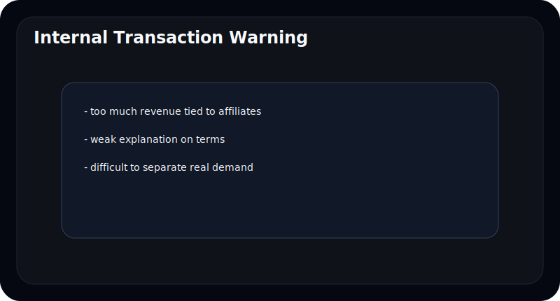
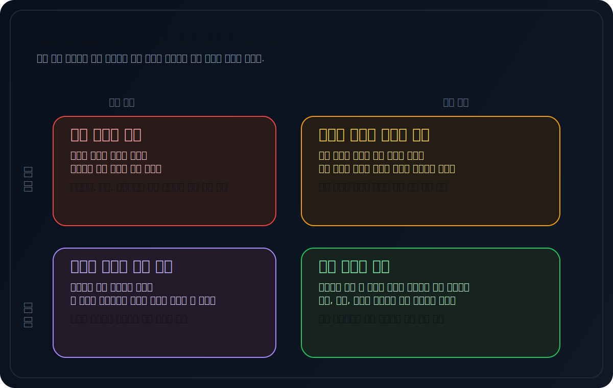
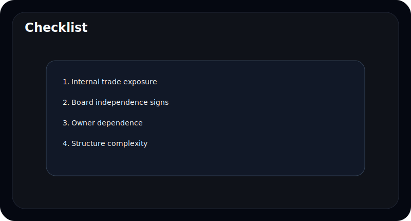

# 지배구조가 위험한 회사는 어떤 패턴을 보이나

지배구조라는 말은 어렵게 들린다. 그래서 많은 초보자는 "전문가만 보는 영역"이라고 생각한다.

하지만 실제로는 그렇게 복잡하게 볼 필요가 없다. 지배구조에서 중요한 것은 법률 용어보다 **반복되는 패턴**이다.

이 글은 초보자도 바로 이해할 수 있도록, 위험한 지배구조에서 자주 보이는 패턴을 쉬운 언어로 정리한다.

---

## 지배구조를 왜 봐야 하나

지배구조는 누가 회사를 움직이고, 누가 견제하고, 누가 이익을 가져가는 구조인지 보여준다.

숫자가 좋아 보여도 지배구조가 약하면:

- 소수주주와 이해가 어긋날 수 있고
- 내부거래가 과해질 수 있고
- 중요한 의사결정이 한쪽으로 쏠릴 수 있다

---

## 초보자가 가장 먼저 봐야 할 위험 신호는 무엇인가

아래 네 가지만 봐도 도움이 된다.

- 내부거래 의존이 큰가
- 이사회가 형식적으로만 존재하는가
- 오너 한 사람에게 너무 많이 의존하는가
- 계열사 구조가 지나치게 복잡한가

| 신호 | 왜 중요한가 |
| --- | --- |
| 내부거래 의존 | 이익의 질과 공정성 문제 가능성 |
| 이사회 독립성 약함 | 견제 기능 약화 |
| 오너 의존 | 승계, 의사결정 리스크 |
| 복잡한 관계회사 구조 | 실질 흐름이 안 보일 수 있음 |

---

## 내부거래가 왜 자주 경고 신호가 되나

모든 내부거래가 나쁜 것은 아니다. 그룹 구조상 자연스럽게 발생할 수도 있다. 문제는 **얼마나 의존적인가**, **조건이 얼마나 투명한가**다.

초보자는 이렇게 생각하면 된다.

- 매출이나 이익이 계열사에 너무 묶여 있지 않은가
- 내부거래 비중이 높아도 설명이 충분한가
- 외부 경쟁 없이 같은 그룹 안에서만 돈이 도는 것은 아닌가

---

## 이사회가 형식적이라는 것은 무슨 뜻인가

이사회 인원이 많다고 자동으로 좋은 구조는 아니다. 초보자가 봐야 하는 것은 **형식이 아니라 기능**이다.

예를 들어:

- 사외이사가 많아도 역할 설명이 약하다
- 중요한 결정이 늘 비슷한 흐름으로 통과된다
- 오너 또는 경영진 의존성이 너무 강하다

그렇다고 이사회 문서를 전문적으로 읽을 필요는 없다. 다만 "견제 장치가 실제로 작동하는 분위기인가" 정도는 볼 수 있다.

---

## 오너 의존이 왜 위험할 수 있나

한 사람이 강하게 리드하는 구조가 항상 나쁜 것은 아니다. 문제는 그 사람 없이는 구조가 잘 안 돌아갈 때다.

오너 의존이 큰 구조에서는:

- 승계 이슈가 크게 흔들릴 수 있고
- 장기적으로 경영진 풀(pool)이 얕을 수 있고
- 판단 기준이 지나치게 한 사람에게 쏠릴 수 있다

---

## 계열사 구조가 복잡하면 왜 불편한가

복잡한 구조 자체가 죄는 아니다. 다만 초보자 입장에서는 돈과 통제의 흐름이 안 보이는 순간부터 위험도가 올라간다.

좋은 구조는 설명이 가능하다. 반대로 위험한 구조는 읽고 나서도 "누가 무엇을 왜 갖고 있는지" 잘 안 정리된다.

---

## 자주 틀리는 해석 4가지

### 1. 지배구조는 전문가만 보는 영역이라고 생각한다

기본 패턴만 봐도 충분히 도움이 된다.

### 2. 내부거래는 전부 나쁘다고 생각한다

비중과 설명 수준이 더 중요하다.

### 3. 이사회 인원 수만 본다

작동 여부가 더 중요하다.

### 4. 오너가 강하면 무조건 좋은 회사라고 생각한다

견제와 후계 구조가 약하면 오히려 취약할 수 있다.

---

## 10분 체크리스트

- 내부거래 의존이 큰가
- 이사회가 실제 견제 역할을 하는가
- 오너 한 사람 의존이 지나치지 않은가
- 관계회사 구조가 지나치게 복잡하지 않은가
- 설명이 구조를 충분히 이해하게 만드는가

---

## FAQ

### 내부거래가 있으면 무조건 나쁜가

아니다. 다만 비중과 투명성이 중요하다.

### 사외이사가 많으면 좋은 회사인가

항상 그런 것은 아니다. 실제 역할이 중요하다.

### 오너 중심 회사는 다 위험한가

아니다. 다만 견제와 승계 구조를 같이 봐야 한다.

### 초보자는 무엇만 봐도 되나

내부거래, 이사회, 오너 의존, 관계회사 구조 네 가지면 충분하다.

---

## 참고한 공식 자료

- DART 보고서정보: https://dart.fss.or.kr/introduction/content2.do
- 금융감독원 전자공시시스템: https://dart.fss.or.kr/
- OpenDART 개발가이드: https://opendart.fss.or.kr/guide/main.do

---

## 정리

지배구조는 어렵게 느껴지지만, 실제로는 반복되는 위험 패턴을 보는 일에 가깝다. 내부거래 의존, 형식적 이사회, 오너 의존, 복잡한 구조 같은 신호는 초보자도 충분히 읽을 수 있다.

중요한 것은 법률 지식보다 구조를 설명할 수 있느냐다.
