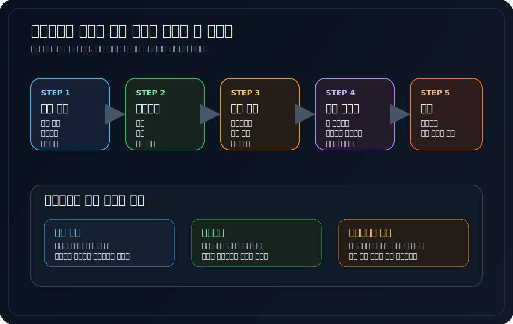
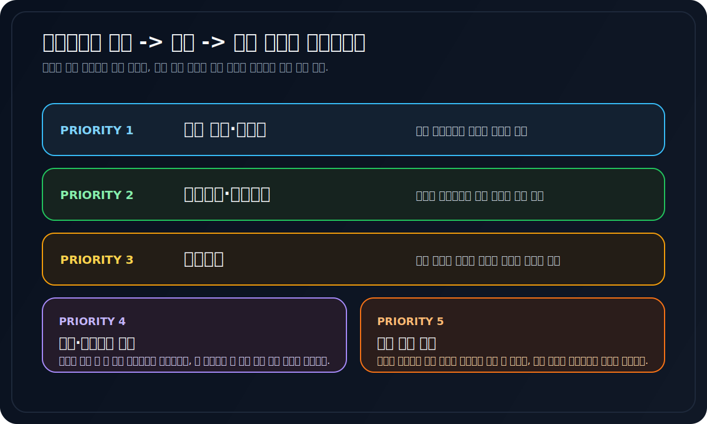
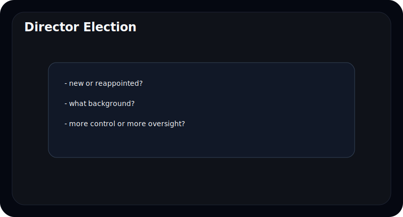
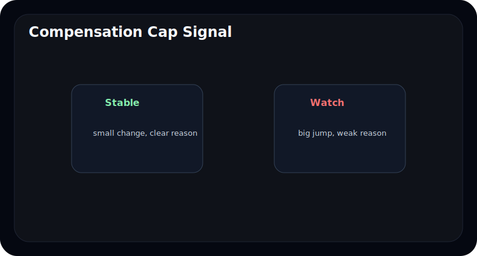
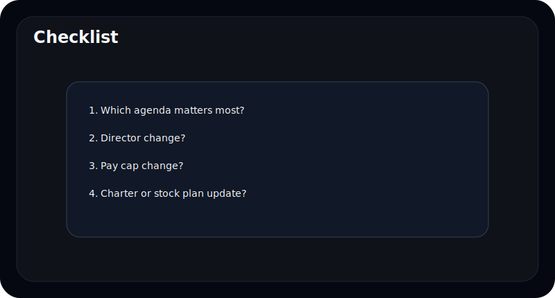

# 주주총회소집공고에서 꼭 봐야 할 것은 무엇인가

주주총회소집공고는 많은 초보자에게 딱딱한 일정 안내문처럼 보인다. 날짜, 장소, 안건 정도만 적힌 문서라고 생각하기 쉽다.

하지만 실제로는 회사의 중요한 결정이 이 안건 안에 들어 있다. 이사 선임, 보수한도, 정관변경, 스톡옵션, 자본정책 같은 내용은 주주총회소집공고를 통해 먼저 볼 수 있다.

이 글은 주주총회소집공고를 처음 읽는 사람도 쉽게 이해할 수 있도록, 어떤 안건을 먼저 보고 무엇을 조심해야 하는지 정리한다.

---

## 주주총회소집공고에서 먼저 볼 것은 무엇인가

가장 중요한 것은 `언제 열리는가`보다 `무슨 안건이 올라왔는가`다.

초보자 기준으로는 아래 우선순위가 좋다.

1. 이사 선임/재선임
2. 보수한도
3. 정관변경
4. 주식기준보상, 스톡옵션
5. 배당이나 자본정책 관련 안건

| 안건 | 왜 중요한가 |
| --- | --- |
| 이사 선임 | 누가 회사를 움직일지 결정 |
| 보수한도 | 보상 구조 변화 힌트 |
| 정관변경 | 회사 규칙 자체 변경 |
| 스톡옵션 | 향후 보상과 희석 가능성 |

---

## 이사 선임 안건은 왜 중요하나

이사 선임은 이름만 바뀌는 일이 아니다. 회사 의사결정의 방향이 바뀔 수 있는 안건이다.

초보자는 아래 질문 정도만 해도 충분하다.

- 새로 들어오는 사람은 어떤 배경인가
- 재선임이라면 왜 계속 필요한가
- 오너 측 인물인지, 독립성이 기대되는 인물인지

---

## 보수한도 안건은 왜 같이 봐야 하나

많은 사람이 보수한도 안건을 그냥 지나친다. 하지만 이 안건은 향후 보상 구조가 얼마나 커질 수 있는지 보여준다.

초보자가 볼 것은 딱 두 가지다.

- 한도가 갑자기 크게 늘었는가
- 그 변화에 대한 설명이 있는가

한도 자체가 바로 지급액은 아니지만, 경영진 보상 구조의 방향을 보여주는 신호일 수 있다.

---

## 정관변경과 스톡옵션은 어떻게 봐야 하나

정관변경은 회사의 규칙을 바꾸는 안건이다. 그래서 문구가 짧아 보여도 실제 영향은 클 수 있다.

스톡옵션이나 주식기준보상 관련 안건도 중요하다. 초보자는 아래만 보면 된다.

- 누구에게 주는가
- 어떤 조건으로 주는가
- 주주 입장에서 희석 가능성이 큰가

---

## 자주 틀리는 해석 4가지

### 1. 일정 안내문이라고 생각하고 건너뛴다

실제로는 중요한 안건이 들어 있는 문서다.

### 2. 이사 이름만 보고 끝낸다

배경과 역할을 같이 봐야 한다.

### 3. 보수한도는 실제 지급액이 아니니 안 봐도 된다고 생각한다

방향성을 읽는 데 중요하다.

### 4. 정관변경은 법무팀 일이라고 넘긴다

회사 규칙 자체가 바뀌는 문제일 수 있다.

---

## 10분 체크리스트

- 어떤 안건이 올라왔는가
- 이사 선임 배경이 무엇인가
- 보수한도가 크게 바뀌는가
- 정관변경이 중요한 규칙을 건드리는가
- 스톡옵션이나 주식보상 관련 안건이 있는가

---

## FAQ

### 주주총회소집공고는 꼭 봐야 하나

중요 안건이 몰려 있어 보는 편이 좋다.

### 이사 선임 안건에서 가장 먼저 볼 것은 무엇인가

누구인지보다 왜 올라왔는지를 보는 편이 좋다.

### 보수한도는 실제 지급액과 같은가

아니다. 하지만 향후 보상 구조의 범위를 보여준다.

### 정관변경은 왜 중요한가

회사 운영 규칙 자체가 바뀔 수 있기 때문이다.

---

## 참고한 공식 자료

- DART 보고서정보: https://dart.fss.or.kr/introduction/content2.do
- 금융감독원 전자공시시스템: https://dart.fss.or.kr/
- OpenDART 개발가이드: https://opendart.fss.or.kr/guide/main.do

---

## 정리

주주총회소집공고는 행사 공지가 아니라 회사의 중요한 의사결정 안건 모음이다. 초보자도 이사 선임, 보수한도, 정관변경, 스톡옵션 안건만 먼저 보면 충분히 많은 정보를 읽을 수 있다.

읽기 어려운 문서처럼 보여도, 사실은 질문만 잘 정하면 꽤 실용적인 문서다.
