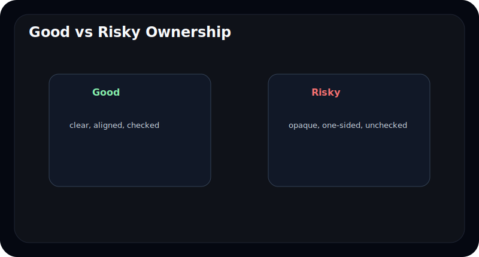
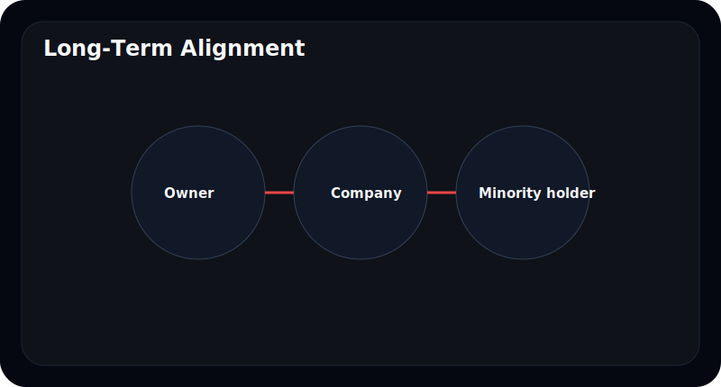
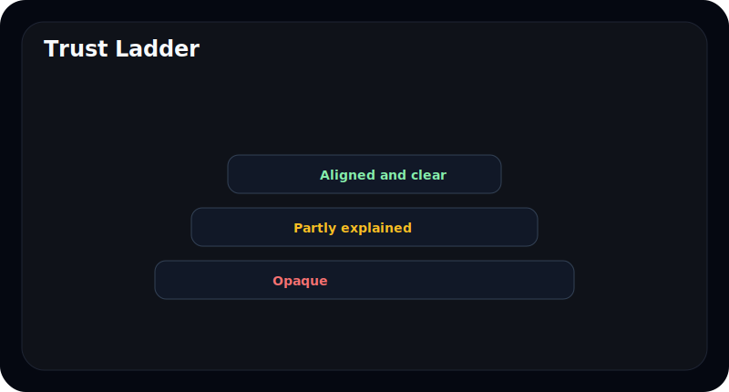
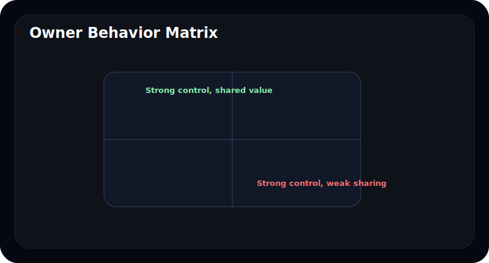
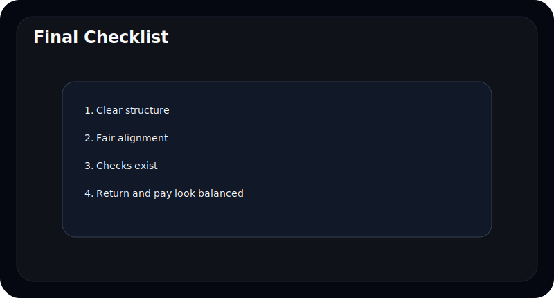

# 좋은 오너십과 위험한 오너십의 차이

오너십을 이야기하면 종종 극단으로 간다. "오너가 강해야 좋다" 혹은 "오너 중심이면 위험하다"처럼 단순하게 말하기 쉽다.

하지만 실제로는 둘 다 맞을 수도 있고 틀릴 수도 있다. 중요한 것은 강한가 약한가가 아니라 **주주와 얼마나 같은 방향을 보고 있는가**, 그리고 **견제와 설명 구조가 있느냐**다.

이 글은 좋은 오너십과 위험한 오너십의 차이를 초보자도 이해할 수 있도록 쉽게 정리한다.

---

## 좋은 오너십은 무엇이 다른가

좋은 오너십은 단순히 오래 회사를 가진 구조가 아니다. 아래 특징이 같이 나타난다.

- 지배력이 설명 가능하다
- 소수주주와 이해가 완전히 어긋나지 않는다
- 주주환원과 보수 구조가 과하게 비틀려 있지 않다
- 의사결정 구조가 한 사람에게만 잠겨 있지 않다

| 좋은 오너십의 특징 | 의미 |
| --- | --- |
| 구조가 단순함 | 이해하기 쉽고 예측 가능 |
| 설명이 충분함 | 신뢰가 올라감 |
| 주주환원과 연결 | 소수주주와 이해 정렬 가능 |
| 견제 장치 존재 | 리스크 완화 |

---

## 위험한 오너십은 어떤 패턴을 보이나

위험한 오너십도 비슷한 패턴으로 반복된다.

- 지배력은 강한데 구조 설명이 약하다
- 오너와 회사의 경계가 흐리다
- 소수주주 관점이 약하다
- 보수, 내부거래, 자본정책이 오너 쪽으로 기울어 보인다

---

## 강한 오너십이 언제 장점이 되나

강한 오너십은 장기 투자와 빠른 결정을 가능하게 할 수 있다. 특히:

- 장기 전략을 일관되게 밀어야 할 때
- 단기 실적보다 긴 호흡이 필요한 산업일 때
- 경영진 교체가 잦지 않은 구조가 필요할 때

다만 장점이 되려면 조건이 있다. 설명이 충분하고, 주주와 이해가 크게 어긋나지 않아야 한다.

---

## 강한 오너십이 언제 위험해지나

강한 오너십은 견제가 약할 때 위험해진다.

예를 들어:

- 내부거래가 커지는데 설명이 약하다
- 보수 구조가 자기편에게 유리하게 보인다
- 자본정책이 소수주주보다 지배력 유지에 더 가까워 보인다

---

## 초보자가 가장 쉽게 볼 수 있는 판단 기준은 무엇인가

초보자에게는 아래 네 가지가 가장 실용적이다.

| 질문 | 왜 중요한가 |
| --- | --- |
| 구조가 설명 가능한가 | 복잡성은 위험 신호가 되기 쉬움 |
| 내부거래가 과하지 않은가 | 이해 상충 가능성 확인 |
| 주주환원과 보수 구조가 균형적인가 | 이해 정렬 확인 |
| 오너가 강해도 견제 장치가 있는가 | 위험 완화 여부 확인 |

---

## 자주 틀리는 해석 4가지

### 1. 오너가 강하면 무조건 좋다고 본다

견제 장치가 약하면 오히려 위험할 수 있다.

### 2. 오너 중심 구조면 무조건 나쁘다고 본다

설명과 정렬이 잘 되면 장점도 있다.

### 3. 지분율만 보고 끝낸다

보수, 주주환원, 내부거래까지 같이 봐야 한다.

### 4. 지배구조는 숫자와 별개라고 생각한다

실제로는 회사 방향과 숫자에 큰 영향을 준다.

---

## 10분 체크리스트

- 구조가 단순하고 설명 가능한가
- 내부거래가 과도하지 않은가
- 주주환원과 보수 구조가 균형적인가
- 오너가 강해도 견제 장치가 있는가
- 소수주주와 이해가 크게 어긋나지 않는가

---

## FAQ

### 오너십이 강하면 좋은 회사인가

항상 그런 것은 아니다. 정렬과 견제 구조를 같이 봐야 한다.

### 지분율이 높으면 소수주주에게 항상 불리한가

반드시 그렇지는 않다. 실제 행동과 구조가 더 중요하다.

### 초보자는 무엇만 봐도 되나

구조 단순성, 내부거래, 주주환원, 보수 네 가지만 봐도 큰 도움이 된다.

### 결국 가장 중요한 한 가지는 무엇인가

오너와 소수주주의 이해가 같은 방향을 보느냐다.

---

## 참고한 공식 자료

- DART 보고서정보: https://dart.fss.or.kr/introduction/content2.do
- 금융감독원 전자공시시스템: https://dart.fss.or.kr/
- OpenDART 개발가이드: https://opendart.fss.or.kr/guide/main.do

---

## 정리

좋은 오너십은 강한 통제력만으로 만들어지지 않는다. 설명 가능성, 주주와의 정렬, 견제 구조가 같이 있어야 한다.

초보자도 지분율 하나만 보지 않고 구조, 내부거래, 보수, 주주환원을 같이 보면 오너십을 훨씬 더 깊게 읽을 수 있다.
