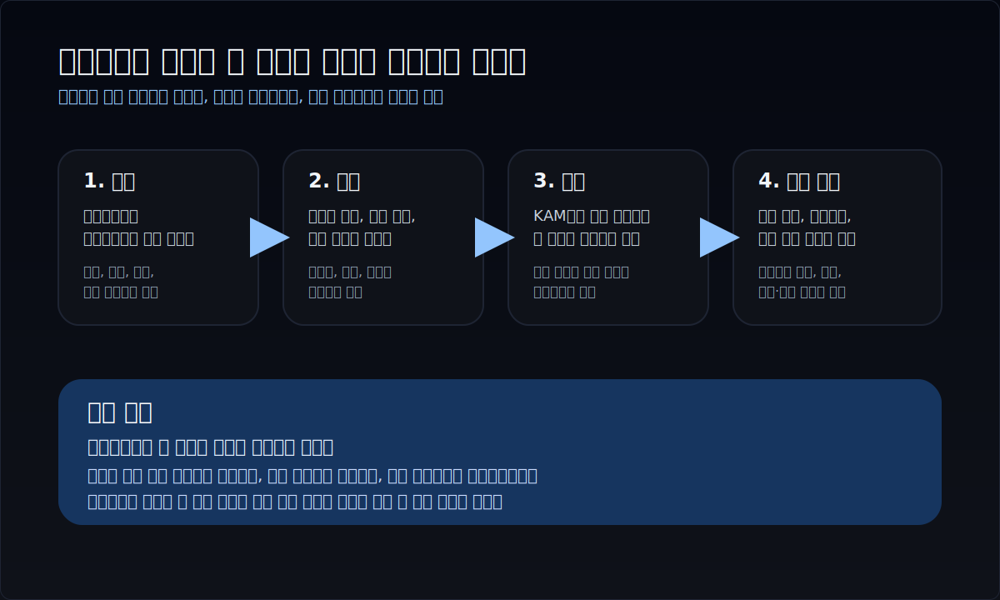
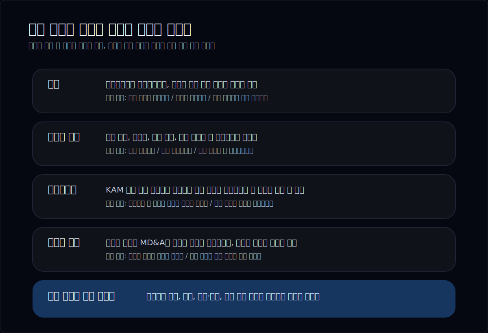
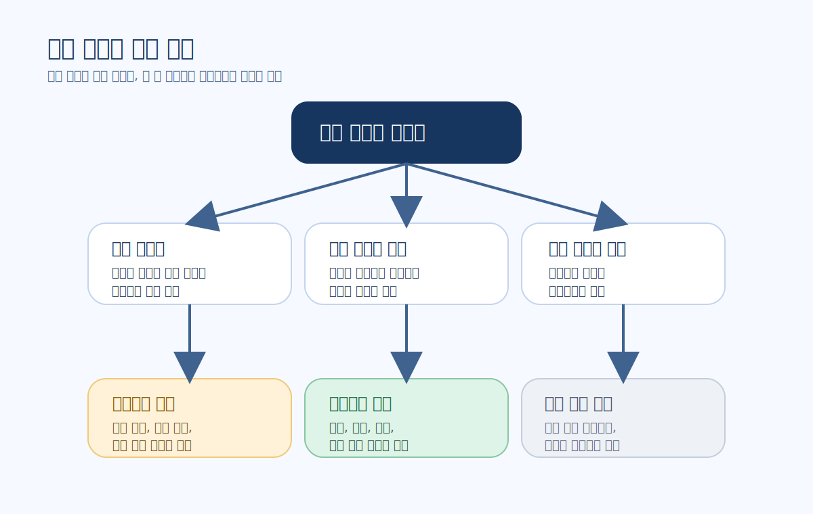
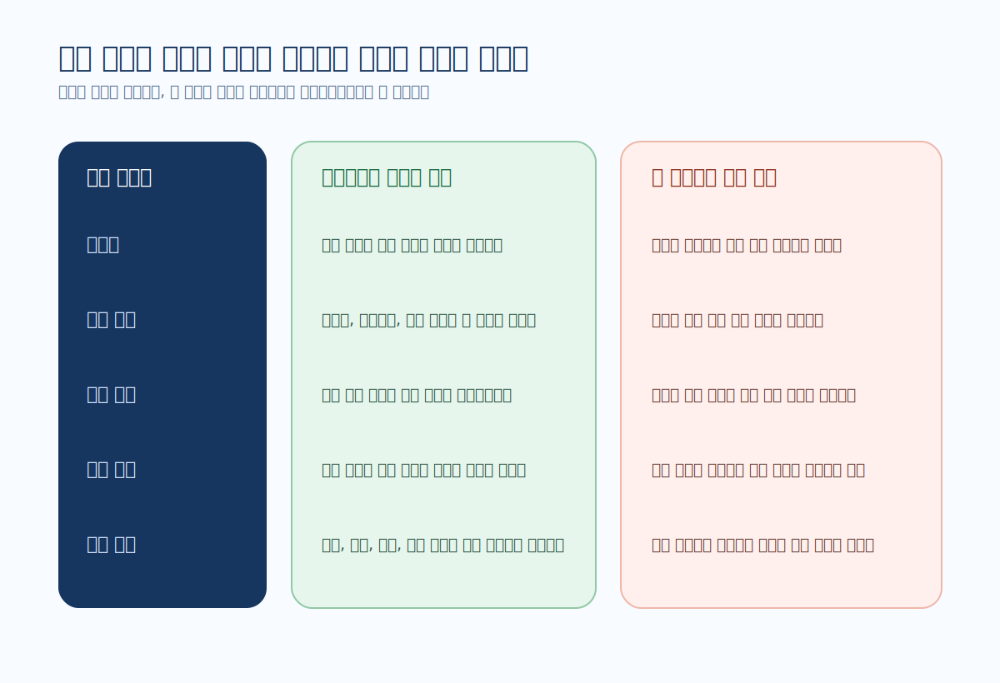
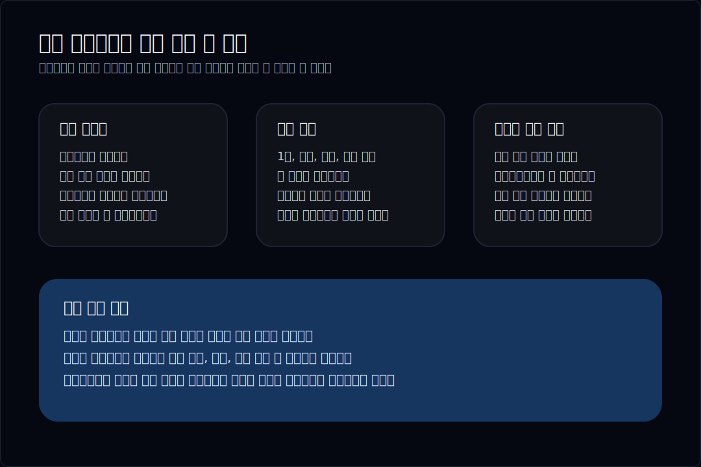

# 우발부채와 소송 공시 읽는 법

우발부채와 소송은 초보자가 가장 자주 놓치는 공시 축 중 하나다. 이유는 단순하다. 이 이슈는 대개 한 줄 headline으로 크게 보이지 않고, 사업보고서 본문 여러 군데에 흩어져 있기 때문이다.

그래서 먼저 답부터 말하면, 우발부채와 소송은 아래 순서로 읽는 편이 가장 안전하다.

1. 주석에서 `충당부채`인지 `우발부채`인지 먼저 가른다.
2. 사업보고서의 `그 밖에 투자자 보호에 관한 사항`이나 소송 관련 문구를 붙여 본다.
3. 감사보고서와 KAM에서 같은 이슈가 더 강하게 언급되는지 확인한다.
4. 다음 분기나 다음 사업보고서, 정정공시, 사건성 공시에서 실제 현금 유출이나 합의 결과로 이어지는지 추적한다.

즉 이 주제는 "소송이 있나 없나"를 찾는 작업이 아니다. **회사가 이미 비용으로 잡았는지, 아직 숫자로 안 잡았지만 설명은 하고 있는지, 아니면 문구만 흐리게 남겨 두는지**를 가르는 작업에 가깝다.

이 글은 `주석 -> 투자자 보호 -> 감사보고서 -> 후속 추적` 흐름으로 우발부채와 소송을 읽는 방법을 정리한다. 감사보고서 자체를 먼저 읽는 법은 [`사업보고서에서 감사보고서와 KAM 읽는 법`](/blog/audit-report-and-kam), 리스크 문구와 경영진 설명을 묶어 읽는 법은 [`Risk Factors와 MD&A를 같이 읽는 법`](/blog/risk-factors-and-mdna)과 함께 보면 더 잘 맞물린다.

---

## 우발부채와 소송은 보고서의 어느 층에 흩어져 있나

많은 사람이 소송 이슈를 찾을 때 사업보고서 검색창에 `소송`만 넣고 끝낸다. 하지만 실제로는 하나의 층만 보면 거의 항상 부족하다.

실전에서는 아래 다섯 층을 같이 보는 편이 좋다.

| 층 | 보통 어디에 나오나 | 왜 같이 봐야 하나 |
| --- | --- | --- |
| 회계 주석 | 충당부채, 우발부채, 보증, 지급보증, 약정 | 회계상 이미 비용을 잡았는지 확인하게 해준다 |
| 사업보고서 본문 | 그 밖에 투자자 보호에 관한 사항, 소송 등의 현황 | 사건의 배경과 당사자, 진행 상황이 더 잘 보인다 |
| 감사보고서 | KAM, 강조사항, 계속기업 관련 문구 | 감사인이 이 이슈를 얼마나 민감하게 봤는지 드러난다 |
| 경영진 설명 | 리스크 문구, MD&A, 사업의 내용 | 회사가 이 문제를 어떻게 설명하고 있는지 본다 |
| 후속 공시 | 다음 분기보고서, 사업보고서, 주요사항보고서, 정정 | 실제 지급, 합의, 충당부채 사용 또는 환입으로 이어지는지 본다 |

DART 소개의 `보고서정보`도 정기공시, 주요사항보고, 외부감사 관련 보고서를 따로 구분한다. 실전적으로 중요한 이유는 명확하다. 우발부채와 소송은 한 문서에서 끝나는 주제가 아니라, **정기보고서와 감사보고서, 후속 사건 공시를 가로질러 움직이는 이슈**이기 때문이다.

예를 들어 같은 소송이라도:

- 주석에는 금액 추정이 어렵다고만 적히고
- 투자자 보호 문단에는 사건의 배경이 나오고
- 감사보고서에는 충당부채 판단이 민감하다고 적히고
- 다음 분기에는 실제 현금 유출이 나타날 수 있다

이렇게 층마다 말하는 정보가 다르다. 그래서 우발부채와 소송은 찾는 것보다 **겹쳐 읽는 습관**이 더 중요하다.

---

## 재무제표에 안 잡혀도 왜 크게 봐야 하나

초보자가 가장 자주 하는 착각은 이거다. "대차대조표에 큰 충당부채가 안 보이니 별일 아니겠지."

하지만 회계 기준은 그렇게 단순하지 않다. IAS 37은 현재 의무가 있고 자원 유출 가능성이 높으며 금액을 합리적으로 추정할 수 있을 때 충당부채를 인식하게 한다. 반대로 아직 지급 가능성이 확률적으로 애매하거나 금액을 신뢰성 있게 측정하기 어려우면, 재무상태표에 바로 잡지 않고 `우발부채`로 주석에 공시하게 된다.

실전 해석으로 바꾸면 아래처럼 읽으면 된다.

| 회계 처리 | 실무적으로 뜻하는 것 | 투자자가 해야 할 일 |
| --- | --- | --- |
| 충당부채 인식 | 회사가 현재 부담을 비교적 구체적으로 인정했다 | 금액, 사용 시점, 전기 대비 변화 확인 |
| 우발부채 주석 공시 | 문제는 있지만 아직 숫자로 확정하지 못했다 | 사건 규모, 진행 단계, 금액 범위 문구 확인 |
| 문구만 있고 금액이 약함 | 회사 설명이 매우 보수적이거나 불충분할 수 있다 | 감사보고서, 투자자 보호, 후속 공시로 보수적으로 추적 |

중요한 건 `안 잡혔다 = 영향이 작다`가 아니라는 점이다. 오히려 소송, 보증, 손해배상, 규제 이슈는 처음엔 주석 문구로만 보이다가 나중에 충당부채나 실제 현금 유출로 커지는 경우가 많다.

그래서 우발부채와 소송을 읽을 때는 숫자의 현재 크기보다 아래 질문이 더 중요하다.

- 회사가 이미 의무를 인정했는가
- 금액을 왜 아직 확정하지 못한다고 하는가
- 사건이 회사 영업이나 자금조달에 미칠 영향이 큰가
- 다음 보고서에서 숫자로 현실화될 가능성이 큰가

이 질문이 잡히면 우발부채는 "회계 부록"이 아니라, 아직 손익에 다 드러나지 않은 미래 비용 후보처럼 보이기 시작한다.

---

## 충당부채, 우발부채, 소송 문구를 어떻게 가르면 되나

이 파트에서 가장 실용적인 기준은 `인식`, `공시`, `회피` 세 갈래로 나누는 것이다.

아래처럼 간단히 보면 된다.

| 구분 | 보통 문구 특징 | 실전 해석 |
| --- | --- | --- |
| 충당부채 | 소송충당부채, 복구충당부채, 지급보증충당부채 등으로 금액이 잡힘 | 부담을 꽤 구체적으로 인정한 상태다 |
| 우발부채 | 패소 가능성, 보증 이행 가능성, 결과 예측 곤란, 추정 곤란 같은 표현이 많다 | 아직 금액을 고정하지 못한 위험이다 |
| 원격 또는 축약 공시 | 중요 영향이 크지 않다, 가능성이 낮다, 금액 산정이 매우 어렵다 | 정말 작은 이슈일 수도 있지만, 설명이 부족할 수도 있다 |

여기서 중요한 것은 용어 자체보다 **문장 밀도**다. 건강한 공시는 아래 항목을 어느 정도 보여준다.

- 사건 성격: 어떤 소송인지, 누구와의 분쟁인지
- 진행 단계: 제기, 1심, 항소, 조정, 합의, 종결 중 어디인지
- 금액 범위: 청구 금액, 보증 규모, 최대 노출액
- 회사 입장: 패소 가능성을 낮게 보는지, 추정이 어렵다고 보는지
- 회계 처리: 충당부채 설정 여부, 기존 충당부채 사용 또는 환입 여부

반대로 위험한 공시는 아래 패턴이 잦다.

- "중대한 영향은 없을 것으로 예상" 같은 문장이 반복되는데 근거가 없다
- 사건 설명 없이 결과 예측이 어렵다고만 쓴다
- 작년과 문구가 거의 같은데 사건 기간은 길어지고 있다
- 감사보고서에서는 민감하다고 보이는데 주석은 지나치게 짧다

여기서부터는 [`좋은 사업보고서와 위험한 사업보고서의 차이`](/blog/good-vs-risky-business-reports)와 같은 읽기 기준이 그대로 들어온다. 좋은 공시는 문제를 없애지 않는다. 대신 **문제가 어디까지 왔는지**를 더 구체적으로 보여준다.

---

## 좋은 공시와 위험한 공시는 무엇이 다른가

우발부채와 소송은 존재 자체보다 `설명의 질`이 더 중요할 때가 많다. 그래서 좋다 나쁘다를 단정하기보다, 어떤 조합이 더 위험한지 보는 편이 정확하다.

| 관찰 포인트 | 상대적으로 건강한 경우 | 더 조심해야 하는 경우 |
| --- | --- | --- |
| 구체성 | 사건 종류와 단계가 비교적 분명하다 | 분쟁은 있다고 하는데 내용이 흐리다 |
| 금액 정보 | 청구액, 충당부채, 최대 노출액 중 하나는 나온다 | 금액이 거의 없고 추정 곤란만 반복된다 |
| 기간 변화 | 전기 대비 변화와 결과가 업데이트된다 | 해마다 같은 문구만 반복된다 |
| 감사 연결 | KAM 또는 감사 문구와 설명이 일관된다 | 감사 문구는 무거운데 본문 설명은 가볍다 |
| 후속 결과 | 합의, 환입, 사용, 종결이 추적된다 | 다음 보고서로 넘어가도 결론이 흐리다 |

예를 들어 소송이 많아도:

- 사건 종류가 구분돼 있고
- 회사 설명이 매년 업데이트되며
- 충당부채 변동이 자연스럽게 이어지고
- 감사보고서와 모순이 없다면

그 자체로 곧바로 치명적이라고 볼 필요는 없다.

반대로 아래 조합은 더 조심해서 보는 편이 좋다.

- 투자자 보호 문단에서만 소송이 길게 나오고 주석은 지나치게 짧다
- 충당부채가 줄었는데 왜 줄었는지 설명이 빈약하다
- "중대한 영향 없음" 문구가 반복되는데 사건 기간은 길어지고 있다
- 경영진 설명은 낙관적인데 감사보고서나 KAM은 충당부채 판단을 무겁게 본다

이때는 [`사업보고서에서 CEO 말보다 숫자가 중요한 순간`](/blog/when-numbers-matter-more-than-ceo-words)을 떠올리면 좋다. 경영진 낙관보다 회계 처리와 감사 문구가 더 보수적이면, 말보다 숫자와 주석 쪽을 더 무겁게 보는 편이 안전하다.

---

## 감사보고서와 어떻게 연결해야 하나

이 글이 [`사업보고서에서 감사보고서와 KAM 읽는 법`](/blog/audit-report-and-kam)과 갈라지는 지점은 여기다. 014번 글이 `감사보고서를 어떻게 읽는가`에 더 가깝다면, 이 글은 `우발부채와 소송이라는 한 이슈를 감사보고서까지 연결해서 읽는 법`에 더 가깝다.

실전에서는 아래처럼 연결하면 된다.

1. 주석에서 충당부채나 우발부채를 찾는다.
2. 사업보고서 본문에서 사건 배경과 투자자 보호 문구를 붙인다.
3. 감사보고서에서 같은 항목이 KAM 또는 민감 추정으로 등장하는지 본다.
4. 등장한다면 그 이유가 `불확실성`, `금액 추정`, `법적 판단`, `미래 현금유출 규모` 중 무엇인지 본다.

이 연결이 중요한 이유는 간단하다. 소송과 우발부채는 숫자 하나보다 **판단과 불확실성**의 비중이 큰 영역이기 때문이다. 감사인이 이 항목을 민감하게 봤다면, 회사가 말하는 "큰 영향 없음"이라는 문장을 더 보수적으로 읽어야 할 수도 있다.

반대로 감사보고서에서 별도 언급이 없다고 해서 안심하는 것도 성급하다. 모든 소송이 KAM이 되는 것은 아니기 때문이다. 그래서 핵심은 `있다/없다`보다 **같은 이슈가 여러 층에서 같은 방향을 가리키는가**다.

이 프레임은 리스크 문구를 보는 방식과도 연결된다. 소송과 우발부채가 커지는데 [`Risk Factors와 MD&A를 같이 읽는 법`](/blog/risk-factors-and-mdna)에서 말한 경영진 설명이 지나치게 낙관적이면, 그 간극 자체가 신호가 될 수 있다.

---

## 다음 보고서에서는 무엇을 추적해야 하나

우발부채와 소송은 한 번 읽고 끝내면 반쪽만 읽은 셈이다. 가장 중요한 건 그다음 보고서에서 무엇이 달라지는지 보는 것이다.

다음 보고서에서는 보통 아래를 확인한다.

| 이번에 본 것 | 다음에 다시 볼 것 |
| --- | --- |
| 우발부채 문구 | 충당부채 인식으로 이동했는지 |
| 충당부채 금액 | 실제 사용, 환입, 추가 설정이 있었는지 |
| 투자자 보호 소송 설명 | 사건 단계가 진전됐는지, 합의·판결이 있었는지 |
| 감사보고서 민감 문구 | 다음 기수에도 같은 항목이 반복되는지 |
| 자금 부담 우려 | 영업현금흐름, 차입, 보증 실행 가능성이 더 커졌는지 |

특히 아래 변화는 바로 체크할 만하다.

- 주석의 금액이 커졌는가
- 같은 소송이 다음 기수에도 더 구체적으로 적히는가
- 반대로 갑자기 짧아졌다면 종결인지, 그냥 축약인지 설명이 있는가
- 현금흐름표나 주석에서 실제 지급 흔적이 나타나는가
- 정정공시나 사건성 공시에서 새로운 사실이 붙는가

이 추적 습관이 생기면 우발부채는 추상적 위험이 아니라 `아직 숫자로 끝나지 않은 사건`처럼 보인다. 그리고 그때부터 사업보고서 전체가 훨씬 더 연결되기 시작한다.

---

## 10분 확인 체크리스트

- 주석에서 이 이슈가 충당부채인지 우발부채인지 먼저 갈랐는가
- 사업보고서 본문에서 사건 배경과 투자자 보호 문구를 붙여 봤는가
- 금액, 진행 단계, 최대 노출액 중 최소 하나는 확인했는가
- 감사보고서나 KAM에서 같은 항목이 민감하게 다뤄졌는가
- 다음 보고서에서 충당부채 사용, 환입, 추가 설정을 추적할 계획이 있는가
- 경영진의 낙관 문구와 회계 처리 강도가 서로 어긋나지 않는가

---

## FAQ

### 우발부채가 있으면 무조건 위험한가

그렇게 단정하면 안 된다. 중요한 것은 존재 자체보다 규모, 진행 단계, 설명의 구체성, 감사보고서와의 일관성이다.

### 소송이 있는데 충당부채가 없으면 이상한가

항상 그런 것은 아니다. 아직 지급 가능성이 높지 않거나 금액을 합리적으로 추정하기 어려우면 주석 공시만 하는 경우가 있다. 다만 그 설명이 충분한지는 따로 봐야 한다.

### 대차대조표에 안 보이면 영향이 작다고 봐도 되나

아니다. 우발부채와 소송은 처음엔 주석에만 있다가 나중에 충당부채나 실제 현금 유출로 이어질 수 있다.

### 감사보고서에서 언급이 없으면 안심해도 되나

성급하다. 모든 소송이 KAM이 되는 것은 아니다. 주석과 투자자 보호 문구, 다음 보고서 추적까지 같이 봐야 한다.

### 우발부채와 소송 공시를 읽은 뒤 다음으로 무엇을 보면 좋은가

감사 문구 연결은 [`사업보고서에서 감사보고서와 KAM 읽는 법`](/blog/audit-report-and-kam), 리스크 문구 연결은 [`Risk Factors와 MD&A를 같이 읽는 법`](/blog/risk-factors-and-mdna), 말과 숫자 충돌 판단은 [`사업보고서에서 CEO 말보다 숫자가 중요한 순간`](/blog/when-numbers-matter-more-than-ceo-words)을 이어서 보면 좋다.

---

## 같이 읽으면 좋은 글

- [사업보고서 텍스트, 이렇게 읽는다](/blog/reading-business-reports)
- [사업보고서에서 감사보고서와 KAM 읽는 법](/blog/audit-report-and-kam)
- [Risk Factors와 MD&A를 같이 읽는 법](/blog/risk-factors-and-mdna)
- [사업보고서에서 CEO 말보다 숫자가 중요한 순간](/blog/when-numbers-matter-more-than-ceo-words)
- [좋은 사업보고서와 위험한 사업보고서의 차이](/blog/good-vs-risky-business-reports)

---

## 참고한 공식 자료

- [IFRS IAS 37 Provisions, Contingent Liabilities and Contingent Assets](https://www.ifrs.org/issued-standards/list-of-standards/ias-37-provisions-contingent-liabilities-and-contingent-assets/)
- [DART 소개 - 보고서정보](https://dart.fss.or.kr/introduction/content2.do)
- [DART 소개 - 정정신고서 이용시 유의사항](https://dart.fss.or.kr/introduction/content4.do)
- [DART 기업공시길라잡이](https://dart.fss.or.kr/info/main.do?menu=120)

---

## 정리

우발부채와 소송은 대차대조표 한 줄로 끝나는 주제가 아니다. 주석, 투자자 보호, 감사보고서, 후속 공시를 같이 읽어야 실제 부담이 보인다.

가장 실전적인 순서는 단순하다. `충당부채인지 우발부채인지 가른다 -> 사건 배경을 붙인다 -> 감사 문구와 비교한다 -> 다음 보고서에서 현실화를 추적한다.` 이 흐름만 잡아도, 숫자로 아직 다 드러나지 않은 위험을 훨씬 빨리 읽게 된다.
