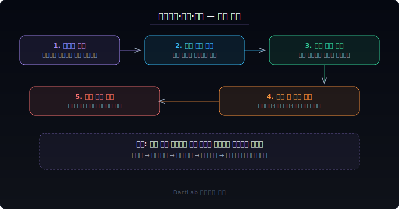
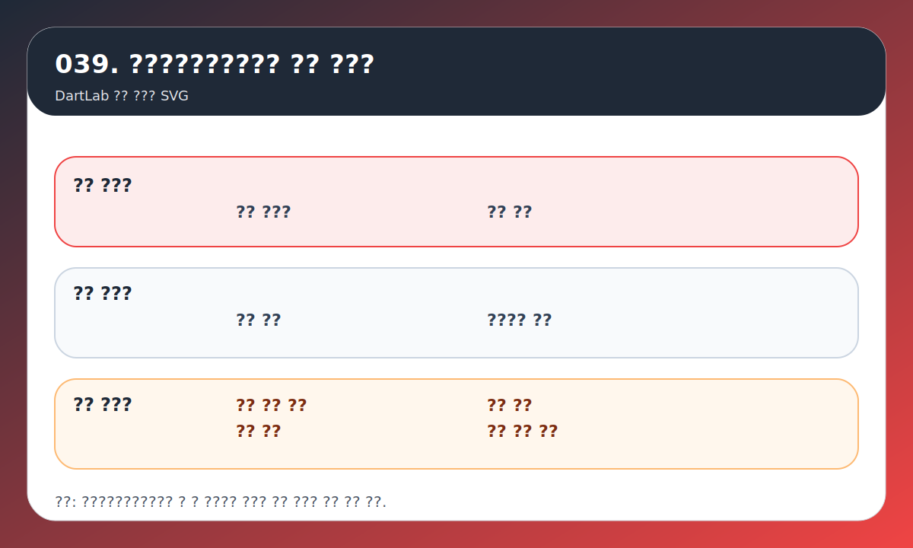
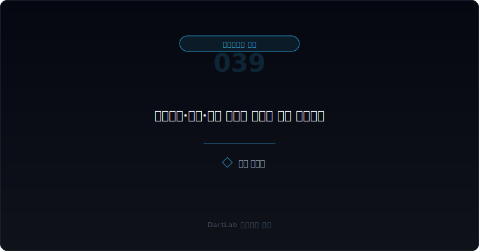
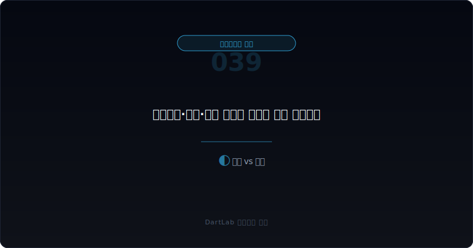
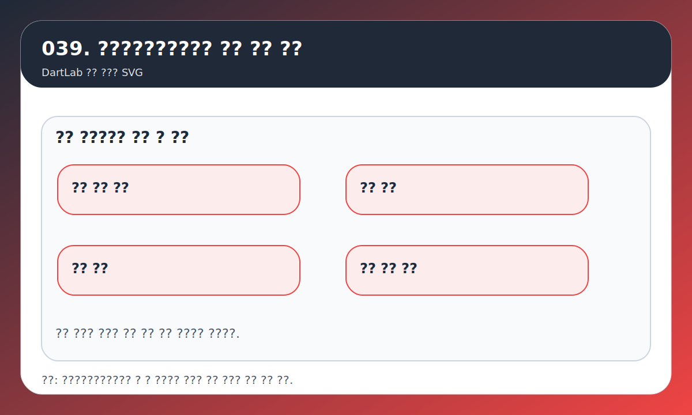

# 지급보증·담보·약정 공시는 어디가 위험 신호인가

지급보증, 담보 제공, 재무약정은 headline이 크지 않은데도 실제로는 회사의 안전성을 크게 바꾸는 항목이다. 초보자는 보통 차입금 숫자부터 본다. 하지만 같은 차입 구조라도 누가 누구를 보증했는지, 어떤 자산을 담보로 묶었는지, 약정이 깨지면 어떤 조기상환이나 추가 담보 요구가 생기는지에 따라 위험의 결이 완전히 달라진다.

특히 이 항목들은 손익계산서보다 늦게 문제를 드러내는 경우가 많다. 당장 이익은 괜찮아 보여도, 관계회사 지원 부담이 커져 있거나 핵심 자산이 이미 담보로 많이 묶여 있거나, 재무약정이 빡빡해진 상태라면 다음 충격에서 훨씬 약하게 드러날 수 있다.

이 글은 지급보증·담보·약정을 `상대방 -> 묶인 자산 -> 약정 조건 -> 위반 시 결과 -> 다음 보고서 추적` 순서로 읽는 법을 정리한다. 기본 경고 신호는 [감사보고서와 KAM은 어디까지 믿어야 하나](/blog/audit-report-and-kam), 우발부채와 소송은 [우발부채와 소송 공시 읽는 법](/blog/contingent-liabilities-and-litigation), 지배구조 신호는 [지배구조가 위험한 회사는 어떤 패턴을 보이나](/blog/governance-red-flags)와 같이 보면 더 잘 이어진다.

---

## 왜 이 질문이 먼저 중요한가

지급보증과 담보 제공은 `남의 문제`처럼 보이기 쉽다. 관계회사 차입을 대신 보증해 준 것일 수도 있고, 금융기관 차입을 위해 자산을 담보로 잡혀 준 것일 수도 있다. 그런데 실제로는 이 구조가 내 회사의 재무 유연성을 먼저 갉아먹는 경우가 많다.

이유는 간단하다.

- 관계회사나 특수관계인을 지원하는 구조일 수 있다.
- 핵심 자산이 이미 담보로 묶여 있어 추가 자금 조달 여력이 줄어들 수 있다.
- 재무약정이 빡빡하면 실적 둔화나 차입 증가가 바로 유동성 압박으로 이어질 수 있다.

즉 지급보증·담보·약정은 `아직 손실이 확정되지 않은 위험`을 보여주는 창이다. 그래서 숫자만 보는 투자자보다 문구와 조건을 같이 보는 투자자가 훨씬 빨리 위험을 감지한다.

---

## 어떤 숫자 조합이 먼저 경고하나

| 먼저 볼 항목 | 왜 중요한가 |
| --- | --- |
| 보증·담보의 상대방 | 관계회사 지원인지, 외부 거래인지 구분한다 |
| 기초 채무 | 무엇을 위해 보증했는지 본다 |
| 묶인 자산 | 현금, 부동산, 주식, 매출채권 중 무엇이 담보인지 본다 |
| 재무약정 | 어느 숫자를 넘으면 문제가 생기는지 본다 |
| 위반 시 결과 | 조기상환, 담보 추가, 차입 제한 가능성을 본다 |
| 후속 공시 연결 | 다음 분기와 정정 공시에서 변화가 있는지 본다 |

실전에서는 이 여섯 줄이 가장 중요하다. 같은 지급보증이라도 영업상 불가피한 거래 보증인지, 부실한 계열사를 떠받치는 구조인지 해석은 완전히 달라진다. 같은 담보 제공도 유휴 자산인지, 회사의 핵심 생산자산인지에 따라 압박 정도가 다르다. 재무약정도 단순 존재 여부보다 `어떤 숫자가 어느 수준으로 묶여 있는지`가 중요하다.

초보자가 자주 놓치는 점은 보증과 담보를 고정된 숫자로 본다는 것이다. 하지만 실제로는 이 구조가 다음 보고서에서 늘어나는지 줄어드는지, 상대방이 더 위험해지는지, 약정이 더 빡빡해지는지가 훨씬 중요하다.

---

## 신호가 강해지는 순서

가장 실용적인 질문은 이것이다. `이 구조가 사업 운영을 위한 보조 장치인가, 아니면 약한 주체를 떠받치는 부담인가`.

여기서 먼저 세 갈래로 나누면 읽기가 쉬워진다.

1. 정상적인 차입 운영 지원
2. 관계회사·특수관계인 지원
3. 유동성 압박을 숨기는 방어 구조

정상적인 운영 지원이라면 보증 상대방과 기초 채무, 담보 자산, 약정 수준이 비교적 분명하고 사업 흐름과도 맞아떨어진다. 반대로 관계회사 지원이 강하면 [최대주주와 특수관계인은 어떻게 읽어야 하나](/blog/major-shareholder-and-related-parties)와 같이 봐야 한다. 왜 그 회사를 도와야 하는지, 실제로 누가 혜택을 받는지 같이 봐야 하기 때문이다.

유동성 압박을 숨기는 방어 구조라면 더 조심해야 한다. 핵심 자산이 계속 묶이고, 약정이 빡빡하고, 정정공시나 후속 차입 공시가 잦다면 이미 재무 유연성이 약해졌을 수 있다. 이 경우에는 [영업현금흐름이 순이익을 부정할 때](/blog/operating-cash-flow-vs-net-income)와 연결해서 보면 더 빨리 이해된다. 현금이 약한 회사는 보증과 담보 구조까지 같이 경직되는 경우가 많기 때문이다.

---

## 위험도를 나누는 기준

| 관찰 포인트 | 상대적으로 건강한 경우 | 더 조심해야 하는 경우 |
| --- | --- | --- |
| 상대방 | 사업상 관계와 목적이 비교적 분명하다 | 특수관계인 지원 성격이 강하다 |
| 담보 자산 | 유휴 자산이거나 제한 범위가 명확하다 | 핵심 자산이 광범위하게 묶여 있다 |
| 약정 수준 | 일반적인 수준이고 설명이 있다 | 작은 실적 악화에도 깨질 수 있어 보인다 |
| 후속 변화 | 다음 보고서에서 축소되거나 안정적이다 | 보증·담보가 반복 확대된다 |
| 설명 수준 | 문서 간 연결이 비교적 자연스럽다 | 주석과 공시 설명이 자주 끊긴다 |

핵심은 절대 금액보다 구조다. 보증 잔액이 크더라도 상대방과 목적, 담보 자산, 약정 수준이 분명하고 점차 줄어드는 중이라면 과하게 해석할 필요는 없다. 반대로 금액이 아주 크지 않아도 핵심 자산이 묶여 있고, 특수관계인 지원 성격이 강하고, 약정이 빡빡하면 훨씬 경계해야 한다.

특히 주식담보 제공이나 최대주주 변경과 얽힌 구조는 [자기주식·제3자배정·최대주주 변경은 누구에게 유리한가](/blog/treasury-stock-third-party-allotment-and-major-shareholder-change)와 같이 보면 좋다. 명목상 차입 구조가 사실상 지배력 유지 장치로 작동하는 경우가 있기 때문이다.

---

## 어떤 조합이면 더 빨리 경계해야 하나

실전에서는 지급보증·담보·약정만 단독으로 움직이지 않는다. 몇 가지 조합이 같이 보이면 훨씬 더 빨리 경계해야 한다.

첫째, `영업현금흐름 약화 + 담보 확대` 조합이다. 현금이 약해지는데 핵심 자산까지 더 묶이면 재무 유연성이 빠르게 줄어든다. 둘째, `특수관계인 지원 + 지급보증 확대` 조합이다. 회사가 스스로를 지키기보다 다른 주체를 떠받치고 있을 가능성이 있다. 셋째, `정정공시 반복 + 약정 설명 변경` 조합이다. 공시 품질과 실제 구조 설명 모두를 더 조심해서 봐야 한다.

넷째, `감사보고서 경고 문구 + 보증·담보 확대` 조합이다. 감사보고서에서 이미 유동성이나 불확실성 관련 신호가 보이는데 보증과 담보 구조가 더 커지면 단일 이슈가 아니라 연쇄 압박일 수 있다. 이런 조합은 한 항목만 볼 때보다 훨씬 무겁다.

이 네 조합만 기억해도 주석 읽기 속도가 빨라진다. 금액 크기보다 어떤 압박이 겹치고 있는지를 보는 편이 실제 위험을 더 빨리 보여준다.

---

## 왜 후속 추적이 특히 중요한가

보증과 담보, 재무약정은 발표 순간보다 변화 속도에서 의미가 더 커진다. 이번 보고서에서 조금 보이던 구조가 다음 보고서에서 더 커지고, 상대방 상태가 더 나빠지고, 약정 조건이 더 빡빡해지면 해석은 완전히 달라진다. 그래서 이 주제는 단일 시점의 금액보다 `반복 확대 여부`가 핵심이다.

또한 이 항목은 사업 성과가 나빠진 뒤에만 움직이는 것이 아니다. 오히려 성과가 나빠지기 전에 이미 안전판이 줄어드는 모습을 먼저 보여주기도 한다. 핵심 자산이 묶이고, 지원 부담이 커지고, 자금 조달 선택지가 줄어드는 구조가 먼저 나타날 수 있기 때문이다.

결국 지급보증·담보·약정은 숫자의 문제이면서 동시에 구조의 문제다. 그래서 단순 부채비율보다 훨씬 더 빨리 위기 신호를 줄 때가 있다.

---

## 자주 놓치는 해석 함정

### 1. 지급보증은 실제 손실이 아니니 가볍게 본다

위험은 손실 발생 이전에 이미 구조 안에 들어와 있을 수 있다.

### 2. 담보 제공은 차입을 위한 일반 절차라고만 생각한다

어떤 자산이 묶였는지, 추가 조달 여력이 줄었는지를 같이 봐야 한다.

### 3. 재무약정 존재 여부만 보고 끝낸다

어떤 지표가 어느 수준으로 묶였는지, 위반 시 결과가 무엇인지가 더 중요하다.

### 4. 관계회사 지원과 영업상 보증을 구분하지 않는다

누구를 위해 왜 보증했는지 모르면 해석이 거의 항상 흐려진다.

---

## 다음 분기에 다시 확인할 숫자

| 이번에 본 것 | 다음에 다시 볼 것 |
| --- | --- |
| 지급보증 규모 | 다음 분기에 줄어드는가, 늘어나는가 |
| 담보 자산 | 더 많은 자산이 추가로 묶이는가 |
| 재무약정 | 같은 약정이 더 빡빡해지는가 |
| 상대방 상태 | 관계회사의 실적과 유동성이 악화되는가 |
| 정정공시·차입 공시 | 구조 설명이 바뀌거나 추가되는가 |
| 감사보고서 문구 | KAM이나 강조 포인트가 연결되는가 |

이 항목은 단일 시점보다 추적이 중요하다. 한 번의 보증과 담보 제공보다, 같은 구조가 반복 확대되는지 보는 편이 훨씬 실전적이다. 반복되면 회사가 스스로 위험을 흡수하기보다 외부 차입과 관계회사 지원으로 버티는 구조일 가능성이 커진다.

---

## 실전 점검 체크리스트

- 누구를 위해 보증하거나 담보를 제공했는가
- 무엇을 위해 보증하거나 담보를 잡았는가
- 핵심 자산이 묶였는가
- 재무약정이 어떤 숫자를 묶는가
- 약정 위반 시 어떤 결과가 생기는가
- 다음 보고서에서 구조가 축소되는지 볼 계획이 있는가

## 특수관계인 지원과 영업상 보증을 왜 꼭 구분해야 하나

보증과 담보가 있다고 해서 모두 같은 위험은 아니다. 핵심은 그 구조가 사업 운영을 위한 것인지, 아니면 특정 관계회사를 떠받치는 구조인지 구분하는 데 있다. 영업상 보증은 거래 구조 안에서 어느 정도 설명될 수 있지만, 특수관계인 지원은 결국 누가 부담을 대신 지는지의 문제로 이어지기 쉽다.

그래서 상대방 이름을 보고 끝내지 말고, 그 주체가 회사 전체에서 어떤 역할을 하는지까지 보는 편이 좋다. 이 구분이 붙는 순간 지급보증과 담보 제공은 단순 금융 문구가 아니라 지배구조와 이해관계 문제로 바뀐다.

## 자주 묻는 질문

### 지급보증이 있으면 무조건 위험한가

항상 그렇지는 않다. 다만 상대방과 목적, 약정 수준이 분명하지 않으면 훨씬 더 조심해서 봐야 한다.

### 담보 제공은 일반적이니 신경 쓰지 않아도 되나

부족하다. 어떤 자산이 묶였는지에 따라 회사의 추가 자금 조달 여력과 재무 유연성이 달라진다.

### 재무약정은 숫자 몇 개만 보면 되나

아니다. 어떤 지표가, 어느 수준으로, 위반 시 어떤 결과와 연결되는지 봐야 한다.

### 무엇을 같이 보면 좋은가

감사보고서, 우발부채, 특수관계인, 영업현금흐름 글을 같이 보면 구조가 훨씬 빨리 보인다.

## 관련 분석 글

- [감사보고서와 KAM은 어디까지 믿어야 하나](/blog/audit-report-and-kam)
- [우발부채와 소송 공시 읽는 법](/blog/contingent-liabilities-and-litigation)
- [지배구조가 위험한 회사는 어떤 패턴을 보이나](/blog/governance-red-flags)
- [최대주주와 특수관계인은 어떻게 읽어야 하나](/blog/major-shareholder-and-related-parties)
- [영업현금흐름이 순이익을 부정할 때](/blog/operating-cash-flow-vs-net-income)

## 공식 출처와 근거

- [IFRS IAS 37 Provisions, Contingent Liabilities and Contingent Assets](https://www.ifrs.org/issued-standards/list-of-standards/ias-37-provisions-contingent-liabilities-and-contingent-assets/)
- [IFRS Agenda Decision - Guarantees Issued on Obligations of Other Entities](https://www.ifrs.org/content/dam/ifrs/supporting-implementation/agenda-decisions/2025/guarantees-issued-on-obligations-of-other-entities-apr-25.pdf)
- [DART 소개 - 보고서정보](https://dart.fss.or.kr/introduction/content2.do)
- [DART 기업공시길라잡이](https://dart.fss.or.kr/info/main.do?menu=120)

## 핵심 정리

지급보증·담보·약정은 아직 손실로 드러나지 않았지만 이미 회사의 재무 유연성을 제한하고 있을 수 있는 구조다. 그래서 금액보다 상대방, 담보 자산, 약정 수준, 위반 시 결과를 같이 봐야 한다.

좋은 읽기는 복잡한 법률 문구를 다 외우는 것이 아니다. 누가 누구를 위해 무엇을 묶었는지, 그 구조가 다음 보고서에서 더 커지는지만 확인해도 위험 신호는 훨씬 빨리 보인다.
