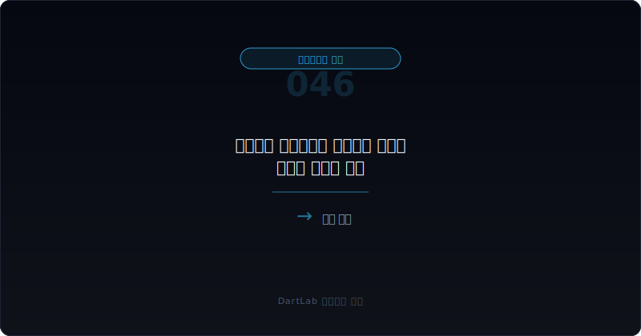
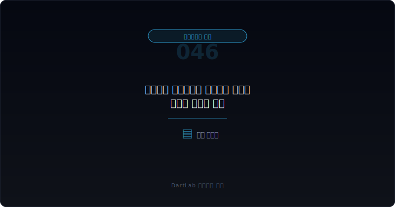
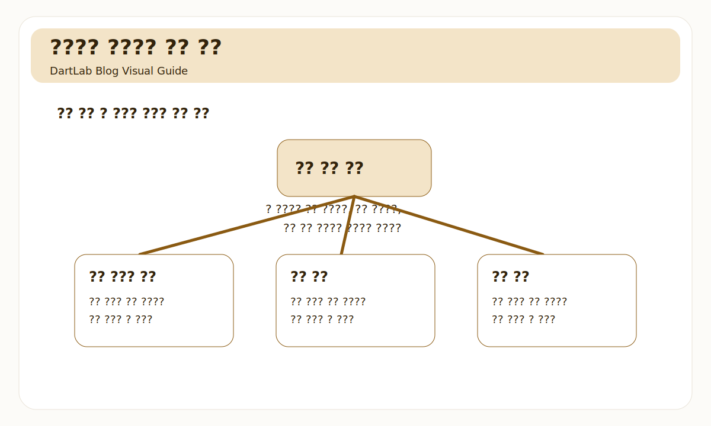
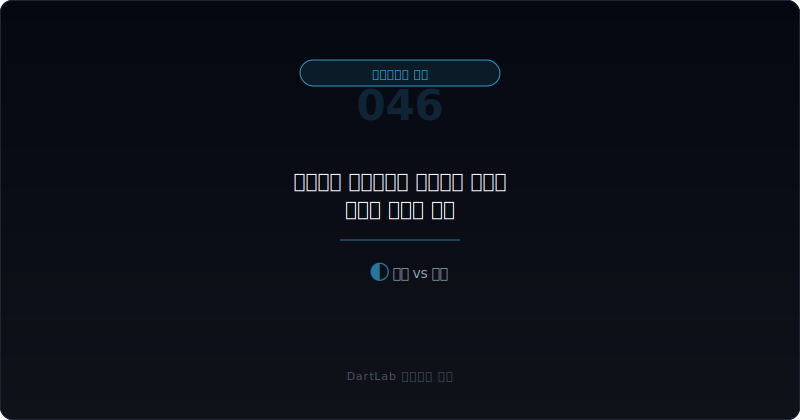
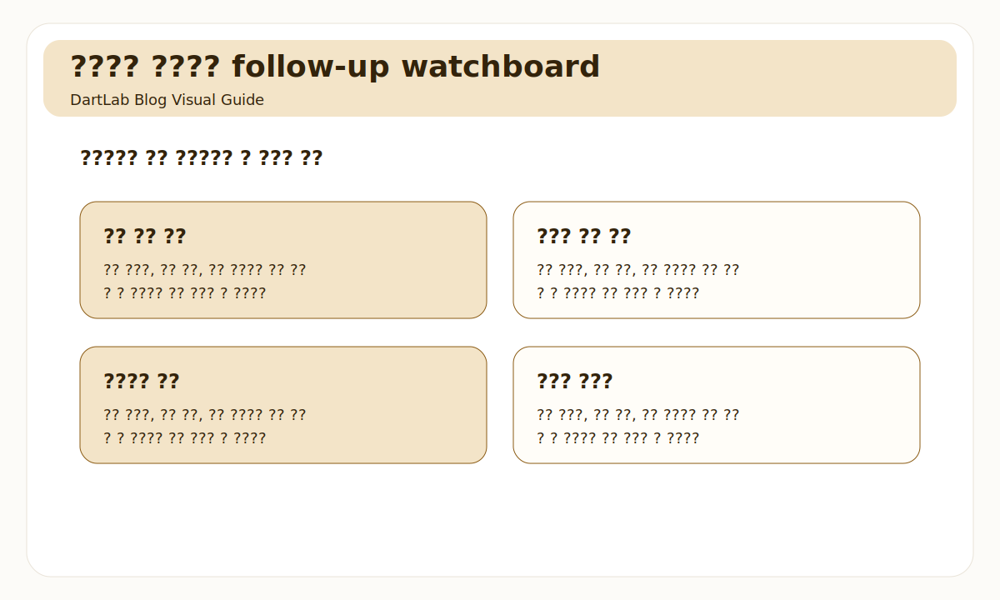

# 최대주주 주식담보와 반대매매 위험은 어떻게 읽어야 하나

최대주주 주식담보는 자주 한 줄 뉴스처럼 소비된다. "담보 설정", "담보 해지", "반대매매 우려" 같은 단어가 먼저 눈에 들어오고, 사람들은 보통 담보 비율이 높으냐 낮으냐만 본다. 하지만 실전에서는 그것만으로 거의 항상 부족하다. 주식담보는 단순한 차입 문제가 아니라 `지배력`, `유동성 압박`, `시장 충격 가능성`이 같이 묶여 있는 신호이기 때문이다.

같은 담보 설정이라도 어떤 경우는 비교적 안정적인 자금 운용의 일부일 수 있고, 어떤 경우는 최대주주 개인이나 특수관계인의 자금 압박이 회사 리스크로 번질 가능성을 보여준다. 특히 주가가 약한 구간, 차입 만기가 짧은 구간, 추가 담보 여력이 크지 않은 구간에서는 담보 자체보다 `그다음에 무슨 일이 벌어질 수 있는가`가 훨씬 중요하다.

이 글은 최대주주 주식담보를 `누가 담보를 제공했는가 -> 얼마나 묶였는가 -> 왜 빌렸는가 -> 반대매매 가능성은 어느 정도인가 -> 후속 지배력 변화가 있는가` 순서로 읽는 방법을 정리한다. 기본 오너십 프레임은 [대주주와 특수관계인은 어디를 먼저 봐야 하나](/blog/major-shareholder-and-related-parties), 위험 신호는 [지배구조가 위험한 회사는 어떤 패턴을 보이나](/blog/governance-red-flags), 비교 프레임은 [좋은 오너십과 위험한 오너십의 차이](/blog/good-vs-risky-ownership), 이벤트 연결은 [자기주식·제3자배정·최대주주 변경은 누구에게 유리한가](/blog/treasury-stock-third-party-allotment-and-major-shareholder-change)와 같이 보면 좋다.

---

## 왜 담보 설정 여부만 보면 거의 항상 부족한가

주식담보는 담보가 있다는 사실보다 `얼마나 민감한 구조인가`가 중요하다. 같은 5% 담보라도 전체 지배력 구조 안에서 보면 해석이 달라진다. 최대주주 지분이 두터운 회사에서 일부 담보가 있는 것과, 최대주주 지분 자체가 높지 않은 상태에서 핵심 지분이 담보로 묶인 것은 완전히 다른 문제다.

또한 담보는 현재 상태보다 스트레스 상황에서 의미가 커진다. 주가가 하락할 때 추가 담보를 넣을 여력이 있는지, 만기 구조가 짧은지, 차입 목적이 단순 운전자금인지 다른 구조 재편과 연결되는지에 따라 위험도가 달라진다. 그래서 담보 공시는 `지금 괜찮아 보이는가`보다 `흔들릴 때 무엇이 먼저 깨질 수 있는가`를 생각하게 만드는 문서다.

이 점은 단순히 최대주주 개인 문제로 끝나지 않는다. 담보 지분이 반대매매나 처분으로 이어지면 지배력 변화, 주가 급락, 후속 자금조달 부담, 이해관계 재편까지 연쇄적으로 붙을 수 있다. 그래서 주식담보는 오너십 문서이면서 동시에 이벤트 공시의 출발점이기도 하다. 이 흐름은 [감자와 주식병합 공시는 무엇을 먼저 봐야 하나](/blog/capital-reduction-and-reverse-split-disclosure), [합병·분할 공시는 어디를 먼저 봐야 하나](/blog/merger-and-spin-off-disclosure)와도 연결된다.

---

## 무엇을 먼저 붙여서 봐야 하나

| 먼저 볼 항목 | 왜 중요한가 |
| --- | --- |
| 담보 제공 주체 | 최대주주 본인인지 특별관계인인지 구분한다 |
| 담보 설정 주식 수와 비율 | 전체 지배력에서 얼마나 민감한지 본다 |
| 차입 목적과 상대방 | 단순 자금 운용인지 압박성 차입인지 본다 |
| 만기와 조건 | 추가 담보 요구와 반대매매 가능성을 본다 |
| 최근 주가 흐름 | 담보 구조가 스트레스를 받을 가능성을 본다 |
| 후속 공시 | 최대주주 변경, 제3자배정, 블록딜로 이어지는지 본다 |

가장 먼저 해야 할 일은 `누가` 담보를 제공했는지 보는 것이다. 최대주주 개인인지, 가족회사인지, 특수관계인인지에 따라 해석이 달라진다. 표면상 회사와 무관한 것처럼 보여도, 실제 지배력 묶음 안의 핵심 지분이 담보로 들어가 있으면 회사 차원의 위험으로 읽어야 한다.

그다음은 `얼마나 민감한 비율인가`다. 총 발행주식 대비 담보 비율만 볼 것이 아니라, 최대주주와 특수관계인 묶음 전체에서 차지하는 비중을 같이 봐야 한다. 담보로 묶인 비율이 전체 지배력의 큰 부분이면 주가 하락 시 방어력이 약해질 수 있다.

마지막으로 꼭 봐야 하는 것은 후속 이벤트다. 담보 구조가 흔들리면 블록딜, 담보 해소용 자금조달, 제3자배정, 최대주주 변경 같은 공시가 붙을 수 있다. 그래서 이 글은 단독 문서보다 후속 이벤트 추적용 허브에 가깝다.

여기서 자주 놓치는 것은 `담보 해지`도 해석이 필요하다는 점이다. 자기 자금으로 해지했는지, 다른 차입으로 갈아탔는지, 회사 주변 이벤트와 연결됐는지에 따라 의미가 달라진다. 해지 공시 하나만 보고 안심하면 흐름을 놓치기 쉽다.

---

## 어디서부터 위험을 가르면 되나

가장 실용적인 질문은 이것이다. `이 담보가 관리 가능한 차입 구조인가, 아니면 지배력과 시장 가격을 동시에 흔들 수 있는 압박 구조인가`.

보통 아래 세 갈래로 나누면 실전에서 편하다.

1. 담보 비중이 제한적이고 만기 관리가 가능한 구조
2. 담보 비중은 중간이지만 주가와 차입 조건에 민감한 구조
3. 담보 비중이 높고 후속 이벤트 가능성이 큰 압박 구조

첫 번째는 반드시 좋은 것은 아니지만 상대적으로 관리 가능할 수 있다. 담보 비중이 낮고, 담보 해지 이력이 있으며, 최대주주 측 여력이 충분하다면 시장 충격 가능성은 낮아진다. 두 번째와 세 번째는 더 주의해서 봐야 한다. 특히 차입 목적이 명확하지 않고, 주가가 이미 약하고, 만기나 추가 담보 조건이 빡빡하면 작은 주가 하락도 이벤트로 번질 수 있다.

이때 중요한 것은 반대매매가 실제로 발생했는지보다 `발생하면 어떤 연쇄가 열리는가`다. 지분율 변화, 경영권 방어, 후속 자금조달, 시장 신뢰 훼손이 한 번에 붙을 수 있기 때문이다. 그래서 이 공시는 숫자 하나보다 시나리오 분석이 더 중요하다.

---

## 상대적으로 건강한 경우와 더 조심해야 하는 경우는 무엇이 다른가

| 관찰 포인트 | 상대적으로 건강한 경우 | 더 조심해야 하는 경우 |
| --- | --- | --- |
| 담보 제공 주체 | 구조가 단순하고 설명이 가능하다 | 특수관계인까지 얽혀 구조가 복잡하다 |
| 담보 비중 | 전체 지배력에서 차지하는 비중이 제한적이다 | 핵심 지분이 많이 묶여 있다 |
| 차입 목적 | 비교적 분명하고 반복 압박이 적다 | 목적 설명이 약하고 급한 자금 냄새가 난다 |
| 만기·조건 | 담보 관리 여력이 있어 보인다 | 주가 하락 시 추가 담보 압박이 크다 |
| 후속 이벤트 | 큰 구조 변화 없이 종료된다 | 블록딜, 최대주주 변경, 희석 조달이 붙는다 |

핵심은 담보가 있느냐 없느냐가 아니라 `담보가 오너십을 얼마나 불안정하게 만드는가`다. 상대적으로 건강한 경우는 담보 비중과 목적, 해소 경로가 비교적 읽힌다. 반대로 더 조심해야 하는 경우는 구조가 복잡하고 설명이 약하며, 후속 이벤트 가능성이 커진다.

특히 주가가 약한 상황에서 담보가 높고, 동시에 [지급보증·담보·약정 공시는 어디가 위험 신호인가](/blog/guarantees-collateral-and-commitments)에서 다른 약정 압박까지 보인다면 신호가 겹친다. 이때는 담보 하나만의 문제가 아니라 회사 주변 자금 구조 전체가 긴장 상태일 수 있다.

---

## 자주 놓치는 해석 4가지

### 1. 담보 비율 숫자만 보고 작으면 안전하다고 생각한다

전체 지배력 묶음 안에서 차지하는 비중을 같이 봐야 한다.

### 2. 최대주주 개인 차입이라 회사와 무관하다고 생각한다

핵심 지분이 흔들리면 회사 리스크로 번질 수 있다.

### 3. 반대매매가 실제 발생하기 전에는 의미 없다고 본다

실전에서는 가능성만으로도 후속 이벤트와 신뢰 훼손이 시작될 수 있다.

### 4. 담보 해지 공시가 나오면 문제 끝이라고 생각한다

해지 자금이 어디서 왔는지, 다른 조달과 연결되는지도 봐야 한다.

---

## 다음 보고서와 후속 공시에서 무엇을 다시 봐야 하나

| 이번에 본 것 | 다음에 다시 볼 것 |
| --- | --- |
| 담보 비중 | 해지되는가, 더 늘어나는가 |
| 차입 목적 | 실제로 어떤 자금 이벤트로 이어지는가 |
| 주가 흐름 | 추가 담보 압박 가능성이 커지는가 |
| 최대주주 구조 | 변경, 지분 처분, 특별관계인 변화가 생기는가 |
| 후속 공시 | 제3자배정, 블록딜, 감자, 구조 재편이 붙는가 |
| 회사 숫자 | 본업 약화가 자금 압박과 연결되는가 |

주식담보는 발표 시점보다 후속 추적이 더 중요하다. 담보 설정 자체는 중립적일 수 있어도, 해소 과정과 후속 이벤트가 해석을 완전히 바꿀 수 있기 때문이다. 따라서 지분공시, 주요사항보고서, 최대주주 변경 공시를 묶어서 보는 습관이 필요하다.

특히 담보가 늘고 있는데 동시에 본업 숫자도 약해지면 위험은 더 커진다. 오너의 자금 압박과 회사의 펀더멘털 약화가 같은 방향으로 움직일 수 있기 때문이다. 이때는 [영업현금흐름이 순이익을 부정할 때](/blog/operating-cash-flow-vs-net-income), [감사의견이 적정이어도 불안한 회사는 어떤 패턴을 보이나](/blog/clean-audit-opinion-but-still-risky)까지 같이 보는 편이 낫다.

반대로 담보 비중이 조금 높아 보여도, 반복적으로 해소되고 지배력 구조가 흔들리지 않으며 후속 희석 이벤트가 없다면 지나치게 과장할 필요는 없다. 중요한 것은 한 번의 숫자가 아니라 `주식담보가 오너십 불안정으로 번지는 패턴이 있는가`다. 이 기준을 잡으면 공포 headline에 덜 흔들린다.

결국 담보 공시는 숫자보다 방어력과 대응 수단을 보는 문서다. 누가 버틸 수 있는지, 무엇으로 해소할 수 있는지, 실패하면 어떤 이벤트가 열리는지를 같이 적어 두면 훨씬 덜 막연해진다.

---

## 10분 체크리스트

- 누가 담보를 제공했는지 확인했는가
- 담보 비중을 전체 지배력 묶음 기준으로 봤는가
- 차입 목적과 상대방을 확인했는가
- 만기와 추가 담보 가능성을 생각해 봤는가
- 후속 최대주주 변경·제3자배정 가능성을 체크했는가
- 회사 숫자 약화와 같이 움직이는지 확인했는가

## FAQ

### 최대주주 주식담보는 무조건 나쁜가

항상 그런 것은 아니다. 다만 지배력과 시장 충격 가능성을 같이 보기 때문에 일반 차입보다 더 보수적으로 읽는 편이 낫다.

### 어떤 숫자가 가장 먼저 중요한가

단순 담보 비율보다 전체 지배력 묶음에서 얼마나 핵심 지분이 묶였는지가 더 중요하다.

### 무엇을 같이 보면 좋은가

대주주·특수관계인 구조, 지배구조 위험, 제3자배정과 최대주주 변경, 지급보증·약정 글을 같이 보면 좋다.

### 가장 먼저 적어볼 한 줄은 무엇인가

주가가 더 흔들릴 때 이 담보 구조가 지배력 이벤트로 번질 수 있는가다.

이 질문에 `누가 그 충격을 흡수할 여력이 있는가`까지 붙이면 해석이 한 단계 더 또렷해진다. 결국 담보는 숫자보다 방어력의 문제이기 때문이다.

## 같이 읽으면 좋은 글

- [대주주와 특수관계인은 어디를 먼저 봐야 하나](/blog/major-shareholder-and-related-parties)
- [지배구조가 위험한 회사는 어떤 패턴을 보이나](/blog/governance-red-flags)
- [좋은 오너십과 위험한 오너십의 차이](/blog/good-vs-risky-ownership)
- [자기주식·제3자배정·최대주주 변경은 누구에게 유리한가](/blog/treasury-stock-third-party-allotment-and-major-shareholder-change)
- [지급보증·담보·약정 공시는 어디가 위험 신호인가](/blog/guarantees-collateral-and-commitments)
- [감자와 주식병합 공시는 무엇을 먼저 봐야 하나](/blog/capital-reduction-and-reverse-split-disclosure)
- [합병·분할 공시는 어디를 먼저 봐야 하나](/blog/merger-and-spin-off-disclosure)
- [영업현금흐름이 순이익을 부정할 때](/blog/operating-cash-flow-vs-net-income)

## 참고한 공식 자료

- [기업공시 길라잡이](https://dart.fss.or.kr/info/main.do?menu=310)
- [DART 소개 - 보고서정보](https://dart.fss.or.kr/introduction/content2.do)
- [지분공시 종합정보조회](https://dart.fss.or.kr/dsac001/mainAll.do)
- [2025년 주요위반사례 3 PDF](https://dart.fss.or.kr/info/downloadKeyCase.do?filename=2025%EB%85%84+%EC%A3%BC%EC%9A%94%EC%9C%84%EB%B0%98%EC%82%AC%EB%A1%80_3.pdf&seqno=41)

## 정리

최대주주 주식담보는 단순 차입이 아니라 지배력과 유동성 압박, 시장 충격 가능성을 같이 읽어야 하는 신호다. 그래서 담보 설정 여부보다 누가 얼마를 묶었는지, 왜 빌렸는지, 흔들릴 때 어떤 후속 이벤트가 붙을 수 있는지를 같이 봐야 한다.

결국 이 공시의 핵심은 `담보가 있나`가 아니라 `담보가 흔들릴 때 무엇이 무너지나`다. 이 질문을 먼저 잡으면 반대매매 공포를 더 구조적으로 읽을 수 있다.
