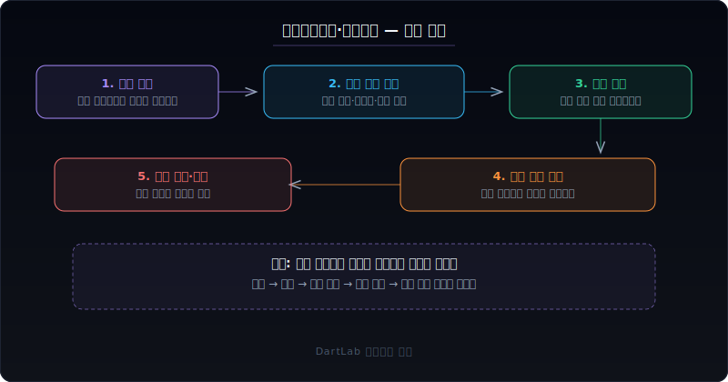
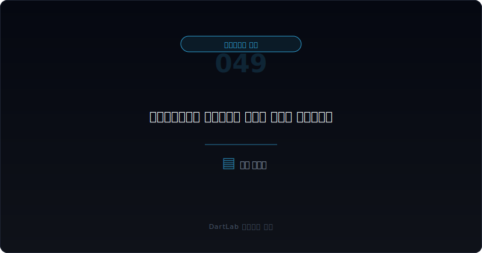
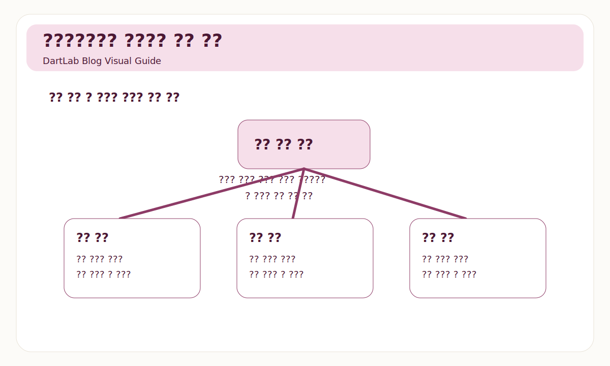
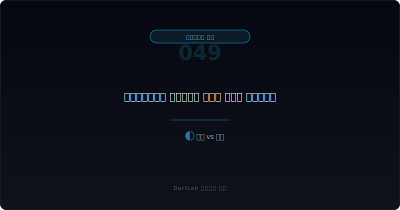

# 주식기준보상과 스톡옵션은 실제로 무엇을 희석시키나

주식기준보상과 스톡옵션은 겉으로 보기엔 좋은 제도처럼 느껴지기 쉽다. 임직원이 회사 가치 상승에 같이 묶이고, 현금 부담도 줄이며, 장기 성과를 유도하는 장치처럼 보이기 때문이다. 실제로 그런 경우도 있다. 하지만 실전에서는 이 제도를 `좋은 보상 제도`로만 보면 부족하다. 동시에 `희석`, `보수 구조`, `오너십 정렬`을 같이 만드는 장치이기 때문이다.

초보자는 보통 "스톡옵션이 있네" 정도로 보고 넘어간다. 그런데 정말 중요한 것은 부여 사실보다 구조다. 누구에게 얼마나 줬는지, 행사 가격이 어떤지, 베스팅 조건이 무엇인지, 실제로 새 주식 발행으로 이어질지, 기존 주주에게 어떤 희석이 생길지를 봐야 한다. 이걸 놓치면 장기 보상인지, 조용한 희석인지 구분하기 어렵다.

이 글은 주식기준보상과 스톡옵션을 `누구에게 주는가 -> 어떤 조건인가 -> 언제 희석이 현실화되는가 -> 보수 구조와 주주 정렬은 어떤가 -> 다음 공시에서 무엇을 추적할 것인가` 순서로 읽는 방법을 정리한다. 보수 구조의 기본은 [임원 보수 공시는 무엇을 말해주나](/blog/executive-pay-disclosure), 오너십 비교는 [좋은 오너십과 위험한 오너십의 차이](/blog/good-vs-risky-ownership), 지배력과 후속 이벤트는 [자기주식·제3자배정·최대주주 변경은 누구에게 유리한가](/blog/treasury-stock-third-party-allotment-and-major-shareholder-change)와 같이 보면 좋다.

---

## 왜 복지나 동기부여 이야기로만 보면 부족한가

스톡옵션은 장기 정렬 장치일 수 있다. 회사가 커질수록 임직원도 같이 이익을 보게 만들면, 단기 현금 보상보다 더 건강하게 보일 수도 있다. 하지만 동시에 기존 주주 입장에서는 잠재적 주식 수 증가를 의미한다. 즉 하나의 제도가 내부적으로는 동기부여 장치이고, 외부적으로는 희석 장치일 수 있다.

이 차이가 중요해지는 이유는 세 가지다.

- 행사 가격과 부여 시점에 따라 사실상 값싼 보상일 수 있다.
- 성과 조건이 약하면 장기 정렬보다 단순 보상에 가까울 수 있다.
- 실제 행사와 신주 발행이 붙으면 기존 주주 몫이 줄어들 수 있다.

그래서 스톡옵션은 "좋은 제도냐"보다 `누구에게 어떤 조건으로 주고, 주주와 얼마나 같은 방향에 묶는가`를 보는 편이 훨씬 실전적이다.

---

## 무엇을 먼저 붙여서 봐야 하나

| 먼저 볼 항목 | 왜 중요한가 |
| --- | --- |
| 부여 대상 | 핵심 경영진인지, 광범위한 인력인지 본다 |
| 부여 수량 | 잠재 희석 규모를 본다 |
| 행사 가격 | 실제 혜택이 어느 정도인지 본다 |
| 베스팅·성과 조건 | 장기 정렬 장치인지 본다 |
| 자기주식 vs 신주 발행 | 실제 희석 방식이 무엇인지 본다 |
| 후속 행사·취소 이력 | 말이 아니라 실제 현실화 흐름을 본다 |

이때 가장 먼저 해야 할 일은 `누가 받는가`와 `얼마나 받는가`를 같이 보는 것이다. 전 직원 대상의 제한적 프로그램과, 소수 경영진 중심의 대규모 부여는 전혀 다르게 읽어야 한다. 특히 임원 보수 구조와 겹쳐 보면, 현금 보상은 낮아 보여도 스톡옵션이 사실상 큰 보상을 대신할 수 있다.

두 번째는 행사 가격과 조건이다. 행사 가격이 너무 낮거나, 부여 시점 주가와 큰 차이가 없으며, 성과 조건이 약하면 장기 정렬보다 손쉬운 혜택처럼 보일 수 있다. 반대로 성과 조건이 분명하고 장기 베스팅이 걸려 있으면 해석이 달라진다.

마지막으로 꼭 봐야 하는 것은 `희석이 실제로 어떻게 현실화되는가`다. 자기주식으로 충당하는지, 신주 발행으로 가는지, 기존 주식 수 대비 잠재 비율이 어느 정도인지를 확인해야 한다. 이 부분은 [주주환원 정책은 말과 숫자 중 무엇을 봐야 하나](/blog/shareholder-return-what-matters), [최대주주 주식담보와 반대매매 위험은 어떻게 읽어야 하나](/blog/share-pledge-and-margin-call-risk)와 연결하면 더 명확해진다.

---

## 어디서부터 해석을 가르면 되나

가장 실용적인 질문은 이것이다. `이 제도가 장기 정렬 장치인가, 아니면 조용한 희석 장치인가`.

보통 아래 세 갈래로 나누면 읽기가 쉽다.

1. 성과 조건과 기간이 분명한 장기 정렬 구조
2. 보상 기능과 희석 기능이 섞인 혼합 구조
3. 성과 조건은 약하고 희석 부담이 큰 구조

첫 번째는 상대적으로 건강할 수 있다. 부여 대상이 납득 가능하고, 장기 성과 조건이 있으며, 희석 규모도 관리 가능한 수준이면 장기 정렬 장치로 읽을 수 있다. 두 번째는 보수와 희석을 분리해 읽는 훈련이 필요하다. 세 번째는 더 조심해야 한다. 특히 실적과 주주환원은 약한데 스톡옵션 부여는 공격적이고, 행사 가격과 조건이 느슨하면 기존 주주 입장에서 불편한 구조가 될 수 있다.

여기서 중요한 것은 `부여 공시`보다 `행사와 취소의 실제 이력`이다. 제도 설계는 좋아 보여도 행사 시점과 발행 구조가 기존 주주에게 불리하게 작동할 수 있기 때문이다.

---

## 상대적으로 건강한 경우와 더 조심해야 하는 경우는 무엇이 다른가

| 관찰 포인트 | 상대적으로 건강한 경우 | 더 조심해야 하는 경우 |
| --- | --- | --- |
| 부여 대상 | 핵심 기여자 중심으로 설명 가능하다 | 특정 소수에게 과도하게 몰린다 |
| 행사 가격·조건 | 장기 성과와 연동된다 | 기준이 약하거나 지나치게 느슨하다 |
| 희석 규모 | 관리 가능한 수준이다 | 기존 주주 몫이 크게 줄 수 있다 |
| 보수 구조 | 현금·주식 보상이 균형적이다 | 스톡옵션이 사실상 숨은 보수 역할을 한다 |
| 후속 이력 | 행사·취소 흐름이 비교적 읽힌다 | 행사와 신주 발행이 잦고 복잡하다 |

핵심은 스톡옵션이 있느냐 없느냐가 아니다. 중요한 것은 `그 제도가 누구와 무엇을 정렬시키는가`다. 건강한 경우는 장기 성과와 연결되고 희석 규모도 설명 가능하다. 더 조심해야 하는 경우는 보수 확대 효과는 큰데, 성과 조건과 주주 정렬은 약하다.

특히 회사가 자사주 매입이나 소각을 이야기하면서 동시에 옵션 행사로 신주 발행을 늘리면, 겉으로는 환원 같아 보여도 실제로는 희석을 상쇄하지 못할 수 있다. 그래서 주식기준보상은 반드시 주주환원과 함께 봐야 한다.

---

## 행사가격과 자기주식 충당이 왜 체감 희석을 바꾸나

스톡옵션을 볼 때 많은 초보자가 부여 수량만 본다. 하지만 실제 체감 희석은 행사가격과 충당 방식에서 크게 달라진다. 행사 가격이 낮을수록 옵션 보유자에게 유리하고, 기존 주주 입장에서는 혜택 이전이 커질 수 있다. 반대로 행사가격이 충분히 높고 성과 조건도 분명하면 해석이 조금 달라진다.

자기주식으로 충당하는지도 중요하다. 자기주식을 쓰면 신주 발행보다 즉각적인 희석은 줄어들 수 있다. 하지만 그 자기주식이 원래는 소각이나 다른 자본정책에 쓰일 수 있었는지도 같이 봐야 한다. 결국 충당 방식은 희석의 모양을 바꾸지, 해석 자체를 끝내 주지는 않는다.

그래서 스톡옵션은 항상 `부여 수량 -> 행사가격 -> 충당 방식 -> 실제 총주식수 변화` 순서로 적어 두는 편이 좋다. 이 네 줄을 놓치면 제도는 좋아 보여도 결과는 다르게 나올 수 있다.

---

## 인재 유지 장치와 오너 중심 보상을 어떻게 구분하나

스톡옵션이 전부 나쁜 것은 아니다. 특히 성장기 회사에서 핵심 인력을 오래 붙잡고, 현금 유출 대신 장기 성과를 묶는 장치로 쓰일 수 있다. 이 경우는 부여 대상이 비교적 넓거나, 핵심 기여와 성과 기준이 구체적이며, 장기 베스팅 구조가 읽히는 경우가 많다.

반대로 더 조심해야 하는 경우는 부여가 소수 경영진에 과도하게 몰리고, 성과 조건은 약한데 혜택은 큰 구조다. 이때는 장기 인재 유지라기보다 오너 중심 보상이 조용히 확대되는 구조일 수 있다. 특히 [임원 보수 공시는 무엇을 말해주나](/blog/executive-pay-disclosure)와 같이 보면 현금 보상은 낮아 보이는데 실제 총보상은 커지는 경우가 꽤 잘 보인다.

결국 중요한 것은 옵션이 있느냐가 아니라 `누가 왜 받는가`다. 이 질문을 붙이면 복지처럼 보이는 제도와 희석성 보상이 생각보다 빨리 갈린다.

---

## 자주 놓치는 해석 4가지

### 1. 스톡옵션은 장기 정렬이니 무조건 좋다고 본다

성과 조건과 희석 규모를 같이 봐야 한다.

### 2. 행사 전까지는 아무 영향이 없다고 생각한다

잠재 희석 자체가 이미 중요한 정보다.

### 3. 행사 가격이 있으면 기존 주주에게도 괜찮다고 본다

가격 수준과 부여 시점, 조건까지 봐야 한다.

### 4. 임원 보수와 스톡옵션을 따로 읽는다

실전에서는 하나의 보상 구조로 묶어 보는 편이 낫다.

---

## 다음 공시와 후속 문서에서 무엇을 다시 봐야 하나

| 이번에 본 것 | 다음에 다시 볼 것 |
| --- | --- |
| 부여 수량 | 더 늘어나는가, 조정되는가 |
| 행사 가격과 조건 | 유지되는가, 완화되는가 |
| 행사 이력 | 실제 신주 발행과 희석이 발생하는가 |
| 자기주식 사용 | 희석을 줄이는 방향인지 본다 |
| 임원 보수 | 현금 보상과 함께 얼마나 커지는가 |
| 주주환원 | 희석과 환원이 충돌하지 않는가 |

이 영역은 한 번 부여 공시를 보고 끝내기보다, 사업보고서의 보수 표, 주식기준보상 주석, 주총 안건, 후속 행사 이력을 같이 추적해야 한다. 그래야 스톡옵션이 실제로 장기 정렬 장치인지, 아니면 보상과 희석을 함께 키우는 구조인지 구분할 수 있다.

가능하면 `부여 수량`, `행사 가격`, `성과 조건`, `실제 행사`, `총주식수 변화`를 한 표에 적어 두는 편이 좋다. 이 다섯 줄만 있어도 복잡한 옵션 제도가 훨씬 단순해진다.

---

## 10분 체크리스트

- 누가 얼마나 받는지 확인했는가
- 행사 가격과 부여 시점을 봤는가
- 베스팅과 성과 조건이 구체적인가
- 자기주식 충당인지 신주 발행인지 확인했는가
- 잠재 희석 규모를 기존 주식 수 기준으로 생각해 봤는가
- 보수 구조와 주주환원까지 함께 봤는가

## FAQ

### 스톡옵션이 있으면 무조건 주주 친화적인가

항상 그렇지는 않다. 장기 정렬 장치일 수도 있지만 희석 장치일 수도 있다.

### 무엇이 가장 먼저 중요한가

누구에게 얼마나 주는지, 그리고 실제로 어떤 희석 방식으로 현실화되는지가 가장 중요하다.

### 무엇을 같이 보면 좋은가

임원 보수, 주주환원, 자기주식, 최대주주 구조를 같이 보면 좋다.

### 가장 먼저 적어볼 한 줄은 무엇인가

이 제도가 장기 성과를 묶는지, 기존 주주 몫을 조용히 줄이는지다.

## 같이 읽으면 좋은 글

- [임원 보수 공시는 무엇을 말해주나](/blog/executive-pay-disclosure)
- [좋은 오너십과 위험한 오너십의 차이](/blog/good-vs-risky-ownership)
- [주주환원 정책은 말과 숫자 중 무엇을 봐야 하나](/blog/shareholder-return-what-matters)
- [자기주식·제3자배정·최대주주 변경은 누구에게 유리한가](/blog/treasury-stock-third-party-allotment-and-major-shareholder-change)
- [최대주주 주식담보와 반대매매 위험은 어떻게 읽어야 하나](/blog/share-pledge-and-margin-call-risk)
- [주주총회소집공고에서 꼭 봐야 할 것은 무엇인가](/blog/how-to-read-agm-notice)

## 참고한 공식 자료

- [IFRS 2 Share-based Payment](https://www.ifrs.org/issued-standards/list-of-standards/ifrs-2-share-based-payment/)
- [IFRS 2 PDF](https://www.ifrs.org/content/dam/ifrs/publications/pdf-standards/english/2021/issued/part-a/ifrs-2-share-based-payment.pdf)
- [DART 소개 - 보고서정보](https://dart.fss.or.kr/introduction/content2.do)
- [기업공시 길라잡이](https://dart.fss.or.kr/info/main.do)
- [OpenDART 지분공시 종합정보조회](https://opendart.fss.or.kr/disclosureinfo/qota/main.do)

## 정리

주식기준보상과 스톡옵션은 복지나 동기부여 제도이면서 동시에 보수 구조와 희석 구조다. 그래서 부여 대상, 행사 가격, 조건, 실제 행사와 신주 발행 여부를 같이 봐야 의미가 드러난다.

결국 이 영역의 핵심은 `옵션이 있나`가 아니라 `그 옵션이 누구와 무엇을 정렬시키나`다. 이 질문을 먼저 잡으면 장기 보상과 조용한 희석을 훨씬 잘 구분하게 된다.
