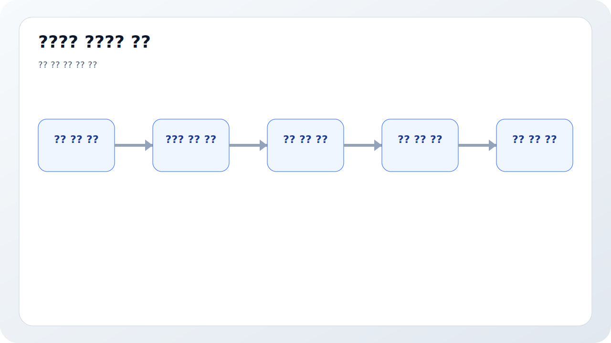
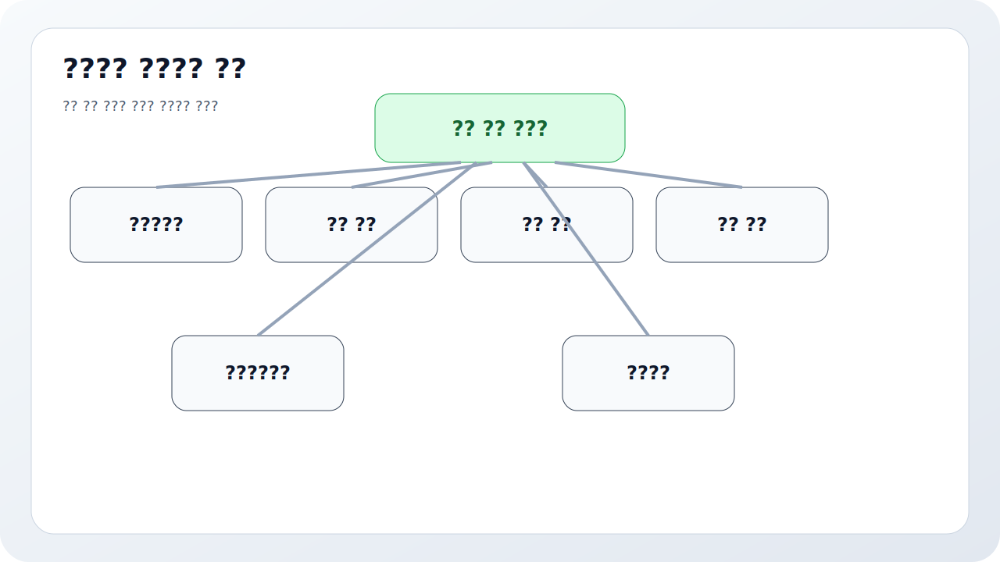
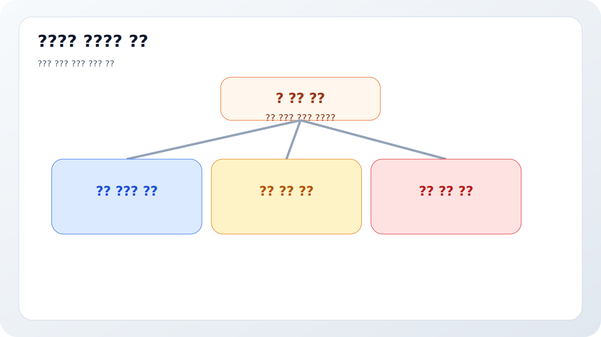
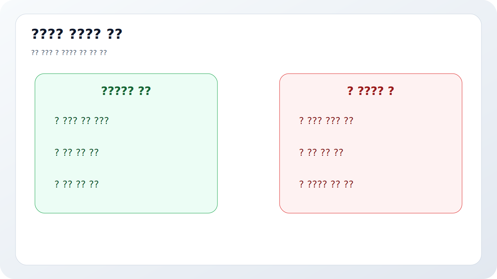
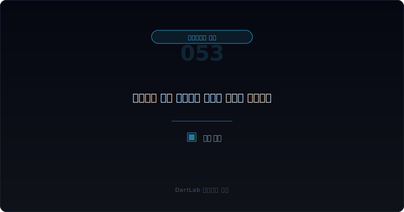

# 계속기업 관련 불확실성 문구는 어디서 강해지나

많은 사람은 감사보고서에서 계속기업 관련 문구를 보면 이미 끝난 회사처럼 받아들인다. 반대로 그 문구가 없으면 안심해도 된다고 생각한다. 둘 다 지나치게 단순한 해석이다. 실전에서는 이 문구가 붙기 전부터 신호가 쌓이고, 붙은 뒤에도 해석의 무게는 회사마다 다르다.

계속기업 관련 불확실성은 보통 한 줄로 갑자기 나타나지 않는다. 영업현금흐름이 약해지고, 차입 만기가 몰리고, 차환이 외부 조달에 과하게 의존하고, 보증과 담보가 늘고, 정정공시가 반복되고, 감사보고서 문장이 점점 무거워지는 순서로 드러나는 경우가 많다. 그래서 이 영역은 `문구 자체`보다 `문구가 어디서부터 강해지기 시작했는가`를 읽는 편이 맞다.

이 글은 계속기업 관련 불확실성을 `감사보고서 문구 -> 주석의 유동성 설명 -> 차입 만기와 조달 계획 -> 후속 정정공시와 실행 여부 -> 다음 분기 현금흐름` 순서로 읽는 방법을 정리한다. 기본 프레임은 [감사의견이 적정이어도 불안한 회사는 어떤 패턴을 보이나](/blog/clean-audit-opinion-but-still-risky), 감사보고서 출발점은 [감사보고서와 KAM은 어디까지 믿어야 하나](/blog/audit-report-and-kam), 현금과 만기는 [영업현금흐름이 순이익을 부정할 때](/blog/operating-cash-flow-vs-net-income)와 [리스부채와 차입 만기 구조는 어디서 먼저 터지나](/blog/lease-liabilities-and-debt-maturity)와 같이 보면 좋다.

---

## 왜 문구의 존재 여부만 보면 거의 항상 부족한가

계속기업 관련 불확실성 문구는 스위치처럼 켜지고 꺼지는 표시등이 아니다. 같은 문구가 있어도 어떤 회사는 유동성 위기를 힘겹게 넘기는 단계일 수 있고, 어떤 회사는 외부 자금조달이 조금만 꼬여도 바로 압박이 커지는 단계일 수 있다. 따라서 문구가 있느냐 없느냐보다 `그 문구를 떠받치는 숫자와 설명이 무엇인가`를 봐야 한다.

특히 초보자가 자주 놓치는 것은 감사의견과 계속기업 관련 문구의 관계다. 적정 의견인데도 계속기업 관련 불확실성이 강조될 수 있다. 즉 적정은 안전 판정이 아니고, 계속기업 관련 문구는 파산 확정 선언도 아니다. 이 둘 사이의 회색지대를 읽는 것이 실전이다.

그래서 이 문구를 볼 때는 늘 세 가지를 같이 적어 두는 편이 좋다. `현금`, `만기`, `조달 의존`. 이 세 줄이 없으면 문구 해석이 공포나 낙관으로 쉽게 쏠린다.

---

## 어떤 숫자 조합이 먼저 경고하나

| 먼저 볼 항목 | 왜 중요한가 |
| --- | --- |
| 감사보고서 문구 | 불확실성이 어느 수준으로 표현되는지 본다 |
| 주석의 유동성 설명 | 경영진이 어떤 전제를 두고 있는지 본다 |
| 차입 만기 구조 | 당장 넘겨야 할 벽이 무엇인지 본다 |
| 조달 계획 | 차환, 증자, 자산 매각 의존도를 본다 |
| 영업현금흐름 | 본업이 시간을 벌어 주는지 본다 |
| 후속 정정공시·이벤트 | 계획이 실제로 실행되는지 본다 |

가장 먼저 할 일은 문구를 확대 해석하는 대신 숫자 다리를 그리는 것이다. 예를 들어 "계속기업 관련 중요한 불확실성"이 언급되면, 그 즉시 [지급보증·담보·약정 공시는 어디가 위험 신호인가](/blog/guarantees-collateral-and-commitments)와 같이 보증과 담보 구조를 붙이고, [DART 정정공시를 파이프라인에서 다루는 법](/blog/dart-amendment-filing-pipeline)처럼 후속 정정 여부도 같이 보는 편이 좋다.

또 하나 중요한 것은 경영진 계획의 질이다. 자산 매각, 신규 투자 유치, 차환, 비용 절감 같은 표현이 나와도 그게 실제로 가능한지, 이미 다른 공시에서 예고되었는지, 다음 분기 숫자에 반영되는지를 봐야 한다. 계획 자체는 누구나 적을 수 있지만, 실행으로 이어지는 회사는 많지 않다.

---

## 신호가 강해지는 순서

가장 실용적인 질문은 이것이다. `이 회사의 불확실성은 단기 유동성 압박인가, 조달 의존 심화인가, 본업이 시간을 벌지 못하는 구조인가`.

단기 유동성 압박이라면 만기 도래와 차환 가능성이 핵심이다. 조달 의존 심화라면 증자, 차입 연장, 자산 매각 같은 외부 전제가 실제로 가능한지 봐야 한다. 본업이 시간을 벌지 못하는 구조라면 결국 [영업현금흐름이 순이익을 부정할 때](/blog/operating-cash-flow-vs-net-income)로 내려가서 현금 창출력이 남아 있는지부터 확인해야 한다.

이 분기에서 특히 주의할 것은 문구보다 전제다. "계속기업 가정은 적절하나 중요한 불확실성이 존재"한다는 표현은 결국 `앞으로 몇 개 전제가 어긋나면 위험이 커진다`는 뜻일 수 있다. 그 전제가 차환인지, 신규 자금유치인지, 핵심 자산 매각인지 적어 두면 해석이 훨씬 구체적이 된다.

---

## 위험도를 나누는 기준

| 관찰 포인트 | 상대적으로 관리 가능한 경우 | 더 위험한 경우 |
| --- | --- | --- |
| 유동성 설명 | 부족한 자금과 대응 수단이 비교적 구체적이다 | 낙관적 계획만 있고 실행 근거가 약하다 |
| 차입 만기 | 만기 구조와 차환 경로가 읽힌다 | 단기 만기가 몰렸는데 외부 조달 의존이 크다 |
| 영업현금흐름 | 본업이 일정 부분 시간을 벌어 준다 | 본업 현금이 계속 마이너스다 |
| 후속 공시 | 계획이 실제 이벤트로 이어진다 | 정정과 일정 변경만 반복된다 |
| 감사·지배구조 | 문구와 감독 구조가 일관된다 | 문구는 무거운데 설명과 감독은 얕다 |

관리 가능한 경우의 핵심은 불확실성이 있어도 `무엇이 문제고 어떤 순서로 풀겠는지`가 비교적 읽힌다는 점이다. 더 위험한 경우는 숫자보다 계획 문장이 앞서고, 실제로는 만기 압박과 본업 현금 부족이 동시에 심해진다.

특히 계속기업 관련 문구와 [최대주주 주식담보와 반대매매 위험은 어떻게 읽어야 하나](/blog/share-pledge-and-margin-call-risk), [자기주식·제3자배정·최대주주 변경은 누구에게 유리한가](/blog/treasury-stock-third-party-allotment-and-major-shareholder-change)가 같은 시기에 겹치면 더 조심해야 한다. 회사 차원의 유동성 문제와 지배력 압박이 동시에 움직일 수 있기 때문이다.

---

## 적정 의견인데도 왜 이 문구가 붙을 수 있나

이 부분이 가장 자주 오해된다. 적정 의견은 재무제표가 기준에 따라 작성되었는지를 보는 것이고, 계속기업 관련 불확실성 문구는 회사가 앞으로 버틸 수 있는지에 관한 중요한 조건부 위험을 알리는 것이다. 따라서 두 문장은 충돌하지 않는다. 오히려 함께 존재할 수 있다.

이 사실을 이해하면 감사보고서 해석이 훨씬 현실적으로 바뀐다. 적정 의견이 있으니 안심하는 것도 아니고, 계속기업 문구가 있으니 바로 끝이라고 보는 것도 아니다. 대신 `무엇이 버팀목이고 무엇이 취약점인가`를 더 차분하게 보게 된다. 이 차분함이 실제 투자 판단에서는 중요하다.

---

## 어떤 전제가 반복되면 문구를 더 무겁게 봐야 하나

계속기업 관련 문구에서 특히 무겁게 봐야 하는 것은 `반복되는 외부 의존`이다. 매년 비슷한 차환 계획이 반복되고, 자산 매각 계획이 계속 뒤로 밀리고, 증자나 투자 유치가 늘 다음 분기의 전제로만 남아 있다면 문구의 무게는 더 커진다. 문장 자체가 같아 보여도, 전제가 계속 실행되지 않는다면 위험은 누적된다고 보는 편이 맞다.

반대로 한 번 문구가 무거워졌더라도 실제 차환이 완료되고, 단기 만기가 분산되고, 영업현금흐름이 회복되면 해석은 달라질 수 있다. 결국 중요한 것은 문구를 확대 해석하는 것이 아니라 `전제가 실현되는 속도`를 추적하는 것이다. 이 관점이 붙으면 계속기업 관련 문구를 공포가 아니라 검증 과제로 읽게 된다.

---

## 자주 놓치는 해석 함정

### 1. 계속기업 문구가 있으면 곧바로 파산 직전이라고 본다

중요한 것은 문구의 존재 자체보다 어떤 전제 위에 서 있는지다.

### 2. 문구가 없으면 안심해도 된다고 본다

현금흐름과 만기 구조가 더 빨리 악화될 수 있다.

### 3. 경영진의 조달 계획을 그대로 믿는다

실행된 공시와 후속 숫자로 확인해야 한다.

### 4. 감사보고서와 자금조달 공시를 따로 본다

이 둘은 계속기업 해석에서 반드시 붙여 봐야 한다.

---

## 다음 분기에 다시 확인할 숫자

| 이번에 본 것 | 다음에 다시 볼 것 |
| --- | --- |
| 감사보고서 문구 | 더 무거워지는가, 완화되는가 |
| 유동성 설명 | 전제가 실제로 실행되는가 |
| 차입 만기 | 차환과 상환이 계획대로 되는가 |
| 영업현금흐름 | 본업이 시간을 벌어 주는가 |
| 정정공시 | 일정 변경과 설명 수정이 반복되는가 |
| 후속 이벤트 | 증자, 자산 매각, 채무 재조정이 붙는가 |

계속기업 관련 불확실성은 다음 보고서에서 더 많은 뜻이 드러난다. 이번 보고서에서 말한 전제가 실제로 실행되면 문구는 상대적으로 가벼워질 수 있고, 실행이 늦어지면 더 무거워질 수 있다. 그래서 이 영역은 발표일보다 `다음 분기의 검증`이 훨씬 중요하다.

가능하면 이번 보고서에서 본 전제 세 줄을 그대로 적어 두는 편이 좋다. 예를 들어 차환 성공, 자산 매각 완료, 운영현금흐름 회복 같은 문장을 적고 다음 분기마다 그대로 체크하면 문구 해석이 훨씬 단단해진다.

또한 회사가 같은 시기에 어떤 말을 반복하는지도 중요하다. "유동성 확보를 위해 다양한 방안을 검토 중" 같은 표현이 계속 반복되는데 실제 실행 공시는 따라오지 않으면, 문구보다 훨씬 이른 단계에서 위험이 누적되고 있다고 볼 수 있다. 결국 계속기업 관련 불확실성은 문장보다 실행 속도와 실행 결과를 추적할 때 가장 잘 읽힌다.

---

## 실전 점검 체크리스트

- 감사보고서 문구를 정확히 읽었는가
- 주석의 유동성 설명과 전제를 적어봤는가
- 단기 차입 만기와 차환 경로를 확인했는가
- 영업현금흐름이 시간을 벌어 주는지 봤는가
- 후속 자금조달 공시가 실제로 실행되는지 확인했는가
- 다음 분기에도 같은 전제를 다시 검증할 계획이 있는가

## 자주 묻는 질문

### 계속기업 관련 불확실성 문구가 있으면 끝난 회사인가

그렇게 단정하기는 이르다. 다만 유동성, 차환, 조달 전제를 훨씬 무겁게 봐야 한다.

### 적정 의견과 같이 있을 수 있나

있다. 적정 의견은 안전 판정이 아니고, 계속기업 문구는 중요한 조건부 위험을 알리는 문장일 수 있다.

### 무엇을 같이 보면 좋은가

감사보고서, 차입 만기, 영업현금흐름, 보증·담보, 정정공시를 같이 보면 좋다.

### 가장 먼저 적어볼 한 줄은 무엇인가

이 회사는 무엇이 실패하면 바로 압박이 커지는가다.

그 한 줄이 보이면 감사 문구와 자금조달 공시, 현금흐름을 한 방향으로 묶어 읽기 쉬워진다.
실전에서는 이 질문이 가장 오래 남는다.

## 관련 분석 글

- [감사의견이 적정이어도 불안한 회사는 어떤 패턴을 보이나](/blog/clean-audit-opinion-but-still-risky)
- [감사보고서와 KAM은 어디까지 믿어야 하나](/blog/audit-report-and-kam)
- [영업현금흐름이 순이익을 부정할 때](/blog/operating-cash-flow-vs-net-income)
- [리스부채와 차입 만기 구조는 어디서 먼저 터지나](/blog/lease-liabilities-and-debt-maturity)
- [지급보증·담보·약정 공시는 어디가 위험 신호인가](/blog/guarantees-collateral-and-commitments)
- [DART 정정공시를 파이프라인에서 다루는 법](/blog/dart-amendment-filing-pipeline)

## 공식 출처와 근거

- [IAS 1 Presentation of Financial Statements](https://www.ifrs.org/issued-standards/list-of-standards/ias-1-presentation-of-financial-statements.html/)
- [IFRS Foundation updates going concern educational material](https://www.ifrs.org/news-and-events/news/2025/05/ifrs-foundation-updates-going-concern-educational-material/)
- [ISA 570 (Revised 2024), Going Concern](https://www.ifac.org/taxonomy/term/230)
- [DART 소개 - 보고서정보](https://dart.fss.or.kr/introduction/content2.do)
- [DART 소개 - 정정신고서 이용시 유의사항](https://dart.fss.or.kr/introduction/content4.do)
- [기업공시 길라잡이 - 정기보고서](https://dart.fss.or.kr/info/main.do?menu=210)

## 핵심 정리

계속기업 관련 불확실성 문구는 갑자기 하늘에서 떨어지는 경고가 아니다. 감사보고서, 유동성 설명, 차입 만기, 조달 의존, 후속 정정공시가 쌓이면서 점점 무거워지는 경우가 많다.

핵심은 `문구가 있나 없나`보다 `무엇이 실패하면 바로 압박이 커지는가`를 먼저 묻는 것이다. 이 질문을 붙이면 계속기업 문구를 훨씬 덜 극단적으로, 더 실전적으로 읽게 된다.
