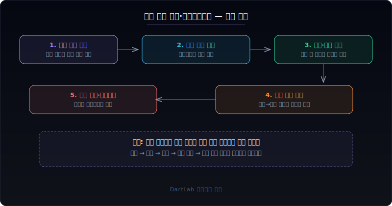
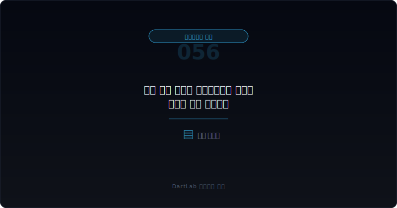
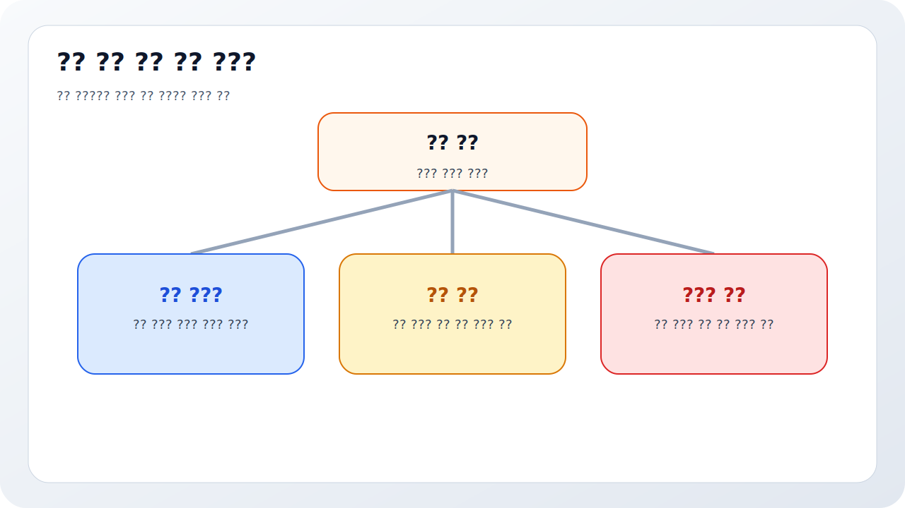
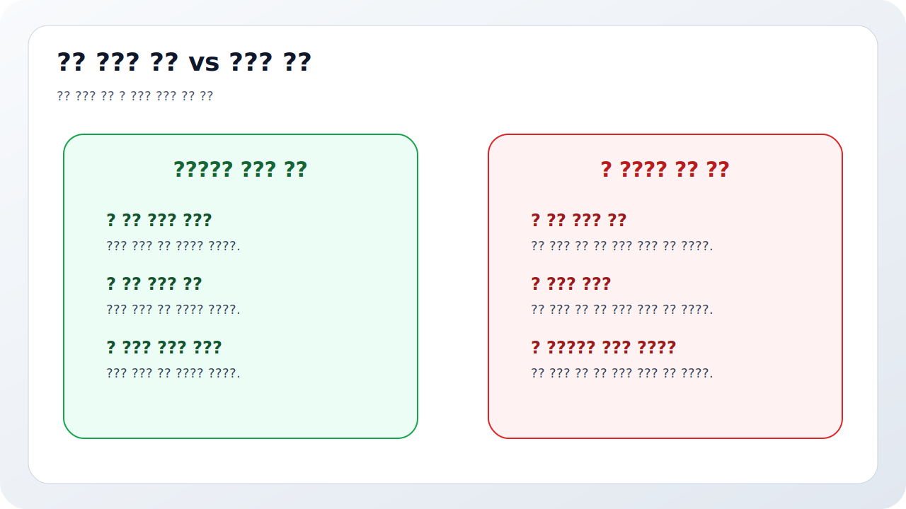
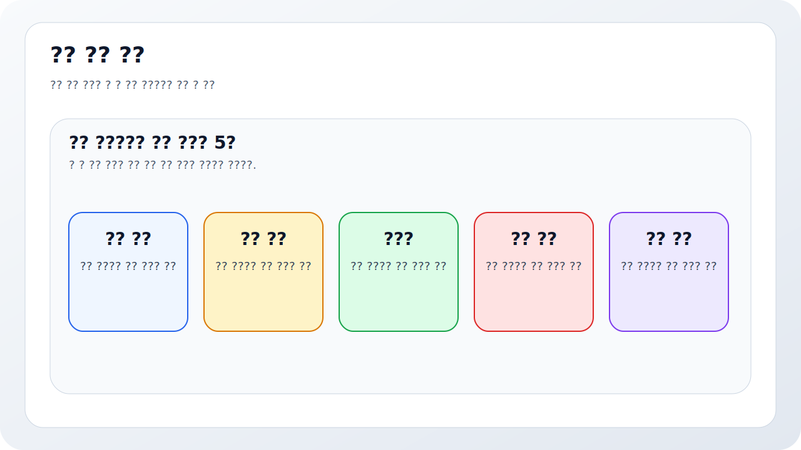

# 차입 약정 위반과 기한이익상실 위험은 어디서 먼저 드러나나

회사가 흔들릴 때 가장 먼저 무너지는 것은 이익이 아니라 `시간`인 경우가 많다. 차입 약정을 지키지 못하면 장기 차입도 순식간에 단기 압박으로 바뀔 수 있고, 기한이익상실 위험이 생기면 자금 계획 전체가 짧아진다. 그런데 많은 사람은 이 신호를 아주 늦게 본다. 감사보고서에 강한 문구가 붙거나 실제 연체가 드러난 뒤에야 심각성을 인식한다.

실전에서는 그보다 훨씬 앞에서 힌트가 나온다. 주석의 차입 조건, 재무비율 유지 약정, 면제나 유예 여부, 단기·장기 분류 변화, 자금조달 계획, 후속 정정공시가 겹치기 시작하면 회사가 시간을 잃고 있다는 신호일 수 있다. 그래서 이 영역은 `부도 여부`보다 `버틸 시간을 누가 쥐고 있는가`를 먼저 읽는 편이 맞다.

이 글은 차입 약정 위반과 기한이익상실 위험을 `차입 구조 확인 -> 약정 조건 확인 -> 면제·유예 여부 확인 -> 유동성 문구와 분류 변화 확인 -> 후속 자금조달 실행 여부 확인` 순서로 읽는 방법을 정리한다. 기본 프레임은 [계속기업 관련 불확실성 문구는 어디서 강해지나](/blog/going-concern-uncertainty-signals), 차입 압박은 [리스부채와 차입 만기 구조는 어디서 먼저 터지나](/blog/lease-liabilities-and-debt-maturity), 담보와 보증은 [지급보증·담보·약정 공시는 어디가 위험 신호인가](/blog/guarantees-collateral-and-commitments), 감사 쪽 경고는 [감사의견이 적정이어도 불안한 회사는 어떤 패턴을 보이나](/blog/clean-audit-opinion-but-still-risky)와 같이 보면 좋다.

---

## 왜 실제 사고가 나기 전에 먼저 봐야 하나

기한이익상실은 그 자체가 뉴스가 되기 쉽다. 그래서 많은 사람이 실제 선언이나 공시가 나온 뒤에야 문제를 인식한다. 하지만 투자 판단에서는 너무 늦다. 차입 약정 위반 위험은 보통 실제 사고 전부터 여러 조각으로 나타난다. 재무비율 유지 조건이 빡빡해지고, 만기 구조가 짧아지고, 경영진 설명이 차환과 자산 매각 전제에 더 의존하고, 정정공시가 늘기 시작한다.

즉 사고보다 먼저 봐야 하는 이유는 간단하다. 약정 위반 위험은 `시간을 잃는 과정`이기 때문이다. 회사가 시간을 잃으면 다른 모든 선택지가 비싸진다. 유상증자도 더 불리해지고, 차입 연장도 더 어려워지고, 자산 매각도 급하게 하게 될 수 있다. 따라서 이 신호는 단기 자금 문제가 아니라 협상력 문제로 읽는 편이 맞다.

또한 약정 위반 위험은 단독으로 오지 않는 경우가 많다. [최대주주 주식담보와 반대매매 위험은 어떻게 읽어야 하나](/blog/share-pledge-and-margin-call-risk)처럼 지배력 압박과 같이 움직일 수도 있고, [DART 정정공시를 파이프라인에서 다루는 법](/blog/dart-amendment-filing-pipeline)에서 본 것처럼 공시 품질 문제와 함께 나타날 수도 있다. 그래서 한 줄 신호보다 묶음 신호로 읽어야 한다.

---

## 무엇을 먼저 붙여서 봐야 하나

| 먼저 볼 항목 | 왜 중요한가 |
| --- | --- |
| 차입 만기 구조 | 당장 시간을 잃는 구간이 어디인지 본다 |
| 약정 조건 | 어떤 재무비율과 의무가 걸려 있는지 본다 |
| 면제·유예 여부 | 위반이 이미 발생했는지, 일시적으로 넘겼는지 본다 |
| 부채 분류 변화 | 장기가 단기로 이동하는지 본다 |
| 자금조달 계획 | 차환, 증자, 자산 매각 전제가 무엇인지 본다 |
| 후속 정정공시 | 계획과 설명이 흔들리는지 본다 |

실전에서는 먼저 차입 만기와 약정 조건을 같이 놓는 편이 좋다. 만기가 짧아도 약정 여유가 충분하면 압박 수준이 다를 수 있고, 반대로 만기가 길어 보여도 약정 위반 시 즉시 상환 위험이 크면 체감 위험은 훨씬 무겁다. 그래서 `언제 갚아야 하는가`와 `무엇을 지켜야 하는가`를 분리하지 않고 함께 봐야 한다.

그다음에 확인할 것은 면제와 유예다. 약정 위반이 있었더라도 금융기관이 한시적으로 면제해 줄 수 있다. 하지만 면제가 있다고 해서 위험이 사라지는 것은 아니다. 오히려 협상력이 약해졌다는 뜻일 수 있다. 그래서 면제나 유예 공시는 안도 재료가 아니라 `시간을 샀지만 비용이 커졌을 수 있는 신호`로 보는 편이 낫다.

여기서 특히 놓치기 쉬운 것은 `언제` 면제를 받았는가다. 분기 말 직후에 급하게 유예를 받았는지, 재무제표가 나오기 전에 조건을 다시 맞췄는지에 따라 해석은 달라진다. 같은 면제라도 사전에 정리된 경우와 사후에 봉합한 경우는 시장이 느끼는 압박이 다르기 때문이다. 그래서 약정 자체만 적지 말고, 면제 시점과 기간, 추가 담보나 조건 변경이 붙었는지도 같이 적어 두는 편이 좋다.

---

## 어디서부터 해석을 가르면 되나

가장 실용적인 질문은 이것이다. `이 위험은 일시적 재무비율 흔들림인가, 구조적 차환 압박인가, 이미 협상력이 크게 약해진 단계인가`.

일시적 흔들림이라면 본업 현금흐름과 분기별 숫자가 빠르게 회복되는지 보면 된다. 구조적 차환 압박이라면 [유상증자 공시 읽는 법](/blog/rights-offering-disclosure), [전환사채와 BW 공시 읽는 법](/blog/convertible-bond-and-bw-disclosure), [우선주·RCPS·상환전환우선주는 누구에게 유리한가](/blog/preferred-stock-and-rcps-disclosure) 같은 외부 조달 이벤트를 같이 봐야 한다. 이미 협상력이 크게 약해진 단계라면 담보 확대, 조건 변경, 정정공시 반복, 감사 문구 강화가 함께 나타날 수 있다.

이 구분에서 특히 중요한 것은 부채 분류다. 장기 차입이 단기 유동부채처럼 압박을 만들기 시작하면 시장의 해석도 바뀐다. 그래서 단순히 차입 총액만 볼 게 아니라 `이번 분기에 시간이 얼마나 짧아졌는가`를 따로 적는 편이 좋다.

---

## 상대적으로 관리 가능한 경우와 더 조심해야 하는 경우는 무엇이 다른가

| 관찰 포인트 | 상대적으로 관리 가능한 경우 | 더 조심해야 하는 경우 |
| --- | --- | --- |
| 약정 설명 | 조건과 대응이 비교적 분명하다 | 핵심 조건 설명이 흐리다 |
| 면제·유예 | 범위와 기간이 읽힌다 | 반복적으로 유예에 의존한다 |
| 본업 현금 | 현금흐름이 시간을 벌어 준다 | 현금흐름이 계속 약하다 |
| 후속 조달 | 계획이 실제 실행으로 이어진다 | 계획은 많은데 실행이 늦다 |
| 감사·정정 | 문구와 수정이 비교적 안정적이다 | 감사 문구 강화와 정정 반복이 겹친다 |

관리 가능한 경우는 약정 위반 위험이 있어도 `무엇을 어떻게 넘길지`가 비교적 읽힌다. 반대로 더 조심해야 하는 경우는 위반 가능성은 보이는데 조건, 유예, 담보, 후속 조달 구조가 점점 복잡해진다. 이런 회사는 숫자보다 협상력의 악화를 먼저 봐야 한다.

특히 [공시에서 신규사업 계획은 어디까지 믿어야 하나](/blog/how-far-to-trust-new-business-plans)와 같이 읽으면 도움이 된다. 자금조달 계획과 사업 계획이 동시에 낙관적인데 약정 압박까지 커지면, 스토리보다 생존 문제가 먼저일 수 있기 때문이다.

---

## 약정 위반이 없어도 왜 이미 위험할 수 있나

많은 투자자가 "아직 위반은 아니니까 괜찮다"고 생각한다. 그러나 실전에서는 위반 직전 단계가 훨씬 중요할 때가 많다. 약정을 지키기 위해 분기 말 숫자를 맞추는 데 집중하고, 비핵심 자산 매각과 외부 조달을 동시에 추진하고, 현금흐름이 약한데도 설명은 낙관적으로 유지되면 이미 회사는 시간을 잃고 있을 수 있다.

즉 위반 여부는 이진값이지만 위험은 연속적이다. 그래서 약정 위반 공시가 없어도 `약정에 묶인 경영`이 시작되었는지 보는 편이 더 현실적이다. 이 순간부터 회사의 선택지는 줄어들고, 조달 비용은 올라가며, 기존 주주가 감수해야 할 희석과 조건 악화도 커질 수 있다.

이때 투자자가 가장 먼저 체크할 것은 해결책의 성격이다. 본업 현금으로 시간을 버는 회사인지, 아니면 유상증자나 메자닌 조달, 자산 매각으로 시간을 사는 회사인지 구분해야 한다. 후자가 반복되면 약정 위반 공시가 없더라도 이미 협상력이 꽤 약해졌다고 보는 편이 현실적이다.

그래서 약정 글을 읽을 때는 숫자보다 먼저 `누가 시간을 통제하는가`를 적어 보는 습관이 유용하다. 답이 회사가 아니라 채권단과 외부 투자자 쪽으로 기울면, 위험은 이미 한 단계 올라간 상태일 수 있다.

이 질문 하나만으로도 약정 주석이 훨씬 덜 추상적으로 읽힌다.

---

## 자주 놓치는 해석 4가지

### 1. 위반 공시가 없으니 괜찮다고 본다

위반 직전 단계에서 이미 위험이 커질 수 있다.

### 2. 면제·유예가 나오면 안심한다

그건 시간을 산 것이지 문제가 사라진 것은 아닐 수 있다.

### 3. 차입 총액만 보고 약정 조건을 안 본다

약정은 총액보다 훨씬 빠르게 위험을 키울 수 있다.

### 4. 자금조달 계획을 그대로 믿는다

실행 공시와 다음 분기 숫자로 확인해야 한다.

---

## 다음 보고서와 후속 공시에서 무엇을 다시 봐야 하나

| 이번에 본 것 | 다음에 다시 볼 것 |
| --- | --- |
| 약정 조건 | 실제로 충족되는가 |
| 면제·유예 | 기간이 연장되는가, 조건이 더 붙는가 |
| 만기 구조 | 단기 압박이 완화되는가 |
| 자금조달 계획 | 증자·사채·자산 매각이 실행되는가 |
| 감사 문구 | 더 무거워지는가 |
| 정정공시 | 일정 변경과 설명 수정이 반복되는가 |

차입 약정 위반 위험은 다음 보고서에서 더 분명해지는 경우가 많다. 이번에 적어 둔 전제가 실제로 실행되면 위험은 완화될 수 있고, 실행이 늦어지면 기한이익상실 가능성은 더 무거워진다. 그래서 가능하면 `만기`, `약정`, `면제`, `현금`, `후속 조달` 다섯 줄을 적어 두는 편이 좋다.

이 다섯 줄만 있어도 회사가 시간을 벌고 있는지, 아니면 시간을 잃고 있는지 감이 훨씬 빨리 온다.

---

## 10분 체크리스트

- 차입 만기 구조를 먼저 정리했는가
- 약정 조건이 무엇인지 읽었는가
- 면제·유예 여부를 확인했는가
- 장기와 단기 분류 변화가 있는지 봤는가
- 후속 자금조달 계획이 실제로 실행되는지 확인했는가
- 다음 보고서에서 같은 약정 신호를 다시 볼 계획이 있는가

## FAQ

### 기한이익상실 공시가 없어도 위험할 수 있나

그렇다. 약정 압박과 면제 의존이 커지는 단계에서 이미 위험은 올라갈 수 있다.

### 무엇이 가장 먼저 중요한가

만기와 약정 조건을 같이 보는 것이다.

### 무엇을 같이 보면 좋은가

계속기업 문구, 차입 구조, 담보·보증, 후속 자금조달 공시를 같이 보면 좋다.

### 가장 먼저 적어볼 한 줄은 무엇인가

이 회사는 시간을 스스로 벌고 있는가, 금융기관에게 빌리고 있는가다.

## 같이 읽으면 좋은 글

- [계속기업 관련 불확실성 문구는 어디서 강해지나](/blog/going-concern-uncertainty-signals)
- [리스부채와 차입 만기 구조는 어디서 먼저 터지나](/blog/lease-liabilities-and-debt-maturity)
- [지급보증·담보·약정 공시는 어디가 위험 신호인가](/blog/guarantees-collateral-and-commitments)
- [감사의견이 적정이어도 불안한 회사는 어떤 패턴을 보이나](/blog/clean-audit-opinion-but-still-risky)
- [유상증자 공시 읽는 법](/blog/rights-offering-disclosure)
- [전환사채와 BW 공시 읽는 법](/blog/convertible-bond-and-bw-disclosure)

## 참고한 공식 자료

- [IAS 1 Presentation of Financial Statements](https://www.ifrs.org/issued-standards/list-of-standards/ias-1-presentation-of-financial-statements.html/)
- [Exposure Draft and comment letters: Non-current Liabilities with Covenants](https://www.ifrs.org/projects/completed-projects/2022/classification-of-debt-with-covenants-as-current-or-non-current-ias-1/exposure-draft-and-comment-letters/)
- [DART 소개 - 보고서정보](https://dart.fss.or.kr/introduction/content2.do)
- [DART 소개 - 정정신고서 이용시 유의사항](https://dart.fss.or.kr/introduction/content4.do)
- [OpenDART 주석 일괄다운로드](https://opendart.fss.or.kr/disclosureinfo/fnltt/xbrlnote/main.do)
- [OpenDART 단일회사 주요계정 조회](https://opendart.fss.or.kr/disclosureinfo/fnltt/singlacnt/main.do)

## 정리

차입 약정 위반과 기한이익상실 위험은 실제 사고보다 훨씬 앞에서 신호를 낸다. 만기 구조, 약정 조건, 면제·유예, 부채 분류, 후속 조달 계획을 같이 보면 회사가 시간을 벌고 있는지 잃고 있는지 읽을 수 있다.

핵심은 `부도났는가`보다 `버틸 시간을 누가 쥐고 있는가`를 먼저 묻는 것이다. 이 질문을 붙이면 약정 관련 주석과 공시가 훨씬 현실적으로 읽힌다.
