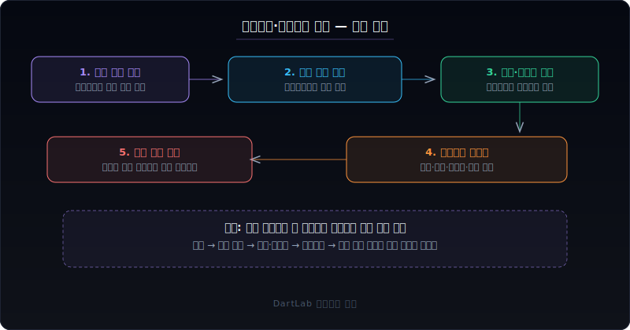
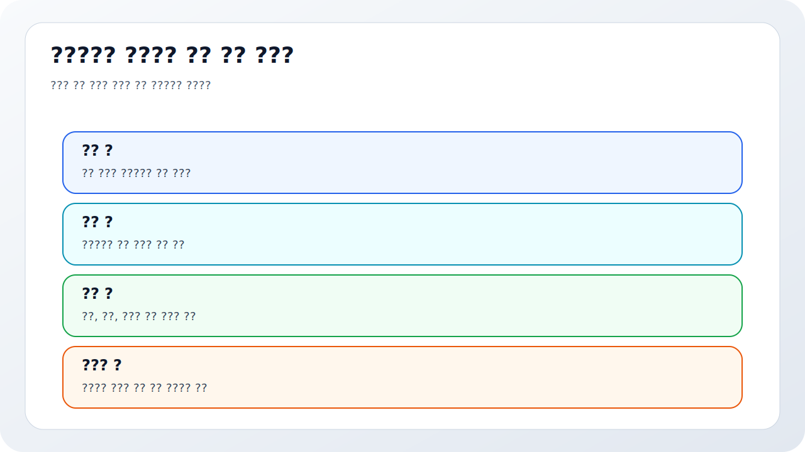
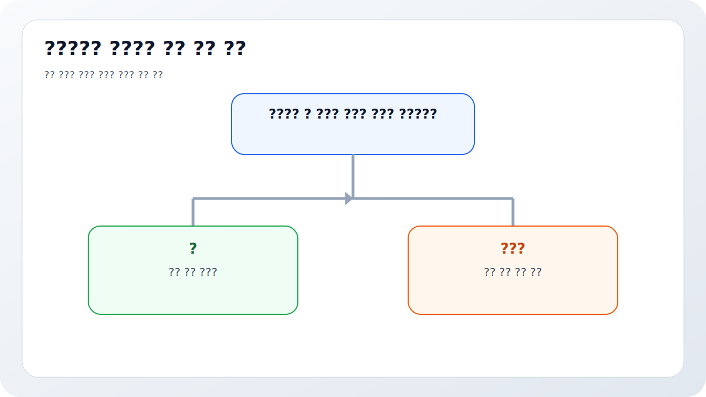
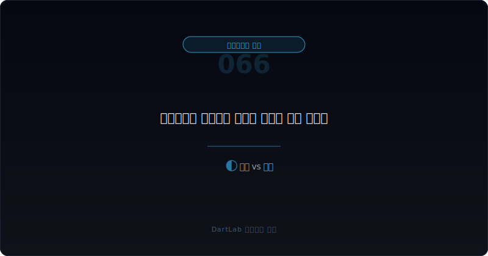
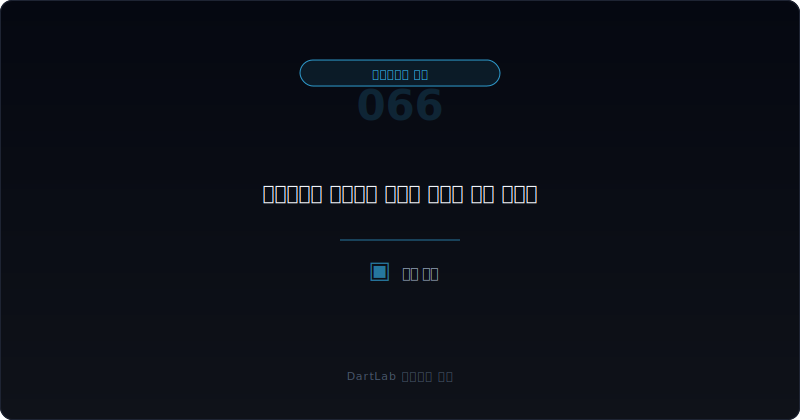

# 자본잠식과 관리종목 신호는 어디서 먼저 보이나

자본잠식은 갑자기 생긴 한 줄 경고처럼 보이지만, 실제로는 오랫동안 쌓인 손실과 자본 훼손이 숫자로 드러난 결과다. 많은 투자자는 `관리종목 지정` 같은 공식 문구가 나온 뒤에야 위험을 체감하지만, 그보다 훨씬 앞에서 이미 신호는 보이는 경우가 많다. 영업손실 누적, 자본 감소, 계속기업 관련 불확실성, 차입 약정 압박, 감자와 희석형 조달, 감사문구 변화가 같이 움직이기 시작하면 자본잠식은 더 이상 회계용 단어가 아니다.

특히 자본잠식은 단순 적자보다 무겁다. 손실이 누적돼 자본 완충력이 약해졌다는 뜻이기 때문이다. 이 상태가 이어지면 회사는 사업보다 자본을 먼저 방어해야 하고, 그 과정에서 감자, 주식병합, 유상증자, 메자닌 재협상, 자산매각 같은 이벤트가 연속으로 붙기 쉽다. 그래서 자본잠식은 재무제표 한 칸이 아니라 `경고 구조`로 읽는 편이 맞다.

이 글은 자본잠식과 관리종목 신호를 `손실 누적 확인 -> 자본 훼손 속도 확인 -> 감사보고서와 거래소 기준 연결 -> 자본거래 이벤트 확인 -> 다음 보고서에서 해소가 실제인지 추적` 순서로 읽는 방법을 정리한다. 기본 배경은 [계속기업 관련 불확실성 문구는 어디서 강해지나](/blog/going-concern-uncertainty-signals), 유동성 압박은 [차입 약정 위반과 기한이익상실 위험은 어디서 먼저 드러나나](/blog/debt-covenant-breach-and-acceleration-risk), 자본거래는 [감자와 주식병합 공시는 무엇을 먼저 봐야 하나](/blog/capital-reduction-and-reverse-split-disclosure)와 같이 보면 좋다.

---

## 왜 공식 지정 전에도 신호가 먼저 보이나

자본잠식은 손실이 쌓인 뒤 나타나는 결과다. 즉 지정 자체보다 그 전 과정이 더 중요하다. 영업손실이 반복되고, 영업현금흐름이 약하고, 차입 의존도가 높아지고, 유상증자나 메자닌에 의존하는 구조가 반복되면 자본 훼손은 서서히 진행된다. 공식 지정 문구는 마지막 확인에 가깝다.

또한 회사는 자본잠식을 피하거나 늦추기 위해 여러 자본거래를 동원할 수 있다. 감자, 주식병합, 자본잉여금 활용, 유상증자, 자산 매각, 조건변경 메자닌이 대표적이다. 이 중 일부는 실제 회복의 일부일 수 있지만, 일부는 경고 시점을 미루는 장치일 뿐일 수도 있다. 그래서 투자자는 `지정 여부`보다 `왜 여기까지 왔는가`를 먼저 봐야 한다.

감사보고서와 거래소 기준도 중요한 층이다. 감사의견, 자본잠식률, 매출 규모, 지배구조 요건 같은 요소가 같이 작동할 수 있기 때문이다. 그래서 자본잠식은 단순 손익 문제가 아니라 공시, 감사, 거래소 규정이 한 번에 만나는 영역이다.

---

## 무엇을 먼저 붙여서 봐야 하나

| 먼저 볼 항목 | 왜 중요한가 |
| --- | --- |
| 누적 손실과 자본총계 | 자본 훼손 속도를 바로 보여 준다 |
| 자본잠식률 | 공식 경고 단계와 연결된다 |
| 감사의견과 문구 | 회복 가능성보다 불확실성이 큰지 읽을 수 있다 |
| 차입 구조와 약정 | 자본 악화가 유동성 위기로 번지는지 본다 |
| 감자·유상증자·메자닌 | 해소 방식이 체질 개선인지 시간 벌기인지 본다 |
| 자산 매각 | 본업 회복이 아닌 임시 방편인지 확인한다 |
| 후속 보고서 | 자본이 실제로 회복되는지 추적한다 |

실전에서는 먼저 자본총계와 누적 결손, 손실 흐름을 같이 보는 것이 핵심이다. 적자가 한 번 난 것과 자본이 지속적으로 깎인 것은 다르다. 자본잠식은 결국 완충력의 문제이므로, 손실 규모와 자본 규모를 나란히 보는 편이 훨씬 직관적이다.

그다음은 거래소와 감사 층을 붙여야 한다. 감사보고서 제출 시점, 자본잠식률 확인, 감사의견 변화, 관리종목 가능성은 서로 따로 움직이지 않는다. 특히 감사보고서가 늦어지거나, 계속기업 관련 불확실성 문구가 강해지거나, 정정공시가 반복되면 자본잠식 해석은 더 무거워진다. 이때 [감사 전 재무제표 정정과 재감사는 어디서 위험 신호가 보이나](/blog/restatement-before-audit-and-reaudit-signals), [적정 의견이 적정이어도 불안한 회사는 어떤 패턴을 보이나](/blog/clean-audit-opinion-but-still-risky)와 연결이 생긴다.

마지막으로 자본거래의 성격을 봐야 한다. 감자로 결손을 정리한 뒤 본업이 회복되는지, 유상증자로 자금을 넣고도 다시 메자닌을 손대는지, 자산 매각까지 연달아 붙는지 보면 `회복`과 `유예`를 어느 정도 구분할 수 있다.

---

## 어디서부터 해석을 가르면 되나

가장 실용적인 질문은 이것이다. `이 회사는 자본을 실제로 회복하고 있는가, 아니면 지정 시점만 미루고 있는가`.

회복 단계에 가까운 경우는 자본확충 이후 영업손실 폭이 줄고, 영업현금흐름이 개선되고, 추가 자본거래 의존이 줄어든다. 유예 단계에 가까운 경우는 감자나 증자를 통해 숫자는 잠시 정리됐지만 본업과 현금흐름은 아직 약하다. 경고 심화 단계는 자본확충 뒤에도 손실이 계속되고, 메자닌 조건변경과 자산매각이 이어지고, 감사문구가 더 무거워지는 경우다.

이 구분이 중요한 이유는 같은 `자본잠식 해소`라도 질이 다르기 때문이다. 회복형 해소는 본업과 현금이 따라온다. 유예형 해소는 형식상 기준만 맞추고, 얼마 지나지 않아 다시 자본이 흔들린다. 그래서 [영업현금흐름이 순이익을 부정할 때](/blog/operating-cash-flow-vs-net-income), [메자닌 만기연장과 조건변경은 누구에게 유리한가](/blog/mezzanine-extension-and-condition-change), [매각예정자산과 중단영업은 무엇을 가리나](/blog/held-for-sale-and-discontinued-operations) 같은 글과 이어서 읽는 편이 좋다.

---

## 상대적으로 건강한 경우와 더 조심해야 하는 경우는 무엇이 다른가

| 관찰 포인트 | 상대적으로 건강한 경우 | 더 조심해야 하는 경우 |
| --- | --- | --- |
| 손실 흐름 | 손실 폭이 줄고 본업 개선이 보인다 | 손실이 반복되고 폭도 커진다 |
| 자본확충 방식 | 한 번의 확충 뒤 구조가 안정된다 | 감자, 증자, 메자닌이 반복된다 |
| 감사 문구 | 불확실성 설명이 줄어든다 | 계속기업, 정정, 재감사 신호가 붙는다 |
| 현금흐름 | 영업현금이 조금씩 회복된다 | 조달 없이는 버티기 어렵다 |
| 자산 매각 | 비핵심 정리 수준에 그친다 | 핵심 자산까지 팔기 시작한다 |
| 후속 사건 | 추가 경고 없이 안정된다 | 관리종목, 상장적격성 심사 우려가 커진다 |

상대적으로 건강한 경우는 자본확충이 끝난 뒤 본업 숫자와 현금이 뒤따라 온다. 손실 폭이 줄고, 자본거래가 더 이상 반복되지 않고, 감사 문구도 무거워지지 않는다. 이런 경우 감자나 증자 자체는 아프지만 회복 과정의 일부로 읽을 수 있다.

더 조심해야 하는 경우는 감자 이후 유상증자, 그 뒤 메자닌 조건변경, 그 뒤 자산매각이 이어진다. 이런 패턴은 자본을 회복하는 것이 아니라 자본 훼손의 속도를 늦추는 데 가깝다. 이때는 공식 지정 전이라도 이미 위험 구조 안에 들어와 있다고 보는 편이 낫다.

---

## 왜 자본잠식은 자본거래보다 본업 숫자를 같이 봐야 하나

감자나 증자는 자본 수치를 바꿀 수 있다. 하지만 본업이 약하면 숫자는 다시 무너질 수 있다. 그래서 자본잠식 해석에서 가장 중요한 것은 자본거래 자체가 아니라 그 뒤 본업이 달라졌는지다. 매출, 마진, 영업현금흐름, 차입 의존도, 판관비 구조가 따라오지 않으면 자본 확충은 임시방편일 가능성이 높다.

또한 거래소 기준은 도달 여부만 보여 준다. 기준을 간신히 맞췄다고 해서 질적 회복이 끝난 것은 아니다. 그래서 자본잠식을 볼 때는 `자본총계`, `영업현금흐름`, `감사문구`, `후속 자본거래` 네 줄을 같이 적는 편이 가장 실전적이다.

결국 자본잠식은 회계 용어라기보다 회사의 생존 여유가 얼마나 남았는지 보여 주는 신호다. 이 신호를 읽을 때는 숫자 한 칸보다 구조 전체를 보는 편이 맞다.

특히 투자자가 자주 놓치는 것은 `해소 방식의 질`이다. 같은 자본확충이라도 외부 자금이 들어와 본업 투자와 운영 안정으로 이어지는 경우가 있고, 단지 기준 충족을 위해 회계적으로만 정리되는 경우가 있다. 그래서 자본잠식 해소 공시가 나오면 안도하기보다 그 뒤 분기에서 매출 총이익, 영업현금흐름, 차입 규모가 같이 나아지는지 먼저 확인해야 한다.

거래소 경고는 문턱이지만 사업은 연속적이다. 경고 직전 회사와 경고 직후 회사가 하루 만에 달라지지는 않는다. 결국 공식 지정 전의 흐름을 읽어 두는 사람이 훨씬 먼저 위험 구조를 볼 수 있고, 자본거래가 회복인지 유예인지도 더 빨리 구분할 수 있다.

그래서 조기 관찰이 중요하다.

---

## 자주 놓치는 해석 4가지

### 1. 관리종목 지정 전에는 괜찮다고 본다

신호는 보통 훨씬 먼저 나온다.

### 2. 감자나 증자만으로 해소됐다고 본다

본업과 현금이 회복되지 않으면 다시 흔들릴 수 있다.

### 3. 감사문구를 따로 본다

자본잠식은 감사와 거래소 기준이 같이 만나는 영역이다.

### 4. 자산 매각을 구조 개선으로만 본다

유동성 압박 때문에 파는 것일 수도 있다.

---

## 다음 보고서와 후속 숫자에서 무엇을 다시 봐야 하나

| 이번에 본 것 | 다음에 다시 볼 것 |
| --- | --- |
| 자본총계와 잠식률 | 실제로 안정권으로 돌아오는가 |
| 손실 흐름 | 영업손실이 줄어드는가 |
| 영업현금흐름 | 조달 없이 버틸 수 있는가 |
| 감사 문구 | 계속기업·정정·한정 사유가 더 무거워지는가 |
| 자본거래 | 추가 감자, 증자, 메자닌 조정이 붙는가 |
| 자산 매각 | 임시 대응이 반복되는가 |

자본잠식은 한 번의 공시보다 다음 보고서가 더 중요하다. 감자와 증자로 숫자를 맞춘 뒤에도 손실이 반복되면 경고 구조는 그대로다. 반대로 자본거래 이후 본업과 현금흐름이 실제로 안정되면 회복 가능성을 더 진지하게 볼 수 있다.

가장 실용적인 메모는 네 줄이다. `자본총계`, `손실 속도`, `감사문구`, `다음 조달`. 이 네 줄만 계속 적어도 공식 지정 전에 위험 구조가 보이기 시작한다.

---

## 10분 체크리스트

- 누적 손실과 자본총계를 같이 봤는가
- 자본잠식률과 감사보고서 시점을 연결했는가
- 계속기업 관련 불확실성 문구를 확인했는가
- 감자·증자·메자닌 같은 자본거래가 반복되는가
- 자산 매각이 임시 대응인지 생각해 봤는가
- 다음 보고서에서 본업과 현금흐름이 회복되는지 추적할 계획이 있는가

## FAQ

### 관리종목 지정 문구가 없으면 아직 안전한가

아니다. 손실 누적과 자본 훼손, 감사문구 변화가 더 먼저 신호를 준다.

### 가장 먼저 봐야 할 것은 무엇인가

자본총계, 누적 손실, 감사보고서 문구다.

### 감자나 증자는 해소 신호인가

그 자체만으로는 아니다. 본업과 현금흐름이 따라오는지 봐야 한다.

### 무엇을 같이 보면 좋은가

계속기업 관련 불확실성, 차입 약정, 감자, 메자닌 조건변경, 자산 매각을 같이 보면 좋다.

## 같이 읽으면 좋은 글

- [계속기업 관련 불확실성 문구는 어디서 강해지나](/blog/going-concern-uncertainty-signals)
- [차입 약정 위반과 기한이익상실 위험은 어디서 먼저 드러나나](/blog/debt-covenant-breach-and-acceleration-risk)
- [감자와 주식병합 공시는 무엇을 먼저 봐야 하나](/blog/capital-reduction-and-reverse-split-disclosure)
- [감사 전 재무제표 정정과 재감사는 어디서 위험 신호가 보이나](/blog/restatement-before-audit-and-reaudit-signals)
- [메자닌 만기연장과 조건변경은 누구에게 유리한가](/blog/mezzanine-extension-and-condition-change)
- [매각예정자산과 중단영업은 무엇을 가리나](/blog/held-for-sale-and-discontinued-operations)

## 참고한 공식 자료

- [DART 소개 - 보고서정보](https://dart.fss.or.kr/introduction/content2.do)
- [기업공시 길라잡이](https://dart.fss.or.kr/info/main.do?menu=120)
- [KRX 2026 정기주총 관련 주요 안내사항 PDF](https://kind.krx.co.kr/external/notice/dst/20260202/kospi_1.pdf)
- [코스닥시장 상장규정](https://www.law.go.kr/%EB%B2%95%EB%A0%B9/%EC%BD%94%EC%8A%A4%EB%8B%A5%EC%8B%9C%EC%9E%A5%EC%83%81%EC%9E%A5%EA%B7%9C%EC%A0%95)
- [유가증권시장 상장규정](https://www.law.go.kr/%EB%B2%95%EB%A0%B9/%EC%9C%A0%EA%B0%80%EC%A6%9D%EA%B6%8C%EC%8B%9C%EC%9E%A5%EC%83%81%EC%9E%A5%EA%B7%9C%EC%A0%95)

## 정리

자본잠식과 관리종목 신호는 공식 지정 문구보다 훨씬 먼저 나타난다. 손실 누적, 자본 훼손, 감사문구, 차입 압박, 자본거래 반복이 같이 움직이면 이미 경고 구조 안에 들어온 것이다.

핵심은 `지정됐는가`가 아니라 `지정 전부터 어떤 구조가 쌓이고 있었는가`를 묻는 것이다. 이 질문을 붙이면 자본잠식은 훨씬 덜 갑작스러운 사건으로 보인다.
