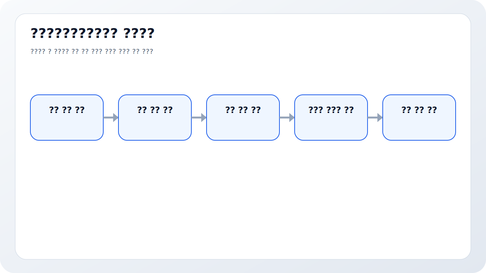
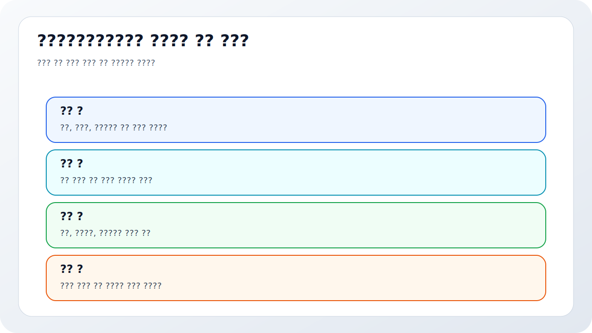
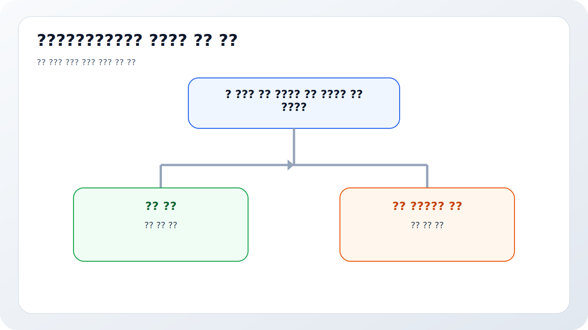
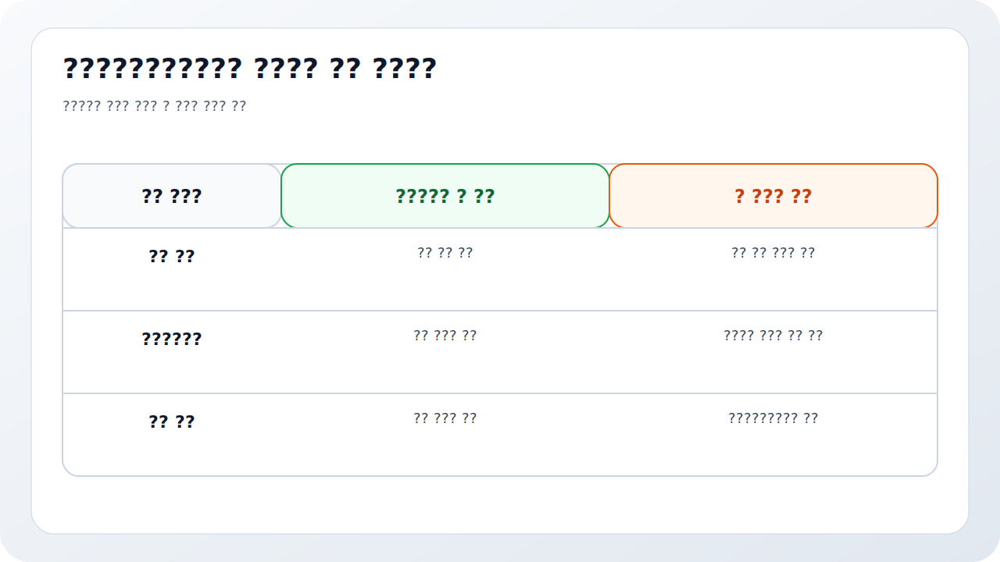
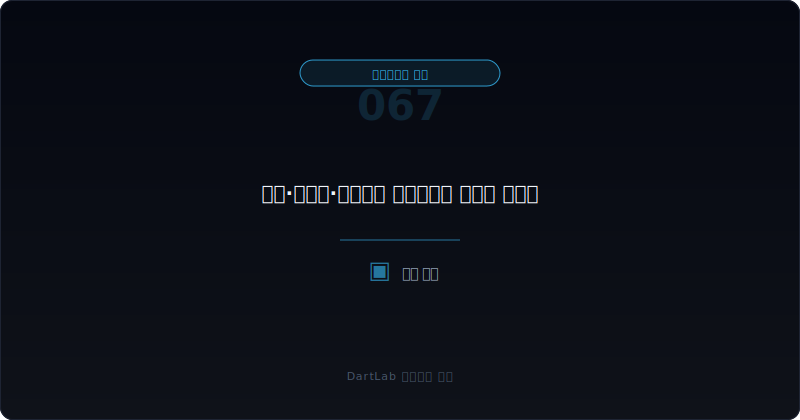

# 한정·부적정·의견거절 감사의견은 무엇이 다른가

감사보고서에서 가장 위험한 실수는 `비적정`을 하나로 묶어 보는 것이다. 많은 투자자는 적정이 아니면 다 비슷하게 나쁘다고 생각하지만, 실제로는 한정, 부적정, 의견거절이 말하는 신호의 강도와 방향이 다르다. 어떤 경우는 특정 항목의 문제를 가리키고, 어떤 경우는 재무제표 전체 신뢰를 무너뜨리며, 어떤 경우는 감사인이 아예 판단 근거를 확보하지 못했다는 뜻이 된다.

특히 이 차이는 투자 행동으로 이어질 때 중요해진다. 한정이면 `무슨 항목이 문제인지`를 먼저 따져야 하고, 부적정이면 `무엇을 믿지 말아야 하는지`를 더 넓게 봐야 하며, 의견거절이면 `회사가 지금 무엇을 숨기고 있거나 보여 주지 못하는가`를 가장 먼저 물어야 한다. 그래서 같은 비적정이라도 대응 순서가 다르다.

이 글은 비적정 감사의견을 `의견 유형 확인 -> 원인 문구 확인 -> 재무제표 전체 영향 범위 판단 -> 계속기업·자본잠식·정정공시와 연결 -> 다음 공시에서 무엇을 다시 볼지 정리` 순서로 읽는 방법을 정리한다. 기본 토대는 [감사보고서와 KAM, 무엇을 먼저 봐야 하나](/blog/audit-report-and-kam), 감사 품질의 신호는 [감사보수와 비감사보수는 어디가 신호인가](/blog/audit-fees-and-non-audit-fees), 경고 구조는 [자본잠식과 관리종목 신호는 어디서 먼저 보이나](/blog/capital-impairment-and-watchlist-signals)와 같이 보면 좋다.

---

## 왜 비적정이라고만 읽으면 안 되나

한정은 대체로 `특정 범위의 문제`를 뜻한다. 감사인이 전반적으로는 재무제표를 보되, 어떤 항목이나 상황에 대해 예외를 붙인 것이다. 그래서 투자자는 한정의 이유가 무엇인지, 그 항목이 회사 전체에서 얼마나 중요한지부터 봐야 한다. 모든 한정이 즉시 치명적인 것은 아니지만, 어떤 항목이 붙었는지에 따라 의미는 매우 달라진다.

부적정은 한 단계 더 무겁다. 특정 항목의 문제가 아니라 재무제표 전체가 왜곡됐다고 감사인이 판단한 경우에 가깝다. 이때는 개별 숫자를 다시 고쳐 보면 되는 수준이 아니라, 그 회사가 내놓은 재무제표를 기본적으로 신뢰하기 어렵다는 뜻에 가깝다. 투자자는 `무엇이 틀렸는가`보다 `어디까지 틀렸는가`를 먼저 물어야 한다.

의견거절은 또 다르다. 감사인이 아예 충분한 감사증거를 얻지 못했거나, 핵심 불확실성이 너무 커서 의견을 낼 수 없다는 뜻이다. 겉으로 보면 부적정보다 약해 보일 수 있지만, 실전에서는 오히려 더 무겁게 읽어야 하는 경우가 많다. 숫자가 틀렸다고 판단한 것이 아니라, 맞는지 틀린지조차 말하기 어렵다고 선언한 것이기 때문이다. 이 점에서 [감사 전 재무제표 정정과 재감사는 어디서 위험 신호가 보이나](/blog/restatement-before-audit-and-reaudit-signals), [계속기업 관련 불확실성 문구는 어디서 강해지나](/blog/going-concern-uncertainty-signals)와의 연결이 중요하다.

---

## 어떤 숫자 조합이 먼저 경고하나

| 먼저 볼 항목 | 왜 중요한가 |
| --- | --- |
| 의견 유형 | 신호의 강도와 대응 순서가 달라진다 |
| 근거 문단 | 특정 항목 문제인지 전반 문제인지 보인다 |
| 계속기업 관련 문구 | 유동성과 존속 가능성 문제인지 확인한다 |
| 정정공시 이력 | 숫자 신뢰도 훼손이 반복되는지 본다 |
| 자본잠식·관리종목 신호 | 거래소 리스크로 번지는지 본다 |
| 경영진 설명 | 책임 인정과 해소 계획이 읽히는지 본다 |

실전에서는 감사의견 유형만 보지 말고 바로 아래 근거 문단까지 붙여서 읽어야 한다. 한정이라도 재고, 매출, 특수관계자, 계속기업, 자산평가처럼 붙는 항목이 다르면 의미가 완전히 달라진다. 부적정과 의견거절도 마찬가지다. 같은 이름이어도 원인이 회계처리 위반인지, 자료 미제공인지, 계속기업 불확실성인지에 따라 투자 판단은 달라진다.

그다음은 영향 범위를 가늠해야 한다. 한정이라면 예외가 국소적인지, 여러 숫자를 연쇄적으로 흔드는지 본다. 부적정이라면 손익, 자산, 자본, 현금흐름 중 무엇이 핵심적으로 흔들리는지 봐야 한다. 의견거절이라면 감사인이 증거를 확보하지 못한 영역이 어디인지 확인해야 한다. 회계자료 접근이 막혔는지, 종속회사 감사가 안 됐는지, 계속기업 가정이 불안한지에 따라 위기 구조가 다르다.

거래소와 후속 공시도 바로 붙여 봐야 한다. 비적정 감사의견은 단순 회계 이슈가 아니라 매매정지, 관리종목, 추가 정정, 자본거래 압박으로 이어질 수 있다. 그래서 [적정 의견이 적정이어도 불안한 회사는 어떤 패턴을 보이나](/blog/clean-audit-opinion-but-still-risky), [차입 약정 위반과 기한이익상실 위험은 어디서 먼저 드러나나](/blog/debt-covenant-breach-and-acceleration-risk), [자본잠식과 관리종목 신호는 어디서 먼저 보이나](/blog/capital-impairment-and-watchlist-signals)와 함께 묶어 읽는 편이 안전하다.

---

## 신호가 강해지는 순서

가장 실용적인 질문은 이것이다. `이 의견은 특정 예외를 경고하는가, 전체 재무제표 신뢰를 부정하는가, 아니면 아예 판단 불능을 말하는가`.

한정은 예외 경고에 가깝다. 특정 문제를 중심으로 범위를 좁혀 볼 수 있다. 부적정은 전반 부정에 가깝다. 회사가 제시한 숫자 체계 전체를 다시 의심해야 한다. 의견거절은 판단 불능이다. 숫자가 틀렸는지조차 판단할 수 없다는 의미이므로, 자료 통제와 회사 신뢰도의 문제로 읽어야 한다.

이 구분이 중요한 이유는 행동이 달라지기 때문이다. 한정이면 문제가 된 항목의 비중과 반복성을 따질 수 있지만, 부적정이면 `무엇을 믿고 무엇을 버릴지`가 아니라 `거의 전부를 다시 봐야 하는지`를 따지게 된다. 의견거절이면 회복 가능성을 보기 전에 자료 접근과 통제 실패, 회사의 협조 수준부터 봐야 한다.

---

## 위험도를 나누는 기준

| 관찰 포인트 | 상대적으로 덜 위험한 경우 | 더 조심해야 하는 경우 |
| --- | --- | --- |
| 한정 사유 | 특정 항목에 국한되고 설명이 분명하다 | 핵심 사업 숫자나 계속기업과 연결된다 |
| 부적정 사유 | 범위가 읽히고 정정 계획이 보인다 | 손익·자산·자본 전반을 흔든다 |
| 의견거절 사유 | 일시적 자료 제약에 가깝다 | 회사 통제와 협조 부족이 깊다 |
| 후속 조치 | 정정과 보강 계획이 빠르게 나온다 | 추가 정정, 재감사, 자본거래가 연달아 붙는다 |
| 경영진 태도 | 문제를 인정하고 해소 일정을 제시한다 | 표현이 모호하고 책임 분리가 심하다 |
| 거래소 리스크 | 형식적 이슈에 그친다 | 매매정지·관리종목 신호로 이어진다 |

실전에서 상대적으로 덜 위험한 경우는 문제가 어디에 있는지 비교적 명확하고, 해소 계획이 빠르게 공시되며, 다음 보고서에서 개선 흔적이 보이는 경우다. 반대로 더 조심해야 하는 경우는 감사의견이 무거워졌는데도 회사 설명이 흐리고, 정정공시나 자본거래가 반복되며, 거래소 리스크까지 동시에 커지는 경우다.

특히 계속기업 관련 불확실성과 연결된 한정, 감사범위 제한이 깊은 의견거절, 전면적 회계왜곡에 가까운 부적정은 모두 강하게 봐야 한다. 이름보다 원인과 후속 사건이 더 중요하다.

---

## 왜 KAM보다 먼저 감사의견을 분리해서 봐야 하나

많은 투자자는 감사보고서에서 KAM을 먼저 읽는다. KAM은 유용하지만, 적정 의견 아래에서의 핵심 감사사항과 비적정 의견 자체는 무게가 다르다. 비적정 의견이 붙었다면 KAM보다 먼저 의견 유형과 근거 문단을 읽어야 한다. KAM은 `어려웠던 감사 영역`이지만, 비적정 의견은 `결론 자체가 달라졌다`는 뜻이기 때문이다.

그래서 감사보고서를 볼 때는 순서를 바꾸는 편이 좋다. `의견 유형 -> 근거 문단 -> 계속기업 문구 -> KAM -> 후속 정정공시` 순서가 더 실전적이다. 이 순서를 잡으면 KAM을 과잉 해석하거나, 반대로 비적정 의견의 무게를 가볍게 보는 실수를 줄일 수 있다.

또한 비적정 의견은 단일 문구가 아니라 후속 사건의 출발점이 되는 경우가 많다. 감사보고서가 끝이 아니라 거래소 공시, 정정, 자본거래, 채권자 반응이 뒤따를 수 있으므로, 감사의견은 늘 `다음 사건의 시작점`으로 읽어야 한다.

실전 메모로는 `무슨 의견인가`, `왜 그런가`, `어디까지 흔드는가` 세 줄이면 충분하다. 이 세 줄이 적히지 않으면 비적정 감사의견을 봤어도 실제로는 아무것도 정리하지 못한 상태와 비슷하다. 반대로 이 세 줄이 적히면 다음 공시를 볼 때도 훨씬 덜 흔들린다.

이 세 줄은 결국 투자자의 방어선이 된다.

---

## 자주 놓치는 해석 함정

### 1. 비적정을 하나로 묶어 본다

한정, 부적정, 의견거절은 강도와 의미가 다르다.

### 2. 유형만 보고 근거 문단을 안 본다

무슨 이유로 그 의견이 나왔는지가 핵심이다.

### 3. KAM과 같은 무게로 본다

비적정 의견은 KAM보다 훨씬 앞단의 결론이다.

### 4. 후속 거래소 리스크를 안 붙여 본다

매매정지, 관리종목, 정정공시로 이어질 수 있다.

---

## 다음 분기에 다시 확인할 숫자

| 이번에 본 것 | 다음에 다시 볼 것 |
| --- | --- |
| 의견 유형 | 적정으로 회복되는가, 같은 유형이 반복되는가 |
| 근거 사유 | 같은 항목이 다시 문제 되는가 |
| 정정공시 | 숫자 보강이 실제로 이루어지는가 |
| 계속기업 문구 | 더 강해지는가 약해지는가 |
| 거래소 공시 | 관리종목·매매정지 등으로 이어지는가 |
| 자본거래 | 감자, 증자, 자산매각이 붙는가 |

비적정 감사의견은 한 번의 결론보다 다음 분기의 변화가 더 중요하다. 적정으로 복귀했는지, 같은 사유가 반복되는지, 정정공시가 실제로 숫자를 고쳤는지, 경영진이 약속한 해소 계획이 실행됐는지 봐야 한다. 그렇지 않으면 투자자는 `문제가 있었다`는 사실만 보고, `문제가 끝났는지`는 놓치게 된다.

같은 한정이 두세 개 보고서에 연속 반복되면 시장은 일회성보다 구조 문제로 읽기 시작한다. 반대로 유형은 같아도 근거 범위가 줄고 정정 폭이 작아지면, 해소가 진행 중인지 확인해 볼 여지가 생긴다.

가장 실용적인 메모는 네 줄이다. `유형`, `근거 사유`, `후속 정정`, `거래소 리스크`. 이 네 줄만 적어도 비적정 감사의견을 훨씬 덜 뭉뚱그려 보게 된다.

---

## 실전 점검 체크리스트

- 감사의견 유형을 정확히 적었는가
- 근거 문단에서 원인 항목을 확인했는가
- 계속기업 관련 불확실성 문구를 같이 봤는가
- 정정공시와 재감사 이력을 붙여 봤는가
- 자본잠식·거래소 리스크를 확인했는가
- 다음 보고서에서 의견 변화 여부를 추적할 계획이 있는가

## 자주 묻는 질문

### 한정도 바로 치명적인가

아니다. 하지만 어떤 항목에 붙었는지에 따라 매우 무거울 수 있다.

### 부적정과 의견거절 중 무엇이 더 나쁜가

단순 순위보다 원인이 중요하다. 부적정은 왜곡 확정, 의견거절은 판단 불능에 가깝다.

### KAM보다 무엇을 먼저 봐야 하나

비적정 감사의견 유형과 근거 문단이다.

### 무엇을 같이 보면 좋은가

계속기업 관련 불확실성, 정정공시, 자본잠식, 거래소 공시를 같이 보면 좋다.

## 관련 분석 글

- [감사보고서와 KAM, 무엇을 먼저 봐야 하나](/blog/audit-report-and-kam)
- [적정 의견이 적정이어도 불안한 회사는 어떤 패턴을 보이나](/blog/clean-audit-opinion-but-still-risky)
- [계속기업 관련 불확실성 문구는 어디서 강해지나](/blog/going-concern-uncertainty-signals)
- [감사보수와 비감사보수는 어디가 신호인가](/blog/audit-fees-and-non-audit-fees)
- [감사 전 재무제표 정정과 재감사는 어디서 위험 신호가 보이나](/blog/restatement-before-audit-and-reaudit-signals)
- [자본잠식과 관리종목 신호는 어디서 먼저 보이나](/blog/capital-impairment-and-watchlist-signals)

## 공식 출처와 근거

- [DART 소개 - 보고서정보](https://dart.fss.or.kr/introduction/content2.do)
- [기업공시 길라잡이](https://dart.fss.or.kr/info/main.do?menu=120)
- [유가증권시장 공시·상장 업무해설서 PDF](https://kind.krx.co.kr/external/dst/reference/10827/%EC%9C%A0%EA%B0%80%EC%A6%9D%EA%B6%8C%EC%8B%9C%EC%9E%A5%20%EA%B3%B5%EC%8B%9C_%EC%83%81%EC%9E%A5%20%EC%97%85%EB%AC%B4%ED%95%B4%EC%84%A4%EC%84%9C.pdf)
- [코스닥시장 공시·상장관리 해설서 PDF](https://kind.krx.co.kr/external/dst/reference/10951/%28%EA%B3%B5%EC%A7%80%29%2024%EB%85%84%EC%BD%94%EC%8A%A4%EB%8B%A5%EC%8B%9C%EC%9E%A5%EA%B3%B5%EC%8B%9C%EC%83%81%EC%9E%A5%EA%B4%80%EB%A6%AC%ED%95%B4%EC%84%A4%EC%84%9C.pdf)
- [ISA 570 Going Concern - IFAC](https://www.ifac.org/taxonomy/term/230?page=130)

## 핵심 정리

한정, 부적정, 의견거절은 모두 비적정이지만 같은 신호가 아니다. 한정은 예외 경고에 가깝고, 부적정은 전반 부정에 가깝고, 의견거절은 판단 불능에 가깝다. 그래서 같은 비적정이라도 투자자가 붙여야 할 질문과 다음 행동이 달라진다.

핵심은 `비적정인가`가 아니라 `왜 그 의견이 나왔고 어디까지 믿지 말아야 하는가`를 묻는 것이다. 이 질문을 붙이면 감사보고서를 훨씬 덜 평면적으로 읽게 된다.
