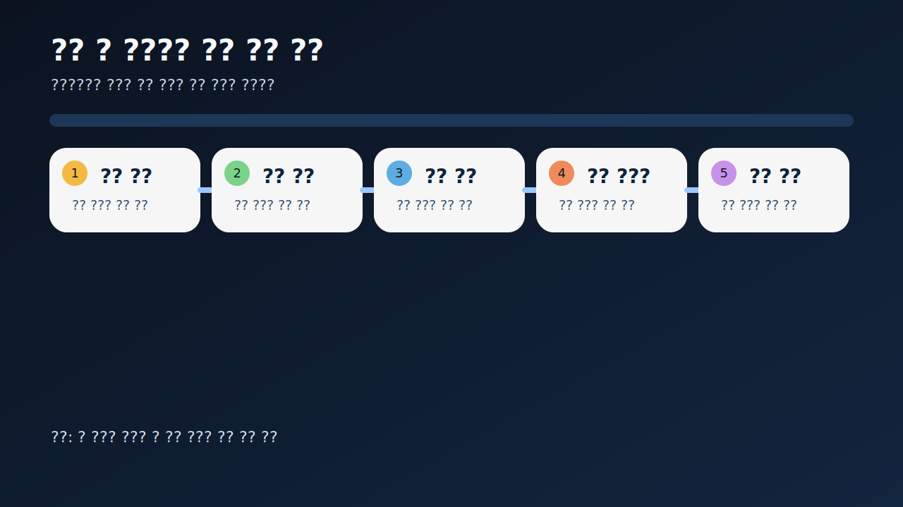
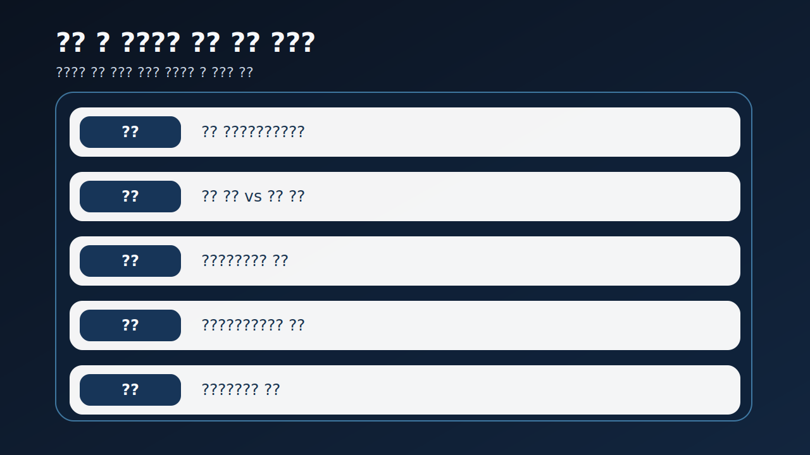
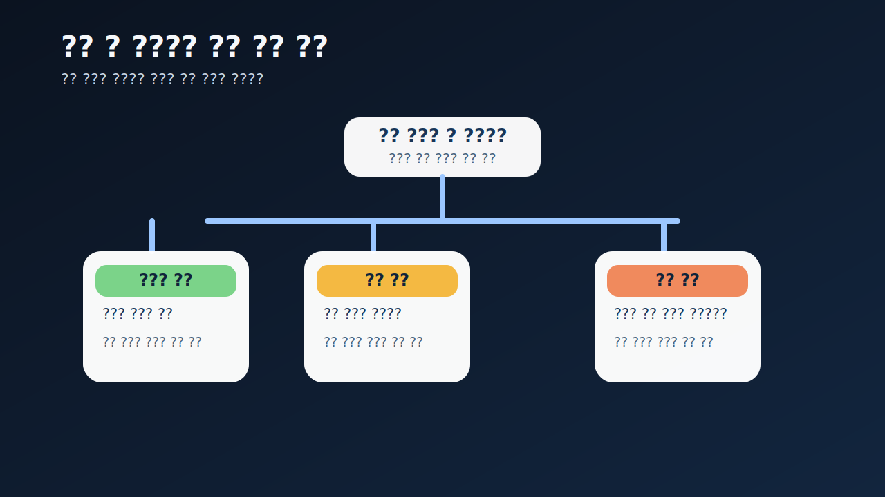
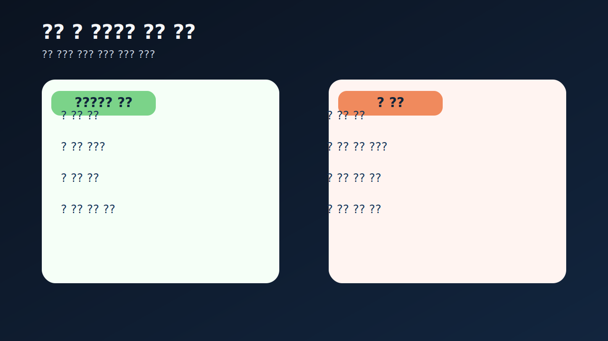
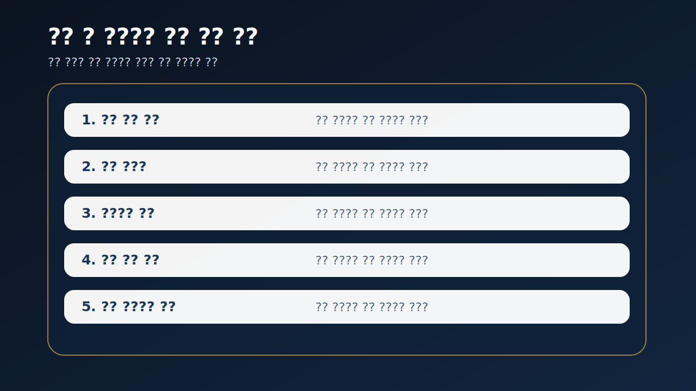

# 감사 전 내부결산 오류는 어디서 먼저 드러나나

감사 전에 숫자가 흔들리기 시작하면 많은 사람이 두 갈래로 반응한다. `아직 감사 전이니 나중에 맞춰질 것`이라며 가볍게 넘기거나, 반대로 `숫자가 틀렸으니 바로 최악`이라고 본다. 실전에서는 둘 다 얕다. 중요한 것은 숫자가 틀렸는가보다 `왜 그 시점에 흔들렸는가`, 그리고 그 흔들림이 내부통제와 후속 공시, 감사 과정에서 어떤 무게로 번지는가다.

내부결산 오류는 보통 한 줄짜리 실수로 시작해도, 설명이 흐리고 반복되면 통제 문제로 읽히기 시작한다. 반대로 영향 범위가 제한적이고 설명이 분명하면 신뢰 훼손이 생각보다 작을 수도 있다. 그래서 이 영역은 숫자 자체보다 `설명력과 반복성`을 먼저 읽는 편이 맞다.

이 글은 감사 전 내부결산 오류를 `오류가 드러난 문서 확인 -> 정정 사유와 숫자 영향 분리 -> 경영진 설명 일관성 확인 -> 감사·내부회계 문구와 연결 -> 다음 보고서에서 반복되는지 추적` 순서로 읽는 방법을 정리한다. 기본 토대는 [감사 전 재무제표 정정과 재감사는 어디서 위험 신호가 보이나](/blog/restatement-before-audit-and-reaudit-signals), 통제 축은 [내부회계관리제도와 감사위원회 활동은 어디서 위험 신호가 보이나](/blog/internal-controls-and-audit-committee), 감사 해석은 [한정·부적정·의견거절 감사의견은 무엇이 다른가](/blog/qualified-adverse-disclaimer-audit-opinions), 기본 프레임은 [사업보고서에서 감사보고서와 KAM 읽는 법](/blog/audit-report-and-kam)과 같이 보면 좋다.

---

## 왜 감사 전 숫자 흔들림이 통제 신호가 될 수 있나

감사 전 숫자는 최종 확정치가 아니다. 그래서 일부 변경이 생기는 것 자체는 이상하지 않다. 문제는 그 변경이 어디에서, 어떤 설명과 함께, 얼마나 반복적으로 나타나는가다. 매출 인식, 충당금, 연결 범위, 분류 변경, 재고와 원가 같은 핵심 영역이 자꾸 뒤늦게 바뀌면 단순 마감 오차보다 내부결산 체계 문제를 의심해야 한다.

특히 내부결산 오류가 위험해지는 순간은 `숫자 수정`이 `설명 수정`으로 번질 때다. 처음에는 단순 분류 변경이라고 했다가 나중에는 회계 판단 변경, 다시 나중에는 자료 미비라고 설명이 바뀌면 투자자는 숫자 자체보다 조직의 보고 체계를 더 걱정하게 된다.

그래서 감사 전 내부결산 오류는 `틀렸는가`가 아니라 `왜 이 정도까지 늦게 잡혔는가`를 먼저 묻는 편이 맞다. 이 질문이 붙으면 공시를 훨씬 현실적으로 읽게 된다.

---

## 어떤 숫자 조합이 먼저 경고하나

| 먼저 볼 항목 | 왜 중요한가 |
| --- | --- |
| 오류가 드러난 문서 | 잠정 실적, 정정 공시, 주석 보강 중 어디인지 본다 |
| 정정 사유 | 단순 입력 오류인지 핵심 판단 변경인지 본다 |
| 숫자 영향 범위 | 손익, 자본, 현금흐름 중 어디까지 흔드는지 본다 |
| 경영진 설명 | 사유와 일정 설명이 일관적인지 본다 |
| 내부회계·감사위원회 | 통제 실패 신호가 같이 보이는지 본다 |
| 후속 감사 문구 | KAM, 강조사항, 비적정 의견으로 번지는지 본다 |

실전에서는 먼저 `어디서 드러났는가`를 적는 편이 좋다. 잠정 실적 단계에서 흔들렸는지, 감사 전 재무제표 제출 단계인지, 사업보고서 직전인지에 따라 무게가 다르기 때문이다. 그다음에는 정정 사유와 영향 숫자를 같은 줄에 두고 본다. 영향이 큰데 사유 설명이 짧으면 더 조심해야 한다.

또 하나 중요한 것은 설명의 일관성이다. 같은 오류를 두고 회사 설명이 계속 바뀌면 그 자체가 신뢰도 하락 신호가 된다. 이 부분은 [감사의견이 적정이어도 불안한 회사는 어떤 패턴을 보이나](/blog/clean-audit-opinion-but-still-risky), [감사보수와 비감사보수는 어디가 신호인가](/blog/audit-fees-and-non-audit-fees)와 같이 보면 더 선명해진다.

---

## 신호가 강해지는 순서

가장 실용적인 질문은 이것이다. `이번 오류는 제한적 마감 실수인가, 회계 판단 보정인가, 통제 실패의 시작인가`.

제한적 마감 실수라면 오류 위치와 사유, 수정 범위가 비교적 분명하고 후속 설명도 짧게 정리된다. 회계 판단 보정이라면 손익과 자산, 충당금, 인식 시점 같은 핵심 항목이 흔들릴 수 있다. 통제 실패 신호라면 설명이 자주 바뀌고, 내부회계나 감사 문구, 후속 정정까지 연속으로 붙는다.

이 구분이 중요한 이유는 투자자가 미래 숫자의 신뢰도를 다시 계산해야 하기 때문이다. 한 번의 오류 자체보다, 다음 분기에도 비슷한 일이 반복될 가능성이 더 큰 문제일 수 있다. 그래서 내부결산 오류는 과거 수정이 아니라 `앞으로 나올 숫자의 신뢰도 테스트`로 보는 편이 맞다.

---

## 위험도를 나누는 기준

| 관찰 포인트 | 상대적으로 관리 가능한 경우 | 더 조심해야 하는 경우 |
| --- | --- | --- |
| 오류 사유 | 원인과 범위가 비교적 분명하다 | 이유가 자주 바뀌거나 모호하다 |
| 숫자 영향 | 특정 항목 중심으로 제한적이다 | 손익, 자본, 현금흐름이 함께 흔들린다 |
| 설명 일관성 | 경영진 설명이 이후에도 유지된다 | 공시마다 설명이 달라진다 |
| 통제 구조 | 내부회계와 감독 반응이 읽힌다 | 통제 개선 설명이 거의 없다 |
| 후속 흐름 | 같은 논점이 반복되지 않는다 | 정정, 재감사, 비적정 문구로 이어진다 |

상대적으로 관리 가능한 경우는 무엇이 잘못됐는지와 왜 고쳤는지가 비교적 빠르게 설명된다. 반대로 더 조심해야 하는 경우는 숫자 영향은 큰데 설명이 짧고, 시간이 지날수록 사유가 계속 바뀐다. 이때는 오류 한 건보다 보고 체계의 약점을 먼저 의심하는 편이 맞다.

특히 [계속기업 관련 불확실성 문구는 어디서 강해지나](/blog/going-concern-uncertainty-signals), [차입 약정 위반과 기한이익상실 위험은 어디서 먼저 드러나나](/blog/debt-covenant-breach-and-acceleration-risk), [자본잠식과 관리종목 신호는 어디서 먼저 보이나](/blog/capital-impairment-and-watchlist-signals)와 겹치면 해석은 훨씬 무거워진다. 숫자 오류가 단순한 마감 문제가 아니라 자금 압박과 조직 약점이 동시에 드러난 것일 수 있기 때문이다.

---

## 왜 숫자 하나보다 설명 일관성이 더 빨리 무너질 수 있나

숫자는 나중에 고칠 수 있다. 하지만 설명 일관성은 흔들리기 시작하면 훨씬 더 빨리 신뢰를 잃는다. 같은 오류를 두고 이유와 영향 범위, 발견 시점이 계속 바뀌면 시장은 그 숫자가 아니라 그 숫자를 관리하는 시스템을 의심하게 된다.

이 점은 초보자가 자주 놓친다. 보통은 수정된 최종 숫자를 보고 `결국 맞췄으니 끝난 것 아닌가`라고 생각하기 쉽다. 하지만 실전에서는 `왜 처음에 틀렸는가`, `왜 그렇게 늦게 발견됐는가`, `왜 설명이 바뀌었는가`가 더 많은 정보를 준다.

그래서 내부결산 오류를 볼 때는 숫자표 옆에 설명 타임라인을 같이 적는 편이 좋다. `처음 설명`, `정정 설명`, `감사 후 문구` 이 세 줄만 있어도 신뢰 해석이 훨씬 빨라진다.

실전 메모로는 `어디서 흔들렸나`, `왜 바뀌었나`, `누가 다시 설명했나` 세 줄이 가장 유용하다. 이 세 줄이 있으면 같은 회사의 다음 공시를 볼 때도 훨씬 덜 흔들린다.

---

## 실전에서 가장 빨리 구분되는 조합은 무엇인가

이 주제에서 가장 빨리 위험해지는 조합은 `핵심 숫자 정정 + 설명 변경 반복 + 내부회계 개선 문구 부재`다. 숫자 하나가 틀린 것보다, 왜 틀렸는지 설명이 계속 바뀌고 통제 개선이 보이지 않는 쪽이 훨씬 더 무겁다. 이런 경우는 다음 공시의 숫자도 보수적으로 읽는 편이 맞다.

반대로 `정정 사유 명확 + 영향 범위 제한 + 다음 보고서 설명 안정` 조합이면 신뢰 훼손이 생각보다 크지 않을 수 있다. 그래서 내부결산 오류는 정정 사실만 세지 말고, `설명 품질`과 `다음 문서의 안정성`을 같이 기록해 두는 편이 실전적이다.

또 자주 놓치는 조합이 `잠정 숫자 수정 + 감사 문구 무거워짐 + 자금조달 이벤트 동시 등장`이다. 이 셋이 겹치면 단순 결산 오류보다 조직 전체의 압박 신호로 해석하는 편이 맞다. 숫자 수정이 곧바로 신뢰도와 유동성 문제로 연결될 수 있기 때문이다.

설명 타임라인이 짧고 깨끗하면 정정 하나가 남기는 상처도 작다. 반대로 타임라인이 길고 복잡하면 숫자보다 시스템을 먼저 의심해야 한다.

투자자 입장에서는 그 차이가 다음 숫자를 믿는 속도를 바꾼다.

이게 핵심이다.

---

## 다음 분기에 다시 확인할 숫자

| 이번에 본 것 | 다음에 다시 볼 것 |
| --- | --- |
| 오류 사유 | 같은 논점이 다시 반복되는가 |
| 숫자 영향 | 다음 기수에도 영향이 이어지는가 |
| 경영진 설명 | 설명 문구가 안정되는가 다시 바뀌는가 |
| 내부회계 설명 | 구체적 개선 조치가 보이는가 |
| 감사 문구 | KAM, 강조사항, 비적정 의견이 무거워지는가 |
| 후속 이벤트 | 정정, 재감사, 자금조달과 연결되는가 |

감사 전 내부결산 오류는 다음 보고서를 보기 전까지 결론을 내리기 어렵다. 같은 오류가 또 반복되는지, 설명이 안정되는지, 감사 문구가 더 무거워지는지 확인해야 의미가 드러난다. 그래서 가능하면 `오류 사유`, `영향 숫자`, `설명 변화`, `통제 개선`, `감사 문구` 다섯 줄을 적어 두는 편이 좋다.

같은 논점이 한 번 더 나오면 해석이 확 달라진다. 그 순간부터는 단순 실수보다 시스템 문제로 읽는 편이 맞다.

---

## 실전 점검 체크리스트

- 오류가 드러난 문서와 시점을 적었는가
- 정정 사유와 영향 숫자를 같이 비교했는가
- 회사 설명이 공시마다 바뀌는지 확인했는가
- 내부회계와 감사위원회 설명을 같이 봤는가
- 감사 문구가 더 무거워지는지 확인했는가
- 같은 논점이 다음 보고서에서도 반복되는지 추적할 계획이 있는가

## 자주 묻는 질문

### 감사 전 숫자가 바뀌면 무조건 위험한가

아니다. 다만 영향 범위와 설명 일관성을 같이 봐야 한다.

### 무엇이 가장 먼저 중요한가

정정 사유와 그 사유가 이후 공시에서도 같은 설명으로 유지되는지다.

### 무엇을 같이 보면 좋은가

정정공시, 내부회계, 감사위원회, 감사보고서 문구를 같이 보면 좋다.

### 가장 먼저 적어볼 한 줄은 무엇인가

이번 오류는 숫자 하나의 수정인가, 앞으로 나올 숫자의 신뢰도 문제인가다.

## 관련 분석 글

- [감사 전 재무제표 정정과 재감사는 어디서 위험 신호가 보이나](/blog/restatement-before-audit-and-reaudit-signals)
- [사업보고서에서 감사보고서와 KAM 읽는 법](/blog/audit-report-and-kam)
- [내부회계관리제도와 감사위원회 활동은 어디서 위험 신호가 보이나](/blog/internal-controls-and-audit-committee)
- [한정·부적정·의견거절 감사의견은 무엇이 다른가](/blog/qualified-adverse-disclaimer-audit-opinions)
- [감사의견이 적정이어도 불안한 회사는 어떤 패턴을 보이나](/blog/clean-audit-opinion-but-still-risky)
- [자본잠식과 관리종목 신호는 어디서 먼저 보이나](/blog/capital-impairment-and-watchlist-signals)

## 공식 출처와 근거

- [DART 소개 - 보고서정보](https://dart.fss.or.kr/introduction/content2.do)
- [DART 소개 - 정정신고서 이용시 유의사항](https://dart.fss.or.kr/introduction/content4.do)
- [기업공시길라잡이](https://dart.fss.or.kr/info/main.do?menu=120)
- [주식회사 등의 외부감사에 관한 법률 시행령](https://www.law.go.kr/%EB%B2%95%EB%A0%B9/%EC%A3%BC%EC%8B%9D%ED%9A%8C%EC%82%AC%EB%93%B1%EC%9D%98%EC%99%B8%EB%B6%80%EA%B0%90%EC%82%AC%EC%97%90%EA%B4%80%ED%95%9C%EB%B2%95%EB%A5%A0%EC%8B%9C%ED%96%89%EB%A0%B9)
- [OpenDART XBRL 주석](https://opendart.fss.or.kr/disclosureinfo/fnltt/xbrlnote/main.do)

## 핵심 정리

감사 전 내부결산 오류는 숫자가 바뀌었다는 사실보다 그 오류가 왜 늦게 드러났고, 어떻게 설명되며, 다음 공시에서 다시 반복되는지가 더 중요하다. 그래서 정정 사유, 설명 일관성, 내부통제 반응, 감사 문구를 같이 봐야 실제 무게가 드러난다.

핵심은 `틀렸는가`보다 `왜 그렇게 관리됐는가`를 먼저 묻는 것이다. 이 질문을 붙이면 감사 전 숫자 흔들림을 훨씬 덜 늦게 이해하게 된다.
