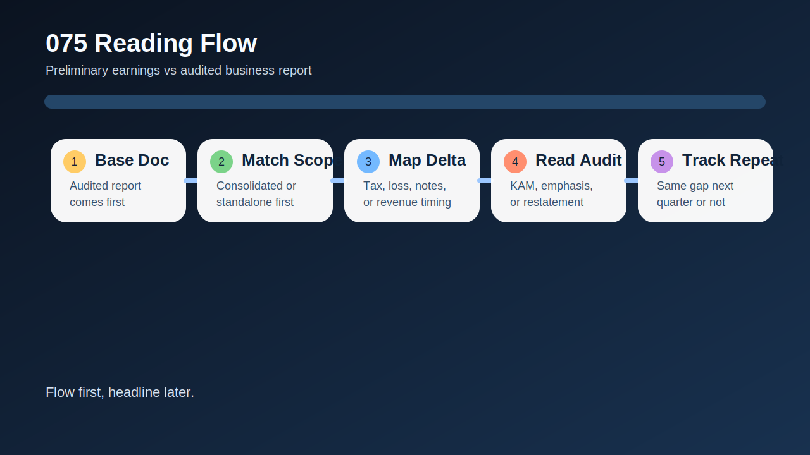
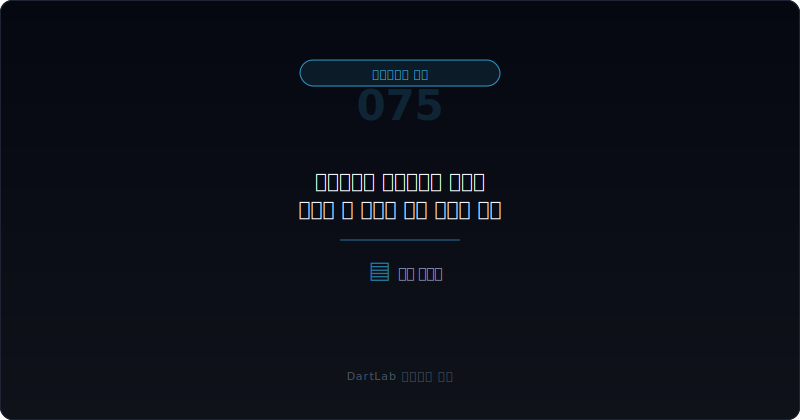
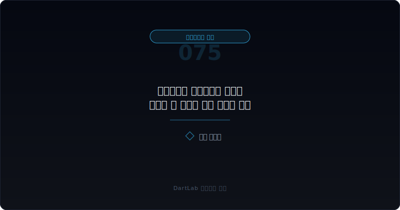
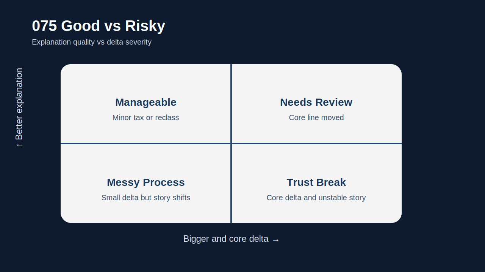
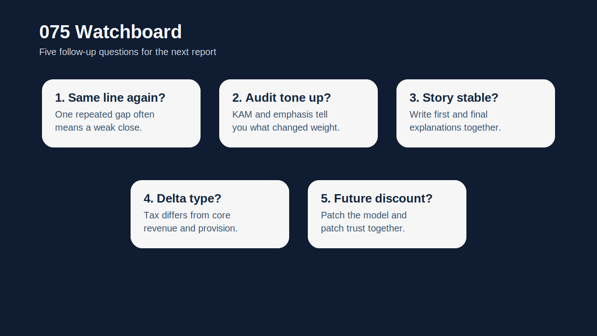

# 잠정실적과 사업보고서 숫자가 엇갈릴 때 무엇을 먼저 믿어야 하나

잠정실적과 사업보고서 숫자가 다르면 많은 사람이 바로 헷갈린다. `회사가 말을 바꾼 건가`, `감사인이 뒤집은 건가`, `어느 숫자를 기준으로 봐야 하나` 같은 질문이 한꺼번에 붙는다. 여기서 먼저 답을 짧게 말하면, **기준 숫자는 감사가 끝난 사업보고서와 감사보고서 쪽이 우선**이다. 다만 그걸로 끝내면 반만 읽은 것이다. 왜 처음 잠정실적과 달라졌는지 읽지 않으면 숫자보다 더 중요한 `결산 체계의 신뢰도`를 놓치기 쉽다.

잠정실적은 속도가 빠르다. 회사가 시장과 먼저 대화하기 위해 내놓는 숫자라서 의미가 있다. 반면 사업보고서 숫자는 감사와 주석, 세부 분류가 붙으면서 더 강한 기준 숫자가 된다. 그래서 둘이 다를 때는 `최종 숫자는 무엇인가`와 `왜 중간 숫자가 흔들렸는가`를 분리해서 읽는 편이 맞다. 하나는 valuation의 기준선이고, 다른 하나는 management quality의 신호다.

특히 차이가 단순한 세율 조정, 연결 범위 보정, 분류 재배치인지, 아니면 매출 인식·충당금·손상 같은 핵심 판단 변경인지에 따라 무게가 완전히 달라진다. 그래서 이 주제는 숫자 비교보다 `불일치의 원인 분류`가 먼저다.

이 글은 잠정실적과 사업보고서 숫자 차이를 `기준 문서 정하기 -> 비교 범위 맞추기 -> 차이 원인 분류 -> 감사·내부통제 문구와 연결 -> 다음 보고서에서 반복되는지 추적` 순서로 읽는 방법을 정리한다. 기본 토대는 [감사 전 재무제표 정정과 재감사는 어디서 위험 신호가 보이나](/blog/restatement-before-audit-and-reaudit-signals), 결산 체계 신호는 [감사 전 내부결산 오류는 어디서 먼저 드러나나](/blog/pre-audit-closing-errors-and-signals), 감사 해석은 [사업보고서에서 감사보고서와 KAM 읽는 법](/blog/audit-report-and-kam), 위험 강도는 [한정·부적정·의견거절 감사의견은 무엇이 다른가](/blog/qualified-adverse-disclaimer-audit-opinions)와 같이 보면 좋다.

---

## 왜 기준 숫자와 신뢰도 신호를 따로 봐야 하나

잠정실적과 사업보고서 숫자가 다르면 초보자는 보통 둘 중 하나만 고르려고 한다. `잠정은 의미 없고 사업보고서만 보면 된다`거나, 반대로 `처음 말한 숫자가 진짜고 나중 숫자는 변명`이라고 읽는다. 실전에서는 둘 다 거칠다. 기준 숫자는 사업보고서 쪽이 맞지만, 잠정실적은 회사의 결산 품질과 설명 습관을 드러내는 선행 신호로 쓸 수 있다.

예를 들어 차이가 세부 세율 보정이나 일회성 손익 분류 이동 정도라면 해석은 비교적 가볍다. 하지만 차이가 매출 인식, 충당금 설정, 손상차손, 연결 범위, 영업외손익 재분류에서 나왔다면 얘기가 달라진다. 이 경우는 최종 숫자만 고쳐졌다는 사실보다 `왜 처음 숫자가 그렇게 나왔는가`가 더 중요해진다.

그래서 이 주제의 핵심은 `무엇을 믿을까`가 아니라 `무엇을 기준 숫자로 두고, 무엇을 신뢰도 신호로 읽을까`다. 이 둘을 분리하면 공시를 훨씬 덜 혼란스럽게 읽게 된다.

---

## 최초 문서에서 잡아야 할 것

| 먼저 볼 항목 | 왜 중요한가 |
| --- | --- |
| 기준 문서 | 잠정실적, 사업보고서, 감사보고서 중 기준 숫자를 정한다 |
| 비교 범위 | 연결/별도, 누적/분기, 영업이익/순이익 기준이 맞는지 본다 |
| 차이 항목 | 매출, 비용, 세금, 손상, 충당금 중 어디서 어긋났는지 본다 |
| 주석 설명 | 숫자 차이가 세부 설명으로 이어지는지 확인한다 |
| 감사 문구 | KAM, 강조사항, 비적정 의견으로 번지는지 본다 |
| 후속 반복성 | 다음 분기와 다음 연도에도 비슷한 어긋남이 재발하는지 본다 |

실전에서는 먼저 문서의 힘을 정리하는 편이 좋다. 잠정실적은 `빠른 안내`, 사업보고서는 `감사 반영 후 정식 숫자`, 감사보고서는 `그 숫자에 대한 외부 검증 문구`다. 그래서 숫자 기준은 사업보고서와 감사보고서 쪽에 두고, 잠정실적은 그 기준에서 얼마나 멀어졌는지를 보는 방식이 가장 덜 흔들린다.

그다음에는 반드시 비교 범위를 맞춰야 한다. 연결과 별도, 누적과 단일 분기, 영업이익과 법인세차감전순이익이 섞이면 차이가 더 커 보이거나 작아 보일 수 있다. 의외로 많은 혼란이 여기서 시작된다.

또 하나 중요한 것은 차이 항목의 성격이다. 세금과 외환, 공정가치, 영업외손익처럼 연말 정리 과정에서 바뀌기 쉬운 항목인지, 아니면 매출 인식과 충당금처럼 본업 해석을 직접 바꾸는 항목인지가 핵심이다. 이 부분은 [영업외손익이 본업을 가릴 때 무엇을 분리해서 봐야 하나](/blog/non-operating-income-vs-core-earnings), [매출 인식 시점 변경은 어디가 신호인가](/blog/revenue-recognition-timing-signals)와 같이 보면 더 선명해진다.

---

## 후속 문서에서 바뀌는 것과 안 바뀌는 것

가장 실용적인 질문은 이것이다. `이번 차이는 결산 마감 보정인가, 회계 판단 변경인가, 아니면 신뢰도 훼손의 시작인가`.

마감 보정이라면 차이 범위가 제한적이고 설명도 일관적이다. 회계 판단 변경이라면 충당금, 손상, 매출 인식, 연결 범위 같은 핵심 논점이 등장한다. 신뢰도 훼손 신호라면 설명이 공시마다 바뀌고, 정정과 감사 문구가 뒤따르며, 다음 보고서에서도 비슷한 어긋남이 반복된다.

이 구분이 중요한 이유는 valuation보다 `숫자를 믿는 속도`가 달라지기 때문이다. 마감 보정 수준이면 최종 숫자에 빨리 적응할 수 있지만, 신뢰도 훼손 신호라면 같은 회사의 다음 숫자까지 할인해서 읽어야 할 수 있다.

특히 차이가 영업이익보다 순이익, 세후이익, 자본 항목에서 더 크면 [이연법인세와 법인세 비용은 순이익을 어떻게 왜곡하나](/blog/deferred-tax-and-tax-expense-distortion), [기타포괄손익 누적은 무엇을 숨기나](/blog/accumulated-oci-what-it-hides)까지 같이 보는 편이 좋다. 반대로 차이가 영업현금흐름 해석까지 흔들면 [영업현금흐름이 순이익을 부정할 때](/blog/operating-cash-flow-vs-net-income)와 연결해 보는 편이 맞다.

---

## 기간 비교에서 놓치기 쉬운 변화

| 관찰 포인트 | 상대적으로 관리 가능한 경우 | 더 조심해야 하는 경우 |
| --- | --- | --- |
| 차이 범위 | 세금·분류 조정 중심이다 | 매출, 충당금, 손상, 연결 범위까지 흔든다 |
| 설명 품질 | 차이 원인과 시점이 비교적 분명하다 | 설명이 짧고 공시마다 바뀐다 |
| 감사 연결 | 감사 문구가 비교적 안정적이다 | KAM, 강조사항, 정정이 붙는다 |
| 반복성 | 다음 보고서에서 안정된다 | 비슷한 어긋남이 반복된다 |
| 후속 이벤트 | 자금조달·차입 경고와 분리된다 | 자금 압박, 관리종목, 비적정 문구와 겹친다 |

상대적으로 관리 가능한 경우는 최종 숫자 확정 과정에서 생길 수 있는 보정 범위 안에 있고, 회사 설명도 비교적 일관적이다. 반대로 더 조심해야 하는 경우는 차이 폭도 큰데 설명은 짧고, 후속 공시에서 자꾸 맥락이 바뀐다. 이때는 최종 숫자를 반영하는 것보다 더 중요한 일이 생긴다. 바로 `다음 숫자도 이렇게 흔들릴까`를 의심하는 것이다.

특히 [계속기업 관련 불확실성 문구는 어디서 강해지나](/blog/going-concern-uncertainty-signals), [차입 약정 위반과 기한이익상실 위험은 어디서 먼저 드러나나](/blog/debt-covenant-breach-and-acceleration-risk), [자본잠식과 관리종목 신호는 어디서 먼저 보이나](/blog/capital-impairment-and-watchlist-signals)와 함께 보이면 불일치의 무게가 커진다. 숫자 차이 자체보다 `조직이 압박 속에서 결산을 제대로 관리하고 있는가`가 더 중요해지기 때문이다.

---

## 왜 사업보고서 숫자를 우선하면서도 잠정실적을 버리면 안 되나

기준 숫자는 사업보고서 쪽이 우선이다. 이건 분명하다. 감사와 주석이 반영되고, 비교 가능한 형식으로 정리되며, 이후 투자자와 회계 시스템이 따라가는 숫자이기 때문이다. 그래서 valuation 모델, 분기 비교, 장기 추세는 결국 사업보고서와 감사보고서 숫자를 기준으로 다시 잡아야 한다.

그렇다고 잠정실적을 버리면 안 되는 이유는 회사의 `첫 설명`이 남기 때문이다. 처음엔 어떤 항목을 강조했고, 나중엔 어떤 논점이 수정됐는지 보면 management communication의 품질이 드러난다. 숫자는 나중에 맞출 수 있어도, 설명 습관과 결산 프로세스의 약점은 생각보다 자주 반복된다.

그래서 이 주제의 실전 메모는 간단하다. `최종 기준 숫자`, `달라진 항목`, `처음 설명과 나중 설명의 차이` 세 줄이면 된다. 이 세 줄이 있으면 같은 회사의 다음 공시를 훨씬 덜 순진하게 읽게 된다.

---

## 실전에서 가장 빨리 구분되는 조합은 무엇인가

이 주제에서 가장 빨리 위험해지는 조합은 `핵심 손익 항목 차이 + 정정 또는 추가 설명 반복 + 감사 문구 무거워짐`이다. 이 셋이 같이 보이면 숫자 차이는 단순한 마감 보정이 아니라 신뢰도 하락 신호일 가능성이 높다. 반대로 `세금·분류 중심 차이 + 설명 일관 + 다음 보고서 안정` 조합이면 생각보다 가볍게 지나갈 수 있다.

또 하나 자주 나오는 조합은 `잠정실적에서는 흑자, 사업보고서에서는 적자`처럼 headline 방향이 뒤집히는 경우다. 이럴 때는 숫자보다 먼저 어떤 항목이 방향을 바꿨는지 확인해야 한다. 손상차손인지, 충당금인지, 영업외손익인지, 세금인지에 따라 해석이 완전히 다르다.

핵심은 차이의 크기보다 차이의 성격이다. 작은 차이라도 핵심 판단을 흔들면 무겁고, 큰 차이라도 성격이 제한적이면 상대적으로 덜 무거울 수 있다.

---

## 후속 보고서에서 반드시 재확인할 항목

| 이번에 본 것 | 다음에 다시 볼 것 |
| --- | --- |
| 차이 항목 | 같은 항목이 다시 흔들리는가 |
| 회사 설명 | 문구가 안정되는가 또 바뀌는가 |
| 감사 문구 | KAM, 강조사항, 비적정 의견이 강해지는가 |
| 주석 보강 | 왜 달라졌는지 설명이 더 구체화되는가 |
| 정정 흐름 | 추가 정정이나 재감사가 붙는가 |
| 자금 압박 | 차입, 자본거래, 관리종목 신호와 겹치는가 |

잠정실적과 사업보고서 숫자 차이는 한 번 비교하고 끝내면 거의 항상 얕게 읽힌다. 같은 논점이 다음 분기에도 반복되는지, 설명이 안정되는지, 감사 문구가 더 무거워지는지 확인해야 진짜 의미가 드러난다. 그래서 가능하면 `기준 숫자`, `차이 항목`, `설명 변화`, `감사 문구`, `재발 여부` 다섯 줄을 적어 두는 편이 좋다.

특히 같은 회사에서 `잠정실적 -> 사업보고서 -> 정정공시`로 이어지는 버전 체인이 길어지면 해석은 더 무거워진다. 그때부터는 숫자 한 번의 실수가 아니라 공시 운영 체계 자체를 다시 봐야 한다.

---

## 추적 체크리스트

- 기준 숫자를 사업보고서와 감사보고서 쪽에 두었는가
- 연결/별도, 누적/분기 비교 범위를 맞췄는가
- 차이가 난 항목이 무엇인지 정확히 적었는가
- 회사의 처음 설명과 나중 설명이 같은지 확인했는가
- 감사 문구와 정정 흐름까지 같이 봤는가
- 다음 보고서에서 같은 항목이 반복되는지 추적할 계획이 있는가

## 자주 묻는 질문

### 잠정실적과 사업보고서가 다르면 무조건 사업보고서만 보면 되나

기준 숫자는 사업보고서가 우선이지만, 왜 달라졌는지는 꼭 읽어야 한다.

### 차이가 작으면 신경 안 써도 되나

항상 그렇지 않다. 핵심 판단 항목에서 난 차이면 작아도 무겁다.

### 무엇이 가장 먼저 중요한가

어느 문서를 기준 숫자로 둘지 정하고, 차이 원인을 분류하는 것이다.

### 무엇을 같이 보면 좋은가

정정공시, 감사보고서, 내부회계 설명, 후속 분기 숫자를 같이 보면 좋다.

## 추적에 필요한 배경 글

- [감사 전 재무제표 정정과 재감사는 어디서 위험 신호가 보이나](/blog/restatement-before-audit-and-reaudit-signals)
- [감사 전 내부결산 오류는 어디서 먼저 드러나나](/blog/pre-audit-closing-errors-and-signals)
- [사업보고서에서 감사보고서와 KAM 읽는 법](/blog/audit-report-and-kam)
- [한정·부적정·의견거절 감사의견은 무엇이 다른가](/blog/qualified-adverse-disclaimer-audit-opinions)
- [영업외손익이 본업을 가릴 때 무엇을 분리해서 봐야 하나](/blog/non-operating-income-vs-core-earnings)
- [매출 인식 시점 변경은 어디가 신호인가](/blog/revenue-recognition-timing-signals)
- [자본잠식과 관리종목 신호는 어디서 먼저 보이나](/blog/capital-impairment-and-watchlist-signals)

## 관련 공식 자료

- [DART 소개 - 보고서정보](https://dart.fss.or.kr/introduction/content2.do)
- [DART 소개 - 정정신고서 이용시 유의사항](https://dart.fss.or.kr/introduction/content4.do)
- [기업공시길라잡이](https://dart.fss.or.kr/info/main.do?menu=120)
- [KIND 공시 유형 안내](https://kind.krx.co.kr/disclosure/details.do?method=searchDisclosureTypeMain)
- [OpenDART XBRL 주석](https://opendart.fss.or.kr/disclosureinfo/fnltt/xbrlnote/main.do)

## 추적 포인트 요약

잠정실적과 사업보고서 숫자가 엇갈릴 때 기준 숫자는 감사가 끝난 사업보고서 쪽이 우선이다. 다만 그걸로 끝내면 결산 체계의 신뢰도 신호를 놓치기 쉽다. 그래서 최종 숫자를 반영하되, 왜 처음 숫자가 달라졌는지와 설명이 어떻게 바뀌는지를 꼭 같이 읽어야 한다.

핵심은 `어느 숫자가 맞나`보다 `왜 그 차이가 생겼나`를 먼저 묻는 것이다. 이 질문을 붙이면 숫자 불일치를 훨씬 덜 늦게 이해하게 된다.
