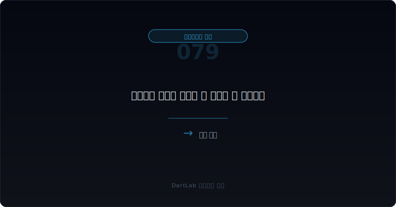
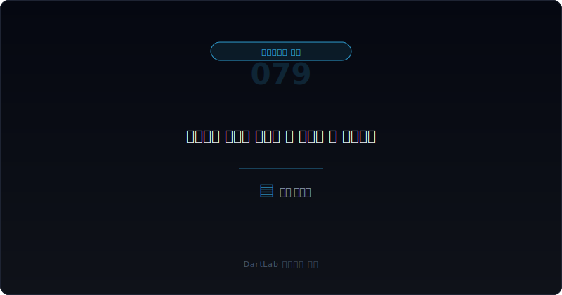
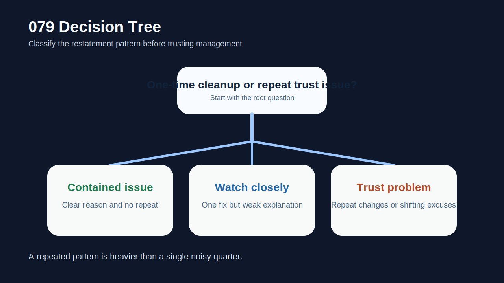
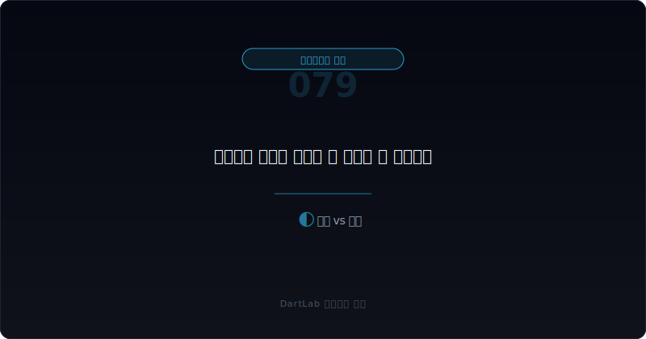
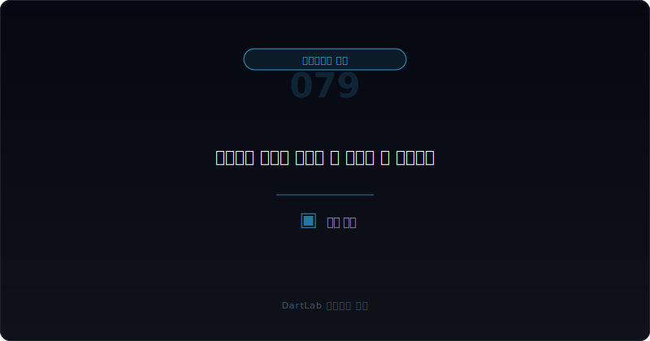

# 잠정실적 정정이 반복될 때 무엇이 더 위험한가

잠정실적이 한 번 정정되는 것 자체만으로 회사를 바로 위험하다고 단정할 필요는 없다. 실무에서도 결산 막판에 추정치가 바뀌거나, 자회사 반영 시점이 늦어지거나, 비경상 손익 분류가 조정되면서 숫자가 움직일 수 있다. **더 무거운 신호는 숫자 차이 자체보다 `반복 정정`, `설명 변화`, `후속 보고서와의 불일치`가 함께 나오는 경우**다.

특히 같은 회사가 잠정실적을 여러 번 고치고, 고칠 때마다 이유가 달라지거나, 사업보고서와 감사보고서에서 다시 다른 설명이 붙는다면 그때부터는 단순 오차가 아니라 `내부통제`, `결산 프로세스`, `경영진 설명 신뢰도`를 같이 봐야 한다. 시장은 숫자 하나가 틀렸다는 사실보다 `회사가 자기 숫자를 얼마나 일관되게 통제하고 설명하는가`를 더 오래 기억한다.

그래서 이 주제는 [잠정실적과 사업보고서 숫자가 엇갈릴 때 무엇을 먼저 믿어야 하나](/blog/preliminary-earnings-vs-business-report)의 다음 단계다. 그 글이 `무엇을 기준선으로 읽을 것인가`를 정리했다면, 이 글은 `왜 반복 정정이 더 무거운가`, `어디서부터 신뢰도 문제로 해석해야 하는가`를 다룬다. 함께 보면 좋은 글은 [감사 전 내부결산 오류는 어디서 먼저 드러나나](/blog/pre-audit-closing-errors-and-signals), [정정공시를 파이프라인에서 다루는 법](/blog/dart-amendment-filing-pipeline), [감사보고서와 핵심감사사항은 무엇부터 읽어야 하나](/blog/audit-report-and-kam), [한정·부적정·의견거절 감사의견은 무엇이 다른가](/blog/qualified-adverse-disclaimer-audit-opinions)다.

이 글은 잠정실적 정정을 `최초 잠정실적 확인 -> 정정 횟수와 변동 라인 기록 -> 정정 이유 문구 비교 -> 사업보고서·감사 문구 대조 -> 다음 분기 반복 여부 추적` 순서로 읽는 방법을 정리한다.

---

## 왜 숫자 차이보다 반복 정정이 더 무거운가

한 번의 숫자 차이는 `추정의 한계`로 설명될 수 있다. 하지만 반복 정정은 다른 질문을 낳는다. `왜 이 회사는 결산 직전에 잡아야 할 숫자를 계속 늦게 잡는가`, `왜 최초 설명과 나중 설명이 달라지는가`, `왜 경영진이 숫자의 성격을 안정적으로 설명하지 못하는가` 같은 질문이다.

이 차이는 투자 판단에서 매우 크다. 예를 들어 매출이나 영업이익이 한 번 정정된 것 자체는 실무상 가능하다. 그런데 다음 분기에도 비슷한 라인이 다시 바뀌고, 그다음에는 일회성 비용과 충당부채 설명까지 달라진다면 문제는 `정확도`가 아니라 `프로세스`가 된다. 즉, 해당 회사는 숫자를 추정하는 힘보다 숫자를 통제하는 힘이 약할 수 있다.

또 반복 정정은 감사 신호와도 연결된다. 감사보고서가 적정이라도 [적정 의견이어도 불안한 회사는 어떤 패턴을 보이나](/blog/clean-audit-opinion-but-still-risky)에서 설명했듯, 내부회계, 결산 일정, 주석 설명, 차입 약정과 맞물리면 해석이 무거워진다. 반복 정정은 그 자체로 비적정 의견은 아닐 수 있지만, 이후의 더 큰 경고를 예고하는 전조일 수 있다.

---

## 최초 문서에서 잡아야 할 것

| 먼저 볼 항목 | 왜 중요한가 |
| --- | --- |
| 최초 잠정실적 | 회사가 시장에 처음 약속한 숫자다 |
| 정정 횟수 | 단발성인지 반복 구조인지 가른다 |
| 변동 라인 | 매출, 영업이익, 순이익, 자본 중 어디가 흔들리는지 본다 |
| 정정 이유 문구 | 설명이 구체적인지, 매번 달라지는지 확인한다 |
| 사업보고서·감사보고서 | 최종 기준선과 통제 신호를 확인한다 |
| 다음 분기 재발 여부 | 진짜 일회성인지 구조적 문제인지 가른다 |

실전에서는 숫자 자체보다 `변경 로그`를 먼저 적는 편이 좋다. 최초 잠정실적, 첫 정정, 최종 사업보고서 수치를 나란히 적고, 어떤 라인이 얼마나 바뀌었는지 표시하면 한 번에 보인다. 그런 다음에는 정정 이유 문구를 비교한다. 문구가 `종속회사 실적 반영`, `충당부채 재산정`, `감사과정 반영`, `분류 재검토`처럼 구체적이고 일관적이면 아직은 관리 가능한 문제일 수 있다.

반대로 이유가 너무 넓거나, 공시마다 표현이 바뀌거나, 나중 사업보고서에서 전혀 다른 설명이 나온다면 그때부터는 신뢰도 문제다. 이 과정은 [감사 전 내부결산 오류는 어디서 먼저 드러나나](/blog/pre-audit-closing-errors-and-signals)와 매우 가깝다. 숫자를 만드는 과정이 흔들리는 회사는 잠정실적 정정이 단독 사건으로 끝나지 않는 경우가 많다.

---

## 후속 문서에서 바뀌는 것과 안 바뀌는 것

가장 실용적인 질문은 이것이다. `이번 정정은 결산 막판의 일회성 정리인가, 아니면 반복되는 신뢰도 문제인가?`

일회성 정리에 가까운 경우는 정정 횟수가 적고, 바뀐 이유가 명확하며, 최종 사업보고서와 감사 문구가 큰 충돌 없이 마무리된다. 이런 경우에는 숫자 차이가 있더라도 이후 분기에 같은 문제가 반복되지 않으면 해석을 무겁게 끌고 갈 필요는 없다.

경계 구간은 한 번의 정정이지만 설명이 약하거나, 변동 라인이 투자 판단에 중요한 항목이고, 내부통제 설명이 다소 느슨한 경우다. 이럴 때는 다음 분기 잠정실적과 사업보고서를 꼭 이어서 봐야 한다.

신뢰도 문제로 볼 구간은 세 가지가 겹칠 때다. 첫째, 정정이 반복된다. 둘째, 이유 설명이 공시마다 바뀐다. 셋째, 감사·내부통제·사업보고서 주석에서 뒤늦게 더 무거운 설명이 나온다. 이 조합이면 숫자 한 번 틀린 문제가 아니라 `숫자를 믿어도 되는가`의 문제로 올라간다.

---

## 기간 비교에서 놓치기 쉬운 변화

| 관찰 포인트 | 상대적으로 관리 가능한 경우 | 더 조심해야 하는 경우 |
| --- | --- | --- |
| 정정 빈도 | 한 번의 정리로 끝난다 | 분기마다 반복된다 |
| 설명 방식 | 이유가 구체적이고 일관적이다 | 이유가 바뀌거나 넓다 |
| 변동 항목 | 비핵심 라인 위주다 | 매출, 이익, 자본 등 핵심 라인이 흔들린다 |
| 감사 반응 | 추가 경고 없이 정리된다 | 내부통제, 검토, 주석 보강이 따라온다 |
| 후속 숫자 | 다음 분기에 안정된다 | 같은 패턴이 다시 나온다 |

상대적으로 관리 가능한 경우는 회사가 `왜 틀렸는지`를 명확히 설명하고, 다음 보고서에서 같은 실수를 반복하지 않는다. 즉, 숫자는 한번 틀렸어도 통제는 회복될 수 있다.

더 조심해야 하는 경우는 숫자뿐 아니라 설명의 신뢰가 약해진다. 예를 들어 영업이익 정정이 반복되는데 매번 이유가 달라지고, 후속 사업보고서에서는 충당부채나 자산손상, 관계기업 손익 같은 다른 설명이 뒤늦게 붙는다면 그때는 회사가 결산을 통제하는 힘보다 사후 설명을 덧붙이는 쪽에 가깝다고 봐야 한다.

이런 흐름은 [자본잠식과 관리종목 신호는 어디서 먼저 보이나](/blog/capital-impairment-and-watchlist-signals), [정정공시를 파이프라인에서 다루는 법](/blog/dart-amendment-filing-pipeline), [감사 전 내부결산 오류는 어디서 먼저 드러나나](/blog/pre-audit-closing-errors-and-signals)와 붙여 보면 더 잘 보인다. 반복 정정은 보통 다른 경고와 같이 움직인다.

---

## 왜 설명이 바뀌는지가 숫자 차이보다 더 중요한가

시장은 완벽한 숫자를 기대하지 않는다. 대신 `같은 사건에 대해 회사가 얼마나 같은 설명을 유지하는가`를 본다. 설명이 계속 바뀐다는 것은 두 가지 중 하나일 수 있다. 실제로 결산 프로세스가 통제되지 않았거나, 처음에는 덜 무거운 이유를 내세우다가 나중에 더 본질적인 문제를 뒤늦게 반영하는 경우다.

그래서 잠정실적 정정에서는 `이유의 이동`을 꼭 기록해야 한다. 처음엔 단순 분류조정이라더니, 다음엔 손상차손, 그다음엔 감사과정 반영으로 바뀌면 해석은 훨씬 무거워진다. 숫자 변화폭이 크지 않아도 설명이 흔들리면 신뢰도는 빠르게 약해진다.

또 이 문제는 투자자 커뮤니케이션 품질과도 연결된다. 숫자가 틀린 것보다 무서운 것은 `회사가 틀린 숫자를 어떻게 설명하는지`다. 설명이 일관되고 빠르면 신뢰는 일부 회복될 수 있지만, 계속 바뀌면 다음 잠정실적도 할인해서 봐야 한다.

---

## 실전에서 가장 빨리 구분되는 조합은 무엇인가

가장 빨리 위험해지는 조합은 `반복 정정 + 핵심 이익 라인 수정 + 설명 변화`다. 이 세 가지가 같이 보이면 그 회사의 잠정실적은 단순 참고치가 아니라 강한 할인 대상이 된다. 여기에 `내부회계 미비`, `감사 전 오류`, `차입 약정 긴장`, `자본 경고`가 추가되면 해석은 더 무거워진다.

반대로 상대적으로 덜 무거운 조합은 `단발성 정정 + 변동 이유 명확 + 후속 사업보고서와 정합적`이다. 이 경우에는 다음 분기까지만 확인해도 충분할 수 있다.

실전 팁은 간단하다. 잠정실적 정정이 나오면 숫자만 보지 말고 아래 세 줄을 적는다. `무엇이 바뀌었나`, `왜 바뀌었다고 하나`, `다음 보고서에서 무엇이 확인돼야 하나`. 이 세 줄만 적어도 반복 정정의 무게를 훨씬 빨리 가를 수 있다.

---

## 후속 보고서에서 반드시 재확인할 항목

| 이번에 본 것 | 다음에 다시 볼 것 |
| --- | --- |
| 정정 횟수 | 같은 라인이 다시 바뀌는가 |
| 이유 문구 | 같은 설명을 유지하는가 |
| 사업보고서 숫자 | 잠정실적과 최종 숫자가 정렬되는가 |
| 감사 문구 | 내부통제·검토 강도가 올라가는가 |
| 재발 여부 | 다음 분기에도 비슷한 패턴이 나오는가 |
| 투자 판단 | 앞으로 잠정실적을 얼마나 할인해서 볼 것인가 |

이 글의 핵심은 `잠정실적 정정 = 위험`이 아니라 `반복 정정 = 신뢰도 검증 시작`이라는 점이다. 숫자가 틀렸다는 사실만으로 끝내지 말고, 그 숫자가 왜 반복해서 바뀌는지, 설명이 왜 흔들리는지, 감사와 내부통제가 어떻게 반응하는지를 함께 봐야 한다.

---

## 추적 체크리스트

- 최초 잠정실적, 정정본, 사업보고서 숫자를 나란히 적었는가
- 어떤 라인이 바뀌었는지 표시했는가
- 정정 이유 문구가 공시마다 같은지 확인했는가
- 감사보고서와 내부통제 관련 문구를 같이 봤는가
- 다음 분기에도 같은 패턴이 반복되는지 추적할 계획을 세웠는가
- 앞으로 이 회사 잠정실적을 얼마나 할인해서 볼지 기준을 정했는가

## 자주 묻는 질문

### 잠정실적 정정이 한 번 나오면 바로 위험하다고 봐야 하나

그렇지는 않다. 한 번의 정정은 결산 마감 과정의 오차일 수 있다. 더 중요한 것은 반복 여부와 설명의 일관성이다.

### 무엇이 가장 무거운 신호인가

`반복 정정`, `핵심 라인 수정`, `설명 변화`가 같이 나오는 경우다.

### 사업보고서 숫자만 보면 되지 않나

최종 기준선은 사업보고서가 맞지만, 잠정실적이 반복해서 흔들린다는 사실 자체가 결산 통제와 커뮤니케이션 품질 문제를 알려준다.

### 어디와 같이 읽으면 가장 도움이 되나

감사 전 내부결산 오류, 정정공시 운영, 감사보고서/KAM 글과 같이 보면 반복 정정의 무게를 훨씬 빨리 판단할 수 있다.

## 추적에 필요한 배경 글

- [잠정실적과 사업보고서 숫자가 엇갈릴 때 무엇을 먼저 믿어야 하나](/blog/preliminary-earnings-vs-business-report)
- [감사 전 내부결산 오류는 어디서 먼저 드러나나](/blog/pre-audit-closing-errors-and-signals)
- [정정공시를 파이프라인에서 다루는 법](/blog/dart-amendment-filing-pipeline)
- [감사보고서와 핵심감사사항은 무엇부터 읽어야 하나](/blog/audit-report-and-kam)
- [한정·부적정·의견거절 감사의견은 무엇이 다른가](/blog/qualified-adverse-disclaimer-audit-opinions)
- [적정 의견이어도 불안한 회사는 어떤 패턴을 보이나](/blog/clean-audit-opinion-but-still-risky)
- [자본잠식과 관리종목 신호는 어디서 먼저 보이나](/blog/capital-impairment-and-watchlist-signals)

## 관련 공식 자료

- [DART 소개 - 보고서정보](https://dart.fss.or.kr/introduction/content2.do)
- [DART 소개 - 정정신고서 이용 시 유의사항](https://dart.fss.or.kr/introduction/content4.do)
- [기업공시길라잡이](https://dart.fss.or.kr/info/main.do?menu=120)
- [외부감사법 시행령](https://www.law.go.kr/%EB%B2%95%EB%A0%B9/%EC%A3%BC%EC%8B%9D%ED%9A%8C%EC%82%AC%EB%93%B1%EC%9D%98%EC%99%B8%EB%B6%80%EA%B0%90%EC%82%AC%EC%97%90%EA%B4%80%ED%95%9C%EB%B2%95%EB%A5%A0%EC%8B%9C%ED%96%89%EB%A0%B9)
- [KIND 공시서식 - 잠정실적 관련 공시](https://kind.krx.co.kr/disclosure/details.do?method=searchDisclosureTypeMain)

## 추적 포인트 요약

잠정실적 정정은 한 번의 숫자 차이보다 `반복 정정`, `설명 변화`, `감사·내부통제 반응`이 더 중요하다. 한 번 틀린 숫자는 고칠 수 있지만, 반복해서 흔들리는 설명은 신뢰를 크게 깎는다.

결국 이 주제의 핵심은 `얼마나 틀렸나`보다 `왜 계속 바뀌나`를 묻는 것이다. 그 질문을 붙이면 잠정실적 정정을 단순 뉴스가 아니라 신뢰도 검증의 출발점으로 읽게 된다.
