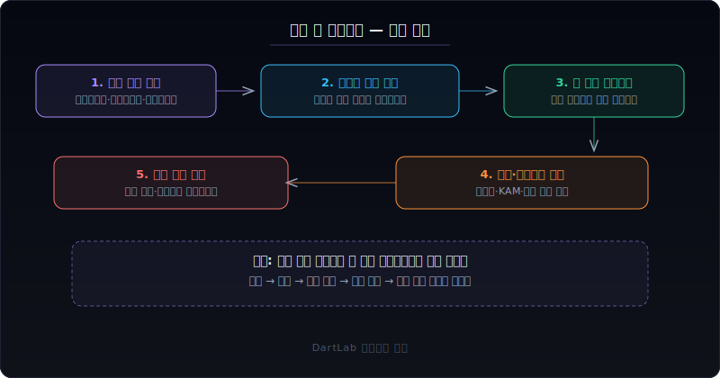
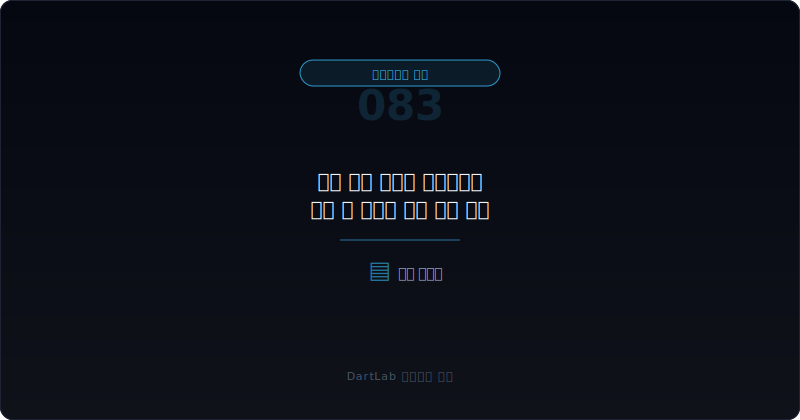
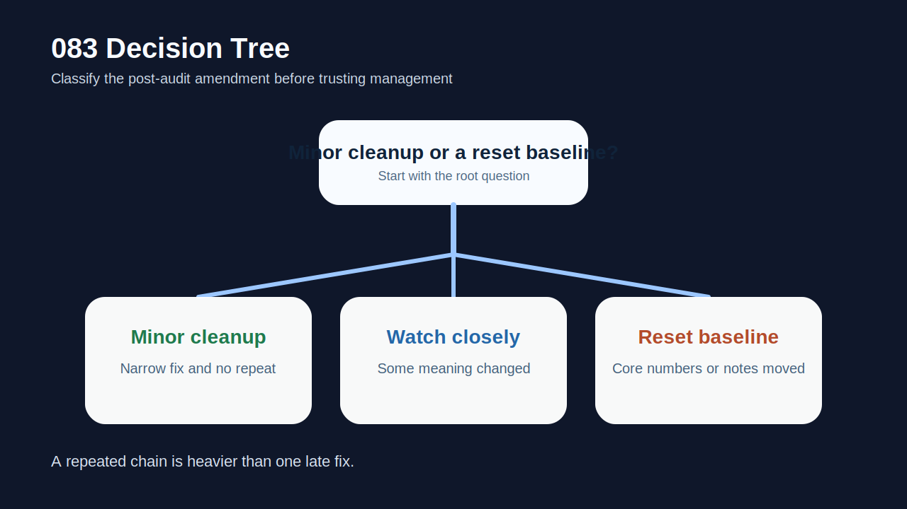
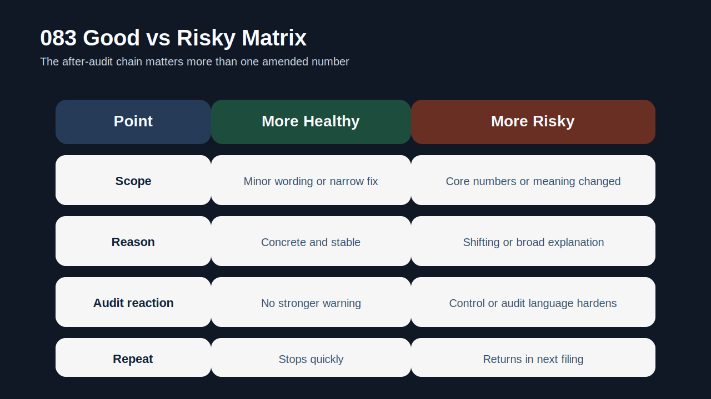
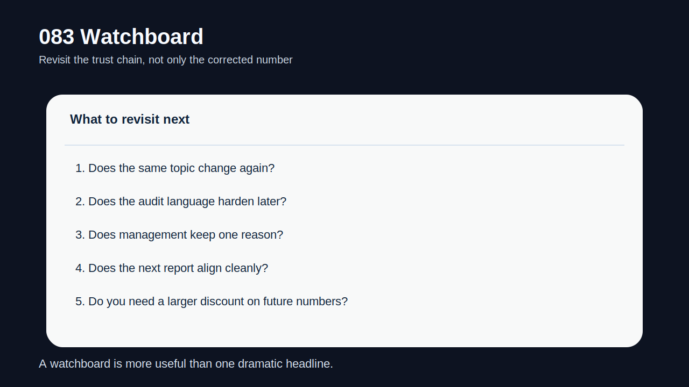

# 감사 종료 후에도 정정공시가 나올 때 무엇을 먼저 봐야 하나

감사 종료 후 정정공시가 나온다고 해서 항상 큰 문제가 있다는 뜻은 아니다. 공시 서식 오기, 경미한 주석 보완, 문구 정리처럼 투자 판단에 큰 영향을 주지 않는 수정도 있다. 하지만 **감사가 끝난 뒤에도 숫자, 주석, 설명이 다시 바뀐다면 그때는 `감사로 확정된 기준선이 왜 다시 흔들리는가`를 먼저 물어야 한다.**

이 질문이 중요한 이유는 명확하다. 감사 전 정정은 아직 결산 과정이 끝나지 않았다고 설명할 수 있다. 반면 감사가 종료된 뒤 정정이 나오면, 회사와 감사인이 일단 확정했다고 본 정보가 다시 바뀐다는 뜻이기 때문이다. 따라서 이 시점의 정정은 단순 오차보다 `결산 통제`, `후속 사실 반영`, `감사 절차의 한계`, `경영진 설명 신뢰도`와 더 가깝다.

그래서 이 글은 [잠정실적 정정이 반복될 때 무엇이 더 위험한가](/blog/repeated-preliminary-earnings-restatements), [감사 전 재무제표 정정과 재감사는 어디서 위험 신호가 보이나](/blog/restatement-before-audit-and-reaudit-signals), [한정·부적정·의견거절 감사의견은 무엇이 다른가](/blog/qualified-adverse-disclaimer-audit-opinions), [감사보고서와 핵심감사사항은 무엇부터 읽어야 하나](/blog/audit-report-and-kam)의 다음 단계다. 여기서는 `감사 후 정정`을 별도의 무게로 읽는 방법을 정리한다.

이 글은 감사 후 정정공시를 `정정 대상 확인 -> 감사 기준선과의 차이 기록 -> 왜 지금 바뀌는지 해석 -> 감사·내부통제 반응 확인 -> 다음 보고서와 후속 정정 체인 추적` 순서로 읽는 방법을 설명한다.

---

## 왜 감사 후 정정은 감사 전 정정보다 더 무겁게 읽어야 하나

감사 전 정정은 아직 결산과 감사 절차가 진행 중이라고 해석할 여지가 있다. 하지만 감사 종료 후 정정은 이미 확정된 줄 알았던 숫자와 설명이 다시 움직인다는 뜻이다. 그만큼 시장이 던지는 질문도 달라진다. `숫자가 틀렸나`에서 끝나지 않고 `왜 감사가 끝난 뒤에야 고쳐졌나`, `무엇을 감사에서 놓쳤나`, `후속 사실이 뒤늦게 드러났나`로 올라간다.

또 이 시점의 정정은 단독 사건으로 끝나지 않는 경우가 많다. 처음에는 주석 보완처럼 보이지만, 뒤이어 추가 정정, 감사보고서 재발행, 내부통제 문구 강화, 재감사, 거래소 질문공시 같은 흐름으로 이어질 수 있다. 그래서 감사 후 정정은 숫자 자체보다 `후속 체인`을 먼저 봐야 한다.

특히 정정 대상이 매출, 이익, 자본, 우발부채, 관계사 거래처럼 판단에 직접 영향을 주는 라인이라면 무게는 더 커진다. 서식 오기 수준인지, 투자 판단을 바꾸는 내용인지부터 먼저 가르는 편이 맞다.

---

## 최초 문서에서 잡아야 할 것

| 먼저 볼 항목 | 왜 중요한가 |
| --- | --- |
| 정정 대상 문서 | 사업보고서, 감사보고서, 정정신고서 중 무엇이 바뀌었는지 본다 |
| 바뀐 항목 | 숫자, 주석, 리스크 문구, 특수관계인 설명 중 어디가 움직였는지 본다 |
| 정정 사유 | 후속 사실, 계산 오류, 분류 조정, 누락 보완인지 구분한다 |
| 감사 반응 | 감사보고서 재발행, KAM 변화, 내부회계 문구 변화가 있는지 본다 |
| 반복성 | 한 번의 보완인지 같은 주제가 여러 번 바뀌는지 본다 |
| 다음 보고서 | 다음 분기·다음 연차 보고서에서 같은 문제가 이어지는지 본다 |

실전에서는 정정 공시를 보면 바로 수치 차이를 적는 습관이 유용하다. 최초 확정본과 정정본을 나란히 놓고 `어떤 라인`, `얼마나`, `왜` 바뀌었는지 세 줄로 적으면 사건의 성격이 보인다. 이때 숫자가 안 바뀌어도 안심하면 안 된다. 주석이나 특수관계인 설명, 우발부채 인식 수준이 바뀌는 경우도 투자 판단에는 충분히 무겁다.

그다음에는 감사 반응을 붙여 봐야 한다. 감사보고서 자체가 다시 나오지 않더라도, 다음 보고서에서 내부통제나 검토 문구가 강화될 수 있다. 이 부분은 [감사 전 내부결산 오류는 어디서 먼저 드러나나](/blog/pre-audit-closing-errors-and-signals), [적정 의견이어도 불안한 회사는 어떤 패턴을 보이나](/blog/clean-audit-opinion-but-still-risky)와 같이 보면 더 분명하다.

---

## 후속 문서에서 바뀌는 것과 안 바뀌는 것

핵심 질문은 이것이다. `이번 정정은 감사 후 경미한 정리인가, 아니면 감사 기준선 자체가 흔들린 사건인가?`

경미한 보완이라면 정정 내용이 주로 서식, 설명 보강, 비핵심 주석 수준이고 다음 보고서에서 같은 문제가 재발하지 않는다. 이런 경우는 무겁게 끌고 갈 필요가 없다.

경계 구간은 숫자나 리스크 해석에 어느 정도 영향이 있지만, 정정 이유가 구체적이고 후속 문서가 안정적으로 정리되는 경우다. 이때는 다음 보고서까지만 추적해도 충분할 수 있다.

기준선 흔들림으로 읽어야 하는 구간은 `핵심 숫자 수정`, `주석 의미 변화`, `감사·통제 반응`, `반복성`이 같이 보일 때다. 특히 감사 후 정정이 한 번이 아니라 두 번 이상 이어지거나, 감사 전 정정 이력이 이미 있었던 회사라면 무게를 높게 잡는 편이 맞다.

---

## 기간 비교에서 놓치기 쉬운 변화

| 관찰 포인트 | 상대적으로 관리 가능한 경우 | 더 조심해야 하는 경우 |
| --- | --- | --- |
| 정정 내용 | 서식·보충 설명 중심 | 핵심 숫자·주석 의미가 바뀐다 |
| 정정 사유 | 구체적이고 일관적이다 | 이유가 넓거나 바뀐다 |
| 감사 반응 | 추가 변화가 없다 | 감사·통제 문구가 무거워진다 |
| 반복성 | 한 번으로 끝난다 | 같은 이슈가 다시 나온다 |
| 후속 숫자 | 다음 보고서에서 안정된다 | 다음 보고서에서도 흔들린다 |

상대적으로 관리 가능한 경우는 감사 후 정정이 있어도 회사가 `왜 바뀌었는지`를 명확히 설명하고, 같은 주제가 반복되지 않는다. 반대로 더 조심해야 하는 경우는 설명이 계속 바뀌고, 감사와 내부통제 반응까지 뒤따르며, 이후 숫자도 다시 흔들린다.

특히 [잠정실적과 사업보고서 숫자가 엇갈릴 때 무엇을 먼저 믿어야 하나](/blog/preliminary-earnings-vs-business-report), [잠정실적 정정이 반복될 때 무엇이 더 위험한가](/blog/repeated-preliminary-earnings-restatements), [감사 전 재무제표 정정과 재감사는 어디서 위험 신호가 보이나](/blog/restatement-before-audit-and-reaudit-signals)까지 한 회사 안에서 연달아 보인다면, 그 회사의 숫자 커뮤니케이션은 강하게 할인해서 보는 편이 맞다.

---

## 왜 정정 사유보다 정정 체인이 더 중요할 때가 있나

감사 후 정정에서는 첫 사유 문구만 읽으면 사건을 과소평가하기 쉽다. 회사는 처음에 `기재 정정`, `누락 보완`, `정확성 제고` 같은 넓은 표현을 쓸 수 있다. 하지만 진짜 무게는 그 뒤 체인에서 드러난다. 같은 주제의 추가 정정이 붙는지, 감사 문구가 바뀌는지, 다음 보고서에서 비슷한 라인이 다시 흔들리는지 봐야 한다.

즉, 감사 후 정정은 점보다 선으로 읽어야 한다. 단일 공시가 아니라 `정정 -> 후속 설명 -> 다음 보고서 -> 다음 정정`의 흐름을 보면 사건의 성격이 분명해진다. 이 체인이 길어질수록 사건은 단순 오기가 아니라 통제와 신뢰도 문제에 가까워진다.

---

## 실전에서 가장 빨리 구분되는 조합은 무엇인가

가장 빨리 위험해지는 조합은 `감사 후 핵심 숫자 수정 + 정정 사유 변화 + 다음 보고서 재발`이다. 여기에 `내부회계 미비`, `감사 절차 강화`, `거래소·채권자 관심 증가`가 붙으면 해석은 훨씬 무거워진다.

반대로 상대적으로 덜 무거운 조합은 `감사 후 비핵심 보완 + 설명 명확 + 재발 없음`이다. 이 경우에는 사건 자체보다 추적 결과가 더 중요하다.

실전 메모는 다섯 줄이면 충분하다. `무엇이 바뀌었나`, `왜 지금 바뀌었나`, `감사 반응은 무엇인가`, `다음 보고서에서 재발했나`, `앞으로 이 회사 숫자를 얼마나 할인할 것인가`. 이 다섯 줄을 적으면 감사 후 정정의 무게를 빠르게 가를 수 있다.

---

## 왜 회사 설명이 그럴듯해도 바로 안심하면 안 되나

감사 후 정정에서는 회사 설명이 차분하고 합리적으로 들려도 한 번 더 멈춰서 봐야 한다. 이유는 단순하다. 설명이 자연스럽다는 사실과 사건이 가볍다는 사실은 다르기 때문이다. 회사는 후속 사실 확인, 분류 재검토, 주석 보완, 회계 판단 정교화처럼 비교적 중립적인 표현을 쓸 수 있다. 하지만 투자자 입장에서 더 중요한 것은 문장의 톤이 아니라 확정된 기준선이 왜 뒤늦게 바뀌었는지다.

예를 들어 경영진이 특정 거래의 해석을 다시 검토했다고 설명하더라도, 그 거래가 이미 감사 절차를 통과한 뒤 다시 열렸다면 그 자체로 통제의 빈틈을 시사할 수 있다. 또 처음 정정에서는 영향이 제한적이라고 했는데 다음 보고서에서 비슷한 항목이 다시 바뀌면, 처음 설명의 신뢰도도 함께 낮아진다. 그래서 감사 후 정정은 공시 한 건의 설명이 아니라 이후 숫자와 문구가 얼마나 일관되게 이어지는지를 기준으로 판단해야 한다.

결국 감사 후 정정에서 좋은 설명이란 말을 잘하는 설명이 아니라 같은 논리를 다음 문서에서도 유지하는 설명이다. 설명이 매끄럽더라도 후속 숫자, 내부통제 문구, 같은 항목의 재정정이 따라오면 사건은 훨씬 무겁게 읽는 편이 맞다.

---

## 후속 보고서에서 반드시 재확인할 항목

| 이번에 본 것 | 다음에 다시 볼 것 |
| --- | --- |
| 정정 대상 | 같은 라인이 다시 바뀌는가 |
| 정정 사유 | 같은 설명을 유지하는가 |
| 감사 반응 | 내부통제·검토 강도가 올라가는가 |
| 다음 보고서 | 비슷한 문제가 다시 드러나는가 |
| 투자 판단 | 잠정·확정 숫자 모두 얼마나 할인할 것인가 |

감사 후 정정공시는 단순히 `고쳤다`로 끝내면 안 된다. 감사가 끝난 뒤에도 기준선이 흔들린다는 사실 자체가 회사의 결산 통제와 정보 신뢰도를 다시 묻게 만들기 때문이다.

---

## 추적 체크리스트

- 정정 대상이 핵심 숫자인지 비핵심 보완인지 구분했는가
- 최초 확정본과 정정본 차이를 적었는가
- 정정 사유가 구체적이고 일관적인지 확인했는가
- 감사보고서·내부통제 문구 변화를 같이 봤는가
- 다음 분기·다음 연차 보고서에서 재발 여부를 추적할 계획을 세웠는가
- 앞으로 이 회사 숫자를 얼마나 할인해서 볼지 기준을 정했는가

## 자주 묻는 질문

### 감사 후 정정이 나오면 무조건 큰 문제인가

아니다. 서식 정리나 경미한 보완도 있다. 다만 핵심 숫자나 의미 있는 주석이 바뀌면 무겁게 봐야 한다.

### 무엇이 가장 무거운 신호인가

핵심 숫자 수정이 반복되고, 정정 사유와 감사 반응까지 같이 흔들리는 경우다.

### 감사보고서가 그대로면 안심해도 되나

그렇지 않다. 감사보고서가 바로 다시 나오지 않아도 다음 보고서의 내부통제·설명 문구에서 무게가 드러날 수 있다.

### 어디와 같이 읽으면 가장 도움이 되나

감사 전 정정, 잠정실적 정정 반복, 비적정 감사의견, KAM 글과 같이 보면 좋다.

## 추적에 필요한 배경 글

- [잠정실적 정정이 반복될 때 무엇이 더 위험한가](/blog/repeated-preliminary-earnings-restatements)
- [감사 전 재무제표 정정과 재감사는 어디서 위험 신호가 보이나](/blog/restatement-before-audit-and-reaudit-signals)
- [한정·부적정·의견거절 감사의견은 무엇이 다른가](/blog/qualified-adverse-disclaimer-audit-opinions)
- [감사보고서와 핵심감사사항은 무엇부터 읽어야 하나](/blog/audit-report-and-kam)
- [감사 전 내부결산 오류는 어디서 먼저 드러나나](/blog/pre-audit-closing-errors-and-signals)
- [잠정실적과 사업보고서 숫자가 엇갈릴 때 무엇을 먼저 믿어야 하나](/blog/preliminary-earnings-vs-business-report)
- [적정 의견이어도 불안한 회사는 어떤 패턴을 보이나](/blog/clean-audit-opinion-but-still-risky)

## 관련 공식 자료

- [DART 소개 - 보고서정보](https://dart.fss.or.kr/introduction/content2.do)
- [DART 소개 - 정정신고서 이용 시 유의사항](https://dart.fss.or.kr/introduction/content4.do)
- [기업공시길라잡이](https://dart.fss.or.kr/info/main.do?menu=120)
- [외부감사법 시행령](https://www.law.go.kr/%EB%B2%95%EB%A0%B9/%EC%A3%BC%EC%8B%9D%ED%9A%8C%EC%82%AC%EB%93%B1%EC%9D%98%EC%99%B8%EB%B6%80%EA%B0%90%EC%82%AC%EC%97%90%EA%B4%80%ED%95%9C%EB%B2%95%EB%A5%A0%EC%8B%9C%ED%96%89%EB%A0%B9)

## 추적 포인트 요약

감사 종료 후에도 정정공시가 나온다면, 그 사건은 숫자 수정 자체보다 `왜 감사가 끝난 뒤에야 바뀌었는가`를 먼저 묻게 만든다. 그래서 감사 후 정정은 단일 공시보다 정정 체인과 후속 반응을 읽는 것이 중요하다.

핵심은 `얼마나 바뀌었나`보다 `확정된 기준선이 왜 다시 흔들렸나`를 묻는 것이다. 그 질문을 붙이면 감사 후 정정을 훨씬 더 정확하게 읽게 된다.
