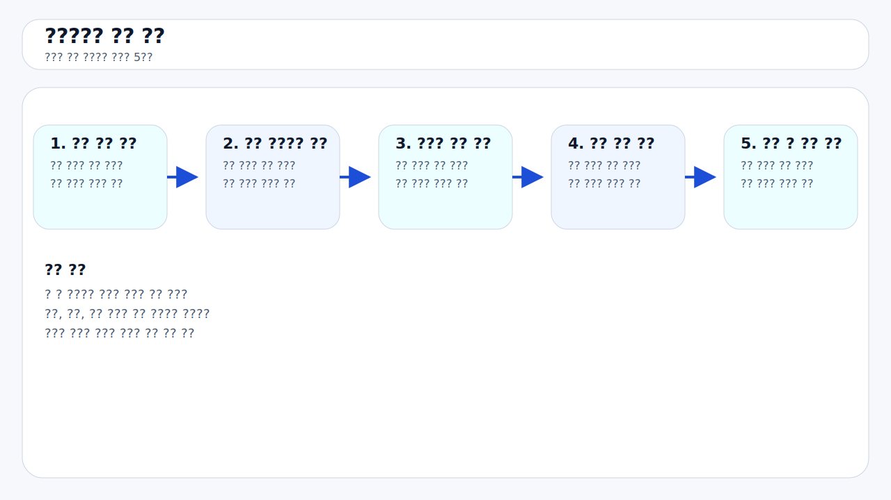
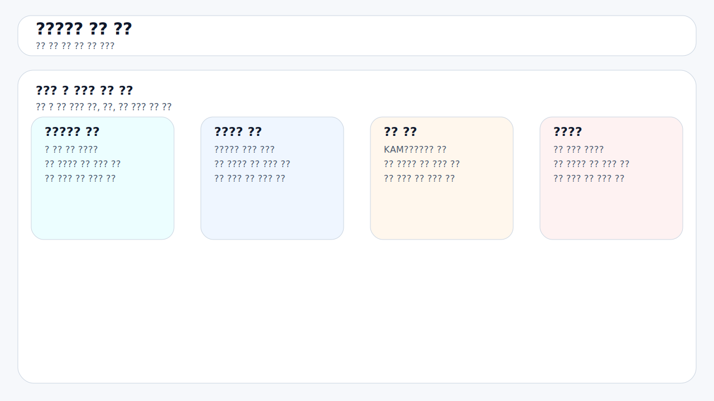
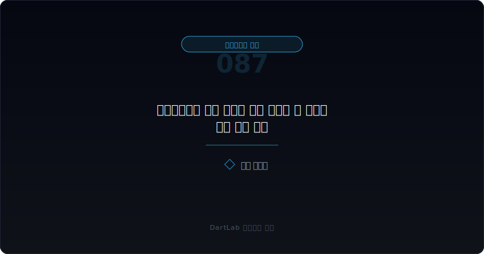
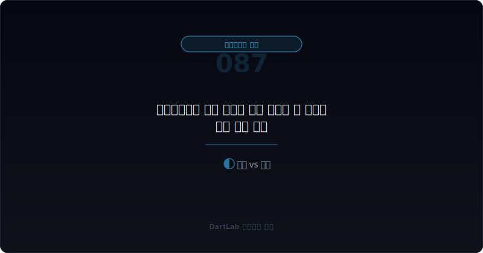
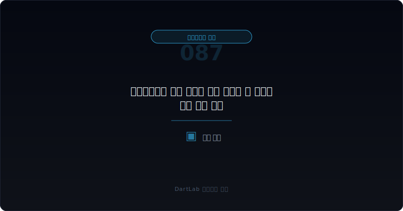

# 감사위원회가 같은 이슈를 반복 지적할 때 무엇을 먼저 봐야 하나

감사위원회 활동내역을 읽을 때 많은 사람은 한 해의 표현 수위만 본다. 하지만 실전에서는 `강한 한 문장`보다 `같은 문제가 몇 년째 같은 자리에서 다시 올라오는가`가 더 중요할 때가 많다. **감사위원회가 같은 이슈를 반복 지적한다는 것은, 회사가 이미 문제를 알고 있었고 감독기구도 알고 있었지만 실제 개선 속도는 느리거나 멈춰 있다는 뜻일 수 있기 때문이다.**

이 질문이 중요한 이유는 간단하다. 감사보고서나 KAM은 특정 연도 결산의 결과를 보여주지만, 감사위원회 안건 반복은 `문제를 알고도 못 고친 시간`을 보여준다. 그래서 반복되는 안건은 단발 사건보다 더 구조적인 신호가 될 수 있다. 내부회계 미비, 재고 관리, 매출 인식, 관계사 거래, 전산 통제, 회계 인력 부족 같은 문제가 몇 년째 비슷한 형태로 남아 있다면 그 회사의 관리 역량을 다시 봐야 한다.

이 글은 [감사 종료 후에도 정정공시가 나올 때 무엇을 먼저 봐야 하나](/blog/post-audit-restatement-signals), [내부회계관리제도와 감사위원회 활동은 어디서 위험 신호가 보이나](/blog/internal-controls-and-audit-committee), [감사보수와 비감사보수는 어디가 신호인가](/blog/audit-fees-and-non-audit-fees), [감사 전 내부결산 오류는 어디서 먼저 드러나나](/blog/pre-audit-closing-errors-and-signals)의 다음 단계다. 여기서는 `감사위원회 반복 지적`을 별도의 경고 신호로 읽는 방법을 정리한다.

이 글은 감사위원회 반복 지적을 `반복 안건 확인 -> 몇 년째 같은 이유인지 기록 -> 경영진 조치와 실제 결과 대조 -> 감사·정정공시 반응 확인 -> 다음 보고서에서 재발 여부 추적` 순서로 읽는 방법을 설명한다.

---

## 왜 같은 이슈의 반복은 한 번의 강한 표현보다 더 무겁게 읽어야 하나

한 번 강한 표현이 나오는 것은 특정 해의 충격일 수 있다. 대규모 시스템 전환, 신규 회계기준 적용, 인수합병 직후 통합 실패처럼 예외적 상황도 있다. 하지만 같은 주제가 2년, 3년, 4년째 반복해서 올라오면 해석이 달라진다. 그때는 `몰라서 놓친 문제`가 아니라 `알고도 고치지 못한 문제`에 가까워진다.

이 차이는 크다. 감사위원회는 회사 안에서 회계·내부통제·외부감사를 가장 가까이 보는 감독기구다. 그런 곳에서 같은 위험을 반복해서 지적하는데도 후속 보고서에서 숫자, 통제 문구, 정정공시가 계속 흔들린다면 경영진 설명보다 반복 패턴을 더 무겁게 봐야 한다. 특히 안건 제목은 조금 달라져도 본질이 같은 경우가 많다. 예를 들어 `전산 통제`, `결산 일정 지연`, `자료 제출 미흡`, `회계 추정 재점검`은 서로 다른 문장처럼 보여도 사실상 같은 운영 문제일 수 있다.

그래서 감사위원회 활동내역은 한 해치만 읽으면 놓치는 것이 많다. 최소 2~3년을 나란히 보고, 같은 이슈가 어떤 표현으로 재등장하는지 기록해야 구조가 보인다.

---

## 최초 문서에서 잡아야 할 것

| 먼저 볼 항목 | 왜 중요한가 |
| --- | --- |
| 반복 안건 제목 | 무엇이 몇 년째 남아 있는지 본다 |
| 반복 사유 | 사람, 시스템, 프로세스 중 어디가 병목인지 본다 |
| 경영진 조치 | 계획만 있었는지 실제 실행이 있었는지 본다 |
| 외부감사 반응 | KAM, 강조문단, 감사시간 변화가 붙는지 본다 |
| 정정공시·재감사 | 반복 문제가 숫자 수정으로 이어졌는지 본다 |
| 다음 보고서 결과 | 다음 해에도 같은 문구가 남는지 본다 |

실전에서는 먼저 감사위원회 활동내역에서 반복되는 단어를 적는 것이 좋다. `내부회계`, `재고`, `매출`, `채권`, `전산`, `회계인력`, `관계사 거래`, `연결 결산`, `자료 제출` 같은 단어가 몇 년째 반복되는지 본다. 그다음에는 경영진 조치가 계획 수준인지 결과 수준인지 가른다. `강화하겠다`, `보완하겠다`, `점검하겠다`는 문장만 있고 실제 개선 결과가 없으면 반복 리스크는 계속 남는다.

또 감사위원회 반복 지적은 반드시 다른 레이어와 붙여 봐야 한다. [감사 종료 후에도 정정공시가 나올 때 무엇을 먼저 봐야 하나](/blog/post-audit-restatement-signals), [감사 전 재무제표 정정과 재감사는 어디서 위험 신호가 보이나](/blog/restatement-before-audit-and-reaudit-signals), [한정·부적정·의견거절 감사의견은 무엇이 다른가](/blog/qualified-adverse-disclaimer-audit-opinions)까지 이어 보면 반복 안건이 실제 숫자 문제로 번졌는지 확인할 수 있다.

---

## 후속 문서에서 바뀌는 것과 안 바뀌는 것

핵심 질문은 이것이다. `이 반복 지적은 개선 과정에서 자연스럽게 남아 있는 과제인가, 아니면 해결 능력이 부족해 계속 미뤄지는 구조 문제인가?`

관리 가능한 반복은 이슈가 같은 주제라도 범위가 줄어들고, 조치 결과가 실제로 나타나며, 다음 보고서에서 숫자와 문구가 안정되는 경우다. 예를 들어 첫해에는 전사 문제였지만 다음 해에는 특정 법인이나 일부 공정으로 축소된다면 해석은 가벼워질 수 있다.

경계 구간은 안건이 반복되지만 조치와 결과가 반반 섞이는 경우다. 이때는 외부감사 시간, 정정공시 여부, 내부회계 문구를 같이 봐야 한다. 숫자가 흔들리지 않으면 관리 가능성이 남아 있지만, 숫자도 같이 흔들리면 구조 문제로 기울 수 있다.

구조 문제로 읽어야 하는 경우는 반복 안건, 조치 지연, 정정공시, 내부회계 미비, 감사 반응 강화가 함께 보일 때다. 특히 표현만 조금 바뀌고 같은 뿌리의 문제가 계속 등장하면 위원회 활동은 활발해 보여도 실제 감독 효과는 약한 편일 수 있다.

---

## 기간 비교에서 놓치기 쉬운 변화

| 관찰 포인트 | 상대적으로 관리 가능한 경우 | 더 조심해야 하는 경우 |
| --- | --- | --- |
| 반복 안건 | 범위가 줄어든다 | 표현만 바뀌고 본질은 같다 |
| 경영진 조치 | 실행 결과가 확인된다 | 계획 문구만 반복된다 |
| 외부감사 반응 | 안정적이다 | 감사시간·문구가 무거워진다 |
| 정정공시 | 거의 없다 | 숫자 수정이나 재감사가 붙는다 |
| 다음 해 결과 | 다른 이슈로 넘어간다 | 같은 이슈가 다시 나온다 |

상대적으로 관리 가능한 경우는 반복 안건이 있어도 회사가 문제를 점점 좁혀 간다. 예를 들어 결산 일정 지연 문제가 있었지만 다음 해에는 특정 자회사 마감 문제만 남는 식이다. 반대로 더 조심해야 하는 경우는 안건은 많고 회의도 많이 했는데, 실제 숫자 문제와 통제 문제는 계속 재발하는 경우다.

여기서 중요한 것은 `열심히 논의했다`가 아니다. 투자자에게 중요한 것은 `문제가 줄었는가`다. 회의 횟수나 출석률보다 결과가 더 중요하다.

---

## 왜 출석률보다 반복 안건과 조치 결과가 더 중요한가

감사위원회 공시를 처음 읽는 사람은 출석률이나 회의 횟수부터 본다. 물론 너무 낮으면 문제다. 하지만 많은 경우 형식 지표는 좋게 나올 수 있다. 출석률이 높고 회의 횟수가 많아도, 같은 이슈가 3년째 그대로 남아 있다면 실질 감독은 약할 수 있다.

반대로 회의 횟수가 아주 많지 않아도 반복 안건이 빠르게 사라지고, 다음 보고서에서 정정이 줄고, 내부통제 문구가 안정되면 그쪽이 더 건강할 수 있다. 즉, 감사위원회 평가는 활동량보다 `같은 문제를 얼마나 빨리 끝냈는가`로 보는 편이 실전적이다.

그래서 감사위원회 활동내역을 읽을 때는 `몇 번 모였나`보다 `무엇이 계속 남아 있나`, `그 안건이 숫자 문제로 번졌나`, `다음 해에 정리됐나`를 먼저 적는 편이 좋다.

---

## 실전에서 가장 빨리 구분되는 조합은 무엇인가

가장 빨리 위험해지는 조합은 `같은 안건 반복 + 경영진 조치 문구 반복 + 감사 후 정정공시 + 다음 해 재발`이다. 여기에 [감사보수와 비감사보수는 어디가 신호인가](/blog/audit-fees-and-non-audit-fees)에서 감사시간 증가나 독립성 긴장까지 붙으면 사건은 더 무거워진다.

반대로 상대적으로 덜 무거운 조합은 `같은 안건 반복 + 범위 축소 + 숫자 안정 + 다음 해 소멸`이다. 이 경우 반복 자체보다 개선 경로가 더 중요하다.

실전 메모는 다섯 줄이면 충분하다. `무슨 안건인가`, `몇 년째인가`, `무엇을 고쳤나`, `숫자는 흔들렸나`, `내년에도 다시 나오나`. 이 다섯 줄을 적으면 감사위원회 반복 지적의 무게를 빠르게 가를 수 있다.

---

## 왜 공시 문구가 짧아져도 좋아졌다고 단정하면 안 되나

감사위원회 활동내역에서는 같은 문제라도 문구가 짧아지거나 부드러워질 수 있다. 많은 사람이 이때 안심한다. 하지만 문구가 짧아진 사실과 문제가 해결된 사실은 다르다. 회사가 표현을 정리했을 수도 있고, 보고 방식이 바뀌었을 수도 있다.

그래서 반복 안건을 볼 때는 단어 수보다 후속 결과를 먼저 봐야 한다. 문구는 짧아졌는데 정정공시는 계속 나오고, 다음 보고서에서도 같은 이슈가 다시 등장하면 문제는 줄지 않은 것이다. 반대로 표현은 여전히 길어도 숫자와 통제 결과가 안정되면 실제 리스크는 낮아질 수 있다.

결국 감사위원회 반복 지적은 `문장`보다 `흐름`으로 읽어야 한다. 문구가 아니라 해결 속도를 추적하는 것이 더 중요하다.

---

## 후속 보고서에서 반드시 재확인할 항목

| 이번에 본 것 | 다음에 다시 볼 것 |
| --- | --- |
| 반복 안건 | 같은 주제가 다시 등장하는가 |
| 경영진 조치 | 실행 결과가 확인되는가 |
| 외부감사 반응 | KAM·감사시간·문구가 안정되는가 |
| 정정공시 | 같은 이슈가 숫자 수정으로 번지는가 |
| 투자 판단 | 감독기구의 실질성을 얼마나 할인할 것인가 |

감사위원회 반복 지적은 단순 참고사항이 아니다. 회사가 이미 알고 있던 문제의 체류 시간을 보여주는 자료다. 그래서 이 자료는 읽고 끝내는 것이 아니라 다음 보고서에서 `정리됐는가`를 반드시 다시 확인해야 한다.

---

## 추적 체크리스트

- 같은 이슈가 몇 년째 반복되는지 적었는가
- 안건 제목이 달라도 본질이 같은 문제인지 확인했는가
- 경영진 조치가 계획인지 결과인지 구분했는가
- 정정공시, 내부회계, 감사 문구와 붙여 봤는가
- 다음 해에도 같은 안건이 다시 나오는지 추적할 계획을 세웠는가
- 회의 횟수보다 해결 속도를 더 중요하게 보기로 했는가

## 자주 묻는 질문

### 감사위원회가 같은 이슈를 반복 언급하면 무조건 위험한가

무조건은 아니다. 다만 반복 이유와 실제 개선 결과가 없으면 위험 신호로 읽는 편이 맞다.

### 무엇이 가장 무거운 신호인가

반복 안건이 정정공시, 내부회계 미비, 감사 반응 강화까지 이어질 때다.

### 회의 횟수와 출석률이 높으면 안심해도 되나

그렇지 않다. 활동량보다 같은 문제를 얼마나 빨리 끝냈는지가 더 중요하다.

### 어디와 같이 읽으면 가장 도움이 되나

내부회계, 정정공시, 감사의견, 감사보수 글과 같이 보면 좋다.

## 추적에 필요한 배경 글

- [감사 종료 후에도 정정공시가 나올 때 무엇을 먼저 봐야 하나](/blog/post-audit-restatement-signals)
- [내부회계관리제도와 감사위원회 활동은 어디서 위험 신호가 보이나](/blog/internal-controls-and-audit-committee)
- [감사보수와 비감사보수는 어디가 신호인가](/blog/audit-fees-and-non-audit-fees)
- [감사 전 내부결산 오류는 어디서 먼저 드러나나](/blog/pre-audit-closing-errors-and-signals)
- [감사 전 재무제표 정정과 재감사는 어디서 위험 신호가 보이나](/blog/restatement-before-audit-and-reaudit-signals)
- [한정·부적정·의견거절 감사의견은 무엇이 다른가](/blog/qualified-adverse-disclaimer-audit-opinions)
- [적정 의견이어도 불안한 회사는 어떤 패턴을 보이나](/blog/clean-audit-opinion-but-still-risky)

## 관련 공식 자료

- [DART 소개 - 보고서정보](https://dart.fss.or.kr/introduction/content2.do)
- [기업공시길라잡이](https://dart.fss.or.kr/info/main.do?menu=120)
- [외부감사법 시행령](https://www.law.go.kr/%EB%B2%95%EB%A0%B9/%EC%A3%BC%EC%8B%9D%ED%9A%8C%EC%82%AC%EB%93%B1%EC%9D%98%EC%99%B8%EB%B6%80%EA%B0%90%EC%82%AC%EC%97%90%EA%B4%80%ED%95%9C%EB%B2%95%EB%A5%A0%EC%8B%9C%ED%96%89%EB%A0%B9)

## 추적 포인트 요약

감사위원회가 같은 이슈를 반복 지적한다면, 그 신호는 강한 표현 한 번보다 더 무겁게 읽을 필요가 있다. 그 반복은 회사가 이미 알고 있는 문제의 체류 시간을 보여주기 때문이다.

핵심은 `무슨 말을 했나`보다 `왜 아직도 같은 말을 하고 있나`를 묻는 것이다. 그 질문을 붙이면 감사위원회 활동내역을 훨씬 더 실전적으로 읽게 된다.
