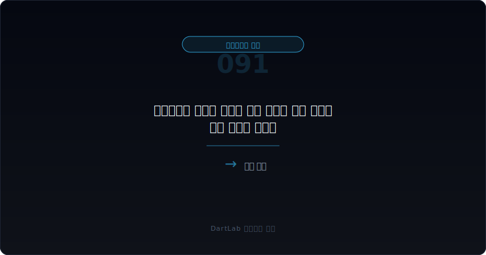
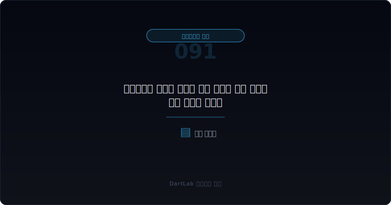
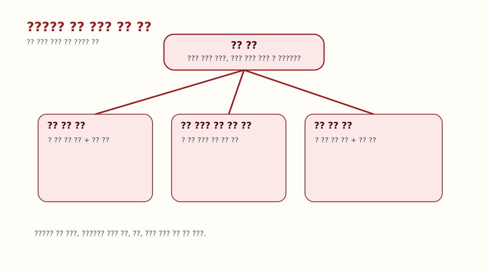
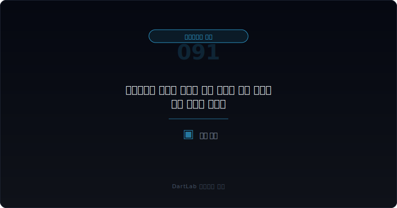

# 감사위원회 활동이 길어도 실질 감독이 약한 회사는 어떤 패턴을 보이나

감사위원회 활동내역은 길수록 좋아 보이기 쉽다. 회의 횟수가 많고, 안건도 많고, 출석률도 높으면 감독이 잘 이뤄지고 있다고 느끼기 쉽다. 하지만 **실전에서는 `얼마나 많이 논의했는가`보다 `무엇이 끝나지 않고 남아 있는가`가 더 중요하다. 활동 기록이 길어도 같은 문제가 반복되고, 조치 문구만 길어지고, 숫자와 정정공시가 계속 흔들리면 실질 감독은 약할 수 있다.**

이 질문이 중요한 이유는 활동량과 감독 효과가 자주 분리되기 때문이다. 어떤 회사는 회의가 많아도 안건이 매년 제자리이고, 어떤 회사는 회의가 아주 많지 않아도 반복 문제를 빨리 끝낸다. 결국 투자자 입장에서 중요한 것은 `감사위원회가 얼마나 바빴는가`가 아니라 `감사위원회가 무엇을 끝내게 만들었는가`다.

이 글은 [감사위원회가 같은 이슈를 반복 지적할 때 무엇을 먼저 봐야 하나](/blog/repeat-audit-committee-findings), [내부회계관리제도와 감사위원회 활동은 어디서 위험 신호가 보이나](/blog/internal-controls-and-audit-committee), [감사보수와 비감사보수는 어디가 신호인가](/blog/audit-fees-and-non-audit-fees), [감사 종료 후에도 정정공시가 나올 때 무엇을 먼저 봐야 하나](/blog/post-audit-restatement-signals)의 다음 단계다. 여기서는 `긴 활동내역`과 `약한 실질 감독`을 구분하는 방법을 정리한다.

이 글은 감사위원회 활동을 `회의량 확인 -> 반복 안건과 종료 안건 분리 -> 조치 결과 대조 -> 숫자·정정공시 반응 확인 -> 다음 해 재발 여부 추적` 순서로 읽는 방법을 설명한다.

---

## 왜 활동 기록이 길다고 바로 안심하면 안 되나

감사위원회 활동내역이 길다는 것은 자료가 많다는 뜻이지, 반드시 감독 효과가 좋다는 뜻은 아니다. 길어진 이유가 `문제를 빨리 해결해서 설명할 것이 많아진 경우`일 수도 있지만, `같은 문제를 계속 논의하느라 기록만 늘어난 경우`일 수도 있다.

특히 길게 적힌 공시는 종종 좋은 인상을 준다. 내부회계 점검, 외부감사인 협의, 재무제표 검토, 분기별 보고, 리스크 관리 안건이 빽빽하게 적혀 있으면 감독이 치밀해 보인다. 하지만 그 안에서 같은 주제의 문장이 반복되고, 후속 숫자에서는 정정공시나 내부결산 오류가 계속 나오면 해석은 완전히 달라진다.

그래서 긴 활동내역을 볼 때는 `무엇이 추가됐나`보다 `무엇이 아직도 남아 있나`를 먼저 적는 편이 좋다. 긴 설명은 질 좋은 감독의 흔적일 수도 있지만, 정리되지 않은 문제의 체류 시간일 수도 있기 때문이다.

---

## 같은 항목인데 해석이 갈리는 이유

| 먼저 볼 항목 | 왜 중요한가 |
| --- | --- |
| 회의 횟수·출석률 | 형식적 활동량의 기준선을 본다 |
| 반복 안건 | 무엇이 해결되지 않고 남는지 본다 |
| 종료된 안건 | 실제로 끝난 문제가 있는지 본다 |
| 경영진 조치 결과 | 계획만 있는지 실행 결과가 있는지 본다 |
| 정정공시·재감사 | 활동이 숫자 안정으로 이어졌는지 본다 |
| 감사 반응 | 외부감사 시간, 문구, 의견 변화가 붙는지 본다 |

실전에서는 먼저 활동량 자체를 부정할 필요는 없다. 회의 횟수와 출석률은 기본 정보로 적는다. 다만 거기서 멈추지 말고 `종료 안건`과 `반복 안건`을 구분해야 한다. 같은 주제라도 올해 처음 등장했는지, 작년에도 있었는지, 표현만 달라졌는지가 중요하다.

다음으로는 조치 결과를 붙여 본다. `강화`, `개선`, `보완`, `점검 예정`이라는 말은 많지만 실제로 어떤 숫자나 프로세스가 안정됐는지가 더 중요하다. 이때 [감사 전 내부결산 오류는 어디서 먼저 드러나나](/blog/pre-audit-closing-errors-and-signals), [감사 전 재무제표 정정과 재감사는 어디서 위험 신호가 보이나](/blog/restatement-before-audit-and-reaudit-signals), [잠정실적 정정이 반복될 때 무엇이 더 위험한가](/blog/repeated-preliminary-earnings-restatements)까지 이어 보면 활동량과 결과를 붙여 읽기 쉬워진다.

---

## 건강한 구조 vs 위험한 구조

핵심 질문은 이것이다. `이 감사위원회는 일을 많이 하는가, 아니면 문제를 끝내게 만드는가?`

실질 감독이 비교적 있는 경우는 회의가 많든 적든 상관없이 반복 안건이 줄고, 종료 안건이 늘고, 후속 숫자가 안정되는 경우다. 이때는 활동량이 결과로 이어지고 있다고 볼 수 있다.

경계 구간은 회의는 많고 안건도 많지만, 어떤 문제는 정리되고 어떤 문제는 반복되는 경우다. 이때는 정정공시, 감사 문구, 내부회계 설명을 같이 봐야 한다. 말이 길어졌는지, 실제로 흔들림이 줄었는지 가르는 단계다.

실질 감독이 약하다고 읽어야 하는 경우는 회의 횟수와 출석률은 높지만 반복 안건이 계속 남고, 조치 문구는 비슷하며, 정정공시·재감사·감사 반응 강화까지 이어지는 경우다. 이런 경우에는 감독기구가 존재해도 문제 종료 능력은 약할 수 있다.

---

## 업종과 맥락에 따라 달라지는 기준

| 관찰 포인트 | 상대적으로 실질 감독이 있는 경우 | 더 조심해야 하는 경우 |
| --- | --- | --- |
| 반복 안건 | 범위가 줄어든다 | 표현만 바뀌고 본질은 같다 |
| 종료 안건 | 실제 종료가 확인된다 | 종료 기록이 약하다 |
| 조치 문구 | 실행 결과가 같이 적힌다 | 계획 문구만 반복된다 |
| 숫자 안정성 | 정정·재감사가 줄어든다 | 숫자 수정이 이어진다 |
| 외부감사 반응 | 문구와 시간 부담이 안정된다 | 더 무거워진다 |

상대적으로 실질 감독이 있는 경우는 활동 기록이 길어도 읽고 나면 `무엇이 정리됐는지`가 보인다. 반대로 더 조심해야 하는 경우는 읽고 나면 `무엇이 여전히 남아 있는지`만 보인다. 둘 다 자료는 많지만 의미는 다르다.

실전에서는 여기에 한 줄을 더 적는 편이 좋다. `올해 새 안건이 많았는가, 아니면 오래된 안건이 계속 길어졌는가`다. 새 안건은 외부 환경 변화일 수 있지만, 오래된 안건이 길어지는 것은 해결력 부족일 수 있다.

---

## 왜 회의 횟수보다 안건 종료율이 더 중요한가

감사위원회 활동을 평가할 때 많은 사람이 회의 횟수를 숫자로 비교한다. 그러나 회의는 많이 열수록 좋다고 단정할 수 없다. 문제 해결이 어려워 회의를 자주 열 수도 있고, 결산과 정정 이슈가 많아 회의가 늘 수도 있기 때문이다.

반대로 회의 횟수가 많지 않아도 핵심 안건을 빠르게 정리하고 다음 해에 재발이 줄면 그쪽이 더 건강할 수 있다. 그래서 회의 횟수는 활동량 지표일 뿐이고, 투자 판단에서는 `안건 종료율`이 더 중요하다. 같은 주제가 얼마나 빨리 사라지는지, 같은 통제 문제가 다음 해까지 이어지는지, 숫자 불일치가 줄어드는지 같은 결과 지표가 실질 감독을 더 잘 보여준다.

즉 `몇 번 모였는가`는 시작점이고, `무엇이 끝났는가`가 결론이다. 이 순서를 뒤집으면 활동 많은 회사를 과대평가하기 쉽다.

---

## 실전에서 가장 빨리 구분되는 조합은 무엇인가

가장 빨리 위험해지는 조합은 `회의 횟수 많음 + 반복 안건 유지 + 조치 문구 반복 + 정정공시 지속`이다. 여기에 [한정·부적정·의견거절 감사의견은 무엇이 다른가](/blog/qualified-adverse-disclaimer-audit-opinions)에서 본 비적정 의견 위험이나 [적정 의견이어도 불안한 회사는 어떤 패턴을 보이나](/blog/clean-audit-opinion-but-still-risky)에서 본 문구 강화가 붙으면 더 무거워진다.

반대로 상대적으로 덜 무거운 조합은 `회의 횟수 증가 + 특정 안건 집중 + 다음 해 종료 확인`이다. 이런 경우에는 활동량 증가가 오히려 문제 해결 과정일 수 있다.

실전 메모는 다섯 줄이면 충분하다. `회의 횟수`, `반복 안건`, `종료 안건`, `정정 여부`, `내년 재발`. 이 다섯 줄을 적으면 길어 보이는 활동내역의 실질을 빠르게 가를 수 있다.

---

## 왜 위원 교체와 외부감사인 교체가 반복되면 더 무겁게 봐야 하나

긴 활동내역 자체보다 더 무거운 신호는 `감독 구조가 계속 바뀌는데 문제는 안 끝나는 경우`다. 감사위원이 자주 바뀌거나 외부감사인이 교체되는데도 같은 안건이 반복된다면, 사람만 바뀌고 관리 구조는 그대로일 수 있다.

이때는 회사가 문제를 해결하고 있는지보다 문제를 버티고 있는지 의심해야 한다. 새로운 위원이나 감사인이 오면 보통 초기에는 이슈가 더 선명해질 수 있지만, 시간이 지나도 같은 논점이 정리되지 않으면 감독 구조 자체의 실효성이 약한 편일 수 있다.

그래서 긴 활동내역을 읽을 때는 안건 목록만이 아니라 `누가 감독했고, 누가 바뀌었고, 그 변화가 결과를 바꿨는가`까지 같이 보는 것이 좋다.

---

## 다음 분기 비교에서 다시 확인할 것

| 이번에 본 것 | 다음에 다시 볼 것 |
| --- | --- |
| 반복 안건 | 실제로 사라지는가 |
| 종료 안건 | 다음 해에도 종료 상태가 유지되는가 |
| 정정공시 | 줄어드는가, 다시 나오는가 |
| 감사 문구 | 완화되는가, 더 무거워지는가 |
| 감독 구조 | 위원·감사인 변화가 결과를 바꾸는가 |

긴 감사위원회 활동내역은 한 해 읽고 끝내면 의미가 절반밖에 남지 않는다. 이 자료의 핵심은 `다음 해에도 같은 이야기를 또 하는가`를 보는 데 있다.

특히 새 글 4개를 묶어 보는 이번 배치 기준으로는 [감사위원회가 같은 이슈를 반복 지적할 때 무엇을 먼저 봐야 하나](/blog/repeat-audit-committee-findings)와 이 글을 한 세트로 보면 좋다. 087이 `반복 안건 자체`를 읽는 글이라면, 091은 `활동량 착시와 실질 감독 약화`를 읽는 글이다.

여기서 투자자가 가장 자주 놓치는 장면은 `회의록이 두꺼워질수록 안심하는 순간`이다. 하지만 긴 활동내역은 좋은 감독의 결과일 수도 있고, 반대로 회사가 같은 문제를 여러 차례 돌려 말하고 있다는 신호일 수도 있다. 그래서 길이만 보고 안심하기보다, 그 길이 안에서 실제로 사라진 논점이 있는지 확인해야 한다.

또한 긴 활동내역은 경영진과 감사위원회가 문제를 알고 있었다는 기록이 되기도 한다. 그럼에도 후속 숫자와 정정공시가 계속 흔들린다면, 투자자는 단순 실수가 아니라 `알고도 오래 못 고친 문제`로 해석을 바꿔야 한다. 이 차이가 감독의 실질을 가르는 핵심이다.

---

## 비교 체크리스트

- 회의 횟수와 출석률만 보지 않았는가
- 반복 안건과 종료 안건을 따로 적었는가
- 경영진 조치가 계획인지 결과인지 구분했는가
- 정정공시와 감사 문구를 같이 붙여 봤는가
- 위원 교체나 감사인 교체가 결과를 바꿨는지 확인했는가
- 다음 해에도 같은 안건이 남는지 추적할 계획을 세웠는가

## FAQ

### 감사위원회 활동내역이 길면 좋은 회사 아닌가

반드시 그렇지는 않다. 긴 기록은 좋은 감독의 흔적일 수도 있지만, 끝나지 않는 문제의 흔적일 수도 있다.

### 무엇이 가장 무거운 신호인가

회의는 많고 문장도 긴데, 같은 안건이 반복되고 정정공시와 숫자 흔들림이 계속되는 경우다.

### 출석률이 높으면 안심해도 되나

아니다. 출석률은 형식 지표일 뿐이고, 반복 안건이 줄었는지가 더 중요하다.

### 어디와 같이 읽으면 도움이 되나

087, 044, 083, 072, 064, 067과 같이 읽으면 감독의 실질과 숫자 신뢰도를 함께 보기 좋다.

## 함께 비교하면 좋은 글

- [감사위원회가 같은 이슈를 반복 지적할 때 무엇을 먼저 봐야 하나](/blog/repeat-audit-committee-findings)
- [내부회계관리제도와 감사위원회 활동은 어디서 위험 신호가 보이나](/blog/internal-controls-and-audit-committee)
- [감사 종료 후에도 정정공시가 나올 때 무엇을 먼저 봐야 하나](/blog/post-audit-restatement-signals)
- [감사 전 내부결산 오류는 어디서 먼저 드러나나](/blog/pre-audit-closing-errors-and-signals)
- [감사보수와 비감사보수는 어디가 신호인가](/blog/audit-fees-and-non-audit-fees)
- [한정·부적정·의견거절 감사의견은 무엇이 다른가](/blog/qualified-adverse-disclaimer-audit-opinions)
- [적정 의견이어도 불안한 회사는 어떤 패턴을 보이나](/blog/clean-audit-opinion-but-still-risky)

## 출처

- [DART 소개 - 보고서정보](https://dart.fss.or.kr/introduction/content2.do)
- [기업공시길라잡이](https://dart.fss.or.kr/info/main.do?menu=120)
- [외부감사법 시행령](https://www.law.go.kr/%EB%B2%95%EB%A0%B9/%EC%A3%BC%EC%8B%9D%ED%9A%8C%EC%82%AC%EB%93%B1%EC%9D%98%EC%99%B8%EB%B6%80%EA%B0%90%EC%82%AC%EC%97%90%EA%B4%80%ED%95%9C%EB%B2%95%EB%A5%A0%EC%8B%9C%ED%96%89%EB%A0%B9)

## 한 줄 정리

감사위원회 활동이 길다고 해서 실질 감독이 강하다고 단정하면 안 된다. 투자자에게 더 중요한 것은 활동량이 아니라 반복 안건이 끝나는 속도, 조치 결과의 실재, 숫자 안정성이다.

핵심은 `얼마나 많이 했나`보다 `무엇을 끝냈나`를 묻는 것이다. 그 질문을 붙이면 긴 활동내역 속에서 진짜 감독의 질을 더 빠르게 읽게 된다.
