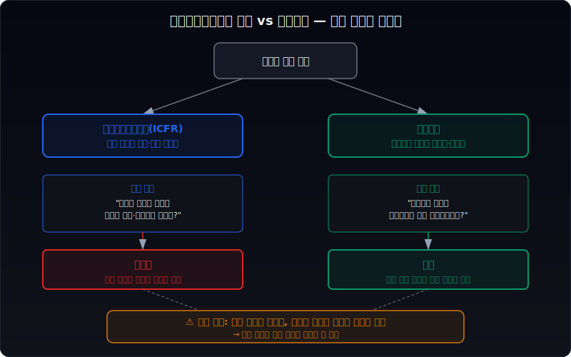
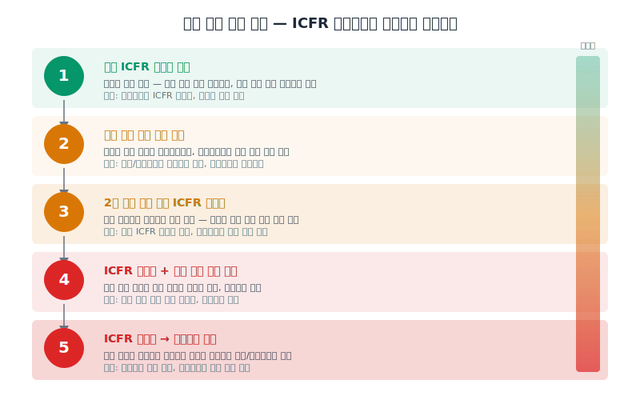
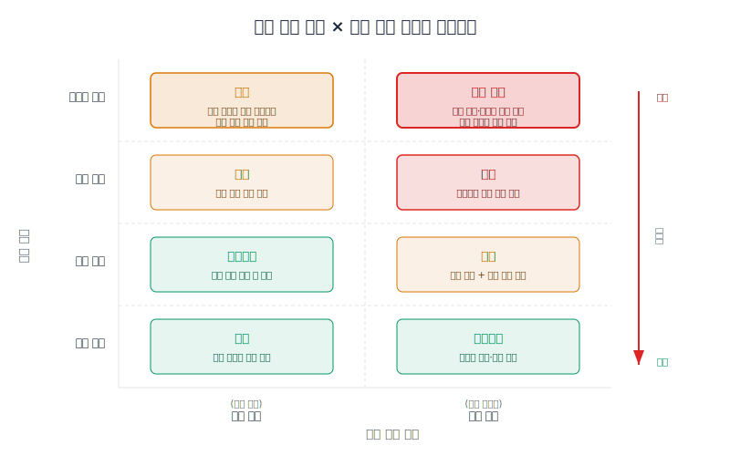
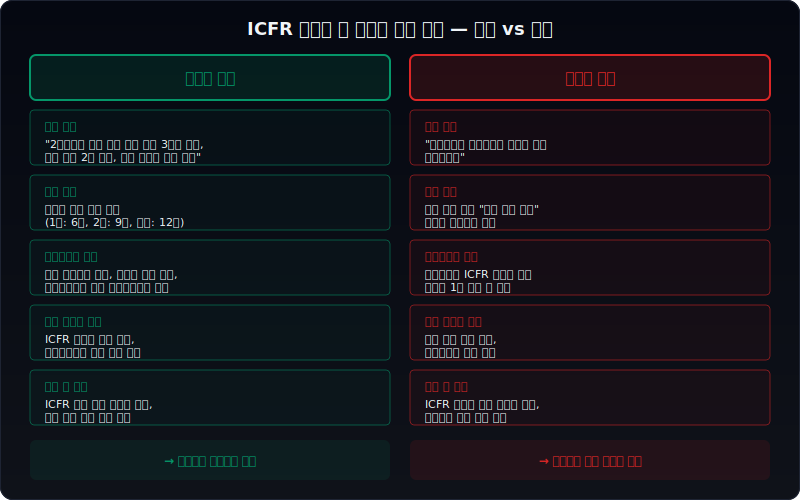
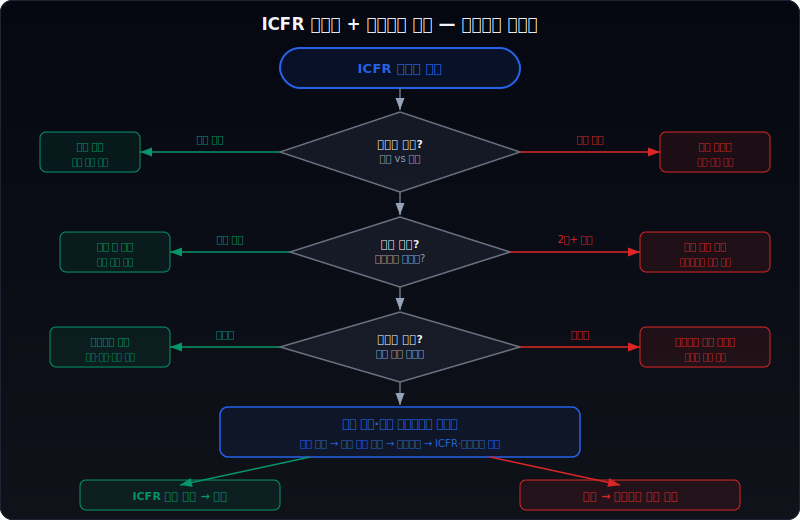

# 내부회계 비적정인데 감사의견은 적정일 때 무엇을 먼저 봐야 하나

내부회계관리제도 검토(또는 감사) 의견이 비적정인데 외부감사 의견은 적정이라면, 이 두 의견이 동시에 공존한다는 사실 자체가 이미 하나의 신호다. 많은 투자자는 감사의견이 적정이면 재무제표 전체를 신뢰해도 된다고 생각하지만, **내부회계관리제도(ICFR) 비적정은 `숫자는 지금 맞지만 숫자를 만드는 과정에 구멍이 있다`는 의미**이므로 성격이 다르다. 구멍이 메워지지 않으면 다음 분기, 다음 연도의 숫자는 신뢰가 낮아질 수 있다.

이 글은 [내부회계관리제도와 감사위원회 활동은 어디서 위험 신호가 보이나](/blog/internal-controls-and-audit-committee), [감사의견이 한정·부적정·의견거절일 때 무엇을 먼저 봐야 하나](/blog/qualified-adverse-disclaimer-audit-opinions), [감사의견은 적정인데 위험한 회사는 어디서 신호가 나오나](/blog/clean-audit-opinion-but-still-risky)의 다음 단계다. 여기서는 `ICFR 비적정 + 감사의견 적정`이라는 특정 괴리 상황에서 무엇을 어떤 순서로 확인해야 하는지 정리한다.

이 글은 내부회계 비적정과 감사의견 적정의 공존 구조를 `범위 차이 이해 → 통제 미비 유형 분류 → 재무제표 영향 판단 → 감사위원회·경영진 대응 확인 → 다음 보고서 추적` 순서로 읽는 방법을 설명한다.

---

## 왜 내부회계 비적정과 감사의견 적정이 공존할 수 있나

내부회계관리제도 의견과 외부감사 의견은 평가 대상이 다르다. 외부감사 의견은 `재무제표 숫자가 회계기준에 맞게 표시되었는가`를 본다. 반면 내부회계관리제도 의견은 `그 숫자를 만들어 내는 내부 통제 절차가 제대로 설계·운영되고 있는가`를 본다.

비유하자면, 외부감사는 시험 결과를 채점하는 것이고, 내부회계관리제도는 시험을 치르는 과정(커닝 방지 시스템, 출제 절차, 채점 검증 프로세스)을 점검하는 것이다. 시험 결과가 맞더라도 과정에 구멍이 있으면 다음 시험에서 같은 결과를 기대하기 어렵다.

구체적으로, 감사인이 ICFR에서 중요한 취약점(material weakness)을 발견하더라도 재무제표에 대해서는 추가 실증 절차(substantive testing)를 수행해서 숫자가 맞다고 확인할 수 있다. 이 경우 재무제표 숫자 자체는 신뢰할 수 있으므로 감사의견은 적정이 되고, 통제 환경은 부실하므로 ICFR 의견은 비적정이 된다.

이런 공존이 가능한 대표적 상황은 다음과 같다.

| 상황 | 설명 |
| --- | --- |
| 특정 거래 유형의 통제 미비 | 재고자산 평가 절차에 결함이 있지만, 감사인이 직접 재고실사와 평가를 수행하여 숫자를 확인 |
| IT 시스템 접근 통제 취약 | 회계 시스템 권한 관리가 부실하지만, 전표 검토와 증빙 대조로 오류 없음을 확인 |
| 결산 프로세스 미흡 | 결산 마감 절차에 구멍이 있지만, 사후 감사 절차로 수정 완료 |
| 경영진 판단 영역 통제 부재 | 대손충당금 추정 프로세스가 미흡하지만, 감사인 독립 추정으로 합리적 범위 확인 |

여기서 핵심은 `지금 숫자가 맞다`와 `앞으로도 숫자를 맞출 수 있다`는 전혀 다른 질문이라는 점이다. ICFR 비적정은 후자에 대한 경고다.

---

## 어떤 숫자 조합이 먼저 경고하나

ICFR 비적정과 감사의견 적정이 동시에 나왔을 때, 재무제표 숫자에서 다음 조합이 보이면 경고 수준이 올라간다.

| 조합 | 왜 경고인가 |
| --- | --- |
| 대손충당금 급변 + ICFR 비적정 | 추정 영역의 통제 부재가 숫자 변동으로 나타난 가능성 |
| 재고평가손실 반복 + 재고 통제 미비 | 재고 관리 통제가 없으니 재고 숫자 자체를 신뢰하기 어려움 |
| 매출채권 회전율 급격 변동 + 매출 인식 통제 미비 | 매출 인식 기준 적용이 일관되지 않을 가능성 |
| 유형자산 재평가 + 자산 평가 통제 미비 | 경영진 판단 영역에 통제가 없으면 재평가 신뢰 저하 |
| 전기오류수정 반복 발생 + 결산 통제 미비 | 결산 프로세스 자체가 무너지고 있다는 신호 |

특히 전기오류수정이 2년 이상 연속 나오면서 동시에 ICFR 비적정이면, 이것은 `이미 숫자가 흔들리기 시작한 상태에서 통제마저 없다`는 조합이다. [감사의견은 적정인데 위험한 회사는 어디서 신호가 나오나](/blog/clean-audit-opinion-but-still-risky)에서 다루는 위험 패턴과 겹치는 부분이 많다.

---

## 신호가 강해지는 순서

ICFR 비적정이 처음 나왔을 때와, 몇 년째 반복될 때는 위험의 무게가 완전히 다르다. 신호는 대개 다음 순서로 강해진다.

**1단계: 최초 ICFR 비적정 발생**

첫 해에 ICFR 비적정이 나오면, 우선 비적정 사유를 읽는다. 단일 영역의 설계 미비(design deficiency)인지, 운영 미비(operating deficiency)인지, 복수 영역에 걸친 중요 취약점인지를 확인한다. 단일 영역의 설계 미비라면 시정 계획이 구체적인지만 우선 확인하면 된다.

**2단계: 다음 분기 보고서에서 시정 진행 확인**

최초 발생 다음 분기 보고서에서 경영진의 시정 계획 진행 상황을 본다. 구체적인 조치(인력 충원, 시스템 도입, 절차 변경)가 언급되는지, 아니면 `개선 중`, `보완 예정` 같은 추상적 문구만 반복되는지가 첫 번째 분기점이다.

**3단계: 같은 사유로 2년 연속 ICFR 비적정**

같은 영역에서 같은 유형의 취약점이 2년 연속 나오면 경고 수준이 크게 올라간다. 이것은 `문제를 알면서 고치지 못하거나 고치지 않았다`는 의미이기 때문이다. 이 시점부터는 감사위원회 활동내역에서 해당 이슈를 어떻게 다루었는지를 반드시 확인한다. [감사위원회 활동이 길어도 실질 감독이 약한 회사는 어떤 패턴을 보이나](/blog/long-audit-committee-activity-but-weak-supervision)에서 설명한 `반복 안건 + 종료 부재` 패턴이 여기서 나타나는지 본다.

**4단계: ICFR 비적정 + 재무제표 수치 변동 확대**

통제 취약점이 지속되면서 실제로 재무제표 숫자의 변동성이 커지거나, 정정공시가 나오기 시작하면 위험 수준이 한 단계 더 올라간다. 이 단계에서는 감사의견도 다음 해에 바뀔 가능성을 염두에 둬야 한다.

**5단계: ICFR 비적정 → 감사의견 변경**

최종적으로 통제 취약점이 재무제표 왜곡으로 이어지면 감사의견이 한정 또는 부적정으로 바뀔 수 있다. [감사의견이 한정·부적정·의견거절일 때 무엇을 먼저 봐야 하나](/blog/qualified-adverse-disclaimer-audit-opinions)에서 다루는 상황이 여기서 시작되는 것이다.

---

## 위험도를 나누는 기준

ICFR 비적정의 위험도는 몇 가지 축으로 나눌 수 있다.

| 축 | 낮은 위험 | 높은 위험 |
| --- | --- | --- |
| 영향 범위 | 단일 계정/단일 거래 유형 | 복수 계정/전사적 통제 |
| 지속 기간 | 최초 발생(1년차) | 2년 이상 반복 |
| 취약점 성격 | 설계 미비(절차 부재) | 운영 미비(절차 있으나 미준수) |
| 경영진 대응 | 구체적 시정 계획 + 일정 | 추상적 문구, 계획 없음 |
| 재무제표 영향 | 해당 계정 수치 안정 | 관련 계정 변동성 확대 |
| 감사위원회 반응 | 전담 안건 + 후속 점검 | 언급 없거나 형식적 |
| 감사인 반응 | 핵심감사사항 미포함 | 핵심감사사항 포함 또는 강조사항 |

이 기준들을 동시에 적용하면 같은 `ICFR 비적정`이라도 읽어야 하는 깊이가 달라진다. 단일 계정의 최초 설계 미비이면서 경영진이 구체적 시정 계획을 내놓았다면, 다음 해 시정 여부만 확인하면 된다. 반면 복수 계정에 걸친 운영 미비가 반복되면서 경영진 대응이 추상적이면, 재무제표 숫자 자체를 더 면밀히 뜯어봐야 한다.

---

## 통제 미비 유형이 재무제표 신뢰에 미치는 무게가 다르다

통제 미비는 크게 **설계 미비(design deficiency)**와 **운영 미비(operating deficiency)**로 나뉘고, 재무제표 신뢰에 미치는 무게가 다르다.

**설계 미비**는 통제 절차 자체가 없거나, 있어도 해당 위험을 방지·탐지하기에 부적합한 경우다. 예를 들어 매출 인식 시 계약 조건을 검토하는 절차가 아예 없다면 설계 미비다. 설계 미비는 `절차를 새로 만들면 되므로` 시정 가능성이 비교적 높다. 다만 절차가 없던 기간 동안 인식된 매출의 정확성은 감사인의 실증 절차에 전적으로 의존한다.

**운영 미비**는 통제 절차가 있지만 실제로 수행되지 않거나, 수행되더라도 효과적이지 않은 경우다. 예를 들어 매출 인식 검토 절차가 문서로는 존재하지만 담당자가 실제로 검토를 수행하지 않았다면 운영 미비다. 운영 미비가 더 위험한 이유는 두 가지다.

첫째, 절차가 있는데도 안 지키는 것은 조직 문화나 인력, 경영진 의지 문제를 시사한다. 절차를 추가하는 것보다 조직 행동을 바꾸는 것이 훨씬 어렵다.

둘째, 운영 미비는 감사인이 발견한 것만 보고된 것일 수 있다. 절차가 형식적으로만 존재하는 영역이 보고된 곳 외에도 있을 가능성이 있다.

특히 **전사적 수준의 통제(entity-level controls)**가 운영 미비로 나오면 위험은 급격히 올라간다. 전사적 통제란 경영진의 윤리 기조, 이사회 감독, 내부감사 기능, 정보 보고 체계 같은 상위 통제를 말한다. 이 수준에서 미비가 있으면 하위의 거래 수준 통제도 연쇄적으로 신뢰가 떨어진다.

| 미비 유형 | 시정 난이도 | 재무제표 파급 | 투자자 주의 수준 |
| --- | --- | --- | --- |
| 단일 계정 설계 미비 | 낮음 | 해당 계정에 한정 | 모니터링 |
| 단일 계정 운영 미비 | 중간 | 해당 계정 + 연관 계정 | 주의 |
| 복수 계정 설계 미비 | 중간 | 관련 재무제표 영역 전체 | 주의 |
| 복수 계정 운영 미비 | 높음 | 재무제표 전반 | 경고 |
| 전사적 통제 운영 미비 | 매우 높음 | 재무제표 전체 신뢰도 | 심각 경고 |

---

## 감사위원회 활동과 경영진 대응을 같이 봐야 하는 이유

ICFR 비적정은 경영진의 책임 영역이다. 내부회계관리제도의 설계와 운영은 경영진이 하고, 감사위원회는 이를 감독하며, 외부감사인은 검토하거나 감사한다. 따라서 비적정 이후의 회복 경로는 경영진의 시정 의지와 능력, 그리고 감사위원회의 실질적 감독 여부에 달려 있다.

**경영진 대응에서 봐야 할 것:**

- 시정 계획의 구체성: `내부통제 강화` 같은 추상적 문구인지, `2분기까지 매출 인식 검토 절차 3단계 도입, 전담 인력 2명 배치` 같은 구체적 계획인지
- 시정 일정: 명확한 완료 시점이 있는지, `지속적으로 개선` 같은 기한 없는 표현인지
- 외부 전문가 투입: 시정을 위해 외부 전문가나 컨설팅 기관을 활용하는지
- 이전 시정 이력: 과거에도 비적정이 나왔다면 당시 시정 계획이 실행되었는지

**감사위원회에서 봐야 할 것:**

- ICFR 비적정이 감사위원회 안건으로 올라왔는지 (올라가지 않았으면 자체가 문제)
- 경영진 시정 계획을 검토하고 후속 점검 일정을 잡았는지
- 다음 분기 감사위원회에서 시정 진행 상황을 재확인했는지
- 외부감사인과 ICFR 취약점에 대해 별도 커뮤니케이션을 했는지

[내부회계관리제도와 감사위원회 활동은 어디서 위험 신호가 보이나](/blog/internal-controls-and-audit-committee)에서 설명한 것처럼, 감사위원회가 형식적으로만 안건을 다루고 실질적 후속 점검이 없으면 시정은 이뤄지지 않는 경우가 많다. 특히 ICFR 비적정이 감사위원회 활동내역에 아예 언급되지 않은 경우는 감독 기능 자체에 의문을 가져야 한다.

[감사보수와 비감사보수는 어디가 신호인가](/blog/audit-fees-and-non-audit-fees)에서 다루는 비감사보수도 같이 확인하면 좋다. ICFR 비적정 이후 내부회계 관련 컨설팅 보수가 증가하면 시정 노력의 증거일 수 있고, 변화가 없으면 방치의 증거일 수 있다.

---

## 다음 분기에 다시 확인할 숫자

ICFR 비적정을 확인한 뒤, 다음 분기 또는 다음 사업연도 보고서에서 반드시 확인해야 할 항목은 다음과 같다.

**즉시 확인 (다음 분기보고서):**

1. **경영진 시정 계획 진행 상황**: 반기/분기보고서의 내부회계관리제도 운영실태 항목에서 시정 조치 언급 여부
2. **비적정 관련 계정의 숫자 변동**: 취약점이 지적된 영역의 재무제표 계정이 전기 대비 크게 변동했는지
3. **정정공시 발생 여부**: 비적정 관련 영역에서 정정공시가 나왔는지 (나왔다면 통제 부재가 숫자에 영향을 준 증거)

**연차 확인 (다음 사업보고서):**

4. **ICFR 의견 변화**: 비적정에서 적정으로 회복했는지, 여전히 비적정인지
5. **비적정 사유 변화**: 같은 영역인지, 새로운 영역이 추가되었는지
6. **감사의견 변화**: 감사의견이 여전히 적정인지, 한정으로 바뀌었는지
7. **핵심감사사항(KAM) 변화**: 감사인이 ICFR 관련 영역을 핵심감사사항에 새로 포함했는지
8. **감사보수 변동**: 감사인이 추가 실증 절차를 수행하면 감사보수가 올라갈 수 있음

이 항목들은 순서대로 확인하는 것이 효율적이다. 먼저 시정 계획 진행을 보고, 숫자가 안정적인지 보고, 정정이 있었는지 보고, 마지막으로 감사인의 의견 변화를 본다. 시정이 이뤄졌으면 대부분의 후속 항목은 안정적일 것이고, 시정이 안 되었으면 하나씩 추가 경고가 붙을 가능성이 높다.

---

## 실전 점검 체크리스트

다음 체크리스트를 순서대로 적용하면, ICFR 비적정 + 감사의견 적정 상황에서 위험 수준을 체계적으로 판단할 수 있다.

| 순번 | 점검 항목 | 확인 방법 | 위험 신호 |
| --- | --- | --- | --- |
| 1 | ICFR 비적정 사유 확인 | 감사보고서 내부회계관리제도 검토/감사 의견란 | 복수 영역, 전사적 통제 미비 |
| 2 | 취약점 유형 분류 | 사유에서 설계 미비 vs 운영 미비 구분 | 운영 미비, 특히 반복 발생 |
| 3 | 연속 발생 여부 | 전기 보고서의 ICFR 의견 확인 | 2년 이상 같은 사유 반복 |
| 4 | 관련 계정 숫자 안정성 | 취약점 관련 계정의 전기 대비 변동률 | 20% 이상 변동 + 설명 부재 |
| 5 | 경영진 시정 계획 구체성 | 보고서 내 시정 계획 언급 | 추상적 문구만 있고 일정·인력 없음 |
| 6 | 감사위원회 안건 포함 여부 | 감사위원회 활동내역 | 아예 미언급 또는 형식적 1회 논의 |
| 7 | 정정공시 이력 | 전자공시시스템 정정공시 검색 | 비적정 관련 영역에서 정정 발생 |
| 8 | 감사보수 변동 | 감사보수 항목 전기 대비 비교 | 보수 불변인데 추가 절차 필요한 상황 |
| 9 | 핵심감사사항 관련성 | KAM에 ICFR 관련 영역 포함 여부 | 신규 KAM 추가 또는 기존 KAM 설명 확대 |
| 10 | 다음 분기 시정 진행 | 반기/분기보고서 내부통제 항목 | 변화 없음 또는 후퇴 |

위 항목 중 3개 이상에서 위험 신호가 나오면, 해당 기업의 재무제표는 감사의견이 적정이더라도 숫자의 지속가능한 신뢰에 의문을 갖고 읽어야 한다.

---

## 자주 묻는 질문

**Q1. 내부회계관리제도 '검토'와 '감사'는 다른 건가요?**

다릅니다. 자산총액 기준으로 일정 규모 이상 상장회사는 ICFR에 대해 외부감사인의 **감사**(audit)를 받고, 그 이하는 **검토**(review)를 받습니다. 감사가 검토보다 수준이 높습니다. 검토는 소극적 확인("문제를 발견하지 못했다")이고, 감사는 적극적 확인("효과적으로 운영되고 있다/있지 않다")입니다. 비적정의 무게는 감사 대상 회사에서 더 큽니다.

**Q2. ICFR 비적정이 나오면 주가가 반드시 하락하나요?**

반드시 하락하지는 않습니다. 시장은 감사의견 적정에 더 큰 비중을 두는 경향이 있고, ICFR 비적정의 구체적 사유나 영향 범위를 세밀하게 반영하지 못하는 경우가 많습니다. 다만 ICFR 비적정이 이후에 감사의견 변경, 정정공시, 상장적격성 실질심사로 이어지면 그 시점에서 주가 반응이 크게 나타날 수 있습니다. 중요한 것은 즉각적 주가 반응보다 이후 경로를 미리 추적하는 것입니다.

**Q3. 중소형 기업에서 ICFR 비적정이 나오면 대기업과 같은 기준으로 봐야 하나요?**

기본 프레임은 동일하지만 맥락이 다릅니다. 중소형 기업은 내부 인력이 적어서 통제 절차의 분리(segregation of duties)가 물리적으로 어려운 경우가 많습니다. 이런 구조적 한계 때문에 발생하는 설계 미비는 대기업의 같은 유형 미비보다 시정이 어렵고 반복될 가능성도 높습니다. 중소형 기업에서는 경영진 대응의 구체성과 감사위원회(또는 감사)의 실질 감독이 더 중요한 판단 기준이 됩니다.

**Q4. ICFR 비적정 회사에 투자하고 있다면 즉시 매도해야 하나요?**

ICFR 비적정 자체만으로 즉시 매도를 결정하기보다, 이 글에서 정리한 위험도 기준과 체크리스트를 적용해서 상황의 심각도를 먼저 판단하는 것이 합리적입니다. 단일 영역 설계 미비이고 구체적 시정 계획이 있다면 다음 해 확인까지 기다릴 수 있습니다. 복수 영역 운영 미비가 반복되면서 경영진 대응이 불투명하다면 포지션 축소를 진지하게 검토해야 합니다.

**Q5. ICFR 비적정에서 적정으로 회복한 회사는 안전한가요?**

회복 자체는 긍정적 신호입니다. 다만 회복 첫 해에는 시정 조치의 지속성을 확인해야 합니다. 특히 외부 컨설팅 도움으로 급하게 시정한 경우, 컨설팅이 끝나면 다시 취약해질 수 있습니다. 회복 후 최소 1~2년간 적정이 유지되는지, 관련 계정 숫자가 안정적인지를 추가로 확인하는 것이 좋습니다.

---

## 관련 분석 글

- [내부회계관리제도와 감사위원회 활동은 어디서 위험 신호가 보이나](/blog/internal-controls-and-audit-committee) — ICFR과 감사위원회의 기본 관계
- [감사의견이 한정·부적정·의견거절일 때 무엇을 먼저 봐야 하나](/blog/qualified-adverse-disclaimer-audit-opinions) — 감사의견이 실제로 바뀌었을 때 읽는 법
- [감사의견은 적정인데 위험한 회사는 어디서 신호가 나오나](/blog/clean-audit-opinion-but-still-risky) — 적정 의견 뒤의 숨겨진 위험
- [감사위원회 활동이 길어도 실질 감독이 약한 회사는 어떤 패턴을 보이나](/blog/long-audit-committee-activity-but-weak-supervision) — 형식적 감독과 실질적 감독 구분
- [감사보수와 비감사보수는 어디가 신호인가](/blog/audit-fees-and-non-audit-fees) — 보수 변동이 말해주는 것

---

## 공식 출처와 근거

- **주식회사 등의 외부감사에 관한 법률(외감법)** 제8조: 내부회계관리제도 운영·평가·보고 의무
- **내부회계관리제도 설계 및 운영 개념체계(한국공인회계사회)**: 통제 미비의 유형(설계 미비, 운영 미비)과 중요한 취약점(material weakness) 정의
- **내부회계관리제도 감사·검토 기준(한국공인회계사회)**: 외부감사인의 ICFR 검토/감사 절차와 의견 표명 기준
- **금융감독원 전자공시시스템(DART)**: 내부회계관리제도 운영실태 보고서, 감사보고서 원문 확인
- **PCAOB AS 2201(미국 기준 참고)**: Integrated Audit of ICFR — 재무제표 감사와 ICFR 감사의 통합 수행 기준
- **ISA 265(국제 기준 참고)**: 내부통제 결함의 거버넌스 책임자 커뮤니케이션 기준

---

## 핵심 정리

- **ICFR 비적정 + 감사의견 적정은 `지금 숫자는 맞지만 숫자를 만드는 과정에 구멍이 있다`는 뜻이다.**
- 두 의견은 평가 범위가 다르므로 공존할 수 있다. 감사인이 추가 실증 절차로 숫자를 확인했기 때문이다.
- 통제 미비 유형(설계 vs 운영), 영향 범위(단일 계정 vs 전사적), 지속 기간(최초 vs 반복)에 따라 위험도가 크게 달라진다.
- **운영 미비가 설계 미비보다 위험하고, 전사적 통제 미비가 가장 위험하다.**
- 경영진의 시정 계획이 구체적인지, 감사위원회가 실질적으로 후속 점검하는지가 회복 가능성을 결정한다.
- 같은 사유로 2년 이상 반복되면 경고 수준이 급격히 올라간다.
- **다음 분기 보고서에서 시정 진행, 관련 계정 변동, 정정공시 여부를 반드시 추적한다.**
