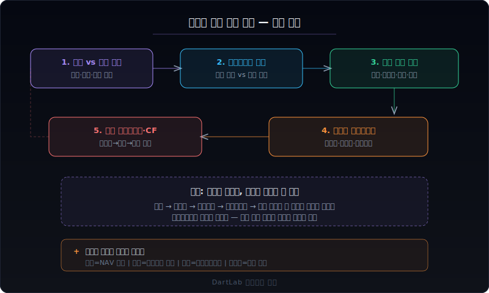
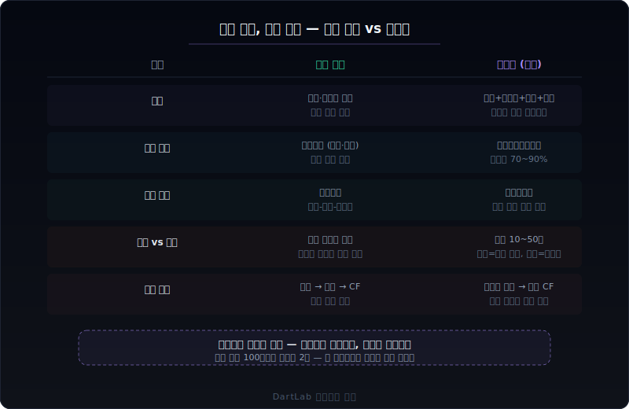
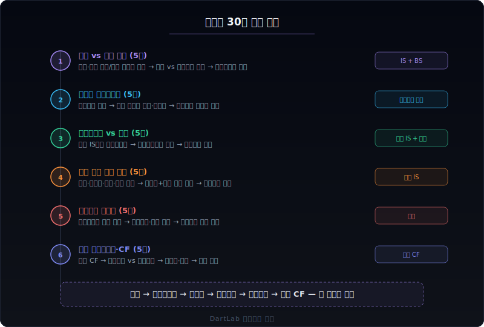

# 지주사 사업보고서는 무엇이 다른가

지주사 사업보고서를 일반 기업처럼 읽으면 모든 숫자가 이상하게 보인다. 매출이 수십조인데 영업이익이 몇 백억이고, 별도 재무제표를 보면 매출이 수천억으로 줄어든다. 자산의 대부분이 '종속기업투자주식'이고, 영업수익의 핵심이 '배당금수익'과 '브랜드 로열티'다. 지주사는 **직접 물건을 만들거나 서비스를 제공하지 않기 때문에** 재무제표의 읽는 법 자체가 달라야 한다.

핵심은 한 문장으로 줄일 수 있다. 지주사에서는 `연결 vs 별도 재무제표의 간극 → 지분법손익의 실체 → 별도 기준 수익 구조(배당+로열티+임대) → 자회사 지배구조와 내부거래 → 배당 파이프라인과 현금흐름`이라는 **구조 해독 루프**를 먼저 돌려야 한다. 연결만 보면 자회사 실적에 파묻히고, 별도만 보면 지주사의 진짜 역할이 안 보인다.

이 글은 지주사 사업보고서를 `연결·별도 간극 → 지분법손익 → 별도 수익 구조 → 자회사 포트폴리오 → 배당과 현금흐름` 순서로 읽는 방법을 정리한다. 순수지주사와 사업지주사의 차이, 금융지주와 일반지주의 차이까지 포함해서, 지주사 공시를 처음 읽는 사람이 어디서 시작하고 어디까지 확인해야 하는지를 보여준다.

---

## 같은 재무제표인데 지주사에서 해석이 완전히 달라지는 이유

일반 기업은 재무제표가 하나의 사업을 보여준다. 삼성전자의 매출은 반도체와 스마트폰을 팔아서 생긴 것이고, 현대차의 매출은 자동차를 팔아서 생긴 것이다. 지주사는 이 구조가 근본적으로 다르다.

**연결 재무제표와 별도 재무제표가 완전히 다른 이야기를 한다.** 일반 기업에서는 연결과 별도의 차이가 비교적 작다. 지주사에서는 차이가 극적이다. SK(주)의 연결 매출은 100조 원이 넘지만, 별도 매출은 2조 원도 안 된다. 연결은 SK하이닉스, SKT, SK이노베이션 등 자회사 전체를 합산한 것이고, 별도는 지주사 자체의 사업만 보여준다. 두 숫자가 50배 이상 차이 나는데, 어느 쪽을 봐야 하는지 모르면 분석 자체가 불가능하다.

**매출의 의미가 다르다.** 일반 기업의 매출은 제품이나 서비스를 외부에 판 금액이다. 순수지주사의 매출은 **자회사로부터 받은 배당금, 브랜드 로열티, 임대료, 경영자문료**다. 자회사가 벌어서 지주사로 올려보내는 돈이 지주사의 매출이다. 그래서 지주사의 매출을 볼 때는 '얼마를 벌었나'가 아니라 '자회사로부터 얼마를 회수하고 있는가'를 봐야 한다.

**자산의 핵심이 다르다.** 일반 기업은 공장, 설비, 재고가 핵심 자산이다. 지주사의 핵심 자산은 **종속기업투자주식**과 **관계기업투자주식**이다. 별도 재무상태표에서 이 항목이 전체 자산의 70~90%를 차지한다. 이 투자주식의 가치가 올라가거나 내려가면 지주사의 순자산이 크게 변동한다.

**이익의 구조가 다르다.** 일반 기업은 매출에서 원가를 빼면 이익이다. 지주사의 별도 손익에서 가장 큰 항목은 **지분법손익**이다. 자회사가 1조 원을 벌면 지분율만큼(예: 30%)이 지주사의 지분법이익으로 잡힌다. 이 숫자는 현금이 들어온 것이 아니라 회계상 인식한 것이다. 자회사가 배당을 안 하면 지분법이익은 있는데 현금은 없는 상황이 된다. [지분법손익은 본업과 어떻게 구분해서 읽어야 하나](/blog/associates-joint-ventures-and-equity-method)에서 이 구조를 상세히 다뤘다.

**내부거래가 핵심이다.** 일반 기업은 외부 거래가 대부분이다. 지주사 그룹에서는 자회사 간, 지주사-자회사 간 내부거래가 구조적으로 발생한다. 브랜드 로열티, 임대료, IT 서비스 용역, 인사 서비스 등. 이 내부거래 조건이 시장가와 비교해서 적정한지가 공정거래 이슈이자 소액주주 이익 침해 여부의 핵심이다.

---

## 지주사에서 먼저 봐야 할 5가지 숫자

지주사 사업보고서를 처음 펼쳤을 때, 아래 5가지를 이 순서대로 확인하면 지배구조와 현금흐름의 큰 그림이 빠르게 잡힌다.

### 1. 연결 vs 별도 재무제표의 간극

지주사 분석의 출발점이다. 두 재무제표의 간극이 지주사의 성격을 결정한다.

- **연결 매출 vs 별도 매출의 배율**: 연결이 별도의 10배 이상이면 순수지주사에 가깝다. 2~5배면 사업지주사(지주사 자체도 사업을 영위)다.
- **연결 자산 vs 별도 자산**: 별도 자산에서 종속기업투자주식이 차지하는 비중. 80% 이상이면 순수지주사 구조.
- **연결 이익 vs 별도 이익**: 별도 영업이익이 연결 대비 극히 작으면, 지주사 자체의 수익 창출 능력이 약하고 자회사에 완전히 의존하는 구조다.
- **비지배지분 비중**: 연결 자본 중 비지배지분이 차지하는 비율. 비지배지분이 크면 자회사 이익 중 지주사 몫이 작다는 뜻이다.

이 간극을 먼저 확인하지 않으면 지주사의 숫자를 전혀 맥락 없이 읽게 된다. 연결 매출 100조의 대그룹 지주사라 해도, 별도 기준으로는 매출 1~2조의 중소기업 규모일 수 있다.

### 2. 지분법손익의 실체

지주사 별도 손익에서 가장 큰 단일 항목이다.

- **지분법이익 규모**: 별도 당기순이익 대비 지분법이익 비중. 100%를 넘으면 지분법이익 없이는 적자라는 뜻이다.
- **지분법이익 vs 수취 배당금**: 지분법이익은 회계상 인식, 배당금은 실제 현금 유입이다. 지분법이익이 1000억인데 배당금이 300억이면, 700억은 종이 위의 이익이다.
- **지분법손실 발생 여부**: 특정 자회사가 적자면 지분법손실로 잡힌다. 어떤 자회사에서 손실이 나고 있는지 주석에서 확인한다.
- **지분법 적용 투자주식 장부가 변동**: 지분법이익이 쌓이면 투자주식 장부가가 올라가고, 배당을 받으면 내려간다. 이 변동 내역이 주석에 나온다.

지분법손익은 현금이 아니라는 점이 핵심이다. 자회사가 아무리 많이 벌어도 배당으로 올려보내지 않으면 지주사에는 현금이 없다. 이것이 '지주사 할인'의 근본 원인 중 하나다.

### 3. 별도 기준 수익 구조

지주사 자체가 어떻게 돈을 버는지를 보여준다.

- **배당금수익**: 자회사가 지주사에 보내는 배당. 지주사 현금 수입의 핵심. 어떤 자회사에서 얼마씩 올라오는지 주석에서 확인한다.
- **브랜드 로열티(상표권 사용료)**: 자회사가 그룹 브랜드를 쓰는 대가. 매출의 0.2~0.5% 수준이 일반적. 자회사 매출에 연동되므로 안정적이지만, 적정 수준인지 논란이 될 수 있다.
- **임대수익**: 지주사가 보유한 부동산을 자회사에 임대. 시장 임대료 대비 적정성이 이슈.
- **경영자문료·IT서비스료**: 지주사가 자회사에 경영 컨설팅, IT 인프라, 인사 서비스 등을 제공하고 받는 대가.

이 수익 항목들은 대부분 **자회사와의 내부거래**에서 발생한다. 외부 매출이 아니라 그룹 내부에서 돌아가는 돈이다. 그래서 이 수익의 규모보다 **조건의 적정성**이 더 중요한 분석 포인트다.

### 4. 자회사 포트폴리오와 지배구조

지주사의 가치는 결국 자회사 포트폴리오의 가치다.

- **핵심 자회사 목록과 지분율**: 어떤 자회사를 얼마의 지분으로 보유하고 있는지. 지분율이 높을수록 이익과 배당을 많이 가져온다.
- **자회사별 실적 기여도**: 연결 매출과 이익에서 각 자회사가 차지하는 비중. 특정 자회사에 과도하게 의존하면 리스크가 집중된다.
- **순환출자·교차출자 구조**: 자회사가 다시 지주사 주식을 보유하거나, 자회사끼리 교차 보유하는 구조. 공정거래법상 규제 대상이며, 지배구조 리스크의 원천.
- **자회사 인수·매각 이력**: 최근 어떤 자회사를 사고 팔았는지. 포트폴리오 전략의 방향을 보여준다. 인수 시 영업권(goodwill) 규모도 확인한다.
- **관계기업 vs 종속기업**: 지분율 50% 이상(또는 실질 지배)이면 종속기업으로 연결하고, 20~50%면 관계기업으로 지분법 적용한다.

사업보고서 '계열회사 현황' 섹션에 자회사 목록, 지분율, 주요 사업이 정리되어 있다. 여기서 지배구조의 전체 그림을 먼저 잡아야 한다.

### 5. 배당 파이프라인과 현금흐름

지주사의 실질 가치 환원 경로다.

- **자회사 → 지주사 배당 경로**: 핵심 자회사가 매년 얼마를 배당으로 올려보내는지. 배당성향이 낮으면 지주사에 현금이 적게 올라온다.
- **지주사 → 주주 배당**: 지주사가 받은 배당을 다시 자기 주주에게 얼마를 돌려주는지. 지주사 배당성향.
- **별도 기준 잉여현금흐름**: 별도 기준 영업CF에서 이자·배당 지급을 뺀 잉여 현금. 이것이 양수여야 지주사가 자체적으로 버틸 수 있다.
- **자회사 지분 취득·처분**: 자회사 지분을 추가 매입하면 현금이 빠지고, 처분하면 현금이 들어온다. 투자CF에서 확인한다.
- **차입금 규모와 이자 부담**: 지주사가 자회사 지분을 사기 위해 차입한 금액. 이자 부담이 배당 수입을 초과하면 구조적 적자다.

배당 파이프라인이 막히면 지주사는 현금이 말라간다. 자회사가 아무리 잘 벌어도 배당을 안 올려보내면 지주사 주주에게는 의미가 없다. 이것이 '지주사 할인'의 또 다른 근본 원인이다.

---

## 건강한 지주사 vs 위험한 지주사

같은 지주사라도 구조가 전혀 다를 수 있다. 아래 기준으로 나눠 보면 지주사의 체력이 빠르게 드러난다.

### 건강한 구조

- 핵심 자회사가 **안정적으로 이익을 내고 배당을 올려보낸다**. 배당성향이 30% 이상이고 매년 꾸준하다.
- 별도 기준 수익(배당+로열티+임대)이 **별도 판관비와 이자비용을 충분히 커버**한다. 자체 운영이 가능한 구조다.
- 자회사 포트폴리오가 **분산**되어 있다. 단일 자회사 의존도가 연결 이익의 50% 미만이다.
- 내부거래 조건이 **시장가와 크게 괴리되지 않는다**. 공정거래위원회 제재 이력이 없다.
- 지주사 자체 부채비율이 **100% 미만**이고, 차입금 이자가 배당 수입보다 적다.
- 주주환원 정책이 **명확**하다. 지주사 배당성향이 공시되어 있고 꾸준히 이행한다.

### 위험한 구조

- 핵심 자회사가 **적자이거나 배당을 줄이고 있다**. 지분법손실이 발생하고 있다.
- 별도 기준에서 **영업적자**다. 배당과 로열티만으로 판관비와 이자를 못 감당한다.
- **단일 자회사에 과도하게 의존**한다. 그 자회사가 부진하면 지주사 전체가 흔들린다.
- 내부거래 비율이 **매출의 80% 이상**이고, 로열티·임대료가 시장 대비 높다는 논란이 있다.
- 자회사 지분 매입을 위해 **대규모 차입**을 했고, 이자 부담이 배당 수입에 육박한다.
- 순환출자·사익편취 관련 **규제 리스크**가 있다. 공정거래법 위반 이력이 있다.
- '지주사 전환' 과정에서 인적분할한 사업부가 **경쟁력이 약화**되고 있다.

---

## 지주사 유형별로 다르게 읽어야 하는 포인트

### 순수지주사

자체 사업 없이 **오직 자회사 지분 보유와 경영 관리**만 한다. SK(주), LG(주), 한화(주) 등.

- 별도 매출 = 배당 + 로열티 + 임대 + 자문료. 외부 매출이 거의 없다.
- 연결과 별도의 간극이 가장 크다 (10배~50배).
- 분석 핵심: 자회사 포트폴리오 가치 vs 지주사 시가총액. 이 차이가 '지주사 할인율'.
- NAV(순자산가치) 분석이 핵심 밸류에이션 도구다. 자회사 상장주식 시가 + 비상장 장부가 - 순부채 = NAV.

### 사업지주사

지주 기능과 **자체 사업을 동시에 영위**한다. 삼성물산, CJ(주), 두산(주) 등.

- 별도 매출에 자체 사업 매출이 포함되어 있어서 순수지주사보다 간극이 작다.
- 자체 사업의 수익성과 자회사 포트폴리오의 가치를 **분리해서** 봐야 한다.
- 자체 사업이 적자면서 자회사 배당에 의존하는 구조가 위험하다.
- 사업부문별 영업이익을 세그먼트에서 확인해야 한다.

### 금융지주

은행·증권·보험·카드 등 금융 자회사를 보유한 지주사. KB금융, 신한지주, 하나금융 등.

- 금융업 고유의 규제가 적용된다 (BIS 비율, 대주주 적격성 등).
- 자회사 간 시너지가 일반 지주사보다 명확하다 (은행-증권-보험 교차판매).
- 배당 파이프라인이 상대적으로 투명하다. 금융지주의 배당은 자회사 배당에 직접 연동.
- [금융업 사업보고서는 무엇이 다른가](/blog/financial-company-filings)의 프레임이 자회사 분석에 그대로 적용된다.
- 이중레버리지비율(Double Leverage Ratio)이 추가 확인 포인트. 자회사 출자가 자기자본 대비 과도한지 본다.

### 공기업·공공지주

한국전력, 한국토지주택공사(LH) 등 공공 목적의 지주 구조.

- 수익 극대화보다 **공공 서비스 제공**이 목적이라 일반 지주사와 판단 기준이 다르다.
- 정부 정책에 따라 요금이 결정되므로 자회사 수익성이 정책 변수에 크게 좌우된다.
- 부채가 크더라도 정부 보증이 있어서 일반 기업과 같은 잣대로 보기 어렵다.

---

## 지주사 사업보고서 30분 읽기 루프

**1단계 — 연결 vs 별도 간극 확인 (5분)**
연결 매출/이익과 별도 매출/이익을 나란히 놓는다. 간극의 크기로 순수지주사인지 사업지주사인지 파악한다. 비지배지분 비중도 확인한다.

**2단계 — 자회사 포트폴리오 파악 (5분)**
사업보고서의 '계열회사 현황'에서 핵심 자회사 목록, 지분율, 주요 사업을 정리한다. 어떤 자회사가 연결 이익의 몇 %를 차지하는지 확인한다.

**3단계 — 지분법손익과 배당 대조 (5분)**
별도 손익계산서에서 지분법이익과 배당금수익을 찾는다. 지분법이익 대비 배당금이 얼마인지, 즉 자회사가 번 돈 중 실제로 현금으로 올라오는 비율을 확인한다.

**4단계 — 별도 수익 구조 분해 (5분)**
별도 매출에서 배당, 로열티, 임대, 자문료를 분리한다. 이 수익이 별도 판관비와 이자비용을 커버하는지 확인한다. 내부거래 비중도 본다.

**5단계 — 내부거래 적정성 확인 (5분)**
주석의 특수관계자 거래에서 주요 내부거래 유형과 금액을 확인한다. 로열티율, 임대 조건이 시장 수준인지, 공정거래위원회 지적 이력이 있는지 본다.

**6단계 — 배당 파이프라인과 현금흐름 (5분)**
별도 현금흐름표에서 배당 수입(영업CF 또는 투자CF)과 배당 지급(재무CF)을 확인한다. 차입금 규모와 이자 부담을 배당 수입과 대비한다. 자회사 지분 변동도 투자CF에서 확인한다.

---

## 비교 체크리스트

| 확인 항목 | 건강한 신호 | 위험한 신호 |
|---|---|---|
| 연결 vs 별도 간극 | 자회사 분산, 비지배 적정 | 단일 자회사 의존, 비지배 과다 |
| 지분법이익 vs 배당 | 배당/지분법 > 30% | 지분법만 크고 배당 미미 |
| 별도 영업이익 | 흑자, 자체 운영 가능 | 적자, 배당 없으면 존속 곤란 |
| 내부거래 조건 | 시장가 수준, 제재 이력 없음 | 시장 대비 과도, 규제 리스크 |
| 차입 vs 배당 수입 | 이자 &lt; 배당 수입 | 이자 ≈ 또는 > 배당 수입 |
| 자회사 포트폴리오 | 분산, 성장 자회사 보유 | 편중, 핵심 자회사 부진 |
| 주주환원 | 배당 정책 명확, 꾸준 이행 | 배당 불규칙, 자사주 미소각 |

---

## FAQ

**지주사 할인이란 무엇인가?**

지주사 시가총액이 보유 자회사 지분의 시장가치 합계보다 낮은 현상이다. 예를 들어 지주사가 보유한 상장 자회사 주식의 시가가 10조인데 지주사 시가총액이 5조라면 50% 할인이다. 원인은 복합적이다. ① 자회사 이익이 배당으로 100% 올라오지 않는다 ② 지주사 자체 비용이 있다 ③ 지배구조 리스크 프리미엄 ④ 복잡한 구조에 대한 투자자 기피. 할인율 자체가 투자 판단의 핵심 지표가 된다.

**순수지주사와 사업지주사 중 어떤 것이 분석하기 쉬운가?**

순수지주사가 구조적으로 더 단순하다. 자체 사업이 없으니 자회사 포트폴리오 가치와 배당 파이프라인만 보면 된다. 사업지주사는 자체 사업의 수익성과 자회사 포트폴리오를 분리해서 봐야 하므로 더 복잡하다. 하지만 순수지주사도 자회사가 수십 개이고 비상장 자회사가 많으면 가치 평가가 어려워진다.

**지분법이익이 크면 좋은 것 아닌가?**

회계상으로는 그렇다. 하지만 지분법이익은 현금이 아니다. 자회사가 1조를 벌어서 지분율 30%로 3000억이 지분법이익으로 잡혀도, 자회사가 배당을 1000억만 하면 지주사에 실제로 들어온 현금은 300억(30%)뿐이다. 나머지 2700억은 장부 위의 숫자다. 그래서 지분법이익보다 **실제 수취 배당금**이 더 중요한 지표다.

**내부거래 비율이 높으면 반드시 문제인가?**

그 자체로 문제는 아니다. 지주사 구조에서 내부거래는 필연적이다. 문제는 내부거래 **조건**이다. 브랜드 로열티가 시장 대비 과도하거나, 임대료가 시세보다 높거나, 일감 몰아주기로 자회사가 부당한 이익을 주는 구조면 소액주주 이익 침해이자 공정거래법 위반이다. 사업보고서의 특수관계자 거래 주석과 공정거래위원회 공시를 같이 봐야 한다.

**지주사 전환은 왜 하는가?**

크게 세 가지 이유다. ① **지배구조 투명화**: 순환출자를 해소하고 지주사-자회사 수직 구조로 정리 ② **자회사 관리 효율화**: 지주사가 포트폴리오 전략을 총괄하고 자회사는 사업에 집중 ③ **지배력 강화**: 적은 자본으로 그룹 전체를 지배하는 레버리지 구조. 인적분할 후 지주사 전환이 일반적 경로이며, 분할 과정에서 주주가치 변화를 주의 깊게 봐야 한다.

---

## 기존 글로 더 깊이 들어가기

이 글은 지주사라는 구조적 맥락에서 읽기 순서를 정리한 허브다. 각 항목을 더 깊게 파고 싶으면 아래 글로 들어가면 된다.

**지분법과 연결**
- [지분법손익은 본업과 어떻게 구분해서 읽어야 하나](/blog/associates-joint-ventures-and-equity-method) — 지분법이익의 실체와 현금 괴리

**내부거래와 지배구조**
- [특수관계자 거래는 어디서 위험 신호가 나오나](/blog/related-party-sales-distortion) — 내부거래 적정성 판단
- [지급보증·담보·약정 공시](/blog/guarantees-collateral-and-commitments) — 지주사의 자회사 지급보증 구조

**배당과 주주환원**
- [좋은 배당 vs 위험한 배당은 어디서 갈리나](/blog/shareholder-return-what-matters) — 배당 파이프라인의 지속 가능성

**자산 가치와 손상**
- [기타포괄손익 누적은 어디서 진짜 위험인가](/blog/accumulated-oci-what-it-hides) — 투자주식 가치 변동이 자본에 미치는 영향
- [숫자만 보면 왜 자주 틀리나](/blog/beyond-the-numbers) — 재무제표 해석의 기본 프레임

---

## 출처

- 공정거래법(독점규제 및 공정거래에 관한 법률) — 지주회사 행위 제한, 내부거래 공시
- K-IFRS 제1028호 '관계기업과 공동기업에 대한 투자' — 지분법 적용 기준
- K-IFRS 제1110호 '연결재무제표' — 종속기업 연결 기준, 비지배지분
- 금융감독원 전자공시시스템(DART) — 지주사 사업보고서 원문

---

## 한 줄 정리

지주사 사업보고서는 연결만 봐서도, 별도만 봐서도 안 된다. **연결·별도 간극 → 지분법손익의 현금 실체 → 별도 수익 구조 → 자회사 포트폴리오 → 배당 파이프라인**의 구조 해독 루프를 돌려야 지주사의 진짜 가치와 리스크가 보인다.
